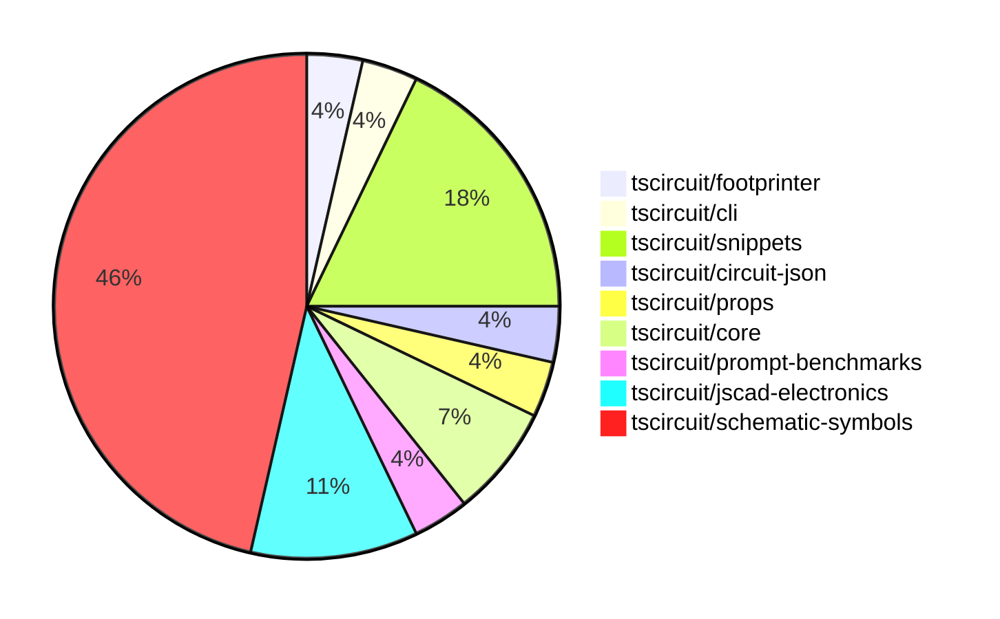

# Contribution Overview 2024-10-05

## PRs by Repository

## Contributor Overview

| Contributor | 🐳 Major | 🐙 Minor | 🐌 Tiny |
|-------------|-------|-------|-------|
| DhairyaMajmudar | 1 | 2 | 0 |
| ShiboSoftwareDev | 3 | 0 | 0 |
| seveibar | 4 | 3 | 0 |
| anas-sarkez | 1 | 1 | 0 |
| aman1376 | 3 | 0 | 0 |
| 0xkafkaa | 4 | 0 | 0 |
| Timer00 | 1 | 0 | 0 |
| bbland1 | 3 | 1 | 0 |
| imrishabh18 | 1 | 0 | 0 |

## Changes by Repository

### [tscircuit/footprinter](https://github.com/tscircuit/footprinter)

| PR # | Impact | Contributor | Description |
|------|--------|-------------|-------------|
| [#48](https://github.com/tscircuit/footprinter/pull/48) | 🐳 Major | DhairyaMajmudar | Adding SOT363 circuit |

### [tscircuit/cli](https://github.com/tscircuit/cli)

| PR # | Impact | Contributor | Description |
|------|--------|-------------|-------------|
| [#215](https://github.com/tscircuit/cli/pull/215) | 🐙 Minor | DhairyaMajmudar | Refactoring files for better using TypeScript types by removing `any` keywords and replacing suitable types and removing unused imports. |

### [tscircuit/snippets](https://github.com/tscircuit/snippets)

| PR # | Impact | Contributor | Description |
|------|--------|-------------|-------------|
| [#23](https://github.com/tscircuit/snippets/pull/23) | 🐳 Major | seveibar | Introduce AI chat improvements and link improvements |
| [#12](https://github.com/tscircuit/snippets/pull/12) | 🐳 Major | seveibar | Adds support for sessions, login pages, and accounts to the database schema and client. |
| [#10](https://github.com/tscircuit/snippets/pull/10) | 🐙 Minor | DhairyaMajmudar | The pull request adds the functionality to hide the "Onboarding Tips" section by clicking on the cross button. |
| [#21](https://github.com/tscircuit/snippets/pull/21) | 🐙 Minor | seveibar | Add an empty state message and account balance display to the AI chat interface. |
| [#13](https://github.com/tscircuit/snippets/pull/13) | 🐙 Minor | seveibar | Formats the repository, adds Vercel rewrites, and fixes minor issues. |

### [tscircuit/circuit-json](https://github.com/tscircuit/circuit-json)

| PR # | Impact | Contributor | Description |
|------|--------|-------------|-------------|
| [#56](https://github.com/tscircuit/circuit-json/pull/56) | 🐳 Major | ShiboSoftwareDev | Add a new component `pcb_solder_paste` to represent solder paste on a PCB. |

### [tscircuit/props](https://github.com/tscircuit/props)

| PR # | Impact | Contributor | Description |
|------|--------|-------------|-------------|
| [#56](https://github.com/tscircuit/props/pull/56) | 🐳 Major | ShiboSoftwareDev | Introduce a new component called `solderpaste` for PCB layout, with support for both rectangular and circular shapes. |

### [tscircuit/core](https://github.com/tscircuit/core)

| PR # | Impact | Contributor | Description |
|------|--------|-------------|-------------|
| [#136](https://github.com/tscircuit/core/pull/136) | 🐳 Major | ShiboSoftwareDev | Create a new `pcb_solder_paste` component based on the `smtpads` component. |
| [#137](https://github.com/tscircuit/core/pull/137) | 🐳 Major | seveibar | Improve the invalid prop error handling in the `PrimitiveComponent` class by throwing a custom `InvalidProps` error with a detailed error message. |

### [tscircuit/prompt-benchmarks](https://github.com/tscircuit/prompt-benchmarks)

| PR # | Impact | Contributor | Description |
|------|--------|-------------|-------------|
| [#2](https://github.com/tscircuit/prompt-benchmarks/pull/2) | 🐳 Major | seveibar | Add support for running generated code and testing with threshold acceptance |

### [tscircuit/jscad-electronics](https://github.com/tscircuit/jscad-electronics)

| PR # | Impact | Contributor | Description |
|------|--------|-------------|-------------|
| [#58](https://github.com/tscircuit/jscad-electronics/pull/58) | 🐳 Major | anas-sarkez | Fixed the layout of the SOT-23, SOT-563, and SOT-723 component models to match their actual footprints. |
| [#61](https://github.com/tscircuit/jscad-electronics/pull/61) | 🐙 Minor | seveibar | Add a CODEOWNERS file to specify the maintainers of the repository. |
| [#60](https://github.com/tscircuit/jscad-electronics/pull/60) | 🐙 Minor | anas-sarkez | Added the `showGrid` property to all test examples |

### [tscircuit/schematic-symbols](https://github.com/tscircuit/schematic-symbols)

| PR # | Impact | Contributor | Description |
|------|--------|-------------|-------------|
| [#150](https://github.com/tscircuit/schematic-symbols/pull/150) | 🐳 Major | aman1376 | Add an SVG file for an n-JFET transistor symbol and a corresponding JSON file with the symbol data. |
| [#149](https://github.com/tscircuit/schematic-symbols/pull/149) | 🐳 Major | aman1376 | Add a new PJFET transistor symbol and JSON configuration file. |
| [#130](https://github.com/tscircuit/schematic-symbols/pull/130) | 🐳 Major | aman1376 | Introduce a new TypeScript type `BaseSymbolName` that represents the list of base symbol names. |
| [#145](https://github.com/tscircuit/schematic-symbols/pull/145) | 🐳 Major | 0xkafkaa | Add a new symbol "crystal" with JSON and SVG files. |
| [#146](https://github.com/tscircuit/schematic-symbols/pull/146) | 🐳 Major | 0xkafkaa | Add a new resonator feature |
| [#137](https://github.com/tscircuit/schematic-symbols/pull/137) | 🐳 Major | 0xkafkaa | Add a step recovery diode symbol definition |
| [#133](https://github.com/tscircuit/schematic-symbols/pull/133) | 🐳 Major | 0xkafkaa | Adds a new JSON file and SVG file for a Gunn diode symbol. |
| [#136](https://github.com/tscircuit/schematic-symbols/pull/136) | 🐳 Major | Timer00 | Introduce snapshot testing for SVG symbols |
| [#132](https://github.com/tscircuit/schematic-symbols/pull/132) | 🐳 Major | bbland1 | Center diamond update to fix the off-center green dot issue in the `silicon_controlled_rectifier` symbol. |
| [#110](https://github.com/tscircuit/schematic-symbols/pull/110) | 🐳 Major | bbland1 | Add a new SVG and JSON files for a diac symbol. |
| [#111](https://github.com/tscircuit/schematic-symbols/pull/111) | 🐳 Major | bbland1 | Adds an SVG and TypeScript definition for a unijunction transistor symbol. |
| [#135](https://github.com/tscircuit/schematic-symbols/pull/135) | 🐳 Major | imrishabh18 | Adding support for cubic bezier curve in the `svgPathToPoints` function |
| [#131](https://github.com/tscircuit/schematic-symbols/pull/131) | 🐙 Minor | bbland1 | Fixing the reference point (REF) in the diac symbol |

## Changes by Contributor

### [DhairyaMajmudar](https://github.com/DhairyaMajmudar)

| PR # | Impact | Description |
|------|--------|-------------|
| [#48](https://github.com/tscircuit/footprinter/pull/48) | 🐳 Major | Adding SOT363 circuit |
| [#215](https://github.com/tscircuit/cli/pull/215) | 🐙 Minor | Refactoring files for better using TypeScript types by removing `any` keywords and replacing suitable types and removing unused imports. |
| [#10](https://github.com/tscircuit/snippets/pull/10) | 🐙 Minor | The pull request adds the functionality to hide the "Onboarding Tips" section by clicking on the cross button. |

### [ShiboSoftwareDev](https://github.com/ShiboSoftwareDev)

| PR # | Impact | Description |
|------|--------|-------------|
| [#56](https://github.com/tscircuit/circuit-json/pull/56) | 🐳 Major | Add a new component `pcb_solder_paste` to represent solder paste on a PCB. |
| [#56](https://github.com/tscircuit/props/pull/56) | 🐳 Major | Introduce a new component called `solderpaste` for PCB layout, with support for both rectangular and circular shapes. |
| [#136](https://github.com/tscircuit/core/pull/136) | 🐳 Major | Create a new `pcb_solder_paste` component based on the `smtpads` component. |

### [seveibar](https://github.com/seveibar)

| PR # | Impact | Description |
|------|--------|-------------|
| [#137](https://github.com/tscircuit/core/pull/137) | 🐳 Major | Improve the invalid prop error handling in the `PrimitiveComponent` class by throwing a custom `InvalidProps` error with a detailed error message. |
| [#23](https://github.com/tscircuit/snippets/pull/23) | 🐳 Major | Introduce AI chat improvements and link improvements |
| [#12](https://github.com/tscircuit/snippets/pull/12) | 🐳 Major | Adds support for sessions, login pages, and accounts to the database schema and client. |
| [#2](https://github.com/tscircuit/prompt-benchmarks/pull/2) | 🐳 Major | Add support for running generated code and testing with threshold acceptance |
| [#61](https://github.com/tscircuit/jscad-electronics/pull/61) | 🐙 Minor | Add a CODEOWNERS file to specify the maintainers of the repository. |
| [#21](https://github.com/tscircuit/snippets/pull/21) | 🐙 Minor | Add an empty state message and account balance display to the AI chat interface. |
| [#13](https://github.com/tscircuit/snippets/pull/13) | 🐙 Minor | Formats the repository, adds Vercel rewrites, and fixes minor issues. |

### [anas-sarkez](https://github.com/anas-sarkez)

| PR # | Impact | Description |
|------|--------|-------------|
| [#58](https://github.com/tscircuit/jscad-electronics/pull/58) | 🐳 Major | Fixed the layout of the SOT-23, SOT-563, and SOT-723 component models to match their actual footprints. |
| [#60](https://github.com/tscircuit/jscad-electronics/pull/60) | 🐙 Minor | Added the `showGrid` property to all test examples |

### [aman1376](https://github.com/aman1376)

| PR # | Impact | Description |
|------|--------|-------------|
| [#150](https://github.com/tscircuit/schematic-symbols/pull/150) | 🐳 Major | Add an SVG file for an n-JFET transistor symbol and a corresponding JSON file with the symbol data. |
| [#149](https://github.com/tscircuit/schematic-symbols/pull/149) | 🐳 Major | Add a new PJFET transistor symbol and JSON configuration file. |
| [#130](https://github.com/tscircuit/schematic-symbols/pull/130) | 🐳 Major | Introduce a new TypeScript type `BaseSymbolName` that represents the list of base symbol names. |

### [0xkafkaa](https://github.com/0xkafkaa)

| PR # | Impact | Description |
|------|--------|-------------|
| [#145](https://github.com/tscircuit/schematic-symbols/pull/145) | 🐳 Major | Add a new symbol "crystal" with JSON and SVG files. |
| [#146](https://github.com/tscircuit/schematic-symbols/pull/146) | 🐳 Major | Add a new resonator feature |
| [#137](https://github.com/tscircuit/schematic-symbols/pull/137) | 🐳 Major | Add a step recovery diode symbol definition |
| [#133](https://github.com/tscircuit/schematic-symbols/pull/133) | 🐳 Major | Adds a new JSON file and SVG file for a Gunn diode symbol. |

### [Timer00](https://github.com/Timer00)

| PR # | Impact | Description |
|------|--------|-------------|
| [#136](https://github.com/tscircuit/schematic-symbols/pull/136) | 🐳 Major | Introduce snapshot testing for SVG symbols |

### [bbland1](https://github.com/bbland1)

| PR # | Impact | Description |
|------|--------|-------------|
| [#132](https://github.com/tscircuit/schematic-symbols/pull/132) | 🐳 Major | Center diamond update to fix the off-center green dot issue in the `silicon_controlled_rectifier` symbol. |
| [#110](https://github.com/tscircuit/schematic-symbols/pull/110) | 🐳 Major | Add a new SVG and JSON files for a diac symbol. |
| [#111](https://github.com/tscircuit/schematic-symbols/pull/111) | 🐳 Major | Adds an SVG and TypeScript definition for a unijunction transistor symbol. |
| [#131](https://github.com/tscircuit/schematic-symbols/pull/131) | 🐙 Minor | Fixing the reference point (REF) in the diac symbol |

### [imrishabh18](https://github.com/imrishabh18)

| PR # | Impact | Description |
|------|--------|-------------|
| [#135](https://github.com/tscircuit/schematic-symbols/pull/135) | 🐳 Major | Adding support for cubic bezier curve in the `svgPathToPoints` function |

