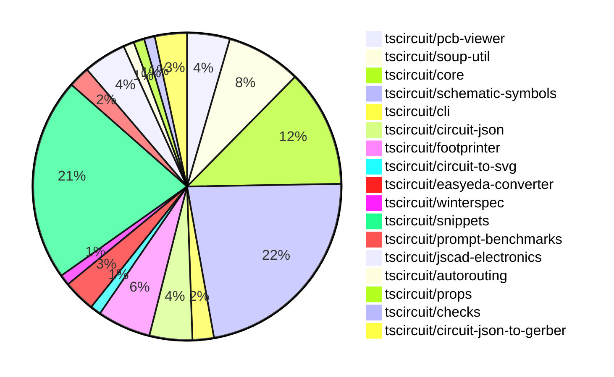

# Contribution Overview 2024-10-05

## PRs by Repository

## Contributor Overview

| Contributor | 🐳 Major | 🐙 Minor | 🐌 Tiny |
|-------------|-------|-------|-------|
| imrishabh18 | 6 | 13 | 1 |
| seveibar | 23 | 3 | 2 |
| DhairyaMajmudar | 2 | 3 | 0 |
| anas-sarkez | 2 | 4 | 0 |
| ShiboSoftwareDev | 5 | 2 | 1 |
| andrii-balitskyi | 1 | 0 | 0 |
| mrudulpatil18 | 2 | 0 | 0 |
| 0SlowPoke0 | 1 | 0 | 0 |
| aman1376 | 6 | 1 | 0 |
| Complexlity | 1 | 0 | 0 |
| 0xkafkaa | 4 | 0 | 0 |
| Timer00 | 1 | 0 | 0 |
| bbland1 | 3 | 1 | 0 |
| PALLAVIKHEDLE | 1 | 0 | 0 |

## Changes by Repository

### [tscircuit/pcb-viewer](https://github.com/tscircuit/pcb-viewer)

| PR # | Impact | Contributor | Description |
|------|--------|-------------|-------------|
| [#73](https://github.com/tscircuit/pcb-viewer/pull/73) | 🐳 Major | imrishabh18 | Refactor the PCBViewer component by removing the `@tscircuit/builder` dependency and using the `@tscircuit/core` instead. |
| [#71](https://github.com/tscircuit/pcb-viewer/pull/71) | 🐳 Major | seveibar | Reverts the previous change that broke the PCB viewer's bounds computation. |
| [#70](https://github.com/tscircuit/pcb-viewer/pull/70) | 🐳 Major | seveibar | Convert children rendering to core |
| [#74](https://github.com/tscircuit/pcb-viewer/pull/74) | 🐙 Minor | imrishabh18 | Refactor/remove builder for the `@tscircuit/core` package and update the version to `0.0.109` |

### [tscircuit/soup-util](https://github.com/tscircuit/soup-util)

| PR # | Impact | Contributor | Description |
|------|--------|-------------|-------------|
| [#20](https://github.com/tscircuit/soup-util/pull/20) | 🐳 Major | imrishabh18 | Port the `findBoundsAndCenter` function from builder to this repo. |
| [#23](https://github.com/tscircuit/soup-util/pull/23) | 🐙 Minor | imrishabh18 | Fix a type issue in the `find-bounds-and-center.ts` file. |
| [#22](https://github.com/tscircuit/soup-util/pull/22) | 🐙 Minor | imrishabh18 | Revert the previous change that exported a function. |
| [#21](https://github.com/tscircuit/soup-util/pull/21) | 🐙 Minor | imrishabh18 | Exports the "find-bounds-and-center" function from the library. |
| [#18](https://github.com/tscircuit/soup-util/pull/18) | 🐙 Minor | imrishabh18 | Update the `circuit-json` dependency to the latest version `0.0.85`. |
| [#17](https://github.com/tscircuit/soup-util/pull/17) | 🐙 Minor | imrishabh18 | Deletes an unused dependency from the project |
| [#19](https://github.com/tscircuit/soup-util/pull/19) | 🐌 Tiny | imrishabh18 | Updates the lock file to ensure consistency across environments. |

### [tscircuit/core](https://github.com/tscircuit/core)

| PR # | Impact | Contributor | Description |
|------|--------|-------------|-------------|
| [#153](https://github.com/tscircuit/core/pull/153) | 🐳 Major | imrishabh18 | Added new components SilkscreenCircle and SilkscreenRect to the library. |
| [#151](https://github.com/tscircuit/core/pull/151) | 🐳 Major | imrishabh18 | Introduce a new primitive component called "Via" to the project. |
| [#139](https://github.com/tscircuit/core/pull/139) | 🐳 Major | imrishabh18 | Fix chip placement issue by updating the `getAllDimensionsForSchematicBox` function to properly calculate the dimensions of the schematic box. |
| [#157](https://github.com/tscircuit/core/pull/157) | 🐳 Major | seveibar | Introduce a new function `createUseComponent` that creates a React component with custom props and traces. |
| [#149](https://github.com/tscircuit/core/pull/149) | 🐳 Major | seveibar | Introduce a new hook called `useRenderedCircuit` that allows for converting React elements into a `Circuit` instance and its corresponding JSON representation. |
| [#137](https://github.com/tscircuit/core/pull/137) | 🐳 Major | seveibar | Improve invalid prop errors by providing more detailed error messages when component props are invalid. |
| [#136](https://github.com/tscircuit/core/pull/136) | 🐳 Major | ShiboSoftwareDev | Introduces a new component `pcb_solder_paste` that is created from `smtpads`. |
| [#155](https://github.com/tscircuit/core/pull/155) | 🐙 Minor | imrishabh18 | Add aliases "left" and "right" to the Capacitor and Resistor components. |
| [#143](https://github.com/tscircuit/core/pull/143) | 🐙 Minor | imrishabh18 | Update package to smaller bundle size |
| [#141](https://github.com/tscircuit/core/pull/141) | 🐙 Minor | imrishabh18 | Update the project to use the latest version of the `@tscircuit/footprinter` package without the `lodash` dependency. |
| [#138](https://github.com/tscircuit/core/pull/138) | 🐙 Minor | ShiboSoftwareDev | Inherit the `_setPositionFromLayout` behavior from `pcb_smt_pad` to `pcb_solder_paste`. |

### [tscircuit/schematic-symbols](https://github.com/tscircuit/schematic-symbols)

| PR # | Impact | Contributor | Description |
|------|--------|-------------|-------------|
| [#135](https://github.com/tscircuit/schematic-symbols/pull/135) | 🐳 Major | imrishabh18 | Adding support for cubic bezier curve (C) command in the SVG path parsing function. |
| [#156](https://github.com/tscircuit/schematic-symbols/pull/156) | 🐳 Major | mrudulpatil18 | Add SVG for NPN bipolar transistor component. |
| [#157](https://github.com/tscircuit/schematic-symbols/pull/157) | 🐳 Major | 0SlowPoke0 | Fixes issue #119 by adding a new JSON file and SVG file for a filled diode symbol. |
| [#154](https://github.com/tscircuit/schematic-symbols/pull/154) | 🐳 Major | aman1376 | Add a new P-channel E-MOSFET transistor symbol |
| [#151](https://github.com/tscircuit/schematic-symbols/pull/151) | 🐳 Major | aman1376 | Add a new n-channel MOSFET transistor component to the assets. |
| [#152](https://github.com/tscircuit/schematic-symbols/pull/152) | 🐳 Major | aman1376 | Add P-Channel D-MOSFET transistor symbol in JSON and SVG format. |
| [#150](https://github.com/tscircuit/schematic-symbols/pull/150) | 🐳 Major | aman1376 | Add an SVG and JSON file for an n-JFET transistor symbol. |
| [#149](https://github.com/tscircuit/schematic-symbols/pull/149) | 🐳 Major | aman1376 | Add a new PJFET transistor symbol and JSON definition. |
| [#130](https://github.com/tscircuit/schematic-symbols/pull/130) | 🐳 Major | aman1376 | Introduce a new TypeScript type `BaseSymbolName` that represents the list of base symbol names. |
| [#102](https://github.com/tscircuit/schematic-symbols/pull/102) | 🐳 Major | Complexlity | Introduce a new type `Primitive` to the `getTsFileContentForSvgGroup` function to provide type completion for the `texts` array. |
| [#145](https://github.com/tscircuit/schematic-symbols/pull/145) | 🐳 Major | 0xkafkaa | Add a new SVG image and JSON data for a "crystal" component. |
| [#146](https://github.com/tscircuit/schematic-symbols/pull/146) | 🐳 Major | 0xkafkaa | Add a new 'resonator' feature |
| [#137](https://github.com/tscircuit/schematic-symbols/pull/137) | 🐳 Major | 0xkafkaa | Add a new component, step recovery diode, to the project. |
| [#133](https://github.com/tscircuit/schematic-symbols/pull/133) | 🐳 Major | 0xkafkaa | Adds a new JSON file 'gunn_diode.json' and an SVG file 'gunn.svg' to the project. |
| [#136](https://github.com/tscircuit/schematic-symbols/pull/136) | 🐳 Major | Timer00 | Adds snapshot tests for SVG symbols to ensure consistent rendering |
| [#132](https://github.com/tscircuit/schematic-symbols/pull/132) | 🐳 Major | bbland1 | Fixes the issue where the green center dot generated by the code was off-center for some symbols. |
| [#110](https://github.com/tscircuit/schematic-symbols/pull/110) | 🐳 Major | bbland1 | Add new SVG and TypeScript files for a DIAC (Diode in Antiparallel) component. |
| [#111](https://github.com/tscircuit/schematic-symbols/pull/111) | 🐳 Major | bbland1 | Create an SVG and TypeScript file for a unijunction transistor symbol. |
| [#158](https://github.com/tscircuit/schematic-symbols/pull/158) | 🐙 Minor | aman1376 | Add a new SPST switch symbol |
| [#131](https://github.com/tscircuit/schematic-symbols/pull/131) | 🐙 Minor | bbland1 | Fixing the reference ({REF}) position in the diac symbol |

### [tscircuit/cli](https://github.com/tscircuit/cli)

| PR # | Impact | Contributor | Description |
|------|--------|-------------|-------------|
| [#226](https://github.com/tscircuit/cli/pull/226) | 🐙 Minor | imrishabh18 | Update the `circuit-to-svg` dependency to a newer version to address warning messages and dependency issues. |
| [#215](https://github.com/tscircuit/cli/pull/215) | 🐙 Minor | DhairyaMajmudar | Refactoring files for better use of TypeScript types by removing `any` keywords and replacing them with suitable types, as well as removing unused imports. |

### [tscircuit/circuit-json](https://github.com/tscircuit/circuit-json)

| PR # | Impact | Contributor | Description |
|------|--------|-------------|-------------|
| [#55](https://github.com/tscircuit/circuit-json/pull/55) | 🐳 Major | seveibar | Adds a GitHub Actions workflow to run tests for the Bun runtime. |
| [#56](https://github.com/tscircuit/circuit-json/pull/56) | 🐳 Major | ShiboSoftwareDev | Introduces a new component called `pcb_solder_paste` for defining solder paste on a PCB. |
| [#58](https://github.com/tscircuit/circuit-json/pull/58) | 🐙 Minor | imrishabh18 | Add the `display_value` property to the `SourceComponentBase` type |
| [#57](https://github.com/tscircuit/circuit-json/pull/57) | 🐙 Minor | anas-sarkez | Add mil unit and format script |

### [tscircuit/footprinter](https://github.com/tscircuit/footprinter)

| PR # | Impact | Contributor | Description |
|------|--------|-------------|-------------|
| [#61](https://github.com/tscircuit/footprinter/pull/61) | 🐳 Major | seveibar | Add error handling for invalid footprint function strings in the `footprinter` module. |
| [#48](https://github.com/tscircuit/footprinter/pull/48) | 🐳 Major | DhairyaMajmudar | Adding SOT363 circuit |
| [#55](https://github.com/tscircuit/footprinter/pull/55) | 🐙 Minor | imrishabh18 | Update the dependencies in the package.json file, including upgrading the "@biomejs/biome" package from version 1.9.2 to 1.9.3 and the "@tscircuit/mm" package from 0.0.7 to 0.0.8. |
| [#58](https://github.com/tscircuit/footprinter/pull/58) | 🐙 Minor | anas-sarkez | Modified test files and added preload |
| [#56](https://github.com/tscircuit/footprinter/pull/56) | 🐙 Minor | anas-sarkez | Migrate the test framework from ava to bun |

### [tscircuit/circuit-to-svg](https://github.com/tscircuit/circuit-to-svg)

| PR # | Impact | Contributor | Description |
|------|--------|-------------|-------------|
| [#82](https://github.com/tscircuit/circuit-to-svg/pull/82) | 🐙 Minor | imrishabh18 | The change fixes the placement of chip ports in the schematic. |

### [tscircuit/easyeda-converter](https://github.com/tscircuit/easyeda-converter)

| PR # | Impact | Contributor | Description |
|------|--------|-------------|-------------|
| [#46](https://github.com/tscircuit/easyeda-converter/pull/46) | 🐳 Major | seveibar | Convert the project to use ECMAScript modules (ESM) instead of CommonJS (CJS) |
| [#45](https://github.com/tscircuit/easyeda-converter/pull/45) | 🐳 Major | seveibar | The pull request adds more usage details to the README, migrates the library to use `circuit-json` and `@tscircuit/soup-util` instead of `@tscircuit/soup`, and removes the `@tscircuit/builder` dependency. |
| [#44](https://github.com/tscircuit/easyeda-converter/pull/44) | 🐳 Major | andrii-balitskyi | Fix build and add typecheck workflow |

### [tscircuit/winterspec](https://github.com/tscircuit/winterspec)

| PR # | Impact | Contributor | Description |
|------|--------|-------------|-------------|
| [#12](https://github.com/tscircuit/winterspec/pull/12) | 🐳 Major | seveibar | Fix Routes Directory Loading issue |

### [tscircuit/snippets](https://github.com/tscircuit/snippets)

| PR # | Impact | Contributor | Description |
|------|--------|-------------|-------------|
| [#51](https://github.com/tscircuit/snippets/pull/51) | 🐳 Major | seveibar | Fix code editor scrolling overflow, support exporting hooks |
| [#50](https://github.com/tscircuit/snippets/pull/50) | 🐳 Major | seveibar | Refactor for explicit runs, fix importing |
| [#48](https://github.com/tscircuit/snippets/pull/48) | 🐳 Major | seveibar | Adds a runner implementation to the project, which allows for running and compiling TypeScript code snippets, and fetching compiled code from the server. |
| [#45](https://github.com/tscircuit/snippets/pull/45) | 🐳 Major | seveibar | Save Dts content to database |
| [#42](https://github.com/tscircuit/snippets/pull/42) | 🐳 Major | seveibar | Adds support for storing and retrieving compiled JavaScript code for code snippets. |
| [#40](https://github.com/tscircuit/snippets/pull/40) | 🐳 Major | seveibar |  |
| [#39](https://github.com/tscircuit/snippets/pull/39) | 🐳 Major | seveibar | Introduce a new TypeScript-aware code editor using the CodeMirror library, with support for features like autocomplete, linting, and hover tooltips. |
| [#36](https://github.com/tscircuit/snippets/pull/36) | 🐳 Major | seveibar | Introduce a fake API switch to allow using a fake API instead of the real one. |
| [#32](https://github.com/tscircuit/snippets/pull/32) | 🐳 Major | seveibar | This pull request adds a feature to import a component from JLCPCB by entering a part number. The import process fetches the EasyEDA component data, converts it to a TypeScript React component, and creates a new snippet. |
| [#23](https://github.com/tscircuit/snippets/pull/23) | 🐳 Major | seveibar | Introduces a new `SnippetLink` component and various improvements to the AI chat interface, including a link to the editor, a button to edit with AI, and the ability to display a snippet in the chat interface. |
| [#12](https://github.com/tscircuit/snippets/pull/12) | 🐳 Major | seveibar | Add registry compatibility, login, and session management features. |
| [#37](https://github.com/tscircuit/snippets/pull/37) | 🐳 Major | DhairyaMajmudar | Refactor home page to make it responsive and update HTML tags in the footer |
| [#43](https://github.com/tscircuit/snippets/pull/43) | 🐳 Major | mrudulpatil18 | Persist the visibility of onboarding tips in the global store and update the LandingHero component to use the global store for managing the visibility. |
| [#33](https://github.com/tscircuit/snippets/pull/33) | 🐳 Major | PALLAVIKHEDLE | The pull request introduces a new button hover behavior, where hovering on the 'New' button now shows a dropdown, and clicking the new button takes the user to the '/editor' page. |
| [#35](https://github.com/tscircuit/snippets/pull/35) | 🐙 Minor | seveibar | Reverts a previous change to the button hover behavior in the HeaderDropdown component. |
| [#21](https://github.com/tscircuit/snippets/pull/21) | 🐙 Minor | seveibar | Add an empty state message and account balance display to the AI chat interface. |
| [#13](https://github.com/tscircuit/snippets/pull/13) | 🐙 Minor | seveibar | Format the repository, add Vercel rewrites, and make minor fixes. |
| [#28](https://github.com/tscircuit/snippets/pull/28) | 🐙 Minor | DhairyaMajmudar | Add rules to enforce camelCase naming convention for constants in the biome.json file. |
| [#10](https://github.com/tscircuit/snippets/pull/10) | 🐙 Minor | DhairyaMajmudar | The change adds a new state variable `visible` and a click handler to the cross button, which allows the user to hide the "Onboarding Tips" section. |

### [tscircuit/prompt-benchmarks](https://github.com/tscircuit/prompt-benchmarks)

| PR # | Impact | Contributor | Description |
|------|--------|-------------|-------------|
| [#3](https://github.com/tscircuit/prompt-benchmarks/pull/3) | 🐳 Major | seveibar | Introduce a new function `safeCompileDts` to safely compile TypeScript code to a declaration file (`.d.ts`) using a virtual file system. |
| [#2](https://github.com/tscircuit/prompt-benchmarks/pull/2) | 🐳 Major | seveibar | Adds support for running generated code and testing with threshold acceptance. |

### [tscircuit/jscad-electronics](https://github.com/tscircuit/jscad-electronics)

| PR # | Impact | Contributor | Description |
|------|--------|-------------|-------------|
| [#62](https://github.com/tscircuit/jscad-electronics/pull/62) | 🐳 Major | anas-sarkez | Updated soup dependency to circuit-json |
| [#58](https://github.com/tscircuit/jscad-electronics/pull/58) | 🐳 Major | anas-sarkez | Fixed sot-23, sot-563, and sot-723 models to match their footprints |
| [#60](https://github.com/tscircuit/jscad-electronics/pull/60) | 🐙 Minor | anas-sarkez | Added `showGrid` property to all test examples. |
| [#61](https://github.com/tscircuit/jscad-electronics/pull/61) | 🐌 Tiny | seveibar | Creates a CODEOWNERS file to specify code owners for the repository. |

### [tscircuit/autorouting](https://github.com/tscircuit/autorouting)

| PR # | Impact | Contributor | Description |
|------|--------|-------------|-------------|
| [#81](https://github.com/tscircuit/autorouting/pull/81) | 🐌 Tiny | seveibar | Update dependency types in the project |

### [tscircuit/props](https://github.com/tscircuit/props)

| PR # | Impact | Contributor | Description |
|------|--------|-------------|-------------|
| [#56](https://github.com/tscircuit/props/pull/56) | 🐳 Major | ShiboSoftwareDev | Introduce a new component for solder paste with rect and circle shapes. |

### [tscircuit/checks](https://github.com/tscircuit/checks)

| PR # | Impact | Contributor | Description |
|------|--------|-------------|-------------|
| [#17](https://github.com/tscircuit/checks/pull/17) | 🐳 Major | ShiboSoftwareDev | Refactored the code to use the `circuit-json` library instead of the `@tscircuit/soup` library. |

### [tscircuit/circuit-json-to-gerber](https://github.com/tscircuit/circuit-json-to-gerber)

| PR # | Impact | Contributor | Description |
|------|--------|-------------|-------------|
| [#18](https://github.com/tscircuit/circuit-json-to-gerber/pull/18) | 🐳 Major | ShiboSoftwareDev | Implemented the `pcb_solder_paste` feature in the `defineAperturesForLayer` function and updated the `convert-soup-to-gerber-commands` index to handle the new element type. |
| [#19](https://github.com/tscircuit/circuit-json-to-gerber/pull/19) | 🐙 Minor | ShiboSoftwareDev | Fixed the excellon-drill snapshot test to prevent concatenation of the output. |
| [#20](https://github.com/tscircuit/circuit-json-to-gerber/pull/20) | 🐌 Tiny | ShiboSoftwareDev | Added a CODEOWNERS file to specify code reviewers. |

## Changes by Contributor

### [imrishabh18](https://github.com/imrishabh18)

| PR # | Impact | Description |
|------|--------|-------------|
| [#73](https://github.com/tscircuit/pcb-viewer/pull/73) | 🐳 Major | Refactor the PCBViewer component by removing the `@tscircuit/builder` dependency and using the `@tscircuit/core` instead. |
| [#20](https://github.com/tscircuit/soup-util/pull/20) | 🐳 Major | Port the `findBoundsAndCenter` function from builder to this repo. |
| [#153](https://github.com/tscircuit/core/pull/153) | 🐳 Major | Added new components SilkscreenCircle and SilkscreenRect to the library. |
| [#151](https://github.com/tscircuit/core/pull/151) | 🐳 Major | Introduce a new primitive component called "Via" to the project. |
| [#139](https://github.com/tscircuit/core/pull/139) | 🐳 Major | Fix chip placement issue by updating the `getAllDimensionsForSchematicBox` function to properly calculate the dimensions of the schematic box. |
| [#135](https://github.com/tscircuit/schematic-symbols/pull/135) | 🐳 Major | Adding support for cubic bezier curve (C) command in the SVG path parsing function. |
| [#74](https://github.com/tscircuit/pcb-viewer/pull/74) | 🐙 Minor | Refactor/remove builder for the `@tscircuit/core` package and update the version to `0.0.109` |
| [#226](https://github.com/tscircuit/cli/pull/226) | 🐙 Minor | Update the `circuit-to-svg` dependency to a newer version to address warning messages and dependency issues. |
| [#58](https://github.com/tscircuit/circuit-json/pull/58) | 🐙 Minor | Add the `display_value` property to the `SourceComponentBase` type |
| [#23](https://github.com/tscircuit/soup-util/pull/23) | 🐙 Minor | Fix a type issue in the `find-bounds-and-center.ts` file. |
| [#22](https://github.com/tscircuit/soup-util/pull/22) | 🐙 Minor | Revert the previous change that exported a function. |
| [#21](https://github.com/tscircuit/soup-util/pull/21) | 🐙 Minor | Exports the "find-bounds-and-center" function from the library. |
| [#18](https://github.com/tscircuit/soup-util/pull/18) | 🐙 Minor | Update the `circuit-json` dependency to the latest version `0.0.85`. |
| [#17](https://github.com/tscircuit/soup-util/pull/17) | 🐙 Minor | Deletes an unused dependency from the project |
| [#55](https://github.com/tscircuit/footprinter/pull/55) | 🐙 Minor | Update the dependencies in the package.json file, including upgrading the "@biomejs/biome" package from version 1.9.2 to 1.9.3 and the "@tscircuit/mm" package from 0.0.7 to 0.0.8. |
| [#155](https://github.com/tscircuit/core/pull/155) | 🐙 Minor | Add aliases "left" and "right" to the Capacitor and Resistor components. |
| [#143](https://github.com/tscircuit/core/pull/143) | 🐙 Minor | Update package to smaller bundle size |
| [#141](https://github.com/tscircuit/core/pull/141) | 🐙 Minor | Update the project to use the latest version of the `@tscircuit/footprinter` package without the `lodash` dependency. |
| [#82](https://github.com/tscircuit/circuit-to-svg/pull/82) | 🐙 Minor | The change fixes the placement of chip ports in the schematic. |
| [#19](https://github.com/tscircuit/soup-util/pull/19) | 🐌 Tiny | Updates the lock file to ensure consistency across environments. |

### [seveibar](https://github.com/seveibar)

| PR # | Impact | Description |
|------|--------|-------------|
| [#71](https://github.com/tscircuit/pcb-viewer/pull/71) | 🐳 Major | Reverts the previous change that broke the PCB viewer's bounds computation. |
| [#70](https://github.com/tscircuit/pcb-viewer/pull/70) | 🐳 Major | Convert children rendering to core |
| [#55](https://github.com/tscircuit/circuit-json/pull/55) | 🐳 Major | Adds a GitHub Actions workflow to run tests for the Bun runtime. |
| [#61](https://github.com/tscircuit/footprinter/pull/61) | 🐳 Major | Add error handling for invalid footprint function strings in the `footprinter` module. |
| [#46](https://github.com/tscircuit/easyeda-converter/pull/46) | 🐳 Major | Convert the project to use ECMAScript modules (ESM) instead of CommonJS (CJS) |
| [#45](https://github.com/tscircuit/easyeda-converter/pull/45) | 🐳 Major | The pull request adds more usage details to the README, migrates the library to use `circuit-json` and `@tscircuit/soup-util` instead of `@tscircuit/soup`, and removes the `@tscircuit/builder` dependency. |
| [#12](https://github.com/tscircuit/winterspec/pull/12) | 🐳 Major | Fix Routes Directory Loading issue |
| [#157](https://github.com/tscircuit/core/pull/157) | 🐳 Major | Introduce a new function `createUseComponent` that creates a React component with custom props and traces. |
| [#149](https://github.com/tscircuit/core/pull/149) | 🐳 Major | Introduce a new hook called `useRenderedCircuit` that allows for converting React elements into a `Circuit` instance and its corresponding JSON representation. |
| [#137](https://github.com/tscircuit/core/pull/137) | 🐳 Major | Improve invalid prop errors by providing more detailed error messages when component props are invalid. |
| [#51](https://github.com/tscircuit/snippets/pull/51) | 🐳 Major | Fix code editor scrolling overflow, support exporting hooks |
| [#50](https://github.com/tscircuit/snippets/pull/50) | 🐳 Major | Refactor for explicit runs, fix importing |
| [#48](https://github.com/tscircuit/snippets/pull/48) | 🐳 Major | Adds a runner implementation to the project, which allows for running and compiling TypeScript code snippets, and fetching compiled code from the server. |
| [#45](https://github.com/tscircuit/snippets/pull/45) | 🐳 Major | Save Dts content to database |
| [#42](https://github.com/tscircuit/snippets/pull/42) | 🐳 Major | Adds support for storing and retrieving compiled JavaScript code for code snippets. |
| [#40](https://github.com/tscircuit/snippets/pull/40) | 🐳 Major |  |
| [#39](https://github.com/tscircuit/snippets/pull/39) | 🐳 Major | Introduce a new TypeScript-aware code editor using the CodeMirror library, with support for features like autocomplete, linting, and hover tooltips. |
| [#36](https://github.com/tscircuit/snippets/pull/36) | 🐳 Major | Introduce a fake API switch to allow using a fake API instead of the real one. |
| [#32](https://github.com/tscircuit/snippets/pull/32) | 🐳 Major | This pull request adds a feature to import a component from JLCPCB by entering a part number. The import process fetches the EasyEDA component data, converts it to a TypeScript React component, and creates a new snippet. |
| [#23](https://github.com/tscircuit/snippets/pull/23) | 🐳 Major | Introduces a new `SnippetLink` component and various improvements to the AI chat interface, including a link to the editor, a button to edit with AI, and the ability to display a snippet in the chat interface. |
| [#12](https://github.com/tscircuit/snippets/pull/12) | 🐳 Major | Add registry compatibility, login, and session management features. |
| [#3](https://github.com/tscircuit/prompt-benchmarks/pull/3) | 🐳 Major | Introduce a new function `safeCompileDts` to safely compile TypeScript code to a declaration file (`.d.ts`) using a virtual file system. |
| [#2](https://github.com/tscircuit/prompt-benchmarks/pull/2) | 🐳 Major | Adds support for running generated code and testing with threshold acceptance. |
| [#35](https://github.com/tscircuit/snippets/pull/35) | 🐙 Minor | Reverts a previous change to the button hover behavior in the HeaderDropdown component. |
| [#21](https://github.com/tscircuit/snippets/pull/21) | 🐙 Minor | Add an empty state message and account balance display to the AI chat interface. |
| [#13](https://github.com/tscircuit/snippets/pull/13) | 🐙 Minor | Format the repository, add Vercel rewrites, and make minor fixes. |
| [#61](https://github.com/tscircuit/jscad-electronics/pull/61) | 🐌 Tiny | Creates a CODEOWNERS file to specify code owners for the repository. |
| [#81](https://github.com/tscircuit/autorouting/pull/81) | 🐌 Tiny | Update dependency types in the project |

### [DhairyaMajmudar](https://github.com/DhairyaMajmudar)

| PR # | Impact | Description |
|------|--------|-------------|
| [#48](https://github.com/tscircuit/footprinter/pull/48) | 🐳 Major | Adding SOT363 circuit |
| [#37](https://github.com/tscircuit/snippets/pull/37) | 🐳 Major | Refactor home page to make it responsive and update HTML tags in the footer |
| [#215](https://github.com/tscircuit/cli/pull/215) | 🐙 Minor | Refactoring files for better use of TypeScript types by removing `any` keywords and replacing them with suitable types, as well as removing unused imports. |
| [#28](https://github.com/tscircuit/snippets/pull/28) | 🐙 Minor | Add rules to enforce camelCase naming convention for constants in the biome.json file. |
| [#10](https://github.com/tscircuit/snippets/pull/10) | 🐙 Minor | The change adds a new state variable `visible` and a click handler to the cross button, which allows the user to hide the "Onboarding Tips" section. |

### [anas-sarkez](https://github.com/anas-sarkez)

| PR # | Impact | Description |
|------|--------|-------------|
| [#62](https://github.com/tscircuit/jscad-electronics/pull/62) | 🐳 Major | Updated soup dependency to circuit-json |
| [#58](https://github.com/tscircuit/jscad-electronics/pull/58) | 🐳 Major | Fixed sot-23, sot-563, and sot-723 models to match their footprints |
| [#57](https://github.com/tscircuit/circuit-json/pull/57) | 🐙 Minor | Add mil unit and format script |
| [#58](https://github.com/tscircuit/footprinter/pull/58) | 🐙 Minor | Modified test files and added preload |
| [#56](https://github.com/tscircuit/footprinter/pull/56) | 🐙 Minor | Migrate the test framework from ava to bun |
| [#60](https://github.com/tscircuit/jscad-electronics/pull/60) | 🐙 Minor | Added `showGrid` property to all test examples. |

### [ShiboSoftwareDev](https://github.com/ShiboSoftwareDev)

| PR # | Impact | Description |
|------|--------|-------------|
| [#56](https://github.com/tscircuit/circuit-json/pull/56) | 🐳 Major | Introduces a new component called `pcb_solder_paste` for defining solder paste on a PCB. |
| [#56](https://github.com/tscircuit/props/pull/56) | 🐳 Major | Introduce a new component for solder paste with rect and circle shapes. |
| [#136](https://github.com/tscircuit/core/pull/136) | 🐳 Major | Introduces a new component `pcb_solder_paste` that is created from `smtpads`. |
| [#17](https://github.com/tscircuit/checks/pull/17) | 🐳 Major | Refactored the code to use the `circuit-json` library instead of the `@tscircuit/soup` library. |
| [#18](https://github.com/tscircuit/circuit-json-to-gerber/pull/18) | 🐳 Major | Implemented the `pcb_solder_paste` feature in the `defineAperturesForLayer` function and updated the `convert-soup-to-gerber-commands` index to handle the new element type. |
| [#138](https://github.com/tscircuit/core/pull/138) | 🐙 Minor | Inherit the `_setPositionFromLayout` behavior from `pcb_smt_pad` to `pcb_solder_paste`. |
| [#19](https://github.com/tscircuit/circuit-json-to-gerber/pull/19) | 🐙 Minor | Fixed the excellon-drill snapshot test to prevent concatenation of the output. |
| [#20](https://github.com/tscircuit/circuit-json-to-gerber/pull/20) | 🐌 Tiny | Added a CODEOWNERS file to specify code reviewers. |

### [andrii-balitskyi](https://github.com/andrii-balitskyi)

| PR # | Impact | Description |
|------|--------|-------------|
| [#44](https://github.com/tscircuit/easyeda-converter/pull/44) | 🐳 Major | Fix build and add typecheck workflow |

### [mrudulpatil18](https://github.com/mrudulpatil18)

| PR # | Impact | Description |
|------|--------|-------------|
| [#156](https://github.com/tscircuit/schematic-symbols/pull/156) | 🐳 Major | Add SVG for NPN bipolar transistor component. |
| [#43](https://github.com/tscircuit/snippets/pull/43) | 🐳 Major | Persist the visibility of onboarding tips in the global store and update the LandingHero component to use the global store for managing the visibility. |

### [0SlowPoke0](https://github.com/0SlowPoke0)

| PR # | Impact | Description |
|------|--------|-------------|
| [#157](https://github.com/tscircuit/schematic-symbols/pull/157) | 🐳 Major | Fixes issue #119 by adding a new JSON file and SVG file for a filled diode symbol. |

### [aman1376](https://github.com/aman1376)

| PR # | Impact | Description |
|------|--------|-------------|
| [#154](https://github.com/tscircuit/schematic-symbols/pull/154) | 🐳 Major | Add a new P-channel E-MOSFET transistor symbol |
| [#151](https://github.com/tscircuit/schematic-symbols/pull/151) | 🐳 Major | Add a new n-channel MOSFET transistor component to the assets. |
| [#152](https://github.com/tscircuit/schematic-symbols/pull/152) | 🐳 Major | Add P-Channel D-MOSFET transistor symbol in JSON and SVG format. |
| [#150](https://github.com/tscircuit/schematic-symbols/pull/150) | 🐳 Major | Add an SVG and JSON file for an n-JFET transistor symbol. |
| [#149](https://github.com/tscircuit/schematic-symbols/pull/149) | 🐳 Major | Add a new PJFET transistor symbol and JSON definition. |
| [#130](https://github.com/tscircuit/schematic-symbols/pull/130) | 🐳 Major | Introduce a new TypeScript type `BaseSymbolName` that represents the list of base symbol names. |
| [#158](https://github.com/tscircuit/schematic-symbols/pull/158) | 🐙 Minor | Add a new SPST switch symbol |

### [Complexlity](https://github.com/Complexlity)

| PR # | Impact | Description |
|------|--------|-------------|
| [#102](https://github.com/tscircuit/schematic-symbols/pull/102) | 🐳 Major | Introduce a new type `Primitive` to the `getTsFileContentForSvgGroup` function to provide type completion for the `texts` array. |

### [0xkafkaa](https://github.com/0xkafkaa)

| PR # | Impact | Description |
|------|--------|-------------|
| [#145](https://github.com/tscircuit/schematic-symbols/pull/145) | 🐳 Major | Add a new SVG image and JSON data for a "crystal" component. |
| [#146](https://github.com/tscircuit/schematic-symbols/pull/146) | 🐳 Major | Add a new 'resonator' feature |
| [#137](https://github.com/tscircuit/schematic-symbols/pull/137) | 🐳 Major | Add a new component, step recovery diode, to the project. |
| [#133](https://github.com/tscircuit/schematic-symbols/pull/133) | 🐳 Major | Adds a new JSON file 'gunn_diode.json' and an SVG file 'gunn.svg' to the project. |

### [Timer00](https://github.com/Timer00)

| PR # | Impact | Description |
|------|--------|-------------|
| [#136](https://github.com/tscircuit/schematic-symbols/pull/136) | 🐳 Major | Adds snapshot tests for SVG symbols to ensure consistent rendering |

### [bbland1](https://github.com/bbland1)

| PR # | Impact | Description |
|------|--------|-------------|
| [#132](https://github.com/tscircuit/schematic-symbols/pull/132) | 🐳 Major | Fixes the issue where the green center dot generated by the code was off-center for some symbols. |
| [#110](https://github.com/tscircuit/schematic-symbols/pull/110) | 🐳 Major | Add new SVG and TypeScript files for a DIAC (Diode in Antiparallel) component. |
| [#111](https://github.com/tscircuit/schematic-symbols/pull/111) | 🐳 Major | Create an SVG and TypeScript file for a unijunction transistor symbol. |
| [#131](https://github.com/tscircuit/schematic-symbols/pull/131) | 🐙 Minor | Fixing the reference ({REF}) position in the diac symbol |

### [PALLAVIKHEDLE](https://github.com/PALLAVIKHEDLE)

| PR # | Impact | Description |
|------|--------|-------------|
| [#33](https://github.com/tscircuit/snippets/pull/33) | 🐳 Major | The pull request introduces a new button hover behavior, where hovering on the 'New' button now shows a dropdown, and clicking the new button takes the user to the '/editor' page. |

