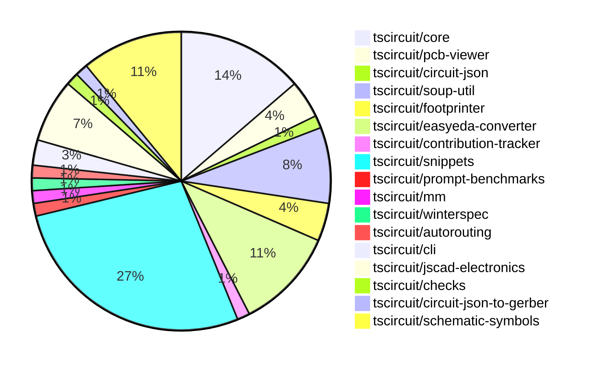

# Contribution Overview 2024-10-09

## PRs by Repository

## Contributor Overview

| Contributor | 🐳 Major | 🐙 Minor | 🐌 Tiny | ⭐ |
|-------------|-------|-------|-------|-------|
| [seveibar](#seveibar) | 14 | 22 | 2 | 👑👑👑 |
| [imrishabh18](#imrishabh18) | 1 | 7 | 3 | ⭐⭐ |
| [andrii-balitskyi](#andrii-balitskyi) | 2 | 2 | 0 | ⭐⭐ |
| [anas-sarkez](#anas-sarkez) | 2 | 2 | 0 | ⭐⭐ |
| [mrudulpatil18](#mrudulpatil18) | 1 | 3 | 0 | ⭐ |
| [ShiboSoftwareDev](#ShiboSoftwareDev) | 1 | 0 | 1 | ⭐ |
| [ni9999](#ni9999) | 0 | 2 | 0 | ⭐ |
| [aman1376](#aman1376) | 0 | 2 | 0 | ⭐ |
| [MandeepPaul](#MandeepPaul) | 1 | 0 | 0 | ⭐ |
| [0SlowPoke0](#0SlowPoke0) | 1 | 0 | 0 | ⭐ |
| [qalbun-salim](#qalbun-salim) | 0 | 1 | 0 |  |
| [anugcodes](#anugcodes) | 0 | 1 | 0 |  |
| [Abse2001](#Abse2001) | 0 | 1 | 0 |  |

## Changes by Repository

### [tscircuit/core](https://github.com/tscircuit/core)

| PR # | Impact | Contributor | Description |
|------|--------|-------------|-------------|
| [#151](https://github.com/tscircuit/core/pull/151) | 🐳 Major | imrishabh18 | Adds a new component called "Via" to the project. |
| [#157](https://github.com/tscircuit/core/pull/157) | 🐳 Major | seveibar | Introduces the `createUseComponent` function, which helps create React components with automatically generated traces. |
| [#155](https://github.com/tscircuit/core/pull/155) | 🐙 Minor | imrishabh18 | Adds new aliases ("left" and "right") for the ports of Capacitor and Resistor components. |
| [#153](https://github.com/tscircuit/core/pull/153) | 🐙 Minor | imrishabh18 | Added new components for silkscreen circle and rectangle |
| [#166](https://github.com/tscircuit/core/pull/166) | 🐙 Minor | seveibar | Update the version of the `@tscircuit/footprinter` dependency from `0.0.70` to `0.0.71`. |
| [#165](https://github.com/tscircuit/core/pull/165) | 🐙 Minor | seveibar | Fixes a trace layer issue when using explicitly defined `SmtPad` components. |
| [#163](https://github.com/tscircuit/core/pull/163) | 🐙 Minor | seveibar | Fix for the rotation of a part depending on the layer it is placed on. |
| [#161](https://github.com/tscircuit/core/pull/161) | 🐙 Minor | seveibar | Adds support for the `positionOffset` property in the `cadModel` object of a chip component, allowing for adjusting the position of the CAD model. |
| [#159](https://github.com/tscircuit/core/pull/159) | 🐙 Minor | seveibar | Adds support for creating a `pcb_hole` component from the soup data. |
| [#158](https://github.com/tscircuit/core/pull/158) | 🐙 Minor | seveibar | Exports the `createUseComponent` function from the `hooks/create-use-component` module. |

### [tscircuit/pcb-viewer](https://github.com/tscircuit/pcb-viewer)

| PR # | Impact | Contributor | Description |
|------|--------|-------------|-------------|
| [#74](https://github.com/tscircuit/pcb-viewer/pull/74) | 🐙 Minor | imrishabh18 | Refactor/remove builder |
| [#73](https://github.com/tscircuit/pcb-viewer/pull/73) | 🟣 | imrishabh18 | Refactor: remove builder |
| [#71](https://github.com/tscircuit/pcb-viewer/pull/71) | 🐳 Major | seveibar | Reverts the previous change that broke the PCB viewer's bounds computation. |

### [tscircuit/circuit-json](https://github.com/tscircuit/circuit-json)

| PR # | Impact | Contributor | Description |
|------|--------|-------------|-------------|
| [#58](https://github.com/tscircuit/circuit-json/pull/58) | 🐙 Minor | imrishabh18 | Adds an optional `display_value` field to the `SourceComponentBase` type. |

### [tscircuit/soup-util](https://github.com/tscircuit/soup-util)

| PR # | Impact | Contributor | Description |
|------|--------|-------------|-------------|
| [#22](https://github.com/tscircuit/soup-util/pull/22) | 🐙 Minor | imrishabh18 | Reverts a previous change that exported a function. |
| [#21](https://github.com/tscircuit/soup-util/pull/21) | 🐙 Minor | imrishabh18 | Export the `find-bounds-and-center` function from the library. |
| [#20](https://github.com/tscircuit/soup-util/pull/20) | 🐙 Minor | imrishabh18 | Ports the `findBoundsAndCenter` function from the builder repository to the current repository. |
| [#23](https://github.com/tscircuit/soup-util/pull/23) | 🐌 Tiny | imrishabh18 | Fix type error by adding type annotation to `flatMap` call. |
| [#19](https://github.com/tscircuit/soup-util/pull/19) | 🐌 Tiny | imrishabh18 | Updates the lock file to reflect the latest dependency versions. |
| [#18](https://github.com/tscircuit/soup-util/pull/18) | 🐌 Tiny | imrishabh18 | Update the `circuit-json` dependency to the latest version `0.0.85`. |

### [tscircuit/footprinter](https://github.com/tscircuit/footprinter)

| PR # | Impact | Contributor | Description |
|------|--------|-------------|-------------|
| [#63](https://github.com/tscircuit/footprinter/pull/63) | 🐳 Major | seveibar | Removes the "bun" dependency, which was causing a massive bundle size increase. |
| [#61](https://github.com/tscircuit/footprinter/pull/61) | 🐙 Minor | seveibar | Add error handling for invalid footprint function in the footprinter library |
| [#62](https://github.com/tscircuit/footprinter/pull/62) | 🐙 Minor | anas-sarkez | This pull request modifies and fixes the default value of `qfp` according to the datasheet. |

### [tscircuit/easyeda-converter](https://github.com/tscircuit/easyeda-converter)

| PR # | Impact | Contributor | Description |
|------|--------|-------------|-------------|
| [#60](https://github.com/tscircuit/easyeda-converter/pull/60) | 🐳 Major | seveibar | New footprint generation mechanism and support for `<hole />` element |
| [#59](https://github.com/tscircuit/easyeda-converter/pull/59) | 🐳 Major | seveibar |  |
| [#64](https://github.com/tscircuit/easyeda-converter/pull/64) | 🐙 Minor | seveibar | Adds support for parsing and handling 'PT' (path) shapes in the EasyEDA converter. |
| [#62](https://github.com/tscircuit/easyeda-converter/pull/62) | 🐙 Minor | seveibar | Fix the offset of PCB components and add a test to check for large dimensions. |
| [#61](https://github.com/tscircuit/easyeda-converter/pull/61) | 🐙 Minor | seveibar | Fixes the issue of double flip of the y-axis in the SVG rendering. |
| [#56](https://github.com/tscircuit/easyeda-converter/pull/56) | 🐙 Minor | seveibar | Adds a benchmark script to test the conversion of EasyEDA JSON files to various formats. |
| [#49](https://github.com/tscircuit/easyeda-converter/pull/49) | 🐙 Minor | andrii-balitskyi | Adds support for string/number values for `number` and `pinNumber` properties in `PadSchema` and `PinShapeOutputSchema`, respectively. |
| [#54](https://github.com/tscircuit/easyeda-converter/pull/54) | 🐌 Tiny | seveibar | Import `createUseComponent` from `@tscircuit/core` instead of `tscircuit`. |

### [tscircuit/contribution-tracker](https://github.com/tscircuit/contribution-tracker)

| PR # | Impact | Contributor | Description |
|------|--------|-------------|-------------|
| [#4](https://github.com/tscircuit/contribution-tracker/pull/4) | 🐳 Major | seveibar | Adds support for nicknames, a star system, and better sorting |

### [tscircuit/snippets](https://github.com/tscircuit/snippets)

| PR # | Impact | Contributor | Description |
|------|--------|-------------|-------------|
| [#61](https://github.com/tscircuit/snippets/pull/61) | 🐳 Major | seveibar | Adds a feature to delete a snippet from the application. |
| [#57](https://github.com/tscircuit/snippets/pull/57) | 🐳 Major | seveibar | Adds a rename functionality to the Snippet Editor. |
| [#56](https://github.com/tscircuit/snippets/pull/56) | 🐳 Major | seveibar | Allow anonymous mutations for logged-in users, generally don't create snippet unless save button is pressed, various fixes, refactor for reuse, add Playwright snapshot testing, add loading/404 pages. |
| [#54](https://github.com/tscircuit/snippets/pull/54) | 🐳 Major | seveibar | Introduces a new "Import Snippet Dialog" feature, including a search endpoint for snippets and the initial implementation of the dialog. |
| [#52](https://github.com/tscircuit/snippets/pull/52) | 🐳 Major | seveibar | Adds support for anonymous user editing, improves the code editor and AI page for empty states, and fixes the code editor scrolling issue. |
| [#50](https://github.com/tscircuit/snippets/pull/50) | 🐳 Major | seveibar | Refactor for explicit runs, fix importing |
| [#48](https://github.com/tscircuit/snippets/pull/48) | 🐳 Major | seveibar | This pull request introduces the first part of the import runner feature, which allows importing and running compiled JavaScript code from the server. It also fixes an issue where the dashboard always loads from a hardcoded URL. |
| [#69](https://github.com/tscircuit/snippets/pull/69) | 🐳 Major | andrii-balitskyi | Introduces a new `/orders/{order_id}` page to display details of a specific order. |
| [#46](https://github.com/tscircuit/snippets/pull/46) | 🐳 Major | andrii-balitskyi | Introduces new API and UI for handling orders and order files. |
| [#67](https://github.com/tscircuit/snippets/pull/67) | 🐙 Minor | seveibar | Fix an issue with importing modules on the first run of the application. |
| [#66](https://github.com/tscircuit/snippets/pull/66) | 🐙 Minor | seveibar | Updates the `@tscircuit/core` dependency to version `0.0.116` to fix a bun dependency issue and address a routing issue. |
| [#65](https://github.com/tscircuit/snippets/pull/65) | 🐙 Minor | seveibar | Footprinter Fixes, Import Caching for runtime imports |
| [#63](https://github.com/tscircuit/snippets/pull/63) | 🐙 Minor | seveibar | Update easyeda dependency to version 0.0.48 to fix issue importing diode |
| [#62](https://github.com/tscircuit/snippets/pull/62) | 🐙 Minor | seveibar | The pull request adds a new snippet to the seed data and fixes a recursive importing issue. |
| [#58](https://github.com/tscircuit/snippets/pull/58) | 🐙 Minor | seveibar | Fix an issue with the early return in the AI page test |
| [#53](https://github.com/tscircuit/snippets/pull/53) | 🐙 Minor | seveibar | Adds core to runtime, adds a format button, and creates a 404 snippet page. Also includes minor fixes. |
| [#51](https://github.com/tscircuit/snippets/pull/51) | 🐙 Minor | seveibar | Fix code editor scrolling overflow and support exporting hooks |
| [#45](https://github.com/tscircuit/snippets/pull/45) | 🐙 Minor | seveibar | The pull request adds the ability to save the DTS (TypeScript definition) content to the database when creating or updating a snippet. |
| [#43](https://github.com/tscircuit/snippets/pull/43) | 🐙 Minor | mrudulpatil18 | Persist the visibility of onboarding tips in the global store and update the LandingHero component to use the global store for managing the visibility. |
| [#49](https://github.com/tscircuit/snippets/pull/49) | 🐙 Minor | Abse2001 | Implemented a download function for the circuitJson download button. |

### [tscircuit/prompt-benchmarks](https://github.com/tscircuit/prompt-benchmarks)

| PR # | Impact | Contributor | Description |
|------|--------|-------------|-------------|
| [#3](https://github.com/tscircuit/prompt-benchmarks/pull/3) | 🐳 Major | seveibar | Adds a new function `safeCompileDts` that safely compiles TypeScript code to a DTS file using a virtual file system and type acquisition. |

### [tscircuit/mm](https://github.com/tscircuit/mm)

| PR # | Impact | Contributor | Description |
|------|--------|-------------|-------------|
| [#5](https://github.com/tscircuit/mm/pull/5) | 🐙 Minor | seveibar | Add a new function `mil2mm` to convert mil (thousandth of an inch) to millimeters. |

### [tscircuit/winterspec](https://github.com/tscircuit/winterspec)

| PR # | Impact | Contributor | Description |
|------|--------|-------------|-------------|
| [#12](https://github.com/tscircuit/winterspec/pull/12) | 🐙 Minor | seveibar | Fix bad test fixture and licensing issue |

### [tscircuit/autorouting](https://github.com/tscircuit/autorouting)

| PR # | Impact | Contributor | Description |
|------|--------|-------------|-------------|
| [#81](https://github.com/tscircuit/autorouting/pull/81) | 🐌 Tiny | seveibar | Updates the types for "AnySoupElement" to "AnyCircuitElement" in the code. |

### [tscircuit/cli](https://github.com/tscircuit/cli)

| PR # | Impact | Contributor | Description |
|------|--------|-------------|-------------|
| [#210](https://github.com/tscircuit/cli/pull/210) | 🐙 Minor | andrii-balitskyi | Adds a new command `gen jlcpcb <jlcpcbPartNumberOrUrl>` to generate JLCPCB-specific files. |
| [#217](https://github.com/tscircuit/cli/pull/217) | 🐙 Minor | qalbun-salim | Add a new `export pnp_csv` command to the command line tool to export a Plug n Play CSV file from an example file. |

### [tscircuit/jscad-electronics](https://github.com/tscircuit/jscad-electronics)

| PR # | Impact | Contributor | Description |
|------|--------|-------------|-------------|
| [#67](https://github.com/tscircuit/jscad-electronics/pull/67) | 🐳 Major | anas-sarkez | Implementing a new USB-A female connector component with customizable parameters. |
| [#65](https://github.com/tscircuit/jscad-electronics/pull/65) | 🐳 Major | anas-sarkez | Refactor QFP component to support customizable pitch, lead width, and body dimensions, and add a new QFP 128 3D footprint. |
| [#64](https://github.com/tscircuit/jscad-electronics/pull/64) | 🐙 Minor | anas-sarkez | Added a new example for the DIP16 wide footprinter3d and fixed the length calculation for the DIP model. |
| [#66](https://github.com/tscircuit/jscad-electronics/pull/66) | 🐙 Minor | ni9999 | Added a new component `AxialCapacitor` with the ability to render an axial capacitor in either a vertical or horizontal orientation. |
| [#59](https://github.com/tscircuit/jscad-electronics/pull/59) | 🐙 Minor | ni9999 | Added a new component called "AxialLed" to the project, which provides a visual representation of an axial LED. |

### [tscircuit/checks](https://github.com/tscircuit/checks)

| PR # | Impact | Contributor | Description |
|------|--------|-------------|-------------|
| [#17](https://github.com/tscircuit/checks/pull/17) | 🐳 Major | ShiboSoftwareDev | Refactored the codebase to use the `circuit-json` library instead of `@tscircuit/soup`. |

### [tscircuit/circuit-json-to-gerber](https://github.com/tscircuit/circuit-json-to-gerber)

| PR # | Impact | Contributor | Description |
|------|--------|-------------|-------------|
| [#20](https://github.com/tscircuit/circuit-json-to-gerber/pull/20) | 🐌 Tiny | ShiboSoftwareDev | Added a CODEOWNERS file to specify code ownership for the entire repository. |

### [tscircuit/schematic-symbols](https://github.com/tscircuit/schematic-symbols)

| PR # | Impact | Contributor | Description |
|------|--------|-------------|-------------|
| [#169](https://github.com/tscircuit/schematic-symbols/pull/169) | 🐳 Major | MandeepPaul | Introduces a new mushroom head normally open momentary component |
| [#156](https://github.com/tscircuit/schematic-symbols/pull/156) | 🐳 Major | mrudulpatil18 | Adds an NPN bipolar transistor symbol to the project. |
| [#157](https://github.com/tscircuit/schematic-symbols/pull/157) | 🐳 Major | 0SlowPoke0 | Adds a new filled diode symbol. |
| [#168](https://github.com/tscircuit/schematic-symbols/pull/168) | 🐙 Minor | aman1376 | Add a new n-channel E-MOSFET transistor symbol |
| [#158](https://github.com/tscircuit/schematic-symbols/pull/158) | 🐙 Minor | aman1376 | Adds a new SPST (Single Pole Single Throw) switch symbol to the project. |
| [#166](https://github.com/tscircuit/schematic-symbols/pull/166) | 🐙 Minor | mrudulpatil18 | Added a count of unique symbols available in the schematic symbols repository and a GitHub stars badge to the header. |
| [#161](https://github.com/tscircuit/schematic-symbols/pull/161) | 🐙 Minor | mrudulpatil18 | Added a new PNP bipolar transistor symbol. |
| [#160](https://github.com/tscircuit/schematic-symbols/pull/160) | 🐙 Minor | anugcodes | Added a new SPDT (Single-Pole Double-Throw) switch symbol to the project. |

## Changes by Contributor

### [imrishabh18](https://github.com/imrishabh18)

| PR # | Impact | Description |
|------|--------|-------------|
| [#151](https://github.com/tscircuit/core/pull/151) | 🐳 Major | Adds a new component called "Via" to the project. |
| [#74](https://github.com/tscircuit/pcb-viewer/pull/74) | 🐙 Minor | Refactor/remove builder |
| [#73](https://github.com/tscircuit/pcb-viewer/pull/73) | 🟣 | Refactor: remove builder |
| [#58](https://github.com/tscircuit/circuit-json/pull/58) | 🐙 Minor | Adds an optional `display_value` field to the `SourceComponentBase` type. |
| [#22](https://github.com/tscircuit/soup-util/pull/22) | 🐙 Minor | Reverts a previous change that exported a function. |
| [#21](https://github.com/tscircuit/soup-util/pull/21) | 🐙 Minor | Export the `find-bounds-and-center` function from the library. |
| [#20](https://github.com/tscircuit/soup-util/pull/20) | 🐙 Minor | Ports the `findBoundsAndCenter` function from the builder repository to the current repository. |
| [#155](https://github.com/tscircuit/core/pull/155) | 🐙 Minor | Adds new aliases ("left" and "right") for the ports of Capacitor and Resistor components. |
| [#153](https://github.com/tscircuit/core/pull/153) | 🐙 Minor | Added new components for silkscreen circle and rectangle |
| [#23](https://github.com/tscircuit/soup-util/pull/23) | 🐌 Tiny | Fix type error by adding type annotation to `flatMap` call. |
| [#19](https://github.com/tscircuit/soup-util/pull/19) | 🐌 Tiny | Updates the lock file to reflect the latest dependency versions. |
| [#18](https://github.com/tscircuit/soup-util/pull/18) | 🐌 Tiny | Update the `circuit-json` dependency to the latest version `0.0.85`. |

### [seveibar](https://github.com/seveibar)

| PR # | Impact | Description |
|------|--------|-------------|
| [#71](https://github.com/tscircuit/pcb-viewer/pull/71) | 🐳 Major | Reverts the previous change that broke the PCB viewer's bounds computation. |
| [#63](https://github.com/tscircuit/footprinter/pull/63) | 🐳 Major | Removes the "bun" dependency, which was causing a massive bundle size increase. |
| [#60](https://github.com/tscircuit/easyeda-converter/pull/60) | 🐳 Major | New footprint generation mechanism and support for `<hole />` element |
| [#59](https://github.com/tscircuit/easyeda-converter/pull/59) | 🐳 Major |  |
| [#157](https://github.com/tscircuit/core/pull/157) | 🐳 Major | Introduces the `createUseComponent` function, which helps create React components with automatically generated traces. |
| [#4](https://github.com/tscircuit/contribution-tracker/pull/4) | 🐳 Major | Adds support for nicknames, a star system, and better sorting |
| [#61](https://github.com/tscircuit/snippets/pull/61) | 🐳 Major | Adds a feature to delete a snippet from the application. |
| [#57](https://github.com/tscircuit/snippets/pull/57) | 🐳 Major | Adds a rename functionality to the Snippet Editor. |
| [#56](https://github.com/tscircuit/snippets/pull/56) | 🐳 Major | Allow anonymous mutations for logged-in users, generally don't create snippet unless save button is pressed, various fixes, refactor for reuse, add Playwright snapshot testing, add loading/404 pages. |
| [#54](https://github.com/tscircuit/snippets/pull/54) | 🐳 Major | Introduces a new "Import Snippet Dialog" feature, including a search endpoint for snippets and the initial implementation of the dialog. |
| [#52](https://github.com/tscircuit/snippets/pull/52) | 🐳 Major | Adds support for anonymous user editing, improves the code editor and AI page for empty states, and fixes the code editor scrolling issue. |
| [#50](https://github.com/tscircuit/snippets/pull/50) | 🐳 Major | Refactor for explicit runs, fix importing |
| [#48](https://github.com/tscircuit/snippets/pull/48) | 🐳 Major | This pull request introduces the first part of the import runner feature, which allows importing and running compiled JavaScript code from the server. It also fixes an issue where the dashboard always loads from a hardcoded URL. |
| [#3](https://github.com/tscircuit/prompt-benchmarks/pull/3) | 🐳 Major | Adds a new function `safeCompileDts` that safely compiles TypeScript code to a DTS file using a virtual file system and type acquisition. |
| [#5](https://github.com/tscircuit/mm/pull/5) | 🐙 Minor | Add a new function `mil2mm` to convert mil (thousandth of an inch) to millimeters. |
| [#61](https://github.com/tscircuit/footprinter/pull/61) | 🐙 Minor | Add error handling for invalid footprint function in the footprinter library |
| [#64](https://github.com/tscircuit/easyeda-converter/pull/64) | 🐙 Minor | Adds support for parsing and handling 'PT' (path) shapes in the EasyEDA converter. |
| [#62](https://github.com/tscircuit/easyeda-converter/pull/62) | 🐙 Minor | Fix the offset of PCB components and add a test to check for large dimensions. |
| [#61](https://github.com/tscircuit/easyeda-converter/pull/61) | 🐙 Minor | Fixes the issue of double flip of the y-axis in the SVG rendering. |
| [#56](https://github.com/tscircuit/easyeda-converter/pull/56) | 🐙 Minor | Adds a benchmark script to test the conversion of EasyEDA JSON files to various formats. |
| [#12](https://github.com/tscircuit/winterspec/pull/12) | 🐙 Minor | Fix bad test fixture and licensing issue |
| [#166](https://github.com/tscircuit/core/pull/166) | 🐙 Minor | Update the version of the `@tscircuit/footprinter` dependency from `0.0.70` to `0.0.71`. |
| [#165](https://github.com/tscircuit/core/pull/165) | 🐙 Minor | Fixes a trace layer issue when using explicitly defined `SmtPad` components. |
| [#163](https://github.com/tscircuit/core/pull/163) | 🐙 Minor | Fix for the rotation of a part depending on the layer it is placed on. |
| [#161](https://github.com/tscircuit/core/pull/161) | 🐙 Minor | Adds support for the `positionOffset` property in the `cadModel` object of a chip component, allowing for adjusting the position of the CAD model. |
| [#159](https://github.com/tscircuit/core/pull/159) | 🐙 Minor | Adds support for creating a `pcb_hole` component from the soup data. |
| [#158](https://github.com/tscircuit/core/pull/158) | 🐙 Minor | Exports the `createUseComponent` function from the `hooks/create-use-component` module. |
| [#67](https://github.com/tscircuit/snippets/pull/67) | 🐙 Minor | Fix an issue with importing modules on the first run of the application. |
| [#66](https://github.com/tscircuit/snippets/pull/66) | 🐙 Minor | Updates the `@tscircuit/core` dependency to version `0.0.116` to fix a bun dependency issue and address a routing issue. |
| [#65](https://github.com/tscircuit/snippets/pull/65) | 🐙 Minor | Footprinter Fixes, Import Caching for runtime imports |
| [#63](https://github.com/tscircuit/snippets/pull/63) | 🐙 Minor | Update easyeda dependency to version 0.0.48 to fix issue importing diode |
| [#62](https://github.com/tscircuit/snippets/pull/62) | 🐙 Minor | The pull request adds a new snippet to the seed data and fixes a recursive importing issue. |
| [#58](https://github.com/tscircuit/snippets/pull/58) | 🐙 Minor | Fix an issue with the early return in the AI page test |
| [#53](https://github.com/tscircuit/snippets/pull/53) | 🐙 Minor | Adds core to runtime, adds a format button, and creates a 404 snippet page. Also includes minor fixes. |
| [#51](https://github.com/tscircuit/snippets/pull/51) | 🐙 Minor | Fix code editor scrolling overflow and support exporting hooks |
| [#45](https://github.com/tscircuit/snippets/pull/45) | 🐙 Minor | The pull request adds the ability to save the DTS (TypeScript definition) content to the database when creating or updating a snippet. |
| [#54](https://github.com/tscircuit/easyeda-converter/pull/54) | 🐌 Tiny | Import `createUseComponent` from `@tscircuit/core` instead of `tscircuit`. |
| [#81](https://github.com/tscircuit/autorouting/pull/81) | 🐌 Tiny | Updates the types for "AnySoupElement" to "AnyCircuitElement" in the code. |

### [andrii-balitskyi](https://github.com/andrii-balitskyi)

| PR # | Impact | Description |
|------|--------|-------------|
| [#69](https://github.com/tscircuit/snippets/pull/69) | 🐳 Major | Introduces a new `/orders/{order_id}` page to display details of a specific order. |
| [#46](https://github.com/tscircuit/snippets/pull/46) | 🐳 Major | Introduces new API and UI for handling orders and order files. |
| [#210](https://github.com/tscircuit/cli/pull/210) | 🐙 Minor | Adds a new command `gen jlcpcb <jlcpcbPartNumberOrUrl>` to generate JLCPCB-specific files. |
| [#49](https://github.com/tscircuit/easyeda-converter/pull/49) | 🐙 Minor | Adds support for string/number values for `number` and `pinNumber` properties in `PadSchema` and `PinShapeOutputSchema`, respectively. |

### [qalbun-salim](https://github.com/qalbun-salim)

| PR # | Impact | Description |
|------|--------|-------------|
| [#217](https://github.com/tscircuit/cli/pull/217) | 🐙 Minor | Add a new `export pnp_csv` command to the command line tool to export a Plug n Play CSV file from an example file. |

### [anas-sarkez](https://github.com/anas-sarkez)

| PR # | Impact | Description |
|------|--------|-------------|
| [#67](https://github.com/tscircuit/jscad-electronics/pull/67) | 🐳 Major | Implementing a new USB-A female connector component with customizable parameters. |
| [#65](https://github.com/tscircuit/jscad-electronics/pull/65) | 🐳 Major | Refactor QFP component to support customizable pitch, lead width, and body dimensions, and add a new QFP 128 3D footprint. |
| [#62](https://github.com/tscircuit/footprinter/pull/62) | 🐙 Minor | This pull request modifies and fixes the default value of `qfp` according to the datasheet. |
| [#64](https://github.com/tscircuit/jscad-electronics/pull/64) | 🐙 Minor | Added a new example for the DIP16 wide footprinter3d and fixed the length calculation for the DIP model. |

### [ni9999](https://github.com/ni9999)

| PR # | Impact | Description |
|------|--------|-------------|
| [#66](https://github.com/tscircuit/jscad-electronics/pull/66) | 🐙 Minor | Added a new component `AxialCapacitor` with the ability to render an axial capacitor in either a vertical or horizontal orientation. |
| [#59](https://github.com/tscircuit/jscad-electronics/pull/59) | 🐙 Minor | Added a new component called "AxialLed" to the project, which provides a visual representation of an axial LED. |

### [ShiboSoftwareDev](https://github.com/ShiboSoftwareDev)

| PR # | Impact | Description |
|------|--------|-------------|
| [#17](https://github.com/tscircuit/checks/pull/17) | 🐳 Major | Refactored the codebase to use the `circuit-json` library instead of `@tscircuit/soup`. |
| [#20](https://github.com/tscircuit/circuit-json-to-gerber/pull/20) | 🐌 Tiny | Added a CODEOWNERS file to specify code ownership for the entire repository. |

### [aman1376](https://github.com/aman1376)

| PR # | Impact | Description |
|------|--------|-------------|
| [#168](https://github.com/tscircuit/schematic-symbols/pull/168) | 🐙 Minor | Add a new n-channel E-MOSFET transistor symbol |
| [#158](https://github.com/tscircuit/schematic-symbols/pull/158) | 🐙 Minor | Adds a new SPST (Single Pole Single Throw) switch symbol to the project. |

### [MandeepPaul](https://github.com/MandeepPaul)

| PR # | Impact | Description |
|------|--------|-------------|
| [#169](https://github.com/tscircuit/schematic-symbols/pull/169) | 🐳 Major | Introduces a new mushroom head normally open momentary component |

### [mrudulpatil18](https://github.com/mrudulpatil18)

| PR # | Impact | Description |
|------|--------|-------------|
| [#156](https://github.com/tscircuit/schematic-symbols/pull/156) | 🐳 Major | Adds an NPN bipolar transistor symbol to the project. |
| [#166](https://github.com/tscircuit/schematic-symbols/pull/166) | 🐙 Minor | Added a count of unique symbols available in the schematic symbols repository and a GitHub stars badge to the header. |
| [#161](https://github.com/tscircuit/schematic-symbols/pull/161) | 🐙 Minor | Added a new PNP bipolar transistor symbol. |
| [#43](https://github.com/tscircuit/snippets/pull/43) | 🐙 Minor | Persist the visibility of onboarding tips in the global store and update the LandingHero component to use the global store for managing the visibility. |

### [anugcodes](https://github.com/anugcodes)

| PR # | Impact | Description |
|------|--------|-------------|
| [#160](https://github.com/tscircuit/schematic-symbols/pull/160) | 🐙 Minor | Added a new SPDT (Single-Pole Double-Throw) switch symbol to the project. |

### [0SlowPoke0](https://github.com/0SlowPoke0)

| PR # | Impact | Description |
|------|--------|-------------|
| [#157](https://github.com/tscircuit/schematic-symbols/pull/157) | 🐳 Major | Adds a new filled diode symbol. |

### [Abse2001](https://github.com/Abse2001)

| PR # | Impact | Description |
|------|--------|-------------|
| [#49](https://github.com/tscircuit/snippets/pull/49) | 🐙 Minor | Implemented a download function for the circuitJson download button. |

