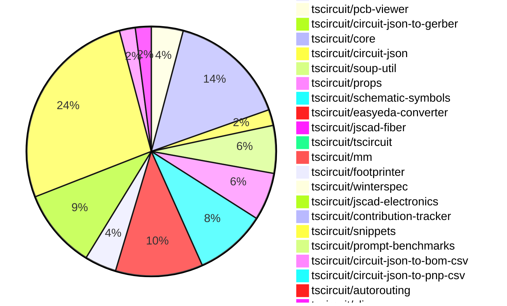

# Contribution Overview 2024-10-09

## PRs by Repository

## Contributor Overview

| Contributor | 🐳 Major | 🐙 Minor | 🐌 Tiny | ⭐ |
|-------------|-------|-------|-------|-------|
| [seveibar](#seveibar) | 17 | 35 | 3 | 👑👑👑 |
| [imrishabh18](#imrishabh18) | 2 | 14 | 3 | ⭐⭐⭐ |
| [anas-sarkez](#anas-sarkez) | 3 | 5 | 0 | ⭐⭐ |
| [andrii-balitskyi](#andrii-balitskyi) | 4 | 2 | 0 | ⭐⭐ |
| [mrudulpatil18](#mrudulpatil18) | 0 | 5 | 0 | ⭐ |
| [ShiboSoftwareDev](#ShiboSoftwareDev) | 1 | 0 | 2 | ⭐ |
| [bbland1](#bbland1) | 1 | 0 | 0 | ⭐ |
| [ni9999](#ni9999) | 0 | 2 | 0 | ⭐ |
| [aman1376](#aman1376) | 0 | 2 | 0 | ⭐ |
| [MandeepPaul](#MandeepPaul) | 1 | 0 | 0 | ⭐ |
| [0SlowPoke0](#0SlowPoke0) | 1 | 0 | 0 | ⭐ |
| [qalbun-salim](#qalbun-salim) | 0 | 1 | 0 |  |
| [anugcodes](#anugcodes) | 0 | 1 | 0 |  |
| [Abse2001](#Abse2001) | 0 | 0 | 0 |  |

## Changes by Repository

### [tscircuit/checks](https://github.com/tscircuit/checks)

| PR # | Impact | Contributor | Description |
|------|--------|-------------|-------------|
| [#17](https://github.com/tscircuit/checks/pull/17) | 🐳 Major | ShiboSoftwareDev | The pull request refactors the code to use the `circuit-json` library instead of the `@tscircuit/soup` library. |

### [tscircuit/pcb-viewer](https://github.com/tscircuit/pcb-viewer)

| PR # | Impact | Contributor | Description |
|------|--------|-------------|-------------|
| [#73](https://github.com/tscircuit/pcb-viewer/pull/73) | 🐳 Major | imrishabh18 | Refactor: remove the `@tscircuit/builder` and `@tscircuit/react-fiber` dependencies and switch to using the `@tscircuit/core` package for rendering the circuit. |
| [#71](https://github.com/tscircuit/pcb-viewer/pull/71) | 🐳 Major | seveibar | Reverts the previous change that broke the PCB viewer's bounds computation. |
| [#74](https://github.com/tscircuit/pcb-viewer/pull/74) | 🐙 Minor | imrishabh18 | Refactor/remove builder |
| [#75](https://github.com/tscircuit/pcb-viewer/pull/75) | 🐌 Tiny | ShiboSoftwareDev | Added a CODEOWNERS file to specify the code owners for the repository. |

### [tscircuit/circuit-json-to-gerber](https://github.com/tscircuit/circuit-json-to-gerber)

| PR # | Impact | Contributor | Description |
|------|--------|-------------|-------------|
| [#20](https://github.com/tscircuit/circuit-json-to-gerber/pull/20) | 🐌 Tiny | ShiboSoftwareDev | Added a CODEOWNERS file to specify code owners for the repository. |

### [tscircuit/core](https://github.com/tscircuit/core)

| PR # | Impact | Contributor | Description |
|------|--------|-------------|-------------|
| [#169](https://github.com/tscircuit/core/pull/169) | 🐳 Major | imrishabh18 | Adds new components "PowerSource" and "NetAlias" to the library. |
| [#173](https://github.com/tscircuit/core/pull/173) | 🐳 Major | seveibar | Adds support for shared pin labels in the NormalComponent, including handling of multiple labels per pin. |
| [#157](https://github.com/tscircuit/core/pull/157) | 🐳 Major | seveibar | The change introduces the `createUseComponent` function, which is a utility for creating reusable React components with predefined pins and automatic trace creation. |
| [#170](https://github.com/tscircuit/core/pull/170) | 🐙 Minor | imrishabh18 | Adds `schX` and `schY` properties to the `NetAlias` component to specify the schematic position. |
| [#155](https://github.com/tscircuit/core/pull/155) | 🐙 Minor | imrishabh18 | Add new aliases "left" and "right" to the ports of Capacitor and Resistor components. |
| [#153](https://github.com/tscircuit/core/pull/153) | 🐙 Minor | imrishabh18 | Added new SilkscreenCircle and SilkscreenRect components to the library. |
| [#151](https://github.com/tscircuit/core/pull/151) | 🐙 Minor | imrishabh18 | Adds a new `Via` component to the library. |
| [#177](https://github.com/tscircuit/core/pull/177) | 🐙 Minor | seveibar | Introduces a new `<battery />` component. |
| [#176](https://github.com/tscircuit/core/pull/176) | 🐙 Minor | seveibar | Fixes a bug where `pcbRotation={-90}` did not properly rotate SMT pads and keepouts. |
| [#166](https://github.com/tscircuit/core/pull/166) | 🐙 Minor | seveibar | Update the `@tscircuit/footprinter` dependency to version `0.0.71` to fix an issue. |
| [#165](https://github.com/tscircuit/core/pull/165) | 🐙 Minor | seveibar | Fixes a trace layer issue for explicitly defined SMT pads. |
| [#163](https://github.com/tscircuit/core/pull/163) | 🐙 Minor | seveibar | Set rotation of part properly dependent on layer, fix for undefined layer |
| [#161](https://github.com/tscircuit/core/pull/161) | 🐙 Minor | seveibar | Adds support for `cadModel.positionOffset` to adjust the position of CAD components on the board. |
| [#159](https://github.com/tscircuit/core/pull/159) | 🐙 Minor | seveibar | Adds support for creating `pcb_hole` components from the soup. |
| [#158](https://github.com/tscircuit/core/pull/158) | 🐙 Minor | seveibar | Exports the `createUseComponent` function from the `hooks/create-use-component` module. |

### [tscircuit/circuit-json](https://github.com/tscircuit/circuit-json)

| PR # | Impact | Contributor | Description |
|------|--------|-------------|-------------|
| [#58](https://github.com/tscircuit/circuit-json/pull/58) | 🐙 Minor | imrishabh18 | Adds a new optional field `display_value` of type `string` to the `SourceComponentBase` type. |
| [#59](https://github.com/tscircuit/circuit-json/pull/59) | 🐙 Minor | seveibar | Add a new source component for simple battery. |

### [tscircuit/soup-util](https://github.com/tscircuit/soup-util)

| PR # | Impact | Contributor | Description |
|------|--------|-------------|-------------|
| [#23](https://github.com/tscircuit/soup-util/pull/23) | 🐙 Minor | imrishabh18 | Fix type error in `find-bounds-and-center.ts` file |
| [#22](https://github.com/tscircuit/soup-util/pull/22) | 🐙 Minor | imrishabh18 | Revert the previous change that exported a function from the library. |
| [#21](https://github.com/tscircuit/soup-util/pull/21) | 🐙 Minor | imrishabh18 | Exports a new function `find-bounds-and-center` from the library. |
| [#20](https://github.com/tscircuit/soup-util/pull/20) | 🐙 Minor | imrishabh18 | Port the `findBoundsAndCenter` function from the builder repository to this repository. |
| [#19](https://github.com/tscircuit/soup-util/pull/19) | 🐌 Tiny | imrishabh18 | Updates the lock file to reflect the latest dependencies. |
| [#18](https://github.com/tscircuit/soup-util/pull/18) | 🐌 Tiny | imrishabh18 | Update `circuit-json` dependency to the latest version `0.0.85`. |

### [tscircuit/props](https://github.com/tscircuit/props)

| PR # | Impact | Contributor | Description |
|------|--------|-------------|-------------|
| [#62](https://github.com/tscircuit/props/pull/62) | 🐙 Minor | imrishabh18 | Removes the `width` and `height` properties from the `commonLayoutProps` and `commonComponentProps` types. |
| [#60](https://github.com/tscircuit/props/pull/60) | 🐙 Minor | imrishabh18 | Renamed the `width` and `height` properties to `schWidth` and `schHeight` respectively in the `commonLayoutProps` interface. |
| [#58](https://github.com/tscircuit/props/pull/58) | 🐙 Minor | imrishabh18 | Add width and height properties to common component props |
| [#63](https://github.com/tscircuit/props/pull/63) | 🐙 Minor | seveibar | Adds battery types, batteryProps, and sets the default unit for battery capacity to mAh. |
| [#61](https://github.com/tscircuit/props/pull/61) | 🐙 Minor | seveibar | Reverts the addition of `schWidth`, `schHeight`, `pcbWidth`, and `pcbHeight` props, and replaces them with `width` and `height` props. |
| [#59](https://github.com/tscircuit/props/pull/59) | 🐌 Tiny | imrishabh18 | Updated the lockfile |

### [tscircuit/schematic-symbols](https://github.com/tscircuit/schematic-symbols)

| PR # | Impact | Contributor | Description |
|------|--------|-------------|-------------|
| [#169](https://github.com/tscircuit/schematic-symbols/pull/169) | 🐳 Major | MandeepPaul | Introduces a new JSON file for a "Mushroom Head Normally Open Momentary" component. |
| [#157](https://github.com/tscircuit/schematic-symbols/pull/157) | 🐳 Major | 0SlowPoke0 | Adds a new symbol for a filled diode. |
| [#172](https://github.com/tscircuit/schematic-symbols/pull/172) | 🐙 Minor | imrishabh18 | The pull request fixes the calculation for the height of a SPDT switch and a boxresistor. |
| [#168](https://github.com/tscircuit/schematic-symbols/pull/168) | 🐙 Minor | aman1376 | Add a new n-channel E-MOSFET transistor symbol in JSON and SVG formats. |
| [#158](https://github.com/tscircuit/schematic-symbols/pull/158) | 🐙 Minor | aman1376 | Adds a new SPST (Single Pole Single Throw) switch symbol |
| [#166](https://github.com/tscircuit/schematic-symbols/pull/166) | 🐙 Minor | mrudulpatil18 | Adds a count of unique symbols available in the schematic symbols repository and a GitHub stars badge to the header. |
| [#161](https://github.com/tscircuit/schematic-symbols/pull/161) | 🐙 Minor | mrudulpatil18 | Added a new PNP bipolar transistor symbol. |
| [#156](https://github.com/tscircuit/schematic-symbols/pull/156) | 🐙 Minor | mrudulpatil18 | Add an SVG for an NPN bipolar transistor symbol |
| [#160](https://github.com/tscircuit/schematic-symbols/pull/160) | 🐙 Minor | anugcodes | Added a new SPDT (Single Pole Double Throw) switch symbol to the project. |

### [tscircuit/easyeda-converter](https://github.com/tscircuit/easyeda-converter)

| PR # | Impact | Contributor | Description |
|------|--------|-------------|-------------|
| [#60](https://github.com/tscircuit/easyeda-converter/pull/60) | 🐳 Major | seveibar | Introduces a new footprint generation mechanism for more stable units and adds support for the `<hole />` tag. |
| [#59](https://github.com/tscircuit/easyeda-converter/pull/59) | 🐳 Major | seveibar | Fix Hole Creation, Add snapshot testing |
| [#56](https://github.com/tscircuit/easyeda-converter/pull/56) | 🐳 Major | seveibar | Adds a benchmark script to the project that converts EasyEDA JSON files to various formats and reports on the success/failure of the conversions. |
| [#74](https://github.com/tscircuit/easyeda-converter/pull/74) | 🐙 Minor | seveibar | Fixes the C490691 import, adds a script for quickly adding tests for parts. |
| [#71](https://github.com/tscircuit/easyeda-converter/pull/71) | 🐙 Minor | seveibar | Fixes an issue with Arc Imports in the package-detail-shape-schema.ts file. |
| [#66](https://github.com/tscircuit/easyeda-converter/pull/66) | 🐙 Minor | seveibar | Adds a `supplierPartNumbers` prop to the `soupTypescriptComponentTemplate` function. |
| [#64](https://github.com/tscircuit/easyeda-converter/pull/64) | 🐙 Minor | seveibar | Adds support for parsing and processing "PT" (path) shapes in the easyeda-converter library. |
| [#62](https://github.com/tscircuit/easyeda-converter/pull/62) | 🐙 Minor | seveibar | Fix the PCB component offset and add a test to check for large dimensions. |
| [#61](https://github.com/tscircuit/easyeda-converter/pull/61) | 🐙 Minor | seveibar | Fixes a bug that was causing a double flip of the y-axis in the PCB visualization. |
| [#49](https://github.com/tscircuit/easyeda-converter/pull/49) | 🐙 Minor | andrii-balitskyi | Accounts for string/number values for PadSchema's `number` and PinShapeOutputSchema's `pinNumber` props |
| [#54](https://github.com/tscircuit/easyeda-converter/pull/54) | 🐌 Tiny | seveibar | Replacing the import of `createUseComponent` from `"tscircuit"` to `"@tscircuit/core"` |

### [tscircuit/jscad-fiber](https://github.com/tscircuit/jscad-fiber)

| PR # | Impact | Contributor | Description |
|------|--------|-------------|-------------|
| [#84](https://github.com/tscircuit/jscad-fiber/pull/84) | 🐳 Major | seveibar | Implement the `subtract` feature, which allows subtracting one or more shapes from another. |

### [tscircuit/tscircuit](https://github.com/tscircuit/tscircuit)

| PR # | Impact | Contributor | Description |
|------|--------|-------------|-------------|
| [#465](https://github.com/tscircuit/tscircuit/pull/465) | 🐙 Minor | seveibar | Require bun to use tscircuit, use bun as cli runtime |

### [tscircuit/mm](https://github.com/tscircuit/mm)

| PR # | Impact | Contributor | Description |
|------|--------|-------------|-------------|
| [#5](https://github.com/tscircuit/mm/pull/5) | 🐙 Minor | seveibar | Add a new function `mil2mm` to convert mil to millimeters |

### [tscircuit/footprinter](https://github.com/tscircuit/footprinter)

| PR # | Impact | Contributor | Description |
|------|--------|-------------|-------------|
| [#60](https://github.com/tscircuit/footprinter/pull/60) | 🐳 Major | bbland1 | Adds types for parameters returned using `.json()` in the `footprinter.ts` file. |
| [#63](https://github.com/tscircuit/footprinter/pull/63) | 🐙 Minor | seveibar | Remove bun as a dependency, which was causing a massive bundle size increase. |
| [#61](https://github.com/tscircuit/footprinter/pull/61) | 🐙 Minor | seveibar | Adds error handling for invalid footprint function names in the footprinter string. |
| [#62](https://github.com/tscircuit/footprinter/pull/62) | 🐙 Minor | anas-sarkez | This pull request modifies and fixes the default value of `qfp` according to the data sheet. |

### [tscircuit/winterspec](https://github.com/tscircuit/winterspec)

| PR # | Impact | Contributor | Description |
|------|--------|-------------|-------------|
| [#12](https://github.com/tscircuit/winterspec/pull/12) | 🐙 Minor | seveibar | Fix an issue with the loading of the routes directory in the smoke tests. |

### [tscircuit/jscad-electronics](https://github.com/tscircuit/jscad-electronics)

| PR # | Impact | Contributor | Description |
|------|--------|-------------|-------------|
| [#68](https://github.com/tscircuit/jscad-electronics/pull/68) | 🐳 Major | anas-sarkez | Implementing a 3D component for a USB-C female port. |
| [#67](https://github.com/tscircuit/jscad-electronics/pull/67) | 🐳 Major | anas-sarkez | Implements a USB-A female connector component with a customizable design. |
| [#65](https://github.com/tscircuit/jscad-electronics/pull/65) | 🐳 Major | anas-sarkez | Refactor QFP component to support customizable pitch, lead width, and body dimensions, and add QFP 128 3D footprint. |
| [#72](https://github.com/tscircuit/jscad-electronics/pull/72) | 🐙 Minor | anas-sarkez | Refactor USB_C component to use Subtract for curved casing |
| [#71](https://github.com/tscircuit/jscad-electronics/pull/71) | 🐙 Minor | anas-sarkez | Updated the jscad-fiber dependency and subtracted a curve slice from the smdLED sides. |
| [#69](https://github.com/tscircuit/jscad-electronics/pull/69) | 🐙 Minor | anas-sarkez | Implements the `SmdLED` component with different color options. |
| [#64](https://github.com/tscircuit/jscad-electronics/pull/64) | 🐙 Minor | anas-sarkez | Added a new example for a DIP 16 wide footprint and fixed the length of the DIP model. |
| [#66](https://github.com/tscircuit/jscad-electronics/pull/66) | 🐙 Minor | ni9999 | Added the `AxialCapacitor` component to the library, which allows rendering an axial capacitor with configurable pitch and orientation. |
| [#59](https://github.com/tscircuit/jscad-electronics/pull/59) | 🐙 Minor | ni9999 | Added an Axial LED component to the library. |
| [#70](https://github.com/tscircuit/jscad-electronics/pull/70) | 🐌 Tiny | seveibar | Add anas as codeowner |

### [tscircuit/contribution-tracker](https://github.com/tscircuit/contribution-tracker)

| PR # | Impact | Contributor | Description |
|------|--------|-------------|-------------|
| [#4](https://github.com/tscircuit/contribution-tracker/pull/4) | 🟣 | seveibar | Introduces a new "Via" component to the core library. |

### [tscircuit/snippets](https://github.com/tscircuit/snippets)

| PR # | Impact | Contributor | Description |
|------|--------|-------------|-------------|
| [#62](https://github.com/tscircuit/snippets/pull/62) | 🐳 Major | seveibar | Adds a new snippet for generating a square waveform using the A555Timer component, and fixes recursive importing by adding a depth limit and handling errors. |
| [#61](https://github.com/tscircuit/snippets/pull/61) | 🐳 Major | seveibar | Adds a delete snippet functionality to the application. |
| [#57](https://github.com/tscircuit/snippets/pull/57) | 🐳 Major | seveibar | Adds a new feature to rename a code snippet. |
| [#56](https://github.com/tscircuit/snippets/pull/56) | 🐳 Major | seveibar | Allow anonymous mutations for logged-in users, generally don't create a snippet unless the save button is pressed, various fixes, refactor for reuse, add Playwright snapshot testing, and add loading/404 pages. |
| [#54](https://github.com/tscircuit/snippets/pull/54) | 🐳 Major | seveibar |  |
| [#53](https://github.com/tscircuit/snippets/pull/53) | 🐳 Major | seveibar | This pull request adds the core to the runtime, adds a format button, and a 404 snippet page, along with minor fixes. |
| [#52](https://github.com/tscircuit/snippets/pull/52) | 🐳 Major | seveibar | Introduces anon user editing, improves empty states for the code editor and AI page, and fixes the code editor not being scrollable. |
| [#48](https://github.com/tscircuit/snippets/pull/48) | 🐳 Major | seveibar | This pull request introduces the "Import Runner Part 1" feature, which includes a fix for the dashboard always loading from a hardcoded "seveibar/" path. |
| [#45](https://github.com/tscircuit/snippets/pull/45) | 🐳 Major | seveibar | Update the `useSaveSnippet` hook to save the DTS content to the database along with the snippet code. |
| [#68](https://github.com/tscircuit/snippets/pull/68) | 🐳 Major | andrii-balitskyi | Adds tests for the order files API endpoints, including creating, getting, and uploading order files. |
| [#78](https://github.com/tscircuit/snippets/pull/78) | 🐳 Major | andrii-balitskyi | Adds a new submit order button and dialog to the editor navigation bar. |
| [#69](https://github.com/tscircuit/snippets/pull/69) | 🐳 Major | andrii-balitskyi | Introduce a new page `/orders/{order_id}` to display details of a specific order. |
| [#46](https://github.com/tscircuit/snippets/pull/46) | 🐳 Major | andrii-balitskyi | Adds a new API for creating and managing orders and order files. |
| [#80](https://github.com/tscircuit/snippets/pull/80) | 🐙 Minor | seveibar | Fixes issues with JLCPCB imports, updates for shared pin label support, and fixes errors in local development to show JLCPCB import errors. |
| [#74](https://github.com/tscircuit/snippets/pull/74) | 🐙 Minor | seveibar | Fixes the download functionality for fabrication files |
| [#73](https://github.com/tscircuit/snippets/pull/73) | 🐙 Minor | seveibar | Adds the ability to download fabrication files (Gerber, Pick and Place CSV, BOM CSV) for a circuit. |
| [#67](https://github.com/tscircuit/snippets/pull/67) | 🐙 Minor | seveibar | Fix an issue with importing modules on the first run of the application |
| [#66](https://github.com/tscircuit/snippets/pull/66) | 🐙 Minor | seveibar | Update the "@tscircuit/core" dependency to version 0.0.116 to fix a bun dependency issue and a routing issue. |
| [#65](https://github.com/tscircuit/snippets/pull/65) | 🐙 Minor | seveibar | Fixes Footprinter issues and adds import caching for runtime imports |
| [#63](https://github.com/tscircuit/snippets/pull/63) | 🐙 Minor | seveibar | Update easyeda dependency to fix issue importing diode |
| [#58](https://github.com/tscircuit/snippets/pull/58) | 🐙 Minor | seveibar | Fixes an issue where the `ai-page.spec.ts` file was returning early due to the `isStreaming` condition. |
| [#51](https://github.com/tscircuit/snippets/pull/51) | 🐙 Minor | seveibar | Fix code editor scrolling overflow, support exporting hooks |
| [#50](https://github.com/tscircuit/snippets/pull/50) | 🐙 Minor | seveibar | Refactor for explicit runs, fix importing |
| [#77](https://github.com/tscircuit/snippets/pull/77) | 🐙 Minor | mrudulpatil18 | Adds a search component that connects to the `/snippets/search` endpoint and displays the search results in a dropdown. |
| [#43](https://github.com/tscircuit/snippets/pull/43) | 🐙 Minor | mrudulpatil18 | Persist the visibility of onboarding tips in the global store and update the LandingHero component to use the global store for managing the visibility. |
| [#49](https://github.com/tscircuit/snippets/pull/49) | 🟣 | Abse2001 | Implemented a download function for the circuitJson download button. |

### [tscircuit/prompt-benchmarks](https://github.com/tscircuit/prompt-benchmarks)

| PR # | Impact | Contributor | Description |
|------|--------|-------------|-------------|
| [#3](https://github.com/tscircuit/prompt-benchmarks/pull/3) | 🐳 Major | seveibar | Adds a new function `safeCompileDts` that safely compiles TypeScript code to a DTS file, with support for different import map methods. |

### [tscircuit/circuit-json-to-bom-csv](https://github.com/tscircuit/circuit-json-to-bom-csv)

| PR # | Impact | Contributor | Description |
|------|--------|-------------|-------------|
| [#3](https://github.com/tscircuit/circuit-json-to-bom-csv/pull/3) | 🐙 Minor | seveibar | Update the `convertBomRowsToCsv` function to include all column headers in the resulting CSV. |
| [#2](https://github.com/tscircuit/circuit-json-to-bom-csv/pull/2) | 🐙 Minor | seveibar | Adds a test for the BOM conversion functionality, fixes a minor issue with handling null source components, and updates the source_component.name designator usage. |

### [tscircuit/circuit-json-to-pnp-csv](https://github.com/tscircuit/circuit-json-to-pnp-csv)

| PR # | Impact | Contributor | Description |
|------|--------|-------------|-------------|
| [#2](https://github.com/tscircuit/circuit-json-to-pnp-csv/pull/2) | 🐙 Minor | seveibar | Fix designator logic and add test for nine key keyboard |

### [tscircuit/autorouting](https://github.com/tscircuit/autorouting)

| PR # | Impact | Contributor | Description |
|------|--------|-------------|-------------|
| [#81](https://github.com/tscircuit/autorouting/pull/81) | 🐌 Tiny | seveibar | Update dependencies types |

### [tscircuit/cli](https://github.com/tscircuit/cli)

| PR # | Impact | Contributor | Description |
|------|--------|-------------|-------------|
| [#210](https://github.com/tscircuit/cli/pull/210) | 🐙 Minor | andrii-balitskyi | Adds a new command `gen jlcpcb <jlcpcbPartNumberOrUrl>` to generate JLCPCB-specific files. |
| [#217](https://github.com/tscircuit/cli/pull/217) | 🐙 Minor | qalbun-salim | Add a new command `export pnp_csv` to the CLI to export a Plug n Play CSV file from an example file. |

## Changes by Contributor

### [ShiboSoftwareDev](https://github.com/ShiboSoftwareDev)

| PR # | Impact | Description |
|------|--------|-------------|
| [#17](https://github.com/tscircuit/checks/pull/17) | 🐳 Major | The pull request refactors the code to use the `circuit-json` library instead of the `@tscircuit/soup` library. |
| [#75](https://github.com/tscircuit/pcb-viewer/pull/75) | 🐌 Tiny | Added a CODEOWNERS file to specify the code owners for the repository. |
| [#20](https://github.com/tscircuit/circuit-json-to-gerber/pull/20) | 🐌 Tiny | Added a CODEOWNERS file to specify code owners for the repository. |

### [imrishabh18](https://github.com/imrishabh18)

| PR # | Impact | Description |
|------|--------|-------------|
| [#73](https://github.com/tscircuit/pcb-viewer/pull/73) | 🐳 Major | Refactor: remove the `@tscircuit/builder` and `@tscircuit/react-fiber` dependencies and switch to using the `@tscircuit/core` package for rendering the circuit. |
| [#169](https://github.com/tscircuit/core/pull/169) | 🐳 Major | Adds new components "PowerSource" and "NetAlias" to the library. |
| [#74](https://github.com/tscircuit/pcb-viewer/pull/74) | 🐙 Minor | Refactor/remove builder |
| [#58](https://github.com/tscircuit/circuit-json/pull/58) | 🐙 Minor | Adds a new optional field `display_value` of type `string` to the `SourceComponentBase` type. |
| [#23](https://github.com/tscircuit/soup-util/pull/23) | 🐙 Minor | Fix type error in `find-bounds-and-center.ts` file |
| [#22](https://github.com/tscircuit/soup-util/pull/22) | 🐙 Minor | Revert the previous change that exported a function from the library. |
| [#21](https://github.com/tscircuit/soup-util/pull/21) | 🐙 Minor | Exports a new function `find-bounds-and-center` from the library. |
| [#20](https://github.com/tscircuit/soup-util/pull/20) | 🐙 Minor | Port the `findBoundsAndCenter` function from the builder repository to this repository. |
| [#62](https://github.com/tscircuit/props/pull/62) | 🐙 Minor | Removes the `width` and `height` properties from the `commonLayoutProps` and `commonComponentProps` types. |
| [#60](https://github.com/tscircuit/props/pull/60) | 🐙 Minor | Renamed the `width` and `height` properties to `schWidth` and `schHeight` respectively in the `commonLayoutProps` interface. |
| [#58](https://github.com/tscircuit/props/pull/58) | 🐙 Minor | Add width and height properties to common component props |
| [#170](https://github.com/tscircuit/core/pull/170) | 🐙 Minor | Adds `schX` and `schY` properties to the `NetAlias` component to specify the schematic position. |
| [#155](https://github.com/tscircuit/core/pull/155) | 🐙 Minor | Add new aliases "left" and "right" to the ports of Capacitor and Resistor components. |
| [#153](https://github.com/tscircuit/core/pull/153) | 🐙 Minor | Added new SilkscreenCircle and SilkscreenRect components to the library. |
| [#151](https://github.com/tscircuit/core/pull/151) | 🐙 Minor | Adds a new `Via` component to the library. |
| [#172](https://github.com/tscircuit/schematic-symbols/pull/172) | 🐙 Minor | The pull request fixes the calculation for the height of a SPDT switch and a boxresistor. |
| [#19](https://github.com/tscircuit/soup-util/pull/19) | 🐌 Tiny | Updates the lock file to reflect the latest dependencies. |
| [#18](https://github.com/tscircuit/soup-util/pull/18) | 🐌 Tiny | Update `circuit-json` dependency to the latest version `0.0.85`. |
| [#59](https://github.com/tscircuit/props/pull/59) | 🐌 Tiny | Updated the lockfile |

### [seveibar](https://github.com/seveibar)

| PR # | Impact | Description |
|------|--------|-------------|
| [#71](https://github.com/tscircuit/pcb-viewer/pull/71) | 🐳 Major | Reverts the previous change that broke the PCB viewer's bounds computation. |
| [#60](https://github.com/tscircuit/easyeda-converter/pull/60) | 🐳 Major | Introduces a new footprint generation mechanism for more stable units and adds support for the `<hole />` tag. |
| [#59](https://github.com/tscircuit/easyeda-converter/pull/59) | 🐳 Major | Fix Hole Creation, Add snapshot testing |
| [#56](https://github.com/tscircuit/easyeda-converter/pull/56) | 🐳 Major | Adds a benchmark script to the project that converts EasyEDA JSON files to various formats and reports on the success/failure of the conversions. |
| [#173](https://github.com/tscircuit/core/pull/173) | 🐳 Major | Adds support for shared pin labels in the NormalComponent, including handling of multiple labels per pin. |
| [#157](https://github.com/tscircuit/core/pull/157) | 🐳 Major | The change introduces the `createUseComponent` function, which is a utility for creating reusable React components with predefined pins and automatic trace creation. |
| [#84](https://github.com/tscircuit/jscad-fiber/pull/84) | 🐳 Major | Implement the `subtract` feature, which allows subtracting one or more shapes from another. |
| [#465](https://github.com/tscircuit/tscircuit/pull/465) | 🐙 Minor | Require bun to use tscircuit, use bun as cli runtime |
| [#5](https://github.com/tscircuit/mm/pull/5) | 🐙 Minor | Add a new function `mil2mm` to convert mil to millimeters |
| [#59](https://github.com/tscircuit/circuit-json/pull/59) | 🐙 Minor | Add a new source component for simple battery. |
| [#63](https://github.com/tscircuit/props/pull/63) | 🐙 Minor | Adds battery types, batteryProps, and sets the default unit for battery capacity to mAh. |
| [#61](https://github.com/tscircuit/props/pull/61) | 🐙 Minor | Reverts the addition of `schWidth`, `schHeight`, `pcbWidth`, and `pcbHeight` props, and replaces them with `width` and `height` props. |
| [#63](https://github.com/tscircuit/footprinter/pull/63) | 🐙 Minor | Remove bun as a dependency, which was causing a massive bundle size increase. |
| [#61](https://github.com/tscircuit/footprinter/pull/61) | 🐙 Minor | Adds error handling for invalid footprint function names in the footprinter string. |
| [#74](https://github.com/tscircuit/easyeda-converter/pull/74) | 🐙 Minor | Fixes the C490691 import, adds a script for quickly adding tests for parts. |
| [#71](https://github.com/tscircuit/easyeda-converter/pull/71) | 🐙 Minor | Fixes an issue with Arc Imports in the package-detail-shape-schema.ts file. |
| [#66](https://github.com/tscircuit/easyeda-converter/pull/66) | 🐙 Minor | Adds a `supplierPartNumbers` prop to the `soupTypescriptComponentTemplate` function. |
| [#64](https://github.com/tscircuit/easyeda-converter/pull/64) | 🐙 Minor | Adds support for parsing and processing "PT" (path) shapes in the easyeda-converter library. |
| [#62](https://github.com/tscircuit/easyeda-converter/pull/62) | 🐙 Minor | Fix the PCB component offset and add a test to check for large dimensions. |
| [#61](https://github.com/tscircuit/easyeda-converter/pull/61) | 🐙 Minor | Fixes a bug that was causing a double flip of the y-axis in the PCB visualization. |
| [#12](https://github.com/tscircuit/winterspec/pull/12) | 🐙 Minor | Fix an issue with the loading of the routes directory in the smoke tests. |
| [#177](https://github.com/tscircuit/core/pull/177) | 🐙 Minor | Introduces a new `<battery />` component. |
| [#176](https://github.com/tscircuit/core/pull/176) | 🐙 Minor | Fixes a bug where `pcbRotation={-90}` did not properly rotate SMT pads and keepouts. |
| [#166](https://github.com/tscircuit/core/pull/166) | 🐙 Minor | Update the `@tscircuit/footprinter` dependency to version `0.0.71` to fix an issue. |
| [#165](https://github.com/tscircuit/core/pull/165) | 🐙 Minor | Fixes a trace layer issue for explicitly defined SMT pads. |
| [#163](https://github.com/tscircuit/core/pull/163) | 🐙 Minor | Set rotation of part properly dependent on layer, fix for undefined layer |
| [#161](https://github.com/tscircuit/core/pull/161) | 🐙 Minor | Adds support for `cadModel.positionOffset` to adjust the position of CAD components on the board. |
| [#159](https://github.com/tscircuit/core/pull/159) | 🐙 Minor | Adds support for creating `pcb_hole` components from the soup. |
| [#158](https://github.com/tscircuit/core/pull/158) | 🐙 Minor | Exports the `createUseComponent` function from the `hooks/create-use-component` module. |
| [#54](https://github.com/tscircuit/easyeda-converter/pull/54) | 🐌 Tiny | Replacing the import of `createUseComponent` from `"tscircuit"` to `"@tscircuit/core"` |
| [#70](https://github.com/tscircuit/jscad-electronics/pull/70) | 🐌 Tiny | Add anas as codeowner |
| [#4](https://github.com/tscircuit/contribution-tracker/pull/4) | 🟣 | Introduces a new "Via" component to the core library. |
| [#62](https://github.com/tscircuit/snippets/pull/62) | 🐳 Major | Adds a new snippet for generating a square waveform using the A555Timer component, and fixes recursive importing by adding a depth limit and handling errors. |
| [#61](https://github.com/tscircuit/snippets/pull/61) | 🐳 Major | Adds a delete snippet functionality to the application. |
| [#57](https://github.com/tscircuit/snippets/pull/57) | 🐳 Major | Adds a new feature to rename a code snippet. |
| [#56](https://github.com/tscircuit/snippets/pull/56) | 🐳 Major | Allow anonymous mutations for logged-in users, generally don't create a snippet unless the save button is pressed, various fixes, refactor for reuse, add Playwright snapshot testing, and add loading/404 pages. |
| [#54](https://github.com/tscircuit/snippets/pull/54) | 🐳 Major |  |
| [#53](https://github.com/tscircuit/snippets/pull/53) | 🐳 Major | This pull request adds the core to the runtime, adds a format button, and a 404 snippet page, along with minor fixes. |
| [#52](https://github.com/tscircuit/snippets/pull/52) | 🐳 Major | Introduces anon user editing, improves empty states for the code editor and AI page, and fixes the code editor not being scrollable. |
| [#48](https://github.com/tscircuit/snippets/pull/48) | 🐳 Major | This pull request introduces the "Import Runner Part 1" feature, which includes a fix for the dashboard always loading from a hardcoded "seveibar/" path. |
| [#45](https://github.com/tscircuit/snippets/pull/45) | 🐳 Major | Update the `useSaveSnippet` hook to save the DTS content to the database along with the snippet code. |
| [#3](https://github.com/tscircuit/prompt-benchmarks/pull/3) | 🐳 Major | Adds a new function `safeCompileDts` that safely compiles TypeScript code to a DTS file, with support for different import map methods. |
| [#3](https://github.com/tscircuit/circuit-json-to-bom-csv/pull/3) | 🐙 Minor | Update the `convertBomRowsToCsv` function to include all column headers in the resulting CSV. |
| [#2](https://github.com/tscircuit/circuit-json-to-bom-csv/pull/2) | 🐙 Minor | Adds a test for the BOM conversion functionality, fixes a minor issue with handling null source components, and updates the source_component.name designator usage. |
| [#2](https://github.com/tscircuit/circuit-json-to-pnp-csv/pull/2) | 🐙 Minor | Fix designator logic and add test for nine key keyboard |
| [#80](https://github.com/tscircuit/snippets/pull/80) | 🐙 Minor | Fixes issues with JLCPCB imports, updates for shared pin label support, and fixes errors in local development to show JLCPCB import errors. |
| [#74](https://github.com/tscircuit/snippets/pull/74) | 🐙 Minor | Fixes the download functionality for fabrication files |
| [#73](https://github.com/tscircuit/snippets/pull/73) | 🐙 Minor | Adds the ability to download fabrication files (Gerber, Pick and Place CSV, BOM CSV) for a circuit. |
| [#67](https://github.com/tscircuit/snippets/pull/67) | 🐙 Minor | Fix an issue with importing modules on the first run of the application |
| [#66](https://github.com/tscircuit/snippets/pull/66) | 🐙 Minor | Update the "@tscircuit/core" dependency to version 0.0.116 to fix a bun dependency issue and a routing issue. |
| [#65](https://github.com/tscircuit/snippets/pull/65) | 🐙 Minor | Fixes Footprinter issues and adds import caching for runtime imports |
| [#63](https://github.com/tscircuit/snippets/pull/63) | 🐙 Minor | Update easyeda dependency to fix issue importing diode |
| [#58](https://github.com/tscircuit/snippets/pull/58) | 🐙 Minor | Fixes an issue where the `ai-page.spec.ts` file was returning early due to the `isStreaming` condition. |
| [#51](https://github.com/tscircuit/snippets/pull/51) | 🐙 Minor | Fix code editor scrolling overflow, support exporting hooks |
| [#50](https://github.com/tscircuit/snippets/pull/50) | 🐙 Minor | Refactor for explicit runs, fix importing |
| [#81](https://github.com/tscircuit/autorouting/pull/81) | 🐌 Tiny | Update dependencies types |

### [andrii-balitskyi](https://github.com/andrii-balitskyi)

| PR # | Impact | Description |
|------|--------|-------------|
| [#68](https://github.com/tscircuit/snippets/pull/68) | 🐳 Major | Adds tests for the order files API endpoints, including creating, getting, and uploading order files. |
| [#78](https://github.com/tscircuit/snippets/pull/78) | 🐳 Major | Adds a new submit order button and dialog to the editor navigation bar. |
| [#69](https://github.com/tscircuit/snippets/pull/69) | 🐳 Major | Introduce a new page `/orders/{order_id}` to display details of a specific order. |
| [#46](https://github.com/tscircuit/snippets/pull/46) | 🐳 Major | Adds a new API for creating and managing orders and order files. |
| [#210](https://github.com/tscircuit/cli/pull/210) | 🐙 Minor | Adds a new command `gen jlcpcb <jlcpcbPartNumberOrUrl>` to generate JLCPCB-specific files. |
| [#49](https://github.com/tscircuit/easyeda-converter/pull/49) | 🐙 Minor | Accounts for string/number values for PadSchema's `number` and PinShapeOutputSchema's `pinNumber` props |

### [qalbun-salim](https://github.com/qalbun-salim)

| PR # | Impact | Description |
|------|--------|-------------|
| [#217](https://github.com/tscircuit/cli/pull/217) | 🐙 Minor | Add a new command `export pnp_csv` to the CLI to export a Plug n Play CSV file from an example file. |

### [bbland1](https://github.com/bbland1)

| PR # | Impact | Description |
|------|--------|-------------|
| [#60](https://github.com/tscircuit/footprinter/pull/60) | 🐳 Major | Adds types for parameters returned using `.json()` in the `footprinter.ts` file. |

### [anas-sarkez](https://github.com/anas-sarkez)

| PR # | Impact | Description |
|------|--------|-------------|
| [#68](https://github.com/tscircuit/jscad-electronics/pull/68) | 🐳 Major | Implementing a 3D component for a USB-C female port. |
| [#67](https://github.com/tscircuit/jscad-electronics/pull/67) | 🐳 Major | Implements a USB-A female connector component with a customizable design. |
| [#65](https://github.com/tscircuit/jscad-electronics/pull/65) | 🐳 Major | Refactor QFP component to support customizable pitch, lead width, and body dimensions, and add QFP 128 3D footprint. |
| [#62](https://github.com/tscircuit/footprinter/pull/62) | 🐙 Minor | This pull request modifies and fixes the default value of `qfp` according to the data sheet. |
| [#72](https://github.com/tscircuit/jscad-electronics/pull/72) | 🐙 Minor | Refactor USB_C component to use Subtract for curved casing |
| [#71](https://github.com/tscircuit/jscad-electronics/pull/71) | 🐙 Minor | Updated the jscad-fiber dependency and subtracted a curve slice from the smdLED sides. |
| [#69](https://github.com/tscircuit/jscad-electronics/pull/69) | 🐙 Minor | Implements the `SmdLED` component with different color options. |
| [#64](https://github.com/tscircuit/jscad-electronics/pull/64) | 🐙 Minor | Added a new example for a DIP 16 wide footprint and fixed the length of the DIP model. |

### [ni9999](https://github.com/ni9999)

| PR # | Impact | Description |
|------|--------|-------------|
| [#66](https://github.com/tscircuit/jscad-electronics/pull/66) | 🐙 Minor | Added the `AxialCapacitor` component to the library, which allows rendering an axial capacitor with configurable pitch and orientation. |
| [#59](https://github.com/tscircuit/jscad-electronics/pull/59) | 🐙 Minor | Added an Axial LED component to the library. |

### [aman1376](https://github.com/aman1376)

| PR # | Impact | Description |
|------|--------|-------------|
| [#168](https://github.com/tscircuit/schematic-symbols/pull/168) | 🐙 Minor | Add a new n-channel E-MOSFET transistor symbol in JSON and SVG formats. |
| [#158](https://github.com/tscircuit/schematic-symbols/pull/158) | 🐙 Minor | Adds a new SPST (Single Pole Single Throw) switch symbol |

### [MandeepPaul](https://github.com/MandeepPaul)

| PR # | Impact | Description |
|------|--------|-------------|
| [#169](https://github.com/tscircuit/schematic-symbols/pull/169) | 🐳 Major | Introduces a new JSON file for a "Mushroom Head Normally Open Momentary" component. |

### [mrudulpatil18](https://github.com/mrudulpatil18)

| PR # | Impact | Description |
|------|--------|-------------|
| [#166](https://github.com/tscircuit/schematic-symbols/pull/166) | 🐙 Minor | Adds a count of unique symbols available in the schematic symbols repository and a GitHub stars badge to the header. |
| [#161](https://github.com/tscircuit/schematic-symbols/pull/161) | 🐙 Minor | Added a new PNP bipolar transistor symbol. |
| [#156](https://github.com/tscircuit/schematic-symbols/pull/156) | 🐙 Minor | Add an SVG for an NPN bipolar transistor symbol |
| [#77](https://github.com/tscircuit/snippets/pull/77) | 🐙 Minor | Adds a search component that connects to the `/snippets/search` endpoint and displays the search results in a dropdown. |
| [#43](https://github.com/tscircuit/snippets/pull/43) | 🐙 Minor | Persist the visibility of onboarding tips in the global store and update the LandingHero component to use the global store for managing the visibility. |

### [anugcodes](https://github.com/anugcodes)

| PR # | Impact | Description |
|------|--------|-------------|
| [#160](https://github.com/tscircuit/schematic-symbols/pull/160) | 🐙 Minor | Added a new SPDT (Single Pole Double Throw) switch symbol to the project. |

### [0SlowPoke0](https://github.com/0SlowPoke0)

| PR # | Impact | Description |
|------|--------|-------------|
| [#157](https://github.com/tscircuit/schematic-symbols/pull/157) | 🐳 Major | Adds a new symbol for a filled diode. |

### [Abse2001](https://github.com/Abse2001)

| PR # | Impact | Description |
|------|--------|-------------|
| [#49](https://github.com/tscircuit/snippets/pull/49) | 🟣 | Implemented a download function for the circuitJson download button. |

