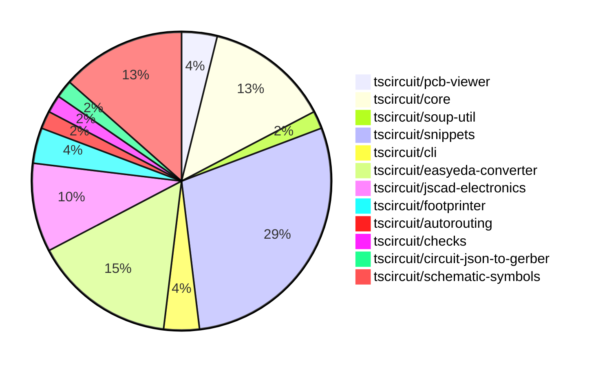

# Contribution Overview 2024-10-10

## PRs by Repository

## Contributor Overview

| Contributor | 🐳 Major | 🐙 Minor | 🐌 Tiny | ⭐ |
|-------------|-------|-------|-------|-------|
| [seveibar](#seveibar) | 11 | 13 | 1 | ⭐⭐⭐ |
| [imrishabh18](#imrishabh18) | 2 | 3 | 1 | ⭐⭐ |
| [anas-sarkez](#anas-sarkez) | 2 | 2 | 0 | ⭐⭐ |
| [andrii-balitskyi](#andrii-balitskyi) | 1 | 2 | 0 | ⭐ |
| [mrudulpatil18](#mrudulpatil18) | 0 | 4 | 0 | ⭐ |
| [ni9999](#ni9999) | 0 | 2 | 0 | ⭐ |
| [MandeepPaul](#MandeepPaul) | 1 | 0 | 0 | ⭐ |
| [ShiboSoftwareDev](#ShiboSoftwareDev) | 0 | 1 | 1 |  |
| [qalbun-salim](#qalbun-salim) | 0 | 1 | 0 |  |
| [anugcodes](#anugcodes) | 0 | 1 | 0 |  |
| [0SlowPoke0](#0SlowPoke0) | 0 | 1 | 0 |  |
| [aman1376](#aman1376) | 0 | 1 | 0 |  |
| [Abse2001](#Abse2001) | 0 | 1 | 0 |  |

## Changes by Repository

### [tscircuit/pcb-viewer](https://github.com/tscircuit/pcb-viewer)

| PR # | Impact | Contributor | Description |
|------|--------|-------------|-------------|
| [#73](https://github.com/tscircuit/pcb-viewer/pull/73) | 🐳 Major | imrishabh18 | Refactor to remove the `@tscircuit/builder` and `@tscircuit/react-fiber` dependencies and use the `@tscircuit/core` module instead. |
| [#74](https://github.com/tscircuit/pcb-viewer/pull/74) | 🐙 Minor | imrishabh18 | Refactor/remove builder |

### [tscircuit/core](https://github.com/tscircuit/core)

| PR # | Impact | Contributor | Description |
|------|--------|-------------|-------------|
| [#151](https://github.com/tscircuit/core/pull/151) | 🐳 Major | imrishabh18 | Adds a new primitive component called "Via" to the project. |
| [#157](https://github.com/tscircuit/core/pull/157) | 🐳 Major | seveibar | Introduces a new function `createUseComponent` that creates a React component with automatically generated traces. |
| [#155](https://github.com/tscircuit/core/pull/155) | 🐙 Minor | imrishabh18 | Add aliases "left" and "right" to the ports of the Capacitor and Resistor components. |
| [#153](https://github.com/tscircuit/core/pull/153) | 🐙 Minor | imrishabh18 | Added SilkscreenCircle and SilkscreenRect components to the library. |
| [#161](https://github.com/tscircuit/core/pull/161) | 🐙 Minor | seveibar | Adds support for `cadModel.positionOffset` to allow for customizing the position of CAD models in the circuit. |
| [#159](https://github.com/tscircuit/core/pull/159) | 🐙 Minor | seveibar | Add support for creating `pcb_hole` component from soup |
| [#158](https://github.com/tscircuit/core/pull/158) | 🐙 Minor | seveibar | Adds the `createUseComponent` function to the exported symbols. |

### [tscircuit/soup-util](https://github.com/tscircuit/soup-util)

| PR # | Impact | Contributor | Description |
|------|--------|-------------|-------------|
| [#23](https://github.com/tscircuit/soup-util/pull/23) | 🐌 Tiny | imrishabh18 | Fix type issue in `find-bounds-and-center.ts` file |

### [tscircuit/snippets](https://github.com/tscircuit/snippets)

| PR # | Impact | Contributor | Description |
|------|--------|-------------|-------------|
| [#46](https://github.com/tscircuit/snippets/pull/46) | 🐳 Major | andrii-balitskyi | Introduces the initial ordering API and UI, including the ability to add orders, order files, and view a list of orders. |
| [#62](https://github.com/tscircuit/snippets/pull/62) | 🐳 Major | seveibar | Adds replication in seed and fixes recursive importing. |
| [#61](https://github.com/tscircuit/snippets/pull/61) | 🐳 Major | seveibar | Adds a new feature to delete a snippet from the fake-snippets-api. |
| [#56](https://github.com/tscircuit/snippets/pull/56) | 🐳 Major | seveibar | Adds Playwright testing for the landing page and view snippet functionality, refactors the project structure, and includes various bug fixes and improvements. |
| [#54](https://github.com/tscircuit/snippets/pull/54) | 🐳 Major | seveibar | Adds a search endpoint for snippets and a dialog to import snippets |
| [#53](https://github.com/tscircuit/snippets/pull/53) | 🐳 Major | seveibar | Add core to runtime, add format button, 404 snippet page, minor fixes |
| [#52](https://github.com/tscircuit/snippets/pull/52) | 🐳 Major | seveibar | Adds support for anonymous user editing, improves the code editor and AI page for empty states, and fixes issues with the code editor scrollability. |
| [#48](https://github.com/tscircuit/snippets/pull/48) | 🐳 Major | seveibar | Imports the runner part 1, which also fixes the dashboard always loading from a hardcoded "seveibar/" path. |
| [#63](https://github.com/tscircuit/snippets/pull/63) | 🐙 Minor | seveibar | Update easyeda dependency to fix issue importing diode |
| [#58](https://github.com/tscircuit/snippets/pull/58) | 🐙 Minor | seveibar | Fixes an issue with the early hook return in the AI page test. |
| [#57](https://github.com/tscircuit/snippets/pull/57) | 🐙 Minor | seveibar | Adds a rename functionality to the EditorNav component. |
| [#51](https://github.com/tscircuit/snippets/pull/51) | 🐙 Minor | seveibar | Fix code editor scrolling overflow, support exporting hooks |
| [#50](https://github.com/tscircuit/snippets/pull/50) | 🐙 Minor | seveibar | Refactors the code to use explicit runs and fixes an issue with importing. |
| [#43](https://github.com/tscircuit/snippets/pull/43) | 🐙 Minor | mrudulpatil18 | Persist the visibility of onboarding tips in the global store and update the `LandingHero` component to use the global store for managing the visibility. |
| [#49](https://github.com/tscircuit/snippets/pull/49) | 🐙 Minor | Abse2001 | Implemented a download function for the circuitJson download button. |

### [tscircuit/cli](https://github.com/tscircuit/cli)

| PR # | Impact | Contributor | Description |
|------|--------|-------------|-------------|
| [#210](https://github.com/tscircuit/cli/pull/210) | 🐙 Minor | andrii-balitskyi | Add a new command `gen jlcpcb <jlcpcbPartNumberOrUrl>` to generate JLCPCB-specific files. |
| [#217](https://github.com/tscircuit/cli/pull/217) | 🐙 Minor | qalbun-salim | Add a new command `export pnp_csv` to the CLI, which exports a Plug n Play CSV file from an example file. |

### [tscircuit/easyeda-converter](https://github.com/tscircuit/easyeda-converter)

| PR # | Impact | Contributor | Description |
|------|--------|-------------|-------------|
| [#60](https://github.com/tscircuit/easyeda-converter/pull/60) | 🐳 Major | seveibar | Introduces a new footprint generation mechanism for more stable units and adds support for `<hole />` elements. |
| [#59](https://github.com/tscircuit/easyeda-converter/pull/59) | 🐳 Major | seveibar | Fixes PCB hole creation and adds snapshot testing |
| [#56](https://github.com/tscircuit/easyeda-converter/pull/56) | 🐳 Major | seveibar | Adds a benchmark script to convert EasyEDA JSON files to various formats and logs the results. |
| [#49](https://github.com/tscircuit/easyeda-converter/pull/49) | 🐙 Minor | andrii-balitskyi | Update the `number` property in `PadSchema` and `pinNumber` property in `PinShapeOutputSchema` to accept both string and number values. |
| [#64](https://github.com/tscircuit/easyeda-converter/pull/64) | 🐙 Minor | seveibar | Adds support for parsing and handling PATH shapes in the EasyEDA converter. |
| [#62](https://github.com/tscircuit/easyeda-converter/pull/62) | 🐙 Minor | seveibar | Fix the PCB component offset and add a test to check for large dimensions. |
| [#61](https://github.com/tscircuit/easyeda-converter/pull/61) | 🐙 Minor | seveibar | Fixes the double flip of the y-axis in the PCB layout. |
| [#54](https://github.com/tscircuit/easyeda-converter/pull/54) | 🐌 Tiny | seveibar | Replacing the import of `createUseComponent` from a local module to the `@tscircuit/core` module. |

### [tscircuit/jscad-electronics](https://github.com/tscircuit/jscad-electronics)

| PR # | Impact | Contributor | Description |
|------|--------|-------------|-------------|
| [#67](https://github.com/tscircuit/jscad-electronics/pull/67) | 🐳 Major | anas-sarkez | Implements a new USB-A female connector component. |
| [#65](https://github.com/tscircuit/jscad-electronics/pull/65) | 🐳 Major | anas-sarkez | Refactors the QFP component to support customizable pitch, lead width, and body dimensions, and adds a new QFP 128 3D footprint. |
| [#64](https://github.com/tscircuit/jscad-electronics/pull/64) | 🐙 Minor | anas-sarkez | Added a new example for a 16-pin DIP footprint with a wider body, and fixed the length calculation for the DIP model. |
| [#66](https://github.com/tscircuit/jscad-electronics/pull/66) | 🐙 Minor | ni9999 | Added a new component called `AxialCapacitor` that can be used to render an axial capacitor in either a vertical or horizontal orientation. |
| [#59](https://github.com/tscircuit/jscad-electronics/pull/59) | 🐙 Minor | ni9999 | Adds a new component called `AxialLed` to the project, which represents an axial LED. |

### [tscircuit/footprinter](https://github.com/tscircuit/footprinter)

| PR # | Impact | Contributor | Description |
|------|--------|-------------|-------------|
| [#62](https://github.com/tscircuit/footprinter/pull/62) | 🐙 Minor | anas-sarkez | Modified and fixed the default value of qfp according to the data sheet. |
| [#61](https://github.com/tscircuit/footprinter/pull/61) | 🐙 Minor | seveibar | Add error handling for invalid footprint function names in the `fp.string` method. |

### [tscircuit/autorouting](https://github.com/tscircuit/autorouting)

| PR # | Impact | Contributor | Description |
|------|--------|-------------|-------------|
| [#81](https://github.com/tscircuit/autorouting/pull/81) | 🐙 Minor | seveibar | Update the types used in the code from `AnySoupElement` to `AnyCircuitElement`. |

### [tscircuit/checks](https://github.com/tscircuit/checks)

| PR # | Impact | Contributor | Description |
|------|--------|-------------|-------------|
| [#17](https://github.com/tscircuit/checks/pull/17) | 🐙 Minor | ShiboSoftwareDev | Refactored the code to use the `circuit-json` module instead of the `@tscircuit/soup` module. |

### [tscircuit/circuit-json-to-gerber](https://github.com/tscircuit/circuit-json-to-gerber)

| PR # | Impact | Contributor | Description |
|------|--------|-------------|-------------|
| [#20](https://github.com/tscircuit/circuit-json-to-gerber/pull/20) | 🐌 Tiny | ShiboSoftwareDev | Added a CODEOWNERS file to the repository. |

### [tscircuit/schematic-symbols](https://github.com/tscircuit/schematic-symbols)

| PR # | Impact | Contributor | Description |
|------|--------|-------------|-------------|
| [#169](https://github.com/tscircuit/schematic-symbols/pull/169) | 🐳 Major | MandeepPaul | Introduce a new JSON file for a "Mushroom Head Normally Open Momentary" component. |
| [#166](https://github.com/tscircuit/schematic-symbols/pull/166) | 🐙 Minor | mrudulpatil18 | Added a count of unique schematic symbols and a GitHub stars badge to the header of the webpage. |
| [#161](https://github.com/tscircuit/schematic-symbols/pull/161) | 🐙 Minor | mrudulpatil18 | Added a new PNP bipolar transistor symbol. |
| [#156](https://github.com/tscircuit/schematic-symbols/pull/156) | 🐙 Minor | mrudulpatil18 | Adds an SVG image and JSON definition for an NPN bipolar transistor symbol. |
| [#160](https://github.com/tscircuit/schematic-symbols/pull/160) | 🐙 Minor | anugcodes | Added an SPDT (Single Pole Double Throw) switch symbol to the project. |
| [#157](https://github.com/tscircuit/schematic-symbols/pull/157) | 🐙 Minor | 0SlowPoke0 | Adds a new SVG symbol for a filled diode. |
| [#158](https://github.com/tscircuit/schematic-symbols/pull/158) | 🐙 Minor | aman1376 | Adds a new SPST (Single Pole Single Throw) switch symbol. |

## Changes by Contributor

### [imrishabh18](https://github.com/imrishabh18)

| PR # | Impact | Description |
|------|--------|-------------|
| [#73](https://github.com/tscircuit/pcb-viewer/pull/73) | 🐳 Major | Refactor to remove the `@tscircuit/builder` and `@tscircuit/react-fiber` dependencies and use the `@tscircuit/core` module instead. |
| [#151](https://github.com/tscircuit/core/pull/151) | 🐳 Major | Adds a new primitive component called "Via" to the project. |
| [#74](https://github.com/tscircuit/pcb-viewer/pull/74) | 🐙 Minor | Refactor/remove builder |
| [#155](https://github.com/tscircuit/core/pull/155) | 🐙 Minor | Add aliases "left" and "right" to the ports of the Capacitor and Resistor components. |
| [#153](https://github.com/tscircuit/core/pull/153) | 🐙 Minor | Added SilkscreenCircle and SilkscreenRect components to the library. |
| [#23](https://github.com/tscircuit/soup-util/pull/23) | 🐌 Tiny | Fix type issue in `find-bounds-and-center.ts` file |

### [andrii-balitskyi](https://github.com/andrii-balitskyi)

| PR # | Impact | Description |
|------|--------|-------------|
| [#46](https://github.com/tscircuit/snippets/pull/46) | 🐳 Major | Introduces the initial ordering API and UI, including the ability to add orders, order files, and view a list of orders. |
| [#210](https://github.com/tscircuit/cli/pull/210) | 🐙 Minor | Add a new command `gen jlcpcb <jlcpcbPartNumberOrUrl>` to generate JLCPCB-specific files. |
| [#49](https://github.com/tscircuit/easyeda-converter/pull/49) | 🐙 Minor | Update the `number` property in `PadSchema` and `pinNumber` property in `PinShapeOutputSchema` to accept both string and number values. |

### [qalbun-salim](https://github.com/qalbun-salim)

| PR # | Impact | Description |
|------|--------|-------------|
| [#217](https://github.com/tscircuit/cli/pull/217) | 🐙 Minor | Add a new command `export pnp_csv` to the CLI, which exports a Plug n Play CSV file from an example file. |

### [anas-sarkez](https://github.com/anas-sarkez)

| PR # | Impact | Description |
|------|--------|-------------|
| [#67](https://github.com/tscircuit/jscad-electronics/pull/67) | 🐳 Major | Implements a new USB-A female connector component. |
| [#65](https://github.com/tscircuit/jscad-electronics/pull/65) | 🐳 Major | Refactors the QFP component to support customizable pitch, lead width, and body dimensions, and adds a new QFP 128 3D footprint. |
| [#62](https://github.com/tscircuit/footprinter/pull/62) | 🐙 Minor | Modified and fixed the default value of qfp according to the data sheet. |
| [#64](https://github.com/tscircuit/jscad-electronics/pull/64) | 🐙 Minor | Added a new example for a 16-pin DIP footprint with a wider body, and fixed the length calculation for the DIP model. |

### [seveibar](https://github.com/seveibar)

| PR # | Impact | Description |
|------|--------|-------------|
| [#60](https://github.com/tscircuit/easyeda-converter/pull/60) | 🐳 Major | Introduces a new footprint generation mechanism for more stable units and adds support for `<hole />` elements. |
| [#59](https://github.com/tscircuit/easyeda-converter/pull/59) | 🐳 Major | Fixes PCB hole creation and adds snapshot testing |
| [#56](https://github.com/tscircuit/easyeda-converter/pull/56) | 🐳 Major | Adds a benchmark script to convert EasyEDA JSON files to various formats and logs the results. |
| [#157](https://github.com/tscircuit/core/pull/157) | 🐳 Major | Introduces a new function `createUseComponent` that creates a React component with automatically generated traces. |
| [#62](https://github.com/tscircuit/snippets/pull/62) | 🐳 Major | Adds replication in seed and fixes recursive importing. |
| [#61](https://github.com/tscircuit/snippets/pull/61) | 🐳 Major | Adds a new feature to delete a snippet from the fake-snippets-api. |
| [#56](https://github.com/tscircuit/snippets/pull/56) | 🐳 Major | Adds Playwright testing for the landing page and view snippet functionality, refactors the project structure, and includes various bug fixes and improvements. |
| [#54](https://github.com/tscircuit/snippets/pull/54) | 🐳 Major | Adds a search endpoint for snippets and a dialog to import snippets |
| [#53](https://github.com/tscircuit/snippets/pull/53) | 🐳 Major | Add core to runtime, add format button, 404 snippet page, minor fixes |
| [#52](https://github.com/tscircuit/snippets/pull/52) | 🐳 Major | Adds support for anonymous user editing, improves the code editor and AI page for empty states, and fixes issues with the code editor scrollability. |
| [#48](https://github.com/tscircuit/snippets/pull/48) | 🐳 Major | Imports the runner part 1, which also fixes the dashboard always loading from a hardcoded "seveibar/" path. |
| [#61](https://github.com/tscircuit/footprinter/pull/61) | 🐙 Minor | Add error handling for invalid footprint function names in the `fp.string` method. |
| [#64](https://github.com/tscircuit/easyeda-converter/pull/64) | 🐙 Minor | Adds support for parsing and handling PATH shapes in the EasyEDA converter. |
| [#62](https://github.com/tscircuit/easyeda-converter/pull/62) | 🐙 Minor | Fix the PCB component offset and add a test to check for large dimensions. |
| [#61](https://github.com/tscircuit/easyeda-converter/pull/61) | 🐙 Minor | Fixes the double flip of the y-axis in the PCB layout. |
| [#161](https://github.com/tscircuit/core/pull/161) | 🐙 Minor | Adds support for `cadModel.positionOffset` to allow for customizing the position of CAD models in the circuit. |
| [#159](https://github.com/tscircuit/core/pull/159) | 🐙 Minor | Add support for creating `pcb_hole` component from soup |
| [#158](https://github.com/tscircuit/core/pull/158) | 🐙 Minor | Adds the `createUseComponent` function to the exported symbols. |
| [#81](https://github.com/tscircuit/autorouting/pull/81) | 🐙 Minor | Update the types used in the code from `AnySoupElement` to `AnyCircuitElement`. |
| [#63](https://github.com/tscircuit/snippets/pull/63) | 🐙 Minor | Update easyeda dependency to fix issue importing diode |
| [#58](https://github.com/tscircuit/snippets/pull/58) | 🐙 Minor | Fixes an issue with the early hook return in the AI page test. |
| [#57](https://github.com/tscircuit/snippets/pull/57) | 🐙 Minor | Adds a rename functionality to the EditorNav component. |
| [#51](https://github.com/tscircuit/snippets/pull/51) | 🐙 Minor | Fix code editor scrolling overflow, support exporting hooks |
| [#50](https://github.com/tscircuit/snippets/pull/50) | 🐙 Minor | Refactors the code to use explicit runs and fixes an issue with importing. |
| [#54](https://github.com/tscircuit/easyeda-converter/pull/54) | 🐌 Tiny | Replacing the import of `createUseComponent` from a local module to the `@tscircuit/core` module. |

### [ni9999](https://github.com/ni9999)

| PR # | Impact | Description |
|------|--------|-------------|
| [#66](https://github.com/tscircuit/jscad-electronics/pull/66) | 🐙 Minor | Added a new component called `AxialCapacitor` that can be used to render an axial capacitor in either a vertical or horizontal orientation. |
| [#59](https://github.com/tscircuit/jscad-electronics/pull/59) | 🐙 Minor | Adds a new component called `AxialLed` to the project, which represents an axial LED. |

### [ShiboSoftwareDev](https://github.com/ShiboSoftwareDev)

| PR # | Impact | Description |
|------|--------|-------------|
| [#17](https://github.com/tscircuit/checks/pull/17) | 🐙 Minor | Refactored the code to use the `circuit-json` module instead of the `@tscircuit/soup` module. |
| [#20](https://github.com/tscircuit/circuit-json-to-gerber/pull/20) | 🐌 Tiny | Added a CODEOWNERS file to the repository. |

### [MandeepPaul](https://github.com/MandeepPaul)

| PR # | Impact | Description |
|------|--------|-------------|
| [#169](https://github.com/tscircuit/schematic-symbols/pull/169) | 🐳 Major | Introduce a new JSON file for a "Mushroom Head Normally Open Momentary" component. |

### [mrudulpatil18](https://github.com/mrudulpatil18)

| PR # | Impact | Description |
|------|--------|-------------|
| [#166](https://github.com/tscircuit/schematic-symbols/pull/166) | 🐙 Minor | Added a count of unique schematic symbols and a GitHub stars badge to the header of the webpage. |
| [#161](https://github.com/tscircuit/schematic-symbols/pull/161) | 🐙 Minor | Added a new PNP bipolar transistor symbol. |
| [#156](https://github.com/tscircuit/schematic-symbols/pull/156) | 🐙 Minor | Adds an SVG image and JSON definition for an NPN bipolar transistor symbol. |
| [#43](https://github.com/tscircuit/snippets/pull/43) | 🐙 Minor | Persist the visibility of onboarding tips in the global store and update the `LandingHero` component to use the global store for managing the visibility. |

### [anugcodes](https://github.com/anugcodes)

| PR # | Impact | Description |
|------|--------|-------------|
| [#160](https://github.com/tscircuit/schematic-symbols/pull/160) | 🐙 Minor | Added an SPDT (Single Pole Double Throw) switch symbol to the project. |

### [0SlowPoke0](https://github.com/0SlowPoke0)

| PR # | Impact | Description |
|------|--------|-------------|
| [#157](https://github.com/tscircuit/schematic-symbols/pull/157) | 🐙 Minor | Adds a new SVG symbol for a filled diode. |

### [aman1376](https://github.com/aman1376)

| PR # | Impact | Description |
|------|--------|-------------|
| [#158](https://github.com/tscircuit/schematic-symbols/pull/158) | 🐙 Minor | Adds a new SPST (Single Pole Single Throw) switch symbol. |

### [Abse2001](https://github.com/Abse2001)

| PR # | Impact | Description |
|------|--------|-------------|
| [#49](https://github.com/tscircuit/snippets/pull/49) | 🐙 Minor | Implemented a download function for the circuitJson download button. |

