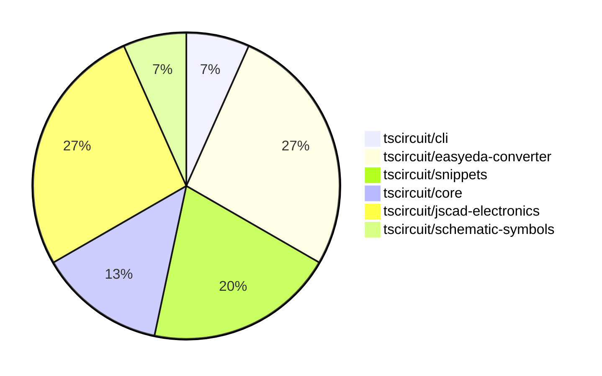

# Contribution Overview 2024-10-12

## PRs by Repository

## Contributor Overview

| Contributor | 🐳 Major | 🐙 Minor | 🐌 Tiny |
|-------------|-------|-------|-------|
| qalbun-salim | 1 | 0 | 0 |
| seveibar | 6 | 2 | 1 |
| anas-sarkez | 2 | 0 | 0 |
| ni9999 | 2 | 0 | 0 |
| anugcodes | 1 | 0 | 0 |

## Changes by Repository

### [tscircuit/cli](https://github.com/tscircuit/cli)

| PR # | Impact | Contributor | Description |
|------|--------|-------------|-------------|
| [#217](https://github.com/tscircuit/cli/pull/217) | 🐳 Major | qalbun-salim | Add an `export pnp_csv` command to the CLI to export a Plug n Play CSV file from an example file. |

### [tscircuit/easyeda-converter](https://github.com/tscircuit/easyeda-converter)

| PR # | Impact | Contributor | Description |
|------|--------|-------------|-------------|
| [#60](https://github.com/tscircuit/easyeda-converter/pull/60) | 🐳 Major | seveibar | Introduces a new footprint tsx generation mechanism for more stable units and adds support for the `<hole />` element. |
| [#59](https://github.com/tscircuit/easyeda-converter/pull/59) | 🐳 Major | seveibar | Fix Hole Creation, Add snapshot testing |
| [#56](https://github.com/tscircuit/easyeda-converter/pull/56) | 🐳 Major | seveibar | Add a benchmark script to convert EasyEDA JSON to various formats and report successes and failures. |
| [#54](https://github.com/tscircuit/easyeda-converter/pull/54) | 🐌 Tiny | seveibar | Replacing the import of `createUseComponent` from "tscircuit" to "@tscircuit/core" |

### [tscircuit/snippets](https://github.com/tscircuit/snippets)

| PR # | Impact | Contributor | Description |
|------|--------|-------------|-------------|
| [#54](https://github.com/tscircuit/snippets/pull/54) | 🐳 Major | seveibar | Adds a feature for importing code snippets from a search dialog. |
| [#53](https://github.com/tscircuit/snippets/pull/53) | 🐳 Major | seveibar | Adds core to runtime, adds a format button, and creates a 404 snippet page. Also includes minor fixes. |
| [#52](https://github.com/tscircuit/snippets/pull/52) | 🐳 Major | seveibar | Introduce anonymous user editing, improve empty states in the code editor and AI page, and fix code editor scrolling issues. |

### [tscircuit/core](https://github.com/tscircuit/core)

| PR # | Impact | Contributor | Description |
|------|--------|-------------|-------------|
| [#159](https://github.com/tscircuit/core/pull/159) | 🐙 Minor | seveibar | Introduce support for creating `pcb_hole` component from soup |
| [#158](https://github.com/tscircuit/core/pull/158) | 🐙 Minor | seveibar | Export the `createUseComponent` function from the `hooks/create-use-component` module. |

### [tscircuit/jscad-electronics](https://github.com/tscircuit/jscad-electronics)

| PR # | Impact | Contributor | Description |
|------|--------|-------------|-------------|
| [#67](https://github.com/tscircuit/jscad-electronics/pull/67) | 🐳 Major | anas-sarkez | Implementing a USB-A female connector component with a customizable design. |
| [#65](https://github.com/tscircuit/jscad-electronics/pull/65) | 🐳 Major | anas-sarkez | Refactor QFP component to support customizable pitch, lead width, and body dimensions, and add a QFP 128 3D footprint. |
| [#66](https://github.com/tscircuit/jscad-electronics/pull/66) | 🐳 Major | ni9999 | Adds a new Axial Capacitor component with vertical and horizontal variants. |
| [#59](https://github.com/tscircuit/jscad-electronics/pull/59) | 🐳 Major | ni9999 | Added a new component called `AxialLed` to the project. |

### [tscircuit/schematic-symbols](https://github.com/tscircuit/schematic-symbols)

| PR # | Impact | Contributor | Description |
|------|--------|-------------|-------------|
| [#160](https://github.com/tscircuit/schematic-symbols/pull/160) | 🐳 Major | anugcodes | Added an SPDT (Single Pole Double Throw) switch symbol with associated JSON and SVG files. |

## Changes by Contributor

### [qalbun-salim](https://github.com/qalbun-salim)

| PR # | Impact | Description |
|------|--------|-------------|
| [#217](https://github.com/tscircuit/cli/pull/217) | 🐳 Major | Add an `export pnp_csv` command to the CLI to export a Plug n Play CSV file from an example file. |

### [seveibar](https://github.com/seveibar)

| PR # | Impact | Description |
|------|--------|-------------|
| [#60](https://github.com/tscircuit/easyeda-converter/pull/60) | 🐳 Major | Introduces a new footprint tsx generation mechanism for more stable units and adds support for the `<hole />` element. |
| [#59](https://github.com/tscircuit/easyeda-converter/pull/59) | 🐳 Major | Fix Hole Creation, Add snapshot testing |
| [#56](https://github.com/tscircuit/easyeda-converter/pull/56) | 🐳 Major | Add a benchmark script to convert EasyEDA JSON to various formats and report successes and failures. |
| [#54](https://github.com/tscircuit/snippets/pull/54) | 🐳 Major | Adds a feature for importing code snippets from a search dialog. |
| [#53](https://github.com/tscircuit/snippets/pull/53) | 🐳 Major | Adds core to runtime, adds a format button, and creates a 404 snippet page. Also includes minor fixes. |
| [#52](https://github.com/tscircuit/snippets/pull/52) | 🐳 Major | Introduce anonymous user editing, improve empty states in the code editor and AI page, and fix code editor scrolling issues. |
| [#159](https://github.com/tscircuit/core/pull/159) | 🐙 Minor | Introduce support for creating `pcb_hole` component from soup |
| [#158](https://github.com/tscircuit/core/pull/158) | 🐙 Minor | Export the `createUseComponent` function from the `hooks/create-use-component` module. |
| [#54](https://github.com/tscircuit/easyeda-converter/pull/54) | 🐌 Tiny | Replacing the import of `createUseComponent` from "tscircuit" to "@tscircuit/core" |

### [anas-sarkez](https://github.com/anas-sarkez)

| PR # | Impact | Description |
|------|--------|-------------|
| [#67](https://github.com/tscircuit/jscad-electronics/pull/67) | 🐳 Major | Implementing a USB-A female connector component with a customizable design. |
| [#65](https://github.com/tscircuit/jscad-electronics/pull/65) | 🐳 Major | Refactor QFP component to support customizable pitch, lead width, and body dimensions, and add a QFP 128 3D footprint. |

### [ni9999](https://github.com/ni9999)

| PR # | Impact | Description |
|------|--------|-------------|
| [#66](https://github.com/tscircuit/jscad-electronics/pull/66) | 🐳 Major | Adds a new Axial Capacitor component with vertical and horizontal variants. |
| [#59](https://github.com/tscircuit/jscad-electronics/pull/59) | 🐳 Major | Added a new component called `AxialLed` to the project. |

### [anugcodes](https://github.com/anugcodes)

| PR # | Impact | Description |
|------|--------|-------------|
| [#160](https://github.com/tscircuit/schematic-symbols/pull/160) | 🐳 Major | Added an SPDT (Single Pole Double Throw) switch symbol with associated JSON and SVG files. |

