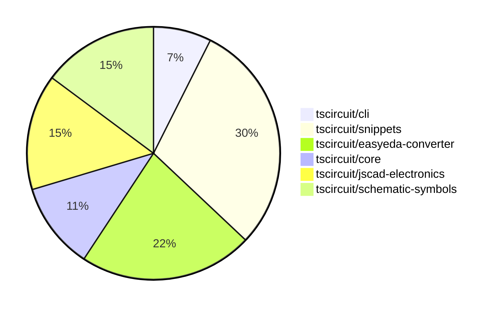

# Contribution Overview 2024-10-12

## PRs by Repository

## Contributor Overview

| Contributor | 🐳 Major | 🐙 Minor | 🐌 Tiny |
|-------------|-------|-------|-------|
| andrii-balitskyi | 2 | 0 | 0 |
| qalbun-salim | 1 | 0 | 0 |
| seveibar | 10 | 4 | 1 |
| anas-sarkez | 2 | 0 | 0 |
| ni9999 | 2 | 0 | 0 |
| MandeepPaul | 1 | 0 | 0 |
| mrudulpatil18 | 1 | 1 | 0 |
| anugcodes | 1 | 0 | 0 |

## Changes by Repository

### [tscircuit/cli](https://github.com/tscircuit/cli)

| PR # | Impact | Contributor | Description |
|------|--------|-------------|-------------|
| [#210](https://github.com/tscircuit/cli/pull/210) | 🐳 Major | andrii-balitskyi | Add a new command `gen jlcpcb <jlcpcbPartNumberOrUrl>` to generate JLCPCB-specific files. |
| [#217](https://github.com/tscircuit/cli/pull/217) | 🐳 Major | qalbun-salim | Add a new command `export pnp_csv` to the CLI, which exports a Plug n Play (PNP) CSV file from an example file. |

### [tscircuit/snippets](https://github.com/tscircuit/snippets)

| PR # | Impact | Contributor | Description |
|------|--------|-------------|-------------|
| [#46](https://github.com/tscircuit/snippets/pull/46) | 🐳 Major | andrii-balitskyi | Introduce initial ordering API and UI |
| [#61](https://github.com/tscircuit/snippets/pull/61) | 🐳 Major | seveibar | Implement a feature to delete snippets from the fake snippets API. |
| [#57](https://github.com/tscircuit/snippets/pull/57) | 🐳 Major | seveibar | Add rename functionality for snippets. |
| [#56](https://github.com/tscircuit/snippets/pull/56) | 🐳 Major | seveibar | Allow anonymous mutations for logged-in users, generally don't create snippet unless save button is pressed, various fixes, refactor for reuse, playwright snapshot testing, loading/404 pages |
| [#54](https://github.com/tscircuit/snippets/pull/54) | 🐳 Major | seveibar | Adds a new dialog component for importing code snippets and a new endpoint for searching snippets. |
| [#58](https://github.com/tscircuit/snippets/pull/58) | 🐙 Minor | seveibar | Fix an issue with the early return in the AI page test |
| [#53](https://github.com/tscircuit/snippets/pull/53) | 🟣 | seveibar | Add core to runtime, add format button, 404 snippet page, minor fixes |
| [#52](https://github.com/tscircuit/snippets/pull/52) | 🐳 Major | seveibar | Introduces anonymous user editing, other code editor/AI page improvements for empty states, and fixes the code editor not being scrollable. |

### [tscircuit/easyeda-converter](https://github.com/tscircuit/easyeda-converter)

| PR # | Impact | Contributor | Description |
|------|--------|-------------|-------------|
| [#62](https://github.com/tscircuit/easyeda-converter/pull/62) | 🐳 Major | seveibar | Fix pcb_component offset and add a test to check for large dimensions |
| [#60](https://github.com/tscircuit/easyeda-converter/pull/60) | 🐳 Major | seveibar | Introduces a new footprint generation mechanism for more stable units and adds support for the `<hole />` element. |
| [#59](https://github.com/tscircuit/easyeda-converter/pull/59) | 🐳 Major | seveibar | Fix Hole Creation, Add snapshot testing |
| [#56](https://github.com/tscircuit/easyeda-converter/pull/56) | 🐳 Major | seveibar | Add a benchmark script to test the `convertEasyEdaJsonToVariousFormats` function and write the results to a file. |
| [#61](https://github.com/tscircuit/easyeda-converter/pull/61) | 🐙 Minor | seveibar | Prevent double flip of y-axis when converting EasyEDA JSON to TSCircuit Soup JSON. |
| [#54](https://github.com/tscircuit/easyeda-converter/pull/54) | 🐌 Tiny | seveibar | The pull request changes the import of `createUseComponent` from the local `tscircuit` module to the `@tscircuit/core` module. |

### [tscircuit/core](https://github.com/tscircuit/core)

| PR # | Impact | Contributor | Description |
|------|--------|-------------|-------------|
| [#161](https://github.com/tscircuit/core/pull/161) | 🐳 Major | seveibar | Add support for `cadModel.positionOffset` property to adjust the position of the CAD model component. |
| [#159](https://github.com/tscircuit/core/pull/159) | 🐙 Minor | seveibar | Add support for creating `pcb_hole` component from soup |
| [#158](https://github.com/tscircuit/core/pull/158) | 🐙 Minor | seveibar | Export `createUseComponent` function from the library. |

### [tscircuit/jscad-electronics](https://github.com/tscircuit/jscad-electronics)

| PR # | Impact | Contributor | Description |
|------|--------|-------------|-------------|
| [#67](https://github.com/tscircuit/jscad-electronics/pull/67) | 🐳 Major | anas-sarkez | Implementing a USB-A female connector component with customizable dimensions and colors. |
| [#65](https://github.com/tscircuit/jscad-electronics/pull/65) | 🐳 Major | anas-sarkez | Refactor the QFP component to support customizable pitch, lead width, and body dimensions, and add a new QFP 128 3D footprint example. |
| [#66](https://github.com/tscircuit/jscad-electronics/pull/66) | 🐳 Major | ni9999 | Added a new `AxialCapacitor` component to the library, which can be used with a `vertical` or `horizontal` variant. |
| [#59](https://github.com/tscircuit/jscad-electronics/pull/59) | 🐳 Major | ni9999 | Added a new component called `AxialLed` to the library, which represents an axial LED with customizable pitch. |

### [tscircuit/schematic-symbols](https://github.com/tscircuit/schematic-symbols)

| PR # | Impact | Contributor | Description |
|------|--------|-------------|-------------|
| [#169](https://github.com/tscircuit/schematic-symbols/pull/169) | 🐳 Major | MandeepPaul | Introduce a new feature - Mushroom Head Normally Open Momentary |
| [#161](https://github.com/tscircuit/schematic-symbols/pull/161) | 🐳 Major | mrudulpatil18 | Added a new PNP bipolar transistor component, including updated SVG and generated TypeScript files. |
| [#160](https://github.com/tscircuit/schematic-symbols/pull/160) | 🐳 Major | anugcodes | Added an SPDT (Single-Pole, Double-Throw) switch symbol |
| [#166](https://github.com/tscircuit/schematic-symbols/pull/166) | 🐙 Minor | mrudulpatil18 | Added a count of unique schematic symbols and a GitHub stars badge to the header of the web page. |

## Changes by Contributor

### [andrii-balitskyi](https://github.com/andrii-balitskyi)

| PR # | Impact | Description |
|------|--------|-------------|
| [#210](https://github.com/tscircuit/cli/pull/210) | 🐳 Major | Add a new command `gen jlcpcb <jlcpcbPartNumberOrUrl>` to generate JLCPCB-specific files. |
| [#46](https://github.com/tscircuit/snippets/pull/46) | 🐳 Major | Introduce initial ordering API and UI |

### [qalbun-salim](https://github.com/qalbun-salim)

| PR # | Impact | Description |
|------|--------|-------------|
| [#217](https://github.com/tscircuit/cli/pull/217) | 🐳 Major | Add a new command `export pnp_csv` to the CLI, which exports a Plug n Play (PNP) CSV file from an example file. |

### [seveibar](https://github.com/seveibar)

| PR # | Impact | Description |
|------|--------|-------------|
| [#62](https://github.com/tscircuit/easyeda-converter/pull/62) | 🐳 Major | Fix pcb_component offset and add a test to check for large dimensions |
| [#60](https://github.com/tscircuit/easyeda-converter/pull/60) | 🐳 Major | Introduces a new footprint generation mechanism for more stable units and adds support for the `<hole />` element. |
| [#59](https://github.com/tscircuit/easyeda-converter/pull/59) | 🐳 Major | Fix Hole Creation, Add snapshot testing |
| [#56](https://github.com/tscircuit/easyeda-converter/pull/56) | 🐳 Major | Add a benchmark script to test the `convertEasyEdaJsonToVariousFormats` function and write the results to a file. |
| [#161](https://github.com/tscircuit/core/pull/161) | 🐳 Major | Add support for `cadModel.positionOffset` property to adjust the position of the CAD model component. |
| [#61](https://github.com/tscircuit/snippets/pull/61) | 🐳 Major | Implement a feature to delete snippets from the fake snippets API. |
| [#57](https://github.com/tscircuit/snippets/pull/57) | 🐳 Major | Add rename functionality for snippets. |
| [#56](https://github.com/tscircuit/snippets/pull/56) | 🐳 Major | Allow anonymous mutations for logged-in users, generally don't create snippet unless save button is pressed, various fixes, refactor for reuse, playwright snapshot testing, loading/404 pages |
| [#54](https://github.com/tscircuit/snippets/pull/54) | 🐳 Major | Adds a new dialog component for importing code snippets and a new endpoint for searching snippets. |
| [#61](https://github.com/tscircuit/easyeda-converter/pull/61) | 🐙 Minor | Prevent double flip of y-axis when converting EasyEDA JSON to TSCircuit Soup JSON. |
| [#159](https://github.com/tscircuit/core/pull/159) | 🐙 Minor | Add support for creating `pcb_hole` component from soup |
| [#158](https://github.com/tscircuit/core/pull/158) | 🐙 Minor | Export `createUseComponent` function from the library. |
| [#58](https://github.com/tscircuit/snippets/pull/58) | 🐙 Minor | Fix an issue with the early return in the AI page test |
| [#54](https://github.com/tscircuit/easyeda-converter/pull/54) | 🐌 Tiny | The pull request changes the import of `createUseComponent` from the local `tscircuit` module to the `@tscircuit/core` module. |
| [#53](https://github.com/tscircuit/snippets/pull/53) | 🟣 | Add core to runtime, add format button, 404 snippet page, minor fixes |
| [#52](https://github.com/tscircuit/snippets/pull/52) | 🐳 Major | Introduces anonymous user editing, other code editor/AI page improvements for empty states, and fixes the code editor not being scrollable. |

### [anas-sarkez](https://github.com/anas-sarkez)

| PR # | Impact | Description |
|------|--------|-------------|
| [#67](https://github.com/tscircuit/jscad-electronics/pull/67) | 🐳 Major | Implementing a USB-A female connector component with customizable dimensions and colors. |
| [#65](https://github.com/tscircuit/jscad-electronics/pull/65) | 🐳 Major | Refactor the QFP component to support customizable pitch, lead width, and body dimensions, and add a new QFP 128 3D footprint example. |

### [ni9999](https://github.com/ni9999)

| PR # | Impact | Description |
|------|--------|-------------|
| [#66](https://github.com/tscircuit/jscad-electronics/pull/66) | 🐳 Major | Added a new `AxialCapacitor` component to the library, which can be used with a `vertical` or `horizontal` variant. |
| [#59](https://github.com/tscircuit/jscad-electronics/pull/59) | 🐳 Major | Added a new component called `AxialLed` to the library, which represents an axial LED with customizable pitch. |

### [MandeepPaul](https://github.com/MandeepPaul)

| PR # | Impact | Description |
|------|--------|-------------|
| [#169](https://github.com/tscircuit/schematic-symbols/pull/169) | 🐳 Major | Introduce a new feature - Mushroom Head Normally Open Momentary |

### [mrudulpatil18](https://github.com/mrudulpatil18)

| PR # | Impact | Description |
|------|--------|-------------|
| [#161](https://github.com/tscircuit/schematic-symbols/pull/161) | 🐳 Major | Added a new PNP bipolar transistor component, including updated SVG and generated TypeScript files. |
| [#166](https://github.com/tscircuit/schematic-symbols/pull/166) | 🐙 Minor | Added a count of unique schematic symbols and a GitHub stars badge to the header of the web page. |

### [anugcodes](https://github.com/anugcodes)

| PR # | Impact | Description |
|------|--------|-------------|
| [#160](https://github.com/tscircuit/schematic-symbols/pull/160) | 🐳 Major | Added an SPDT (Single-Pole, Double-Throw) switch symbol |

