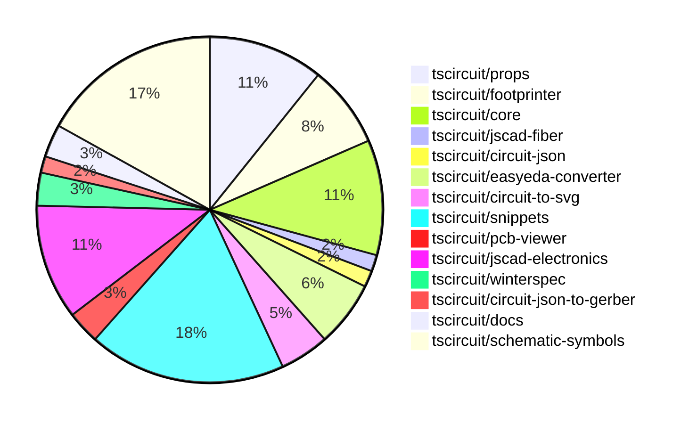

# Contribution Overview 2024-10-16

## PRs by Repository

## Contributor Overview

| Contributor | 🐳 Major | 🐙 Minor | 🐌 Tiny | ⭐ |
|-------------|-------|-------|-------|-------|
| [seveibar](#seveibar) | 7 | 12 | 2 | 👑 |
| [anas-sarkez](#anas-sarkez) | 3 | 5 | 0 | ⭐⭐ |
| [Timer00](#Timer00) | 4 | 1 | 0 | ⭐⭐ |
| [andrii-balitskyi](#andrii-balitskyi) | 1 | 4 | 0 | ⭐⭐ |
| [imrishabh18](#imrishabh18) | 0 | 5 | 1 | ⭐⭐ |
| [ShiboSoftwareDev](#ShiboSoftwareDev) | 0 | 3 | 1 | ⭐ |
| [Abse2001](#Abse2001) | 0 | 3 | 1 | ⭐ |
| [mrudulpatil18](#mrudulpatil18) | 1 | 1 | 0 | ⭐ |
| [theajmalrazaq](#theajmalrazaq) | 0 | 3 | 0 | ⭐ |
| [sarthak-kumar-shailendra](#sarthak-kumar-shailendra) | 0 | 2 | 0 | ⭐ |
| [aman1376](#aman1376) | 0 | 2 | 0 | ⭐ |
| [bbland1](#bbland1) | 0 | 1 | 0 |  |
| [anugcodes](#anugcodes) | 0 | 1 | 0 |  |
| [kom-senapati](#kom-senapati) | 0 | 1 | 0 |  |

## Changes by Repository

### [tscircuit/props](https://github.com/tscircuit/props)

| PR # | Impact | Contributor | Description |
|------|--------|-------------|-------------|
| [#63](https://github.com/tscircuit/props/pull/63) | 🐳 Major | seveibar | Introduce a new battery component with battery types, batteryProps, and set the default unit to mAh. |
| [#65](https://github.com/tscircuit/props/pull/65) | 🐙 Minor | seveibar | Add support for `schAutoLayoutEnabled` prop on `<group />` component |
| [#61](https://github.com/tscircuit/props/pull/61) | 🐙 Minor | seveibar | Reverts the previous addition of "schWidth", "schHeight", "pcbWidth", and "pcbHeight" props, and replaces them with "width" and "height" props. |
| [#62](https://github.com/tscircuit/props/pull/62) | 🐙 Minor | imrishabh18 | Revert changes to `width` and `height` properties in `commonLayoutProps`. |
| [#60](https://github.com/tscircuit/props/pull/60) | 🐙 Minor | imrishabh18 | Replaces the `width` and `height` props with `schWidth`, `schHeight`, `pcbWidth`, and `pcbHeight` props. |
| [#58](https://github.com/tscircuit/props/pull/58) | 🐙 Minor | imrishabh18 | Add width and height properties to the CommonComponentProps interface |
| [#59](https://github.com/tscircuit/props/pull/59) | 🐌 Tiny | imrishabh18 | Updated the project's dependency lock file (e.g. `package-lock.json`, `yarn.lock`, etc.) |

### [tscircuit/footprinter](https://github.com/tscircuit/footprinter)

| PR # | Impact | Contributor | Description |
|------|--------|-------------|-------------|
| [#67](https://github.com/tscircuit/footprinter/pull/67) | 🐳 Major | seveibar | Introduce an automatic gallery generation script to generate an HTML page displaying all SVG snapshots from the tests. |
| [#68](https://github.com/tscircuit/footprinter/pull/68) | 🐳 Major | anas-sarkez | Implemented a new footprint function for stampboard components. |
| [#66](https://github.com/tscircuit/footprinter/pull/66) | 🐙 Minor | seveibar | Introduce pushbutton footprint and update circuit-to-svg dependency |
| [#69](https://github.com/tscircuit/footprinter/pull/69) | 🐙 Minor | anas-sarkez | Implement silkscreen reference for every component and added silkscreenRef function to helpers |
| [#60](https://github.com/tscircuit/footprinter/pull/60) | 🐙 Minor | bbland1 | Adding types for parameters returned using `.json()` function. |

### [tscircuit/core](https://github.com/tscircuit/core)

| PR # | Impact | Contributor | Description |
|------|--------|-------------|-------------|
| [#186](https://github.com/tscircuit/core/pull/186) | 🐳 Major | seveibar | Fix Schematic Ports using local instead of global positions |
| [#185](https://github.com/tscircuit/core/pull/185) | 🐳 Major | seveibar | Implements schematic autolayout and fixes routing issues. |
| [#177](https://github.com/tscircuit/core/pull/177) | 🐳 Major | seveibar | Introduces a new `<battery />` component. |
| [#173](https://github.com/tscircuit/core/pull/173) | 🐳 Major | seveibar | Adds support for shared pin labels in the NormalComponent class, allowing multiple ports to have the same primary label and additional alias labels. |
| [#176](https://github.com/tscircuit/core/pull/176) | 🐙 Minor | seveibar | Fix pcbRotation={-90} not rotating smtpads and keepouts properly, and add support for rotating keepouts. |
| [#187](https://github.com/tscircuit/core/pull/187) | 🐙 Minor | imrishabh18 | Add support for `-size` suffix port arrangements in the `NormalComponent` class. |
| [#182](https://github.com/tscircuit/core/pull/182) | 🐙 Minor | Abse2001 | Fixed the `toMatchSchematicSnapshot` test case for the `Battery` component by updating the `schematicSymbolName` property. |

### [tscircuit/jscad-fiber](https://github.com/tscircuit/jscad-fiber)

| PR # | Impact | Contributor | Description |
|------|--------|-------------|-------------|
| [#84](https://github.com/tscircuit/jscad-fiber/pull/84) | 🐳 Major | seveibar | Implement the `Subtract` component to perform boolean subtraction on 3D geometries. |

### [tscircuit/circuit-json](https://github.com/tscircuit/circuit-json)

| PR # | Impact | Contributor | Description |
|------|--------|-------------|-------------|
| [#59](https://github.com/tscircuit/circuit-json/pull/59) | 🐙 Minor | seveibar | Adds a new circuit element called `simple_battery` with a capacity property. |

### [tscircuit/easyeda-converter](https://github.com/tscircuit/easyeda-converter)

| PR # | Impact | Contributor | Description |
|------|--------|-------------|-------------|
| [#74](https://github.com/tscircuit/easyeda-converter/pull/74) | 🐙 Minor | seveibar | The pull request fixes an issue with the C490691 import and adds a script for quickly adding tests for parts. |
| [#71](https://github.com/tscircuit/easyeda-converter/pull/71) | 🐙 Minor | seveibar | Fixes a bug related to parsing arc data in the package detail shape schema. |
| [#78](https://github.com/tscircuit/easyeda-converter/pull/78) | 🐙 Minor | andrii-balitskyi | Adds support for `T~` text shapes and fixes a script that was giving an error. |
| [#77](https://github.com/tscircuit/easyeda-converter/pull/77) | 🐙 Minor | andrii-balitskyi | Fix the error message in the `convert` command to reflect the updated command option. |

### [tscircuit/circuit-to-svg](https://github.com/tscircuit/circuit-to-svg)

| PR # | Impact | Contributor | Description |
|------|--------|-------------|-------------|
| [#88](https://github.com/tscircuit/circuit-to-svg/pull/88) | 🐙 Minor | seveibar | Fix the schematic port using a relative position |
| [#87](https://github.com/tscircuit/circuit-to-svg/pull/87) | 🐙 Minor | seveibar | Fix silkscreen paths being erroneously closed |
| [#86](https://github.com/tscircuit/circuit-to-svg/pull/86) | 🐙 Minor | Abse2001 | Updated the schematic symbols to fix the battery in the core and formatted the code. |

### [tscircuit/snippets](https://github.com/tscircuit/snippets)

| PR # | Impact | Contributor | Description |
|------|--------|-------------|-------------|
| [#82](https://github.com/tscircuit/snippets/pull/82) | 🐳 Major | andrii-balitskyi | Allow editing shipping information in profile settings |
| [#77](https://github.com/tscircuit/snippets/pull/77) | 🐳 Major | mrudulpatil18 | Adds a search component to the header, allowing users to search for code snippets and view the results in a dropdown. |
| [#84](https://github.com/tscircuit/snippets/pull/84) | 🐙 Minor | seveibar | Fix tab indent in the CodeEditor component |
| [#80](https://github.com/tscircuit/snippets/pull/80) | 🐙 Minor | seveibar | Fixes JLCPCB imports with arc issues, updates for shared pin label support, and fixes errors in local development to show JLCPCB import errors. |
| [#74](https://github.com/tscircuit/snippets/pull/74) | 🐙 Minor | seveibar | Updates the versions of 'circuit-json-to-bom-csv', 'circuit-json-to-pnp-csv', and 'easyeda' dependencies, and adds error handling for the 'downloadFabricationFiles' function. |
| [#68](https://github.com/tscircuit/snippets/pull/68) | 🐙 Minor | andrii-balitskyi | Adds tests for the order files upload and get APIs. |
| [#78](https://github.com/tscircuit/snippets/pull/78) | 🐙 Minor | andrii-balitskyi | Adds a "Submit Order" button and a "Create Order" dialog to the editor navigation bar. |
| [#95](https://github.com/tscircuit/snippets/pull/95) | 🐙 Minor | theajmalrazaq | Fixed the responsiveness of the quickstart page. |
| [#97](https://github.com/tscircuit/snippets/pull/97) | 🐙 Minor | theajmalrazaq | Added Playwright tests for the AI Page and Quickstart Page, added viewports to the existing tests, fixed them, and updated the snapshots. |
| [#85](https://github.com/tscircuit/snippets/pull/85) | 🐙 Minor | theajmalrazaq | Improved search box rendering and dashboard responsiveness |
| [#86](https://github.com/tscircuit/snippets/pull/86) | 🐙 Minor | kom-senapati | Update page title to include the snippet name and owner name. |
| [#96](https://github.com/tscircuit/snippets/pull/96) | 🐌 Tiny | Abse2001 | Updates the dependency "winterspec" from version 0.0.93 to 0.0.94. |

### [tscircuit/pcb-viewer](https://github.com/tscircuit/pcb-viewer)

| PR # | Impact | Contributor | Description |
|------|--------|-------------|-------------|
| [#76](https://github.com/tscircuit/pcb-viewer/pull/76) | 🐌 Tiny | seveibar | Fix formatting and remove console log from silkscreen path story |
| [#75](https://github.com/tscircuit/pcb-viewer/pull/75) | 🐌 Tiny | ShiboSoftwareDev | Added a CODEOWNERS file to the repository. |

### [tscircuit/jscad-electronics](https://github.com/tscircuit/jscad-electronics)

| PR # | Impact | Contributor | Description |
|------|--------|-------------|-------------|
| [#75](https://github.com/tscircuit/jscad-electronics/pull/75) | 🐳 Major | anas-sarkez | Implementing Pin row 3D model and refactoring footprint plated holes |
| [#68](https://github.com/tscircuit/jscad-electronics/pull/68) | 🐳 Major | anas-sarkez | Implementing a USB-C female port 3D component |
| [#76](https://github.com/tscircuit/jscad-electronics/pull/76) | 🐙 Minor | anas-sarkez | Added a new example for the "pinrow6" footprint in the "footprinter3d" directory. |
| [#72](https://github.com/tscircuit/jscad-electronics/pull/72) | 🐙 Minor | anas-sarkez | Refactored the USB_C component to use the Subtract operation for creating the curved metal casing, replacing complex calculations. |
| [#71](https://github.com/tscircuit/jscad-electronics/pull/71) | 🐙 Minor | anas-sarkez | Updated the `jscad-fiber` dependency and modified the `smdLED` component to subtract curved slices from the sides of the LED body. |
| [#69](https://github.com/tscircuit/jscad-electronics/pull/69) | 🐙 Minor | anas-sarkez | Implements the SmdLED component with different color options for the LED body. |
| [#70](https://github.com/tscircuit/jscad-electronics/pull/70) | 🐌 Tiny | seveibar | Add anas as a codeowner for new files |

### [tscircuit/winterspec](https://github.com/tscircuit/winterspec)

| PR # | Impact | Contributor | Description |
|------|--------|-------------|-------------|
| [#18](https://github.com/tscircuit/winterspec/pull/18) | 🐙 Minor | ShiboSoftwareDev | Update the `construct-manifest.ts` file to handle Windows-specific path formatting for the generated manifest. |
| [#17](https://github.com/tscircuit/winterspec/pull/17) | 🐙 Minor | ShiboSoftwareDev | The pull request fixes a bug in the esbuild library by modifying the filepaths in the build step to always use Unix-based filepaths, allowing the repository to work for snippets on Windows. |

### [tscircuit/circuit-json-to-gerber](https://github.com/tscircuit/circuit-json-to-gerber)

| PR # | Impact | Contributor | Description |
|------|--------|-------------|-------------|
| [#22](https://github.com/tscircuit/circuit-json-to-gerber/pull/22) | 🐙 Minor | ShiboSoftwareDev | Implemented silkscreen path |

### [tscircuit/docs](https://github.com/tscircuit/docs)

| PR # | Impact | Contributor | Description |
|------|--------|-------------|-------------|
| [#29](https://github.com/tscircuit/docs/pull/29) | 🐙 Minor | sarthak-kumar-shailendra | Fixes the incorrect twitter icon and URL in the sidebar and footer of the application. |
| [#28](https://github.com/tscircuit/docs/pull/28) | 🐙 Minor | sarthak-kumar-shailendra | Update Twitter icon to "X" icon |

### [tscircuit/schematic-symbols](https://github.com/tscircuit/schematic-symbols)

| PR # | Impact | Contributor | Description |
|------|--------|-------------|-------------|
| [#78](https://github.com/tscircuit/schematic-symbols/pull/78) | 🐳 Major | Timer00 | Introduces a new SVG symbol for a wattmeter. |
| [#95](https://github.com/tscircuit/schematic-symbols/pull/95) | 🐳 Major | Timer00 | Introduces a new symbol called "varmeter" |
| [#97](https://github.com/tscircuit/schematic-symbols/pull/97) | 🐳 Major | Timer00 | Introduce a new symbol called "frequency_meter" |
| [#100](https://github.com/tscircuit/schematic-symbols/pull/100) | 🐳 Major | Timer00 | Introduce a new symbol for a tachometer |
| [#172](https://github.com/tscircuit/schematic-symbols/pull/172) | 🐙 Minor | imrishabh18 | Fix the calculation for the height of the SPDT switch and boxresistor components. |
| [#174](https://github.com/tscircuit/schematic-symbols/pull/174) | 🐙 Minor | Abse2001 | Added a new battery symbol. |
| [#96](https://github.com/tscircuit/schematic-symbols/pull/96) | 🐙 Minor | Timer00 | Introduces the `watt_hour_meter` symbol. |
| [#176](https://github.com/tscircuit/schematic-symbols/pull/176) | 🐙 Minor | aman1376 | Adds a new component called "light_dependent_resistor" with various paths and text elements. |
| [#162](https://github.com/tscircuit/schematic-symbols/pull/162) | 🐙 Minor | aman1376 | Adds a new JSON file and SVG image for a DPST (Dual Pole Single Throw) switch symbol. |
| [#153](https://github.com/tscircuit/schematic-symbols/pull/153) | 🐙 Minor | mrudulpatil18 | Added a new SVG path definition for a rectifier diode symbol. |
| [#167](https://github.com/tscircuit/schematic-symbols/pull/167) | 🐙 Minor | anugcodes | Added a new symbol for the Darlington pair transistor. |

## Changes by Contributor

### [seveibar](https://github.com/seveibar)

| PR # | Impact | Description |
|------|--------|-------------|
| [#63](https://github.com/tscircuit/props/pull/63) | 🐳 Major | Introduce a new battery component with battery types, batteryProps, and set the default unit to mAh. |
| [#67](https://github.com/tscircuit/footprinter/pull/67) | 🐳 Major | Introduce an automatic gallery generation script to generate an HTML page displaying all SVG snapshots from the tests. |
| [#186](https://github.com/tscircuit/core/pull/186) | 🐳 Major | Fix Schematic Ports using local instead of global positions |
| [#185](https://github.com/tscircuit/core/pull/185) | 🐳 Major | Implements schematic autolayout and fixes routing issues. |
| [#177](https://github.com/tscircuit/core/pull/177) | 🐳 Major | Introduces a new `<battery />` component. |
| [#173](https://github.com/tscircuit/core/pull/173) | 🐳 Major | Adds support for shared pin labels in the NormalComponent class, allowing multiple ports to have the same primary label and additional alias labels. |
| [#84](https://github.com/tscircuit/jscad-fiber/pull/84) | 🐳 Major | Implement the `Subtract` component to perform boolean subtraction on 3D geometries. |
| [#59](https://github.com/tscircuit/circuit-json/pull/59) | 🐙 Minor | Adds a new circuit element called `simple_battery` with a capacity property. |
| [#65](https://github.com/tscircuit/props/pull/65) | 🐙 Minor | Add support for `schAutoLayoutEnabled` prop on `<group />` component |
| [#61](https://github.com/tscircuit/props/pull/61) | 🐙 Minor | Reverts the previous addition of "schWidth", "schHeight", "pcbWidth", and "pcbHeight" props, and replaces them with "width" and "height" props. |
| [#66](https://github.com/tscircuit/footprinter/pull/66) | 🐙 Minor | Introduce pushbutton footprint and update circuit-to-svg dependency |
| [#74](https://github.com/tscircuit/easyeda-converter/pull/74) | 🐙 Minor | The pull request fixes an issue with the C490691 import and adds a script for quickly adding tests for parts. |
| [#71](https://github.com/tscircuit/easyeda-converter/pull/71) | 🐙 Minor | Fixes a bug related to parsing arc data in the package detail shape schema. |
| [#176](https://github.com/tscircuit/core/pull/176) | 🐙 Minor | Fix pcbRotation={-90} not rotating smtpads and keepouts properly, and add support for rotating keepouts. |
| [#88](https://github.com/tscircuit/circuit-to-svg/pull/88) | 🐙 Minor | Fix the schematic port using a relative position |
| [#87](https://github.com/tscircuit/circuit-to-svg/pull/87) | 🐙 Minor | Fix silkscreen paths being erroneously closed |
| [#84](https://github.com/tscircuit/snippets/pull/84) | 🐙 Minor | Fix tab indent in the CodeEditor component |
| [#80](https://github.com/tscircuit/snippets/pull/80) | 🐙 Minor | Fixes JLCPCB imports with arc issues, updates for shared pin label support, and fixes errors in local development to show JLCPCB import errors. |
| [#74](https://github.com/tscircuit/snippets/pull/74) | 🐙 Minor | Updates the versions of 'circuit-json-to-bom-csv', 'circuit-json-to-pnp-csv', and 'easyeda' dependencies, and adds error handling for the 'downloadFabricationFiles' function. |
| [#76](https://github.com/tscircuit/pcb-viewer/pull/76) | 🐌 Tiny | Fix formatting and remove console log from silkscreen path story |
| [#70](https://github.com/tscircuit/jscad-electronics/pull/70) | 🐌 Tiny | Add anas as a codeowner for new files |

### [ShiboSoftwareDev](https://github.com/ShiboSoftwareDev)

| PR # | Impact | Description |
|------|--------|-------------|
| [#18](https://github.com/tscircuit/winterspec/pull/18) | 🐙 Minor | Update the `construct-manifest.ts` file to handle Windows-specific path formatting for the generated manifest. |
| [#17](https://github.com/tscircuit/winterspec/pull/17) | 🐙 Minor | The pull request fixes a bug in the esbuild library by modifying the filepaths in the build step to always use Unix-based filepaths, allowing the repository to work for snippets on Windows. |
| [#22](https://github.com/tscircuit/circuit-json-to-gerber/pull/22) | 🐙 Minor | Implemented silkscreen path |
| [#75](https://github.com/tscircuit/pcb-viewer/pull/75) | 🐌 Tiny | Added a CODEOWNERS file to the repository. |

### [sarthak-kumar-shailendra](https://github.com/sarthak-kumar-shailendra)

| PR # | Impact | Description |
|------|--------|-------------|
| [#29](https://github.com/tscircuit/docs/pull/29) | 🐙 Minor | Fixes the incorrect twitter icon and URL in the sidebar and footer of the application. |
| [#28](https://github.com/tscircuit/docs/pull/28) | 🐙 Minor | Update Twitter icon to "X" icon |

### [imrishabh18](https://github.com/imrishabh18)

| PR # | Impact | Description |
|------|--------|-------------|
| [#62](https://github.com/tscircuit/props/pull/62) | 🐙 Minor | Revert changes to `width` and `height` properties in `commonLayoutProps`. |
| [#60](https://github.com/tscircuit/props/pull/60) | 🐙 Minor | Replaces the `width` and `height` props with `schWidth`, `schHeight`, `pcbWidth`, and `pcbHeight` props. |
| [#58](https://github.com/tscircuit/props/pull/58) | 🐙 Minor | Add width and height properties to the CommonComponentProps interface |
| [#187](https://github.com/tscircuit/core/pull/187) | 🐙 Minor | Add support for `-size` suffix port arrangements in the `NormalComponent` class. |
| [#172](https://github.com/tscircuit/schematic-symbols/pull/172) | 🐙 Minor | Fix the calculation for the height of the SPDT switch and boxresistor components. |
| [#59](https://github.com/tscircuit/props/pull/59) | 🐌 Tiny | Updated the project's dependency lock file (e.g. `package-lock.json`, `yarn.lock`, etc.) |

### [anas-sarkez](https://github.com/anas-sarkez)

| PR # | Impact | Description |
|------|--------|-------------|
| [#68](https://github.com/tscircuit/footprinter/pull/68) | 🐳 Major | Implemented a new footprint function for stampboard components. |
| [#75](https://github.com/tscircuit/jscad-electronics/pull/75) | 🐳 Major | Implementing Pin row 3D model and refactoring footprint plated holes |
| [#68](https://github.com/tscircuit/jscad-electronics/pull/68) | 🐳 Major | Implementing a USB-C female port 3D component |
| [#69](https://github.com/tscircuit/footprinter/pull/69) | 🐙 Minor | Implement silkscreen reference for every component and added silkscreenRef function to helpers |
| [#76](https://github.com/tscircuit/jscad-electronics/pull/76) | 🐙 Minor | Added a new example for the "pinrow6" footprint in the "footprinter3d" directory. |
| [#72](https://github.com/tscircuit/jscad-electronics/pull/72) | 🐙 Minor | Refactored the USB_C component to use the Subtract operation for creating the curved metal casing, replacing complex calculations. |
| [#71](https://github.com/tscircuit/jscad-electronics/pull/71) | 🐙 Minor | Updated the `jscad-fiber` dependency and modified the `smdLED` component to subtract curved slices from the sides of the LED body. |
| [#69](https://github.com/tscircuit/jscad-electronics/pull/69) | 🐙 Minor | Implements the SmdLED component with different color options for the LED body. |

### [bbland1](https://github.com/bbland1)

| PR # | Impact | Description |
|------|--------|-------------|
| [#60](https://github.com/tscircuit/footprinter/pull/60) | 🐙 Minor | Adding types for parameters returned using `.json()` function. |

### [andrii-balitskyi](https://github.com/andrii-balitskyi)

| PR # | Impact | Description |
|------|--------|-------------|
| [#82](https://github.com/tscircuit/snippets/pull/82) | 🐳 Major | Allow editing shipping information in profile settings |
| [#78](https://github.com/tscircuit/easyeda-converter/pull/78) | 🐙 Minor | Adds support for `T~` text shapes and fixes a script that was giving an error. |
| [#77](https://github.com/tscircuit/easyeda-converter/pull/77) | 🐙 Minor | Fix the error message in the `convert` command to reflect the updated command option. |
| [#68](https://github.com/tscircuit/snippets/pull/68) | 🐙 Minor | Adds tests for the order files upload and get APIs. |
| [#78](https://github.com/tscircuit/snippets/pull/78) | 🐙 Minor | Adds a "Submit Order" button and a "Create Order" dialog to the editor navigation bar. |

### [Abse2001](https://github.com/Abse2001)

| PR # | Impact | Description |
|------|--------|-------------|
| [#182](https://github.com/tscircuit/core/pull/182) | 🐙 Minor | Fixed the `toMatchSchematicSnapshot` test case for the `Battery` component by updating the `schematicSymbolName` property. |
| [#86](https://github.com/tscircuit/circuit-to-svg/pull/86) | 🐙 Minor | Updated the schematic symbols to fix the battery in the core and formatted the code. |
| [#174](https://github.com/tscircuit/schematic-symbols/pull/174) | 🐙 Minor | Added a new battery symbol. |
| [#96](https://github.com/tscircuit/snippets/pull/96) | 🐌 Tiny | Updates the dependency "winterspec" from version 0.0.93 to 0.0.94. |

### [Timer00](https://github.com/Timer00)

| PR # | Impact | Description |
|------|--------|-------------|
| [#78](https://github.com/tscircuit/schematic-symbols/pull/78) | 🐳 Major | Introduces a new SVG symbol for a wattmeter. |
| [#95](https://github.com/tscircuit/schematic-symbols/pull/95) | 🐳 Major | Introduces a new symbol called "varmeter" |
| [#97](https://github.com/tscircuit/schematic-symbols/pull/97) | 🐳 Major | Introduce a new symbol called "frequency_meter" |
| [#100](https://github.com/tscircuit/schematic-symbols/pull/100) | 🐳 Major | Introduce a new symbol for a tachometer |
| [#96](https://github.com/tscircuit/schematic-symbols/pull/96) | 🐙 Minor | Introduces the `watt_hour_meter` symbol. |

### [aman1376](https://github.com/aman1376)

| PR # | Impact | Description |
|------|--------|-------------|
| [#176](https://github.com/tscircuit/schematic-symbols/pull/176) | 🐙 Minor | Adds a new component called "light_dependent_resistor" with various paths and text elements. |
| [#162](https://github.com/tscircuit/schematic-symbols/pull/162) | 🐙 Minor | Adds a new JSON file and SVG image for a DPST (Dual Pole Single Throw) switch symbol. |

### [mrudulpatil18](https://github.com/mrudulpatil18)

| PR # | Impact | Description |
|------|--------|-------------|
| [#77](https://github.com/tscircuit/snippets/pull/77) | 🐳 Major | Adds a search component to the header, allowing users to search for code snippets and view the results in a dropdown. |
| [#153](https://github.com/tscircuit/schematic-symbols/pull/153) | 🐙 Minor | Added a new SVG path definition for a rectifier diode symbol. |

### [anugcodes](https://github.com/anugcodes)

| PR # | Impact | Description |
|------|--------|-------------|
| [#167](https://github.com/tscircuit/schematic-symbols/pull/167) | 🐙 Minor | Added a new symbol for the Darlington pair transistor. |

### [theajmalrazaq](https://github.com/theajmalrazaq)

| PR # | Impact | Description |
|------|--------|-------------|
| [#95](https://github.com/tscircuit/snippets/pull/95) | 🐙 Minor | Fixed the responsiveness of the quickstart page. |
| [#97](https://github.com/tscircuit/snippets/pull/97) | 🐙 Minor | Added Playwright tests for the AI Page and Quickstart Page, added viewports to the existing tests, fixed them, and updated the snapshots. |
| [#85](https://github.com/tscircuit/snippets/pull/85) | 🐙 Minor | Improved search box rendering and dashboard responsiveness |

### [kom-senapati](https://github.com/kom-senapati)

| PR # | Impact | Description |
|------|--------|-------------|
| [#86](https://github.com/tscircuit/snippets/pull/86) | 🐙 Minor | Update page title to include the snippet name and owner name. |

