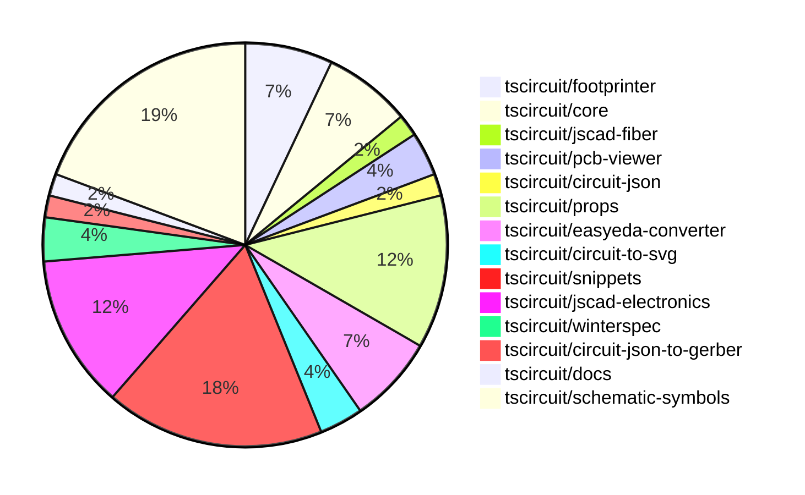

# Contribution Overview 2024-10-16

## PRs by Repository

## Contributor Overview

| Contributor | 🐳 Major | 🐙 Minor | 🐌 Tiny | ⭐ |
|-------------|-------|-------|-------|-------|
| [seveibar](#seveibar) | 3 | 13 | 2 | ⭐⭐⭐ |
| [anas-sarkez](#anas-sarkez) | 3 | 4 | 0 | ⭐⭐ |
| [Timer00](#Timer00) | 4 | 1 | 0 | ⭐⭐ |
| [andrii-balitskyi](#andrii-balitskyi) | 3 | 2 | 0 | ⭐⭐ |
| [imrishabh18](#imrishabh18) | 0 | 4 | 1 | ⭐ |
| [Abse2001](#Abse2001) | 0 | 3 | 1 | ⭐ |
| [ShiboSoftwareDev](#ShiboSoftwareDev) | 0 | 2 | 2 | ⭐ |
| [aman1376](#aman1376) | 1 | 1 | 0 | ⭐ |
| [mrudulpatil18](#mrudulpatil18) | 1 | 1 | 0 | ⭐ |
| [sarthak-kumar-shailendra](#sarthak-kumar-shailendra) | 0 | 1 | 0 |  |
| [bbland1](#bbland1) | 0 | 1 | 0 |  |
| [anugcodes](#anugcodes) | 0 | 1 | 0 |  |
| [kom-senapati](#kom-senapati) | 0 | 1 | 0 |  |
| [theajmalrazaq](#theajmalrazaq) | 0 | 1 | 0 |  |

## Changes by Repository

### [tscircuit/footprinter](https://github.com/tscircuit/footprinter)

| PR # | Impact | Contributor | Description |
|------|--------|-------------|-------------|
| [#67](https://github.com/tscircuit/footprinter/pull/67) | 🐳 Major | seveibar | Introduces a gallery generator that automatically creates an HTML page displaying SVG snapshots from the project's test suite. |
| [#68](https://github.com/tscircuit/footprinter/pull/68) | 🐳 Major | anas-sarkez | Implemented a new function called `stampboard` that generates a circuit board layout for a stampboard with configurable parameters. |
| [#66](https://github.com/tscircuit/footprinter/pull/66) | 🐙 Minor | seveibar | Introduces a new footprint for pushbutton components and updates the `circuit-to-svg` dependency. |
| [#60](https://github.com/tscircuit/footprinter/pull/60) | 🐙 Minor | bbland1 | Adds types for parameters returned using `.json()` function. |

### [tscircuit/core](https://github.com/tscircuit/core)

| PR # | Impact | Contributor | Description |
|------|--------|-------------|-------------|
| [#176](https://github.com/tscircuit/core/pull/176) | 🐳 Major | seveibar | Fix pcbRotation={-90} not rotating smtpads and keepouts properly, and add support for rotating keepouts. |
| [#177](https://github.com/tscircuit/core/pull/177) | 🐙 Minor | seveibar | Introduces a new `<battery />` component |
| [#173](https://github.com/tscircuit/core/pull/173) | 🐙 Minor | seveibar | Adds support for shared pin labels in the `Chip` component, allowing multiple pins to have the same label. |
| [#182](https://github.com/tscircuit/core/pull/182) | 🐙 Minor | Abse2001 | Fixed a bug in the `Battery` component where the `schematicSymbolName` was not being set correctly, causing the `toMatchSchematicSnapshot` test to fail. |

### [tscircuit/jscad-fiber](https://github.com/tscircuit/jscad-fiber)

| PR # | Impact | Contributor | Description |
|------|--------|-------------|-------------|
| [#84](https://github.com/tscircuit/jscad-fiber/pull/84) | 🐳 Major | seveibar | Implement the `Subtract` component to perform boolean subtraction operations on 3D geometries. |

### [tscircuit/pcb-viewer](https://github.com/tscircuit/pcb-viewer)

| PR # | Impact | Contributor | Description |
|------|--------|-------------|-------------|
| [#76](https://github.com/tscircuit/pcb-viewer/pull/76) | 🐙 Minor | seveibar | Fix silkscreen path story so that it renders and remove console log. |
| [#75](https://github.com/tscircuit/pcb-viewer/pull/75) | 🐌 Tiny | ShiboSoftwareDev | Added a CODEOWNERS file to specify code owners for the project. |

### [tscircuit/circuit-json](https://github.com/tscircuit/circuit-json)

| PR # | Impact | Contributor | Description |
|------|--------|-------------|-------------|
| [#59](https://github.com/tscircuit/circuit-json/pull/59) | 🐙 Minor | seveibar | Add support for a simple battery circuit element. |

### [tscircuit/props](https://github.com/tscircuit/props)

| PR # | Impact | Contributor | Description |
|------|--------|-------------|-------------|
| [#65](https://github.com/tscircuit/props/pull/65) | 🐙 Minor | seveibar | Add support for the `schAutoLayoutEnabled` prop on the `<group />` component. |
| [#63](https://github.com/tscircuit/props/pull/63) | 🐙 Minor | seveibar | Adds support for battery types, battery properties, and sets the default unit for battery capacity to mAh. |
| [#61](https://github.com/tscircuit/props/pull/61) | 🐙 Minor | seveibar | Reverts the addition of `schWidth`, `schHeight`, `pcbWidth`, and `pcbHeight` props in the `commonLayoutProps` type, replacing them with generic `width` and `height` props. |
| [#62](https://github.com/tscircuit/props/pull/62) | 🐙 Minor | imrishabh18 | Revert changes to the `width` and `height` properties in the `commonLayoutProps` type. |
| [#60](https://github.com/tscircuit/props/pull/60) | 🐙 Minor | imrishabh18 | Renamed "width" and "height" props to "schWidth" and "schHeight" in the "commonLayoutProps" type. |
| [#58](https://github.com/tscircuit/props/pull/58) | 🐙 Minor | imrishabh18 | Add width and height properties to common components |
| [#59](https://github.com/tscircuit/props/pull/59) | 🐌 Tiny | imrishabh18 | Updates the lockfile with the latest dependencies. |

### [tscircuit/easyeda-converter](https://github.com/tscircuit/easyeda-converter)

| PR # | Impact | Contributor | Description |
|------|--------|-------------|-------------|
| [#74](https://github.com/tscircuit/easyeda-converter/pull/74) | 🐙 Minor | seveibar | The pull request fixes the C490691 import and adds a script for quickly adding tests for parts. |
| [#71](https://github.com/tscircuit/easyeda-converter/pull/71) | 🐙 Minor | seveibar | Fixes a bug in the package-detail-shape-schema.ts file related to parsing arc data. |
| [#78](https://github.com/tscircuit/easyeda-converter/pull/78) | 🐙 Minor | andrii-balitskyi | Adds support for `T~` text shapes and fixes a script that was causing an error. |
| [#77](https://github.com/tscircuit/easyeda-converter/pull/77) | 🐙 Minor | andrii-balitskyi | Fixes the error message when the `--output` or `--output-format` command option is missing. |

### [tscircuit/circuit-to-svg](https://github.com/tscircuit/circuit-to-svg)

| PR # | Impact | Contributor | Description |
|------|--------|-------------|-------------|
| [#87](https://github.com/tscircuit/circuit-to-svg/pull/87) | 🐙 Minor | seveibar | Fix silkscreen paths being erroneously closed |
| [#86](https://github.com/tscircuit/circuit-to-svg/pull/86) | 🐙 Minor | Abse2001 | Updates the schematic symbols to fix the battery in the core and formats the code. |

### [tscircuit/snippets](https://github.com/tscircuit/snippets)

| PR # | Impact | Contributor | Description |
|------|--------|-------------|-------------|
| [#82](https://github.com/tscircuit/snippets/pull/82) | 🐳 Major | andrii-balitskyi | Allows editing shipping information in profile settings |
| [#68](https://github.com/tscircuit/snippets/pull/68) | 🐳 Major | andrii-balitskyi | Introduces tests for the order API endpoints, including creating, getting, listing, and updating orders, as well as uploading and getting order files. |
| [#78](https://github.com/tscircuit/snippets/pull/78) | 🐳 Major | andrii-balitskyi | Add a new "Submit Order" button and dialog to the editor navigation bar. |
| [#77](https://github.com/tscircuit/snippets/pull/77) | 🐳 Major | mrudulpatil18 | Adds a search component to the header that allows users to search for code snippets and view the results in a dropdown. |
| [#80](https://github.com/tscircuit/snippets/pull/80) | 🐙 Minor | seveibar | Fixes issues with importing JLCPCB components, updates for shared pin label support, and fixes local development errors to show JLCPCB import errors. |
| [#74](https://github.com/tscircuit/snippets/pull/74) | 🐙 Minor | seveibar | Update dependencies and fix error handling for downloading fabrication files. |
| [#86](https://github.com/tscircuit/snippets/pull/86) | 🐙 Minor | kom-senapati | Update page title to include snippet name and owner name in the format `tscircuit - <owner>/<package>`. |
| [#85](https://github.com/tscircuit/snippets/pull/85) | 🐙 Minor | theajmalrazaq | Fixed the issue with the search box not rendering well in small views and improved the responsiveness of the dashboard. |
| [#84](https://github.com/tscircuit/snippets/pull/84) | 🐌 Tiny | seveibar | Fixes tab indentation in the CodeEditor component. |
| [#96](https://github.com/tscircuit/snippets/pull/96) | 🐌 Tiny | Abse2001 | Updates the version of the 'winterspec' dependency from 0.0.93 to 0.0.94. |

### [tscircuit/jscad-electronics](https://github.com/tscircuit/jscad-electronics)

| PR # | Impact | Contributor | Description |
|------|--------|-------------|-------------|
| [#75](https://github.com/tscircuit/jscad-electronics/pull/75) | 🐳 Major | anas-sarkez | Implementing a 3D model for a pin row component and refactoring the footprint plated holes |
| [#68](https://github.com/tscircuit/jscad-electronics/pull/68) | 🐳 Major | anas-sarkez | Introducing a new 3D component for a USB-C female port |
| [#76](https://github.com/tscircuit/jscad-electronics/pull/76) | 🐙 Minor | anas-sarkez | Added a new example for the 'pinrow6' footprint in the 'footprinter3d' module. |
| [#72](https://github.com/tscircuit/jscad-electronics/pull/72) | 🐙 Minor | anas-sarkez | Refactored the USB_C component to use Subtract for creating the curved metal casing, replacing complex calculations. |
| [#71](https://github.com/tscircuit/jscad-electronics/pull/71) | 🐙 Minor | anas-sarkez | Updated the jscad-fiber dependency and subtracted curved slices from the sides of the SMD LED model. |
| [#69](https://github.com/tscircuit/jscad-electronics/pull/69) | 🐙 Minor | anas-sarkez | Implementing SmdLED packages with different colors |
| [#70](https://github.com/tscircuit/jscad-electronics/pull/70) | 🐌 Tiny | seveibar | Adding 'anas-sarkez' as a codeowner for new files and directories. |

### [tscircuit/winterspec](https://github.com/tscircuit/winterspec)

| PR # | Impact | Contributor | Description |
|------|--------|-------------|-------------|
| [#17](https://github.com/tscircuit/winterspec/pull/17) | 🐙 Minor | ShiboSoftwareDev | Updated the construct-manifest.ts file to handle Windows-based file paths for the esbuild bundle. |
| [#18](https://github.com/tscircuit/winterspec/pull/18) | 🐌 Tiny | ShiboSoftwareDev | Update the `construct-manifest.ts` file to fix the path representation for Windows. |

### [tscircuit/circuit-json-to-gerber](https://github.com/tscircuit/circuit-json-to-gerber)

| PR # | Impact | Contributor | Description |
|------|--------|-------------|-------------|
| [#22](https://github.com/tscircuit/circuit-json-to-gerber/pull/22) | 🐙 Minor | ShiboSoftwareDev | Implemented silkscreen path rendering in the Gerber conversion process. |

### [tscircuit/docs](https://github.com/tscircuit/docs)

| PR # | Impact | Contributor | Description |
|------|--------|-------------|-------------|
| [#28](https://github.com/tscircuit/docs/pull/28) | 🐙 Minor | sarthak-kumar-shailendra | Change the Twitter icon to the new "X" icon. |

### [tscircuit/schematic-symbols](https://github.com/tscircuit/schematic-symbols)

| PR # | Impact | Contributor | Description |
|------|--------|-------------|-------------|
| [#78](https://github.com/tscircuit/schematic-symbols/pull/78) | 🐳 Major | Timer00 | Introduces a new wattmeter symbol |
| [#96](https://github.com/tscircuit/schematic-symbols/pull/96) | 🐳 Major | Timer00 | Introduces a new symbol called "watt_hour_meter" |
| [#97](https://github.com/tscircuit/schematic-symbols/pull/97) | 🐳 Major | Timer00 | Introduces a new symbol "frequency_meter" |
| [#100](https://github.com/tscircuit/schematic-symbols/pull/100) | 🐳 Major | Timer00 | Introduce a new symbol called "tachometer" |
| [#162](https://github.com/tscircuit/schematic-symbols/pull/162) | 🐳 Major | aman1376 | Adds a new SVG image and JSON data for a DPST (Double-Pole Single-Throw) switch symbol. |
| [#172](https://github.com/tscircuit/schematic-symbols/pull/172) | 🐙 Minor | imrishabh18 | Fix the calculation for the height of the SPDT switch and boxresistor components. |
| [#174](https://github.com/tscircuit/schematic-symbols/pull/174) | 🐙 Minor | Abse2001 | Added a new battery symbol |
| [#95](https://github.com/tscircuit/schematic-symbols/pull/95) | 🐙 Minor | Timer00 | Introduce a new symbol called "varmeter" |
| [#176](https://github.com/tscircuit/schematic-symbols/pull/176) | 🐙 Minor | aman1376 | Adds a new JSON file and SVG file for a light dependent resistor symbol. |
| [#153](https://github.com/tscircuit/schematic-symbols/pull/153) | 🐙 Minor | mrudulpatil18 | Added a rectifier diode symbol to the project. |
| [#167](https://github.com/tscircuit/schematic-symbols/pull/167) | 🐙 Minor | anugcodes | Adds the design for the symbol of a darlington pair transistor. |

## Changes by Contributor

### [seveibar](https://github.com/seveibar)

| PR # | Impact | Description |
|------|--------|-------------|
| [#67](https://github.com/tscircuit/footprinter/pull/67) | 🐳 Major | Introduces a gallery generator that automatically creates an HTML page displaying SVG snapshots from the project's test suite. |
| [#176](https://github.com/tscircuit/core/pull/176) | 🐳 Major | Fix pcbRotation={-90} not rotating smtpads and keepouts properly, and add support for rotating keepouts. |
| [#84](https://github.com/tscircuit/jscad-fiber/pull/84) | 🐳 Major | Implement the `Subtract` component to perform boolean subtraction operations on 3D geometries. |
| [#76](https://github.com/tscircuit/pcb-viewer/pull/76) | 🐙 Minor | Fix silkscreen path story so that it renders and remove console log. |
| [#59](https://github.com/tscircuit/circuit-json/pull/59) | 🐙 Minor | Add support for a simple battery circuit element. |
| [#65](https://github.com/tscircuit/props/pull/65) | 🐙 Minor | Add support for the `schAutoLayoutEnabled` prop on the `<group />` component. |
| [#63](https://github.com/tscircuit/props/pull/63) | 🐙 Minor | Adds support for battery types, battery properties, and sets the default unit for battery capacity to mAh. |
| [#61](https://github.com/tscircuit/props/pull/61) | 🐙 Minor | Reverts the addition of `schWidth`, `schHeight`, `pcbWidth`, and `pcbHeight` props in the `commonLayoutProps` type, replacing them with generic `width` and `height` props. |
| [#66](https://github.com/tscircuit/footprinter/pull/66) | 🐙 Minor | Introduces a new footprint for pushbutton components and updates the `circuit-to-svg` dependency. |
| [#74](https://github.com/tscircuit/easyeda-converter/pull/74) | 🐙 Minor | The pull request fixes the C490691 import and adds a script for quickly adding tests for parts. |
| [#71](https://github.com/tscircuit/easyeda-converter/pull/71) | 🐙 Minor | Fixes a bug in the package-detail-shape-schema.ts file related to parsing arc data. |
| [#177](https://github.com/tscircuit/core/pull/177) | 🐙 Minor | Introduces a new `<battery />` component |
| [#173](https://github.com/tscircuit/core/pull/173) | 🐙 Minor | Adds support for shared pin labels in the `Chip` component, allowing multiple pins to have the same label. |
| [#87](https://github.com/tscircuit/circuit-to-svg/pull/87) | 🐙 Minor | Fix silkscreen paths being erroneously closed |
| [#80](https://github.com/tscircuit/snippets/pull/80) | 🐙 Minor | Fixes issues with importing JLCPCB components, updates for shared pin label support, and fixes local development errors to show JLCPCB import errors. |
| [#74](https://github.com/tscircuit/snippets/pull/74) | 🐙 Minor | Update dependencies and fix error handling for downloading fabrication files. |
| [#70](https://github.com/tscircuit/jscad-electronics/pull/70) | 🐌 Tiny | Adding 'anas-sarkez' as a codeowner for new files and directories. |
| [#84](https://github.com/tscircuit/snippets/pull/84) | 🐌 Tiny | Fixes tab indentation in the CodeEditor component. |

### [ShiboSoftwareDev](https://github.com/ShiboSoftwareDev)

| PR # | Impact | Description |
|------|--------|-------------|
| [#17](https://github.com/tscircuit/winterspec/pull/17) | 🐙 Minor | Updated the construct-manifest.ts file to handle Windows-based file paths for the esbuild bundle. |
| [#22](https://github.com/tscircuit/circuit-json-to-gerber/pull/22) | 🐙 Minor | Implemented silkscreen path rendering in the Gerber conversion process. |
| [#75](https://github.com/tscircuit/pcb-viewer/pull/75) | 🐌 Tiny | Added a CODEOWNERS file to specify code owners for the project. |
| [#18](https://github.com/tscircuit/winterspec/pull/18) | 🐌 Tiny | Update the `construct-manifest.ts` file to fix the path representation for Windows. |

### [sarthak-kumar-shailendra](https://github.com/sarthak-kumar-shailendra)

| PR # | Impact | Description |
|------|--------|-------------|
| [#28](https://github.com/tscircuit/docs/pull/28) | 🐙 Minor | Change the Twitter icon to the new "X" icon. |

### [imrishabh18](https://github.com/imrishabh18)

| PR # | Impact | Description |
|------|--------|-------------|
| [#62](https://github.com/tscircuit/props/pull/62) | 🐙 Minor | Revert changes to the `width` and `height` properties in the `commonLayoutProps` type. |
| [#60](https://github.com/tscircuit/props/pull/60) | 🐙 Minor | Renamed "width" and "height" props to "schWidth" and "schHeight" in the "commonLayoutProps" type. |
| [#58](https://github.com/tscircuit/props/pull/58) | 🐙 Minor | Add width and height properties to common components |
| [#172](https://github.com/tscircuit/schematic-symbols/pull/172) | 🐙 Minor | Fix the calculation for the height of the SPDT switch and boxresistor components. |
| [#59](https://github.com/tscircuit/props/pull/59) | 🐌 Tiny | Updates the lockfile with the latest dependencies. |

### [anas-sarkez](https://github.com/anas-sarkez)

| PR # | Impact | Description |
|------|--------|-------------|
| [#68](https://github.com/tscircuit/footprinter/pull/68) | 🐳 Major | Implemented a new function called `stampboard` that generates a circuit board layout for a stampboard with configurable parameters. |
| [#75](https://github.com/tscircuit/jscad-electronics/pull/75) | 🐳 Major | Implementing a 3D model for a pin row component and refactoring the footprint plated holes |
| [#68](https://github.com/tscircuit/jscad-electronics/pull/68) | 🐳 Major | Introducing a new 3D component for a USB-C female port |
| [#76](https://github.com/tscircuit/jscad-electronics/pull/76) | 🐙 Minor | Added a new example for the 'pinrow6' footprint in the 'footprinter3d' module. |
| [#72](https://github.com/tscircuit/jscad-electronics/pull/72) | 🐙 Minor | Refactored the USB_C component to use Subtract for creating the curved metal casing, replacing complex calculations. |
| [#71](https://github.com/tscircuit/jscad-electronics/pull/71) | 🐙 Minor | Updated the jscad-fiber dependency and subtracted curved slices from the sides of the SMD LED model. |
| [#69](https://github.com/tscircuit/jscad-electronics/pull/69) | 🐙 Minor | Implementing SmdLED packages with different colors |

### [bbland1](https://github.com/bbland1)

| PR # | Impact | Description |
|------|--------|-------------|
| [#60](https://github.com/tscircuit/footprinter/pull/60) | 🐙 Minor | Adds types for parameters returned using `.json()` function. |

### [andrii-balitskyi](https://github.com/andrii-balitskyi)

| PR # | Impact | Description |
|------|--------|-------------|
| [#82](https://github.com/tscircuit/snippets/pull/82) | 🐳 Major | Allows editing shipping information in profile settings |
| [#68](https://github.com/tscircuit/snippets/pull/68) | 🐳 Major | Introduces tests for the order API endpoints, including creating, getting, listing, and updating orders, as well as uploading and getting order files. |
| [#78](https://github.com/tscircuit/snippets/pull/78) | 🐳 Major | Add a new "Submit Order" button and dialog to the editor navigation bar. |
| [#78](https://github.com/tscircuit/easyeda-converter/pull/78) | 🐙 Minor | Adds support for `T~` text shapes and fixes a script that was causing an error. |
| [#77](https://github.com/tscircuit/easyeda-converter/pull/77) | 🐙 Minor | Fixes the error message when the `--output` or `--output-format` command option is missing. |

### [Abse2001](https://github.com/Abse2001)

| PR # | Impact | Description |
|------|--------|-------------|
| [#182](https://github.com/tscircuit/core/pull/182) | 🐙 Minor | Fixed a bug in the `Battery` component where the `schematicSymbolName` was not being set correctly, causing the `toMatchSchematicSnapshot` test to fail. |
| [#86](https://github.com/tscircuit/circuit-to-svg/pull/86) | 🐙 Minor | Updates the schematic symbols to fix the battery in the core and formats the code. |
| [#174](https://github.com/tscircuit/schematic-symbols/pull/174) | 🐙 Minor | Added a new battery symbol |
| [#96](https://github.com/tscircuit/snippets/pull/96) | 🐌 Tiny | Updates the version of the 'winterspec' dependency from 0.0.93 to 0.0.94. |

### [Timer00](https://github.com/Timer00)

| PR # | Impact | Description |
|------|--------|-------------|
| [#78](https://github.com/tscircuit/schematic-symbols/pull/78) | 🐳 Major | Introduces a new wattmeter symbol |
| [#96](https://github.com/tscircuit/schematic-symbols/pull/96) | 🐳 Major | Introduces a new symbol called "watt_hour_meter" |
| [#97](https://github.com/tscircuit/schematic-symbols/pull/97) | 🐳 Major | Introduces a new symbol "frequency_meter" |
| [#100](https://github.com/tscircuit/schematic-symbols/pull/100) | 🐳 Major | Introduce a new symbol called "tachometer" |
| [#95](https://github.com/tscircuit/schematic-symbols/pull/95) | 🐙 Minor | Introduce a new symbol called "varmeter" |

### [aman1376](https://github.com/aman1376)

| PR # | Impact | Description |
|------|--------|-------------|
| [#162](https://github.com/tscircuit/schematic-symbols/pull/162) | 🐳 Major | Adds a new SVG image and JSON data for a DPST (Double-Pole Single-Throw) switch symbol. |
| [#176](https://github.com/tscircuit/schematic-symbols/pull/176) | 🐙 Minor | Adds a new JSON file and SVG file for a light dependent resistor symbol. |

### [mrudulpatil18](https://github.com/mrudulpatil18)

| PR # | Impact | Description |
|------|--------|-------------|
| [#77](https://github.com/tscircuit/snippets/pull/77) | 🐳 Major | Adds a search component to the header that allows users to search for code snippets and view the results in a dropdown. |
| [#153](https://github.com/tscircuit/schematic-symbols/pull/153) | 🐙 Minor | Added a rectifier diode symbol to the project. |

### [anugcodes](https://github.com/anugcodes)

| PR # | Impact | Description |
|------|--------|-------------|
| [#167](https://github.com/tscircuit/schematic-symbols/pull/167) | 🐙 Minor | Adds the design for the symbol of a darlington pair transistor. |

### [kom-senapati](https://github.com/kom-senapati)

| PR # | Impact | Description |
|------|--------|-------------|
| [#86](https://github.com/tscircuit/snippets/pull/86) | 🐙 Minor | Update page title to include snippet name and owner name in the format `tscircuit - <owner>/<package>`. |

### [theajmalrazaq](https://github.com/theajmalrazaq)

| PR # | Impact | Description |
|------|--------|-------------|
| [#85](https://github.com/tscircuit/snippets/pull/85) | 🐙 Minor | Fixed the issue with the search box not rendering well in small views and improved the responsiveness of the dashboard. |

