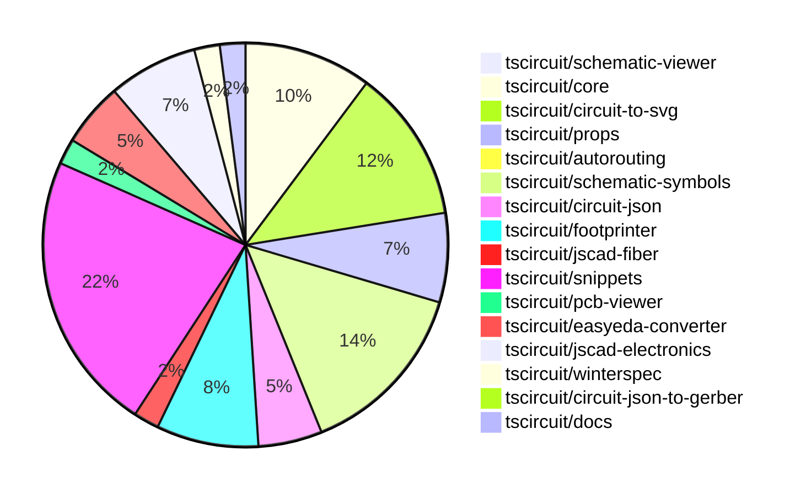

# Contribution Overview 2024-10-16

## PRs by Repository

## Contributor Overview

| Contributor | 🐳 Major | 🐙 Minor | 🐌 Tiny | ⭐ |
|-------------|-------|-------|-------|-------|
| [seveibar](#seveibar) | 10 | 25 | 2 | 👑👑 |
| [anas-sarkez](#anas-sarkez) | 4 | 6 | 0 | ⭐⭐ |
| [andrii-balitskyi](#andrii-balitskyi) | 4 | 4 | 1 | ⭐⭐ |
| [imrishabh18](#imrishabh18) | 2 | 7 | 2 | ⭐⭐ |
| [Abse2001](#Abse2001) | 2 | 4 | 2 | ⭐⭐ |
| [Timer00](#Timer00) | 4 | 1 | 0 | ⭐⭐ |
| [aman1376](#aman1376) | 1 | 2 | 0 | ⭐ |
| [mrudulpatil18](#mrudulpatil18) | 1 | 2 | 0 | ⭐ |
| [ShiboSoftwareDev](#ShiboSoftwareDev) | 0 | 3 | 1 | ⭐ |
| [theajmalrazaq](#theajmalrazaq) | 0 | 3 | 0 | ⭐ |
| [sarthak-kumar-shailendra](#sarthak-kumar-shailendra) | 0 | 2 | 0 | ⭐ |
| [alex-marinov](#alex-marinov) | 1 | 0 | 0 | ⭐ |
| [bbland1](#bbland1) | 0 | 1 | 0 |  |
| [anugcodes](#anugcodes) | 0 | 1 | 0 |  |
| [kom-senapati](#kom-senapati) | 0 | 1 | 0 |  |
| [AlexVCS](#AlexVCS) | 0 | 0 | 1 |  |

## Changes by Repository

### [tscircuit/schematic-viewer](https://github.com/tscircuit/schematic-viewer)

| PR # | Impact | Contributor | Description |
|------|--------|-------------|-------------|
| [#65](https://github.com/tscircuit/schematic-viewer/pull/65) | 🟣 | imrishabh18 | Refactor the builder implementation and update the schematic viewer |

### [tscircuit/core](https://github.com/tscircuit/core)

| PR # | Impact | Contributor | Description |
|------|--------|-------------|-------------|
| [#187](https://github.com/tscircuit/core/pull/187) | 🐳 Major | imrishabh18 | Adds support for the `-size` suffix in port arrangements for the `NormalComponent` class. |
| [#194](https://github.com/tscircuit/core/pull/194) | 🐳 Major | seveibar | Add support for schematic debug objects, enable rendering of debugging boxes in subcircuits, and update the autorouter to a newer version. |
| [#186](https://github.com/tscircuit/core/pull/186) | 🐳 Major | seveibar | Fix Schematic Ports using local instead of global positions |
| [#185](https://github.com/tscircuit/core/pull/185) | 🐳 Major | seveibar | Implemented schematic autolayout and fixed routing issues. |
| [#196](https://github.com/tscircuit/core/pull/196) | 🐳 Major | Abse2001 | Implemented the `<Inductor>` component |
| [#188](https://github.com/tscircuit/core/pull/188) | 🐙 Minor | seveibar | Update the `circuit-to-svg` dependency to fix an issue where pin number 0 was not being recognized. |
| [#177](https://github.com/tscircuit/core/pull/177) | 🐙 Minor | seveibar | Introduces a new `<battery />` component |
| [#176](https://github.com/tscircuit/core/pull/176) | 🐙 Minor | seveibar | Fixes a bug where `pcbRotation={-90}` did not properly rotate SMT pads and keepouts. |
| [#173](https://github.com/tscircuit/core/pull/173) | 🐙 Minor | seveibar | Adds support for shared pin labels, allowing multiple pins to share the same label or have additional aliases. |
| [#182](https://github.com/tscircuit/core/pull/182) | 🐙 Minor | Abse2001 | Fixed the "toMatchSchematicSnapshot" test for the Battery component by updating the schematicSymbolName property. |

### [tscircuit/circuit-to-svg](https://github.com/tscircuit/circuit-to-svg)

| PR # | Impact | Contributor | Description |
|------|--------|-------------|-------------|
| [#96](https://github.com/tscircuit/circuit-to-svg/pull/96) | 🐳 Major | imrishabh18 | Refactors the code to use the `transform` property instead of `viewBox` for positioning the SVG elements. |
| [#95](https://github.com/tscircuit/circuit-to-svg/pull/95) | 🐳 Major | seveibar | Refactor the schematic drawing code to remove the usage of viewport and `flipY` and rely on the `transform` matrix for computing all positions. |
| [#94](https://github.com/tscircuit/circuit-to-svg/pull/94) | 🐳 Major | seveibar | Introduces a new feature to add labeled grid to the schematic SVG |
| [#90](https://github.com/tscircuit/circuit-to-svg/pull/90) | 🐙 Minor | imrishabh18 | Revert a previous change that broke the position of pins. |
| [#98](https://github.com/tscircuit/circuit-to-svg/pull/98) | 🐙 Minor | seveibar | Fixes the calculation of transformed coordinates for debug objects (rectangles and lines) to correctly handle flipping of the Y-axis. |
| [#97](https://github.com/tscircuit/circuit-to-svg/pull/97) | 🐙 Minor | seveibar | Fix schematic port handling of undefined `pinNumber` and finding pin number |
| [#93](https://github.com/tscircuit/circuit-to-svg/pull/93) | 🐙 Minor | seveibar | Adds support for drawing a grid and labeled points on the schematic SVG. |
| [#92](https://github.com/tscircuit/circuit-to-svg/pull/92) | 🐙 Minor | seveibar | Implements schematic debug objects, which can be used to draw rectangles and lines on the schematic for debugging purposes. |
| [#88](https://github.com/tscircuit/circuit-to-svg/pull/88) | 🐙 Minor | seveibar | Fix the schematic port using a relative position |
| [#87](https://github.com/tscircuit/circuit-to-svg/pull/87) | 🐙 Minor | seveibar | Fixes an issue where the silkscreen path was being erroneously closed, causing the pushbutton silkscreen to look bad. |
| [#86](https://github.com/tscircuit/circuit-to-svg/pull/86) | 🐙 Minor | Abse2001 | Updated the schematic symbols to fix the battery in the core and formatted the code. |
| [#89](https://github.com/tscircuit/circuit-to-svg/pull/89) | 🐌 Tiny | Abse2001 | Updated the version of the "schematic-symbols" dependency from 0.0.79 to 0.0.90. |

### [tscircuit/props](https://github.com/tscircuit/props)

| PR # | Impact | Contributor | Description |
|------|--------|-------------|-------------|
| [#62](https://github.com/tscircuit/props/pull/62) | 🐙 Minor | imrishabh18 | Reverts changes to the `width` and `height` properties in the `commonLayoutProps` and `commonComponentProps` schemas. |
| [#60](https://github.com/tscircuit/props/pull/60) | 🐙 Minor | imrishabh18 | Add `schWidth` and `schHeight` properties to the `commonLayoutProps` interface and `commonComponentProps` schema. |
| [#58](https://github.com/tscircuit/props/pull/58) | 🐙 Minor | imrishabh18 | Add width and height props to common components |
| [#65](https://github.com/tscircuit/props/pull/65) | 🐙 Minor | seveibar | Adds support for the `schAutoLayoutEnabled` prop on the `<group />` component. |
| [#63](https://github.com/tscircuit/props/pull/63) | 🐙 Minor | seveibar | Adds new battery-related types, properties, and pins to the library. |
| [#61](https://github.com/tscircuit/props/pull/61) | 🐙 Minor | seveibar | Revert the change that added "schWidth", "schHeight", "pcbWidth", and "pcbHeight" props, and replace them with "width" and "height" props. |
| [#59](https://github.com/tscircuit/props/pull/59) | 🐌 Tiny | imrishabh18 | Updating the lockfile |

### [tscircuit/autorouting](https://github.com/tscircuit/autorouting)

| PR # | Impact | Contributor | Description |
|------|--------|-------------|-------------|
| [#82](https://github.com/tscircuit/autorouting/pull/82) | 🐙 Minor | imrishabh18 | Refactors the `get-debug-svg` function by removing the `builder` and simplifying the code. |

### [tscircuit/schematic-symbols](https://github.com/tscircuit/schematic-symbols)

| PR # | Impact | Contributor | Description |
|------|--------|-------------|-------------|
| [#185](https://github.com/tscircuit/schematic-symbols/pull/185) | 🐳 Major | Abse2001 | Implemented SVG Arc support and added an inductor symbol |
| [#162](https://github.com/tscircuit/schematic-symbols/pull/162) | 🐳 Major | aman1376 | Add a new SVG file and JSON data for a DPST switch component. |
| [#78](https://github.com/tscircuit/schematic-symbols/pull/78) | 🐳 Major | Timer00 | Introduces a new symbol called "wattmeter" |
| [#95](https://github.com/tscircuit/schematic-symbols/pull/95) | 🐳 Major | Timer00 | Introduces a new symbol called "varmeter" which represents a variable meter. |
| [#97](https://github.com/tscircuit/schematic-symbols/pull/97) | 🐳 Major | Timer00 | Introduces a new symbol called "frequency_meter" |
| [#100](https://github.com/tscircuit/schematic-symbols/pull/100) | 🐳 Major | Timer00 | Introduces a new symbol for a tachometer. |
| [#184](https://github.com/tscircuit/schematic-symbols/pull/184) | 🐙 Minor | imrishabh18 | Updated the lockfile to fix an issue with the npm publish process. |
| [#172](https://github.com/tscircuit/schematic-symbols/pull/172) | 🐙 Minor | imrishabh18 | Fix the calculation for the height of the SPDT switch and boxresistor components. |
| [#174](https://github.com/tscircuit/schematic-symbols/pull/174) | 🐙 Minor | Abse2001 | Added a new battery symbol. |
| [#176](https://github.com/tscircuit/schematic-symbols/pull/176) | 🐙 Minor | aman1376 | Adds a new symbol for a light-dependent resistor. |
| [#96](https://github.com/tscircuit/schematic-symbols/pull/96) | 🐙 Minor | Timer00 | Introduces a new symbol for a watt-hour meter. |
| [#153](https://github.com/tscircuit/schematic-symbols/pull/153) | 🐙 Minor | mrudulpatil18 | Added a rectifier diode symbol as a JSON file |
| [#167](https://github.com/tscircuit/schematic-symbols/pull/167) | 🐙 Minor | anugcodes | Added the design for the symbol of a Darlington pair transistor. |
| [#183](https://github.com/tscircuit/schematic-symbols/pull/183) | 🐌 Tiny | imrishabh18 | Adds an ignore rule to the .gitignore file to exclude .diff.png files |

### [tscircuit/circuit-json](https://github.com/tscircuit/circuit-json)

| PR # | Impact | Contributor | Description |
|------|--------|-------------|-------------|
| [#62](https://github.com/tscircuit/circuit-json/pull/62) | 🐳 Major | seveibar | This pull request adds a script to generate a documentation file that provides an overview of the schematic component types in the circuit-json library. |
| [#64](https://github.com/tscircuit/circuit-json/pull/64) | 🐙 Minor | seveibar | Add useful meta information, true index, side of component etc. to schematic_port |
| [#61](https://github.com/tscircuit/circuit-json/pull/61) | 🐙 Minor | seveibar | Introduces a new "schematic debug object" feature, which includes support for drawing debug rectangles and lines in the schematic. |
| [#59](https://github.com/tscircuit/circuit-json/pull/59) | 🐙 Minor | seveibar | Add a new circuit element "simple_battery" with battery capacity as a property. |
| [#60](https://github.com/tscircuit/circuit-json/pull/60) | 🐙 Minor | Abse2001 | Added the export for the `source_simple_inductor` component. |

### [tscircuit/footprinter](https://github.com/tscircuit/footprinter)

| PR # | Impact | Contributor | Description |
|------|--------|-------------|-------------|
| [#67](https://github.com/tscircuit/footprinter/pull/67) | 🐳 Major | seveibar | Introduces a new feature to automatically generate an SVG gallery page from the project's snapshot files. |
| [#66](https://github.com/tscircuit/footprinter/pull/66) | 🐳 Major | seveibar | Introduces a new footprint for a pushbutton component and updates the circuit-to-svg library. |
| [#71](https://github.com/tscircuit/footprinter/pull/71) | 🐳 Major | anas-sarkez | The pull request adds support for holes in the stampboard and modifies the pad length and holes position of the stampboard. |
| [#68](https://github.com/tscircuit/footprinter/pull/68) | 🐳 Major | anas-sarkez | Implemented stampboard footprint function |
| [#72](https://github.com/tscircuit/footprinter/pull/72) | 🐙 Minor | aman1376 | Adds support for the LQFP (Low-profile Quad Flat Package) component type to the footprinter library. |
| [#70](https://github.com/tscircuit/footprinter/pull/70) | 🐙 Minor | anas-sarkez | Implemented a function to generate a stampreceiver footprint. |
| [#69](https://github.com/tscircuit/footprinter/pull/69) | 🐙 Minor | anas-sarkez | Implement silkscreen reference for every component and added silkscreenRef function to helpers |
| [#60](https://github.com/tscircuit/footprinter/pull/60) | 🐙 Minor | bbland1 | Adds type definitions for the parameters returned by the `.json()` method in the `footprinter.ts` file. |

### [tscircuit/jscad-fiber](https://github.com/tscircuit/jscad-fiber)

| PR # | Impact | Contributor | Description |
|------|--------|-------------|-------------|
| [#84](https://github.com/tscircuit/jscad-fiber/pull/84) | 🐳 Major | seveibar | Implement the `Subtract` component to perform the boolean subtraction operation on the provided geometries. |
| [#85](https://github.com/tscircuit/jscad-fiber/pull/85) | 🐳 Major | alex-marinov | Fixes issue #83 by making the `<Translate />` component accept multiple children, and recursively processing the CSG array. |

### [tscircuit/snippets](https://github.com/tscircuit/snippets)

| PR # | Impact | Contributor | Description |
|------|--------|-------------|-------------|
| [#122](https://github.com/tscircuit/snippets/pull/122) | 🐳 Major | seveibar | Adds an API endpoint to allow users to star a snippet. |
| [#88](https://github.com/tscircuit/snippets/pull/88) | 🐳 Major | andrii-balitskyi | Introduces a country and state dropdown in the shipping information section |
| [#89](https://github.com/tscircuit/snippets/pull/89) | 🐳 Major | andrii-balitskyi |  |
| [#82](https://github.com/tscircuit/snippets/pull/82) | 🐳 Major | andrii-balitskyi | The pull request allows users to edit their shipping information in the profile settings. |
| [#78](https://github.com/tscircuit/snippets/pull/78) | 🐳 Major | andrii-balitskyi | Add a new "Submit Order" button and a "Create Order" dialog to the editor. |
| [#117](https://github.com/tscircuit/snippets/pull/117) | 🐳 Major | mrudulpatil18 | Added a command palette (Cmd+K) feature to the application, which provides quick access to various commands and actions. |
| [#118](https://github.com/tscircuit/snippets/pull/118) | 🐙 Minor | seveibar | Fixes issues with the search functionality and cmd+click behavior in the code editor and dashboard pages. |
| [#115](https://github.com/tscircuit/snippets/pull/115) | 🐙 Minor | seveibar | Introduce cmd+click to open snippets |
| [#114](https://github.com/tscircuit/snippets/pull/114) | 🐙 Minor | seveibar | Adds a files dialog to inspect build files for a code snippet. |
| [#108](https://github.com/tscircuit/snippets/pull/108) | 🐙 Minor | seveibar | Order My Snippets by last created time |
| [#80](https://github.com/tscircuit/snippets/pull/80) | 🐙 Minor | seveibar | Fix jlcpcb imports with arc issues, update for shared pin label support, and fix errors in local dev to show jlcpcb import errors. |
| [#74](https://github.com/tscircuit/snippets/pull/74) | 🐙 Minor | seveibar | Updates dependencies and fixes issues with downloading fabrication files |
| [#124](https://github.com/tscircuit/snippets/pull/124) | 🐙 Minor | andrii-balitskyi | Fix the width of the SearchableSelect component's options to match the trigger width. |
| [#68](https://github.com/tscircuit/snippets/pull/68) | 🐙 Minor | andrii-balitskyi | Adds tests for the ordering API, including creating, getting, listing, and updating orders, as well as uploading and getting order files. |
| [#77](https://github.com/tscircuit/snippets/pull/77) | 🐙 Minor | mrudulpatil18 | Adds a search component to the header, which connects to the `/snippets/search` endpoint and displays search results in a dropdown. |
| [#95](https://github.com/tscircuit/snippets/pull/95) | 🐙 Minor | theajmalrazaq | Fixed the responsiveness of the quickstart page. |
| [#97](https://github.com/tscircuit/snippets/pull/97) | 🐙 Minor | theajmalrazaq | Added Playwright tests for the AI Page and Quickstart Page, with viewports for different screen sizes (md, lg, and sm). |
| [#85](https://github.com/tscircuit/snippets/pull/85) | 🐙 Minor | theajmalrazaq | Fixed the search box rendering and improved the dashboard responsiveness. |
| [#86](https://github.com/tscircuit/snippets/pull/86) | 🐙 Minor | kom-senapati | Updates the page title to include the snippet name and owner name in the format `tscircuit - <owner>/<package>`. |
| [#84](https://github.com/tscircuit/snippets/pull/84) | 🐌 Tiny | seveibar | Fixes the tab indent behavior in the CodeEditor component. |
| [#96](https://github.com/tscircuit/snippets/pull/96) | 🐌 Tiny | Abse2001 | Updates the `winterspec` package to version `0.0.94` |
| [#110](https://github.com/tscircuit/snippets/pull/110) | 🐌 Tiny | AlexVCS | Adds a favicon to the web page. |

### [tscircuit/pcb-viewer](https://github.com/tscircuit/pcb-viewer)

| PR # | Impact | Contributor | Description |
|------|--------|-------------|-------------|
| [#76](https://github.com/tscircuit/pcb-viewer/pull/76) | 🐙 Minor | seveibar | Fix and format silkscreen path story to render correctly. |
| [#75](https://github.com/tscircuit/pcb-viewer/pull/75) | 🐌 Tiny | ShiboSoftwareDev | Added a CODEOWNERS file to specify code ownership for the repository. |

### [tscircuit/easyeda-converter](https://github.com/tscircuit/easyeda-converter)

| PR # | Impact | Contributor | Description |
|------|--------|-------------|-------------|
| [#74](https://github.com/tscircuit/easyeda-converter/pull/74) | 🐙 Minor | seveibar | The pull request fixes the import of the C490691 component and adds a script to quickly add tests for parts. |
| [#71](https://github.com/tscircuit/easyeda-converter/pull/71) | 🐙 Minor | seveibar | Fixes issue #67 by improving the regular expression used to parse arc data in the package-detail-shape-schema.ts file. |
| [#84](https://github.com/tscircuit/easyeda-converter/pull/84) | 🐙 Minor | andrii-balitskyi | Fix stroke width calculation for EasyEDA to TSCircuit conversion |
| [#78](https://github.com/tscircuit/easyeda-converter/pull/78) | 🐙 Minor | andrii-balitskyi | Adds support for `T~` text shapes and fixes a script that was giving an error. |
| [#77](https://github.com/tscircuit/easyeda-converter/pull/77) | 🐌 Tiny | andrii-balitskyi | Fix the error message for the `convert` command to reflect the correct option name. |

### [tscircuit/jscad-electronics](https://github.com/tscircuit/jscad-electronics)

| PR # | Impact | Contributor | Description |
|------|--------|-------------|-------------|
| [#75](https://github.com/tscircuit/jscad-electronics/pull/75) | 🐳 Major | anas-sarkez | Implementing a 3D model for a pin row component and refactoring the footprint plated holes. |
| [#68](https://github.com/tscircuit/jscad-electronics/pull/68) | 🐳 Major | anas-sarkez | Implementing a USB-C female port 3D component |
| [#76](https://github.com/tscircuit/jscad-electronics/pull/76) | 🐙 Minor | anas-sarkez | Added a new example for the "pin row 6" footprinter3D component. |
| [#72](https://github.com/tscircuit/jscad-electronics/pull/72) | 🐙 Minor | anas-sarkez | Refactored the USB_C component to use the Subtract operation for creating the curved metal casing, replacing complex calculations. |
| [#71](https://github.com/tscircuit/jscad-electronics/pull/71) | 🐙 Minor | anas-sarkez | Updated jscad-fiber dependency and subtracted curve slice from smdLED sides |
| [#69](https://github.com/tscircuit/jscad-electronics/pull/69) | 🐙 Minor | anas-sarkez | Implementing SmdLED packages with different colors |
| [#70](https://github.com/tscircuit/jscad-electronics/pull/70) | 🐌 Tiny | seveibar | Add anas as a codeowner for the repository |

### [tscircuit/winterspec](https://github.com/tscircuit/winterspec)

| PR # | Impact | Contributor | Description |
|------|--------|-------------|-------------|
| [#18](https://github.com/tscircuit/winterspec/pull/18) | 🐙 Minor | ShiboSoftwareDev | Update the `construct-manifest.ts` file to fix the path handling for Windows systems. |
| [#17](https://github.com/tscircuit/winterspec/pull/17) | 🐙 Minor | ShiboSoftwareDev | Fixes an esbuild bug that caused issues on Windows by modifying the file paths in the build step to use Unix-based file paths. |

### [tscircuit/circuit-json-to-gerber](https://github.com/tscircuit/circuit-json-to-gerber)

| PR # | Impact | Contributor | Description |
|------|--------|-------------|-------------|
| [#22](https://github.com/tscircuit/circuit-json-to-gerber/pull/22) | 🐙 Minor | ShiboSoftwareDev | Implemented silkscreen path |

### [tscircuit/docs](https://github.com/tscircuit/docs)

| PR # | Impact | Contributor | Description |
|------|--------|-------------|-------------|
| [#29](https://github.com/tscircuit/docs/pull/29) | 🐙 Minor | sarthak-kumar-shailendra | Fixes the incorrect Twitter icon and URL in the sidebar and footer of the application. |
| [#28](https://github.com/tscircuit/docs/pull/28) | 🐙 Minor | sarthak-kumar-shailendra | Update the Twitter icon to the new "X" icon. |

## Changes by Contributor

### [imrishabh18](https://github.com/imrishabh18)

| PR # | Impact | Description |
|------|--------|-------------|
| [#65](https://github.com/tscircuit/schematic-viewer/pull/65) | 🟣 | Refactor the builder implementation and update the schematic viewer |
| [#187](https://github.com/tscircuit/core/pull/187) | 🐳 Major | Adds support for the `-size` suffix in port arrangements for the `NormalComponent` class. |
| [#96](https://github.com/tscircuit/circuit-to-svg/pull/96) | 🐳 Major | Refactors the code to use the `transform` property instead of `viewBox` for positioning the SVG elements. |
| [#62](https://github.com/tscircuit/props/pull/62) | 🐙 Minor | Reverts changes to the `width` and `height` properties in the `commonLayoutProps` and `commonComponentProps` schemas. |
| [#60](https://github.com/tscircuit/props/pull/60) | 🐙 Minor | Add `schWidth` and `schHeight` properties to the `commonLayoutProps` interface and `commonComponentProps` schema. |
| [#58](https://github.com/tscircuit/props/pull/58) | 🐙 Minor | Add width and height props to common components |
| [#90](https://github.com/tscircuit/circuit-to-svg/pull/90) | 🐙 Minor | Revert a previous change that broke the position of pins. |
| [#82](https://github.com/tscircuit/autorouting/pull/82) | 🐙 Minor | Refactors the `get-debug-svg` function by removing the `builder` and simplifying the code. |
| [#184](https://github.com/tscircuit/schematic-symbols/pull/184) | 🐙 Minor | Updated the lockfile to fix an issue with the npm publish process. |
| [#172](https://github.com/tscircuit/schematic-symbols/pull/172) | 🐙 Minor | Fix the calculation for the height of the SPDT switch and boxresistor components. |
| [#59](https://github.com/tscircuit/props/pull/59) | 🐌 Tiny | Updating the lockfile |
| [#183](https://github.com/tscircuit/schematic-symbols/pull/183) | 🐌 Tiny | Adds an ignore rule to the .gitignore file to exclude .diff.png files |

### [seveibar](https://github.com/seveibar)

| PR # | Impact | Description |
|------|--------|-------------|
| [#62](https://github.com/tscircuit/circuit-json/pull/62) | 🐳 Major | This pull request adds a script to generate a documentation file that provides an overview of the schematic component types in the circuit-json library. |
| [#67](https://github.com/tscircuit/footprinter/pull/67) | 🐳 Major | Introduces a new feature to automatically generate an SVG gallery page from the project's snapshot files. |
| [#66](https://github.com/tscircuit/footprinter/pull/66) | 🐳 Major | Introduces a new footprint for a pushbutton component and updates the circuit-to-svg library. |
| [#194](https://github.com/tscircuit/core/pull/194) | 🐳 Major | Add support for schematic debug objects, enable rendering of debugging boxes in subcircuits, and update the autorouter to a newer version. |
| [#186](https://github.com/tscircuit/core/pull/186) | 🐳 Major | Fix Schematic Ports using local instead of global positions |
| [#185](https://github.com/tscircuit/core/pull/185) | 🐳 Major | Implemented schematic autolayout and fixed routing issues. |
| [#84](https://github.com/tscircuit/jscad-fiber/pull/84) | 🐳 Major | Implement the `Subtract` component to perform the boolean subtraction operation on the provided geometries. |
| [#95](https://github.com/tscircuit/circuit-to-svg/pull/95) | 🐳 Major | Refactor the schematic drawing code to remove the usage of viewport and `flipY` and rely on the `transform` matrix for computing all positions. |
| [#94](https://github.com/tscircuit/circuit-to-svg/pull/94) | 🐳 Major | Introduces a new feature to add labeled grid to the schematic SVG |
| [#122](https://github.com/tscircuit/snippets/pull/122) | 🐳 Major | Adds an API endpoint to allow users to star a snippet. |
| [#76](https://github.com/tscircuit/pcb-viewer/pull/76) | 🐙 Minor | Fix and format silkscreen path story to render correctly. |
| [#64](https://github.com/tscircuit/circuit-json/pull/64) | 🐙 Minor | Add useful meta information, true index, side of component etc. to schematic_port |
| [#61](https://github.com/tscircuit/circuit-json/pull/61) | 🐙 Minor | Introduces a new "schematic debug object" feature, which includes support for drawing debug rectangles and lines in the schematic. |
| [#59](https://github.com/tscircuit/circuit-json/pull/59) | 🐙 Minor | Add a new circuit element "simple_battery" with battery capacity as a property. |
| [#65](https://github.com/tscircuit/props/pull/65) | 🐙 Minor | Adds support for the `schAutoLayoutEnabled` prop on the `<group />` component. |
| [#63](https://github.com/tscircuit/props/pull/63) | 🐙 Minor | Adds new battery-related types, properties, and pins to the library. |
| [#61](https://github.com/tscircuit/props/pull/61) | 🐙 Minor | Revert the change that added "schWidth", "schHeight", "pcbWidth", and "pcbHeight" props, and replace them with "width" and "height" props. |
| [#74](https://github.com/tscircuit/easyeda-converter/pull/74) | 🐙 Minor | The pull request fixes the import of the C490691 component and adds a script to quickly add tests for parts. |
| [#71](https://github.com/tscircuit/easyeda-converter/pull/71) | 🐙 Minor | Fixes issue #67 by improving the regular expression used to parse arc data in the package-detail-shape-schema.ts file. |
| [#188](https://github.com/tscircuit/core/pull/188) | 🐙 Minor | Update the `circuit-to-svg` dependency to fix an issue where pin number 0 was not being recognized. |
| [#177](https://github.com/tscircuit/core/pull/177) | 🐙 Minor | Introduces a new `<battery />` component |
| [#176](https://github.com/tscircuit/core/pull/176) | 🐙 Minor | Fixes a bug where `pcbRotation={-90}` did not properly rotate SMT pads and keepouts. |
| [#173](https://github.com/tscircuit/core/pull/173) | 🐙 Minor | Adds support for shared pin labels, allowing multiple pins to share the same label or have additional aliases. |
| [#98](https://github.com/tscircuit/circuit-to-svg/pull/98) | 🐙 Minor | Fixes the calculation of transformed coordinates for debug objects (rectangles and lines) to correctly handle flipping of the Y-axis. |
| [#97](https://github.com/tscircuit/circuit-to-svg/pull/97) | 🐙 Minor | Fix schematic port handling of undefined `pinNumber` and finding pin number |
| [#93](https://github.com/tscircuit/circuit-to-svg/pull/93) | 🐙 Minor | Adds support for drawing a grid and labeled points on the schematic SVG. |
| [#92](https://github.com/tscircuit/circuit-to-svg/pull/92) | 🐙 Minor | Implements schematic debug objects, which can be used to draw rectangles and lines on the schematic for debugging purposes. |
| [#88](https://github.com/tscircuit/circuit-to-svg/pull/88) | 🐙 Minor | Fix the schematic port using a relative position |
| [#87](https://github.com/tscircuit/circuit-to-svg/pull/87) | 🐙 Minor | Fixes an issue where the silkscreen path was being erroneously closed, causing the pushbutton silkscreen to look bad. |
| [#118](https://github.com/tscircuit/snippets/pull/118) | 🐙 Minor | Fixes issues with the search functionality and cmd+click behavior in the code editor and dashboard pages. |
| [#115](https://github.com/tscircuit/snippets/pull/115) | 🐙 Minor | Introduce cmd+click to open snippets |
| [#114](https://github.com/tscircuit/snippets/pull/114) | 🐙 Minor | Adds a files dialog to inspect build files for a code snippet. |
| [#108](https://github.com/tscircuit/snippets/pull/108) | 🐙 Minor | Order My Snippets by last created time |
| [#80](https://github.com/tscircuit/snippets/pull/80) | 🐙 Minor | Fix jlcpcb imports with arc issues, update for shared pin label support, and fix errors in local dev to show jlcpcb import errors. |
| [#74](https://github.com/tscircuit/snippets/pull/74) | 🐙 Minor | Updates dependencies and fixes issues with downloading fabrication files |
| [#70](https://github.com/tscircuit/jscad-electronics/pull/70) | 🐌 Tiny | Add anas as a codeowner for the repository |
| [#84](https://github.com/tscircuit/snippets/pull/84) | 🐌 Tiny | Fixes the tab indent behavior in the CodeEditor component. |

### [ShiboSoftwareDev](https://github.com/ShiboSoftwareDev)

| PR # | Impact | Description |
|------|--------|-------------|
| [#18](https://github.com/tscircuit/winterspec/pull/18) | 🐙 Minor | Update the `construct-manifest.ts` file to fix the path handling for Windows systems. |
| [#17](https://github.com/tscircuit/winterspec/pull/17) | 🐙 Minor | Fixes an esbuild bug that caused issues on Windows by modifying the file paths in the build step to use Unix-based file paths. |
| [#22](https://github.com/tscircuit/circuit-json-to-gerber/pull/22) | 🐙 Minor | Implemented silkscreen path |
| [#75](https://github.com/tscircuit/pcb-viewer/pull/75) | 🐌 Tiny | Added a CODEOWNERS file to specify code ownership for the repository. |

### [Abse2001](https://github.com/Abse2001)

| PR # | Impact | Description |
|------|--------|-------------|
| [#196](https://github.com/tscircuit/core/pull/196) | 🐳 Major | Implemented the `<Inductor>` component |
| [#185](https://github.com/tscircuit/schematic-symbols/pull/185) | 🐳 Major | Implemented SVG Arc support and added an inductor symbol |
| [#60](https://github.com/tscircuit/circuit-json/pull/60) | 🐙 Minor | Added the export for the `source_simple_inductor` component. |
| [#182](https://github.com/tscircuit/core/pull/182) | 🐙 Minor | Fixed the "toMatchSchematicSnapshot" test for the Battery component by updating the schematicSymbolName property. |
| [#86](https://github.com/tscircuit/circuit-to-svg/pull/86) | 🐙 Minor | Updated the schematic symbols to fix the battery in the core and formatted the code. |
| [#174](https://github.com/tscircuit/schematic-symbols/pull/174) | 🐙 Minor | Added a new battery symbol. |
| [#89](https://github.com/tscircuit/circuit-to-svg/pull/89) | 🐌 Tiny | Updated the version of the "schematic-symbols" dependency from 0.0.79 to 0.0.90. |
| [#96](https://github.com/tscircuit/snippets/pull/96) | 🐌 Tiny | Updates the `winterspec` package to version `0.0.94` |

### [sarthak-kumar-shailendra](https://github.com/sarthak-kumar-shailendra)

| PR # | Impact | Description |
|------|--------|-------------|
| [#29](https://github.com/tscircuit/docs/pull/29) | 🐙 Minor | Fixes the incorrect Twitter icon and URL in the sidebar and footer of the application. |
| [#28](https://github.com/tscircuit/docs/pull/28) | 🐙 Minor | Update the Twitter icon to the new "X" icon. |

### [aman1376](https://github.com/aman1376)

| PR # | Impact | Description |
|------|--------|-------------|
| [#162](https://github.com/tscircuit/schematic-symbols/pull/162) | 🐳 Major | Add a new SVG file and JSON data for a DPST switch component. |
| [#72](https://github.com/tscircuit/footprinter/pull/72) | 🐙 Minor | Adds support for the LQFP (Low-profile Quad Flat Package) component type to the footprinter library. |
| [#176](https://github.com/tscircuit/schematic-symbols/pull/176) | 🐙 Minor | Adds a new symbol for a light-dependent resistor. |

### [anas-sarkez](https://github.com/anas-sarkez)

| PR # | Impact | Description |
|------|--------|-------------|
| [#71](https://github.com/tscircuit/footprinter/pull/71) | 🐳 Major | The pull request adds support for holes in the stampboard and modifies the pad length and holes position of the stampboard. |
| [#68](https://github.com/tscircuit/footprinter/pull/68) | 🐳 Major | Implemented stampboard footprint function |
| [#75](https://github.com/tscircuit/jscad-electronics/pull/75) | 🐳 Major | Implementing a 3D model for a pin row component and refactoring the footprint plated holes. |
| [#68](https://github.com/tscircuit/jscad-electronics/pull/68) | 🐳 Major | Implementing a USB-C female port 3D component |
| [#70](https://github.com/tscircuit/footprinter/pull/70) | 🐙 Minor | Implemented a function to generate a stampreceiver footprint. |
| [#69](https://github.com/tscircuit/footprinter/pull/69) | 🐙 Minor | Implement silkscreen reference for every component and added silkscreenRef function to helpers |
| [#76](https://github.com/tscircuit/jscad-electronics/pull/76) | 🐙 Minor | Added a new example for the "pin row 6" footprinter3D component. |
| [#72](https://github.com/tscircuit/jscad-electronics/pull/72) | 🐙 Minor | Refactored the USB_C component to use the Subtract operation for creating the curved metal casing, replacing complex calculations. |
| [#71](https://github.com/tscircuit/jscad-electronics/pull/71) | 🐙 Minor | Updated jscad-fiber dependency and subtracted curve slice from smdLED sides |
| [#69](https://github.com/tscircuit/jscad-electronics/pull/69) | 🐙 Minor | Implementing SmdLED packages with different colors |

### [bbland1](https://github.com/bbland1)

| PR # | Impact | Description |
|------|--------|-------------|
| [#60](https://github.com/tscircuit/footprinter/pull/60) | 🐙 Minor | Adds type definitions for the parameters returned by the `.json()` method in the `footprinter.ts` file. |

### [andrii-balitskyi](https://github.com/andrii-balitskyi)

| PR # | Impact | Description |
|------|--------|-------------|
| [#88](https://github.com/tscircuit/snippets/pull/88) | 🐳 Major | Introduces a country and state dropdown in the shipping information section |
| [#89](https://github.com/tscircuit/snippets/pull/89) | 🐳 Major |  |
| [#82](https://github.com/tscircuit/snippets/pull/82) | 🐳 Major | The pull request allows users to edit their shipping information in the profile settings. |
| [#78](https://github.com/tscircuit/snippets/pull/78) | 🐳 Major | Add a new "Submit Order" button and a "Create Order" dialog to the editor. |
| [#84](https://github.com/tscircuit/easyeda-converter/pull/84) | 🐙 Minor | Fix stroke width calculation for EasyEDA to TSCircuit conversion |
| [#78](https://github.com/tscircuit/easyeda-converter/pull/78) | 🐙 Minor | Adds support for `T~` text shapes and fixes a script that was giving an error. |
| [#124](https://github.com/tscircuit/snippets/pull/124) | 🐙 Minor | Fix the width of the SearchableSelect component's options to match the trigger width. |
| [#68](https://github.com/tscircuit/snippets/pull/68) | 🐙 Minor | Adds tests for the ordering API, including creating, getting, listing, and updating orders, as well as uploading and getting order files. |
| [#77](https://github.com/tscircuit/easyeda-converter/pull/77) | 🐌 Tiny | Fix the error message for the `convert` command to reflect the correct option name. |

### [alex-marinov](https://github.com/alex-marinov)

| PR # | Impact | Description |
|------|--------|-------------|
| [#85](https://github.com/tscircuit/jscad-fiber/pull/85) | 🐳 Major | Fixes issue #83 by making the `<Translate />` component accept multiple children, and recursively processing the CSG array. |

### [Timer00](https://github.com/Timer00)

| PR # | Impact | Description |
|------|--------|-------------|
| [#78](https://github.com/tscircuit/schematic-symbols/pull/78) | 🐳 Major | Introduces a new symbol called "wattmeter" |
| [#95](https://github.com/tscircuit/schematic-symbols/pull/95) | 🐳 Major | Introduces a new symbol called "varmeter" which represents a variable meter. |
| [#97](https://github.com/tscircuit/schematic-symbols/pull/97) | 🐳 Major | Introduces a new symbol called "frequency_meter" |
| [#100](https://github.com/tscircuit/schematic-symbols/pull/100) | 🐳 Major | Introduces a new symbol for a tachometer. |
| [#96](https://github.com/tscircuit/schematic-symbols/pull/96) | 🐙 Minor | Introduces a new symbol for a watt-hour meter. |

### [mrudulpatil18](https://github.com/mrudulpatil18)

| PR # | Impact | Description |
|------|--------|-------------|
| [#117](https://github.com/tscircuit/snippets/pull/117) | 🐳 Major | Added a command palette (Cmd+K) feature to the application, which provides quick access to various commands and actions. |
| [#153](https://github.com/tscircuit/schematic-symbols/pull/153) | 🐙 Minor | Added a rectifier diode symbol as a JSON file |
| [#77](https://github.com/tscircuit/snippets/pull/77) | 🐙 Minor | Adds a search component to the header, which connects to the `/snippets/search` endpoint and displays search results in a dropdown. |

### [anugcodes](https://github.com/anugcodes)

| PR # | Impact | Description |
|------|--------|-------------|
| [#167](https://github.com/tscircuit/schematic-symbols/pull/167) | 🐙 Minor | Added the design for the symbol of a Darlington pair transistor. |

### [AlexVCS](https://github.com/AlexVCS)

| PR # | Impact | Description |
|------|--------|-------------|
| [#110](https://github.com/tscircuit/snippets/pull/110) | 🐌 Tiny | Adds a favicon to the web page. |

### [theajmalrazaq](https://github.com/theajmalrazaq)

| PR # | Impact | Description |
|------|--------|-------------|
| [#95](https://github.com/tscircuit/snippets/pull/95) | 🐙 Minor | Fixed the responsiveness of the quickstart page. |
| [#97](https://github.com/tscircuit/snippets/pull/97) | 🐙 Minor | Added Playwright tests for the AI Page and Quickstart Page, with viewports for different screen sizes (md, lg, and sm). |
| [#85](https://github.com/tscircuit/snippets/pull/85) | 🐙 Minor | Fixed the search box rendering and improved the dashboard responsiveness. |

### [kom-senapati](https://github.com/kom-senapati)

| PR # | Impact | Description |
|------|--------|-------------|
| [#86](https://github.com/tscircuit/snippets/pull/86) | 🐙 Minor | Updates the page title to include the snippet name and owner name in the format `tscircuit - <owner>/<package>`. |

