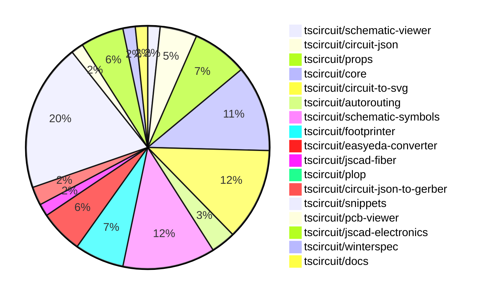

# Contribution Overview 2024-10-16

## PRs by Repository

## Contributor Overview

| Contributor | 🐳 Major | 🐙 Minor | 🐌 Tiny | ⭐ |
|-------------|-------|-------|-------|-------|
| [seveibar](#seveibar) | 17 | 28 | 3 | 👑👑👑 |
| [imrishabh18](#imrishabh18) | 1 | 16 | 2 | ⭐⭐⭐ |
| [andrii-balitskyi](#andrii-balitskyi) | 5 | 6 | 0 | ⭐⭐⭐ |
| [anas-sarkez](#anas-sarkez) | 5 | 5 | 0 | ⭐⭐ |
| [Abse2001](#Abse2001) | 2 | 5 | 1 | ⭐⭐ |
| [Timer00](#Timer00) | 4 | 1 | 0 | ⭐⭐ |
| [mrudulpatil18](#mrudulpatil18) | 2 | 1 | 0 | ⭐ |
| [aman1376](#aman1376) | 1 | 2 | 0 | ⭐ |
| [ShiboSoftwareDev](#ShiboSoftwareDev) | 0 | 3 | 1 | ⭐ |
| [theajmalrazaq](#theajmalrazaq) | 0 | 3 | 0 | ⭐ |
| [sarthak-kumar-shailendra](#sarthak-kumar-shailendra) | 0 | 2 | 0 | ⭐ |
| [ni9999](#ni9999) | 1 | 0 | 0 | ⭐ |
| [bbland1](#bbland1) | 0 | 1 | 0 |  |
| [alex-marinov](#alex-marinov) | 0 | 1 | 0 |  |
| [TSP06](#TSP06) | 0 | 1 | 0 |  |
| [anugcodes](#anugcodes) | 0 | 1 | 0 |  |
| [kom-senapati](#kom-senapati) | 0 | 1 | 0 |  |
| [AlexVCS](#AlexVCS) | 0 | 0 | 1 |  |

## Changes by Repository

### [tscircuit/schematic-viewer](https://github.com/tscircuit/schematic-viewer)

| PR # | Impact | Contributor | Description |
|------|--------|-------------|-------------|
| [#65](https://github.com/tscircuit/schematic-viewer/pull/65) | 🐳 Major | imrishabh18 | Refactors the builder code and updates the schematic viewer with new dependencies and functionality. |
| [#67](https://github.com/tscircuit/schematic-viewer/pull/67) | 🐙 Minor | imrishabh18 | This pull request fixes the port position and formatting using the `plop` tool. |

### [tscircuit/circuit-json](https://github.com/tscircuit/circuit-json)

| PR # | Impact | Contributor | Description |
|------|--------|-------------|-------------|
| [#62](https://github.com/tscircuit/circuit-json/pull/62) | 🐳 Major | seveibar | Generates a markdown file documenting the schematic component types used in the Circuit JSON specification. |
| [#65](https://github.com/tscircuit/circuit-json/pull/65) | 🐙 Minor | imrishabh18 | Add a new 'color' property to the 'schematic_text' schema to specify the text color. |
| [#64](https://github.com/tscircuit/circuit-json/pull/64) | 🐙 Minor | seveibar | Add useful meta information, true index, side of component etc. to schematic_port |
| [#61](https://github.com/tscircuit/circuit-json/pull/61) | 🐙 Minor | seveibar | Introduce a new schematic debug object, which can represent either a rectangular or a linear debug element in a schematic. |
| [#59](https://github.com/tscircuit/circuit-json/pull/59) | 🐙 Minor | seveibar | Adds a new circuit element type - "simple_battery". |
| [#60](https://github.com/tscircuit/circuit-json/pull/60) | 🐙 Minor | Abse2001 | Added support for simple inductors in the any_source_component union and exported the source_simple_inductor type. |

### [tscircuit/props](https://github.com/tscircuit/props)

| PR # | Impact | Contributor | Description |
|------|--------|-------------|-------------|
| [#67](https://github.com/tscircuit/props/pull/67) | 🐳 Major | seveibar | Adds a new file, `PROPS_OVERVIEW.md`, that provides an overview of all the prop types available in the `@tscircuit/props` package. |
| [#62](https://github.com/tscircuit/props/pull/62) | 🐙 Minor | imrishabh18 | Revert changes to the `width` and `height` properties in the `commonLayoutProps` interface. |
| [#60](https://github.com/tscircuit/props/pull/60) | 🐙 Minor | imrishabh18 | Replaces the `width` and `height` properties with `schWidth`, `schHeight`, `pcbWidth`, and `pcbHeight` properties in the `commonLayoutProps` and `commonComponentProps` type definitions. |
| [#58](https://github.com/tscircuit/props/pull/58) | 🐙 Minor | imrishabh18 | Add width and height properties to the commonComponentProps interface |
| [#66](https://github.com/tscircuit/props/pull/66) | 🐙 Minor | seveibar | Add support for "pill" shaped plated holes |
| [#65](https://github.com/tscircuit/props/pull/65) | 🐙 Minor | seveibar | Add support for `schAutoLayoutEnabled` prop on `<group />` component |
| [#63](https://github.com/tscircuit/props/pull/63) | 🐙 Minor | seveibar | Adds a new battery component, including a type definition for battery properties and a default unit of mAh. |
| [#61](https://github.com/tscircuit/props/pull/61) | 🐙 Minor | seveibar | Revert the addition of `schWidth`, `schHeight`, `pcbWidth`, and `pcbHeight` props, and replace them with `width` and `height` props. |
| [#59](https://github.com/tscircuit/props/pull/59) | 🐌 Tiny | imrishabh18 | Updated the lockfile |

### [tscircuit/core](https://github.com/tscircuit/core)

| PR # | Impact | Contributor | Description |
|------|--------|-------------|-------------|
| [#194](https://github.com/tscircuit/core/pull/194) | 🐳 Major | seveibar | Update to latest circuit-to-svg library, add support for drawing debugging boxes for schematic components, and switch to a better autorouter. |
| [#186](https://github.com/tscircuit/core/pull/186) | 🐳 Major | seveibar | Fixes schematic ports by using local instead of global positions, which simplifies computations and rendering. |
| [#185](https://github.com/tscircuit/core/pull/185) | 🐳 Major | seveibar | Implemented schematic autolayout and fixed routing issues |
| [#176](https://github.com/tscircuit/core/pull/176) | 🐳 Major | seveibar | Fixes the issue where `pcbRotation={-90}` did not properly rotate SMT pads and keepouts, and adds support for rotating keepouts. |
| [#196](https://github.com/tscircuit/core/pull/196) | 🐳 Major | Abse2001 | Implemented the `<Inductor>` component |
| [#201](https://github.com/tscircuit/core/pull/201) | 🐙 Minor | imrishabh18 | Fixes an issue with undefined pin skip in the `getAllDimensionsForSchematicBox` function. |
| [#200](https://github.com/tscircuit/core/pull/200) | 🐙 Minor | imrishabh18 | Adds ports as obstacles and improves routing in the circuit. |
| [#199](https://github.com/tscircuit/core/pull/199) | 🐙 Minor | imrishabh18 | Fixes the shifting of port positions on the edge of the chip |
| [#187](https://github.com/tscircuit/core/pull/187) | 🐙 Minor | imrishabh18 | Adds support for the `-size` suffix in port arrangements for the `NormalComponent` class. |
| [#198](https://github.com/tscircuit/core/pull/198) | 🐙 Minor | seveibar | Add support for pill-shaped plated holes and provide more AI context for tscircuit react props |
| [#188](https://github.com/tscircuit/core/pull/188) | 🐙 Minor | seveibar | Update the circuit-to-svg dependency to fix a bug where pinNumber 0 was not being recognized |
| [#177](https://github.com/tscircuit/core/pull/177) | 🐙 Minor | seveibar | Introduces a new <battery /> component |
| [#173](https://github.com/tscircuit/core/pull/173) | 🐙 Minor | seveibar | Adds support for shared pin labels in the NormalComponent class, allowing multiple ports to have the same primary label but different aliases. |
| [#182](https://github.com/tscircuit/core/pull/182) | 🐙 Minor | Abse2001 | Fixed an issue with the `toMatchSchematicSnapshot` test for the Battery component. |

### [tscircuit/circuit-to-svg](https://github.com/tscircuit/circuit-to-svg)

| PR # | Impact | Contributor | Description |
|------|--------|-------------|-------------|
| [#95](https://github.com/tscircuit/circuit-to-svg/pull/95) | 🐳 Major | seveibar | Refactors the schematic drawing code to remove usage of viewport and `flipY`, and rely on the `transform` matrix for computing all positions. |
| [#94](https://github.com/tscircuit/circuit-to-svg/pull/94) | 🐳 Major | seveibar | Introduce a labeled grid feature in the schematic SVG conversion function. |
| [#101](https://github.com/tscircuit/circuit-to-svg/pull/101) | 🐙 Minor | imrishabh18 | Hide the ports on the center of the component |
| [#100](https://github.com/tscircuit/circuit-to-svg/pull/100) | 🐙 Minor | imrishabh18 | Fixing a bug with port position by removing the negative Y direction scale. |
| [#96](https://github.com/tscircuit/circuit-to-svg/pull/96) | 🐙 Minor | imrishabh18 | Refactor the code to use the "transform" property instead of the deprecated "viewbox" property when converting circuit JSON to schematic SVG. |
| [#90](https://github.com/tscircuit/circuit-to-svg/pull/90) | 🐙 Minor | imrishabh18 | Revert a change that broke the position of pins. |
| [#99](https://github.com/tscircuit/circuit-to-svg/pull/99) | 🐙 Minor | seveibar | Fixes the schematic trace by adjusting the X coordinates to use the original values instead of the offset. |
| [#98](https://github.com/tscircuit/circuit-to-svg/pull/98) | 🐙 Minor | seveibar | Fixes the calculation of the transformed coordinates for SVG objects created from a debug object. |
| [#97](https://github.com/tscircuit/circuit-to-svg/pull/97) | 🐙 Minor | seveibar | Fixes schematic port handling of undefined `pinNumber` and finding pin number |
| [#93](https://github.com/tscircuit/circuit-to-svg/pull/93) | 🐙 Minor | seveibar | Adds support for drawing a grid and labeled points in the schematic SVG |
| [#92](https://github.com/tscircuit/circuit-to-svg/pull/92) | 🐙 Minor | seveibar | Adds support for drawing schematic debug objects, which include rectangles and lines, in the circuit JSON specification. |
| [#88](https://github.com/tscircuit/circuit-to-svg/pull/88) | 🐙 Minor | seveibar | Fix schematic port using a relative position. |
| [#87](https://github.com/tscircuit/circuit-to-svg/pull/87) | 🐙 Minor | seveibar | Fix silkscreen paths being erroneously closed, improving the appearance of pushbutton silkscreens. |
| [#89](https://github.com/tscircuit/circuit-to-svg/pull/89) | 🐙 Minor | Abse2001 | Updated the version of the 'schematic-symbols' dependency from 0.0.79 to 0.0.90. |
| [#86](https://github.com/tscircuit/circuit-to-svg/pull/86) | 🐙 Minor | Abse2001 | Updated the schematic symbols to fix the battery in the core and formatted the code. |

### [tscircuit/autorouting](https://github.com/tscircuit/autorouting)

| PR # | Impact | Contributor | Description |
|------|--------|-------------|-------------|
| [#85](https://github.com/tscircuit/autorouting/pull/85) | 🐳 Major | seveibar | Switch the application to use NextJS for deployment. |
| [#82](https://github.com/tscircuit/autorouting/pull/82) | 🐙 Minor | imrishabh18 | Refactor to remove unused builder code |
| [#88](https://github.com/tscircuit/autorouting/pull/88) | 🐙 Minor | seveibar | Removes path loop fix to simplify output routes |
| [#84](https://github.com/tscircuit/autorouting/pull/84) | 🐙 Minor | seveibar | Allows pasting SimpleRouteJson on the homepage and converts it to the required soup format. |

### [tscircuit/schematic-symbols](https://github.com/tscircuit/schematic-symbols)

| PR # | Impact | Contributor | Description |
|------|--------|-------------|-------------|
| [#185](https://github.com/tscircuit/schematic-symbols/pull/185) | 🐳 Major | Abse2001 | Implemented SVG Arc support and added inductor symbol |
| [#162](https://github.com/tscircuit/schematic-symbols/pull/162) | 🐳 Major | aman1376 | Adds a new JSON file and an SVG file for a DPST (Double Pole Single Throw) switch symbol. |
| [#78](https://github.com/tscircuit/schematic-symbols/pull/78) | 🐳 Major | Timer00 | Adds a new wattmeter symbol to the project |
| [#95](https://github.com/tscircuit/schematic-symbols/pull/95) | 🐳 Major | Timer00 | Introduce a new symbol called "varmeter" |
| [#97](https://github.com/tscircuit/schematic-symbols/pull/97) | 🐳 Major | Timer00 | Introduce a new symbol "frequency_meter" |
| [#100](https://github.com/tscircuit/schematic-symbols/pull/100) | 🐳 Major | Timer00 | Introduces a new symbol "tachometer" to the project. |
| [#184](https://github.com/tscircuit/schematic-symbols/pull/184) | 🐙 Minor | imrishabh18 | Updated the npm lockfile to fix a failing npm publish. |
| [#172](https://github.com/tscircuit/schematic-symbols/pull/172) | 🐙 Minor | imrishabh18 | Fix the calculation for the height of the SPDT switch and boxresistor components. |
| [#174](https://github.com/tscircuit/schematic-symbols/pull/174) | 🐙 Minor | Abse2001 | Added a new battery symbol. |
| [#176](https://github.com/tscircuit/schematic-symbols/pull/176) | 🐙 Minor | aman1376 | Adds a new SVG symbol for a light-dependent resistor. |
| [#182](https://github.com/tscircuit/schematic-symbols/pull/182) | 🐙 Minor | TSP06 | Added a new ground symbol to the project. |
| [#96](https://github.com/tscircuit/schematic-symbols/pull/96) | 🐙 Minor | Timer00 | Introduces a new SVG symbol for a watt-hour meter. |
| [#153](https://github.com/tscircuit/schematic-symbols/pull/153) | 🐙 Minor | mrudulpatil18 | Added a rectifier diode symbol with its corresponding JSON data. |
| [#167](https://github.com/tscircuit/schematic-symbols/pull/167) | 🐙 Minor | anugcodes | Added the design for the symbol of the Darlington pair transistor |
| [#183](https://github.com/tscircuit/schematic-symbols/pull/183) | 🐌 Tiny | imrishabh18 | Update .gitignore to ignore .diff.png files |

### [tscircuit/footprinter](https://github.com/tscircuit/footprinter)

| PR # | Impact | Contributor | Description |
|------|--------|-------------|-------------|
| [#67](https://github.com/tscircuit/footprinter/pull/67) | 🐳 Major | seveibar | Introduces a new script to automatically generate a gallery page for SVG snapshots. |
| [#71](https://github.com/tscircuit/footprinter/pull/71) | 🐳 Major | anas-sarkez | This pull request modifies the pad length and holes position of the stampboard, and adds support for inner holes in the stampboard and stampreceiver. |
| [#70](https://github.com/tscircuit/footprinter/pull/70) | 🐳 Major | anas-sarkez | Implemented a function to generate a stampreceiver footprint |
| [#68](https://github.com/tscircuit/footprinter/pull/68) | 🐳 Major | anas-sarkez | Implemented a new function called "stampboard" that generates a circuit JSON object with rectangular pads and plated holes for a stampboard layout. |
| [#66](https://github.com/tscircuit/footprinter/pull/66) | 🐙 Minor | seveibar | Introduce a new pushbutton footprint and update the circuit-to-svg dependency |
| [#72](https://github.com/tscircuit/footprinter/pull/72) | 🐙 Minor | aman1376 | Adds the `lqfp` component to the project. |
| [#69](https://github.com/tscircuit/footprinter/pull/69) | 🐙 Minor | anas-sarkez | Implement silkscreen reference for every component and added silkscreenRef function to helpers |
| [#60](https://github.com/tscircuit/footprinter/pull/60) | 🐙 Minor | bbland1 | Adds types for parameters returned using .json() in the footprinter library. |

### [tscircuit/easyeda-converter](https://github.com/tscircuit/easyeda-converter)

| PR # | Impact | Contributor | Description |
|------|--------|-------------|-------------|
| [#74](https://github.com/tscircuit/easyeda-converter/pull/74) | 🐳 Major | seveibar | The pull request fixes the C490691 import, adds a script for quickly adding tests for parts. |
| [#71](https://github.com/tscircuit/easyeda-converter/pull/71) | 🐙 Minor | seveibar | Fixes the issue with Arc Imports in the package-detail-shape-schema.ts file. |
| [#85](https://github.com/tscircuit/easyeda-converter/pull/85) | 🐙 Minor | andrii-balitskyi | Converts string pin numbers to type number when converting to TSX |
| [#83](https://github.com/tscircuit/easyeda-converter/pull/83) | 🐙 Minor | andrii-balitskyi | Converts oval pads with hole radius to pill-shaped plated holes in the EasyEDA to circuit JSON conversion. |
| [#84](https://github.com/tscircuit/easyeda-converter/pull/84) | 🐙 Minor | andrii-balitskyi | Fix stroke width calculation in the EasyEDA to TSCircuit converter. |
| [#78](https://github.com/tscircuit/easyeda-converter/pull/78) | 🐙 Minor | andrii-balitskyi | Adds support for `T~` text shapes and fixes a script that was giving an error. |
| [#77](https://github.com/tscircuit/easyeda-converter/pull/77) | 🐙 Minor | andrii-balitskyi | Fix the error message for the convert command to use the correct option name. |

### [tscircuit/jscad-fiber](https://github.com/tscircuit/jscad-fiber)

| PR # | Impact | Contributor | Description |
|------|--------|-------------|-------------|
| [#84](https://github.com/tscircuit/jscad-fiber/pull/84) | 🐳 Major | seveibar | Implement the `Subtract` component for subtracting 3D shapes. |
| [#85](https://github.com/tscircuit/jscad-fiber/pull/85) | 🐙 Minor | alex-marinov | Adds support for <Translate /> to accept multiple children |

### [tscircuit/plop](https://github.com/tscircuit/plop)

| PR # | Impact | Contributor | Description |
|------|--------|-------------|-------------|
| [#5](https://github.com/tscircuit/plop/pull/5) | 🐳 Major | seveibar | Adds support for checking the latest version of the package, fetching and copying remote templates, and switching to the Bun runtime for build and release. |

### [tscircuit/circuit-json-to-gerber](https://github.com/tscircuit/circuit-json-to-gerber)

| PR # | Impact | Contributor | Description |
|------|--------|-------------|-------------|
| [#26](https://github.com/tscircuit/circuit-json-to-gerber/pull/26) | 🐳 Major | seveibar |  |
| [#25](https://github.com/tscircuit/circuit-json-to-gerber/pull/25) | 🐳 Major | seveibar | Adds a specification for various PCB components and structures, including fabrication notes, silkscreen elements, plated holes, vias, and more. |
| [#22](https://github.com/tscircuit/circuit-json-to-gerber/pull/22) | 🐙 Minor | ShiboSoftwareDev | Implemented silkscreen path |

### [tscircuit/snippets](https://github.com/tscircuit/snippets)

| PR # | Impact | Contributor | Description |
|------|--------|-------------|-------------|
| [#115](https://github.com/tscircuit/snippets/pull/115) | 🐳 Major | seveibar | Introduce cmd+click to open snippets |
| [#114](https://github.com/tscircuit/snippets/pull/114) | 🐳 Major | seveibar | Adds a files dialog to inspect build files for a code snippet. |
| [#88](https://github.com/tscircuit/snippets/pull/88) | 🐳 Major | andrii-balitskyi | Add country and state dropdown to the shipping information form. |
| [#89](https://github.com/tscircuit/snippets/pull/89) | 🐳 Major | andrii-balitskyi | Adds a tab-based component to display the PCB, 3D, and JSON data for an order. |
| [#82](https://github.com/tscircuit/snippets/pull/82) | 🐳 Major | andrii-balitskyi | This pull request adds the ability to edit shipping information in the profile settings. |
| [#68](https://github.com/tscircuit/snippets/pull/68) | 🐳 Major | andrii-balitskyi | Adds tests for the /orders/create, /orders/get, /orders/list, /orders/update, /order_files/upload, and /order_files/get endpoints. |
| [#78](https://github.com/tscircuit/snippets/pull/78) | 🐳 Major | andrii-balitskyi | Add a new "Submit Order" button and dialog to the editor navigation bar. |
| [#117](https://github.com/tscircuit/snippets/pull/117) | 🐳 Major | mrudulpatil18 | Added a command palette (Cmd+K) with various commands and search functionality. |
| [#77](https://github.com/tscircuit/snippets/pull/77) | 🐳 Major | mrudulpatil18 | Adds a search component to the header, allowing users to search for snippets and navigate to the editor view. |
| [#125](https://github.com/tscircuit/snippets/pull/125) | 🐳 Major | ni9999 | Implemented a "Fork" functionality on the ViewSnippetHeader component. |
| [#126](https://github.com/tscircuit/snippets/pull/126) | 🐙 Minor | seveibar | Update dependencies for the Pill Holes project. |
| [#122](https://github.com/tscircuit/snippets/pull/122) | 🐙 Minor | seveibar | Adds an endpoint to allow users to star a code snippet. |
| [#118](https://github.com/tscircuit/snippets/pull/118) | 🐙 Minor | seveibar | Minor fixes for broken search and cmd+click functionality |
| [#108](https://github.com/tscircuit/snippets/pull/108) | 🐙 Minor | seveibar | Sort user's snippets by last created time |
| [#80](https://github.com/tscircuit/snippets/pull/80) | 🐙 Minor | seveibar | Fixes issues with JLCPCB imports, updates for shared pin label support, and fixes errors in local development to show JLCPCB import errors. |
| [#74](https://github.com/tscircuit/snippets/pull/74) | 🐙 Minor | seveibar | Updates dependencies related to fabrication file downloads |
| [#124](https://github.com/tscircuit/snippets/pull/124) | 🐙 Minor | andrii-balitskyi | Fixes the width of the SearchableSelect options to match the trigger width |
| [#95](https://github.com/tscircuit/snippets/pull/95) | 🐙 Minor | theajmalrazaq | Fixed the responsiveness of the Quickstart page. |
| [#97](https://github.com/tscircuit/snippets/pull/97) | 🐙 Minor | theajmalrazaq | Added Playwright tests for the AI Page and Quickstart Page, added viewports to existing tests, fixed them, and updated the snapshots. |
| [#85](https://github.com/tscircuit/snippets/pull/85) | 🐙 Minor | theajmalrazaq | Fixed the search box rendering issue and improved the dashboard responsiveness. |
| [#86](https://github.com/tscircuit/snippets/pull/86) | 🐙 Minor | kom-senapati | Updates the page title to display the snippet name and owner name in the format `tscircuit - <owner>/<package>`. |
| [#84](https://github.com/tscircuit/snippets/pull/84) | 🐌 Tiny | seveibar | Fix tab indentation in the CodeEditor component |
| [#96](https://github.com/tscircuit/snippets/pull/96) | 🐌 Tiny | Abse2001 | Updates the version of the "winterspec" dependency from 0.0.93 to 0.0.94. |
| [#110](https://github.com/tscircuit/snippets/pull/110) | 🐌 Tiny | AlexVCS | Adds a favicon to the website. |

### [tscircuit/pcb-viewer](https://github.com/tscircuit/pcb-viewer)

| PR # | Impact | Contributor | Description |
|------|--------|-------------|-------------|
| [#76](https://github.com/tscircuit/pcb-viewer/pull/76) | 🐌 Tiny | seveibar | Fix formatting and remove console log in silkscreen path story |
| [#75](https://github.com/tscircuit/pcb-viewer/pull/75) | 🐌 Tiny | ShiboSoftwareDev | Added a CODEOWNERS file to specify code ownership for the entire repository. |

### [tscircuit/jscad-electronics](https://github.com/tscircuit/jscad-electronics)

| PR # | Impact | Contributor | Description |
|------|--------|-------------|-------------|
| [#75](https://github.com/tscircuit/jscad-electronics/pull/75) | 🐳 Major | anas-sarkez | Implementing a 3D model for a pin row component and refactoring the footprint plated holes |
| [#68](https://github.com/tscircuit/jscad-electronics/pull/68) | 🐳 Major | anas-sarkez | Implementing a USB-C female port 3D component |
| [#76](https://github.com/tscircuit/jscad-electronics/pull/76) | 🐙 Minor | anas-sarkez | Added a new footprinter3D example for a pin row component. |
| [#72](https://github.com/tscircuit/jscad-electronics/pull/72) | 🐙 Minor | anas-sarkez | Refactored the USB_C component to use Subtract for the curved metal casing, replacing complex calculations. |
| [#71](https://github.com/tscircuit/jscad-electronics/pull/71) | 🐙 Minor | anas-sarkez | Updated jscad-fiber dependency and subtracted curve slice from smdLED sides |
| [#69](https://github.com/tscircuit/jscad-electronics/pull/69) | 🐙 Minor | anas-sarkez | Implementing SmdLED packages with different colors |
| [#70](https://github.com/tscircuit/jscad-electronics/pull/70) | 🐌 Tiny | seveibar | Add anas as a codeowner for files matching "add+" patterns. |

### [tscircuit/winterspec](https://github.com/tscircuit/winterspec)

| PR # | Impact | Contributor | Description |
|------|--------|-------------|-------------|
| [#18](https://github.com/tscircuit/winterspec/pull/18) | 🐙 Minor | ShiboSoftwareDev | Update the `construct-manifest.ts` file to fix a path issue on Windows by replacing backslashes with forward slashes. |
| [#17](https://github.com/tscircuit/winterspec/pull/17) | 🐙 Minor | ShiboSoftwareDev | Fixed a bug in the `esbuild` build process to work on Windows by modifying file paths to use Unix-based paths. |

### [tscircuit/docs](https://github.com/tscircuit/docs)

| PR # | Impact | Contributor | Description |
|------|--------|-------------|-------------|
| [#29](https://github.com/tscircuit/docs/pull/29) | 🐙 Minor | sarthak-kumar-shailendra | Fixes the icon and URL for the Twitter/X entry in the sidebar and footer of the website. |
| [#28](https://github.com/tscircuit/docs/pull/28) | 🐙 Minor | sarthak-kumar-shailendra | Updates the Twitter logo to the new X icon |

## Changes by Contributor

### [imrishabh18](https://github.com/imrishabh18)

| PR # | Impact | Description |
|------|--------|-------------|
| [#65](https://github.com/tscircuit/schematic-viewer/pull/65) | 🐳 Major | Refactors the builder code and updates the schematic viewer with new dependencies and functionality. |
| [#67](https://github.com/tscircuit/schematic-viewer/pull/67) | 🐙 Minor | This pull request fixes the port position and formatting using the `plop` tool. |
| [#65](https://github.com/tscircuit/circuit-json/pull/65) | 🐙 Minor | Add a new 'color' property to the 'schematic_text' schema to specify the text color. |
| [#62](https://github.com/tscircuit/props/pull/62) | 🐙 Minor | Revert changes to the `width` and `height` properties in the `commonLayoutProps` interface. |
| [#60](https://github.com/tscircuit/props/pull/60) | 🐙 Minor | Replaces the `width` and `height` properties with `schWidth`, `schHeight`, `pcbWidth`, and `pcbHeight` properties in the `commonLayoutProps` and `commonComponentProps` type definitions. |
| [#58](https://github.com/tscircuit/props/pull/58) | 🐙 Minor | Add width and height properties to the commonComponentProps interface |
| [#201](https://github.com/tscircuit/core/pull/201) | 🐙 Minor | Fixes an issue with undefined pin skip in the `getAllDimensionsForSchematicBox` function. |
| [#200](https://github.com/tscircuit/core/pull/200) | 🐙 Minor | Adds ports as obstacles and improves routing in the circuit. |
| [#199](https://github.com/tscircuit/core/pull/199) | 🐙 Minor | Fixes the shifting of port positions on the edge of the chip |
| [#187](https://github.com/tscircuit/core/pull/187) | 🐙 Minor | Adds support for the `-size` suffix in port arrangements for the `NormalComponent` class. |
| [#101](https://github.com/tscircuit/circuit-to-svg/pull/101) | 🐙 Minor | Hide the ports on the center of the component |
| [#100](https://github.com/tscircuit/circuit-to-svg/pull/100) | 🐙 Minor | Fixing a bug with port position by removing the negative Y direction scale. |
| [#96](https://github.com/tscircuit/circuit-to-svg/pull/96) | 🐙 Minor | Refactor the code to use the "transform" property instead of the deprecated "viewbox" property when converting circuit JSON to schematic SVG. |
| [#90](https://github.com/tscircuit/circuit-to-svg/pull/90) | 🐙 Minor | Revert a change that broke the position of pins. |
| [#82](https://github.com/tscircuit/autorouting/pull/82) | 🐙 Minor | Refactor to remove unused builder code |
| [#184](https://github.com/tscircuit/schematic-symbols/pull/184) | 🐙 Minor | Updated the npm lockfile to fix a failing npm publish. |
| [#172](https://github.com/tscircuit/schematic-symbols/pull/172) | 🐙 Minor | Fix the calculation for the height of the SPDT switch and boxresistor components. |
| [#59](https://github.com/tscircuit/props/pull/59) | 🐌 Tiny | Updated the lockfile |
| [#183](https://github.com/tscircuit/schematic-symbols/pull/183) | 🐌 Tiny | Update .gitignore to ignore .diff.png files |

### [seveibar](https://github.com/seveibar)

| PR # | Impact | Description |
|------|--------|-------------|
| [#62](https://github.com/tscircuit/circuit-json/pull/62) | 🐳 Major | Generates a markdown file documenting the schematic component types used in the Circuit JSON specification. |
| [#67](https://github.com/tscircuit/props/pull/67) | 🐳 Major | Adds a new file, `PROPS_OVERVIEW.md`, that provides an overview of all the prop types available in the `@tscircuit/props` package. |
| [#67](https://github.com/tscircuit/footprinter/pull/67) | 🐳 Major | Introduces a new script to automatically generate a gallery page for SVG snapshots. |
| [#74](https://github.com/tscircuit/easyeda-converter/pull/74) | 🐳 Major | The pull request fixes the C490691 import, adds a script for quickly adding tests for parts. |
| [#194](https://github.com/tscircuit/core/pull/194) | 🐳 Major | Update to latest circuit-to-svg library, add support for drawing debugging boxes for schematic components, and switch to a better autorouter. |
| [#186](https://github.com/tscircuit/core/pull/186) | 🐳 Major | Fixes schematic ports by using local instead of global positions, which simplifies computations and rendering. |
| [#185](https://github.com/tscircuit/core/pull/185) | 🐳 Major | Implemented schematic autolayout and fixed routing issues |
| [#176](https://github.com/tscircuit/core/pull/176) | 🐳 Major | Fixes the issue where `pcbRotation={-90}` did not properly rotate SMT pads and keepouts, and adds support for rotating keepouts. |
| [#84](https://github.com/tscircuit/jscad-fiber/pull/84) | 🐳 Major | Implement the `Subtract` component for subtracting 3D shapes. |
| [#5](https://github.com/tscircuit/plop/pull/5) | 🐳 Major | Adds support for checking the latest version of the package, fetching and copying remote templates, and switching to the Bun runtime for build and release. |
| [#95](https://github.com/tscircuit/circuit-to-svg/pull/95) | 🐳 Major | Refactors the schematic drawing code to remove usage of viewport and `flipY`, and rely on the `transform` matrix for computing all positions. |
| [#94](https://github.com/tscircuit/circuit-to-svg/pull/94) | 🐳 Major | Introduce a labeled grid feature in the schematic SVG conversion function. |
| [#85](https://github.com/tscircuit/autorouting/pull/85) | 🐳 Major | Switch the application to use NextJS for deployment. |
| [#26](https://github.com/tscircuit/circuit-json-to-gerber/pull/26) | 🐳 Major |  |
| [#25](https://github.com/tscircuit/circuit-json-to-gerber/pull/25) | 🐳 Major | Adds a specification for various PCB components and structures, including fabrication notes, silkscreen elements, plated holes, vias, and more. |
| [#115](https://github.com/tscircuit/snippets/pull/115) | 🐳 Major | Introduce cmd+click to open snippets |
| [#114](https://github.com/tscircuit/snippets/pull/114) | 🐳 Major | Adds a files dialog to inspect build files for a code snippet. |
| [#64](https://github.com/tscircuit/circuit-json/pull/64) | 🐙 Minor | Add useful meta information, true index, side of component etc. to schematic_port |
| [#61](https://github.com/tscircuit/circuit-json/pull/61) | 🐙 Minor | Introduce a new schematic debug object, which can represent either a rectangular or a linear debug element in a schematic. |
| [#59](https://github.com/tscircuit/circuit-json/pull/59) | 🐙 Minor | Adds a new circuit element type - "simple_battery". |
| [#66](https://github.com/tscircuit/props/pull/66) | 🐙 Minor | Add support for "pill" shaped plated holes |
| [#65](https://github.com/tscircuit/props/pull/65) | 🐙 Minor | Add support for `schAutoLayoutEnabled` prop on `<group />` component |
| [#63](https://github.com/tscircuit/props/pull/63) | 🐙 Minor | Adds a new battery component, including a type definition for battery properties and a default unit of mAh. |
| [#61](https://github.com/tscircuit/props/pull/61) | 🐙 Minor | Revert the addition of `schWidth`, `schHeight`, `pcbWidth`, and `pcbHeight` props, and replace them with `width` and `height` props. |
| [#66](https://github.com/tscircuit/footprinter/pull/66) | 🐙 Minor | Introduce a new pushbutton footprint and update the circuit-to-svg dependency |
| [#71](https://github.com/tscircuit/easyeda-converter/pull/71) | 🐙 Minor | Fixes the issue with Arc Imports in the package-detail-shape-schema.ts file. |
| [#198](https://github.com/tscircuit/core/pull/198) | 🐙 Minor | Add support for pill-shaped plated holes and provide more AI context for tscircuit react props |
| [#188](https://github.com/tscircuit/core/pull/188) | 🐙 Minor | Update the circuit-to-svg dependency to fix a bug where pinNumber 0 was not being recognized |
| [#177](https://github.com/tscircuit/core/pull/177) | 🐙 Minor | Introduces a new <battery /> component |
| [#173](https://github.com/tscircuit/core/pull/173) | 🐙 Minor | Adds support for shared pin labels in the NormalComponent class, allowing multiple ports to have the same primary label but different aliases. |
| [#99](https://github.com/tscircuit/circuit-to-svg/pull/99) | 🐙 Minor | Fixes the schematic trace by adjusting the X coordinates to use the original values instead of the offset. |
| [#98](https://github.com/tscircuit/circuit-to-svg/pull/98) | 🐙 Minor | Fixes the calculation of the transformed coordinates for SVG objects created from a debug object. |
| [#97](https://github.com/tscircuit/circuit-to-svg/pull/97) | 🐙 Minor | Fixes schematic port handling of undefined `pinNumber` and finding pin number |
| [#93](https://github.com/tscircuit/circuit-to-svg/pull/93) | 🐙 Minor | Adds support for drawing a grid and labeled points in the schematic SVG |
| [#92](https://github.com/tscircuit/circuit-to-svg/pull/92) | 🐙 Minor | Adds support for drawing schematic debug objects, which include rectangles and lines, in the circuit JSON specification. |
| [#88](https://github.com/tscircuit/circuit-to-svg/pull/88) | 🐙 Minor | Fix schematic port using a relative position. |
| [#87](https://github.com/tscircuit/circuit-to-svg/pull/87) | 🐙 Minor | Fix silkscreen paths being erroneously closed, improving the appearance of pushbutton silkscreens. |
| [#88](https://github.com/tscircuit/autorouting/pull/88) | 🐙 Minor | Removes path loop fix to simplify output routes |
| [#84](https://github.com/tscircuit/autorouting/pull/84) | 🐙 Minor | Allows pasting SimpleRouteJson on the homepage and converts it to the required soup format. |
| [#126](https://github.com/tscircuit/snippets/pull/126) | 🐙 Minor | Update dependencies for the Pill Holes project. |
| [#122](https://github.com/tscircuit/snippets/pull/122) | 🐙 Minor | Adds an endpoint to allow users to star a code snippet. |
| [#118](https://github.com/tscircuit/snippets/pull/118) | 🐙 Minor | Minor fixes for broken search and cmd+click functionality |
| [#108](https://github.com/tscircuit/snippets/pull/108) | 🐙 Minor | Sort user's snippets by last created time |
| [#80](https://github.com/tscircuit/snippets/pull/80) | 🐙 Minor | Fixes issues with JLCPCB imports, updates for shared pin label support, and fixes errors in local development to show JLCPCB import errors. |
| [#74](https://github.com/tscircuit/snippets/pull/74) | 🐙 Minor | Updates dependencies related to fabrication file downloads |
| [#76](https://github.com/tscircuit/pcb-viewer/pull/76) | 🐌 Tiny | Fix formatting and remove console log in silkscreen path story |
| [#70](https://github.com/tscircuit/jscad-electronics/pull/70) | 🐌 Tiny | Add anas as a codeowner for files matching "add+" patterns. |
| [#84](https://github.com/tscircuit/snippets/pull/84) | 🐌 Tiny | Fix tab indentation in the CodeEditor component |

### [ShiboSoftwareDev](https://github.com/ShiboSoftwareDev)

| PR # | Impact | Description |
|------|--------|-------------|
| [#18](https://github.com/tscircuit/winterspec/pull/18) | 🐙 Minor | Update the `construct-manifest.ts` file to fix a path issue on Windows by replacing backslashes with forward slashes. |
| [#17](https://github.com/tscircuit/winterspec/pull/17) | 🐙 Minor | Fixed a bug in the `esbuild` build process to work on Windows by modifying file paths to use Unix-based paths. |
| [#22](https://github.com/tscircuit/circuit-json-to-gerber/pull/22) | 🐙 Minor | Implemented silkscreen path |
| [#75](https://github.com/tscircuit/pcb-viewer/pull/75) | 🐌 Tiny | Added a CODEOWNERS file to specify code ownership for the entire repository. |

### [Abse2001](https://github.com/Abse2001)

| PR # | Impact | Description |
|------|--------|-------------|
| [#196](https://github.com/tscircuit/core/pull/196) | 🐳 Major | Implemented the `<Inductor>` component |
| [#185](https://github.com/tscircuit/schematic-symbols/pull/185) | 🐳 Major | Implemented SVG Arc support and added inductor symbol |
| [#60](https://github.com/tscircuit/circuit-json/pull/60) | 🐙 Minor | Added support for simple inductors in the any_source_component union and exported the source_simple_inductor type. |
| [#182](https://github.com/tscircuit/core/pull/182) | 🐙 Minor | Fixed an issue with the `toMatchSchematicSnapshot` test for the Battery component. |
| [#89](https://github.com/tscircuit/circuit-to-svg/pull/89) | 🐙 Minor | Updated the version of the 'schematic-symbols' dependency from 0.0.79 to 0.0.90. |
| [#86](https://github.com/tscircuit/circuit-to-svg/pull/86) | 🐙 Minor | Updated the schematic symbols to fix the battery in the core and formatted the code. |
| [#174](https://github.com/tscircuit/schematic-symbols/pull/174) | 🐙 Minor | Added a new battery symbol. |
| [#96](https://github.com/tscircuit/snippets/pull/96) | 🐌 Tiny | Updates the version of the "winterspec" dependency from 0.0.93 to 0.0.94. |

### [sarthak-kumar-shailendra](https://github.com/sarthak-kumar-shailendra)

| PR # | Impact | Description |
|------|--------|-------------|
| [#29](https://github.com/tscircuit/docs/pull/29) | 🐙 Minor | Fixes the icon and URL for the Twitter/X entry in the sidebar and footer of the website. |
| [#28](https://github.com/tscircuit/docs/pull/28) | 🐙 Minor | Updates the Twitter logo to the new X icon |

### [aman1376](https://github.com/aman1376)

| PR # | Impact | Description |
|------|--------|-------------|
| [#162](https://github.com/tscircuit/schematic-symbols/pull/162) | 🐳 Major | Adds a new JSON file and an SVG file for a DPST (Double Pole Single Throw) switch symbol. |
| [#72](https://github.com/tscircuit/footprinter/pull/72) | 🐙 Minor | Adds the `lqfp` component to the project. |
| [#176](https://github.com/tscircuit/schematic-symbols/pull/176) | 🐙 Minor | Adds a new SVG symbol for a light-dependent resistor. |

### [anas-sarkez](https://github.com/anas-sarkez)

| PR # | Impact | Description |
|------|--------|-------------|
| [#71](https://github.com/tscircuit/footprinter/pull/71) | 🐳 Major | This pull request modifies the pad length and holes position of the stampboard, and adds support for inner holes in the stampboard and stampreceiver. |
| [#70](https://github.com/tscircuit/footprinter/pull/70) | 🐳 Major | Implemented a function to generate a stampreceiver footprint |
| [#68](https://github.com/tscircuit/footprinter/pull/68) | 🐳 Major | Implemented a new function called "stampboard" that generates a circuit JSON object with rectangular pads and plated holes for a stampboard layout. |
| [#75](https://github.com/tscircuit/jscad-electronics/pull/75) | 🐳 Major | Implementing a 3D model for a pin row component and refactoring the footprint plated holes |
| [#68](https://github.com/tscircuit/jscad-electronics/pull/68) | 🐳 Major | Implementing a USB-C female port 3D component |
| [#69](https://github.com/tscircuit/footprinter/pull/69) | 🐙 Minor | Implement silkscreen reference for every component and added silkscreenRef function to helpers |
| [#76](https://github.com/tscircuit/jscad-electronics/pull/76) | 🐙 Minor | Added a new footprinter3D example for a pin row component. |
| [#72](https://github.com/tscircuit/jscad-electronics/pull/72) | 🐙 Minor | Refactored the USB_C component to use Subtract for the curved metal casing, replacing complex calculations. |
| [#71](https://github.com/tscircuit/jscad-electronics/pull/71) | 🐙 Minor | Updated jscad-fiber dependency and subtracted curve slice from smdLED sides |
| [#69](https://github.com/tscircuit/jscad-electronics/pull/69) | 🐙 Minor | Implementing SmdLED packages with different colors |

### [bbland1](https://github.com/bbland1)

| PR # | Impact | Description |
|------|--------|-------------|
| [#60](https://github.com/tscircuit/footprinter/pull/60) | 🐙 Minor | Adds types for parameters returned using .json() in the footprinter library. |

### [andrii-balitskyi](https://github.com/andrii-balitskyi)

| PR # | Impact | Description |
|------|--------|-------------|
| [#88](https://github.com/tscircuit/snippets/pull/88) | 🐳 Major | Add country and state dropdown to the shipping information form. |
| [#89](https://github.com/tscircuit/snippets/pull/89) | 🐳 Major | Adds a tab-based component to display the PCB, 3D, and JSON data for an order. |
| [#82](https://github.com/tscircuit/snippets/pull/82) | 🐳 Major | This pull request adds the ability to edit shipping information in the profile settings. |
| [#68](https://github.com/tscircuit/snippets/pull/68) | 🐳 Major | Adds tests for the /orders/create, /orders/get, /orders/list, /orders/update, /order_files/upload, and /order_files/get endpoints. |
| [#78](https://github.com/tscircuit/snippets/pull/78) | 🐳 Major | Add a new "Submit Order" button and dialog to the editor navigation bar. |
| [#85](https://github.com/tscircuit/easyeda-converter/pull/85) | 🐙 Minor | Converts string pin numbers to type number when converting to TSX |
| [#83](https://github.com/tscircuit/easyeda-converter/pull/83) | 🐙 Minor | Converts oval pads with hole radius to pill-shaped plated holes in the EasyEDA to circuit JSON conversion. |
| [#84](https://github.com/tscircuit/easyeda-converter/pull/84) | 🐙 Minor | Fix stroke width calculation in the EasyEDA to TSCircuit converter. |
| [#78](https://github.com/tscircuit/easyeda-converter/pull/78) | 🐙 Minor | Adds support for `T~` text shapes and fixes a script that was giving an error. |
| [#77](https://github.com/tscircuit/easyeda-converter/pull/77) | 🐙 Minor | Fix the error message for the convert command to use the correct option name. |
| [#124](https://github.com/tscircuit/snippets/pull/124) | 🐙 Minor | Fixes the width of the SearchableSelect options to match the trigger width |

### [alex-marinov](https://github.com/alex-marinov)

| PR # | Impact | Description |
|------|--------|-------------|
| [#85](https://github.com/tscircuit/jscad-fiber/pull/85) | 🐙 Minor | Adds support for <Translate /> to accept multiple children |

### [TSP06](https://github.com/TSP06)

| PR # | Impact | Description |
|------|--------|-------------|
| [#182](https://github.com/tscircuit/schematic-symbols/pull/182) | 🐙 Minor | Added a new ground symbol to the project. |

### [Timer00](https://github.com/Timer00)

| PR # | Impact | Description |
|------|--------|-------------|
| [#78](https://github.com/tscircuit/schematic-symbols/pull/78) | 🐳 Major | Adds a new wattmeter symbol to the project |
| [#95](https://github.com/tscircuit/schematic-symbols/pull/95) | 🐳 Major | Introduce a new symbol called "varmeter" |
| [#97](https://github.com/tscircuit/schematic-symbols/pull/97) | 🐳 Major | Introduce a new symbol "frequency_meter" |
| [#100](https://github.com/tscircuit/schematic-symbols/pull/100) | 🐳 Major | Introduces a new symbol "tachometer" to the project. |
| [#96](https://github.com/tscircuit/schematic-symbols/pull/96) | 🐙 Minor | Introduces a new SVG symbol for a watt-hour meter. |

### [mrudulpatil18](https://github.com/mrudulpatil18)

| PR # | Impact | Description |
|------|--------|-------------|
| [#117](https://github.com/tscircuit/snippets/pull/117) | 🐳 Major | Added a command palette (Cmd+K) with various commands and search functionality. |
| [#77](https://github.com/tscircuit/snippets/pull/77) | 🐳 Major | Adds a search component to the header, allowing users to search for snippets and navigate to the editor view. |
| [#153](https://github.com/tscircuit/schematic-symbols/pull/153) | 🐙 Minor | Added a rectifier diode symbol with its corresponding JSON data. |

### [anugcodes](https://github.com/anugcodes)

| PR # | Impact | Description |
|------|--------|-------------|
| [#167](https://github.com/tscircuit/schematic-symbols/pull/167) | 🐙 Minor | Added the design for the symbol of the Darlington pair transistor |

### [ni9999](https://github.com/ni9999)

| PR # | Impact | Description |
|------|--------|-------------|
| [#125](https://github.com/tscircuit/snippets/pull/125) | 🐳 Major | Implemented a "Fork" functionality on the ViewSnippetHeader component. |

### [AlexVCS](https://github.com/AlexVCS)

| PR # | Impact | Description |
|------|--------|-------------|
| [#110](https://github.com/tscircuit/snippets/pull/110) | 🐌 Tiny | Adds a favicon to the website. |

### [theajmalrazaq](https://github.com/theajmalrazaq)

| PR # | Impact | Description |
|------|--------|-------------|
| [#95](https://github.com/tscircuit/snippets/pull/95) | 🐙 Minor | Fixed the responsiveness of the Quickstart page. |
| [#97](https://github.com/tscircuit/snippets/pull/97) | 🐙 Minor | Added Playwright tests for the AI Page and Quickstart Page, added viewports to existing tests, fixed them, and updated the snapshots. |
| [#85](https://github.com/tscircuit/snippets/pull/85) | 🐙 Minor | Fixed the search box rendering issue and improved the dashboard responsiveness. |

### [kom-senapati](https://github.com/kom-senapati)

| PR # | Impact | Description |
|------|--------|-------------|
| [#86](https://github.com/tscircuit/snippets/pull/86) | 🐙 Minor | Updates the page title to display the snippet name and owner name in the format `tscircuit - <owner>/<package>`. |

