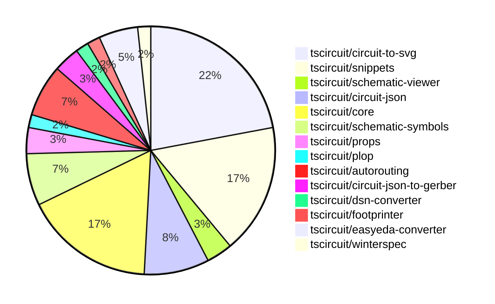

# Contribution Overview 2024-10-23

## PRs by Repository

## Contributor Overview

| Contributor | 🐳 Major | 🐙 Minor | 🐌 Tiny | ⭐ |
|-------------|-------|-------|-------|-------|
| [seveibar](#seveibar) | 13 | 14 | 0 | 👑👑 |
| [imrishabh18](#imrishabh18) | 2 | 13 | 2 | ⭐⭐⭐ |
| [Abse2001](#Abse2001) | 2 | 2 | 0 | ⭐⭐ |
| [andrii-balitskyi](#andrii-balitskyi) | 1 | 3 | 0 | ⭐ |
| [ni9999](#ni9999) | 1 | 2 | 0 | ⭐ |
| [ShiboSoftwareDev](#ShiboSoftwareDev) | 1 | 0 | 0 | ⭐ |
| [aman1376](#aman1376) | 0 | 1 | 0 |  |
| [TSP06](#TSP06) | 0 | 1 | 0 |  |
| [mrudulpatil18](#mrudulpatil18) | 0 | 1 | 0 |  |

## Changes by Repository

### [tscircuit/circuit-to-svg](https://github.com/tscircuit/circuit-to-svg)

| PR # | Impact | Contributor | Description |
|------|--------|-------------|-------------|
| [#96](https://github.com/tscircuit/circuit-to-svg/pull/96) | 🐳 Major | imrishabh18 | Refactor the code to use the `transform` property instead of `viewbox` for creating SVG objects from PCB traces. |
| [#95](https://github.com/tscircuit/circuit-to-svg/pull/95) | 🐳 Major | seveibar | Refactor the Schematic Drawing to rely on the `transform` matrix instead of `viewport` and `flipY`, improving type-safety and simplifying the logic. |
| [#94](https://github.com/tscircuit/circuit-to-svg/pull/94) | 🐳 Major | seveibar | Introduces a new "Labeled Grid" feature that allows for displaying labeled grid cells in the schematic SVG. |
| [#101](https://github.com/tscircuit/circuit-to-svg/pull/101) | 🐙 Minor | imrishabh18 | Hides the ports on the center of the component in the schematic. |
| [#100](https://github.com/tscircuit/circuit-to-svg/pull/100) | 🐙 Minor | imrishabh18 | Fixing a bug related to port position by removing the negative Y-direction scale in the schematic SVG conversion. |
| [#90](https://github.com/tscircuit/circuit-to-svg/pull/90) | 🐙 Minor | imrishabh18 | Revert changes that broke the position of pins |
| [#99](https://github.com/tscircuit/circuit-to-svg/pull/99) | 🐙 Minor | seveibar | Fix the schematic trace rendering by correctly using the Y coordinates. |
| [#98](https://github.com/tscircuit/circuit-to-svg/pull/98) | 🐙 Minor | seveibar | Fixes a bug in the `create-svg-objects-from-sch-debug-object.ts` function by changing the way the coordinates of the SVG elements are calculated. |
| [#97](https://github.com/tscircuit/circuit-to-svg/pull/97) | 🐙 Minor | seveibar | Fix schematic port handling of undefined `pinNumber` and finding `pin_number` for `source_port`. |
| [#93](https://github.com/tscircuit/circuit-to-svg/pull/93) | 🐙 Minor | seveibar | Adds support for drawing a grid and labeled points on the schematic SVG. |
| [#92](https://github.com/tscircuit/circuit-to-svg/pull/92) | 🐙 Minor | seveibar | Implements the "schematic_debug_object" interface to draw debug objects in the schematic representation. |
| [#89](https://github.com/tscircuit/circuit-to-svg/pull/89) | 🐙 Minor | Abse2001 | Updated the version of the "schematic-symbols" dependency from 0.0.79 to 0.0.90. |
| [#102](https://github.com/tscircuit/circuit-to-svg/pull/102) | 🐙 Minor | ni9999 | Update the usage example in the README file to reflect the latest API changes. |

### [tscircuit/snippets](https://github.com/tscircuit/snippets)

| PR # | Impact | Contributor | Description |
|------|--------|-------------|-------------|
| [#131](https://github.com/tscircuit/snippets/pull/131) | 🐳 Major | imrishabh18 | Integrates the schematic viewer into the application. |
| [#125](https://github.com/tscircuit/snippets/pull/125) | 🐳 Major | ni9999 | Implemented a fork functionality on the ViewSnippetHeader component. |
| [#141](https://github.com/tscircuit/snippets/pull/141) | 🐙 Minor | imrishabh18 | Fixes a bug related to the current file change update code |
| [#134](https://github.com/tscircuit/snippets/pull/134) | 🐙 Minor | imrishabh18 | The pull request adds a "manual-edits.json" file to the dropdown menu of the code editor. |
| [#138](https://github.com/tscircuit/snippets/pull/138) | 🐙 Minor | seveibar | Reverts code reload check and adds a test to ensure the snippet loads correctly on the editor page. |
| [#126](https://github.com/tscircuit/snippets/pull/126) | 🐙 Minor | seveibar | Update dependencies for the Pill Holes project |
| [#122](https://github.com/tscircuit/snippets/pull/122) | 🐙 Minor | seveibar | Adds an endpoint to allow users to star a code snippet. |
| [#124](https://github.com/tscircuit/snippets/pull/124) | 🐙 Minor | andrii-balitskyi | Fixes the width of the SearchableSelect options to match the trigger width. |
| [#127](https://github.com/tscircuit/snippets/pull/127) | 🐙 Minor | ni9999 | Adds the ability to download the circuit schematic as an SVG file from the download dropdown menu. |
| [#137](https://github.com/tscircuit/snippets/pull/137) | 🐙 Minor | mrudulpatil18 | Adds snippet type to the URL for copy URL functionality. |

### [tscircuit/schematic-viewer](https://github.com/tscircuit/schematic-viewer)

| PR # | Impact | Contributor | Description |
|------|--------|-------------|-------------|
| [#68](https://github.com/tscircuit/schematic-viewer/pull/68) | 🐙 Minor | imrishabh18 | Port the schematic design to comply with KiCAD standards. |
| [#67](https://github.com/tscircuit/schematic-viewer/pull/67) | 🐙 Minor | imrishabh18 | Fixes port position and formatting with plop |

### [tscircuit/circuit-json](https://github.com/tscircuit/circuit-json)

| PR # | Impact | Contributor | Description |
|------|--------|-------------|-------------|
| [#62](https://github.com/tscircuit/circuit-json/pull/62) | 🐳 Major | seveibar | Adds a script to generate the schematic component overview documentation from the source code. |
| [#65](https://github.com/tscircuit/circuit-json/pull/65) | 🐙 Minor | imrishabh18 | Add a new `color` property to the `schematic_text` schema to allow setting the text color. |
| [#64](https://github.com/tscircuit/circuit-json/pull/64) | 🐙 Minor | seveibar | Add useful meta information, true index, and side of component to schematic_port |
| [#61](https://github.com/tscircuit/circuit-json/pull/61) | 🐙 Minor | seveibar | Introduces a new `schematic_debug_object` type to the project, which includes `schematic_debug_rect` and `schematic_debug_line` subtypes. |
| [#60](https://github.com/tscircuit/circuit-json/pull/60) | 🐙 Minor | Abse2001 | Added support for simple inductors in the `any_source_component` union and exposed the `source_simple_inductor` type in the `index.ts` file. |

### [tscircuit/core](https://github.com/tscircuit/core)

| PR # | Impact | Contributor | Description |
|------|--------|-------------|-------------|
| [#209](https://github.com/tscircuit/core/pull/209) | 🐳 Major | seveibar | Adds a new "renderUntilSettled" method to the Circuit class, which renders the circuit and waits for all asynchronous effects to complete before returning. This is part of a "dirty render phase" implementation. |
| [#198](https://github.com/tscircuit/core/pull/198) | 🐳 Major | seveibar | Add support for pill-shaped plated holes and provide more AI context for tscircuit react props. |
| [#194](https://github.com/tscircuit/core/pull/194) | 🐳 Major | seveibar | Adds schematic debug object rendering, updates to the latest circuit-to-svg library, and switches to the MultilayerAutorouter. |
| [#196](https://github.com/tscircuit/core/pull/196) | 🐳 Major | Abse2001 | Introduced a new `<Inductor>` component. |
| [#211](https://github.com/tscircuit/core/pull/211) | 🐙 Minor | imrishabh18 | Fix to get the ports from the footprint instead of the schematic arrangement. |
| [#206](https://github.com/tscircuit/core/pull/206) | 🐙 Minor | imrishabh18 | Adds missing trace space between the ports and route |
| [#201](https://github.com/tscircuit/core/pull/201) | 🐙 Minor | imrishabh18 | Fixes an issue where the `getPortPositionByPinNumber` function returned an incorrect value for non-existent ports. |
| [#200](https://github.com/tscircuit/core/pull/200) | 🐙 Minor | imrishabh18 | Adds ports as obstacles and updates the routing to work with the new changes. |
| [#199](https://github.com/tscircuit/core/pull/199) | 🐙 Minor | imrishabh18 | Fixes an issue where the port position was not being shifted correctly on the edge of the chip. |
| [#210](https://github.com/tscircuit/core/pull/210) | 🐙 Minor | seveibar | Introduces asynchronous autorouting with support for specifying an autorouting server URL. |

### [tscircuit/schematic-symbols](https://github.com/tscircuit/schematic-symbols)

| PR # | Impact | Contributor | Description |
|------|--------|-------------|-------------|
| [#185](https://github.com/tscircuit/schematic-symbols/pull/185) | 🐳 Major | Abse2001 | Implements SVG Arc support and adds an inductor symbol |
| [#182](https://github.com/tscircuit/schematic-symbols/pull/182) | 🐙 Minor | TSP06 | Added a new ground symbol. |
| [#184](https://github.com/tscircuit/schematic-symbols/pull/184) | 🐌 Tiny | imrishabh18 | Updated lockfile to fix failing npm publish |
| [#183](https://github.com/tscircuit/schematic-symbols/pull/183) | 🐌 Tiny | imrishabh18 | Update .gitignore to ignore .diff.png files |

### [tscircuit/props](https://github.com/tscircuit/props)

| PR # | Impact | Contributor | Description |
|------|--------|-------------|-------------|
| [#67](https://github.com/tscircuit/props/pull/67) | 🐳 Major | seveibar | This pull request adds a comprehensive overview of all the prop types available in the `@tscircuit/props` package, including detailed documentation and example usage. |
| [#66](https://github.com/tscircuit/props/pull/66) | 🐙 Minor | seveibar | Adds support for 'pill' shaped plated holes in the PCB component specification. |

### [tscircuit/plop](https://github.com/tscircuit/plop)

| PR # | Impact | Contributor | Description |
|------|--------|-------------|-------------|
| [#5](https://github.com/tscircuit/plop/pull/5) | 🐳 Major | seveibar | Check for the latest version of the package, add support for remote files to better support AI context summarization. |

### [tscircuit/autorouting](https://github.com/tscircuit/autorouting)

| PR # | Impact | Contributor | Description |
|------|--------|-------------|-------------|
| [#89](https://github.com/tscircuit/autorouting/pull/89) | 🐳 Major | seveibar | Introduces the initial definition of the Autorouting API, including the `/autorouting/solve` endpoint and the `SimpleRouteJson` format. |
| [#85](https://github.com/tscircuit/autorouting/pull/85) | 🐳 Major | seveibar | Switch the deployed application to use NextJS instead of Vite. |
| [#88](https://github.com/tscircuit/autorouting/pull/88) | 🐙 Minor | seveibar | Removes a path loop fix to simplify the output routes. |
| [#84](https://github.com/tscircuit/autorouting/pull/84) | 🐙 Minor | seveibar | Adds a feature to allow pasting SimpleRouteJson on the homepage and converting it to the soup format. |

### [tscircuit/circuit-json-to-gerber](https://github.com/tscircuit/circuit-json-to-gerber)

| PR # | Impact | Contributor | Description |
|------|--------|-------------|-------------|
| [#26](https://github.com/tscircuit/circuit-json-to-gerber/pull/26) | 🐳 Major | seveibar |  |
| [#25](https://github.com/tscircuit/circuit-json-to-gerber/pull/25) | 🐳 Major | seveibar | Adds a new specification for the "Circuit JSON" format, including various types for PCB components and fabrication notes. |

### [tscircuit/dsn-converter](https://github.com/tscircuit/dsn-converter)

| PR # | Impact | Contributor | Description |
|------|--------|-------------|-------------|
| [#8](https://github.com/tscircuit/dsn-converter/pull/8) | 🐳 Major | seveibar | This pull request introduces a major refactor, improves code separation, adds tests, adds build and release workflows, adds stringification, and adds usage examples to the README. |

### [tscircuit/footprinter](https://github.com/tscircuit/footprinter)

| PR # | Impact | Contributor | Description |
|------|--------|-------------|-------------|
| [#72](https://github.com/tscircuit/footprinter/pull/72) | 🐙 Minor | aman1376 | Adds a new circuit element called "lqfp" (Leadless Quad Flat Package) to the project. |

### [tscircuit/easyeda-converter](https://github.com/tscircuit/easyeda-converter)

| PR # | Impact | Contributor | Description |
|------|--------|-------------|-------------|
| [#83](https://github.com/tscircuit/easyeda-converter/pull/83) | 🐳 Major | andrii-balitskyi | Converts oval pads with hole radius to pill-shaped plated holes in a circuit JSON conversion process. |
| [#85](https://github.com/tscircuit/easyeda-converter/pull/85) | 🐙 Minor | andrii-balitskyi | Converting string pin numbers to type number when converting to TSX. |
| [#84](https://github.com/tscircuit/easyeda-converter/pull/84) | 🐙 Minor | andrii-balitskyi | Fix stroke width calculation for tracks and arcs in the EasyEDA to TSCircuit converter. |

### [tscircuit/winterspec](https://github.com/tscircuit/winterspec)

| PR # | Impact | Contributor | Description |
|------|--------|-------------|-------------|
| [#20](https://github.com/tscircuit/winterspec/pull/20) | 🐳 Major | ShiboSoftwareDev | Adds Windows support and a Windows test workflow |

## Changes by Contributor

### [imrishabh18](https://github.com/imrishabh18)

| PR # | Impact | Description |
|------|--------|-------------|
| [#96](https://github.com/tscircuit/circuit-to-svg/pull/96) | 🐳 Major | Refactor the code to use the `transform` property instead of `viewbox` for creating SVG objects from PCB traces. |
| [#131](https://github.com/tscircuit/snippets/pull/131) | 🐳 Major | Integrates the schematic viewer into the application. |
| [#68](https://github.com/tscircuit/schematic-viewer/pull/68) | 🐙 Minor | Port the schematic design to comply with KiCAD standards. |
| [#67](https://github.com/tscircuit/schematic-viewer/pull/67) | 🐙 Minor | Fixes port position and formatting with plop |
| [#65](https://github.com/tscircuit/circuit-json/pull/65) | 🐙 Minor | Add a new `color` property to the `schematic_text` schema to allow setting the text color. |
| [#211](https://github.com/tscircuit/core/pull/211) | 🐙 Minor | Fix to get the ports from the footprint instead of the schematic arrangement. |
| [#206](https://github.com/tscircuit/core/pull/206) | 🐙 Minor | Adds missing trace space between the ports and route |
| [#201](https://github.com/tscircuit/core/pull/201) | 🐙 Minor | Fixes an issue where the `getPortPositionByPinNumber` function returned an incorrect value for non-existent ports. |
| [#200](https://github.com/tscircuit/core/pull/200) | 🐙 Minor | Adds ports as obstacles and updates the routing to work with the new changes. |
| [#199](https://github.com/tscircuit/core/pull/199) | 🐙 Minor | Fixes an issue where the port position was not being shifted correctly on the edge of the chip. |
| [#101](https://github.com/tscircuit/circuit-to-svg/pull/101) | 🐙 Minor | Hides the ports on the center of the component in the schematic. |
| [#100](https://github.com/tscircuit/circuit-to-svg/pull/100) | 🐙 Minor | Fixing a bug related to port position by removing the negative Y-direction scale in the schematic SVG conversion. |
| [#90](https://github.com/tscircuit/circuit-to-svg/pull/90) | 🐙 Minor | Revert changes that broke the position of pins |
| [#141](https://github.com/tscircuit/snippets/pull/141) | 🐙 Minor | Fixes a bug related to the current file change update code |
| [#134](https://github.com/tscircuit/snippets/pull/134) | 🐙 Minor | The pull request adds a "manual-edits.json" file to the dropdown menu of the code editor. |
| [#184](https://github.com/tscircuit/schematic-symbols/pull/184) | 🐌 Tiny | Updated lockfile to fix failing npm publish |
| [#183](https://github.com/tscircuit/schematic-symbols/pull/183) | 🐌 Tiny | Update .gitignore to ignore .diff.png files |

### [seveibar](https://github.com/seveibar)

| PR # | Impact | Description |
|------|--------|-------------|
| [#62](https://github.com/tscircuit/circuit-json/pull/62) | 🐳 Major | Adds a script to generate the schematic component overview documentation from the source code. |
| [#67](https://github.com/tscircuit/props/pull/67) | 🐳 Major | This pull request adds a comprehensive overview of all the prop types available in the `@tscircuit/props` package, including detailed documentation and example usage. |
| [#209](https://github.com/tscircuit/core/pull/209) | 🐳 Major | Adds a new "renderUntilSettled" method to the Circuit class, which renders the circuit and waits for all asynchronous effects to complete before returning. This is part of a "dirty render phase" implementation. |
| [#198](https://github.com/tscircuit/core/pull/198) | 🐳 Major | Add support for pill-shaped plated holes and provide more AI context for tscircuit react props. |
| [#194](https://github.com/tscircuit/core/pull/194) | 🐳 Major | Adds schematic debug object rendering, updates to the latest circuit-to-svg library, and switches to the MultilayerAutorouter. |
| [#5](https://github.com/tscircuit/plop/pull/5) | 🐳 Major | Check for the latest version of the package, add support for remote files to better support AI context summarization. |
| [#95](https://github.com/tscircuit/circuit-to-svg/pull/95) | 🐳 Major | Refactor the Schematic Drawing to rely on the `transform` matrix instead of `viewport` and `flipY`, improving type-safety and simplifying the logic. |
| [#94](https://github.com/tscircuit/circuit-to-svg/pull/94) | 🐳 Major | Introduces a new "Labeled Grid" feature that allows for displaying labeled grid cells in the schematic SVG. |
| [#89](https://github.com/tscircuit/autorouting/pull/89) | 🐳 Major | Introduces the initial definition of the Autorouting API, including the `/autorouting/solve` endpoint and the `SimpleRouteJson` format. |
| [#85](https://github.com/tscircuit/autorouting/pull/85) | 🐳 Major | Switch the deployed application to use NextJS instead of Vite. |
| [#26](https://github.com/tscircuit/circuit-json-to-gerber/pull/26) | 🐳 Major |  |
| [#25](https://github.com/tscircuit/circuit-json-to-gerber/pull/25) | 🐳 Major | Adds a new specification for the "Circuit JSON" format, including various types for PCB components and fabrication notes. |
| [#8](https://github.com/tscircuit/dsn-converter/pull/8) | 🐳 Major | This pull request introduces a major refactor, improves code separation, adds tests, adds build and release workflows, adds stringification, and adds usage examples to the README. |
| [#64](https://github.com/tscircuit/circuit-json/pull/64) | 🐙 Minor | Add useful meta information, true index, and side of component to schematic_port |
| [#61](https://github.com/tscircuit/circuit-json/pull/61) | 🐙 Minor | Introduces a new `schematic_debug_object` type to the project, which includes `schematic_debug_rect` and `schematic_debug_line` subtypes. |
| [#66](https://github.com/tscircuit/props/pull/66) | 🐙 Minor | Adds support for 'pill' shaped plated holes in the PCB component specification. |
| [#210](https://github.com/tscircuit/core/pull/210) | 🐙 Minor | Introduces asynchronous autorouting with support for specifying an autorouting server URL. |
| [#99](https://github.com/tscircuit/circuit-to-svg/pull/99) | 🐙 Minor | Fix the schematic trace rendering by correctly using the Y coordinates. |
| [#98](https://github.com/tscircuit/circuit-to-svg/pull/98) | 🐙 Minor | Fixes a bug in the `create-svg-objects-from-sch-debug-object.ts` function by changing the way the coordinates of the SVG elements are calculated. |
| [#97](https://github.com/tscircuit/circuit-to-svg/pull/97) | 🐙 Minor | Fix schematic port handling of undefined `pinNumber` and finding `pin_number` for `source_port`. |
| [#93](https://github.com/tscircuit/circuit-to-svg/pull/93) | 🐙 Minor | Adds support for drawing a grid and labeled points on the schematic SVG. |
| [#92](https://github.com/tscircuit/circuit-to-svg/pull/92) | 🐙 Minor | Implements the "schematic_debug_object" interface to draw debug objects in the schematic representation. |
| [#88](https://github.com/tscircuit/autorouting/pull/88) | 🐙 Minor | Removes a path loop fix to simplify the output routes. |
| [#84](https://github.com/tscircuit/autorouting/pull/84) | 🐙 Minor | Adds a feature to allow pasting SimpleRouteJson on the homepage and converting it to the soup format. |
| [#138](https://github.com/tscircuit/snippets/pull/138) | 🐙 Minor | Reverts code reload check and adds a test to ensure the snippet loads correctly on the editor page. |
| [#126](https://github.com/tscircuit/snippets/pull/126) | 🐙 Minor | Update dependencies for the Pill Holes project |
| [#122](https://github.com/tscircuit/snippets/pull/122) | 🐙 Minor | Adds an endpoint to allow users to star a code snippet. |

### [Abse2001](https://github.com/Abse2001)

| PR # | Impact | Description |
|------|--------|-------------|
| [#196](https://github.com/tscircuit/core/pull/196) | 🐳 Major | Introduced a new `<Inductor>` component. |
| [#185](https://github.com/tscircuit/schematic-symbols/pull/185) | 🐳 Major | Implements SVG Arc support and adds an inductor symbol |
| [#60](https://github.com/tscircuit/circuit-json/pull/60) | 🐙 Minor | Added support for simple inductors in the `any_source_component` union and exposed the `source_simple_inductor` type in the `index.ts` file. |
| [#89](https://github.com/tscircuit/circuit-to-svg/pull/89) | 🐙 Minor | Updated the version of the "schematic-symbols" dependency from 0.0.79 to 0.0.90. |

### [aman1376](https://github.com/aman1376)

| PR # | Impact | Description |
|------|--------|-------------|
| [#72](https://github.com/tscircuit/footprinter/pull/72) | 🐙 Minor | Adds a new circuit element called "lqfp" (Leadless Quad Flat Package) to the project. |

### [andrii-balitskyi](https://github.com/andrii-balitskyi)

| PR # | Impact | Description |
|------|--------|-------------|
| [#83](https://github.com/tscircuit/easyeda-converter/pull/83) | 🐳 Major | Converts oval pads with hole radius to pill-shaped plated holes in a circuit JSON conversion process. |
| [#85](https://github.com/tscircuit/easyeda-converter/pull/85) | 🐙 Minor | Converting string pin numbers to type number when converting to TSX. |
| [#84](https://github.com/tscircuit/easyeda-converter/pull/84) | 🐙 Minor | Fix stroke width calculation for tracks and arcs in the EasyEDA to TSCircuit converter. |
| [#124](https://github.com/tscircuit/snippets/pull/124) | 🐙 Minor | Fixes the width of the SearchableSelect options to match the trigger width. |

### [ShiboSoftwareDev](https://github.com/ShiboSoftwareDev)

| PR # | Impact | Description |
|------|--------|-------------|
| [#20](https://github.com/tscircuit/winterspec/pull/20) | 🐳 Major | Adds Windows support and a Windows test workflow |

### [ni9999](https://github.com/ni9999)

| PR # | Impact | Description |
|------|--------|-------------|
| [#125](https://github.com/tscircuit/snippets/pull/125) | 🐳 Major | Implemented a fork functionality on the ViewSnippetHeader component. |
| [#102](https://github.com/tscircuit/circuit-to-svg/pull/102) | 🐙 Minor | Update the usage example in the README file to reflect the latest API changes. |
| [#127](https://github.com/tscircuit/snippets/pull/127) | 🐙 Minor | Adds the ability to download the circuit schematic as an SVG file from the download dropdown menu. |

### [TSP06](https://github.com/TSP06)

| PR # | Impact | Description |
|------|--------|-------------|
| [#182](https://github.com/tscircuit/schematic-symbols/pull/182) | 🐙 Minor | Added a new ground symbol. |

### [mrudulpatil18](https://github.com/mrudulpatil18)

| PR # | Impact | Description |
|------|--------|-------------|
| [#137](https://github.com/tscircuit/snippets/pull/137) | 🐙 Minor | Adds snippet type to the URL for copy URL functionality. |

