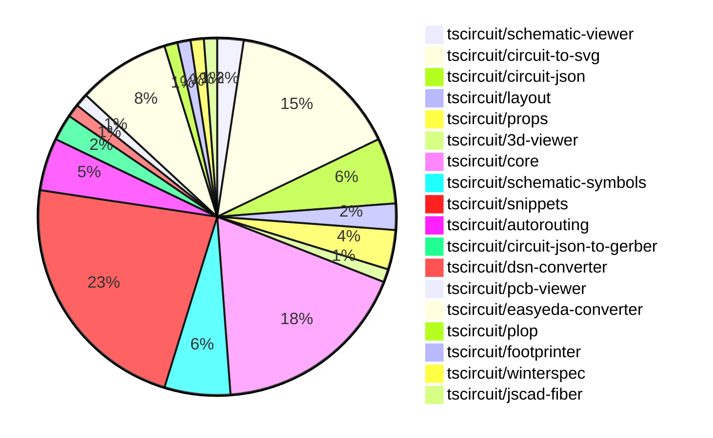

# Contribution Overview 2024-10-23

## PRs by Repository

## Contributor Overview

| Contributor | 🐳 Major | 🐙 Minor | 🐌 Tiny | ⭐ |
|-------------|-------|-------|-------|-------|
| [seveibar](#seveibar) | 16 | 23 | 0 | 👑👑👑 |
| [imrishabh18](#imrishabh18) | 2 | 20 | 1 | ⭐⭐⭐ |
| [andrii-balitskyi](#andrii-balitskyi) | 0 | 7 | 0 | ⭐⭐ |
| [Abse2001](#Abse2001) | 2 | 2 | 0 | ⭐⭐ |
| [ni9999](#ni9999) | 1 | 2 | 0 | ⭐ |
| [aman1376](#aman1376) | 0 | 2 | 0 | ⭐ |
| [ShiboSoftwareDev](#ShiboSoftwareDev) | 1 | 0 | 0 | ⭐ |
| [anas-sarkez](#anas-sarkez) | 1 | 0 | 0 | ⭐ |
| [mrudulpatil18](#mrudulpatil18) | 0 | 2 | 0 | ⭐ |
| [TSP06](#TSP06) | 0 | 1 | 0 |  |
| [SufyaanKhateeb](#SufyaanKhateeb) | 0 | 1 | 0 |  |

## Changes by Repository

### [tscircuit/schematic-viewer](https://github.com/tscircuit/schematic-viewer)

| PR # | Impact | Contributor | Description |
|------|--------|-------------|-------------|
| [#68](https://github.com/tscircuit/schematic-viewer/pull/68) | 🐳 Major | imrishabh18 | Port the schematic design to KiCad. |
| [#67](https://github.com/tscircuit/schematic-viewer/pull/67) | 🐙 Minor | imrishabh18 | The pull request fixes the port position and format using the plop tool. |

### [tscircuit/circuit-to-svg](https://github.com/tscircuit/circuit-to-svg)

| PR # | Impact | Contributor | Description |
|------|--------|-------------|-------------|
| [#96](https://github.com/tscircuit/circuit-to-svg/pull/96) | 🐳 Major | imrishabh18 | Refactoring the code to use the `transform` from `transformation-matrix` instead of `viewbox` for creating SVG objects from PCB traces. |
| [#95](https://github.com/tscircuit/circuit-to-svg/pull/95) | 🐳 Major | seveibar | Refactor the schematic drawing to use transform matrix instead of viewport and `flipY`, leading to major type-safety improvements. |
| [#93](https://github.com/tscircuit/circuit-to-svg/pull/93) | 🐳 Major | seveibar | Adds support for drawing a grid and labeled points in the schematic SVG. |
| [#101](https://github.com/tscircuit/circuit-to-svg/pull/101) | 🐙 Minor | imrishabh18 | Fix to hide the ports on the center of the schematic component |
| [#100](https://github.com/tscircuit/circuit-to-svg/pull/100) | 🐙 Minor | imrishabh18 | Fixes a bug with port position by removing the negative Y direction scale. |
| [#90](https://github.com/tscircuit/circuit-to-svg/pull/90) | 🐙 Minor | imrishabh18 | Reverts a change that broke the position of pins |
| [#99](https://github.com/tscircuit/circuit-to-svg/pull/99) | 🐙 Minor | seveibar | Fixes the Y coordinates of schematic traces to be correctly retrieved from the input data. |
| [#98](https://github.com/tscircuit/circuit-to-svg/pull/98) | 🐙 Minor | seveibar | Fixes issues with the calculation of transformed coordinates for debug objects in the `create-svg-objects-from-sch-debug-object.ts` file. |
| [#97](https://github.com/tscircuit/circuit-to-svg/pull/97) | 🐙 Minor | seveibar | Fix for handling undefined pin numbers and finding pin numbers in schematic port handling. |
| [#94](https://github.com/tscircuit/circuit-to-svg/pull/94) | 🐙 Minor | seveibar | Introduce a new option to the `convert-circuit-json-to-schematic-svg` function to enable labeled grid cells. |
| [#92](https://github.com/tscircuit/circuit-to-svg/pull/92) | 🐙 Minor | seveibar | Introduces a new type called `SchematicDebugObject` and adds the ability to create SVG objects from it. |
| [#89](https://github.com/tscircuit/circuit-to-svg/pull/89) | 🐙 Minor | Abse2001 | Updated the version of the "schematic-symbols" dependency to 0.0.90. |
| [#102](https://github.com/tscircuit/circuit-to-svg/pull/102) | 🐙 Minor | ni9999 | Updates the documentation in the README.md file to reflect changes in the library's API. |

### [tscircuit/circuit-json](https://github.com/tscircuit/circuit-json)

| PR # | Impact | Contributor | Description |
|------|--------|-------------|-------------|
| [#62](https://github.com/tscircuit/circuit-json/pull/62) | 🐳 Major | seveibar | Adds a new script to generate the Schematic Component Overview documentation from the TypeScript source files. |
| [#61](https://github.com/tscircuit/circuit-json/pull/61) | 🐳 Major | seveibar | Introduces a new `schematic_debug_object` feature, which includes two types of debug objects: `schematic_debug_rect` and `schematic_debug_line`. |
| [#65](https://github.com/tscircuit/circuit-json/pull/65) | 🐙 Minor | imrishabh18 | Adds a "color" property to the SchematicTextInput type to set the text color. |
| [#64](https://github.com/tscircuit/circuit-json/pull/64) | 🐙 Minor | seveibar | Adding useful meta information, true index, and side of component to schematic port |
| [#60](https://github.com/tscircuit/circuit-json/pull/60) | 🐙 Minor | Abse2001 | Added export for the `source_simple_inductor` component. |

### [tscircuit/layout](https://github.com/tscircuit/layout)

| PR # | Impact | Contributor | Description |
|------|--------|-------------|-------------|
| [#4](https://github.com/tscircuit/layout/pull/4) | 🐙 Minor | imrishabh18 | Fix types in the `manual-layout-pcb.ts` file. |
| [#3](https://github.com/tscircuit/layout/pull/3) | 🐙 Minor | imrishabh18 | Refactor the code to use the "circuit-json" library instead of the deprecated "@tscircuit/soup" library. |

### [tscircuit/props](https://github.com/tscircuit/props)

| PR # | Impact | Contributor | Description |
|------|--------|-------------|-------------|
| [#67](https://github.com/tscircuit/props/pull/67) | 🐳 Major | seveibar | This pull request adds a comprehensive overview of the prop types available in the `@tscircuit/props` package, including detailed interface definitions and zod validator examples. |
| [#70](https://github.com/tscircuit/props/pull/70) | 🐙 Minor | imrishabh18 | Added "manualEdits" as a new prop to the "BoardProps" and "SubcircuitGroupProps" interfaces. |
| [#66](https://github.com/tscircuit/props/pull/66) | 🐙 Minor | seveibar | Add support for "pill" shape in the `<platedhole>` component |

### [tscircuit/3d-viewer](https://github.com/tscircuit/3d-viewer)

| PR # | Impact | Contributor | Description |
|------|--------|-------------|-------------|
| [#29](https://github.com/tscircuit/3d-viewer/pull/29) | 🐙 Minor | imrishabh18 | Update the dependency `@tscircuit/core` from version `0.0.97` to `0.0.136`. |

### [tscircuit/core](https://github.com/tscircuit/core)

| PR # | Impact | Contributor | Description |
|------|--------|-------------|-------------|
| [#214](https://github.com/tscircuit/core/pull/214) | 🐳 Major | seveibar | Introduces three new hooks: `useChip`, `useResistor`, and `useCapacitor` to create corresponding electronic components in a circuit. |
| [#212](https://github.com/tscircuit/core/pull/212) | 🐳 Major | seveibar | Improves the types for the `createUseComponent` function and the resulting component, allowing for better type inference and support for different pin label formats. |
| [#209](https://github.com/tscircuit/core/pull/209) | 🐳 Major | seveibar | Implements a "dirty render phase" pattern to handle asynchronous effects in the rendering process. |
| [#198](https://github.com/tscircuit/core/pull/198) | 🐳 Major | seveibar | Add support for pill-shaped plated holes and provide more AI context for tscircuit react props |
| [#194](https://github.com/tscircuit/core/pull/194) | 🐳 Major | seveibar | Adds support for rendering schematic debug objects and updates the autorouter used. |
| [#196](https://github.com/tscircuit/core/pull/196) | 🐳 Major | Abse2001 | Implemented the `<Inductor>` component |
| [#211](https://github.com/tscircuit/core/pull/211) | 🐙 Minor | imrishabh18 | Fix the issue of getting the ports from footprint when the schematic port arrangement is not available. |
| [#206](https://github.com/tscircuit/core/pull/206) | 🐙 Minor | imrishabh18 | Adds a trace space between the ports and the routed trace. |
| [#201](https://github.com/tscircuit/core/pull/201) | 🐙 Minor | imrishabh18 | Fix an issue where the `getPortPositionByPinNumber` function was returning an incorrect value for non-existent pins. |
| [#200](https://github.com/tscircuit/core/pull/200) | 🐙 Minor | imrishabh18 | Adds ports as obstacles and improves routing. |
| [#199](https://github.com/tscircuit/core/pull/199) | 🐙 Minor | imrishabh18 | Fixes an issue where the port position was not correctly shifted on the edge of the chip. |
| [#223](https://github.com/tscircuit/core/pull/223) | 🐙 Minor | seveibar | Enable removing path loops in Trace component |
| [#218](https://github.com/tscircuit/core/pull/218) | 🐙 Minor | seveibar | Handles failure to route net islands by rendering an error message instead of throwing a fatal error. |
| [#217](https://github.com/tscircuit/core/pull/217) | 🐙 Minor | seveibar | Introduce a new hook called `useDiode` for creating a diode component. |
| [#210](https://github.com/tscircuit/core/pull/210) | 🐙 Minor | seveibar | Adds support for specifying an autorouting server URL and performing asynchronous autorouting tasks. |

### [tscircuit/schematic-symbols](https://github.com/tscircuit/schematic-symbols)

| PR # | Impact | Contributor | Description |
|------|--------|-------------|-------------|
| [#185](https://github.com/tscircuit/schematic-symbols/pull/185) | 🐳 Major | Abse2001 | Implemented SVG Arc support and added inductor symbol |
| [#184](https://github.com/tscircuit/schematic-symbols/pull/184) | 🐙 Minor | imrishabh18 | Updated the lockfile to fix a failing npm publish. |
| [#187](https://github.com/tscircuit/schematic-symbols/pull/187) | 🐙 Minor | aman1376 | Adds a new SVG symbol for an illuminated push button in a normally open configuration. |
| [#182](https://github.com/tscircuit/schematic-symbols/pull/182) | 🐙 Minor | TSP06 | Added a new ground symbol |
| [#183](https://github.com/tscircuit/schematic-symbols/pull/183) | 🐌 Tiny | imrishabh18 | Updates .gitignore to ignore .diff.png files |

### [tscircuit/snippets](https://github.com/tscircuit/snippets)

| PR # | Impact | Contributor | Description |
|------|--------|-------------|-------------|
| [#122](https://github.com/tscircuit/snippets/pull/122) | 🐳 Major | seveibar | This pull request introduces a new endpoint to add a star to a snippet. |
| [#125](https://github.com/tscircuit/snippets/pull/125) | 🐳 Major | ni9999 | Implemented a fork feature on the ViewSnippetHeader component |
| [#159](https://github.com/tscircuit/snippets/pull/159) | 🐙 Minor | imrishabh18 | Remove button in view page as the view page doesn't need headers. |
| [#143](https://github.com/tscircuit/snippets/pull/143) | 🐙 Minor | imrishabh18 | Updates the position on movement in manual-edits. |
| [#141](https://github.com/tscircuit/snippets/pull/141) | 🐙 Minor | imrishabh18 | Fix for updating the code editor when the current file changes. |
| [#134](https://github.com/tscircuit/snippets/pull/134) | 🐙 Minor | imrishabh18 | Adds a new file "manual-edits.json" to the dropdown in the code editor, in addition to the existing "index.tsx" file. |
| [#131](https://github.com/tscircuit/snippets/pull/131) | 🐙 Minor | imrishabh18 | Integrates the schematic viewer component into the application. |
| [#155](https://github.com/tscircuit/snippets/pull/155) | 🐙 Minor | seveibar | Disable automatic closing bracket insertion in the CodeEditor component. |
| [#154](https://github.com/tscircuit/snippets/pull/154) | 🐙 Minor | seveibar | Fix the issue of "go to definition" removing dashes from import names. |
| [#150](https://github.com/tscircuit/snippets/pull/150) | 🐙 Minor | seveibar | Move Toast to Bottom Right, Fix Sticky Preview, Improve Dropdown Color for CodeEditor files, Add FS Map from CDN to fix some type issues |
| [#149](https://github.com/tscircuit/snippets/pull/149) | 🐙 Minor | seveibar | Fix createUseComponent types, improve toast position, sticky preview, and improve code editor header filename select box color. |
| [#147](https://github.com/tscircuit/snippets/pull/147) | 🐙 Minor | seveibar | Update the easyeda package to version 0.0.62, which fixes the ESP32 import issue, reduces the file header size, improves the Schematic Viewer Height, and adds a Sticky Preview feature. |
| [#138](https://github.com/tscircuit/snippets/pull/138) | 🐙 Minor | seveibar | Fixes the issue with page reload code and adds a test to ensure the snippet loads correctly on the editor page. |
| [#126](https://github.com/tscircuit/snippets/pull/126) | 🐙 Minor | seveibar | Update dependencies for the Pill Holes project |
| [#124](https://github.com/tscircuit/snippets/pull/124) | 🐙 Minor | andrii-balitskyi | Fix the width of the SearchableSelect options dropdown to match the width of the trigger element. |
| [#127](https://github.com/tscircuit/snippets/pull/127) | 🐙 Minor | ni9999 | Add a new option to the download dropdown menu to download the schematic SVG. |
| [#121](https://github.com/tscircuit/snippets/pull/121) | 🐙 Minor | mrudulpatil18 | Rewrites the command palette search logic to use fuzzy search and fix the issue of search results not being shown. |
| [#137](https://github.com/tscircuit/snippets/pull/137) | 🐙 Minor | mrudulpatil18 | Adds the snippet type to the URL when copying the URL for a code snippet. |
| [#144](https://github.com/tscircuit/snippets/pull/144) | 🐙 Minor | SufyaanKhateeb | Fix the profile page header to say "My Profile" when the current user is viewing their profile and fix the "My Profile" link in the footer to show up only when logged in. |

### [tscircuit/autorouting](https://github.com/tscircuit/autorouting)

| PR # | Impact | Contributor | Description |
|------|--------|-------------|-------------|
| [#89](https://github.com/tscircuit/autorouting/pull/89) | 🐳 Major | seveibar | This pull request introduces the initial definition of the Autorouting API, including the `/autorouting/solve` endpoint. |
| [#85](https://github.com/tscircuit/autorouting/pull/85) | 🐳 Major | seveibar | Switch the application to use NextJS for deployment. |
| [#88](https://github.com/tscircuit/autorouting/pull/88) | 🐙 Minor | seveibar | Remove path loop fix to simplify output routes |
| [#84](https://github.com/tscircuit/autorouting/pull/84) | 🐙 Minor | seveibar | Adds the ability to paste SimpleRouteJson on the homepage and converts it to the soup format for rendering and solving. |

### [tscircuit/circuit-json-to-gerber](https://github.com/tscircuit/circuit-json-to-gerber)

| PR # | Impact | Contributor | Description |
|------|--------|-------------|-------------|
| [#26](https://github.com/tscircuit/circuit-json-to-gerber/pull/26) | 🐳 Major | seveibar | Introduce a new CLI tool to convert Circuit JSON files to Gerber/Excellon files. |
| [#25](https://github.com/tscircuit/circuit-json-to-gerber/pull/25) | 🐳 Major | seveibar | Introduces new PCB component types to the Circuit JSON specification. |

### [tscircuit/dsn-converter](https://github.com/tscircuit/dsn-converter)

| PR # | Impact | Contributor | Description |
|------|--------|-------------|-------------|
| [#8](https://github.com/tscircuit/dsn-converter/pull/8) | 🐳 Major | seveibar | The pull request introduces a major refactor, improves code separation, adds tests, build, release, stringification, and README usage examples. |

### [tscircuit/pcb-viewer](https://github.com/tscircuit/pcb-viewer)

| PR # | Impact | Contributor | Description |
|------|--------|-------------|-------------|
| [#79](https://github.com/tscircuit/pcb-viewer/pull/79) | 🐙 Minor | seveibar | Standardize the zIndex values for different overlays in the application. |

### [tscircuit/easyeda-converter](https://github.com/tscircuit/easyeda-converter)

| PR # | Impact | Contributor | Description |
|------|--------|-------------|-------------|
| [#89](https://github.com/tscircuit/easyeda-converter/pull/89) | 🐙 Minor | seveibar | The pull request normalizes the pin labels in the conversion from EasyEDA JSON to TSCircuit Soup JSON. |
| [#94](https://github.com/tscircuit/easyeda-converter/pull/94) | 🐙 Minor | andrii-balitskyi | Correctly parse right-facing (end) pins from raw EasyEDA JSON |
| [#93](https://github.com/tscircuit/easyeda-converter/pull/93) | 🐙 Minor | andrii-balitskyi | Sort pin labels in ascending order |
| [#91](https://github.com/tscircuit/easyeda-converter/pull/91) | 🐙 Minor | andrii-balitskyi | Include duplicate pin name in pin label array, remove pinNames from component template |
| [#85](https://github.com/tscircuit/easyeda-converter/pull/85) | 🐙 Minor | andrii-balitskyi | The pull request converts string pin numbers to type number when converting to TSX. |
| [#83](https://github.com/tscircuit/easyeda-converter/pull/83) | 🐙 Minor | andrii-balitskyi | This pull request converts oval pads with hole radius to pill-shaped plated holes in the EasyEDA to TSCircuit JSON converter. |
| [#84](https://github.com/tscircuit/easyeda-converter/pull/84) | 🐙 Minor | andrii-balitskyi | Fix stroke width calculation for tracks and arcs in the EasyEDA to TSCircuit converter. |

### [tscircuit/plop](https://github.com/tscircuit/plop)

| PR # | Impact | Contributor | Description |
|------|--------|-------------|-------------|
| [#5](https://github.com/tscircuit/plop/pull/5) | 🐙 Minor | seveibar | Adds support for checking the latest version of the package, downloading remote templates, and updating the package if a newer version is available. |

### [tscircuit/footprinter](https://github.com/tscircuit/footprinter)

| PR # | Impact | Contributor | Description |
|------|--------|-------------|-------------|
| [#72](https://github.com/tscircuit/footprinter/pull/72) | 🐙 Minor | aman1376 | Adds a new circuit element called "lqfp" (low-profile quad flat package) to the project. |

### [tscircuit/winterspec](https://github.com/tscircuit/winterspec)

| PR # | Impact | Contributor | Description |
|------|--------|-------------|-------------|
| [#20](https://github.com/tscircuit/winterspec/pull/20) | 🐳 Major | ShiboSoftwareDev | Adds Windows support and a Windows test workflow. |

### [tscircuit/jscad-fiber](https://github.com/tscircuit/jscad-fiber)

| PR # | Impact | Contributor | Description |
|------|--------|-------------|-------------|
| [#86](https://github.com/tscircuit/jscad-fiber/pull/86) | 🐳 Major | anas-sarkez | Refactored `createHostConfig` to better handle array-based subtraction of React elements, improving error handling and type-checking. |

## Changes by Contributor

### [imrishabh18](https://github.com/imrishabh18)

| PR # | Impact | Description |
|------|--------|-------------|
| [#68](https://github.com/tscircuit/schematic-viewer/pull/68) | 🐳 Major | Port the schematic design to KiCad. |
| [#96](https://github.com/tscircuit/circuit-to-svg/pull/96) | 🐳 Major | Refactoring the code to use the `transform` from `transformation-matrix` instead of `viewbox` for creating SVG objects from PCB traces. |
| [#67](https://github.com/tscircuit/schematic-viewer/pull/67) | 🐙 Minor | The pull request fixes the port position and format using the plop tool. |
| [#65](https://github.com/tscircuit/circuit-json/pull/65) | 🐙 Minor | Adds a "color" property to the SchematicTextInput type to set the text color. |
| [#4](https://github.com/tscircuit/layout/pull/4) | 🐙 Minor | Fix types in the `manual-layout-pcb.ts` file. |
| [#3](https://github.com/tscircuit/layout/pull/3) | 🐙 Minor | Refactor the code to use the "circuit-json" library instead of the deprecated "@tscircuit/soup" library. |
| [#70](https://github.com/tscircuit/props/pull/70) | 🐙 Minor | Added "manualEdits" as a new prop to the "BoardProps" and "SubcircuitGroupProps" interfaces. |
| [#29](https://github.com/tscircuit/3d-viewer/pull/29) | 🐙 Minor | Update the dependency `@tscircuit/core` from version `0.0.97` to `0.0.136`. |
| [#211](https://github.com/tscircuit/core/pull/211) | 🐙 Minor | Fix the issue of getting the ports from footprint when the schematic port arrangement is not available. |
| [#206](https://github.com/tscircuit/core/pull/206) | 🐙 Minor | Adds a trace space between the ports and the routed trace. |
| [#201](https://github.com/tscircuit/core/pull/201) | 🐙 Minor | Fix an issue where the `getPortPositionByPinNumber` function was returning an incorrect value for non-existent pins. |
| [#200](https://github.com/tscircuit/core/pull/200) | 🐙 Minor | Adds ports as obstacles and improves routing. |
| [#199](https://github.com/tscircuit/core/pull/199) | 🐙 Minor | Fixes an issue where the port position was not correctly shifted on the edge of the chip. |
| [#101](https://github.com/tscircuit/circuit-to-svg/pull/101) | 🐙 Minor | Fix to hide the ports on the center of the schematic component |
| [#100](https://github.com/tscircuit/circuit-to-svg/pull/100) | 🐙 Minor | Fixes a bug with port position by removing the negative Y direction scale. |
| [#90](https://github.com/tscircuit/circuit-to-svg/pull/90) | 🐙 Minor | Reverts a change that broke the position of pins |
| [#184](https://github.com/tscircuit/schematic-symbols/pull/184) | 🐙 Minor | Updated the lockfile to fix a failing npm publish. |
| [#159](https://github.com/tscircuit/snippets/pull/159) | 🐙 Minor | Remove button in view page as the view page doesn't need headers. |
| [#143](https://github.com/tscircuit/snippets/pull/143) | 🐙 Minor | Updates the position on movement in manual-edits. |
| [#141](https://github.com/tscircuit/snippets/pull/141) | 🐙 Minor | Fix for updating the code editor when the current file changes. |
| [#134](https://github.com/tscircuit/snippets/pull/134) | 🐙 Minor | Adds a new file "manual-edits.json" to the dropdown in the code editor, in addition to the existing "index.tsx" file. |
| [#131](https://github.com/tscircuit/snippets/pull/131) | 🐙 Minor | Integrates the schematic viewer component into the application. |
| [#183](https://github.com/tscircuit/schematic-symbols/pull/183) | 🐌 Tiny | Updates .gitignore to ignore .diff.png files |

### [seveibar](https://github.com/seveibar)

| PR # | Impact | Description |
|------|--------|-------------|
| [#62](https://github.com/tscircuit/circuit-json/pull/62) | 🐳 Major | Adds a new script to generate the Schematic Component Overview documentation from the TypeScript source files. |
| [#61](https://github.com/tscircuit/circuit-json/pull/61) | 🐳 Major | Introduces a new `schematic_debug_object` feature, which includes two types of debug objects: `schematic_debug_rect` and `schematic_debug_line`. |
| [#67](https://github.com/tscircuit/props/pull/67) | 🐳 Major | This pull request adds a comprehensive overview of the prop types available in the `@tscircuit/props` package, including detailed interface definitions and zod validator examples. |
| [#214](https://github.com/tscircuit/core/pull/214) | 🐳 Major | Introduces three new hooks: `useChip`, `useResistor`, and `useCapacitor` to create corresponding electronic components in a circuit. |
| [#212](https://github.com/tscircuit/core/pull/212) | 🐳 Major | Improves the types for the `createUseComponent` function and the resulting component, allowing for better type inference and support for different pin label formats. |
| [#209](https://github.com/tscircuit/core/pull/209) | 🐳 Major | Implements a "dirty render phase" pattern to handle asynchronous effects in the rendering process. |
| [#198](https://github.com/tscircuit/core/pull/198) | 🐳 Major | Add support for pill-shaped plated holes and provide more AI context for tscircuit react props |
| [#194](https://github.com/tscircuit/core/pull/194) | 🐳 Major | Adds support for rendering schematic debug objects and updates the autorouter used. |
| [#95](https://github.com/tscircuit/circuit-to-svg/pull/95) | 🐳 Major | Refactor the schematic drawing to use transform matrix instead of viewport and `flipY`, leading to major type-safety improvements. |
| [#93](https://github.com/tscircuit/circuit-to-svg/pull/93) | 🐳 Major | Adds support for drawing a grid and labeled points in the schematic SVG. |
| [#89](https://github.com/tscircuit/autorouting/pull/89) | 🐳 Major | This pull request introduces the initial definition of the Autorouting API, including the `/autorouting/solve` endpoint. |
| [#85](https://github.com/tscircuit/autorouting/pull/85) | 🐳 Major | Switch the application to use NextJS for deployment. |
| [#26](https://github.com/tscircuit/circuit-json-to-gerber/pull/26) | 🐳 Major | Introduce a new CLI tool to convert Circuit JSON files to Gerber/Excellon files. |
| [#25](https://github.com/tscircuit/circuit-json-to-gerber/pull/25) | 🐳 Major | Introduces new PCB component types to the Circuit JSON specification. |
| [#8](https://github.com/tscircuit/dsn-converter/pull/8) | 🐳 Major | The pull request introduces a major refactor, improves code separation, adds tests, build, release, stringification, and README usage examples. |
| [#122](https://github.com/tscircuit/snippets/pull/122) | 🐳 Major | This pull request introduces a new endpoint to add a star to a snippet. |
| [#79](https://github.com/tscircuit/pcb-viewer/pull/79) | 🐙 Minor | Standardize the zIndex values for different overlays in the application. |
| [#64](https://github.com/tscircuit/circuit-json/pull/64) | 🐙 Minor | Adding useful meta information, true index, and side of component to schematic port |
| [#66](https://github.com/tscircuit/props/pull/66) | 🐙 Minor | Add support for "pill" shape in the `<platedhole>` component |
| [#89](https://github.com/tscircuit/easyeda-converter/pull/89) | 🐙 Minor | The pull request normalizes the pin labels in the conversion from EasyEDA JSON to TSCircuit Soup JSON. |
| [#223](https://github.com/tscircuit/core/pull/223) | 🐙 Minor | Enable removing path loops in Trace component |
| [#218](https://github.com/tscircuit/core/pull/218) | 🐙 Minor | Handles failure to route net islands by rendering an error message instead of throwing a fatal error. |
| [#217](https://github.com/tscircuit/core/pull/217) | 🐙 Minor | Introduce a new hook called `useDiode` for creating a diode component. |
| [#210](https://github.com/tscircuit/core/pull/210) | 🐙 Minor | Adds support for specifying an autorouting server URL and performing asynchronous autorouting tasks. |
| [#5](https://github.com/tscircuit/plop/pull/5) | 🐙 Minor | Adds support for checking the latest version of the package, downloading remote templates, and updating the package if a newer version is available. |
| [#99](https://github.com/tscircuit/circuit-to-svg/pull/99) | 🐙 Minor | Fixes the Y coordinates of schematic traces to be correctly retrieved from the input data. |
| [#98](https://github.com/tscircuit/circuit-to-svg/pull/98) | 🐙 Minor | Fixes issues with the calculation of transformed coordinates for debug objects in the `create-svg-objects-from-sch-debug-object.ts` file. |
| [#97](https://github.com/tscircuit/circuit-to-svg/pull/97) | 🐙 Minor | Fix for handling undefined pin numbers and finding pin numbers in schematic port handling. |
| [#94](https://github.com/tscircuit/circuit-to-svg/pull/94) | 🐙 Minor | Introduce a new option to the `convert-circuit-json-to-schematic-svg` function to enable labeled grid cells. |
| [#92](https://github.com/tscircuit/circuit-to-svg/pull/92) | 🐙 Minor | Introduces a new type called `SchematicDebugObject` and adds the ability to create SVG objects from it. |
| [#88](https://github.com/tscircuit/autorouting/pull/88) | 🐙 Minor | Remove path loop fix to simplify output routes |
| [#84](https://github.com/tscircuit/autorouting/pull/84) | 🐙 Minor | Adds the ability to paste SimpleRouteJson on the homepage and converts it to the soup format for rendering and solving. |
| [#155](https://github.com/tscircuit/snippets/pull/155) | 🐙 Minor | Disable automatic closing bracket insertion in the CodeEditor component. |
| [#154](https://github.com/tscircuit/snippets/pull/154) | 🐙 Minor | Fix the issue of "go to definition" removing dashes from import names. |
| [#150](https://github.com/tscircuit/snippets/pull/150) | 🐙 Minor | Move Toast to Bottom Right, Fix Sticky Preview, Improve Dropdown Color for CodeEditor files, Add FS Map from CDN to fix some type issues |
| [#149](https://github.com/tscircuit/snippets/pull/149) | 🐙 Minor | Fix createUseComponent types, improve toast position, sticky preview, and improve code editor header filename select box color. |
| [#147](https://github.com/tscircuit/snippets/pull/147) | 🐙 Minor | Update the easyeda package to version 0.0.62, which fixes the ESP32 import issue, reduces the file header size, improves the Schematic Viewer Height, and adds a Sticky Preview feature. |
| [#138](https://github.com/tscircuit/snippets/pull/138) | 🐙 Minor | Fixes the issue with page reload code and adds a test to ensure the snippet loads correctly on the editor page. |
| [#126](https://github.com/tscircuit/snippets/pull/126) | 🐙 Minor | Update dependencies for the Pill Holes project |

### [Abse2001](https://github.com/Abse2001)

| PR # | Impact | Description |
|------|--------|-------------|
| [#196](https://github.com/tscircuit/core/pull/196) | 🐳 Major | Implemented the `<Inductor>` component |
| [#185](https://github.com/tscircuit/schematic-symbols/pull/185) | 🐳 Major | Implemented SVG Arc support and added inductor symbol |
| [#60](https://github.com/tscircuit/circuit-json/pull/60) | 🐙 Minor | Added export for the `source_simple_inductor` component. |
| [#89](https://github.com/tscircuit/circuit-to-svg/pull/89) | 🐙 Minor | Updated the version of the "schematic-symbols" dependency to 0.0.90. |

### [aman1376](https://github.com/aman1376)

| PR # | Impact | Description |
|------|--------|-------------|
| [#72](https://github.com/tscircuit/footprinter/pull/72) | 🐙 Minor | Adds a new circuit element called "lqfp" (low-profile quad flat package) to the project. |
| [#187](https://github.com/tscircuit/schematic-symbols/pull/187) | 🐙 Minor | Adds a new SVG symbol for an illuminated push button in a normally open configuration. |

### [andrii-balitskyi](https://github.com/andrii-balitskyi)

| PR # | Impact | Description |
|------|--------|-------------|
| [#94](https://github.com/tscircuit/easyeda-converter/pull/94) | 🐙 Minor | Correctly parse right-facing (end) pins from raw EasyEDA JSON |
| [#93](https://github.com/tscircuit/easyeda-converter/pull/93) | 🐙 Minor | Sort pin labels in ascending order |
| [#91](https://github.com/tscircuit/easyeda-converter/pull/91) | 🐙 Minor | Include duplicate pin name in pin label array, remove pinNames from component template |
| [#85](https://github.com/tscircuit/easyeda-converter/pull/85) | 🐙 Minor | The pull request converts string pin numbers to type number when converting to TSX. |
| [#83](https://github.com/tscircuit/easyeda-converter/pull/83) | 🐙 Minor | This pull request converts oval pads with hole radius to pill-shaped plated holes in the EasyEDA to TSCircuit JSON converter. |
| [#84](https://github.com/tscircuit/easyeda-converter/pull/84) | 🐙 Minor | Fix stroke width calculation for tracks and arcs in the EasyEDA to TSCircuit converter. |
| [#124](https://github.com/tscircuit/snippets/pull/124) | 🐙 Minor | Fix the width of the SearchableSelect options dropdown to match the width of the trigger element. |

### [ShiboSoftwareDev](https://github.com/ShiboSoftwareDev)

| PR # | Impact | Description |
|------|--------|-------------|
| [#20](https://github.com/tscircuit/winterspec/pull/20) | 🐳 Major | Adds Windows support and a Windows test workflow. |

### [anas-sarkez](https://github.com/anas-sarkez)

| PR # | Impact | Description |
|------|--------|-------------|
| [#86](https://github.com/tscircuit/jscad-fiber/pull/86) | 🐳 Major | Refactored `createHostConfig` to better handle array-based subtraction of React elements, improving error handling and type-checking. |

### [ni9999](https://github.com/ni9999)

| PR # | Impact | Description |
|------|--------|-------------|
| [#125](https://github.com/tscircuit/snippets/pull/125) | 🐳 Major | Implemented a fork feature on the ViewSnippetHeader component |
| [#102](https://github.com/tscircuit/circuit-to-svg/pull/102) | 🐙 Minor | Updates the documentation in the README.md file to reflect changes in the library's API. |
| [#127](https://github.com/tscircuit/snippets/pull/127) | 🐙 Minor | Add a new option to the download dropdown menu to download the schematic SVG. |

### [TSP06](https://github.com/TSP06)

| PR # | Impact | Description |
|------|--------|-------------|
| [#182](https://github.com/tscircuit/schematic-symbols/pull/182) | 🐙 Minor | Added a new ground symbol |

### [mrudulpatil18](https://github.com/mrudulpatil18)

| PR # | Impact | Description |
|------|--------|-------------|
| [#121](https://github.com/tscircuit/snippets/pull/121) | 🐙 Minor | Rewrites the command palette search logic to use fuzzy search and fix the issue of search results not being shown. |
| [#137](https://github.com/tscircuit/snippets/pull/137) | 🐙 Minor | Adds the snippet type to the URL when copying the URL for a code snippet. |

### [SufyaanKhateeb](https://github.com/SufyaanKhateeb)

| PR # | Impact | Description |
|------|--------|-------------|
| [#144](https://github.com/tscircuit/snippets/pull/144) | 🐙 Minor | Fix the profile page header to say "My Profile" when the current user is viewing their profile and fix the "My Profile" link in the footer to show up only when logged in. |

