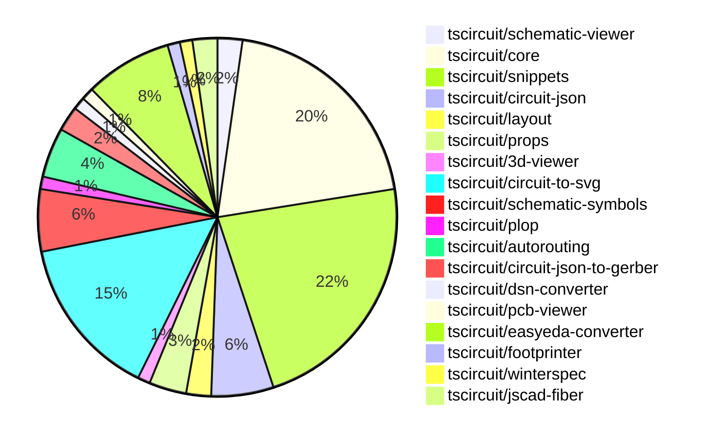

# Contribution Overview 2024-10-23

## PRs by Repository

## Contributor Overview

| Contributor | 🐳 Major | 🐙 Minor | 🐌 Tiny | ⭐ |
|-------------|-------|-------|-------|-------|
| [seveibar](#seveibar) | 12 | 28 | 0 | 👑👑👑 |
| [imrishabh18](#imrishabh18) | 3 | 19 | 3 | 👑 |
| [Abse2001](#Abse2001) | 2 | 2 | 0 | ⭐⭐ |
| [andrii-balitskyi](#andrii-balitskyi) | 0 | 6 | 0 | ⭐⭐ |
| [ni9999](#ni9999) | 1 | 2 | 0 | ⭐ |
| [anas-sarkez](#anas-sarkez) | 1 | 1 | 0 | ⭐ |
| [mrudulpatil18](#mrudulpatil18) | 1 | 1 | 0 | ⭐ |
| [aman1376](#aman1376) | 0 | 2 | 0 | ⭐ |
| [ShiboSoftwareDev](#ShiboSoftwareDev) | 1 | 0 | 0 | ⭐ |
| [TSP06](#TSP06) | 0 | 1 | 0 |  |
| [SufyaanKhateeb](#SufyaanKhateeb) | 0 | 1 | 0 |  |

## Changes by Repository

### [tscircuit/schematic-viewer](https://github.com/tscircuit/schematic-viewer)

| PR # | Impact | Contributor | Description |
|------|--------|-------------|-------------|
| [#68](https://github.com/tscircuit/schematic-viewer/pull/68) | 🐳 Major | imrishabh18 | Ports the design of the schematic viewer to match the KiCad schematic design. |
| [#67](https://github.com/tscircuit/schematic-viewer/pull/67) | 🐙 Minor | imrishabh18 | Fix the port position and format the code using plop. |

### [tscircuit/core](https://github.com/tscircuit/core)

| PR # | Impact | Contributor | Description |
|------|--------|-------------|-------------|
| [#224](https://github.com/tscircuit/core/pull/224) | 🐳 Major | imrishabh18 | Adds support for manual edits in the PrimitiveComponent class, allowing users to specify custom PCB placements for components. |
| [#214](https://github.com/tscircuit/core/pull/214) | 🐳 Major | seveibar | Introduce `useChip`, `useResistor`, and `useCapacitor` hooks to create reusable electronic components. |
| [#209](https://github.com/tscircuit/core/pull/209) | 🐳 Major | seveibar | Implements a "dirty render phase" pattern with support for asynchronous effects in the Circuit component. |
| [#194](https://github.com/tscircuit/core/pull/194) | 🐳 Major | seveibar | Adds support for rendering schematic debug objects, updates the autorouter implementation, and enables schematic debug object rendering in subcircuits. |
| [#196](https://github.com/tscircuit/core/pull/196) | 🐳 Major | Abse2001 | Implemented the `<Inductor>` component |
| [#211](https://github.com/tscircuit/core/pull/211) | 🐙 Minor | imrishabh18 | Fix the pin count calculation for the Chip component by using the ports from the footprint if the schematic port arrangement is not available. |
| [#206](https://github.com/tscircuit/core/pull/206) | 🐙 Minor | imrishabh18 | Adding the missing trace space between the ports and route |
| [#201](https://github.com/tscircuit/core/pull/201) | 🐙 Minor | imrishabh18 | Fix an issue where the port position for a pin was not being calculated correctly. |
| [#200](https://github.com/tscircuit/core/pull/200) | 🐙 Minor | imrishabh18 | Adds ports as obstacles and enables routing to work |
| [#199](https://github.com/tscircuit/core/pull/199) | 🐙 Minor | imrishabh18 | Shifts the port position on the edge of the chip |
| [#227](https://github.com/tscircuit/core/pull/227) | 🐙 Minor | seveibar | Fixes a bug where the center of the PCB component was not updating correctly, causing issues with click and drag functionality. |
| [#223](https://github.com/tscircuit/core/pull/223) | 🐙 Minor | seveibar | Enable removing path loops in the Trace component |
| [#218](https://github.com/tscircuit/core/pull/218) | 🐙 Minor | seveibar | Modify the error handling behavior when net islands fail to route, avoid throwing a fatal error and instead render a more detailed error message. |
| [#217](https://github.com/tscircuit/core/pull/217) | 🐙 Minor | seveibar | Introduces a new hook called `useDiode` for creating diode components |
| [#212](https://github.com/tscircuit/core/pull/212) | 🐙 Minor | seveibar | Improves the types for `createUseComponent` and the `useComponent` hook to accept `pinLabels` in a more native format. |
| [#210](https://github.com/tscircuit/core/pull/210) | 🐙 Minor | seveibar | Introduces asynchronous autorouting support with the ability to specify a server URL, but doesn't yet handle obstacles. |
| [#198](https://github.com/tscircuit/core/pull/198) | 🐙 Minor | seveibar | Add support for pill-shaped plated holes and provide more AI context for TSCircuit React props. |
| [#228](https://github.com/tscircuit/core/pull/228) | 🐌 Tiny | imrishabh18 | Updates the lockfile to the latest versions of dependencies. |

### [tscircuit/snippets](https://github.com/tscircuit/snippets)

| PR # | Impact | Contributor | Description |
|------|--------|-------------|-------------|
| [#131](https://github.com/tscircuit/snippets/pull/131) | 🐳 Major | imrishabh18 | Integrate schematic viewer into the application |
| [#125](https://github.com/tscircuit/snippets/pull/125) | 🐳 Major | ni9999 | Implemented a fork feature on the ViewSnippetHeader component to allow users to fork a snippet. |
| [#121](https://github.com/tscircuit/snippets/pull/121) | 🐳 Major | mrudulpatil18 | Fixes the search filtering issue in the Command palette by rewriting the logic and using Fuzzy search to filter the possible commands. |
| [#159](https://github.com/tscircuit/snippets/pull/159) | 🐙 Minor | imrishabh18 | Removes the button in the view page by setting `showImportAndFormatButtons` to false in the `PreviewContent` component. |
| [#143](https://github.com/tscircuit/snippets/pull/143) | 🐙 Minor | imrishabh18 | Adds a new feature to update the position of elements on movement in manual-edits. |
| [#141](https://github.com/tscircuit/snippets/pull/141) | 🐙 Minor | imrishabh18 | Fix code to update the current file when it changes. |
| [#134](https://github.com/tscircuit/snippets/pull/134) | 🐙 Minor | imrishabh18 | The pull request adds a new file, "manual-edits.json", to the CodeAndPreview component's file management system, allowing for manual edits to the project files. |
| [#162](https://github.com/tscircuit/snippets/pull/162) | 🐙 Minor | seveibar | Adds the ability to pass manual edits as props, refactors the one-way dataflow for manual edits file, and fixes a rendering issue with the PCB viewer. |
| [#155](https://github.com/tscircuit/snippets/pull/155) | 🐙 Minor | seveibar | Disable automatic closing bracket insertion in the code editor. |
| [#154](https://github.com/tscircuit/snippets/pull/154) | 🐙 Minor | seveibar | Fix the regular expression to correctly match import names with dashes in the "go to definition" functionality. |
| [#150](https://github.com/tscircuit/snippets/pull/150) | 🐙 Minor | seveibar | Move Toast to Bottom Right, Fix Sticky Preview, Improve Dropdown Color for CodeEditor files, Add FS Map from CDN to fix some type issues |
| [#149](https://github.com/tscircuit/snippets/pull/149) | 🐙 Minor | seveibar | Fix createUseComponent types, improve toast position, sticky preview, and improve code editor header filename select box color. |
| [#147](https://github.com/tscircuit/snippets/pull/147) | 🐙 Minor | seveibar | Updates the `easyeda` dependency to version `0.0.62` to fix the ESP32 import issue, improve the Schematic Viewer height, and add a sticky preview feature. |
| [#138](https://github.com/tscircuit/snippets/pull/138) | 🐙 Minor | seveibar | Fix for the Snippets Page Load issue, and addition of a new test for the editor page load |
| [#126](https://github.com/tscircuit/snippets/pull/126) | 🐙 Minor | seveibar | Update dependencies for Pill Holes project |
| [#122](https://github.com/tscircuit/snippets/pull/122) | 🐙 Minor | seveibar | Adds an endpoint to allow users to star a code snippet. |
| [#124](https://github.com/tscircuit/snippets/pull/124) | 🐙 Minor | andrii-balitskyi | Fix the width of options in the SearchableSelect component |
| [#127](https://github.com/tscircuit/snippets/pull/127) | 🐙 Minor | ni9999 | Add a new option in the download dropdown menu to download the circuit schematic as an SVG file. |
| [#137](https://github.com/tscircuit/snippets/pull/137) | 🐙 Minor | mrudulpatil18 | Adds snippet type to the URL for copy URL functionality. |
| [#144](https://github.com/tscircuit/snippets/pull/144) | 🐙 Minor | SufyaanKhateeb | Fix the profile page header to say "My Profile" when the current user is viewing their profile and fix the "My Profile" link in the footer to show up only when logged in. |

### [tscircuit/circuit-json](https://github.com/tscircuit/circuit-json)

| PR # | Impact | Contributor | Description |
|------|--------|-------------|-------------|
| [#62](https://github.com/tscircuit/circuit-json/pull/62) | 🐳 Major | seveibar | Adds a new script to generate a Schematic Component Overview documentation file. |
| [#65](https://github.com/tscircuit/circuit-json/pull/65) | 🐙 Minor | imrishabh18 | Add a new color property to the schematic text element |
| [#64](https://github.com/tscircuit/circuit-json/pull/64) | 🐙 Minor | seveibar | Add useful meta information, true index, and side of component to schematic_port |
| [#61](https://github.com/tscircuit/circuit-json/pull/61) | 🐙 Minor | seveibar | Introduces a new schematic debug object feature. |
| [#60](https://github.com/tscircuit/circuit-json/pull/60) | 🐙 Minor | Abse2001 | Adds the `source_simple_inductor` component to the `any_source_component` union and exports it from the `index.ts` file. |

### [tscircuit/layout](https://github.com/tscircuit/layout)

| PR # | Impact | Contributor | Description |
|------|--------|-------------|-------------|
| [#4](https://github.com/tscircuit/layout/pull/4) | 🐙 Minor | imrishabh18 | Fixes type errors in the `manual-layout-pcb.ts` file. |
| [#3](https://github.com/tscircuit/layout/pull/3) | 🐙 Minor | imrishabh18 | Refactor to use circuit-json instead of @tscircuit/soup |

### [tscircuit/props](https://github.com/tscircuit/props)

| PR # | Impact | Contributor | Description |
|------|--------|-------------|-------------|
| [#67](https://github.com/tscircuit/props/pull/67) | 🐳 Major | seveibar | This pull request adds a comprehensive overview of all the prop types available in the `@tscircuit/props` package, including their interfaces and corresponding zod validators. |
| [#70](https://github.com/tscircuit/props/pull/70) | 🐙 Minor | imrishabh18 | Manual edits added as props to the `BoardProps` and `SubcircuitGroupProps` interfaces. |
| [#66](https://github.com/tscircuit/props/pull/66) | 🐙 Minor | seveibar | Adds support for "pill" shaped plated holes. |

### [tscircuit/3d-viewer](https://github.com/tscircuit/3d-viewer)

| PR # | Impact | Contributor | Description |
|------|--------|-------------|-------------|
| [#29](https://github.com/tscircuit/3d-viewer/pull/29) | 🐙 Minor | imrishabh18 | Update dependency "@tscircuit/core" from version 0.0.97 to 0.0.136 |

### [tscircuit/circuit-to-svg](https://github.com/tscircuit/circuit-to-svg)

| PR # | Impact | Contributor | Description |
|------|--------|-------------|-------------|
| [#95](https://github.com/tscircuit/circuit-to-svg/pull/95) | 🐳 Major | seveibar | Refactors the schematic drawing to use transform matrix instead of viewport and flipY, leading to major type-safety improvements. |
| [#92](https://github.com/tscircuit/circuit-to-svg/pull/92) | 🐳 Major | seveibar | Adds support for drawing schematic debug objects (rectangles and lines) in the circuit JSON visualization. |
| [#101](https://github.com/tscircuit/circuit-to-svg/pull/101) | 🐙 Minor | imrishabh18 | Hides the ports on the center of the component |
| [#100](https://github.com/tscircuit/circuit-to-svg/pull/100) | 🐙 Minor | imrishabh18 | Removing the Y direction scale to fix the position of ports in the schematic SVG. |
| [#96](https://github.com/tscircuit/circuit-to-svg/pull/96) | 🐙 Minor | imrishabh18 | Refactors the `createSvgObjectsFromPcbTrace` and `convertCircuitJsonToSchematicSvg` functions to use the `transform` matrix instead of the `viewbox` approach. |
| [#90](https://github.com/tscircuit/circuit-to-svg/pull/90) | 🐙 Minor | imrishabh18 | Reverts a change that broke the position of pins. |
| [#99](https://github.com/tscircuit/circuit-to-svg/pull/99) | 🐙 Minor | seveibar | The pull request fixes a bug in the schematic trace rendering by correctly handling the Y coordinates. |
| [#98](https://github.com/tscircuit/circuit-to-svg/pull/98) | 🐙 Minor | seveibar | Fixes the transformation of debug objects in the SVG rendering process. |
| [#97](https://github.com/tscircuit/circuit-to-svg/pull/97) | 🐙 Minor | seveibar | Fixes issues with schematic port handling, including handling of undefined `pinNumber` and finding the correct pin number. |
| [#94](https://github.com/tscircuit/circuit-to-svg/pull/94) | 🟣 | seveibar | Introduce Labeled Grid |
| [#93](https://github.com/tscircuit/circuit-to-svg/pull/93) | 🐙 Minor | seveibar | Adds support for drawing a grid and labeled points on the schematic SVG. |
| [#89](https://github.com/tscircuit/circuit-to-svg/pull/89) | 🐙 Minor | Abse2001 | Updated the version of the `schematic-symbols` dependency from `^0.0.79` to `^0.0.90`. |
| [#102](https://github.com/tscircuit/circuit-to-svg/pull/102) | 🐙 Minor | ni9999 | Updates the documentation in the readme.md file to reflect the latest API changes. |

### [tscircuit/schematic-symbols](https://github.com/tscircuit/schematic-symbols)

| PR # | Impact | Contributor | Description |
|------|--------|-------------|-------------|
| [#185](https://github.com/tscircuit/schematic-symbols/pull/185) | 🐳 Major | Abse2001 | Implemented SVG Arc support and added an inductor symbol. |
| [#187](https://github.com/tscircuit/schematic-symbols/pull/187) | 🐙 Minor | aman1376 | Add an illuminated push button symbol in a normally open configuration. |
| [#182](https://github.com/tscircuit/schematic-symbols/pull/182) | 🐙 Minor | TSP06 | Added a new ground symbol |
| [#184](https://github.com/tscircuit/schematic-symbols/pull/184) | 🐌 Tiny | imrishabh18 | Updated the lockfile to fix an issue with the npm publish process. |
| [#183](https://github.com/tscircuit/schematic-symbols/pull/183) | 🐌 Tiny | imrishabh18 | Add .diff.png to .gitignore to ignore .diff png files |

### [tscircuit/plop](https://github.com/tscircuit/plop)

| PR # | Impact | Contributor | Description |
|------|--------|-------------|-------------|
| [#5](https://github.com/tscircuit/plop/pull/5) | 🐳 Major | seveibar | Adds support for remote files, checks for the latest version, and switches to the Bun runtime. |

### [tscircuit/autorouting](https://github.com/tscircuit/autorouting)

| PR # | Impact | Contributor | Description |
|------|--------|-------------|-------------|
| [#89](https://github.com/tscircuit/autorouting/pull/89) | 🐳 Major | seveibar |  |
| [#85](https://github.com/tscircuit/autorouting/pull/85) | 🐳 Major | seveibar | Switch the deployed application to use NextJS. |
| [#88](https://github.com/tscircuit/autorouting/pull/88) | 🐙 Minor | seveibar | Remove path loop fix to simplify output routes |
| [#84](https://github.com/tscircuit/autorouting/pull/84) | 🐙 Minor | seveibar | Adds the ability to paste SimpleRouteJson on the homepage and converts it to the soup format for rendering and solving. |

### [tscircuit/circuit-json-to-gerber](https://github.com/tscircuit/circuit-json-to-gerber)

| PR # | Impact | Contributor | Description |
|------|--------|-------------|-------------|
| [#26](https://github.com/tscircuit/circuit-json-to-gerber/pull/26) | 🐳 Major | seveibar |  |
| [#25](https://github.com/tscircuit/circuit-json-to-gerber/pull/25) | 🐙 Minor | seveibar | Adds a new component type called "PcbSilkscreenPill" for representing pill-shaped silkscreen elements on a PCB. |

### [tscircuit/dsn-converter](https://github.com/tscircuit/dsn-converter)

| PR # | Impact | Contributor | Description |
|------|--------|-------------|-------------|
| [#8](https://github.com/tscircuit/dsn-converter/pull/8) | 🐳 Major | seveibar | This pull request introduces a major refactor to the project, improving code separation, adding tests, build and release workflows, string conversion functionality, and usage examples in the README. |

### [tscircuit/pcb-viewer](https://github.com/tscircuit/pcb-viewer)

| PR # | Impact | Contributor | Description |
|------|--------|-------------|-------------|
| [#79](https://github.com/tscircuit/pcb-viewer/pull/79) | 🐙 Minor | seveibar | Standardize the z-index values used across different components by introducing a centralized `zIndexMap`. |

### [tscircuit/easyeda-converter](https://github.com/tscircuit/easyeda-converter)

| PR # | Impact | Contributor | Description |
|------|--------|-------------|-------------|
| [#89](https://github.com/tscircuit/easyeda-converter/pull/89) | 🐙 Minor | seveibar | Normalizes pin labels to preserve the original pin numbers. |
| [#94](https://github.com/tscircuit/easyeda-converter/pull/94) | 🟣 | andrii-balitskyi | Correctly parse right-facing (end) pins from raw EasyEDA JSON. |
| [#93](https://github.com/tscircuit/easyeda-converter/pull/93) | 🐙 Minor | andrii-balitskyi | Sort the pin labels in ascending order based on the numeric part of the pin name. |
| [#91](https://github.com/tscircuit/easyeda-converter/pull/91) | 🐙 Minor | andrii-balitskyi | Include duplicate pin name in pin label array, remove pinNames from component template |
| [#85](https://github.com/tscircuit/easyeda-converter/pull/85) | 🐙 Minor | andrii-balitskyi | Converts string pin numbers to type number when converting to TSX. |
| [#83](https://github.com/tscircuit/easyeda-converter/pull/83) | 🐙 Minor | andrii-balitskyi | Converts oval pads with hole radius to pill-shaped plated holes in the EasyEDA to TSCircuit JSON conversion. |
| [#84](https://github.com/tscircuit/easyeda-converter/pull/84) | 🐙 Minor | andrii-balitskyi | Fix stroke width calculation for tracks and arcs in the EasyEDA to TSCircuit converter. |

### [tscircuit/footprinter](https://github.com/tscircuit/footprinter)

| PR # | Impact | Contributor | Description |
|------|--------|-------------|-------------|
| [#72](https://github.com/tscircuit/footprinter/pull/72) | 🐙 Minor | aman1376 | Adds a new component called `lqfp` to the project. |

### [tscircuit/winterspec](https://github.com/tscircuit/winterspec)

| PR # | Impact | Contributor | Description |
|------|--------|-------------|-------------|
| [#20](https://github.com/tscircuit/winterspec/pull/20) | 🐳 Major | ShiboSoftwareDev | Adds Windows support and a new Windows test workflow. |

### [tscircuit/jscad-fiber](https://github.com/tscircuit/jscad-fiber)

| PR # | Impact | Contributor | Description |
|------|--------|-------------|-------------|
| [#86](https://github.com/tscircuit/jscad-fiber/pull/86) | 🐳 Major | anas-sarkez | Refactored `createHostConfig` to support array-based subtraction of React elements, improving error handling and type-checking. |
| [#87](https://github.com/tscircuit/jscad-fiber/pull/87) | 🐙 Minor | anas-sarkez | Fixed type errors in `createInstance` function calls. |

## Changes by Contributor

### [imrishabh18](https://github.com/imrishabh18)

| PR # | Impact | Description |
|------|--------|-------------|
| [#68](https://github.com/tscircuit/schematic-viewer/pull/68) | 🐳 Major | Ports the design of the schematic viewer to match the KiCad schematic design. |
| [#224](https://github.com/tscircuit/core/pull/224) | 🐳 Major | Adds support for manual edits in the PrimitiveComponent class, allowing users to specify custom PCB placements for components. |
| [#131](https://github.com/tscircuit/snippets/pull/131) | 🐳 Major | Integrate schematic viewer into the application |
| [#67](https://github.com/tscircuit/schematic-viewer/pull/67) | 🐙 Minor | Fix the port position and format the code using plop. |
| [#65](https://github.com/tscircuit/circuit-json/pull/65) | 🐙 Minor | Add a new color property to the schematic text element |
| [#4](https://github.com/tscircuit/layout/pull/4) | 🐙 Minor | Fixes type errors in the `manual-layout-pcb.ts` file. |
| [#3](https://github.com/tscircuit/layout/pull/3) | 🐙 Minor | Refactor to use circuit-json instead of @tscircuit/soup |
| [#70](https://github.com/tscircuit/props/pull/70) | 🐙 Minor | Manual edits added as props to the `BoardProps` and `SubcircuitGroupProps` interfaces. |
| [#29](https://github.com/tscircuit/3d-viewer/pull/29) | 🐙 Minor | Update dependency "@tscircuit/core" from version 0.0.97 to 0.0.136 |
| [#211](https://github.com/tscircuit/core/pull/211) | 🐙 Minor | Fix the pin count calculation for the Chip component by using the ports from the footprint if the schematic port arrangement is not available. |
| [#206](https://github.com/tscircuit/core/pull/206) | 🐙 Minor | Adding the missing trace space between the ports and route |
| [#201](https://github.com/tscircuit/core/pull/201) | 🐙 Minor | Fix an issue where the port position for a pin was not being calculated correctly. |
| [#200](https://github.com/tscircuit/core/pull/200) | 🐙 Minor | Adds ports as obstacles and enables routing to work |
| [#199](https://github.com/tscircuit/core/pull/199) | 🐙 Minor | Shifts the port position on the edge of the chip |
| [#101](https://github.com/tscircuit/circuit-to-svg/pull/101) | 🐙 Minor | Hides the ports on the center of the component |
| [#100](https://github.com/tscircuit/circuit-to-svg/pull/100) | 🐙 Minor | Removing the Y direction scale to fix the position of ports in the schematic SVG. |
| [#96](https://github.com/tscircuit/circuit-to-svg/pull/96) | 🐙 Minor | Refactors the `createSvgObjectsFromPcbTrace` and `convertCircuitJsonToSchematicSvg` functions to use the `transform` matrix instead of the `viewbox` approach. |
| [#90](https://github.com/tscircuit/circuit-to-svg/pull/90) | 🐙 Minor | Reverts a change that broke the position of pins. |
| [#159](https://github.com/tscircuit/snippets/pull/159) | 🐙 Minor | Removes the button in the view page by setting `showImportAndFormatButtons` to false in the `PreviewContent` component. |
| [#143](https://github.com/tscircuit/snippets/pull/143) | 🐙 Minor | Adds a new feature to update the position of elements on movement in manual-edits. |
| [#141](https://github.com/tscircuit/snippets/pull/141) | 🐙 Minor | Fix code to update the current file when it changes. |
| [#134](https://github.com/tscircuit/snippets/pull/134) | 🐙 Minor | The pull request adds a new file, "manual-edits.json", to the CodeAndPreview component's file management system, allowing for manual edits to the project files. |
| [#228](https://github.com/tscircuit/core/pull/228) | 🐌 Tiny | Updates the lockfile to the latest versions of dependencies. |
| [#184](https://github.com/tscircuit/schematic-symbols/pull/184) | 🐌 Tiny | Updated the lockfile to fix an issue with the npm publish process. |
| [#183](https://github.com/tscircuit/schematic-symbols/pull/183) | 🐌 Tiny | Add .diff.png to .gitignore to ignore .diff png files |

### [seveibar](https://github.com/seveibar)

| PR # | Impact | Description |
|------|--------|-------------|
| [#62](https://github.com/tscircuit/circuit-json/pull/62) | 🐳 Major | Adds a new script to generate a Schematic Component Overview documentation file. |
| [#67](https://github.com/tscircuit/props/pull/67) | 🐳 Major | This pull request adds a comprehensive overview of all the prop types available in the `@tscircuit/props` package, including their interfaces and corresponding zod validators. |
| [#214](https://github.com/tscircuit/core/pull/214) | 🐳 Major | Introduce `useChip`, `useResistor`, and `useCapacitor` hooks to create reusable electronic components. |
| [#209](https://github.com/tscircuit/core/pull/209) | 🐳 Major | Implements a "dirty render phase" pattern with support for asynchronous effects in the Circuit component. |
| [#194](https://github.com/tscircuit/core/pull/194) | 🐳 Major | Adds support for rendering schematic debug objects, updates the autorouter implementation, and enables schematic debug object rendering in subcircuits. |
| [#5](https://github.com/tscircuit/plop/pull/5) | 🐳 Major | Adds support for remote files, checks for the latest version, and switches to the Bun runtime. |
| [#95](https://github.com/tscircuit/circuit-to-svg/pull/95) | 🐳 Major | Refactors the schematic drawing to use transform matrix instead of viewport and flipY, leading to major type-safety improvements. |
| [#92](https://github.com/tscircuit/circuit-to-svg/pull/92) | 🐳 Major | Adds support for drawing schematic debug objects (rectangles and lines) in the circuit JSON visualization. |
| [#89](https://github.com/tscircuit/autorouting/pull/89) | 🐳 Major |  |
| [#85](https://github.com/tscircuit/autorouting/pull/85) | 🐳 Major | Switch the deployed application to use NextJS. |
| [#26](https://github.com/tscircuit/circuit-json-to-gerber/pull/26) | 🐳 Major |  |
| [#8](https://github.com/tscircuit/dsn-converter/pull/8) | 🐳 Major | This pull request introduces a major refactor to the project, improving code separation, adding tests, build and release workflows, string conversion functionality, and usage examples in the README. |
| [#79](https://github.com/tscircuit/pcb-viewer/pull/79) | 🐙 Minor | Standardize the z-index values used across different components by introducing a centralized `zIndexMap`. |
| [#64](https://github.com/tscircuit/circuit-json/pull/64) | 🐙 Minor | Add useful meta information, true index, and side of component to schematic_port |
| [#61](https://github.com/tscircuit/circuit-json/pull/61) | 🐙 Minor | Introduces a new schematic debug object feature. |
| [#66](https://github.com/tscircuit/props/pull/66) | 🐙 Minor | Adds support for "pill" shaped plated holes. |
| [#89](https://github.com/tscircuit/easyeda-converter/pull/89) | 🐙 Minor | Normalizes pin labels to preserve the original pin numbers. |
| [#227](https://github.com/tscircuit/core/pull/227) | 🐙 Minor | Fixes a bug where the center of the PCB component was not updating correctly, causing issues with click and drag functionality. |
| [#223](https://github.com/tscircuit/core/pull/223) | 🐙 Minor | Enable removing path loops in the Trace component |
| [#218](https://github.com/tscircuit/core/pull/218) | 🐙 Minor | Modify the error handling behavior when net islands fail to route, avoid throwing a fatal error and instead render a more detailed error message. |
| [#217](https://github.com/tscircuit/core/pull/217) | 🐙 Minor | Introduces a new hook called `useDiode` for creating diode components |
| [#212](https://github.com/tscircuit/core/pull/212) | 🐙 Minor | Improves the types for `createUseComponent` and the `useComponent` hook to accept `pinLabels` in a more native format. |
| [#210](https://github.com/tscircuit/core/pull/210) | 🐙 Minor | Introduces asynchronous autorouting support with the ability to specify a server URL, but doesn't yet handle obstacles. |
| [#198](https://github.com/tscircuit/core/pull/198) | 🐙 Minor | Add support for pill-shaped plated holes and provide more AI context for TSCircuit React props. |
| [#99](https://github.com/tscircuit/circuit-to-svg/pull/99) | 🐙 Minor | The pull request fixes a bug in the schematic trace rendering by correctly handling the Y coordinates. |
| [#98](https://github.com/tscircuit/circuit-to-svg/pull/98) | 🐙 Minor | Fixes the transformation of debug objects in the SVG rendering process. |
| [#97](https://github.com/tscircuit/circuit-to-svg/pull/97) | 🐙 Minor | Fixes issues with schematic port handling, including handling of undefined `pinNumber` and finding the correct pin number. |
| [#94](https://github.com/tscircuit/circuit-to-svg/pull/94) | 🟣 | Introduce Labeled Grid |
| [#93](https://github.com/tscircuit/circuit-to-svg/pull/93) | 🐙 Minor | Adds support for drawing a grid and labeled points on the schematic SVG. |
| [#88](https://github.com/tscircuit/autorouting/pull/88) | 🐙 Minor | Remove path loop fix to simplify output routes |
| [#84](https://github.com/tscircuit/autorouting/pull/84) | 🐙 Minor | Adds the ability to paste SimpleRouteJson on the homepage and converts it to the soup format for rendering and solving. |
| [#25](https://github.com/tscircuit/circuit-json-to-gerber/pull/25) | 🐙 Minor | Adds a new component type called "PcbSilkscreenPill" for representing pill-shaped silkscreen elements on a PCB. |
| [#162](https://github.com/tscircuit/snippets/pull/162) | 🐙 Minor | Adds the ability to pass manual edits as props, refactors the one-way dataflow for manual edits file, and fixes a rendering issue with the PCB viewer. |
| [#155](https://github.com/tscircuit/snippets/pull/155) | 🐙 Minor | Disable automatic closing bracket insertion in the code editor. |
| [#154](https://github.com/tscircuit/snippets/pull/154) | 🐙 Minor | Fix the regular expression to correctly match import names with dashes in the "go to definition" functionality. |
| [#150](https://github.com/tscircuit/snippets/pull/150) | 🐙 Minor | Move Toast to Bottom Right, Fix Sticky Preview, Improve Dropdown Color for CodeEditor files, Add FS Map from CDN to fix some type issues |
| [#149](https://github.com/tscircuit/snippets/pull/149) | 🐙 Minor | Fix createUseComponent types, improve toast position, sticky preview, and improve code editor header filename select box color. |
| [#147](https://github.com/tscircuit/snippets/pull/147) | 🐙 Minor | Updates the `easyeda` dependency to version `0.0.62` to fix the ESP32 import issue, improve the Schematic Viewer height, and add a sticky preview feature. |
| [#138](https://github.com/tscircuit/snippets/pull/138) | 🐙 Minor | Fix for the Snippets Page Load issue, and addition of a new test for the editor page load |
| [#126](https://github.com/tscircuit/snippets/pull/126) | 🐙 Minor | Update dependencies for Pill Holes project |
| [#122](https://github.com/tscircuit/snippets/pull/122) | 🐙 Minor | Adds an endpoint to allow users to star a code snippet. |

### [Abse2001](https://github.com/Abse2001)

| PR # | Impact | Description |
|------|--------|-------------|
| [#196](https://github.com/tscircuit/core/pull/196) | 🐳 Major | Implemented the `<Inductor>` component |
| [#185](https://github.com/tscircuit/schematic-symbols/pull/185) | 🐳 Major | Implemented SVG Arc support and added an inductor symbol. |
| [#60](https://github.com/tscircuit/circuit-json/pull/60) | 🐙 Minor | Adds the `source_simple_inductor` component to the `any_source_component` union and exports it from the `index.ts` file. |
| [#89](https://github.com/tscircuit/circuit-to-svg/pull/89) | 🐙 Minor | Updated the version of the `schematic-symbols` dependency from `^0.0.79` to `^0.0.90`. |

### [aman1376](https://github.com/aman1376)

| PR # | Impact | Description |
|------|--------|-------------|
| [#72](https://github.com/tscircuit/footprinter/pull/72) | 🐙 Minor | Adds a new component called `lqfp` to the project. |
| [#187](https://github.com/tscircuit/schematic-symbols/pull/187) | 🐙 Minor | Add an illuminated push button symbol in a normally open configuration. |

### [andrii-balitskyi](https://github.com/andrii-balitskyi)

| PR # | Impact | Description |
|------|--------|-------------|
| [#94](https://github.com/tscircuit/easyeda-converter/pull/94) | 🟣 | Correctly parse right-facing (end) pins from raw EasyEDA JSON. |
| [#93](https://github.com/tscircuit/easyeda-converter/pull/93) | 🐙 Minor | Sort the pin labels in ascending order based on the numeric part of the pin name. |
| [#91](https://github.com/tscircuit/easyeda-converter/pull/91) | 🐙 Minor | Include duplicate pin name in pin label array, remove pinNames from component template |
| [#85](https://github.com/tscircuit/easyeda-converter/pull/85) | 🐙 Minor | Converts string pin numbers to type number when converting to TSX. |
| [#83](https://github.com/tscircuit/easyeda-converter/pull/83) | 🐙 Minor | Converts oval pads with hole radius to pill-shaped plated holes in the EasyEDA to TSCircuit JSON conversion. |
| [#84](https://github.com/tscircuit/easyeda-converter/pull/84) | 🐙 Minor | Fix stroke width calculation for tracks and arcs in the EasyEDA to TSCircuit converter. |
| [#124](https://github.com/tscircuit/snippets/pull/124) | 🐙 Minor | Fix the width of options in the SearchableSelect component |

### [ShiboSoftwareDev](https://github.com/ShiboSoftwareDev)

| PR # | Impact | Description |
|------|--------|-------------|
| [#20](https://github.com/tscircuit/winterspec/pull/20) | 🐳 Major | Adds Windows support and a new Windows test workflow. |

### [anas-sarkez](https://github.com/anas-sarkez)

| PR # | Impact | Description |
|------|--------|-------------|
| [#86](https://github.com/tscircuit/jscad-fiber/pull/86) | 🐳 Major | Refactored `createHostConfig` to support array-based subtraction of React elements, improving error handling and type-checking. |
| [#87](https://github.com/tscircuit/jscad-fiber/pull/87) | 🐙 Minor | Fixed type errors in `createInstance` function calls. |

### [ni9999](https://github.com/ni9999)

| PR # | Impact | Description |
|------|--------|-------------|
| [#125](https://github.com/tscircuit/snippets/pull/125) | 🐳 Major | Implemented a fork feature on the ViewSnippetHeader component to allow users to fork a snippet. |
| [#102](https://github.com/tscircuit/circuit-to-svg/pull/102) | 🐙 Minor | Updates the documentation in the readme.md file to reflect the latest API changes. |
| [#127](https://github.com/tscircuit/snippets/pull/127) | 🐙 Minor | Add a new option in the download dropdown menu to download the circuit schematic as an SVG file. |

### [TSP06](https://github.com/TSP06)

| PR # | Impact | Description |
|------|--------|-------------|
| [#182](https://github.com/tscircuit/schematic-symbols/pull/182) | 🐙 Minor | Added a new ground symbol |

### [mrudulpatil18](https://github.com/mrudulpatil18)

| PR # | Impact | Description |
|------|--------|-------------|
| [#121](https://github.com/tscircuit/snippets/pull/121) | 🐳 Major | Fixes the search filtering issue in the Command palette by rewriting the logic and using Fuzzy search to filter the possible commands. |
| [#137](https://github.com/tscircuit/snippets/pull/137) | 🐙 Minor | Adds snippet type to the URL for copy URL functionality. |

### [SufyaanKhateeb](https://github.com/SufyaanKhateeb)

| PR # | Impact | Description |
|------|--------|-------------|
| [#144](https://github.com/tscircuit/snippets/pull/144) | 🐙 Minor | Fix the profile page header to say "My Profile" when the current user is viewing their profile and fix the "My Profile" link in the footer to show up only when logged in. |

