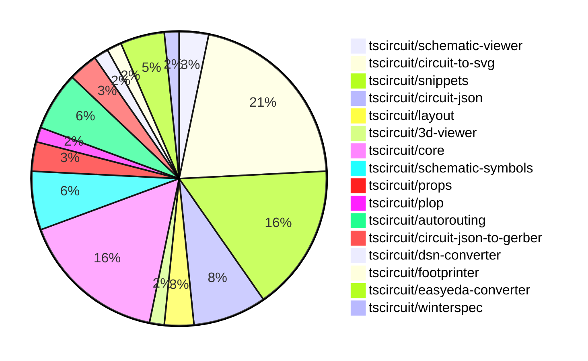

# Contribution Overview 2024-10-23

## PRs by Repository

## Contributor Overview

| Contributor | 🐳 Major | 🐙 Minor | 🐌 Tiny | ⭐ |
|-------------|-------|-------|-------|-------|
| [seveibar](#seveibar) | 13 | 14 | 0 | 👑👑 |
| [imrishabh18](#imrishabh18) | 3 | 16 | 1 | ⭐⭐⭐ |
| [Abse2001](#Abse2001) | 2 | 2 | 0 | ⭐⭐ |
| [andrii-balitskyi](#andrii-balitskyi) | 1 | 3 | 0 | ⭐ |
| [ni9999](#ni9999) | 1 | 2 | 0 | ⭐ |
| [aman1376](#aman1376) | 0 | 1 | 0 |  |
| [ShiboSoftwareDev](#ShiboSoftwareDev) | 0 | 1 | 0 |  |
| [TSP06](#TSP06) | 0 | 1 | 0 |  |
| [mrudulpatil18](#mrudulpatil18) | 0 | 1 | 0 |  |

## Changes by Repository

### [tscircuit/schematic-viewer](https://github.com/tscircuit/schematic-viewer)

| PR # | Impact | Contributor | Description |
|------|--------|-------------|-------------|
| [#68](https://github.com/tscircuit/schematic-viewer/pull/68) | 🐳 Major | imrishabh18 | Ports the schematic design from the schematic-viewer to the KiCAD format. |
| [#67](https://github.com/tscircuit/schematic-viewer/pull/67) | 🐙 Minor | imrishabh18 | Fix port position and format with plop |

### [tscircuit/circuit-to-svg](https://github.com/tscircuit/circuit-to-svg)

| PR # | Impact | Contributor | Description |
|------|--------|-------------|-------------|
| [#96](https://github.com/tscircuit/circuit-to-svg/pull/96) | 🐳 Major | imrishabh18 | Refactors the code to use `transform` instead of `viewbox` for creating SVG objects from PCB traces. |
| [#95](https://github.com/tscircuit/circuit-to-svg/pull/95) | 🐳 Major | seveibar | Refactor Schematic Drawing for Easier Transforms, Major Type-Safety Improvements (Part 1) |
| [#93](https://github.com/tscircuit/circuit-to-svg/pull/93) | 🐳 Major | seveibar | The pull request adds support for drawing a grid and labeled points on the schematic SVG. |
| [#101](https://github.com/tscircuit/circuit-to-svg/pull/101) | 🐙 Minor | imrishabh18 | Hide the ports on the center of the component |
| [#100](https://github.com/tscircuit/circuit-to-svg/pull/100) | 🐙 Minor | imrishabh18 | Removing the scaling in the Y direction to fix port position |
| [#90](https://github.com/tscircuit/circuit-to-svg/pull/90) | 🐙 Minor | imrishabh18 | Revert a change that broke the position of pins. |
| [#99](https://github.com/tscircuit/circuit-to-svg/pull/99) | 🐙 Minor | seveibar | Fix the trace Y coordinates in the schematic SVG generation |
| [#98](https://github.com/tscircuit/circuit-to-svg/pull/98) | 🐙 Minor | seveibar | This pull request fixes a bug in the `create-svg-objects-from-sch-debug-object.ts` file, where the transformation of the debug object's coordinates was not correctly handling the Y-axis flip. |
| [#97](https://github.com/tscircuit/circuit-to-svg/pull/97) | 🐙 Minor | seveibar | Fixes schematic port handling of undefined `pinNumber` and finding pin number. |
| [#94](https://github.com/tscircuit/circuit-to-svg/pull/94) | 🐙 Minor | seveibar | Introduce a new option to the `convert-circuit-json-to-schematic-svg` function to enable labeled grid cells. |
| [#92](https://github.com/tscircuit/circuit-to-svg/pull/92) | 🐙 Minor | seveibar | Adds support for drawing schematic debug objects (rectangles and lines) in the Circuit JSON to SVG conversion process. |
| [#89](https://github.com/tscircuit/circuit-to-svg/pull/89) | 🐙 Minor | Abse2001 | Update the dependency "schematic-symbols" from version 0.0.79 to 0.0.90. |
| [#102](https://github.com/tscircuit/circuit-to-svg/pull/102) | 🐙 Minor | ni9999 | Update the outdated usage codes in the readme file. |

### [tscircuit/snippets](https://github.com/tscircuit/snippets)

| PR # | Impact | Contributor | Description |
|------|--------|-------------|-------------|
| [#131](https://github.com/tscircuit/snippets/pull/131) | 🐳 Major | imrishabh18 | Integrate the schematic viewer into the preview content component. |
| [#125](https://github.com/tscircuit/snippets/pull/125) | 🐳 Major | ni9999 | Implemented a fork functionality for the ViewSnippetHeader component. |
| [#141](https://github.com/tscircuit/snippets/pull/141) | 🐙 Minor | imrishabh18 | Fix the code to update the file change when the current file changes. |
| [#134](https://github.com/tscircuit/snippets/pull/134) | 🐙 Minor | imrishabh18 | Adds the manual-edits.json file to the dropdown in the CodeEditor component. |
| [#138](https://github.com/tscircuit/snippets/pull/138) | 🐙 Minor | seveibar | Fixes a bug with snippet loading on the editor page and adds a test to ensure the snippet loads correctly. |
| [#126](https://github.com/tscircuit/snippets/pull/126) | 🐙 Minor | seveibar | Update dependencies for Pill Holes project |
| [#122](https://github.com/tscircuit/snippets/pull/122) | 🐙 Minor | seveibar | Adds a new endpoint to allow users to star a snippet. |
| [#124](https://github.com/tscircuit/snippets/pull/124) | 🐙 Minor | andrii-balitskyi | Fixes the width of the SearchableSelect component's options dropdown to match the width of the trigger button. |
| [#127](https://github.com/tscircuit/snippets/pull/127) | 🐙 Minor | ni9999 | Adds a new menu item in the download dropdown to download the circuit schematic as an SVG file. |
| [#137](https://github.com/tscircuit/snippets/pull/137) | 🐙 Minor | mrudulpatil18 | Adds a snippet type parameter to the URL for copy URL functionality. |

### [tscircuit/circuit-json](https://github.com/tscircuit/circuit-json)

| PR # | Impact | Contributor | Description |
|------|--------|-------------|-------------|
| [#65](https://github.com/tscircuit/circuit-json/pull/65) | 🐙 Minor | imrishabh18 | Adds a color property to the SchematicTextInput type. |
| [#64](https://github.com/tscircuit/circuit-json/pull/64) | 🐙 Minor | seveibar | Add useful meta information, true index, side of component etc. to schematic_port |
| [#62](https://github.com/tscircuit/circuit-json/pull/62) | 🐙 Minor | seveibar | This pull request adds a new script to generate a Schematic Component Overview document based on the type definitions in the project's source code. |
| [#61](https://github.com/tscircuit/circuit-json/pull/61) | 🐙 Minor | seveibar | Introduces a schematic debug object to the codebase, which includes support for rectangular and line-based debug objects. |
| [#60](https://github.com/tscircuit/circuit-json/pull/60) | 🐙 Minor | Abse2001 | Added export for source_simple_inductor |

### [tscircuit/layout](https://github.com/tscircuit/layout)

| PR # | Impact | Contributor | Description |
|------|--------|-------------|-------------|
| [#4](https://github.com/tscircuit/layout/pull/4) | 🐙 Minor | imrishabh18 | Fixes type errors in the `manual-layout-pcb.ts` file. |
| [#3](https://github.com/tscircuit/layout/pull/3) | 🐙 Minor | imrishabh18 | Refactor the code to use the "circuit-json" library instead of "@tscircuit/soup" |

### [tscircuit/3d-viewer](https://github.com/tscircuit/3d-viewer)

| PR # | Impact | Contributor | Description |
|------|--------|-------------|-------------|
| [#29](https://github.com/tscircuit/3d-viewer/pull/29) | 🐙 Minor | imrishabh18 | Update the "@tscircuit/core" dependency from version 0.0.97 to 0.0.136. |

### [tscircuit/core](https://github.com/tscircuit/core)

| PR # | Impact | Contributor | Description |
|------|--------|-------------|-------------|
| [#210](https://github.com/tscircuit/core/pull/210) | 🐳 Major | seveibar | Adds support for specifying an autorouting server URL and asynchronous autorouting tasks in rendering, laying the groundwork for integrating freerouting into tscircuit. |
| [#209](https://github.com/tscircuit/core/pull/209) | 🐳 Major | seveibar | Adds a "renderUntilSettled" method to the Circuit class to render the circuit until all async effects are complete, and introduces a dirty tracking mechanism for render phases in the Renderable component. |
| [#198](https://github.com/tscircuit/core/pull/198) | 🐳 Major | seveibar | Adds support for pill-shaped plated holes and provides more AI context for tscircuit React props. |
| [#194](https://github.com/tscircuit/core/pull/194) | 🐳 Major | seveibar | Adds support for rendering schematic debug objects in the circuit-to-svg library, allows enabling/disabling schematic debug objects in subcircuits, and switches from IJumpAutorouter to MultilayerAutorouter. |
| [#196](https://github.com/tscircuit/core/pull/196) | 🐳 Major | Abse2001 | Implemented the `<Inductor>` component |
| [#211](https://github.com/tscircuit/core/pull/211) | 🐙 Minor | imrishabh18 | Fix the pin count calculation to get the ports from the footprint when the schematic port arrangement is not defined. |
| [#206](https://github.com/tscircuit/core/pull/206) | 🐙 Minor | imrishabh18 | Adds missing trace space between the ports and route. |
| [#201](https://github.com/tscircuit/core/pull/201) | 🐙 Minor | imrishabh18 | Fix undefined pin skip in the `getAllDimensionsForSchematicBox` function |
| [#200](https://github.com/tscircuit/core/pull/200) | 🐙 Minor | imrishabh18 | Adds ports as obstacles and enables routing to work. |
| [#199](https://github.com/tscircuit/core/pull/199) | 🐙 Minor | imrishabh18 | Fixes the shifting of port position on the edge of the chip |

### [tscircuit/schematic-symbols](https://github.com/tscircuit/schematic-symbols)

| PR # | Impact | Contributor | Description |
|------|--------|-------------|-------------|
| [#185](https://github.com/tscircuit/schematic-symbols/pull/185) | 🐳 Major | Abse2001 | Implemented SVG Arc support and added an inductor symbol |
| [#184](https://github.com/tscircuit/schematic-symbols/pull/184) | 🐙 Minor | imrishabh18 | Updated the lockfile to fix a failing npm publish process. |
| [#182](https://github.com/tscircuit/schematic-symbols/pull/182) | 🐙 Minor | TSP06 | Added a new ground symbol |
| [#183](https://github.com/tscircuit/schematic-symbols/pull/183) | 🐌 Tiny | imrishabh18 | Update .gitignore to ignore .diff.png files |

### [tscircuit/props](https://github.com/tscircuit/props)

| PR # | Impact | Contributor | Description |
|------|--------|-------------|-------------|
| [#67](https://github.com/tscircuit/props/pull/67) | 🐳 Major | seveibar | This pull request adds a comprehensive overview of the available prop types in the @tscircuit/props package, including detailed documentation and examples. |
| [#66](https://github.com/tscircuit/props/pull/66) | 🐙 Minor | seveibar | Adds support for a new 'pill' shape for plated holes in the PCB component specification. |

### [tscircuit/plop](https://github.com/tscircuit/plop)

| PR # | Impact | Contributor | Description |
|------|--------|-------------|-------------|
| [#5](https://github.com/tscircuit/plop/pull/5) | 🐳 Major | seveibar | Adds support for checking the latest version of the package and updating if a newer version is available, as well as support for remote template files. |

### [tscircuit/autorouting](https://github.com/tscircuit/autorouting)

| PR # | Impact | Contributor | Description |
|------|--------|-------------|-------------|
| [#89](https://github.com/tscircuit/autorouting/pull/89) | 🐳 Major | seveibar |  |
| [#85](https://github.com/tscircuit/autorouting/pull/85) | 🐳 Major | seveibar | Switch the application to use NextJS for deployment. |
| [#88](https://github.com/tscircuit/autorouting/pull/88) | 🐙 Minor | seveibar | Remove path loop fix to simplify output routes |
| [#84](https://github.com/tscircuit/autorouting/pull/84) | 🐙 Minor | seveibar | Allow pasting SimpleRouteJson on homepage |

### [tscircuit/circuit-json-to-gerber](https://github.com/tscircuit/circuit-json-to-gerber)

| PR # | Impact | Contributor | Description |
|------|--------|-------------|-------------|
| [#26](https://github.com/tscircuit/circuit-json-to-gerber/pull/26) | 🐳 Major | seveibar |  |
| [#25](https://github.com/tscircuit/circuit-json-to-gerber/pull/25) | 🐳 Major | seveibar | Adds a new specification for the Circuit JSON format, including various PCB components and their definitions. |

### [tscircuit/dsn-converter](https://github.com/tscircuit/dsn-converter)

| PR # | Impact | Contributor | Description |
|------|--------|-------------|-------------|
| [#8](https://github.com/tscircuit/dsn-converter/pull/8) | 🐳 Major | seveibar | Introduces a major refactor to improve code separation, add tests, build, release, stringification, and usage examples in the README. |

### [tscircuit/footprinter](https://github.com/tscircuit/footprinter)

| PR # | Impact | Contributor | Description |
|------|--------|-------------|-------------|
| [#72](https://github.com/tscircuit/footprinter/pull/72) | 🐙 Minor | aman1376 | Adds a new circuit element called "lqfp" to the project. |

### [tscircuit/easyeda-converter](https://github.com/tscircuit/easyeda-converter)

| PR # | Impact | Contributor | Description |
|------|--------|-------------|-------------|
| [#83](https://github.com/tscircuit/easyeda-converter/pull/83) | 🐳 Major | andrii-balitskyi | Convert oval pads with hole radius to pill-shaped plated holes |
| [#85](https://github.com/tscircuit/easyeda-converter/pull/85) | 🐙 Minor | andrii-balitskyi | Converts string pin numbers to type number when converting to TSX. |
| [#84](https://github.com/tscircuit/easyeda-converter/pull/84) | 🐙 Minor | andrii-balitskyi | Fixes the calculation of stroke width for tracks and arcs in the PCB conversion process. |

### [tscircuit/winterspec](https://github.com/tscircuit/winterspec)

| PR # | Impact | Contributor | Description |
|------|--------|-------------|-------------|
| [#20](https://github.com/tscircuit/winterspec/pull/20) | 🐙 Minor | ShiboSoftwareDev | Adds Windows support, including a new Windows test workflow, and fixes issues for Linux/Mac. |

## Changes by Contributor

### [imrishabh18](https://github.com/imrishabh18)

| PR # | Impact | Description |
|------|--------|-------------|
| [#68](https://github.com/tscircuit/schematic-viewer/pull/68) | 🐳 Major | Ports the schematic design from the schematic-viewer to the KiCAD format. |
| [#96](https://github.com/tscircuit/circuit-to-svg/pull/96) | 🐳 Major | Refactors the code to use `transform` instead of `viewbox` for creating SVG objects from PCB traces. |
| [#131](https://github.com/tscircuit/snippets/pull/131) | 🐳 Major | Integrate the schematic viewer into the preview content component. |
| [#67](https://github.com/tscircuit/schematic-viewer/pull/67) | 🐙 Minor | Fix port position and format with plop |
| [#65](https://github.com/tscircuit/circuit-json/pull/65) | 🐙 Minor | Adds a color property to the SchematicTextInput type. |
| [#4](https://github.com/tscircuit/layout/pull/4) | 🐙 Minor | Fixes type errors in the `manual-layout-pcb.ts` file. |
| [#3](https://github.com/tscircuit/layout/pull/3) | 🐙 Minor | Refactor the code to use the "circuit-json" library instead of "@tscircuit/soup" |
| [#29](https://github.com/tscircuit/3d-viewer/pull/29) | 🐙 Minor | Update the "@tscircuit/core" dependency from version 0.0.97 to 0.0.136. |
| [#211](https://github.com/tscircuit/core/pull/211) | 🐙 Minor | Fix the pin count calculation to get the ports from the footprint when the schematic port arrangement is not defined. |
| [#206](https://github.com/tscircuit/core/pull/206) | 🐙 Minor | Adds missing trace space between the ports and route. |
| [#201](https://github.com/tscircuit/core/pull/201) | 🐙 Minor | Fix undefined pin skip in the `getAllDimensionsForSchematicBox` function |
| [#200](https://github.com/tscircuit/core/pull/200) | 🐙 Minor | Adds ports as obstacles and enables routing to work. |
| [#199](https://github.com/tscircuit/core/pull/199) | 🐙 Minor | Fixes the shifting of port position on the edge of the chip |
| [#101](https://github.com/tscircuit/circuit-to-svg/pull/101) | 🐙 Minor | Hide the ports on the center of the component |
| [#100](https://github.com/tscircuit/circuit-to-svg/pull/100) | 🐙 Minor | Removing the scaling in the Y direction to fix port position |
| [#90](https://github.com/tscircuit/circuit-to-svg/pull/90) | 🐙 Minor | Revert a change that broke the position of pins. |
| [#184](https://github.com/tscircuit/schematic-symbols/pull/184) | 🐙 Minor | Updated the lockfile to fix a failing npm publish process. |
| [#141](https://github.com/tscircuit/snippets/pull/141) | 🐙 Minor | Fix the code to update the file change when the current file changes. |
| [#134](https://github.com/tscircuit/snippets/pull/134) | 🐙 Minor | Adds the manual-edits.json file to the dropdown in the CodeEditor component. |
| [#183](https://github.com/tscircuit/schematic-symbols/pull/183) | 🐌 Tiny | Update .gitignore to ignore .diff.png files |

### [seveibar](https://github.com/seveibar)

| PR # | Impact | Description |
|------|--------|-------------|
| [#67](https://github.com/tscircuit/props/pull/67) | 🐳 Major | This pull request adds a comprehensive overview of the available prop types in the @tscircuit/props package, including detailed documentation and examples. |
| [#210](https://github.com/tscircuit/core/pull/210) | 🐳 Major | Adds support for specifying an autorouting server URL and asynchronous autorouting tasks in rendering, laying the groundwork for integrating freerouting into tscircuit. |
| [#209](https://github.com/tscircuit/core/pull/209) | 🐳 Major | Adds a "renderUntilSettled" method to the Circuit class to render the circuit until all async effects are complete, and introduces a dirty tracking mechanism for render phases in the Renderable component. |
| [#198](https://github.com/tscircuit/core/pull/198) | 🐳 Major | Adds support for pill-shaped plated holes and provides more AI context for tscircuit React props. |
| [#194](https://github.com/tscircuit/core/pull/194) | 🐳 Major | Adds support for rendering schematic debug objects in the circuit-to-svg library, allows enabling/disabling schematic debug objects in subcircuits, and switches from IJumpAutorouter to MultilayerAutorouter. |
| [#5](https://github.com/tscircuit/plop/pull/5) | 🐳 Major | Adds support for checking the latest version of the package and updating if a newer version is available, as well as support for remote template files. |
| [#95](https://github.com/tscircuit/circuit-to-svg/pull/95) | 🐳 Major | Refactor Schematic Drawing for Easier Transforms, Major Type-Safety Improvements (Part 1) |
| [#93](https://github.com/tscircuit/circuit-to-svg/pull/93) | 🐳 Major | The pull request adds support for drawing a grid and labeled points on the schematic SVG. |
| [#89](https://github.com/tscircuit/autorouting/pull/89) | 🐳 Major |  |
| [#85](https://github.com/tscircuit/autorouting/pull/85) | 🐳 Major | Switch the application to use NextJS for deployment. |
| [#26](https://github.com/tscircuit/circuit-json-to-gerber/pull/26) | 🐳 Major |  |
| [#25](https://github.com/tscircuit/circuit-json-to-gerber/pull/25) | 🐳 Major | Adds a new specification for the Circuit JSON format, including various PCB components and their definitions. |
| [#8](https://github.com/tscircuit/dsn-converter/pull/8) | 🐳 Major | Introduces a major refactor to improve code separation, add tests, build, release, stringification, and usage examples in the README. |
| [#64](https://github.com/tscircuit/circuit-json/pull/64) | 🐙 Minor | Add useful meta information, true index, side of component etc. to schematic_port |
| [#62](https://github.com/tscircuit/circuit-json/pull/62) | 🐙 Minor | This pull request adds a new script to generate a Schematic Component Overview document based on the type definitions in the project's source code. |
| [#61](https://github.com/tscircuit/circuit-json/pull/61) | 🐙 Minor | Introduces a schematic debug object to the codebase, which includes support for rectangular and line-based debug objects. |
| [#66](https://github.com/tscircuit/props/pull/66) | 🐙 Minor | Adds support for a new 'pill' shape for plated holes in the PCB component specification. |
| [#99](https://github.com/tscircuit/circuit-to-svg/pull/99) | 🐙 Minor | Fix the trace Y coordinates in the schematic SVG generation |
| [#98](https://github.com/tscircuit/circuit-to-svg/pull/98) | 🐙 Minor | This pull request fixes a bug in the `create-svg-objects-from-sch-debug-object.ts` file, where the transformation of the debug object's coordinates was not correctly handling the Y-axis flip. |
| [#97](https://github.com/tscircuit/circuit-to-svg/pull/97) | 🐙 Minor | Fixes schematic port handling of undefined `pinNumber` and finding pin number. |
| [#94](https://github.com/tscircuit/circuit-to-svg/pull/94) | 🐙 Minor | Introduce a new option to the `convert-circuit-json-to-schematic-svg` function to enable labeled grid cells. |
| [#92](https://github.com/tscircuit/circuit-to-svg/pull/92) | 🐙 Minor | Adds support for drawing schematic debug objects (rectangles and lines) in the Circuit JSON to SVG conversion process. |
| [#88](https://github.com/tscircuit/autorouting/pull/88) | 🐙 Minor | Remove path loop fix to simplify output routes |
| [#84](https://github.com/tscircuit/autorouting/pull/84) | 🐙 Minor | Allow pasting SimpleRouteJson on homepage |
| [#138](https://github.com/tscircuit/snippets/pull/138) | 🐙 Minor | Fixes a bug with snippet loading on the editor page and adds a test to ensure the snippet loads correctly. |
| [#126](https://github.com/tscircuit/snippets/pull/126) | 🐙 Minor | Update dependencies for Pill Holes project |
| [#122](https://github.com/tscircuit/snippets/pull/122) | 🐙 Minor | Adds a new endpoint to allow users to star a snippet. |

### [Abse2001](https://github.com/Abse2001)

| PR # | Impact | Description |
|------|--------|-------------|
| [#196](https://github.com/tscircuit/core/pull/196) | 🐳 Major | Implemented the `<Inductor>` component |
| [#185](https://github.com/tscircuit/schematic-symbols/pull/185) | 🐳 Major | Implemented SVG Arc support and added an inductor symbol |
| [#60](https://github.com/tscircuit/circuit-json/pull/60) | 🐙 Minor | Added export for source_simple_inductor |
| [#89](https://github.com/tscircuit/circuit-to-svg/pull/89) | 🐙 Minor | Update the dependency "schematic-symbols" from version 0.0.79 to 0.0.90. |

### [aman1376](https://github.com/aman1376)

| PR # | Impact | Description |
|------|--------|-------------|
| [#72](https://github.com/tscircuit/footprinter/pull/72) | 🐙 Minor | Adds a new circuit element called "lqfp" to the project. |

### [andrii-balitskyi](https://github.com/andrii-balitskyi)

| PR # | Impact | Description |
|------|--------|-------------|
| [#83](https://github.com/tscircuit/easyeda-converter/pull/83) | 🐳 Major | Convert oval pads with hole radius to pill-shaped plated holes |
| [#85](https://github.com/tscircuit/easyeda-converter/pull/85) | 🐙 Minor | Converts string pin numbers to type number when converting to TSX. |
| [#84](https://github.com/tscircuit/easyeda-converter/pull/84) | 🐙 Minor | Fixes the calculation of stroke width for tracks and arcs in the PCB conversion process. |
| [#124](https://github.com/tscircuit/snippets/pull/124) | 🐙 Minor | Fixes the width of the SearchableSelect component's options dropdown to match the width of the trigger button. |

### [ShiboSoftwareDev](https://github.com/ShiboSoftwareDev)

| PR # | Impact | Description |
|------|--------|-------------|
| [#20](https://github.com/tscircuit/winterspec/pull/20) | 🐙 Minor | Adds Windows support, including a new Windows test workflow, and fixes issues for Linux/Mac. |

### [ni9999](https://github.com/ni9999)

| PR # | Impact | Description |
|------|--------|-------------|
| [#125](https://github.com/tscircuit/snippets/pull/125) | 🐳 Major | Implemented a fork functionality for the ViewSnippetHeader component. |
| [#102](https://github.com/tscircuit/circuit-to-svg/pull/102) | 🐙 Minor | Update the outdated usage codes in the readme file. |
| [#127](https://github.com/tscircuit/snippets/pull/127) | 🐙 Minor | Adds a new menu item in the download dropdown to download the circuit schematic as an SVG file. |

### [TSP06](https://github.com/TSP06)

| PR # | Impact | Description |
|------|--------|-------------|
| [#182](https://github.com/tscircuit/schematic-symbols/pull/182) | 🐙 Minor | Added a new ground symbol |

### [mrudulpatil18](https://github.com/mrudulpatil18)

| PR # | Impact | Description |
|------|--------|-------------|
| [#137](https://github.com/tscircuit/snippets/pull/137) | 🐙 Minor | Adds a snippet type parameter to the URL for copy URL functionality. |

