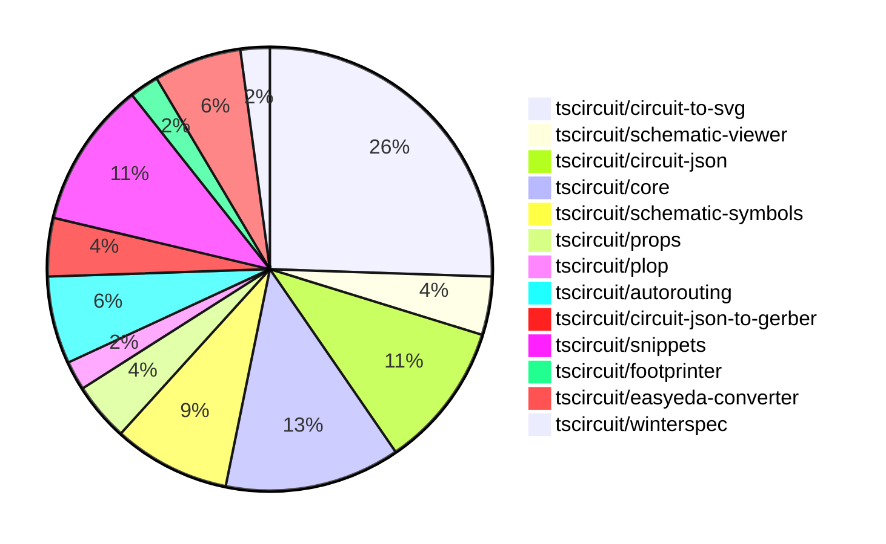

# Contribution Overview 2024-10-23

## PRs by Repository

## Contributor Overview

| Contributor | 🐳 Major | 🐙 Minor | 🐌 Tiny | ⭐ |
|-------------|-------|-------|-------|-------|
| [seveibar](#seveibar) | 8 | 14 | 0 | 👑 |
| [imrishabh18](#imrishabh18) | 1 | 9 | 2 | ⭐⭐ |
| [Abse2001](#Abse2001) | 2 | 1 | 1 | ⭐⭐ |
| [andrii-balitskyi](#andrii-balitskyi) | 0 | 4 | 0 | ⭐ |
| [ni9999](#ni9999) | 1 | 1 | 0 | ⭐ |
| [ShiboSoftwareDev](#ShiboSoftwareDev) | 1 | 0 | 0 | ⭐ |
| [aman1376](#aman1376) | 0 | 1 | 0 |  |
| [TSP06](#TSP06) | 0 | 1 | 0 |  |

## Changes by Repository

### [tscircuit/circuit-to-svg](https://github.com/tscircuit/circuit-to-svg)

| PR # | Impact | Contributor | Description |
|------|--------|-------------|-------------|
| [#96](https://github.com/tscircuit/circuit-to-svg/pull/96) | 🐳 Major | imrishabh18 | Refactors the creation of SVG objects from PCB traces by switching from using a "viewbox" to using a "transform" matrix. |
| [#95](https://github.com/tscircuit/circuit-to-svg/pull/95) | 🐳 Major | seveibar | Refactors the schematic drawing code to remove usage of viewport and `flipY`, and relies on the `transform` matrix for computing all positions. |
| [#94](https://github.com/tscircuit/circuit-to-svg/pull/94) | 🐳 Major | seveibar | Introduces a new feature to add labeled grid to the schematic SVG generation. |
| [#101](https://github.com/tscircuit/circuit-to-svg/pull/101) | 🐙 Minor | imrishabh18 | Hide the ports on the center of the component |
| [#100](https://github.com/tscircuit/circuit-to-svg/pull/100) | 🐙 Minor | imrishabh18 | Removing the Y direction scale to fix port position. |
| [#90](https://github.com/tscircuit/circuit-to-svg/pull/90) | 🐙 Minor | imrishabh18 | Reverts a change that broke the position of pins in the schematic |
| [#99](https://github.com/tscircuit/circuit-to-svg/pull/99) | 🐙 Minor | seveibar | Fix the schematic trace by adjusting the X coordinates to correctly position the trace. |
| [#98](https://github.com/tscircuit/circuit-to-svg/pull/98) | 🐙 Minor | seveibar | Fixes the calculation of the transformed coordinates for the debug objects in the SVG rendering. |
| [#97](https://github.com/tscircuit/circuit-to-svg/pull/97) | 🐙 Minor | seveibar | Fixes the handling of undefined `pinNumber` and finding the pin number for schematic ports. |
| [#93](https://github.com/tscircuit/circuit-to-svg/pull/93) | 🐙 Minor | seveibar | Adds support for drawing a grid and labeled points on the schematic SVG |
| [#92](https://github.com/tscircuit/circuit-to-svg/pull/92) | 🐙 Minor | seveibar | Adds support for drawing schematic debug objects (rectangles and lines) in the circuit JSON visualization. |
| [#89](https://github.com/tscircuit/circuit-to-svg/pull/89) | 🐌 Tiny | Abse2001 | Updated the version of the "schematic-symbols" dependency from 0.0.79 to 0.0.90. |

### [tscircuit/schematic-viewer](https://github.com/tscircuit/schematic-viewer)

| PR # | Impact | Contributor | Description |
|------|--------|-------------|-------------|
| [#68](https://github.com/tscircuit/schematic-viewer/pull/68) | 🐙 Minor | imrishabh18 | The pull request fixes the port design according to KiCAD and updates the schematic viewer to display the changes. |
| [#67](https://github.com/tscircuit/schematic-viewer/pull/67) | 🐙 Minor | imrishabh18 | Fixes port position and format with Plop |

### [tscircuit/circuit-json](https://github.com/tscircuit/circuit-json)

| PR # | Impact | Contributor | Description |
|------|--------|-------------|-------------|
| [#65](https://github.com/tscircuit/circuit-json/pull/65) | 🐙 Minor | imrishabh18 | Add color property for schematic text |
| [#64](https://github.com/tscircuit/circuit-json/pull/64) | 🐙 Minor | seveibar | Add useful meta information, true index, side of component etc. to `schematic_port` |
| [#62](https://github.com/tscircuit/circuit-json/pull/62) | 🐙 Minor | seveibar | This pull request adds a script to generate a Schematic Component Overview documentation file for the Circuit JSON specification. |
| [#61](https://github.com/tscircuit/circuit-json/pull/61) | 🐙 Minor | seveibar | Introduces a new schematic debug object for representing debug information in schematics. |
| [#60](https://github.com/tscircuit/circuit-json/pull/60) | 🐙 Minor | Abse2001 | Fixed the export of the `source_simple_inductor` component. |

### [tscircuit/core](https://github.com/tscircuit/core)

| PR # | Impact | Contributor | Description |
|------|--------|-------------|-------------|
| [#194](https://github.com/tscircuit/core/pull/194) | 🐳 Major | seveibar | Adds support for schematic debug objects, allows drawing debugging boxes in subcircuits, and switches to the MultilayerAutorouter for improved routing. |
| [#196](https://github.com/tscircuit/core/pull/196) | 🐳 Major | Abse2001 | Implemented the `<Inductor>` component |
| [#201](https://github.com/tscircuit/core/pull/201) | 🐙 Minor | imrishabh18 | Fixes an issue where the `getPortPositionByPinNumber` function in the `getAllDimensionsForSchematicBox` utility could return an incorrect position for non-existent ports. |
| [#200](https://github.com/tscircuit/core/pull/200) | 🐙 Minor | imrishabh18 | Adds ports as obstacles and enables routing to work |
| [#199](https://github.com/tscircuit/core/pull/199) | 🐙 Minor | imrishabh18 | Fixes the shifting of port positions on the edge of the chip. |
| [#198](https://github.com/tscircuit/core/pull/198) | 🐙 Minor | seveibar | Adds support for pill-shaped plated holes and provides more AI context for `tscircuit` React props. |

### [tscircuit/schematic-symbols](https://github.com/tscircuit/schematic-symbols)

| PR # | Impact | Contributor | Description |
|------|--------|-------------|-------------|
| [#185](https://github.com/tscircuit/schematic-symbols/pull/185) | 🐳 Major | Abse2001 | Implemented SVG Arc support and added an inductor symbol |
| [#182](https://github.com/tscircuit/schematic-symbols/pull/182) | 🐙 Minor | TSP06 | Added a new ground symbol |
| [#184](https://github.com/tscircuit/schematic-symbols/pull/184) | 🐌 Tiny | imrishabh18 | Updates the package lock file to fix a failing npm publish. |
| [#183](https://github.com/tscircuit/schematic-symbols/pull/183) | 🐌 Tiny | imrishabh18 | Add .diff.png to .gitignore |

### [tscircuit/props](https://github.com/tscircuit/props)

| PR # | Impact | Contributor | Description |
|------|--------|-------------|-------------|
| [#67](https://github.com/tscircuit/props/pull/67) | 🐳 Major | seveibar | This pull request adds an overview of all the prop types available in the `@tscircuit/props` package, including their corresponding Zod validators and detailed type definitions. |
| [#66](https://github.com/tscircuit/props/pull/66) | 🐙 Minor | seveibar | Introduces support for a new `<platedhole>` component with a "pill" shape. |

### [tscircuit/plop](https://github.com/tscircuit/plop)

| PR # | Impact | Contributor | Description |
|------|--------|-------------|-------------|
| [#5](https://github.com/tscircuit/plop/pull/5) | 🐳 Major | seveibar | Adds support for checking the latest version of the package and downloading remote templates for better support of AI context summarization. |

### [tscircuit/autorouting](https://github.com/tscircuit/autorouting)

| PR # | Impact | Contributor | Description |
|------|--------|-------------|-------------|
| [#85](https://github.com/tscircuit/autorouting/pull/85) | 🐳 Major | seveibar | Switches the deployed application to NextJS. |
| [#88](https://github.com/tscircuit/autorouting/pull/88) | 🐙 Minor | seveibar | Remove path loop fix to simplify output routes |
| [#84](https://github.com/tscircuit/autorouting/pull/84) | 🐙 Minor | seveibar | Adds the ability to paste SimpleRouteJson on the homepage and convert it to the soup format. |

### [tscircuit/circuit-json-to-gerber](https://github.com/tscircuit/circuit-json-to-gerber)

| PR # | Impact | Contributor | Description |
|------|--------|-------------|-------------|
| [#26](https://github.com/tscircuit/circuit-json-to-gerber/pull/26) | 🐳 Major | seveibar |  |
| [#25](https://github.com/tscircuit/circuit-json-to-gerber/pull/25) | 🐳 Major | seveibar | Adds specifications for various PCB components, including fabrication notes, silkscreen, solder paste, plated holes, and more. |

### [tscircuit/snippets](https://github.com/tscircuit/snippets)

| PR # | Impact | Contributor | Description |
|------|--------|-------------|-------------|
| [#125](https://github.com/tscircuit/snippets/pull/125) | 🐳 Major | ni9999 | Implemented a fork functionality for the ViewSnippetHeader component. |
| [#126](https://github.com/tscircuit/snippets/pull/126) | 🐙 Minor | seveibar | Update dependencies for the Pill Holes project. |
| [#122](https://github.com/tscircuit/snippets/pull/122) | 🐙 Minor | seveibar | Adds a new endpoint to allow users to star a code snippet. |
| [#124](https://github.com/tscircuit/snippets/pull/124) | 🐙 Minor | andrii-balitskyi | Fix the width of SearchableSelect options to match the trigger width. |
| [#127](https://github.com/tscircuit/snippets/pull/127) | 🐙 Minor | ni9999 | Adds a new menu option to download the circuit schematic as an SVG file. |

### [tscircuit/footprinter](https://github.com/tscircuit/footprinter)

| PR # | Impact | Contributor | Description |
|------|--------|-------------|-------------|
| [#72](https://github.com/tscircuit/footprinter/pull/72) | 🐙 Minor | aman1376 | Adds a new footprint type called "lqfp" (Quad Flat Package) to the codebase. |

### [tscircuit/easyeda-converter](https://github.com/tscircuit/easyeda-converter)

| PR # | Impact | Contributor | Description |
|------|--------|-------------|-------------|
| [#85](https://github.com/tscircuit/easyeda-converter/pull/85) | 🐙 Minor | andrii-balitskyi | Converts string pin numbers to type number when converting to TSX. |
| [#83](https://github.com/tscircuit/easyeda-converter/pull/83) | 🐙 Minor | andrii-balitskyi | Converts oval pads with hole radius to pill-shaped plated holes in the EasyEDA JSON to TSCircuit JSON conversion |
| [#84](https://github.com/tscircuit/easyeda-converter/pull/84) | 🐙 Minor | andrii-balitskyi | Fix the stroke width calculation for tracks and arcs by converting the EasyEDA units (10 mil) to millimeters. |

### [tscircuit/winterspec](https://github.com/tscircuit/winterspec)

| PR # | Impact | Contributor | Description |
|------|--------|-------------|-------------|
| [#20](https://github.com/tscircuit/winterspec/pull/20) | 🐳 Major | ShiboSoftwareDev | Adds support for Windows and a new Windows test workflow |

## Changes by Contributor

### [imrishabh18](https://github.com/imrishabh18)

| PR # | Impact | Description |
|------|--------|-------------|
| [#96](https://github.com/tscircuit/circuit-to-svg/pull/96) | 🐳 Major | Refactors the creation of SVG objects from PCB traces by switching from using a "viewbox" to using a "transform" matrix. |
| [#68](https://github.com/tscircuit/schematic-viewer/pull/68) | 🐙 Minor | The pull request fixes the port design according to KiCAD and updates the schematic viewer to display the changes. |
| [#67](https://github.com/tscircuit/schematic-viewer/pull/67) | 🐙 Minor | Fixes port position and format with Plop |
| [#65](https://github.com/tscircuit/circuit-json/pull/65) | 🐙 Minor | Add color property for schematic text |
| [#201](https://github.com/tscircuit/core/pull/201) | 🐙 Minor | Fixes an issue where the `getPortPositionByPinNumber` function in the `getAllDimensionsForSchematicBox` utility could return an incorrect position for non-existent ports. |
| [#200](https://github.com/tscircuit/core/pull/200) | 🐙 Minor | Adds ports as obstacles and enables routing to work |
| [#199](https://github.com/tscircuit/core/pull/199) | 🐙 Minor | Fixes the shifting of port positions on the edge of the chip. |
| [#101](https://github.com/tscircuit/circuit-to-svg/pull/101) | 🐙 Minor | Hide the ports on the center of the component |
| [#100](https://github.com/tscircuit/circuit-to-svg/pull/100) | 🐙 Minor | Removing the Y direction scale to fix port position. |
| [#90](https://github.com/tscircuit/circuit-to-svg/pull/90) | 🐙 Minor | Reverts a change that broke the position of pins in the schematic |
| [#184](https://github.com/tscircuit/schematic-symbols/pull/184) | 🐌 Tiny | Updates the package lock file to fix a failing npm publish. |
| [#183](https://github.com/tscircuit/schematic-symbols/pull/183) | 🐌 Tiny | Add .diff.png to .gitignore |

### [seveibar](https://github.com/seveibar)

| PR # | Impact | Description |
|------|--------|-------------|
| [#67](https://github.com/tscircuit/props/pull/67) | 🐳 Major | This pull request adds an overview of all the prop types available in the `@tscircuit/props` package, including their corresponding Zod validators and detailed type definitions. |
| [#194](https://github.com/tscircuit/core/pull/194) | 🐳 Major | Adds support for schematic debug objects, allows drawing debugging boxes in subcircuits, and switches to the MultilayerAutorouter for improved routing. |
| [#5](https://github.com/tscircuit/plop/pull/5) | 🐳 Major | Adds support for checking the latest version of the package and downloading remote templates for better support of AI context summarization. |
| [#95](https://github.com/tscircuit/circuit-to-svg/pull/95) | 🐳 Major | Refactors the schematic drawing code to remove usage of viewport and `flipY`, and relies on the `transform` matrix for computing all positions. |
| [#94](https://github.com/tscircuit/circuit-to-svg/pull/94) | 🐳 Major | Introduces a new feature to add labeled grid to the schematic SVG generation. |
| [#85](https://github.com/tscircuit/autorouting/pull/85) | 🐳 Major | Switches the deployed application to NextJS. |
| [#26](https://github.com/tscircuit/circuit-json-to-gerber/pull/26) | 🐳 Major |  |
| [#25](https://github.com/tscircuit/circuit-json-to-gerber/pull/25) | 🐳 Major | Adds specifications for various PCB components, including fabrication notes, silkscreen, solder paste, plated holes, and more. |
| [#64](https://github.com/tscircuit/circuit-json/pull/64) | 🐙 Minor | Add useful meta information, true index, side of component etc. to `schematic_port` |
| [#62](https://github.com/tscircuit/circuit-json/pull/62) | 🐙 Minor | This pull request adds a script to generate a Schematic Component Overview documentation file for the Circuit JSON specification. |
| [#61](https://github.com/tscircuit/circuit-json/pull/61) | 🐙 Minor | Introduces a new schematic debug object for representing debug information in schematics. |
| [#66](https://github.com/tscircuit/props/pull/66) | 🐙 Minor | Introduces support for a new `<platedhole>` component with a "pill" shape. |
| [#198](https://github.com/tscircuit/core/pull/198) | 🐙 Minor | Adds support for pill-shaped plated holes and provides more AI context for `tscircuit` React props. |
| [#99](https://github.com/tscircuit/circuit-to-svg/pull/99) | 🐙 Minor | Fix the schematic trace by adjusting the X coordinates to correctly position the trace. |
| [#98](https://github.com/tscircuit/circuit-to-svg/pull/98) | 🐙 Minor | Fixes the calculation of the transformed coordinates for the debug objects in the SVG rendering. |
| [#97](https://github.com/tscircuit/circuit-to-svg/pull/97) | 🐙 Minor | Fixes the handling of undefined `pinNumber` and finding the pin number for schematic ports. |
| [#93](https://github.com/tscircuit/circuit-to-svg/pull/93) | 🐙 Minor | Adds support for drawing a grid and labeled points on the schematic SVG |
| [#92](https://github.com/tscircuit/circuit-to-svg/pull/92) | 🐙 Minor | Adds support for drawing schematic debug objects (rectangles and lines) in the circuit JSON visualization. |
| [#88](https://github.com/tscircuit/autorouting/pull/88) | 🐙 Minor | Remove path loop fix to simplify output routes |
| [#84](https://github.com/tscircuit/autorouting/pull/84) | 🐙 Minor | Adds the ability to paste SimpleRouteJson on the homepage and convert it to the soup format. |
| [#126](https://github.com/tscircuit/snippets/pull/126) | 🐙 Minor | Update dependencies for the Pill Holes project. |
| [#122](https://github.com/tscircuit/snippets/pull/122) | 🐙 Minor | Adds a new endpoint to allow users to star a code snippet. |

### [Abse2001](https://github.com/Abse2001)

| PR # | Impact | Description |
|------|--------|-------------|
| [#196](https://github.com/tscircuit/core/pull/196) | 🐳 Major | Implemented the `<Inductor>` component |
| [#185](https://github.com/tscircuit/schematic-symbols/pull/185) | 🐳 Major | Implemented SVG Arc support and added an inductor symbol |
| [#60](https://github.com/tscircuit/circuit-json/pull/60) | 🐙 Minor | Fixed the export of the `source_simple_inductor` component. |
| [#89](https://github.com/tscircuit/circuit-to-svg/pull/89) | 🐌 Tiny | Updated the version of the "schematic-symbols" dependency from 0.0.79 to 0.0.90. |

### [aman1376](https://github.com/aman1376)

| PR # | Impact | Description |
|------|--------|-------------|
| [#72](https://github.com/tscircuit/footprinter/pull/72) | 🐙 Minor | Adds a new footprint type called "lqfp" (Quad Flat Package) to the codebase. |

### [andrii-balitskyi](https://github.com/andrii-balitskyi)

| PR # | Impact | Description |
|------|--------|-------------|
| [#85](https://github.com/tscircuit/easyeda-converter/pull/85) | 🐙 Minor | Converts string pin numbers to type number when converting to TSX. |
| [#83](https://github.com/tscircuit/easyeda-converter/pull/83) | 🐙 Minor | Converts oval pads with hole radius to pill-shaped plated holes in the EasyEDA JSON to TSCircuit JSON conversion |
| [#84](https://github.com/tscircuit/easyeda-converter/pull/84) | 🐙 Minor | Fix the stroke width calculation for tracks and arcs by converting the EasyEDA units (10 mil) to millimeters. |
| [#124](https://github.com/tscircuit/snippets/pull/124) | 🐙 Minor | Fix the width of SearchableSelect options to match the trigger width. |

### [ShiboSoftwareDev](https://github.com/ShiboSoftwareDev)

| PR # | Impact | Description |
|------|--------|-------------|
| [#20](https://github.com/tscircuit/winterspec/pull/20) | 🐳 Major | Adds support for Windows and a new Windows test workflow |

### [TSP06](https://github.com/TSP06)

| PR # | Impact | Description |
|------|--------|-------------|
| [#182](https://github.com/tscircuit/schematic-symbols/pull/182) | 🐙 Minor | Added a new ground symbol |

### [ni9999](https://github.com/ni9999)

| PR # | Impact | Description |
|------|--------|-------------|
| [#125](https://github.com/tscircuit/snippets/pull/125) | 🐳 Major | Implemented a fork functionality for the ViewSnippetHeader component. |
| [#127](https://github.com/tscircuit/snippets/pull/127) | 🐙 Minor | Adds a new menu option to download the circuit schematic as an SVG file. |

