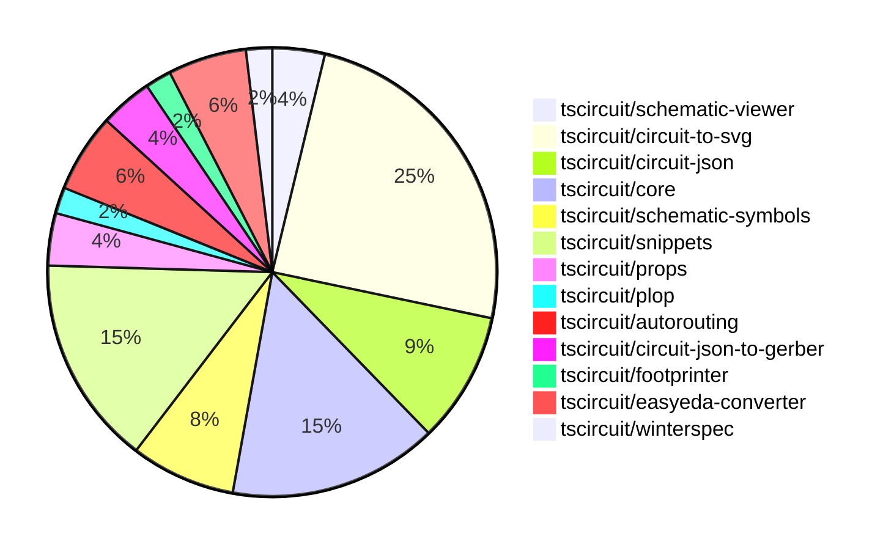

# Contribution Overview 2024-10-23

## PRs by Repository

## Contributor Overview

| Contributor | 🐳 Major | 🐙 Minor | 🐌 Tiny | ⭐ |
|-------------|-------|-------|-------|-------|
| [seveibar](#seveibar) | 9 | 15 | 0 | 👑 |
| [imrishabh18](#imrishabh18) | 2 | 12 | 1 | ⭐⭐⭐ |
| [Abse2001](#Abse2001) | 2 | 2 | 0 | ⭐⭐ |
| [andrii-balitskyi](#andrii-balitskyi) | 0 | 4 | 0 | ⭐ |
| [ni9999](#ni9999) | 1 | 2 | 0 | ⭐ |
| [ShiboSoftwareDev](#ShiboSoftwareDev) | 1 | 0 | 0 | ⭐ |
| [aman1376](#aman1376) | 0 | 1 | 0 |  |
| [TSP06](#TSP06) | 0 | 1 | 0 |  |

## Changes by Repository

### [tscircuit/schematic-viewer](https://github.com/tscircuit/schematic-viewer)

| PR # | Impact | Contributor | Description |
|------|--------|-------------|-------------|
| [#68](https://github.com/tscircuit/schematic-viewer/pull/68) | 🐳 Major | imrishabh18 | Ports the design from the schematic-viewer to the Kicad format. |
| [#67](https://github.com/tscircuit/schematic-viewer/pull/67) | 🐙 Minor | imrishabh18 | This pull request fixes the port position and format using the Plop tool. |

### [tscircuit/circuit-to-svg](https://github.com/tscircuit/circuit-to-svg)

| PR # | Impact | Contributor | Description |
|------|--------|-------------|-------------|
| [#96](https://github.com/tscircuit/circuit-to-svg/pull/96) | 🐳 Major | imrishabh18 | Refactors the code to use the 'transform' property instead of 'viewbox' for rendering SVG objects. |
| [#95](https://github.com/tscircuit/circuit-to-svg/pull/95) | 🐳 Major | seveibar | Refactors the schematic drawing to remove usage of viewport and `flipY`, and relies on the `transform` matrix for computing all positions. |
| [#92](https://github.com/tscircuit/circuit-to-svg/pull/92) | 🐳 Major | seveibar | Add support for schematic debug objects in the circuit JSON specification and the conversion to SVG. |
| [#101](https://github.com/tscircuit/circuit-to-svg/pull/101) | 🐙 Minor | imrishabh18 | Hide the ports on the center of the component |
| [#100](https://github.com/tscircuit/circuit-to-svg/pull/100) | 🐙 Minor | imrishabh18 | Removing the Y direction scale to fix port position |
| [#90](https://github.com/tscircuit/circuit-to-svg/pull/90) | 🐙 Minor | imrishabh18 | Reverts a change that broke the position of pins in the schematic. |
| [#99](https://github.com/tscircuit/circuit-to-svg/pull/99) | 🐙 Minor | seveibar | Fixes the issue where the Y coordinate of schematic traces was not being correctly applied. |
| [#98](https://github.com/tscircuit/circuit-to-svg/pull/98) | 🐙 Minor | seveibar | Fixes the calculation of the transformed coordinates for the SVG objects created from a debug object. |
| [#97](https://github.com/tscircuit/circuit-to-svg/pull/97) | 🐙 Minor | seveibar | Fixes the handling of undefined `pinNumber` and finding the pin number in the schematic port creation process. |
| [#94](https://github.com/tscircuit/circuit-to-svg/pull/94) | 🐙 Minor | seveibar | Introduces a new feature to support labeled grid in the schematic SVG conversion. |
| [#93](https://github.com/tscircuit/circuit-to-svg/pull/93) | 🐙 Minor | seveibar | Adds support for drawing a grid and labeled points in the schematic SVG. |
| [#89](https://github.com/tscircuit/circuit-to-svg/pull/89) | 🐙 Minor | Abse2001 | Updated the `schematic-symbols` dependency to version `0.0.90`. |
| [#102](https://github.com/tscircuit/circuit-to-svg/pull/102) | 🐙 Minor | ni9999 | Update the documentation in readme.md to reflect the latest changes in the library's API. |

### [tscircuit/circuit-json](https://github.com/tscircuit/circuit-json)

| PR # | Impact | Contributor | Description |
|------|--------|-------------|-------------|
| [#65](https://github.com/tscircuit/circuit-json/pull/65) | 🐙 Minor | imrishabh18 | Adds a `color` property to the `schematic_text` Zod schema with a default value of `#000000`. |
| [#64](https://github.com/tscircuit/circuit-json/pull/64) | 🐙 Minor | seveibar | Add more metadata to `schematic_port` object, including distance from component edge, side of component, true CCW index, and pin number. |
| [#62](https://github.com/tscircuit/circuit-json/pull/62) | 🐙 Minor | seveibar | Adds a new script to generate a documentation file for the schematic component overview. |
| [#61](https://github.com/tscircuit/circuit-json/pull/61) | 🐙 Minor | seveibar | Introduce a new schematic debug object feature to the project. |
| [#60](https://github.com/tscircuit/circuit-json/pull/60) | 🐙 Minor | Abse2001 | Added support for exporting the `source_simple_inductor` component. |

### [tscircuit/core](https://github.com/tscircuit/core)

| PR # | Impact | Contributor | Description |
|------|--------|-------------|-------------|
| [#209](https://github.com/tscircuit/core/pull/209) | 🐳 Major | seveibar | Implements a dirty render phase for the Circuit component to handle asynchronous effects and ensure the component stays up-to-date. |
| [#198](https://github.com/tscircuit/core/pull/198) | 🐳 Major | seveibar | Adds support for pill-shaped plated holes and provides more AI context for `tscircuit` React props. |
| [#196](https://github.com/tscircuit/core/pull/196) | 🐳 Major | Abse2001 | Implemented the `<Inductor>` component |
| [#206](https://github.com/tscircuit/core/pull/206) | 🐙 Minor | imrishabh18 | Adds missing trace space between the ports and route |
| [#201](https://github.com/tscircuit/core/pull/201) | 🐙 Minor | imrishabh18 | Fix for undefined pin skip in `getAllDimensionsForSchematicBox` function. |
| [#200](https://github.com/tscircuit/core/pull/200) | 🐙 Minor | imrishabh18 | Added ports as obstacles to enable proper routing |
| [#199](https://github.com/tscircuit/core/pull/199) | 🐙 Minor | imrishabh18 | Fixes the shifting of port position on the edge of the chip |
| [#194](https://github.com/tscircuit/core/pull/194) | 🐙 Minor | seveibar | Updates the circuit-to-svg package to the latest version and adds the ability to draw debugging boxes for schematic components. |

### [tscircuit/schematic-symbols](https://github.com/tscircuit/schematic-symbols)

| PR # | Impact | Contributor | Description |
|------|--------|-------------|-------------|
| [#185](https://github.com/tscircuit/schematic-symbols/pull/185) | 🐳 Major | Abse2001 | Implemented SVG Arc support and added a new inductor symbol |
| [#184](https://github.com/tscircuit/schematic-symbols/pull/184) | 🐙 Minor | imrishabh18 | Updated the lockfile to fix a failing npm publish |
| [#182](https://github.com/tscircuit/schematic-symbols/pull/182) | 🐙 Minor | TSP06 | Added a new ground symbol |
| [#183](https://github.com/tscircuit/schematic-symbols/pull/183) | 🐌 Tiny | imrishabh18 | Adds the .diff.png extension to the .gitignore file to ignore files with that extension. |

### [tscircuit/snippets](https://github.com/tscircuit/snippets)

| PR # | Impact | Contributor | Description |
|------|--------|-------------|-------------|
| [#122](https://github.com/tscircuit/snippets/pull/122) | 🐳 Major | seveibar | Introduce an "add star" endpoint that allows users to star a snippet. |
| [#125](https://github.com/tscircuit/snippets/pull/125) | 🐳 Major | ni9999 | Implemented a new "Fork" feature on the ViewSnippetHeader component. |
| [#134](https://github.com/tscircuit/snippets/pull/134) | 🐙 Minor | imrishabh18 | Adds a new manual-edits.json file to the dropdown in the CodeAndPreview component. |
| [#131](https://github.com/tscircuit/snippets/pull/131) | 🐙 Minor | imrishabh18 | Integrates a schematic viewer into the application. |
| [#138](https://github.com/tscircuit/snippets/pull/138) | 🐙 Minor | seveibar | Fixes a bug in the code reload check and adds a test to ensure the snippet loads correctly on the editor page. |
| [#126](https://github.com/tscircuit/snippets/pull/126) | 🐙 Minor | seveibar | Update dependencies for Pill Holes project |
| [#124](https://github.com/tscircuit/snippets/pull/124) | 🐙 Minor | andrii-balitskyi | Fix the width of the SearchableSelect options to match the width of the trigger button. |
| [#127](https://github.com/tscircuit/snippets/pull/127) | 🐙 Minor | ni9999 | Add a new option in the download dropdown menu to download the circuit schematic as an SVG file. |

### [tscircuit/props](https://github.com/tscircuit/props)

| PR # | Impact | Contributor | Description |
|------|--------|-------------|-------------|
| [#67](https://github.com/tscircuit/props/pull/67) | 🐳 Major | seveibar | This pull request adds an overview of all the prop types available in the `@tscircuit/props` package, including their definitions and associated zod validators. |
| [#66](https://github.com/tscircuit/props/pull/66) | 🐙 Minor | seveibar | Add support for "pill" shape for plated holes in the PCB component specification. |

### [tscircuit/plop](https://github.com/tscircuit/plop)

| PR # | Impact | Contributor | Description |
|------|--------|-------------|-------------|
| [#5](https://github.com/tscircuit/plop/pull/5) | 🐳 Major | seveibar | Adds support for checking the latest version of the package, ability to fetch remote template files, and switches to using the Bun runtime. |

### [tscircuit/autorouting](https://github.com/tscircuit/autorouting)

| PR # | Impact | Contributor | Description |
|------|--------|-------------|-------------|
| [#85](https://github.com/tscircuit/autorouting/pull/85) | 🐳 Major | seveibar | Switch the deployment of the application to use NextJS instead of Vite. |
| [#88](https://github.com/tscircuit/autorouting/pull/88) | 🐙 Minor | seveibar | Removes a path loop fix to simplify output routes |
| [#84](https://github.com/tscircuit/autorouting/pull/84) | 🐙 Minor | seveibar | Adds a feature to allow pasting SimpleRouteJson on the homepage and converting it to the required circuit-json format. |

### [tscircuit/circuit-json-to-gerber](https://github.com/tscircuit/circuit-json-to-gerber)

| PR # | Impact | Contributor | Description |
|------|--------|-------------|-------------|
| [#26](https://github.com/tscircuit/circuit-json-to-gerber/pull/26) | 🐳 Major | seveibar |  |
| [#25](https://github.com/tscircuit/circuit-json-to-gerber/pull/25) | 🐙 Minor | seveibar | Adds a new `PcbSilkscreenPill` type to represent a pill-shaped silkscreen element on a PCB. |

### [tscircuit/footprinter](https://github.com/tscircuit/footprinter)

| PR # | Impact | Contributor | Description |
|------|--------|-------------|-------------|
| [#72](https://github.com/tscircuit/footprinter/pull/72) | 🐙 Minor | aman1376 | Adds a new circuit component `lqfp` and exposes it through the main export. |

### [tscircuit/easyeda-converter](https://github.com/tscircuit/easyeda-converter)

| PR # | Impact | Contributor | Description |
|------|--------|-------------|-------------|
| [#85](https://github.com/tscircuit/easyeda-converter/pull/85) | 🐙 Minor | andrii-balitskyi | Converts string pin numbers to type number when converting to TSX. |
| [#83](https://github.com/tscircuit/easyeda-converter/pull/83) | 🐙 Minor | andrii-balitskyi | Converts oval pads with hole radius to pill-shaped plated holes in the EasyEDA-to-TSCircuit JSON conversion. |
| [#84](https://github.com/tscircuit/easyeda-converter/pull/84) | 🐙 Minor | andrii-balitskyi | Fix stroke width calculation by converting EasyEDA units (10 mil) to millimeters. |

### [tscircuit/winterspec](https://github.com/tscircuit/winterspec)

| PR # | Impact | Contributor | Description |
|------|--------|-------------|-------------|
| [#20](https://github.com/tscircuit/winterspec/pull/20) | 🐳 Major | ShiboSoftwareDev | Adds Windows support and a Windows test workflow, fixes issues for Linux/Mac, and modifies the CODEOWNERS file. |

## Changes by Contributor

### [imrishabh18](https://github.com/imrishabh18)

| PR # | Impact | Description |
|------|--------|-------------|
| [#68](https://github.com/tscircuit/schematic-viewer/pull/68) | 🐳 Major | Ports the design from the schematic-viewer to the Kicad format. |
| [#96](https://github.com/tscircuit/circuit-to-svg/pull/96) | 🐳 Major | Refactors the code to use the 'transform' property instead of 'viewbox' for rendering SVG objects. |
| [#67](https://github.com/tscircuit/schematic-viewer/pull/67) | 🐙 Minor | This pull request fixes the port position and format using the Plop tool. |
| [#65](https://github.com/tscircuit/circuit-json/pull/65) | 🐙 Minor | Adds a `color` property to the `schematic_text` Zod schema with a default value of `#000000`. |
| [#206](https://github.com/tscircuit/core/pull/206) | 🐙 Minor | Adds missing trace space between the ports and route |
| [#201](https://github.com/tscircuit/core/pull/201) | 🐙 Minor | Fix for undefined pin skip in `getAllDimensionsForSchematicBox` function. |
| [#200](https://github.com/tscircuit/core/pull/200) | 🐙 Minor | Added ports as obstacles to enable proper routing |
| [#199](https://github.com/tscircuit/core/pull/199) | 🐙 Minor | Fixes the shifting of port position on the edge of the chip |
| [#101](https://github.com/tscircuit/circuit-to-svg/pull/101) | 🐙 Minor | Hide the ports on the center of the component |
| [#100](https://github.com/tscircuit/circuit-to-svg/pull/100) | 🐙 Minor | Removing the Y direction scale to fix port position |
| [#90](https://github.com/tscircuit/circuit-to-svg/pull/90) | 🐙 Minor | Reverts a change that broke the position of pins in the schematic. |
| [#184](https://github.com/tscircuit/schematic-symbols/pull/184) | 🐙 Minor | Updated the lockfile to fix a failing npm publish |
| [#134](https://github.com/tscircuit/snippets/pull/134) | 🐙 Minor | Adds a new manual-edits.json file to the dropdown in the CodeAndPreview component. |
| [#131](https://github.com/tscircuit/snippets/pull/131) | 🐙 Minor | Integrates a schematic viewer into the application. |
| [#183](https://github.com/tscircuit/schematic-symbols/pull/183) | 🐌 Tiny | Adds the .diff.png extension to the .gitignore file to ignore files with that extension. |

### [seveibar](https://github.com/seveibar)

| PR # | Impact | Description |
|------|--------|-------------|
| [#67](https://github.com/tscircuit/props/pull/67) | 🐳 Major | This pull request adds an overview of all the prop types available in the `@tscircuit/props` package, including their definitions and associated zod validators. |
| [#209](https://github.com/tscircuit/core/pull/209) | 🐳 Major | Implements a dirty render phase for the Circuit component to handle asynchronous effects and ensure the component stays up-to-date. |
| [#198](https://github.com/tscircuit/core/pull/198) | 🐳 Major | Adds support for pill-shaped plated holes and provides more AI context for `tscircuit` React props. |
| [#5](https://github.com/tscircuit/plop/pull/5) | 🐳 Major | Adds support for checking the latest version of the package, ability to fetch remote template files, and switches to using the Bun runtime. |
| [#95](https://github.com/tscircuit/circuit-to-svg/pull/95) | 🐳 Major | Refactors the schematic drawing to remove usage of viewport and `flipY`, and relies on the `transform` matrix for computing all positions. |
| [#92](https://github.com/tscircuit/circuit-to-svg/pull/92) | 🐳 Major | Add support for schematic debug objects in the circuit JSON specification and the conversion to SVG. |
| [#85](https://github.com/tscircuit/autorouting/pull/85) | 🐳 Major | Switch the deployment of the application to use NextJS instead of Vite. |
| [#26](https://github.com/tscircuit/circuit-json-to-gerber/pull/26) | 🐳 Major |  |
| [#122](https://github.com/tscircuit/snippets/pull/122) | 🐳 Major | Introduce an "add star" endpoint that allows users to star a snippet. |
| [#64](https://github.com/tscircuit/circuit-json/pull/64) | 🐙 Minor | Add more metadata to `schematic_port` object, including distance from component edge, side of component, true CCW index, and pin number. |
| [#62](https://github.com/tscircuit/circuit-json/pull/62) | 🐙 Minor | Adds a new script to generate a documentation file for the schematic component overview. |
| [#61](https://github.com/tscircuit/circuit-json/pull/61) | 🐙 Minor | Introduce a new schematic debug object feature to the project. |
| [#66](https://github.com/tscircuit/props/pull/66) | 🐙 Minor | Add support for "pill" shape for plated holes in the PCB component specification. |
| [#194](https://github.com/tscircuit/core/pull/194) | 🐙 Minor | Updates the circuit-to-svg package to the latest version and adds the ability to draw debugging boxes for schematic components. |
| [#99](https://github.com/tscircuit/circuit-to-svg/pull/99) | 🐙 Minor | Fixes the issue where the Y coordinate of schematic traces was not being correctly applied. |
| [#98](https://github.com/tscircuit/circuit-to-svg/pull/98) | 🐙 Minor | Fixes the calculation of the transformed coordinates for the SVG objects created from a debug object. |
| [#97](https://github.com/tscircuit/circuit-to-svg/pull/97) | 🐙 Minor | Fixes the handling of undefined `pinNumber` and finding the pin number in the schematic port creation process. |
| [#94](https://github.com/tscircuit/circuit-to-svg/pull/94) | 🐙 Minor | Introduces a new feature to support labeled grid in the schematic SVG conversion. |
| [#93](https://github.com/tscircuit/circuit-to-svg/pull/93) | 🐙 Minor | Adds support for drawing a grid and labeled points in the schematic SVG. |
| [#88](https://github.com/tscircuit/autorouting/pull/88) | 🐙 Minor | Removes a path loop fix to simplify output routes |
| [#84](https://github.com/tscircuit/autorouting/pull/84) | 🐙 Minor | Adds a feature to allow pasting SimpleRouteJson on the homepage and converting it to the required circuit-json format. |
| [#25](https://github.com/tscircuit/circuit-json-to-gerber/pull/25) | 🐙 Minor | Adds a new `PcbSilkscreenPill` type to represent a pill-shaped silkscreen element on a PCB. |
| [#138](https://github.com/tscircuit/snippets/pull/138) | 🐙 Minor | Fixes a bug in the code reload check and adds a test to ensure the snippet loads correctly on the editor page. |
| [#126](https://github.com/tscircuit/snippets/pull/126) | 🐙 Minor | Update dependencies for Pill Holes project |

### [Abse2001](https://github.com/Abse2001)

| PR # | Impact | Description |
|------|--------|-------------|
| [#196](https://github.com/tscircuit/core/pull/196) | 🐳 Major | Implemented the `<Inductor>` component |
| [#185](https://github.com/tscircuit/schematic-symbols/pull/185) | 🐳 Major | Implemented SVG Arc support and added a new inductor symbol |
| [#60](https://github.com/tscircuit/circuit-json/pull/60) | 🐙 Minor | Added support for exporting the `source_simple_inductor` component. |
| [#89](https://github.com/tscircuit/circuit-to-svg/pull/89) | 🐙 Minor | Updated the `schematic-symbols` dependency to version `0.0.90`. |

### [aman1376](https://github.com/aman1376)

| PR # | Impact | Description |
|------|--------|-------------|
| [#72](https://github.com/tscircuit/footprinter/pull/72) | 🐙 Minor | Adds a new circuit component `lqfp` and exposes it through the main export. |

### [andrii-balitskyi](https://github.com/andrii-balitskyi)

| PR # | Impact | Description |
|------|--------|-------------|
| [#85](https://github.com/tscircuit/easyeda-converter/pull/85) | 🐙 Minor | Converts string pin numbers to type number when converting to TSX. |
| [#83](https://github.com/tscircuit/easyeda-converter/pull/83) | 🐙 Minor | Converts oval pads with hole radius to pill-shaped plated holes in the EasyEDA-to-TSCircuit JSON conversion. |
| [#84](https://github.com/tscircuit/easyeda-converter/pull/84) | 🐙 Minor | Fix stroke width calculation by converting EasyEDA units (10 mil) to millimeters. |
| [#124](https://github.com/tscircuit/snippets/pull/124) | 🐙 Minor | Fix the width of the SearchableSelect options to match the width of the trigger button. |

### [ShiboSoftwareDev](https://github.com/ShiboSoftwareDev)

| PR # | Impact | Description |
|------|--------|-------------|
| [#20](https://github.com/tscircuit/winterspec/pull/20) | 🐳 Major | Adds Windows support and a Windows test workflow, fixes issues for Linux/Mac, and modifies the CODEOWNERS file. |

### [ni9999](https://github.com/ni9999)

| PR # | Impact | Description |
|------|--------|-------------|
| [#125](https://github.com/tscircuit/snippets/pull/125) | 🐳 Major | Implemented a new "Fork" feature on the ViewSnippetHeader component. |
| [#102](https://github.com/tscircuit/circuit-to-svg/pull/102) | 🐙 Minor | Update the documentation in readme.md to reflect the latest changes in the library's API. |
| [#127](https://github.com/tscircuit/snippets/pull/127) | 🐙 Minor | Add a new option in the download dropdown menu to download the circuit schematic as an SVG file. |

### [TSP06](https://github.com/TSP06)

| PR # | Impact | Description |
|------|--------|-------------|
| [#182](https://github.com/tscircuit/schematic-symbols/pull/182) | 🐙 Minor | Added a new ground symbol |

