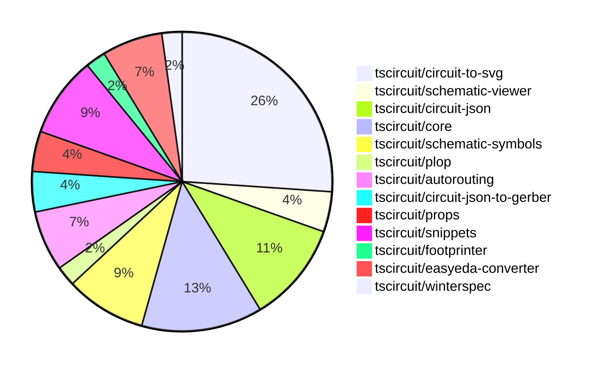

# Contribution Overview 2024-10-23

## PRs by Repository

## Contributor Overview

| Contributor | 🐳 Major | 🐙 Minor | 🐌 Tiny | ⭐ |
|-------------|-------|-------|-------|-------|
| [seveibar](#seveibar) | 7 | 15 | 0 | 👑 |
| [imrishabh18](#imrishabh18) | 1 | 9 | 2 | ⭐⭐ |
| [Abse2001](#Abse2001) | 2 | 2 | 0 | ⭐⭐ |
| [andrii-balitskyi](#andrii-balitskyi) | 0 | 4 | 0 | ⭐ |
| [ShiboSoftwareDev](#ShiboSoftwareDev) | 1 | 0 | 0 | ⭐ |
| [ni9999](#ni9999) | 1 | 0 | 0 | ⭐ |
| [aman1376](#aman1376) | 0 | 1 | 0 |  |
| [TSP06](#TSP06) | 0 | 1 | 0 |  |

## Changes by Repository

### [tscircuit/circuit-to-svg](https://github.com/tscircuit/circuit-to-svg)

| PR # | Impact | Contributor | Description |
|------|--------|-------------|-------------|
| [#96](https://github.com/tscircuit/circuit-to-svg/pull/96) | 🐳 Major | imrishabh18 | Refactoring the code to use `transform` instead of `viewbox` for creating SVG objects from PCB traces. |
| [#95](https://github.com/tscircuit/circuit-to-svg/pull/95) | 🐳 Major | seveibar | Refactor Schematic Drawing for Easier Transforms, Major Type-Safety Improvements (Part 1) |
| [#92](https://github.com/tscircuit/circuit-to-svg/pull/92) | 🐳 Major | seveibar | Adds support for drawing schematic debug objects in the circuit JSON specification. |
| [#101](https://github.com/tscircuit/circuit-to-svg/pull/101) | 🐙 Minor | imrishabh18 | Hides the ports on the center of the schematic component. |
| [#100](https://github.com/tscircuit/circuit-to-svg/pull/100) | 🐙 Minor | imrishabh18 | Fixes a bug with the port position by removing the scaling in the negative Y direction |
| [#90](https://github.com/tscircuit/circuit-to-svg/pull/90) | 🐙 Minor | imrishabh18 | Reverts a change that broke the position of pins. |
| [#99](https://github.com/tscircuit/circuit-to-svg/pull/99) | 🐙 Minor | seveibar | Fix to correctly calculate the Y coordinates for schematic traces |
| [#98](https://github.com/tscircuit/circuit-to-svg/pull/98) | 🐙 Minor | seveibar | Fixes issues with the calculation of the SVG object dimensions and positioning from a debug object in a schematic diagram. |
| [#97](https://github.com/tscircuit/circuit-to-svg/pull/97) | 🐙 Minor | seveibar | Fixes schematic port handling of undefined pinNumber and finding pin number |
| [#94](https://github.com/tscircuit/circuit-to-svg/pull/94) | 🐙 Minor | seveibar | Introduces a new feature to add labeled grid to the schematic SVG generation. |
| [#93](https://github.com/tscircuit/circuit-to-svg/pull/93) | 🐙 Minor | seveibar | Add support for drawing a grid and labeled points on the schematic SVG |
| [#89](https://github.com/tscircuit/circuit-to-svg/pull/89) | 🐙 Minor | Abse2001 | Updated the "schematic-symbols" dependency to version 0.0.90. |

### [tscircuit/schematic-viewer](https://github.com/tscircuit/schematic-viewer)

| PR # | Impact | Contributor | Description |
|------|--------|-------------|-------------|
| [#68](https://github.com/tscircuit/schematic-viewer/pull/68) | 🐙 Minor | imrishabh18 | Ports the schematic design to KiCAD by adjusting the component layout and adding text labels. |
| [#67](https://github.com/tscircuit/schematic-viewer/pull/67) | 🐙 Minor | imrishabh18 | Fix port position and format with plop |

### [tscircuit/circuit-json](https://github.com/tscircuit/circuit-json)

| PR # | Impact | Contributor | Description |
|------|--------|-------------|-------------|
| [#65](https://github.com/tscircuit/circuit-json/pull/65) | 🐙 Minor | imrishabh18 | Adds a color property to the SchematicTextInput type |
| [#64](https://github.com/tscircuit/circuit-json/pull/64) | 🐙 Minor | seveibar | Add useful meta information, true index, side of component etc. to schematic_port |
| [#62](https://github.com/tscircuit/circuit-json/pull/62) | 🐙 Minor | seveibar | Adds a new script to generate a Schematic Component Overview document based on the exported types in the schematic directory. |
| [#61](https://github.com/tscircuit/circuit-json/pull/61) | 🐙 Minor | seveibar | Introduces a schematic debug object that can be used to add debug information to schematics. |
| [#60](https://github.com/tscircuit/circuit-json/pull/60) | 🐙 Minor | Abse2001 | Adds support for simple inductors in the source component. |

### [tscircuit/core](https://github.com/tscircuit/core)

| PR # | Impact | Contributor | Description |
|------|--------|-------------|-------------|
| [#198](https://github.com/tscircuit/core/pull/198) | 🐳 Major | seveibar | Add support for pill-shaped plated holes and provide more AI context for tscircuit react props. |
| [#194](https://github.com/tscircuit/core/pull/194) | 🐳 Major | seveibar | Updates the project to use the latest version of the `circuit-to-svg` library, which includes support for rendering schematic debug objects. Additionally, it adds a new `_schDebugObjectsEnabled` prop to subcircuits to allow drawing debugging boxes, and switches from the `IJumpAutorouter` to the `MultilayerAutorouter`. |
| [#196](https://github.com/tscircuit/core/pull/196) | 🐳 Major | Abse2001 | Implemented the `<Inductor>` component. |
| [#201](https://github.com/tscircuit/core/pull/201) | 🐙 Minor | imrishabh18 | Fixes an issue where the port position for a non-existent pin was not being handled correctly. |
| [#200](https://github.com/tscircuit/core/pull/200) | 🐙 Minor | imrishabh18 | Added ports as obstacles and improved routing functionality. |
| [#199](https://github.com/tscircuit/core/pull/199) | 🐙 Minor | imrishabh18 | Fixes an issue with the position of ports at the edge of the chip component. |

### [tscircuit/schematic-symbols](https://github.com/tscircuit/schematic-symbols)

| PR # | Impact | Contributor | Description |
|------|--------|-------------|-------------|
| [#185](https://github.com/tscircuit/schematic-symbols/pull/185) | 🐳 Major | Abse2001 | Implemented SVG Arc support and added an inductor symbol |
| [#182](https://github.com/tscircuit/schematic-symbols/pull/182) | 🐙 Minor | TSP06 | Added ground symbol |
| [#184](https://github.com/tscircuit/schematic-symbols/pull/184) | 🐌 Tiny | imrishabh18 | Update the npm lockfile to fix a failing npm publish |
| [#183](https://github.com/tscircuit/schematic-symbols/pull/183) | 🐌 Tiny | imrishabh18 | Update .gitignore to ignore .diff.png files |

### [tscircuit/plop](https://github.com/tscircuit/plop)

| PR # | Impact | Contributor | Description |
|------|--------|-------------|-------------|
| [#5](https://github.com/tscircuit/plop/pull/5) | 🐳 Major | seveibar | Switches to bun, adds support for remote files, and adds support for checking the latest version of the package. |

### [tscircuit/autorouting](https://github.com/tscircuit/autorouting)

| PR # | Impact | Contributor | Description |
|------|--------|-------------|-------------|
| [#85](https://github.com/tscircuit/autorouting/pull/85) | 🐳 Major | seveibar | Switches the deployed application to use NextJS instead of Vite. |
| [#88](https://github.com/tscircuit/autorouting/pull/88) | 🐙 Minor | seveibar | Remove path loop fix to simplify output routes |
| [#84](https://github.com/tscircuit/autorouting/pull/84) | 🐙 Minor | seveibar | Allow pasting SimpleRouteJson on the homepage to visualize the circuit. |

### [tscircuit/circuit-json-to-gerber](https://github.com/tscircuit/circuit-json-to-gerber)

| PR # | Impact | Contributor | Description |
|------|--------|-------------|-------------|
| [#26](https://github.com/tscircuit/circuit-json-to-gerber/pull/26) | 🐳 Major | seveibar |  |
| [#25](https://github.com/tscircuit/circuit-json-to-gerber/pull/25) | 🐙 Minor | seveibar | Adds a new "docs/CIRCUIT_JSON_PCB_OVERVIEW.md" file that provides an overview of the Circuit JSON specification for PCB components. |

### [tscircuit/props](https://github.com/tscircuit/props)

| PR # | Impact | Contributor | Description |
|------|--------|-------------|-------------|
| [#67](https://github.com/tscircuit/props/pull/67) | 🐙 Minor | seveibar | Adds generated documentation for various prop types used in the @tscircuit/props package. |
| [#66](https://github.com/tscircuit/props/pull/66) | 🐙 Minor | seveibar | Add support for "pill" shape to the `<platedhole>` component. |

### [tscircuit/snippets](https://github.com/tscircuit/snippets)

| PR # | Impact | Contributor | Description |
|------|--------|-------------|-------------|
| [#125](https://github.com/tscircuit/snippets/pull/125) | 🐳 Major | ni9999 | Implemented a fork functionality on the ViewSnippetHeader component. |
| [#126](https://github.com/tscircuit/snippets/pull/126) | 🐙 Minor | seveibar | Update dependencies in the project, including updating "@tscircuit/props" to version 0.0.77 and "circuit-json" to version 0.0.92. |
| [#122](https://github.com/tscircuit/snippets/pull/122) | 🐙 Minor | seveibar | Adds an endpoint to allow users to star a snippet. |
| [#124](https://github.com/tscircuit/snippets/pull/124) | 🐙 Minor | andrii-balitskyi | Fixes the width of the SearchableSelect options dropdown to match the width of the input field. |

### [tscircuit/footprinter](https://github.com/tscircuit/footprinter)

| PR # | Impact | Contributor | Description |
|------|--------|-------------|-------------|
| [#72](https://github.com/tscircuit/footprinter/pull/72) | 🐙 Minor | aman1376 | Adds a new circuit element called "lqfp" to the project. |

### [tscircuit/easyeda-converter](https://github.com/tscircuit/easyeda-converter)

| PR # | Impact | Contributor | Description |
|------|--------|-------------|-------------|
| [#85](https://github.com/tscircuit/easyeda-converter/pull/85) | 🐙 Minor | andrii-balitskyi | Converts string pin numbers to type number when converting to TSX |
| [#83](https://github.com/tscircuit/easyeda-converter/pull/83) | 🐙 Minor | andrii-balitskyi | Converts oval pads with hole radius to pill-shaped plated holes in the EasyEDA to CircuitJSON conversion. |
| [#84](https://github.com/tscircuit/easyeda-converter/pull/84) | 🐙 Minor | andrii-balitskyi | Fix the calculation of stroke width when converting EasyEDA JSON to TSCircuit Soup JSON. |

### [tscircuit/winterspec](https://github.com/tscircuit/winterspec)

| PR # | Impact | Contributor | Description |
|------|--------|-------------|-------------|
| [#20](https://github.com/tscircuit/winterspec/pull/20) | 🐳 Major | ShiboSoftwareDev | Adds Windows support, including a new Windows test workflow, and fixes Linux/Mac issues. |

## Changes by Contributor

### [imrishabh18](https://github.com/imrishabh18)

| PR # | Impact | Description |
|------|--------|-------------|
| [#96](https://github.com/tscircuit/circuit-to-svg/pull/96) | 🐳 Major | Refactoring the code to use `transform` instead of `viewbox` for creating SVG objects from PCB traces. |
| [#68](https://github.com/tscircuit/schematic-viewer/pull/68) | 🐙 Minor | Ports the schematic design to KiCAD by adjusting the component layout and adding text labels. |
| [#67](https://github.com/tscircuit/schematic-viewer/pull/67) | 🐙 Minor | Fix port position and format with plop |
| [#65](https://github.com/tscircuit/circuit-json/pull/65) | 🐙 Minor | Adds a color property to the SchematicTextInput type |
| [#201](https://github.com/tscircuit/core/pull/201) | 🐙 Minor | Fixes an issue where the port position for a non-existent pin was not being handled correctly. |
| [#200](https://github.com/tscircuit/core/pull/200) | 🐙 Minor | Added ports as obstacles and improved routing functionality. |
| [#199](https://github.com/tscircuit/core/pull/199) | 🐙 Minor | Fixes an issue with the position of ports at the edge of the chip component. |
| [#101](https://github.com/tscircuit/circuit-to-svg/pull/101) | 🐙 Minor | Hides the ports on the center of the schematic component. |
| [#100](https://github.com/tscircuit/circuit-to-svg/pull/100) | 🐙 Minor | Fixes a bug with the port position by removing the scaling in the negative Y direction |
| [#90](https://github.com/tscircuit/circuit-to-svg/pull/90) | 🐙 Minor | Reverts a change that broke the position of pins. |
| [#184](https://github.com/tscircuit/schematic-symbols/pull/184) | 🐌 Tiny | Update the npm lockfile to fix a failing npm publish |
| [#183](https://github.com/tscircuit/schematic-symbols/pull/183) | 🐌 Tiny | Update .gitignore to ignore .diff.png files |

### [seveibar](https://github.com/seveibar)

| PR # | Impact | Description |
|------|--------|-------------|
| [#198](https://github.com/tscircuit/core/pull/198) | 🐳 Major | Add support for pill-shaped plated holes and provide more AI context for tscircuit react props. |
| [#194](https://github.com/tscircuit/core/pull/194) | 🐳 Major | Updates the project to use the latest version of the `circuit-to-svg` library, which includes support for rendering schematic debug objects. Additionally, it adds a new `_schDebugObjectsEnabled` prop to subcircuits to allow drawing debugging boxes, and switches from the `IJumpAutorouter` to the `MultilayerAutorouter`. |
| [#5](https://github.com/tscircuit/plop/pull/5) | 🐳 Major | Switches to bun, adds support for remote files, and adds support for checking the latest version of the package. |
| [#95](https://github.com/tscircuit/circuit-to-svg/pull/95) | 🐳 Major | Refactor Schematic Drawing for Easier Transforms, Major Type-Safety Improvements (Part 1) |
| [#92](https://github.com/tscircuit/circuit-to-svg/pull/92) | 🐳 Major | Adds support for drawing schematic debug objects in the circuit JSON specification. |
| [#85](https://github.com/tscircuit/autorouting/pull/85) | 🐳 Major | Switches the deployed application to use NextJS instead of Vite. |
| [#26](https://github.com/tscircuit/circuit-json-to-gerber/pull/26) | 🐳 Major |  |
| [#64](https://github.com/tscircuit/circuit-json/pull/64) | 🐙 Minor | Add useful meta information, true index, side of component etc. to schematic_port |
| [#62](https://github.com/tscircuit/circuit-json/pull/62) | 🐙 Minor | Adds a new script to generate a Schematic Component Overview document based on the exported types in the schematic directory. |
| [#61](https://github.com/tscircuit/circuit-json/pull/61) | 🐙 Minor | Introduces a schematic debug object that can be used to add debug information to schematics. |
| [#67](https://github.com/tscircuit/props/pull/67) | 🐙 Minor | Adds generated documentation for various prop types used in the @tscircuit/props package. |
| [#66](https://github.com/tscircuit/props/pull/66) | 🐙 Minor | Add support for "pill" shape to the `<platedhole>` component. |
| [#99](https://github.com/tscircuit/circuit-to-svg/pull/99) | 🐙 Minor | Fix to correctly calculate the Y coordinates for schematic traces |
| [#98](https://github.com/tscircuit/circuit-to-svg/pull/98) | 🐙 Minor | Fixes issues with the calculation of the SVG object dimensions and positioning from a debug object in a schematic diagram. |
| [#97](https://github.com/tscircuit/circuit-to-svg/pull/97) | 🐙 Minor | Fixes schematic port handling of undefined pinNumber and finding pin number |
| [#94](https://github.com/tscircuit/circuit-to-svg/pull/94) | 🐙 Minor | Introduces a new feature to add labeled grid to the schematic SVG generation. |
| [#93](https://github.com/tscircuit/circuit-to-svg/pull/93) | 🐙 Minor | Add support for drawing a grid and labeled points on the schematic SVG |
| [#88](https://github.com/tscircuit/autorouting/pull/88) | 🐙 Minor | Remove path loop fix to simplify output routes |
| [#84](https://github.com/tscircuit/autorouting/pull/84) | 🐙 Minor | Allow pasting SimpleRouteJson on the homepage to visualize the circuit. |
| [#25](https://github.com/tscircuit/circuit-json-to-gerber/pull/25) | 🐙 Minor | Adds a new "docs/CIRCUIT_JSON_PCB_OVERVIEW.md" file that provides an overview of the Circuit JSON specification for PCB components. |
| [#126](https://github.com/tscircuit/snippets/pull/126) | 🐙 Minor | Update dependencies in the project, including updating "@tscircuit/props" to version 0.0.77 and "circuit-json" to version 0.0.92. |
| [#122](https://github.com/tscircuit/snippets/pull/122) | 🐙 Minor | Adds an endpoint to allow users to star a snippet. |

### [Abse2001](https://github.com/Abse2001)

| PR # | Impact | Description |
|------|--------|-------------|
| [#196](https://github.com/tscircuit/core/pull/196) | 🐳 Major | Implemented the `<Inductor>` component. |
| [#185](https://github.com/tscircuit/schematic-symbols/pull/185) | 🐳 Major | Implemented SVG Arc support and added an inductor symbol |
| [#60](https://github.com/tscircuit/circuit-json/pull/60) | 🐙 Minor | Adds support for simple inductors in the source component. |
| [#89](https://github.com/tscircuit/circuit-to-svg/pull/89) | 🐙 Minor | Updated the "schematic-symbols" dependency to version 0.0.90. |

### [aman1376](https://github.com/aman1376)

| PR # | Impact | Description |
|------|--------|-------------|
| [#72](https://github.com/tscircuit/footprinter/pull/72) | 🐙 Minor | Adds a new circuit element called "lqfp" to the project. |

### [andrii-balitskyi](https://github.com/andrii-balitskyi)

| PR # | Impact | Description |
|------|--------|-------------|
| [#85](https://github.com/tscircuit/easyeda-converter/pull/85) | 🐙 Minor | Converts string pin numbers to type number when converting to TSX |
| [#83](https://github.com/tscircuit/easyeda-converter/pull/83) | 🐙 Minor | Converts oval pads with hole radius to pill-shaped plated holes in the EasyEDA to CircuitJSON conversion. |
| [#84](https://github.com/tscircuit/easyeda-converter/pull/84) | 🐙 Minor | Fix the calculation of stroke width when converting EasyEDA JSON to TSCircuit Soup JSON. |
| [#124](https://github.com/tscircuit/snippets/pull/124) | 🐙 Minor | Fixes the width of the SearchableSelect options dropdown to match the width of the input field. |

### [ShiboSoftwareDev](https://github.com/ShiboSoftwareDev)

| PR # | Impact | Description |
|------|--------|-------------|
| [#20](https://github.com/tscircuit/winterspec/pull/20) | 🐳 Major | Adds Windows support, including a new Windows test workflow, and fixes Linux/Mac issues. |

### [TSP06](https://github.com/TSP06)

| PR # | Impact | Description |
|------|--------|-------------|
| [#182](https://github.com/tscircuit/schematic-symbols/pull/182) | 🐙 Minor | Added ground symbol |

### [ni9999](https://github.com/ni9999)

| PR # | Impact | Description |
|------|--------|-------------|
| [#125](https://github.com/tscircuit/snippets/pull/125) | 🐳 Major | Implemented a fork functionality on the ViewSnippetHeader component. |

