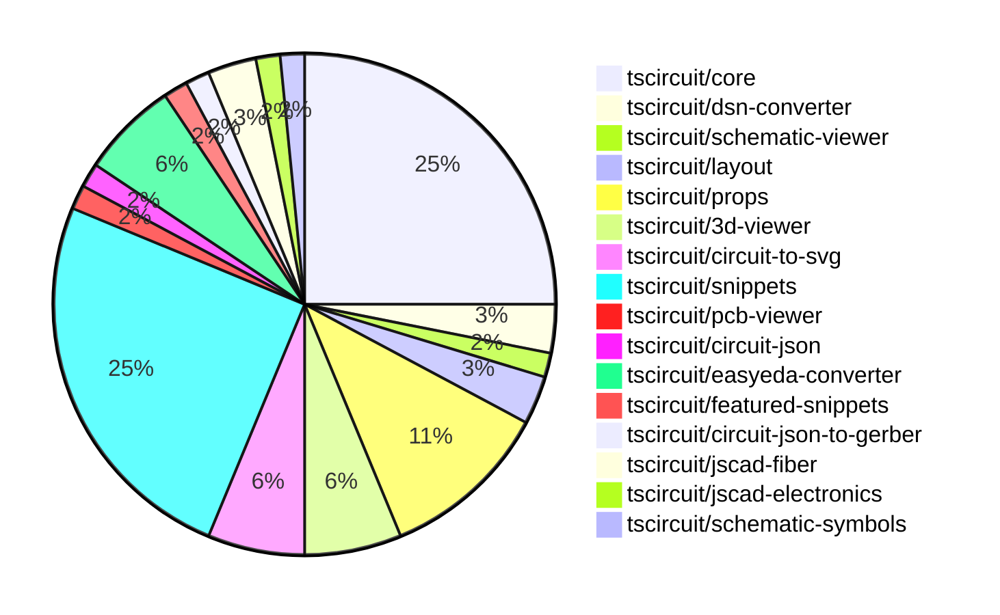

# Contribution Overview 2024-10-30

## PRs by Repository

## Contributor Overview

| Contributor | 🐳 Major | 🐙 Minor | 🐌 Tiny | ⭐ |
|-------------|-------|-------|-------|-------|
| [seveibar](#seveibar) | 6 | 20 | 1 | 👑 |
| [imrishabh18](#imrishabh18) | 2 | 14 | 1 | ⭐⭐⭐ |
| [ShiboSoftwareDev](#ShiboSoftwareDev) | 1 | 4 | 0 | ⭐⭐ |
| [andrii-balitskyi](#andrii-balitskyi) | 0 | 5 | 0 | ⭐ |
| [anas-sarkez](#anas-sarkez) | 1 | 2 | 0 | ⭐ |
| [mrudulpatil18](#mrudulpatil18) | 1 | 1 | 0 | ⭐ |
| [tscircuitbot](#tscircuitbot) | 0 | 2 | 0 | ⭐ |
| [aman1376](#aman1376) | 1 | 0 | 0 | ⭐ |
| [Satvik1769](#Satvik1769) | 0 | 1 | 0 |  |
| [SufyaanKhateeb](#SufyaanKhateeb) | 0 | 1 | 0 |  |

## Changes by Repository

### [tscircuit/core](https://github.com/tscircuit/core)

| PR # | Impact | Contributor | Description |
|------|--------|-------------|-------------|
| [#224](https://github.com/tscircuit/core/pull/224) | 🐳 Major | imrishabh18 | Adds support for manual edits to the PCB layout, including the ability to specify component placement and trace hints. |
| [#235](https://github.com/tscircuit/core/pull/235) | 🐳 Major | seveibar | Adds support for pinheaders and implied footprint strings |
| [#214](https://github.com/tscircuit/core/pull/214) | 🐳 Major | seveibar | Introduces three new hooks: `useChip`, `useResistor`, and `useCapacitor` to create corresponding electronic components. |
| [#212](https://github.com/tscircuit/core/pull/212) | 🐳 Major | seveibar | Improve the typing of the `createUseComponent` function to better handle the `pinLabels` argument and the resulting component type. |
| [#245](https://github.com/tscircuit/core/pull/245) | 🐙 Minor | imrishabh18 | Fixes an issue where port dots were being displayed on the center of the chip when a port arrangement was present. |
| [#229](https://github.com/tscircuit/core/pull/229) | 🐙 Minor | imrishabh18 | Adds the pin number as an alias for portHints in the NormalComponent class. |
| [#239](https://github.com/tscircuit/core/pull/239) | 🐙 Minor | seveibar | Fixes a bug where the last edges of schematic traces don't connect to the ports. |
| [#238](https://github.com/tscircuit/core/pull/238) | 🐙 Minor | seveibar | Refactor the computation of the schematic box dimensions to simplify the logic and remove unnecessary code. |
| [#236](https://github.com/tscircuit/core/pull/236) | 🐙 Minor | seveibar | Allows schematic boxes for components other than chips to be automatically computed, and removes ghost code. |
| [#227](https://github.com/tscircuit/core/pull/227) | 🐙 Minor | seveibar | Fix for the issue where components have weird drag and drop issues where you can't click them in the center. |
| [#223](https://github.com/tscircuit/core/pull/223) | 🐙 Minor | seveibar | Enable removing path loops in the Trace component |
| [#218](https://github.com/tscircuit/core/pull/218) | 🐙 Minor | seveibar | Avoid throwing a fatal error when net islands fail to route, and instead render an error message. |
| [#217](https://github.com/tscircuit/core/pull/217) | 🐙 Minor | seveibar | Introduce a new useDiode hook that creates a reusable diode component. |
| [#244](https://github.com/tscircuit/core/pull/244) | 🐙 Minor | andrii-balitskyi | Adds a GitHub Actions workflow to automatically format the code in pull requests. |
| [#243](https://github.com/tscircuit/core/pull/243) | 🐙 Minor | andrii-balitskyi | Add a new `useLed` hook to the project. |
| [#228](https://github.com/tscircuit/core/pull/228) | 🐌 Tiny | imrishabh18 | Updates the lockfile to reflect the latest dependencies |

### [tscircuit/dsn-converter](https://github.com/tscircuit/dsn-converter)

| PR # | Impact | Contributor | Description |
|------|--------|-------------|-------------|
| [#13](https://github.com/tscircuit/dsn-converter/pull/13) | 🐳 Major | imrishabh18 | Adds a new feature to convert circuit JSON to DSN JSON format. |
| [#8](https://github.com/tscircuit/dsn-converter/pull/8) | 🐳 Major | seveibar | The pull request introduces a major refactor, improves code separation, adds tests, build, release process, stringification, and usage examples to the README. |

### [tscircuit/schematic-viewer](https://github.com/tscircuit/schematic-viewer)

| PR # | Impact | Contributor | Description |
|------|--------|-------------|-------------|
| [#71](https://github.com/tscircuit/schematic-viewer/pull/71) | 🐙 Minor | imrishabh18 | Fix the drag sensitivity to be constant throughout the application |

### [tscircuit/layout](https://github.com/tscircuit/layout)

| PR # | Impact | Contributor | Description |
|------|--------|-------------|-------------|
| [#4](https://github.com/tscircuit/layout/pull/4) | 🐙 Minor | imrishabh18 | Fix types in the `manual-layout-pcb.ts` file. |
| [#3](https://github.com/tscircuit/layout/pull/3) | 🐙 Minor | imrishabh18 | Refactor code to use "circuit-json" instead of "@tscircuit/soup" |

### [tscircuit/props](https://github.com/tscircuit/props)

| PR # | Impact | Contributor | Description |
|------|--------|-------------|-------------|
| [#80](https://github.com/tscircuit/props/pull/80) | 🐙 Minor | imrishabh18 | The pull request refactors the codebase to replace the `@tscircuit/soup` dependency with `circuit-json` across various files. |
| [#79](https://github.com/tscircuit/props/pull/79) | 🐙 Minor | imrishabh18 | Adds support for pins defined as strings in the `PinSideDefinition` interface. |
| [#70](https://github.com/tscircuit/props/pull/70) | 🐙 Minor | imrishabh18 | Adds manual edits as props for the `Board` and `SubcircuitGroup` components. |
| [#68](https://github.com/tscircuit/props/pull/68) | 🐙 Minor | seveibar | Introduces a new Github Actions workflow to automatically generate and commit updates to the `PROPS_OVERVIEW.md` file. This improves the documentation generation process. |
| [#72](https://github.com/tscircuit/props/pull/72) | 🐙 Minor | seveibar | Introduce `headerProps` which defines the properties for a header component. |
| [#76](https://github.com/tscircuit/props/pull/76) | 🐙 Minor | tscircuitbot | Rename `headerProps` to `pinHeaderProps`, add `pinHeader.pinLabels` |
| [#74](https://github.com/tscircuit/props/pull/74) | 🐙 Minor | tscircuitbot | Add `holeDiameter` and `platedDiameter` parameters to the `header` component. |

### [tscircuit/3d-viewer](https://github.com/tscircuit/3d-viewer)

| PR # | Impact | Contributor | Description |
|------|--------|-------------|-------------|
| [#29](https://github.com/tscircuit/3d-viewer/pull/29) | 🐙 Minor | imrishabh18 | Update the dependency "@tscircuit/core" from version 0.0.97 to 0.0.136 |
| [#34](https://github.com/tscircuit/3d-viewer/pull/34) | 🐙 Minor | ShiboSoftwareDev | Changed the highlight color of the model from a dimmer color to a brighter blue color. |
| [#33](https://github.com/tscircuit/3d-viewer/pull/33) | 🐙 Minor | ShiboSoftwareDev | Add the ability to hover over a component in the CAD viewer to highlight it and display its reference designator. |
| [#32](https://github.com/tscircuit/3d-viewer/pull/32) | 🐙 Minor | ShiboSoftwareDev | Fixes the rotation of 3D models in the CAD viewer component. |

### [tscircuit/circuit-to-svg](https://github.com/tscircuit/circuit-to-svg)

| PR # | Impact | Contributor | Description |
|------|--------|-------------|-------------|
| [#104](https://github.com/tscircuit/circuit-to-svg/pull/104) | 🐳 Major | seveibar | This pull request introduces a major refactor to the schematic object handling, including the use of absolute coordinates, breaking up functions, and fixing offsets. |
| [#103](https://github.com/tscircuit/circuit-to-svg/pull/103) | 🐳 Major | seveibar | Fix schematic component rendering relying on non-standard props |
| [#106](https://github.com/tscircuit/circuit-to-svg/pull/106) | 🐙 Minor | imrishabh18 | Add support for rendering schematic net labels in the SVG conversion process. |
| [#105](https://github.com/tscircuit/circuit-to-svg/pull/105) | 🐌 Tiny | seveibar | Update the dependency for the `@tscircuit/core` package from version `0.0.147` to `0.0.148`. |

### [tscircuit/snippets](https://github.com/tscircuit/snippets)

| PR # | Impact | Contributor | Description |
|------|--------|-------------|-------------|
| [#121](https://github.com/tscircuit/snippets/pull/121) | 🐳 Major | mrudulpatil18 | Fixes the command palette search by rewriting the logic to use Fuzzy search and fixing the issue with search results not being shown. |
| [#164](https://github.com/tscircuit/snippets/pull/164) | 🐙 Minor | imrishabh18 | Fixes the overflow issue on the view snippet page. |
| [#159](https://github.com/tscircuit/snippets/pull/159) | 🐙 Minor | imrishabh18 | Remove button in view page |
| [#143](https://github.com/tscircuit/snippets/pull/143) | 🐙 Minor | imrishabh18 | Updates the position on movement in manual-edits |
| [#141](https://github.com/tscircuit/snippets/pull/141) | 🐙 Minor | imrishabh18 | Update the code editor to handle changes to the current file. |
| [#169](https://github.com/tscircuit/snippets/pull/169) | 🐙 Minor | seveibar | Update dependencies (core and circuit-to-svg), replace schematic viewer with circuit-to-svg component with mouse controls. |
| [#162](https://github.com/tscircuit/snippets/pull/162) | 🐙 Minor | seveibar | Introduces manual edits as props, refactors one-way dataflow for manual edits file, and fixes a rendering issue. |
| [#155](https://github.com/tscircuit/snippets/pull/155) | 🐙 Minor | seveibar | Disables automatic closing bracket insertion in the code editor. |
| [#154](https://github.com/tscircuit/snippets/pull/154) | 🐙 Minor | seveibar | Fix a bug where clicking "go to definition" removes dashes from import names. |
| [#150](https://github.com/tscircuit/snippets/pull/150) | 🐙 Minor | seveibar | Move Toast to Bottom Right, Fix Sticky Preview, Improve Dropdown Color for CodeEditor files, Add FS Map from CDN to fix some type issues |
| [#149](https://github.com/tscircuit/snippets/pull/149) | 🐙 Minor | seveibar | Fix createUseComponent types, improve toast position, sticky preview, and improve code editor header filename select box color. |
| [#147](https://github.com/tscircuit/snippets/pull/147) | 🐙 Minor | seveibar | Update the `easyeda` library version to fix ESP32 import, improve the Schematic Viewer Height, and add a Sticky Preview feature. |
| [#167](https://github.com/tscircuit/snippets/pull/167) | 🐙 Minor | ShiboSoftwareDev | Fixes a bug where the cmd+click tooltip appears on all tsci imports instead of only the hovered import. |
| [#163](https://github.com/tscircuit/snippets/pull/163) | 🐙 Minor | Satvik1769 | Adds a custom hook to warn the user when they have unsaved changes and attempt to leave the page. |
| [#137](https://github.com/tscircuit/snippets/pull/137) | 🐙 Minor | mrudulpatil18 | Adds a snippet type to the URL for copy URL functionality. |
| [#144](https://github.com/tscircuit/snippets/pull/144) | 🐙 Minor | SufyaanKhateeb | Fix the profile page header to say "My Profile" when the current user is viewing their profile and fix the "My Profile" link in the footer to show up only when logged in. |

### [tscircuit/pcb-viewer](https://github.com/tscircuit/pcb-viewer)

| PR # | Impact | Contributor | Description |
|------|--------|-------------|-------------|
| [#79](https://github.com/tscircuit/pcb-viewer/pull/79) | 🐙 Minor | seveibar | Standardize z-index values by introducing a centralized `zIndexMap` object |

### [tscircuit/circuit-json](https://github.com/tscircuit/circuit-json)

| PR # | Impact | Contributor | Description |
|------|--------|-------------|-------------|
| [#67](https://github.com/tscircuit/circuit-json/pull/67) | 🐙 Minor | seveibar | Improves SI unit parsing by handling the case where the unit is 'uF' instead of 'µF'. |

### [tscircuit/easyeda-converter](https://github.com/tscircuit/easyeda-converter)

| PR # | Impact | Contributor | Description |
|------|--------|-------------|-------------|
| [#89](https://github.com/tscircuit/easyeda-converter/pull/89) | 🐙 Minor | seveibar | This pull request normalizes the pin labels for the EasyEDA to TSCircuit Soup JSON conversion. |
| [#94](https://github.com/tscircuit/easyeda-converter/pull/94) | 🐙 Minor | andrii-balitskyi | The pull request correctly parses right-facing (end) pins from raw EasyEDA JSON data. |
| [#93](https://github.com/tscircuit/easyeda-converter/pull/93) | 🐙 Minor | andrii-balitskyi | Sort pin labels in ascending order |
| [#91](https://github.com/tscircuit/easyeda-converter/pull/91) | 🐙 Minor | andrii-balitskyi | Include duplicate pin name in pin label array, remove pinNames from component template |

### [tscircuit/featured-snippets](https://github.com/tscircuit/featured-snippets)

| PR # | Impact | Contributor | Description |
|------|--------|-------------|-------------|
| [#2](https://github.com/tscircuit/featured-snippets/pull/2) | 🐙 Minor | seveibar | Add featured snippets to the project |

### [tscircuit/circuit-json-to-gerber](https://github.com/tscircuit/circuit-json-to-gerber)

| PR # | Impact | Contributor | Description |
|------|--------|-------------|-------------|
| [#27](https://github.com/tscircuit/circuit-json-to-gerber/pull/27) | 🐳 Major | ShiboSoftwareDev | Added support for silkscreen text rendering in the Gerber conversion process. |

### [tscircuit/jscad-fiber](https://github.com/tscircuit/jscad-fiber)

| PR # | Impact | Contributor | Description |
|------|--------|-------------|-------------|
| [#86](https://github.com/tscircuit/jscad-fiber/pull/86) | 🐳 Major | anas-sarkez | Refactor `createHostConfig` to support array-based subtraction of React elements and improve error handling. |
| [#87](https://github.com/tscircuit/jscad-fiber/pull/87) | 🐙 Minor | anas-sarkez | Fixed type errors in the `createInstance` function calls. |

### [tscircuit/jscad-electronics](https://github.com/tscircuit/jscad-electronics)

| PR # | Impact | Contributor | Description |
|------|--------|-------------|-------------|
| [#77](https://github.com/tscircuit/jscad-electronics/pull/77) | 🐙 Minor | anas-sarkez | Supported a different color for capacitors with example and updated dependencies |

### [tscircuit/schematic-symbols](https://github.com/tscircuit/schematic-symbols)

| PR # | Impact | Contributor | Description |
|------|--------|-------------|-------------|
| [#187](https://github.com/tscircuit/schematic-symbols/pull/187) | 🐳 Major | aman1376 | Adds a new SVG image and JSON data for an illuminated push button that is normally open. |

## Changes by Contributor

### [imrishabh18](https://github.com/imrishabh18)

| PR # | Impact | Description |
|------|--------|-------------|
| [#224](https://github.com/tscircuit/core/pull/224) | 🐳 Major | Adds support for manual edits to the PCB layout, including the ability to specify component placement and trace hints. |
| [#13](https://github.com/tscircuit/dsn-converter/pull/13) | 🐳 Major | Adds a new feature to convert circuit JSON to DSN JSON format. |
| [#71](https://github.com/tscircuit/schematic-viewer/pull/71) | 🐙 Minor | Fix the drag sensitivity to be constant throughout the application |
| [#4](https://github.com/tscircuit/layout/pull/4) | 🐙 Minor | Fix types in the `manual-layout-pcb.ts` file. |
| [#3](https://github.com/tscircuit/layout/pull/3) | 🐙 Minor | Refactor code to use "circuit-json" instead of "@tscircuit/soup" |
| [#80](https://github.com/tscircuit/props/pull/80) | 🐙 Minor | The pull request refactors the codebase to replace the `@tscircuit/soup` dependency with `circuit-json` across various files. |
| [#79](https://github.com/tscircuit/props/pull/79) | 🐙 Minor | Adds support for pins defined as strings in the `PinSideDefinition` interface. |
| [#70](https://github.com/tscircuit/props/pull/70) | 🐙 Minor | Adds manual edits as props for the `Board` and `SubcircuitGroup` components. |
| [#29](https://github.com/tscircuit/3d-viewer/pull/29) | 🐙 Minor | Update the dependency "@tscircuit/core" from version 0.0.97 to 0.0.136 |
| [#245](https://github.com/tscircuit/core/pull/245) | 🐙 Minor | Fixes an issue where port dots were being displayed on the center of the chip when a port arrangement was present. |
| [#229](https://github.com/tscircuit/core/pull/229) | 🐙 Minor | Adds the pin number as an alias for portHints in the NormalComponent class. |
| [#106](https://github.com/tscircuit/circuit-to-svg/pull/106) | 🐙 Minor | Add support for rendering schematic net labels in the SVG conversion process. |
| [#164](https://github.com/tscircuit/snippets/pull/164) | 🐙 Minor | Fixes the overflow issue on the view snippet page. |
| [#159](https://github.com/tscircuit/snippets/pull/159) | 🐙 Minor | Remove button in view page |
| [#143](https://github.com/tscircuit/snippets/pull/143) | 🐙 Minor | Updates the position on movement in manual-edits |
| [#141](https://github.com/tscircuit/snippets/pull/141) | 🐙 Minor | Update the code editor to handle changes to the current file. |
| [#228](https://github.com/tscircuit/core/pull/228) | 🐌 Tiny | Updates the lockfile to reflect the latest dependencies |

### [seveibar](https://github.com/seveibar)

| PR # | Impact | Description |
|------|--------|-------------|
| [#235](https://github.com/tscircuit/core/pull/235) | 🐳 Major | Adds support for pinheaders and implied footprint strings |
| [#214](https://github.com/tscircuit/core/pull/214) | 🐳 Major | Introduces three new hooks: `useChip`, `useResistor`, and `useCapacitor` to create corresponding electronic components. |
| [#212](https://github.com/tscircuit/core/pull/212) | 🐳 Major | Improve the typing of the `createUseComponent` function to better handle the `pinLabels` argument and the resulting component type. |
| [#104](https://github.com/tscircuit/circuit-to-svg/pull/104) | 🐳 Major | This pull request introduces a major refactor to the schematic object handling, including the use of absolute coordinates, breaking up functions, and fixing offsets. |
| [#103](https://github.com/tscircuit/circuit-to-svg/pull/103) | 🐳 Major | Fix schematic component rendering relying on non-standard props |
| [#8](https://github.com/tscircuit/dsn-converter/pull/8) | 🐳 Major | The pull request introduces a major refactor, improves code separation, adds tests, build, release process, stringification, and usage examples to the README. |
| [#79](https://github.com/tscircuit/pcb-viewer/pull/79) | 🐙 Minor | Standardize z-index values by introducing a centralized `zIndexMap` object |
| [#67](https://github.com/tscircuit/circuit-json/pull/67) | 🐙 Minor | Improves SI unit parsing by handling the case where the unit is 'uF' instead of 'µF'. |
| [#68](https://github.com/tscircuit/props/pull/68) | 🐙 Minor | Introduces a new Github Actions workflow to automatically generate and commit updates to the `PROPS_OVERVIEW.md` file. This improves the documentation generation process. |
| [#72](https://github.com/tscircuit/props/pull/72) | 🐙 Minor | Introduce `headerProps` which defines the properties for a header component. |
| [#89](https://github.com/tscircuit/easyeda-converter/pull/89) | 🐙 Minor | This pull request normalizes the pin labels for the EasyEDA to TSCircuit Soup JSON conversion. |
| [#239](https://github.com/tscircuit/core/pull/239) | 🐙 Minor | Fixes a bug where the last edges of schematic traces don't connect to the ports. |
| [#238](https://github.com/tscircuit/core/pull/238) | 🐙 Minor | Refactor the computation of the schematic box dimensions to simplify the logic and remove unnecessary code. |
| [#236](https://github.com/tscircuit/core/pull/236) | 🐙 Minor | Allows schematic boxes for components other than chips to be automatically computed, and removes ghost code. |
| [#227](https://github.com/tscircuit/core/pull/227) | 🐙 Minor | Fix for the issue where components have weird drag and drop issues where you can't click them in the center. |
| [#223](https://github.com/tscircuit/core/pull/223) | 🐙 Minor | Enable removing path loops in the Trace component |
| [#218](https://github.com/tscircuit/core/pull/218) | 🐙 Minor | Avoid throwing a fatal error when net islands fail to route, and instead render an error message. |
| [#217](https://github.com/tscircuit/core/pull/217) | 🐙 Minor | Introduce a new useDiode hook that creates a reusable diode component. |
| [#169](https://github.com/tscircuit/snippets/pull/169) | 🐙 Minor | Update dependencies (core and circuit-to-svg), replace schematic viewer with circuit-to-svg component with mouse controls. |
| [#162](https://github.com/tscircuit/snippets/pull/162) | 🐙 Minor | Introduces manual edits as props, refactors one-way dataflow for manual edits file, and fixes a rendering issue. |
| [#155](https://github.com/tscircuit/snippets/pull/155) | 🐙 Minor | Disables automatic closing bracket insertion in the code editor. |
| [#154](https://github.com/tscircuit/snippets/pull/154) | 🐙 Minor | Fix a bug where clicking "go to definition" removes dashes from import names. |
| [#150](https://github.com/tscircuit/snippets/pull/150) | 🐙 Minor | Move Toast to Bottom Right, Fix Sticky Preview, Improve Dropdown Color for CodeEditor files, Add FS Map from CDN to fix some type issues |
| [#149](https://github.com/tscircuit/snippets/pull/149) | 🐙 Minor | Fix createUseComponent types, improve toast position, sticky preview, and improve code editor header filename select box color. |
| [#147](https://github.com/tscircuit/snippets/pull/147) | 🐙 Minor | Update the `easyeda` library version to fix ESP32 import, improve the Schematic Viewer Height, and add a Sticky Preview feature. |
| [#2](https://github.com/tscircuit/featured-snippets/pull/2) | 🐙 Minor | Add featured snippets to the project |
| [#105](https://github.com/tscircuit/circuit-to-svg/pull/105) | 🐌 Tiny | Update the dependency for the `@tscircuit/core` package from version `0.0.147` to `0.0.148`. |

### [tscircuitbot](https://github.com/tscircuitbot)

| PR # | Impact | Description |
|------|--------|-------------|
| [#76](https://github.com/tscircuit/props/pull/76) | 🐙 Minor | Rename `headerProps` to `pinHeaderProps`, add `pinHeader.pinLabels` |
| [#74](https://github.com/tscircuit/props/pull/74) | 🐙 Minor | Add `holeDiameter` and `platedDiameter` parameters to the `header` component. |

### [andrii-balitskyi](https://github.com/andrii-balitskyi)

| PR # | Impact | Description |
|------|--------|-------------|
| [#94](https://github.com/tscircuit/easyeda-converter/pull/94) | 🐙 Minor | The pull request correctly parses right-facing (end) pins from raw EasyEDA JSON data. |
| [#93](https://github.com/tscircuit/easyeda-converter/pull/93) | 🐙 Minor | Sort pin labels in ascending order |
| [#91](https://github.com/tscircuit/easyeda-converter/pull/91) | 🐙 Minor | Include duplicate pin name in pin label array, remove pinNames from component template |
| [#244](https://github.com/tscircuit/core/pull/244) | 🐙 Minor | Adds a GitHub Actions workflow to automatically format the code in pull requests. |
| [#243](https://github.com/tscircuit/core/pull/243) | 🐙 Minor | Add a new `useLed` hook to the project. |

### [ShiboSoftwareDev](https://github.com/ShiboSoftwareDev)

| PR # | Impact | Description |
|------|--------|-------------|
| [#27](https://github.com/tscircuit/circuit-json-to-gerber/pull/27) | 🐳 Major | Added support for silkscreen text rendering in the Gerber conversion process. |
| [#34](https://github.com/tscircuit/3d-viewer/pull/34) | 🐙 Minor | Changed the highlight color of the model from a dimmer color to a brighter blue color. |
| [#33](https://github.com/tscircuit/3d-viewer/pull/33) | 🐙 Minor | Add the ability to hover over a component in the CAD viewer to highlight it and display its reference designator. |
| [#32](https://github.com/tscircuit/3d-viewer/pull/32) | 🐙 Minor | Fixes the rotation of 3D models in the CAD viewer component. |
| [#167](https://github.com/tscircuit/snippets/pull/167) | 🐙 Minor | Fixes a bug where the cmd+click tooltip appears on all tsci imports instead of only the hovered import. |

### [anas-sarkez](https://github.com/anas-sarkez)

| PR # | Impact | Description |
|------|--------|-------------|
| [#86](https://github.com/tscircuit/jscad-fiber/pull/86) | 🐳 Major | Refactor `createHostConfig` to support array-based subtraction of React elements and improve error handling. |
| [#77](https://github.com/tscircuit/jscad-electronics/pull/77) | 🐙 Minor | Supported a different color for capacitors with example and updated dependencies |
| [#87](https://github.com/tscircuit/jscad-fiber/pull/87) | 🐙 Minor | Fixed type errors in the `createInstance` function calls. |

### [aman1376](https://github.com/aman1376)

| PR # | Impact | Description |
|------|--------|-------------|
| [#187](https://github.com/tscircuit/schematic-symbols/pull/187) | 🐳 Major | Adds a new SVG image and JSON data for an illuminated push button that is normally open. |

### [Satvik1769](https://github.com/Satvik1769)

| PR # | Impact | Description |
|------|--------|-------------|
| [#163](https://github.com/tscircuit/snippets/pull/163) | 🐙 Minor | Adds a custom hook to warn the user when they have unsaved changes and attempt to leave the page. |

### [mrudulpatil18](https://github.com/mrudulpatil18)

| PR # | Impact | Description |
|------|--------|-------------|
| [#121](https://github.com/tscircuit/snippets/pull/121) | 🐳 Major | Fixes the command palette search by rewriting the logic to use Fuzzy search and fixing the issue with search results not being shown. |
| [#137](https://github.com/tscircuit/snippets/pull/137) | 🐙 Minor | Adds a snippet type to the URL for copy URL functionality. |

### [SufyaanKhateeb](https://github.com/SufyaanKhateeb)

| PR # | Impact | Description |
|------|--------|-------------|
| [#144](https://github.com/tscircuit/snippets/pull/144) | 🐙 Minor | Fix the profile page header to say "My Profile" when the current user is viewing their profile and fix the "My Profile" link in the footer to show up only when logged in. |

