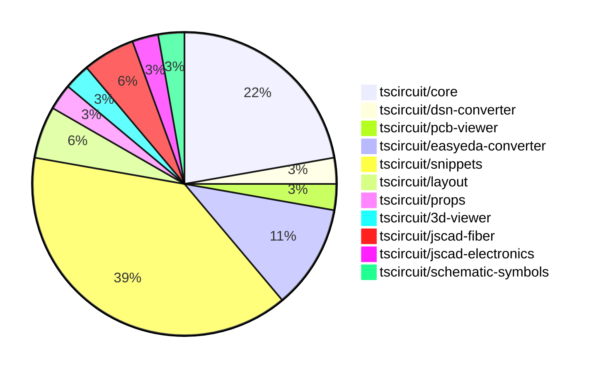

# Contribution Overview 2024-10-30

## PRs by Repository

## Contributor Overview

| Contributor | 🐳 Major | 🐙 Minor | 🐌 Tiny | ⭐ |
|-------------|-------|-------|-------|-------|
| [seveibar](#seveibar) | 2 | 13 | 0 | ⭐⭐⭐ |
| [imrishabh18](#imrishabh18) | 1 | 8 | 1 | ⭐⭐ |
| [anas-sarkez](#anas-sarkez) | 1 | 2 | 0 | ⭐ |
| [andrii-balitskyi](#andrii-balitskyi) | 0 | 3 | 0 | ⭐ |
| [mrudulpatil18](#mrudulpatil18) | 1 | 1 | 0 | ⭐ |
| [aman1376](#aman1376) | 0 | 1 | 0 |  |
| [Satvik1769](#Satvik1769) | 0 | 1 | 0 |  |
| [SufyaanKhateeb](#SufyaanKhateeb) | 0 | 1 | 0 |  |

## Changes by Repository

### [tscircuit/core](https://github.com/tscircuit/core)

| PR # | Impact | Contributor | Description |
|------|--------|-------------|-------------|
| [#214](https://github.com/tscircuit/core/pull/214) | 🐳 Major | seveibar | Introduces three new hooks - `useChip`, `useResistor`, and `useCapacitor` to create corresponding circuit components. |
| [#227](https://github.com/tscircuit/core/pull/227) | 🐙 Minor | seveibar | Fix a bug in the bounds calculation of PCB components, which caused issues with the center of the components not being updated correctly during drag and drop. |
| [#223](https://github.com/tscircuit/core/pull/223) | 🐙 Minor | seveibar | Enable removing path loops in the Trace component. |
| [#218](https://github.com/tscircuit/core/pull/218) | 🐙 Minor | seveibar | Handles the case where net islands fail to route by rendering an error message instead of throwing a fatal error. |
| [#217](https://github.com/tscircuit/core/pull/217) | 🐙 Minor | seveibar | Introduce a new `useDiode` hook |
| [#212](https://github.com/tscircuit/core/pull/212) | 🐙 Minor | seveibar | The pull request improves the types for the `createUseComponent` function, making it more flexible in accepting different pin label formats. |
| [#224](https://github.com/tscircuit/core/pull/224) | 🐙 Minor | imrishabh18 | Add support for manual edits to PCB placements |
| [#228](https://github.com/tscircuit/core/pull/228) | 🐌 Tiny | imrishabh18 | Updates the lockfile to include the latest dependencies. |

### [tscircuit/dsn-converter](https://github.com/tscircuit/dsn-converter)

| PR # | Impact | Contributor | Description |
|------|--------|-------------|-------------|
| [#8](https://github.com/tscircuit/dsn-converter/pull/8) | 🐳 Major | seveibar | The pull request introduces a major refactor, improves code separation, adds tests, build, release, stringification, and usage examples in the README. |

### [tscircuit/pcb-viewer](https://github.com/tscircuit/pcb-viewer)

| PR # | Impact | Contributor | Description |
|------|--------|-------------|-------------|
| [#79](https://github.com/tscircuit/pcb-viewer/pull/79) | 🐙 Minor | seveibar | Standardize the z-index values used in various UI components by introducing a centralized `zIndexMap` object. |

### [tscircuit/easyeda-converter](https://github.com/tscircuit/easyeda-converter)

| PR # | Impact | Contributor | Description |
|------|--------|-------------|-------------|
| [#89](https://github.com/tscircuit/easyeda-converter/pull/89) | 🐙 Minor | seveibar | Normalize pin labels in the EasyEDA JSON to TSCircuit Soup JSON conversion process. |
| [#94](https://github.com/tscircuit/easyeda-converter/pull/94) | 🐙 Minor | andrii-balitskyi | This pull request fixes a bug in the parsing of right-facing (end) pins from the raw EasyEDA JSON data. |
| [#93](https://github.com/tscircuit/easyeda-converter/pull/93) | 🐙 Minor | andrii-balitskyi | Sorts the pin labels in the `convert-to-typescript-component` function. |
| [#91](https://github.com/tscircuit/easyeda-converter/pull/91) | 🐙 Minor | andrii-balitskyi | Include duplicate pin name in pin label array, remove pinNames from component template |

### [tscircuit/snippets](https://github.com/tscircuit/snippets)

| PR # | Impact | Contributor | Description |
|------|--------|-------------|-------------|
| [#121](https://github.com/tscircuit/snippets/pull/121) | 🐳 Major | mrudulpatil18 | The pull request fixes the search filtering issue in the Command Palette by rewriting the logic and using Fuzzy search to filter the possible commands. |
| [#162](https://github.com/tscircuit/snippets/pull/162) | 🐙 Minor | seveibar | Refactors the manual edits file handling to use a one-way data flow approach. |
| [#155](https://github.com/tscircuit/snippets/pull/155) | 🐙 Minor | seveibar | Disable automatic closing bracket insertion in the code editor. |
| [#154](https://github.com/tscircuit/snippets/pull/154) | 🐙 Minor | seveibar | Fixed an issue where clicking "go to definition" was removing dashes from imported module names. |
| [#150](https://github.com/tscircuit/snippets/pull/150) | 🐙 Minor | seveibar | Move Toast to Bottom Right, Fix Sticky Preview, Improve Dropdown Color for CodeEditor files, Add FS Map from CDN to fix some type issues |
| [#149](https://github.com/tscircuit/snippets/pull/149) | 🐙 Minor | seveibar | Fix createUseComponent types, Improve toast position, sticky preview, and improve code editor header filename select box color |
| [#147](https://github.com/tscircuit/snippets/pull/147) | 🐙 Minor | seveibar | Update the easyeda package to version 0.0.62 to fix the ESP32 import issue, improve the Schematic Viewer height, and add a sticky preview feature. |
| [#164](https://github.com/tscircuit/snippets/pull/164) | 🐙 Minor | imrishabh18 | Fix the overflow issue on the view page for the snippet component. |
| [#159](https://github.com/tscircuit/snippets/pull/159) | 🐙 Minor | imrishabh18 | Remove button in view page since it's not needed. |
| [#143](https://github.com/tscircuit/snippets/pull/143) | 🐙 Minor | imrishabh18 | Updates the position on movement in manual-edits |
| [#141](https://github.com/tscircuit/snippets/pull/141) | 🐙 Minor | imrishabh18 | Update the `useEffect` hook to include `currentFile` as a dependency to ensure the code editor is properly updated when the current file changes. |
| [#163](https://github.com/tscircuit/snippets/pull/163) | 🐙 Minor | Satvik1769 | Add a hook to warn the user before navigating away from the page if there are unsaved changes. |
| [#137](https://github.com/tscircuit/snippets/pull/137) | 🐙 Minor | mrudulpatil18 | The pull request adds the snippet type to the URL for the copy URL functionality. |
| [#144](https://github.com/tscircuit/snippets/pull/144) | 🐙 Minor | SufyaanKhateeb | Fix the profile page header to say "My Profile" when the current user is viewing their profile and fix the "My Profile" link in the footer to show up only when logged in. |

### [tscircuit/layout](https://github.com/tscircuit/layout)

| PR # | Impact | Contributor | Description |
|------|--------|-------------|-------------|
| [#3](https://github.com/tscircuit/layout/pull/3) | 🐳 Major | imrishabh18 | Refactor the codebase to use the `circuit-json` library instead of the `@tscircuit/soup` library. |
| [#4](https://github.com/tscircuit/layout/pull/4) | 🐙 Minor | imrishabh18 | Fix types in the `manual-layout-pcb.ts` file |

### [tscircuit/props](https://github.com/tscircuit/props)

| PR # | Impact | Contributor | Description |
|------|--------|-------------|-------------|
| [#70](https://github.com/tscircuit/props/pull/70) | 🐙 Minor | imrishabh18 | Manual edits are added as props to the `BoardProps` and `SubcircuitGroupProps` interfaces. |

### [tscircuit/3d-viewer](https://github.com/tscircuit/3d-viewer)

| PR # | Impact | Contributor | Description |
|------|--------|-------------|-------------|
| [#29](https://github.com/tscircuit/3d-viewer/pull/29) | 🐙 Minor | imrishabh18 | Update dependency `@tscircuit/core` from `0.0.97` to `0.0.136` |

### [tscircuit/jscad-fiber](https://github.com/tscircuit/jscad-fiber)

| PR # | Impact | Contributor | Description |
|------|--------|-------------|-------------|
| [#86](https://github.com/tscircuit/jscad-fiber/pull/86) | 🐳 Major | anas-sarkez | Refactor `createHostConfig` to support array-based subtraction of React elements and improve error handling and type-checking. |
| [#87](https://github.com/tscircuit/jscad-fiber/pull/87) | 🐙 Minor | anas-sarkez | Fixed type errors in the `createInstance` function calls. |

### [tscircuit/jscad-electronics](https://github.com/tscircuit/jscad-electronics)

| PR # | Impact | Contributor | Description |
|------|--------|-------------|-------------|
| [#77](https://github.com/tscircuit/jscad-electronics/pull/77) | 🐙 Minor | anas-sarkez | Supported a different color for capacitors with example and updated dependencies |

### [tscircuit/schematic-symbols](https://github.com/tscircuit/schematic-symbols)

| PR # | Impact | Contributor | Description |
|------|--------|-------------|-------------|
| [#187](https://github.com/tscircuit/schematic-symbols/pull/187) | 🐙 Minor | aman1376 | Adds a new file `illuminated_push_button_normally_open.json` that contains the specification for an illuminated push button in a normally open configuration. |

## Changes by Contributor

### [seveibar](https://github.com/seveibar)

| PR # | Impact | Description |
|------|--------|-------------|
| [#214](https://github.com/tscircuit/core/pull/214) | 🐳 Major | Introduces three new hooks - `useChip`, `useResistor`, and `useCapacitor` to create corresponding circuit components. |
| [#8](https://github.com/tscircuit/dsn-converter/pull/8) | 🐳 Major | The pull request introduces a major refactor, improves code separation, adds tests, build, release, stringification, and usage examples in the README. |
| [#79](https://github.com/tscircuit/pcb-viewer/pull/79) | 🐙 Minor | Standardize the z-index values used in various UI components by introducing a centralized `zIndexMap` object. |
| [#89](https://github.com/tscircuit/easyeda-converter/pull/89) | 🐙 Minor | Normalize pin labels in the EasyEDA JSON to TSCircuit Soup JSON conversion process. |
| [#227](https://github.com/tscircuit/core/pull/227) | 🐙 Minor | Fix a bug in the bounds calculation of PCB components, which caused issues with the center of the components not being updated correctly during drag and drop. |
| [#223](https://github.com/tscircuit/core/pull/223) | 🐙 Minor | Enable removing path loops in the Trace component. |
| [#218](https://github.com/tscircuit/core/pull/218) | 🐙 Minor | Handles the case where net islands fail to route by rendering an error message instead of throwing a fatal error. |
| [#217](https://github.com/tscircuit/core/pull/217) | 🐙 Minor | Introduce a new `useDiode` hook |
| [#212](https://github.com/tscircuit/core/pull/212) | 🐙 Minor | The pull request improves the types for the `createUseComponent` function, making it more flexible in accepting different pin label formats. |
| [#162](https://github.com/tscircuit/snippets/pull/162) | 🐙 Minor | Refactors the manual edits file handling to use a one-way data flow approach. |
| [#155](https://github.com/tscircuit/snippets/pull/155) | 🐙 Minor | Disable automatic closing bracket insertion in the code editor. |
| [#154](https://github.com/tscircuit/snippets/pull/154) | 🐙 Minor | Fixed an issue where clicking "go to definition" was removing dashes from imported module names. |
| [#150](https://github.com/tscircuit/snippets/pull/150) | 🐙 Minor | Move Toast to Bottom Right, Fix Sticky Preview, Improve Dropdown Color for CodeEditor files, Add FS Map from CDN to fix some type issues |
| [#149](https://github.com/tscircuit/snippets/pull/149) | 🐙 Minor | Fix createUseComponent types, Improve toast position, sticky preview, and improve code editor header filename select box color |
| [#147](https://github.com/tscircuit/snippets/pull/147) | 🐙 Minor | Update the easyeda package to version 0.0.62 to fix the ESP32 import issue, improve the Schematic Viewer height, and add a sticky preview feature. |

### [imrishabh18](https://github.com/imrishabh18)

| PR # | Impact | Description |
|------|--------|-------------|
| [#3](https://github.com/tscircuit/layout/pull/3) | 🐳 Major | Refactor the codebase to use the `circuit-json` library instead of the `@tscircuit/soup` library. |
| [#4](https://github.com/tscircuit/layout/pull/4) | 🐙 Minor | Fix types in the `manual-layout-pcb.ts` file |
| [#70](https://github.com/tscircuit/props/pull/70) | 🐙 Minor | Manual edits are added as props to the `BoardProps` and `SubcircuitGroupProps` interfaces. |
| [#29](https://github.com/tscircuit/3d-viewer/pull/29) | 🐙 Minor | Update dependency `@tscircuit/core` from `0.0.97` to `0.0.136` |
| [#224](https://github.com/tscircuit/core/pull/224) | 🐙 Minor | Add support for manual edits to PCB placements |
| [#164](https://github.com/tscircuit/snippets/pull/164) | 🐙 Minor | Fix the overflow issue on the view page for the snippet component. |
| [#159](https://github.com/tscircuit/snippets/pull/159) | 🐙 Minor | Remove button in view page since it's not needed. |
| [#143](https://github.com/tscircuit/snippets/pull/143) | 🐙 Minor | Updates the position on movement in manual-edits |
| [#141](https://github.com/tscircuit/snippets/pull/141) | 🐙 Minor | Update the `useEffect` hook to include `currentFile` as a dependency to ensure the code editor is properly updated when the current file changes. |
| [#228](https://github.com/tscircuit/core/pull/228) | 🐌 Tiny | Updates the lockfile to include the latest dependencies. |

### [andrii-balitskyi](https://github.com/andrii-balitskyi)

| PR # | Impact | Description |
|------|--------|-------------|
| [#94](https://github.com/tscircuit/easyeda-converter/pull/94) | 🐙 Minor | This pull request fixes a bug in the parsing of right-facing (end) pins from the raw EasyEDA JSON data. |
| [#93](https://github.com/tscircuit/easyeda-converter/pull/93) | 🐙 Minor | Sorts the pin labels in the `convert-to-typescript-component` function. |
| [#91](https://github.com/tscircuit/easyeda-converter/pull/91) | 🐙 Minor | Include duplicate pin name in pin label array, remove pinNames from component template |

### [anas-sarkez](https://github.com/anas-sarkez)

| PR # | Impact | Description |
|------|--------|-------------|
| [#86](https://github.com/tscircuit/jscad-fiber/pull/86) | 🐳 Major | Refactor `createHostConfig` to support array-based subtraction of React elements and improve error handling and type-checking. |
| [#77](https://github.com/tscircuit/jscad-electronics/pull/77) | 🐙 Minor | Supported a different color for capacitors with example and updated dependencies |
| [#87](https://github.com/tscircuit/jscad-fiber/pull/87) | 🐙 Minor | Fixed type errors in the `createInstance` function calls. |

### [aman1376](https://github.com/aman1376)

| PR # | Impact | Description |
|------|--------|-------------|
| [#187](https://github.com/tscircuit/schematic-symbols/pull/187) | 🐙 Minor | Adds a new file `illuminated_push_button_normally_open.json` that contains the specification for an illuminated push button in a normally open configuration. |

### [Satvik1769](https://github.com/Satvik1769)

| PR # | Impact | Description |
|------|--------|-------------|
| [#163](https://github.com/tscircuit/snippets/pull/163) | 🐙 Minor | Add a hook to warn the user before navigating away from the page if there are unsaved changes. |

### [mrudulpatil18](https://github.com/mrudulpatil18)

| PR # | Impact | Description |
|------|--------|-------------|
| [#121](https://github.com/tscircuit/snippets/pull/121) | 🐳 Major | The pull request fixes the search filtering issue in the Command Palette by rewriting the logic and using Fuzzy search to filter the possible commands. |
| [#137](https://github.com/tscircuit/snippets/pull/137) | 🐙 Minor | The pull request adds the snippet type to the URL for the copy URL functionality. |

### [SufyaanKhateeb](https://github.com/SufyaanKhateeb)

| PR # | Impact | Description |
|------|--------|-------------|
| [#144](https://github.com/tscircuit/snippets/pull/144) | 🐙 Minor | Fix the profile page header to say "My Profile" when the current user is viewing their profile and fix the "My Profile" link in the footer to show up only when logged in. |

