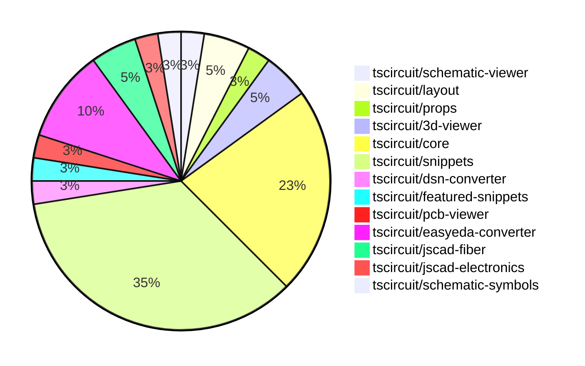

# Contribution Overview 2024-10-30

## PRs by Repository

## Contributor Overview

| Contributor | 🐳 Major | 🐙 Minor | 🐌 Tiny | ⭐ |
|-------------|-------|-------|-------|-------|
| [seveibar](#seveibar) | 4 | 12 | 0 | ⭐⭐⭐ |
| [imrishabh18](#imrishabh18) | 0 | 11 | 1 | ⭐⭐ |
| [anas-sarkez](#anas-sarkez) | 1 | 2 | 0 | ⭐ |
| [andrii-balitskyi](#andrii-balitskyi) | 0 | 3 | 0 | ⭐ |
| [mrudulpatil18](#mrudulpatil18) | 1 | 1 | 0 | ⭐ |
| [aman1376](#aman1376) | 1 | 0 | 0 | ⭐ |
| [ShiboSoftwareDev](#ShiboSoftwareDev) | 0 | 1 | 0 |  |
| [Satvik1769](#Satvik1769) | 0 | 1 | 0 |  |
| [SufyaanKhateeb](#SufyaanKhateeb) | 0 | 1 | 0 |  |

## Changes by Repository

### [tscircuit/schematic-viewer](https://github.com/tscircuit/schematic-viewer)

| PR # | Impact | Contributor | Description |
|------|--------|-------------|-------------|
| [#71](https://github.com/tscircuit/schematic-viewer/pull/71) | 🐙 Minor | imrishabh18 | Fix the issue of drag sensitivity not being constant throughout the transformation. |

### [tscircuit/layout](https://github.com/tscircuit/layout)

| PR # | Impact | Contributor | Description |
|------|--------|-------------|-------------|
| [#4](https://github.com/tscircuit/layout/pull/4) | 🐙 Minor | imrishabh18 | Fix types in the manual-layout-pcb.ts file |
| [#3](https://github.com/tscircuit/layout/pull/3) | 🐙 Minor | imrishabh18 | Refactor to use "circuit-json" library instead of "@tscircuit/soup" |

### [tscircuit/props](https://github.com/tscircuit/props)

| PR # | Impact | Contributor | Description |
|------|--------|-------------|-------------|
| [#70](https://github.com/tscircuit/props/pull/70) | 🐙 Minor | imrishabh18 | Adds the `manualEdits` prop to the `BoardProps` and `SubcircuitGroupProps` interfaces. |

### [tscircuit/3d-viewer](https://github.com/tscircuit/3d-viewer)

| PR # | Impact | Contributor | Description |
|------|--------|-------------|-------------|
| [#29](https://github.com/tscircuit/3d-viewer/pull/29) | 🐙 Minor | imrishabh18 | Update the dependency `@tscircuit/core` from version `0.0.97` to `0.0.136`. |
| [#32](https://github.com/tscircuit/3d-viewer/pull/32) | 🐙 Minor | ShiboSoftwareDev | Fixes the rotation of 3D models in the CadViewer component. |

### [tscircuit/core](https://github.com/tscircuit/core)

| PR # | Impact | Contributor | Description |
|------|--------|-------------|-------------|
| [#214](https://github.com/tscircuit/core/pull/214) | 🐳 Major | seveibar | Introduces new hooks `useChip`, `useResistor`, and `useCapacitor` to create corresponding circuit components. |
| [#212](https://github.com/tscircuit/core/pull/212) | 🐳 Major | seveibar | Improves the types for the `createUseComponent` function and the component it creates, allowing more flexibility in the way pins are specified. |
| [#229](https://github.com/tscircuit/core/pull/229) | 🐙 Minor | imrishabh18 | Adds the pin number as an alias for portHints in the NormalComponent class. |
| [#224](https://github.com/tscircuit/core/pull/224) | 🐙 Minor | imrishabh18 | Add support for manualEdits in the PrimitiveComponent class. |
| [#227](https://github.com/tscircuit/core/pull/227) | 🐙 Minor | seveibar | Fixes the issue where components have weird drag and drop issues where you can't click them in the center by updating the center of the PCB component. |
| [#223](https://github.com/tscircuit/core/pull/223) | 🐙 Minor | seveibar | Enables removing path loops in the Trace component |
| [#218](https://github.com/tscircuit/core/pull/218) | 🐙 Minor | seveibar | Modify the error handling behavior when net islands fail to route, avoid throwing a fatal error. |
| [#217](https://github.com/tscircuit/core/pull/217) | 🐙 Minor | seveibar | Introduce a new hook called `useDiode` that creates a reusable diode component. |
| [#228](https://github.com/tscircuit/core/pull/228) | 🐌 Tiny | imrishabh18 | Update the lockfile to include the latest dependencies. |

### [tscircuit/snippets](https://github.com/tscircuit/snippets)

| PR # | Impact | Contributor | Description |
|------|--------|-------------|-------------|
| [#121](https://github.com/tscircuit/snippets/pull/121) | 🐳 Major | mrudulpatil18 | The pull request fixes the search filtering issue in the Command palette by rewriting the logic and using Fuzzy search to filter the possible commands. |
| [#164](https://github.com/tscircuit/snippets/pull/164) | 🐙 Minor | imrishabh18 | Fix an overflow issue on the view snippet page. |
| [#159](https://github.com/tscircuit/snippets/pull/159) | 🐙 Minor | imrishabh18 | Removes the button in the view page by setting the `showImportAndFormatButtons` prop to `false`. |
| [#143](https://github.com/tscircuit/snippets/pull/143) | 🐙 Minor | imrishabh18 | The pull request introduces a feature to update the position on movement in manual edits. |
| [#141](https://github.com/tscircuit/snippets/pull/141) | 🐙 Minor | imrishabh18 | Fix the issue with updating the current file in the code editor. |
| [#162](https://github.com/tscircuit/snippets/pull/162) | 🐙 Minor | seveibar | Refactored the manual edits file handling to use a one-way dataflow, allowing manual edits to be passed as props. |
| [#155](https://github.com/tscircuit/snippets/pull/155) | 🐙 Minor | seveibar | Disable automatic closing bracket insertion in the CodeEditor component. |
| [#154](https://github.com/tscircuit/snippets/pull/154) | 🐙 Minor | seveibar | Fix clicking "go to definition" removing dashes from import names |
| [#150](https://github.com/tscircuit/snippets/pull/150) | 🐙 Minor | seveibar | This pull request moves the toast notification to the bottom right corner, fixes the sticky preview, improves the dropdown color for CodeEditor files, and adds an FS Map from CDN to fix some type issues. |
| [#149](https://github.com/tscircuit/snippets/pull/149) | 🐙 Minor | seveibar | Fixes the types of `createUseComponent`, improves the toast position, makes the preview sticky, and improves the code editor header filename select box color. |
| [#147](https://github.com/tscircuit/snippets/pull/147) | 🐙 Minor | seveibar | Updates the easyeda package to version 0.0.62 to fix ESP32 import, improve the Schematic Viewer height, and add a sticky preview. |
| [#163](https://github.com/tscircuit/snippets/pull/163) | 🐙 Minor | Satvik1769 | Adds a hook to warn the user when they try to navigate away from the page with unsaved changes. |
| [#137](https://github.com/tscircuit/snippets/pull/137) | 🐙 Minor | mrudulpatil18 | Adds snippet type to the URL for copy URL functionality. |
| [#144](https://github.com/tscircuit/snippets/pull/144) | 🐙 Minor | SufyaanKhateeb | Fix the profile page header to say "My Profile" when the current user is viewing their profile and fix the "My Profile" link in the footer to show up only when logged in. |

### [tscircuit/dsn-converter](https://github.com/tscircuit/dsn-converter)

| PR # | Impact | Contributor | Description |
|------|--------|-------------|-------------|
| [#8](https://github.com/tscircuit/dsn-converter/pull/8) | 🐳 Major | seveibar | Introduces a major refactor, improves code separation, adds tests, build and release workflows, adds stringification, and adds usage examples to the README. |

### [tscircuit/featured-snippets](https://github.com/tscircuit/featured-snippets)

| PR # | Impact | Contributor | Description |
|------|--------|-------------|-------------|
| [#2](https://github.com/tscircuit/featured-snippets/pull/2) | 🐳 Major | seveibar | Exports file content to help with building prompts |

### [tscircuit/pcb-viewer](https://github.com/tscircuit/pcb-viewer)

| PR # | Impact | Contributor | Description |
|------|--------|-------------|-------------|
| [#79](https://github.com/tscircuit/pcb-viewer/pull/79) | 🐙 Minor | seveibar | Standardize the `zIndexMap` values for various overlays in the project. |

### [tscircuit/easyeda-converter](https://github.com/tscircuit/easyeda-converter)

| PR # | Impact | Contributor | Description |
|------|--------|-------------|-------------|
| [#89](https://github.com/tscircuit/easyeda-converter/pull/89) | 🐙 Minor | seveibar | Normalize pin labels in the EasyEDA JSON to TSCircuit Soup JSON conversion process. |
| [#94](https://github.com/tscircuit/easyeda-converter/pull/94) | 🐙 Minor | andrii-balitskyi | Correctly parses right-facing (end) pins from raw EasyEDA JSON |
| [#93](https://github.com/tscircuit/easyeda-converter/pull/93) | 🐙 Minor | andrii-balitskyi | Sort pin labels in ascending order |
| [#91](https://github.com/tscircuit/easyeda-converter/pull/91) | 🐙 Minor | andrii-balitskyi | Include duplicate pin name in pin label array, remove pinNames from component template |

### [tscircuit/jscad-fiber](https://github.com/tscircuit/jscad-fiber)

| PR # | Impact | Contributor | Description |
|------|--------|-------------|-------------|
| [#86](https://github.com/tscircuit/jscad-fiber/pull/86) | 🐳 Major | anas-sarkez | Refactors the `createHostConfig` function to improve the handling of nested React elements and the subtraction operation in the `Subtract` component. |
| [#87](https://github.com/tscircuit/jscad-fiber/pull/87) | 🐙 Minor | anas-sarkez | Fixed type errors in the `createInstance` function calls. |

### [tscircuit/jscad-electronics](https://github.com/tscircuit/jscad-electronics)

| PR # | Impact | Contributor | Description |
|------|--------|-------------|-------------|
| [#77](https://github.com/tscircuit/jscad-electronics/pull/77) | 🐙 Minor | anas-sarkez | Supported a different color for capacitors with example and updated dependencies |

### [tscircuit/schematic-symbols](https://github.com/tscircuit/schematic-symbols)

| PR # | Impact | Contributor | Description |
|------|--------|-------------|-------------|
| [#187](https://github.com/tscircuit/schematic-symbols/pull/187) | 🐳 Major | aman1376 | Adds a new JSON file and SVG file for an illuminated push button in a normally open configuration. |

## Changes by Contributor

### [imrishabh18](https://github.com/imrishabh18)

| PR # | Impact | Description |
|------|--------|-------------|
| [#71](https://github.com/tscircuit/schematic-viewer/pull/71) | 🐙 Minor | Fix the issue of drag sensitivity not being constant throughout the transformation. |
| [#4](https://github.com/tscircuit/layout/pull/4) | 🐙 Minor | Fix types in the manual-layout-pcb.ts file |
| [#3](https://github.com/tscircuit/layout/pull/3) | 🐙 Minor | Refactor to use "circuit-json" library instead of "@tscircuit/soup" |
| [#70](https://github.com/tscircuit/props/pull/70) | 🐙 Minor | Adds the `manualEdits` prop to the `BoardProps` and `SubcircuitGroupProps` interfaces. |
| [#29](https://github.com/tscircuit/3d-viewer/pull/29) | 🐙 Minor | Update the dependency `@tscircuit/core` from version `0.0.97` to `0.0.136`. |
| [#229](https://github.com/tscircuit/core/pull/229) | 🐙 Minor | Adds the pin number as an alias for portHints in the NormalComponent class. |
| [#224](https://github.com/tscircuit/core/pull/224) | 🐙 Minor | Add support for manualEdits in the PrimitiveComponent class. |
| [#164](https://github.com/tscircuit/snippets/pull/164) | 🐙 Minor | Fix an overflow issue on the view snippet page. |
| [#159](https://github.com/tscircuit/snippets/pull/159) | 🐙 Minor | Removes the button in the view page by setting the `showImportAndFormatButtons` prop to `false`. |
| [#143](https://github.com/tscircuit/snippets/pull/143) | 🐙 Minor | The pull request introduces a feature to update the position on movement in manual edits. |
| [#141](https://github.com/tscircuit/snippets/pull/141) | 🐙 Minor | Fix the issue with updating the current file in the code editor. |
| [#228](https://github.com/tscircuit/core/pull/228) | 🐌 Tiny | Update the lockfile to include the latest dependencies. |

### [seveibar](https://github.com/seveibar)

| PR # | Impact | Description |
|------|--------|-------------|
| [#214](https://github.com/tscircuit/core/pull/214) | 🐳 Major | Introduces new hooks `useChip`, `useResistor`, and `useCapacitor` to create corresponding circuit components. |
| [#212](https://github.com/tscircuit/core/pull/212) | 🐳 Major | Improves the types for the `createUseComponent` function and the component it creates, allowing more flexibility in the way pins are specified. |
| [#8](https://github.com/tscircuit/dsn-converter/pull/8) | 🐳 Major | Introduces a major refactor, improves code separation, adds tests, build and release workflows, adds stringification, and adds usage examples to the README. |
| [#2](https://github.com/tscircuit/featured-snippets/pull/2) | 🐳 Major | Exports file content to help with building prompts |
| [#79](https://github.com/tscircuit/pcb-viewer/pull/79) | 🐙 Minor | Standardize the `zIndexMap` values for various overlays in the project. |
| [#89](https://github.com/tscircuit/easyeda-converter/pull/89) | 🐙 Minor | Normalize pin labels in the EasyEDA JSON to TSCircuit Soup JSON conversion process. |
| [#227](https://github.com/tscircuit/core/pull/227) | 🐙 Minor | Fixes the issue where components have weird drag and drop issues where you can't click them in the center by updating the center of the PCB component. |
| [#223](https://github.com/tscircuit/core/pull/223) | 🐙 Minor | Enables removing path loops in the Trace component |
| [#218](https://github.com/tscircuit/core/pull/218) | 🐙 Minor | Modify the error handling behavior when net islands fail to route, avoid throwing a fatal error. |
| [#217](https://github.com/tscircuit/core/pull/217) | 🐙 Minor | Introduce a new hook called `useDiode` that creates a reusable diode component. |
| [#162](https://github.com/tscircuit/snippets/pull/162) | 🐙 Minor | Refactored the manual edits file handling to use a one-way dataflow, allowing manual edits to be passed as props. |
| [#155](https://github.com/tscircuit/snippets/pull/155) | 🐙 Minor | Disable automatic closing bracket insertion in the CodeEditor component. |
| [#154](https://github.com/tscircuit/snippets/pull/154) | 🐙 Minor | Fix clicking "go to definition" removing dashes from import names |
| [#150](https://github.com/tscircuit/snippets/pull/150) | 🐙 Minor | This pull request moves the toast notification to the bottom right corner, fixes the sticky preview, improves the dropdown color for CodeEditor files, and adds an FS Map from CDN to fix some type issues. |
| [#149](https://github.com/tscircuit/snippets/pull/149) | 🐙 Minor | Fixes the types of `createUseComponent`, improves the toast position, makes the preview sticky, and improves the code editor header filename select box color. |
| [#147](https://github.com/tscircuit/snippets/pull/147) | 🐙 Minor | Updates the easyeda package to version 0.0.62 to fix ESP32 import, improve the Schematic Viewer height, and add a sticky preview. |

### [andrii-balitskyi](https://github.com/andrii-balitskyi)

| PR # | Impact | Description |
|------|--------|-------------|
| [#94](https://github.com/tscircuit/easyeda-converter/pull/94) | 🐙 Minor | Correctly parses right-facing (end) pins from raw EasyEDA JSON |
| [#93](https://github.com/tscircuit/easyeda-converter/pull/93) | 🐙 Minor | Sort pin labels in ascending order |
| [#91](https://github.com/tscircuit/easyeda-converter/pull/91) | 🐙 Minor | Include duplicate pin name in pin label array, remove pinNames from component template |

### [ShiboSoftwareDev](https://github.com/ShiboSoftwareDev)

| PR # | Impact | Description |
|------|--------|-------------|
| [#32](https://github.com/tscircuit/3d-viewer/pull/32) | 🐙 Minor | Fixes the rotation of 3D models in the CadViewer component. |

### [anas-sarkez](https://github.com/anas-sarkez)

| PR # | Impact | Description |
|------|--------|-------------|
| [#86](https://github.com/tscircuit/jscad-fiber/pull/86) | 🐳 Major | Refactors the `createHostConfig` function to improve the handling of nested React elements and the subtraction operation in the `Subtract` component. |
| [#77](https://github.com/tscircuit/jscad-electronics/pull/77) | 🐙 Minor | Supported a different color for capacitors with example and updated dependencies |
| [#87](https://github.com/tscircuit/jscad-fiber/pull/87) | 🐙 Minor | Fixed type errors in the `createInstance` function calls. |

### [aman1376](https://github.com/aman1376)

| PR # | Impact | Description |
|------|--------|-------------|
| [#187](https://github.com/tscircuit/schematic-symbols/pull/187) | 🐳 Major | Adds a new JSON file and SVG file for an illuminated push button in a normally open configuration. |

### [Satvik1769](https://github.com/Satvik1769)

| PR # | Impact | Description |
|------|--------|-------------|
| [#163](https://github.com/tscircuit/snippets/pull/163) | 🐙 Minor | Adds a hook to warn the user when they try to navigate away from the page with unsaved changes. |

### [mrudulpatil18](https://github.com/mrudulpatil18)

| PR # | Impact | Description |
|------|--------|-------------|
| [#121](https://github.com/tscircuit/snippets/pull/121) | 🐳 Major | The pull request fixes the search filtering issue in the Command palette by rewriting the logic and using Fuzzy search to filter the possible commands. |
| [#137](https://github.com/tscircuit/snippets/pull/137) | 🐙 Minor | Adds snippet type to the URL for copy URL functionality. |

### [SufyaanKhateeb](https://github.com/SufyaanKhateeb)

| PR # | Impact | Description |
|------|--------|-------------|
| [#144](https://github.com/tscircuit/snippets/pull/144) | 🐙 Minor | Fix the profile page header to say "My Profile" when the current user is viewing their profile and fix the "My Profile" link in the footer to show up only when logged in. |

