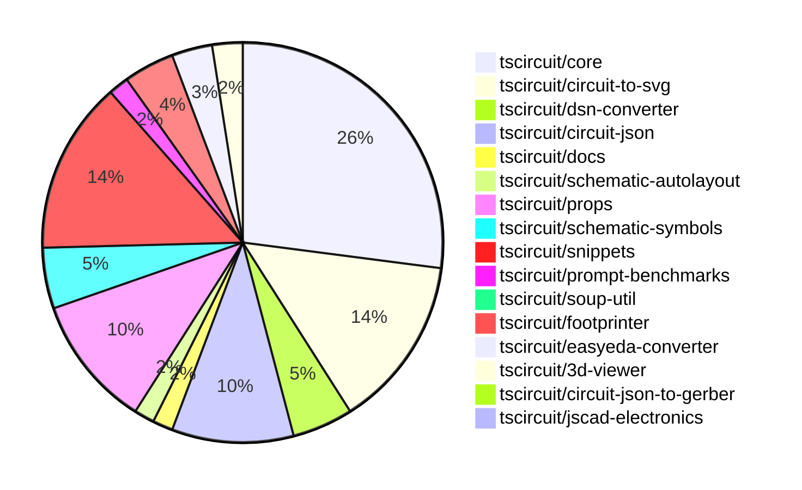

# Contribution Overview 2024-11-06

## PRs by Repository

## Contributor Overview

| Contributor | 🐳 Major | 🐙 Minor | 🐌 Tiny | ⭐ |
|-------------|-------|-------|-------|-------|
| [seveibar](#seveibar) | 17 | 49 | 2 | 👑👑👑 |
| [imrishabh18](#imrishabh18) | 5 | 19 | 1 | 👑 |
| [anas-sarkez](#anas-sarkez) | 7 | 0 | 0 | ⭐⭐ |
| [ShiboSoftwareDev](#ShiboSoftwareDev) | 3 | 7 | 0 | ⭐⭐ |
| [DhairyaMajmudar](#DhairyaMajmudar) | 1 | 1 | 0 | ⭐ |
| [Abse2001](#Abse2001) | 0 | 3 | 0 | ⭐ |
| [mrudulpatil18](#mrudulpatil18) | 0 | 3 | 0 | ⭐ |
| [andrii-balitskyi](#andrii-balitskyi) | 0 | 2 | 1 | ⭐ |
| [RohittCodes](#RohittCodes) | 0 | 2 | 0 | ⭐ |
| [tscircuitbot](#tscircuitbot) | 0 | 1 | 0 |  |
| [ahmedhalac](#ahmedhalac) | 0 | 1 | 0 |  |

## Changes by Repository

### [tscircuit/core](https://github.com/tscircuit/core)

| PR # | Impact | Contributor | Description |
|------|--------|-------------|-------------|
| [#300](https://github.com/tscircuit/core/pull/300) | 🐳 Major | imrishabh18 | Adds a new normal component called "Potentiometer" and updates the intrinsic JSX types to include it. |
| [#297](https://github.com/tscircuit/core/pull/297) | 🐳 Major | seveibar | Fixes a bug in the logic for handling complex crossings between schematic traces. |
| [#287](https://github.com/tscircuit/core/pull/287) | 🐳 Major | seveibar | Adds a new SVG image file that appears to be a snapshot of a complex schematic diagram with component crossings. |
| [#274](https://github.com/tscircuit/core/pull/274) | 🐳 Major | seveibar | Adds a new property `SupplierPartNumbers` to the `NormalComponent` class and introduces two new methods `doInitialPartsEngineRender()` and `updatePartsEngineRender()` to handle the rendering of the parts engine. |
| [#264](https://github.com/tscircuit/core/pull/264) | 🐳 Major | seveibar | Adds support for schematic symbol rotation in the `NormalComponent` and `PrimitiveComponent` classes. |
| [#260](https://github.com/tscircuit/core/pull/260) | 🐳 Major | seveibar | Introduces junction support for schematic traces, including fixes for bad trace pushes when connected to the same net. |
| [#257](https://github.com/tscircuit/core/pull/257) | 🐳 Major | seveibar | Implement a new feature to generate a "subcircuit_connectivity_map_key" for each trace in a subcircuit, which helps with tracing connectivity within the subcircuit. |
| [#252](https://github.com/tscircuit/core/pull/252) | 🐳 Major | seveibar | Adds `is_crossing` and splits schematic trace segments to enable the "trace hop" feature. |
| [#251](https://github.com/tscircuit/core/pull/251) | 🐳 Major | seveibar | Fixes schematic trace overlap by pushing traces away from other traces. |
| [#247](https://github.com/tscircuit/core/pull/247) | 🐳 Major | seveibar | Adds `display_pin_label` to schematic ports and `symbol_display_value` to schematic components. |
| [#253](https://github.com/tscircuit/core/pull/253) | 🐳 Major | DhairyaMajmudar | Adds error handling for missing footprints in the `NormalComponent` class. |
| [#268](https://github.com/tscircuit/core/pull/268) | 🐳 Major | ShiboSoftwareDev | Added capacitor, inductor, diode, and LED schematic symbol support with rotation |
| [#295](https://github.com/tscircuit/core/pull/295) | 🐙 Minor | imrishabh18 | Add padding to the box only when the label is present |
| [#294](https://github.com/tscircuit/core/pull/294) | 🐙 Minor | imrishabh18 | Adds a new `facingDirection` prop to the `PinHeader` component, which determines the arrangement of the component pins. |
| [#270](https://github.com/tscircuit/core/pull/270) | 🐙 Minor | imrishabh18 | The normalize function for pin labels has been moved from the easyeda module to the core utility module. |
| [#245](https://github.com/tscircuit/core/pull/245) | 🐙 Minor | imrishabh18 | Fix an issue where port dots were displayed in the center of the chip component when a port arrangement was present. |
| [#303](https://github.com/tscircuit/core/pull/303) | 🐙 Minor | seveibar | Add directional symbol names for PrimitiveComponent |
| [#299](https://github.com/tscircuit/core/pull/299) | 🐙 Minor | seveibar | Fixes a simplified overshot check in the `create-schematic-trace-crossing-segments.ts` file. |
| [#296](https://github.com/tscircuit/core/pull/296) | 🐙 Minor | seveibar | Fixes the facing direction of net labels in the Port component. |
| [#292](https://github.com/tscircuit/core/pull/292) | 🐙 Minor | seveibar | The pull request allows the `schPortArrangement` property to accept string values instead of just numbers. |
| [#285](https://github.com/tscircuit/core/pull/285) | 🐙 Minor | seveibar | Fix stub edges not appearing for some edges |
| [#284](https://github.com/tscircuit/core/pull/284) | 🐙 Minor | seveibar | Fixes a visual bug in the crossing direction calculation for schematic traces. |
| [#283](https://github.com/tscircuit/core/pull/283) | 🐙 Minor | seveibar | Increases the line thickness of schematic traces to prevent overlap, and updates a dependency. |
| [#277](https://github.com/tscircuit/core/pull/277) | 🐙 Minor | seveibar | Adapt parts engine to use footprinterString |
| [#262](https://github.com/tscircuit/core/pull/262) | 🐙 Minor | seveibar | Fixes an issue where props were not being parsed correctly when rendering a schematic component with rotation. |
| [#261](https://github.com/tscircuit/core/pull/261) | 🐙 Minor | seveibar | Add anchor_position to schematic_net_label and create new net labels when a schematic trace is connected to a net on one side. |
| [#269](https://github.com/tscircuit/core/pull/269) | 🐙 Minor | ShiboSoftwareDev | The change makes the `schematic_port.facing_direction` property more accurate by using the `localPortInfo.side` property to determine the facing direction. |
| [#259](https://github.com/tscircuit/core/pull/259) | 🐙 Minor | ShiboSoftwareDev | The schematic box components now expand to fit the label text. |
| [#244](https://github.com/tscircuit/core/pull/244) | 🐙 Minor | andrii-balitskyi | Add a GitHub Actions workflow to automatically format the code on pull requests. |
| [#243](https://github.com/tscircuit/core/pull/243) | 🐙 Minor | andrii-balitskyi | Add a new `useLed` hook for creating LED components in a circuit. |
| [#275](https://github.com/tscircuit/core/pull/275) | 🐌 Tiny | imrishabh18 | Reduces the size dependency of the `@tscircuit/schematic-autolayout` package from `0.0.5` to `0.0.6`. |
| [#305](https://github.com/tscircuit/core/pull/305) | 🐌 Tiny | seveibar | Updates the version of the 'schematic-symbols' package in the 'package.json' file. |
| [#242](https://github.com/tscircuit/core/pull/242) | 🐌 Tiny | andrii-balitskyi | Adds a test for the `useDiode` hook to ensure it creates components with correct props and traces. |

### [tscircuit/circuit-to-svg](https://github.com/tscircuit/circuit-to-svg)

| PR # | Impact | Contributor | Description |
|------|--------|-------------|-------------|
| [#106](https://github.com/tscircuit/circuit-to-svg/pull/106) | 🐳 Major | imrishabh18 | Adds support for rendering schematic net labels in the circuit JSON to SVG conversion. |
| [#117](https://github.com/tscircuit/circuit-to-svg/pull/117) | 🐳 Major | seveibar | Adds nonexistent symbol handling and error message when symbol ports don't align |
| [#113](https://github.com/tscircuit/circuit-to-svg/pull/113) | 🐳 Major | seveibar | Introduces comprehensive calculations for the size and position of netlabel text, including support for `center` and `anchor_position`. |
| [#112](https://github.com/tscircuit/circuit-to-svg/pull/112) | 🐳 Major | seveibar | Adds support for junctions and improves the drawing of wire crossings in the schematic SVG objects. |
| [#110](https://github.com/tscircuit/circuit-to-svg/pull/110) | 🐳 Major | seveibar | Adds support for rendering crossing traces in the schematic SVG objects. |
| [#120](https://github.com/tscircuit/circuit-to-svg/pull/120) | 🐙 Minor | imrishabh18 | Fixed the top and bottom anchor position of the SVG text objects for schematic net labels. |
| [#115](https://github.com/tscircuit/circuit-to-svg/pull/115) | 🐙 Minor | imrishabh18 | Use the source port name for the pin text instead of the pin number |
| [#127](https://github.com/tscircuit/circuit-to-svg/pull/127) | 🐙 Minor | seveibar | Change the dependencies of the package to make `schematic-symbols` and `circuit-json` peer dependencies instead of regular dependencies. |
| [#126](https://github.com/tscircuit/circuit-to-svg/pull/126) | 🐙 Minor | seveibar | Fix issues with the schematic grid not appearing at boundaries and traces not being used in bounds calculation. |
| [#124](https://github.com/tscircuit/circuit-to-svg/pull/124) | 🐙 Minor | seveibar | Change the trace color on hover and make the paths rounded |
| [#121](https://github.com/tscircuit/circuit-to-svg/pull/121) | 🐙 Minor | seveibar | Reverts the previous fix for the top and bottom anchor position of the net label. |
| [#116](https://github.com/tscircuit/circuit-to-svg/pull/116) | 🐙 Minor | seveibar | Revert the change to use the source port name for the pin text. |
| [#111](https://github.com/tscircuit/circuit-to-svg/pull/111) | 🐙 Minor | seveibar | Fix labelled points not appearing at correct position, make them sans-serif |
| [#109](https://github.com/tscircuit/circuit-to-svg/pull/109) | 🐙 Minor | seveibar | Fixes schematic port label name, anchoring of bottom text on components, and updates the core library. |
| [#108](https://github.com/tscircuit/circuit-to-svg/pull/108) | 🐙 Minor | seveibar | Change the way symbol values are displayed by using `symbol_display_value` instead of other properties. |
| [#107](https://github.com/tscircuit/circuit-to-svg/pull/107) | 🐙 Minor | seveibar | The change adds a GitHub Actions workflow to check the code formatting using the `biome` tool, and also adds a `noConsole` rule to the Biome configuration. |
| [#114](https://github.com/tscircuit/circuit-to-svg/pull/114) | 🐙 Minor | ShiboSoftwareDev | Adds an option to draw PCB trace errors in the SVG output. |

### [tscircuit/dsn-converter](https://github.com/tscircuit/dsn-converter)

| PR # | Impact | Contributor | Description |
|------|--------|-------------|-------------|
| [#19](https://github.com/tscircuit/dsn-converter/pull/19) | 🐳 Major | imrishabh18 | Adds support for plated holes and rotation on surface mount pads in the PCB conversion process. |
| [#16](https://github.com/tscircuit/dsn-converter/pull/16) | 🐳 Major | imrishabh18 | Fix to convert circuit JSON to DSN file |
| [#13](https://github.com/tscircuit/dsn-converter/pull/13) | 🐳 Major | imrishabh18 | Adds functionality to convert circuit JSON to DSN JSON format and vice versa. |
| [#18](https://github.com/tscircuit/dsn-converter/pull/18) | 🐙 Minor | imrishabh18 | Removes the processing of traces, as they will be handled by the freerouting's autorouter instead. |
| [#15](https://github.com/tscircuit/dsn-converter/pull/15) | 🐙 Minor | imrishabh18 | Add support for the polygon shape in the conversion of padstacks to SMT pads. |
| [#14](https://github.com/tscircuit/dsn-converter/pull/14) | 🐙 Minor | seveibar | Update the README file with more detailed usage examples and type support information. |

### [tscircuit/circuit-json](https://github.com/tscircuit/circuit-json)

| PR # | Impact | Contributor | Description |
|------|--------|-------------|-------------|
| [#78](https://github.com/tscircuit/circuit-json/pull/78) | 🐳 Major | seveibar | Adds a new source component overview documentation file and improves the `expectTypesMatch` function. |
| [#80](https://github.com/tscircuit/circuit-json/pull/80) | 🐙 Minor | imrishabh18 | Adds support for the "source_simple_potentiometer" component in the circuit elements and source components. |
| [#79](https://github.com/tscircuit/circuit-json/pull/79) | 🐙 Minor | imrishabh18 | Adds a new source component called "simple_potentiometer" with a "max_resistance" field. |
| [#74](https://github.com/tscircuit/circuit-json/pull/74) | 🐙 Minor | seveibar | Add `anchor_position` and `symbol_name` fields to the `SchematicNetLabelInput` type. |
| [#63](https://github.com/tscircuit/circuit-json/pull/63) | 🐙 Minor | seveibar | The pull request improves the definition of the `schematic_debug_object` by introducing explicit interfaces for `SchematicDebugRect` and `SchematicDebugLine`, and ensuring the types are properly matched. |
| [#73](https://github.com/tscircuit/circuit-json/pull/73) | 🐙 Minor | seveibar | Adds a new field "junctions" to the "SchematicTrace" type, which is an array of objects with x and y coordinates. |
| [#72](https://github.com/tscircuit/circuit-json/pull/72) | 🐙 Minor | seveibar | Add a new optional field `is_crossing` to `SchematicTraceEdge` in the `schematic_trace.ts` file. |
| [#70](https://github.com/tscircuit/circuit-json/pull/70) | 🐙 Minor | seveibar | Fixes a bug in unitless resistance parsing. |
| [#69](https://github.com/tscircuit/circuit-json/pull/69) | 🐙 Minor | seveibar | Refactor the schematic component to use a zodless type, add a new `symbol_display_value` field. |
| [#68](https://github.com/tscircuit/circuit-json/pull/68) | 🐙 Minor | seveibar | Add a new optional field `display_pin_label` to the `SchematicPort` interface and the corresponding `schematic_port` Zod schema. |
| [#77](https://github.com/tscircuit/circuit-json/pull/77) | 🐙 Minor | DhairyaMajmudar | Adds a new PCBMissingFootprintError component to the project. |
| [#76](https://github.com/tscircuit/circuit-json/pull/76) | 🐙 Minor | Abse2001 | Added a new source component, a simple push button. |

### [tscircuit/docs](https://github.com/tscircuit/docs)

| PR # | Impact | Contributor | Description |
|------|--------|-------------|-------------|
| [#37](https://github.com/tscircuit/docs/pull/37) | 🐙 Minor | imrishabh18 | Add documentation for the motor driver circuit |
| [#36](https://github.com/tscircuit/docs/pull/36) | 🐙 Minor | ShiboSoftwareDev | Added a new tutorial for a pushbutton LED circuit, including 3D, PCB, and schematic images. |

### [tscircuit/schematic-autolayout](https://github.com/tscircuit/schematic-autolayout)

| PR # | Impact | Contributor | Description |
|------|--------|-------------|-------------|
| [#4](https://github.com/tscircuit/schematic-autolayout/pull/4) | 🐙 Minor | imrishabh18 | Add the auto publish workflow to publish the package to npm on push to the main branch. |
| [#3](https://github.com/tscircuit/schematic-autolayout/pull/3) | 🐙 Minor | imrishabh18 | Update dependency and refactor the project by migrating to `bun` from `npm`, moving dependency to `devDependency` to reduce size, using `tsup-node` for bundling, and removing the `builder`. |

### [tscircuit/props](https://github.com/tscircuit/props)

| PR # | Impact | Contributor | Description |
|------|--------|-------------|-------------|
| [#96](https://github.com/tscircuit/props/pull/96) | 🐙 Minor | imrishabh18 | Introduces a new component, "potentiometer", and the corresponding props and pins. |
| [#93](https://github.com/tscircuit/props/pull/93) | 🐙 Minor | imrishabh18 | Adds the ability to specify the facing direction of the pin header. |
| [#80](https://github.com/tscircuit/props/pull/80) | 🐙 Minor | imrishabh18 | Refactor to replace "soup" dependency with "circuit-json" dependency |
| [#79](https://github.com/tscircuit/props/pull/79) | 🐙 Minor | imrishabh18 | Adds support for pins defined as strings in the `PinSideDefinition` interface. |
| [#92](https://github.com/tscircuit/props/pull/92) | 🐙 Minor | seveibar | Allow strings and numbers to be defined together for pinLabels, and improve `expectTypesMatch` errors. |
| [#90](https://github.com/tscircuit/props/pull/90) | 🐙 Minor | seveibar | Adds an optional `footprinterString` parameter to the `findPart` function in the `PartsEngine` type. |
| [#89](https://github.com/tscircuit/props/pull/89) | 🐙 Minor | seveibar | Adds a new option `minTraceWidth` to subcircuits. |
| [#88](https://github.com/tscircuit/props/pull/88) | 🐙 Minor | seveibar | Fix the `schRotation` property for the `NetAlias` component. |
| [#87](https://github.com/tscircuit/props/pull/87) | 🐙 Minor | seveibar | Introduce partsEngine prop, minor refactoring, fix netalias schX definition |
| [#83](https://github.com/tscircuit/props/pull/83) | 🐙 Minor | seveibar | Add `netAlias` props to the library |
| [#82](https://github.com/tscircuit/props/pull/82) | 🐙 Minor | seveibar | Change the type of `pinLabels` in the `ChipProps` interface to accept a readonly array of strings. |
| [#84](https://github.com/tscircuit/props/pull/84) | 🐙 Minor | Abse2001 | Adds a new `push-button` component with `commonComponentProps` as its base |
| [#86](https://github.com/tscircuit/props/pull/86) | 🐙 Minor | tscircuitbot | Add a new optional boolean property 'polarized' with a default value of false to the CapacitorProps interface and the capacitorProps object. |

### [tscircuit/schematic-symbols](https://github.com/tscircuit/schematic-symbols)

| PR # | Impact | Contributor | Description |
|------|--------|-------------|-------------|
| [#198](https://github.com/tscircuit/schematic-symbols/pull/198) | 🐳 Major | anas-sarkez | Implemented flipSymbolOverYAxis and flipSymbolOverXAxis functions to modify LED arrows directions |
| [#195](https://github.com/tscircuit/schematic-symbols/pull/195) | 🐳 Major | anas-sarkez | Changes the LED symbol to have 4 directions (up, right, left, down) instead of horizontal and vertical. |
| [#194](https://github.com/tscircuit/schematic-symbols/pull/194) | 🐳 Major | anas-sarkez | Refactor the `rotateAnchor` function to handle all orientations (`up`, `down`, `left`, `right`) instead of just the `middle_top` and `middle_bottom` cases. |
| [#190](https://github.com/tscircuit/schematic-symbols/pull/190) | 🐳 Major | anas-sarkez | Diode components now have left/right/up/down variants instead of horizontal/vertical variants. |
| [#197](https://github.com/tscircuit/schematic-symbols/pull/197) | 🐙 Minor | imrishabh18 | Fix the label position for the horizontal potentiometer symbol. |
| [#199](https://github.com/tscircuit/schematic-symbols/pull/199) | 🐙 Minor | seveibar | Adds new capacitor symbols for different directions (down, left, right, up) |

### [tscircuit/snippets](https://github.com/tscircuit/snippets)

| PR # | Impact | Contributor | Description |
|------|--------|-------------|-------------|
| [#196](https://github.com/tscircuit/snippets/pull/196) | 🐳 Major | seveibar | Adds support for async circuit rendering and opens BOM links in a new tab |
| [#186](https://github.com/tscircuit/snippets/pull/186) | 🐳 Major | seveibar | Integrates the Parts Engine and refactors test file locations. |
| [#208](https://github.com/tscircuit/snippets/pull/208) | 🐙 Minor | imrishabh18 | Adds a feature to download the DSN file for the circuit |
| [#220](https://github.com/tscircuit/snippets/pull/220) | 🐙 Minor | seveibar | Update the core and circuit-to-svg packages to fix capacitor rotation issues |
| [#213](https://github.com/tscircuit/snippets/pull/213) | 🐙 Minor | seveibar | The pull request improves the reloading of the PCB viewer by using a unique key for the PCB viewer component based on the `circuitJsonKey` value. |
| [#192](https://github.com/tscircuit/snippets/pull/192) | 🐙 Minor | seveibar | Adds a new BOM (Bill of Materials) table component and a dropdown menu for switching between different preview views (e.g., code, PCB, BOM). |
| [#188](https://github.com/tscircuit/snippets/pull/188) | 🐙 Minor | seveibar | Update the `@tscircuit/core` dependency to version `0.0.170` and add a Renovate configuration file to automatically update packages. |
| [#185](https://github.com/tscircuit/snippets/pull/185) | 🐙 Minor | seveibar | Add a new API endpoint to fetch trending snippets based on recent star counts. |
| [#173](https://github.com/tscircuit/snippets/pull/173) | 🐙 Minor | seveibar | Update dependencies for `@tscircuit/core` and `circuit-to-svg` |
| [#169](https://github.com/tscircuit/snippets/pull/169) | 🐙 Minor | seveibar | Update dependencies (core and circuit-to-svg), swap schematic viewer to circuit-to-svg with mouse controls |
| [#183](https://github.com/tscircuit/snippets/pull/183) | 🐙 Minor | Abse2001 | Updated dependencies in the project |
| [#206](https://github.com/tscircuit/snippets/pull/206) | 🐙 Minor | mrudulpatil18 | Adds a new field `circuit_json` to the snippet schema to store the circuit JSON data. |
| [#176](https://github.com/tscircuit/snippets/pull/176) | 🐙 Minor | mrudulpatil18 | Adds keyboard navigation and selection functionality to the CmdKMenu, and introduces a new footer section with shortcut information. |
| [#170](https://github.com/tscircuit/snippets/pull/170) | 🐙 Minor | mrudulpatil18 | Added functionality to change the snippet type. |
| [#182](https://github.com/tscircuit/snippets/pull/182) | 🐙 Minor | RohittCodes | Refactors the search text component to fix Playwright tests for small and medium-sized devices. |
| [#178](https://github.com/tscircuit/snippets/pull/178) | 🐙 Minor | RohittCodes | Adds a zoom effect to the schematic view by setting the `transformOrigin` CSS property. |
| [#184](https://github.com/tscircuit/snippets/pull/184) | 🐙 Minor | ahmedhalac | Added copy to clipboard functionality to the ViewSnippetSidebar component. |

### [tscircuit/prompt-benchmarks](https://github.com/tscircuit/prompt-benchmarks)

| PR # | Impact | Contributor | Description |
|------|--------|-------------|-------------|
| [#5](https://github.com/tscircuit/prompt-benchmarks/pull/5) | 🐳 Major | seveibar | Introduces a new prompt template for creating circuit board 2 with tscircuit snippets integration. |
| [#4](https://github.com/tscircuit/prompt-benchmarks/pull/4) | 🐙 Minor | seveibar | Adds new prompt templates for creating circuit board and module samples |

### [tscircuit/soup-util](https://github.com/tscircuit/soup-util)

| PR # | Impact | Contributor | Description |
|------|--------|-------------|-------------|
| [#24](https://github.com/tscircuit/soup-util/pull/24) | 🐙 Minor | seveibar | Fix update method to update the correct objects based on the component type and id. |

### [tscircuit/footprinter](https://github.com/tscircuit/footprinter)

| PR # | Impact | Contributor | Description |
|------|--------|-------------|-------------|
| [#78](https://github.com/tscircuit/footprinter/pull/78) | 🐳 Major | anas-sarkez | Implemented sot235 (sot23-5) footprint with testing |
| [#81](https://github.com/tscircuit/footprinter/pull/81) | 🐙 Minor | seveibar | Adds a new test case for generating an SVG image of a PCB with a custom-sized thermal pad. |
| [#80](https://github.com/tscircuit/footprinter/pull/80) | 🐙 Minor | seveibar | Change the default outer diameter of plated holes to 1.5mm |
| [#77](https://github.com/tscircuit/footprinter/pull/77) | 🐙 Minor | ShiboSoftwareDev | The `getFootprintNames` function has been moved from a standalone export to a method of the `footprinter` object. |
| [#76](https://github.com/tscircuit/footprinter/pull/76) | 🐙 Minor | ShiboSoftwareDev | Adds a new method `getFootprintNames()` to the `Footprinter` object to retrieve an array of footprint names. |

### [tscircuit/easyeda-converter](https://github.com/tscircuit/easyeda-converter)

| PR # | Impact | Contributor | Description |
|------|--------|-------------|-------------|
| [#112](https://github.com/tscircuit/easyeda-converter/pull/112) | 🐙 Minor | seveibar | Fix to ensure that short part numbers are fetched correctly from the EasyEDA API. |
| [#108](https://github.com/tscircuit/easyeda-converter/pull/108) | 🐙 Minor | seveibar | Add the `manufacturerPartNumber` prop to the `soupTypescriptComponentTemplate` function and the component it generates. |
| [#107](https://github.com/tscircuit/easyeda-converter/pull/107) | 🐙 Minor | seveibar | Change the supplier part numbers from LCSC to JLCPCB. |
| [#101](https://github.com/tscircuit/easyeda-converter/pull/101) | 🐌 Tiny | seveibar | Remove the `schPinSpacing` prop from the `SoupTypescriptComponentTemplate` component. |

### [tscircuit/3d-viewer](https://github.com/tscircuit/3d-viewer)

| PR # | Impact | Contributor | Description |
|------|--------|-------------|-------------|
| [#33](https://github.com/tscircuit/3d-viewer/pull/33) | 🐳 Major | ShiboSoftwareDev | Adds a feature to hover over a component and view its reference designator. |
| [#38](https://github.com/tscircuit/3d-viewer/pull/38) | 🐳 Major | anas-sarkez | The change adds support for pill-shaped board cutout (holes) in the 3D viewer. |
| [#34](https://github.com/tscircuit/3d-viewer/pull/34) | 🐙 Minor | ShiboSoftwareDev | Changed the highlight color of the JscadModel component from a dim red to a bright blue. |

### [tscircuit/circuit-json-to-gerber](https://github.com/tscircuit/circuit-json-to-gerber)

| PR # | Impact | Contributor | Description |
|------|--------|-------------|-------------|
| [#27](https://github.com/tscircuit/circuit-json-to-gerber/pull/27) | 🐳 Major | ShiboSoftwareDev | Added support for silkscreen text in the gerber conversion process. |

### [tscircuit/jscad-electronics](https://github.com/tscircuit/jscad-electronics)

| PR # | Impact | Contributor | Description |
|------|--------|-------------|-------------|
| [#78](https://github.com/tscircuit/jscad-electronics/pull/78) | 🐳 Major | anas-sarkez | Refactors the QFN 3D element and adds a QFN Footprinter3d example. |

## Changes by Contributor

### [imrishabh18](https://github.com/imrishabh18)

| PR # | Impact | Description |
|------|--------|-------------|
| [#300](https://github.com/tscircuit/core/pull/300) | 🐳 Major | Adds a new normal component called "Potentiometer" and updates the intrinsic JSX types to include it. |
| [#106](https://github.com/tscircuit/circuit-to-svg/pull/106) | 🐳 Major | Adds support for rendering schematic net labels in the circuit JSON to SVG conversion. |
| [#19](https://github.com/tscircuit/dsn-converter/pull/19) | 🐳 Major | Adds support for plated holes and rotation on surface mount pads in the PCB conversion process. |
| [#16](https://github.com/tscircuit/dsn-converter/pull/16) | 🐳 Major | Fix to convert circuit JSON to DSN file |
| [#13](https://github.com/tscircuit/dsn-converter/pull/13) | 🐳 Major | Adds functionality to convert circuit JSON to DSN JSON format and vice versa. |
| [#80](https://github.com/tscircuit/circuit-json/pull/80) | 🐙 Minor | Adds support for the "source_simple_potentiometer" component in the circuit elements and source components. |
| [#79](https://github.com/tscircuit/circuit-json/pull/79) | 🐙 Minor | Adds a new source component called "simple_potentiometer" with a "max_resistance" field. |
| [#37](https://github.com/tscircuit/docs/pull/37) | 🐙 Minor | Add documentation for the motor driver circuit |
| [#4](https://github.com/tscircuit/schematic-autolayout/pull/4) | 🐙 Minor | Add the auto publish workflow to publish the package to npm on push to the main branch. |
| [#3](https://github.com/tscircuit/schematic-autolayout/pull/3) | 🐙 Minor | Update dependency and refactor the project by migrating to `bun` from `npm`, moving dependency to `devDependency` to reduce size, using `tsup-node` for bundling, and removing the `builder`. |
| [#96](https://github.com/tscircuit/props/pull/96) | 🐙 Minor | Introduces a new component, "potentiometer", and the corresponding props and pins. |
| [#93](https://github.com/tscircuit/props/pull/93) | 🐙 Minor | Adds the ability to specify the facing direction of the pin header. |
| [#80](https://github.com/tscircuit/props/pull/80) | 🐙 Minor | Refactor to replace "soup" dependency with "circuit-json" dependency |
| [#79](https://github.com/tscircuit/props/pull/79) | 🐙 Minor | Adds support for pins defined as strings in the `PinSideDefinition` interface. |
| [#295](https://github.com/tscircuit/core/pull/295) | 🐙 Minor | Add padding to the box only when the label is present |
| [#294](https://github.com/tscircuit/core/pull/294) | 🐙 Minor | Adds a new `facingDirection` prop to the `PinHeader` component, which determines the arrangement of the component pins. |
| [#270](https://github.com/tscircuit/core/pull/270) | 🐙 Minor | The normalize function for pin labels has been moved from the easyeda module to the core utility module. |
| [#245](https://github.com/tscircuit/core/pull/245) | 🐙 Minor | Fix an issue where port dots were displayed in the center of the chip component when a port arrangement was present. |
| [#120](https://github.com/tscircuit/circuit-to-svg/pull/120) | 🐙 Minor | Fixed the top and bottom anchor position of the SVG text objects for schematic net labels. |
| [#115](https://github.com/tscircuit/circuit-to-svg/pull/115) | 🐙 Minor | Use the source port name for the pin text instead of the pin number |
| [#197](https://github.com/tscircuit/schematic-symbols/pull/197) | 🐙 Minor | Fix the label position for the horizontal potentiometer symbol. |
| [#18](https://github.com/tscircuit/dsn-converter/pull/18) | 🐙 Minor | Removes the processing of traces, as they will be handled by the freerouting's autorouter instead. |
| [#15](https://github.com/tscircuit/dsn-converter/pull/15) | 🐙 Minor | Add support for the polygon shape in the conversion of padstacks to SMT pads. |
| [#208](https://github.com/tscircuit/snippets/pull/208) | 🐙 Minor | Adds a feature to download the DSN file for the circuit |
| [#275](https://github.com/tscircuit/core/pull/275) | 🐌 Tiny | Reduces the size dependency of the `@tscircuit/schematic-autolayout` package from `0.0.5` to `0.0.6`. |

### [seveibar](https://github.com/seveibar)

| PR # | Impact | Description |
|------|--------|-------------|
| [#78](https://github.com/tscircuit/circuit-json/pull/78) | 🐳 Major | Adds a new source component overview documentation file and improves the `expectTypesMatch` function. |
| [#297](https://github.com/tscircuit/core/pull/297) | 🐳 Major | Fixes a bug in the logic for handling complex crossings between schematic traces. |
| [#287](https://github.com/tscircuit/core/pull/287) | 🐳 Major | Adds a new SVG image file that appears to be a snapshot of a complex schematic diagram with component crossings. |
| [#274](https://github.com/tscircuit/core/pull/274) | 🐳 Major | Adds a new property `SupplierPartNumbers` to the `NormalComponent` class and introduces two new methods `doInitialPartsEngineRender()` and `updatePartsEngineRender()` to handle the rendering of the parts engine. |
| [#264](https://github.com/tscircuit/core/pull/264) | 🐳 Major | Adds support for schematic symbol rotation in the `NormalComponent` and `PrimitiveComponent` classes. |
| [#260](https://github.com/tscircuit/core/pull/260) | 🐳 Major | Introduces junction support for schematic traces, including fixes for bad trace pushes when connected to the same net. |
| [#257](https://github.com/tscircuit/core/pull/257) | 🐳 Major | Implement a new feature to generate a "subcircuit_connectivity_map_key" for each trace in a subcircuit, which helps with tracing connectivity within the subcircuit. |
| [#252](https://github.com/tscircuit/core/pull/252) | 🐳 Major | Adds `is_crossing` and splits schematic trace segments to enable the "trace hop" feature. |
| [#251](https://github.com/tscircuit/core/pull/251) | 🐳 Major | Fixes schematic trace overlap by pushing traces away from other traces. |
| [#247](https://github.com/tscircuit/core/pull/247) | 🐳 Major | Adds `display_pin_label` to schematic ports and `symbol_display_value` to schematic components. |
| [#117](https://github.com/tscircuit/circuit-to-svg/pull/117) | 🐳 Major | Adds nonexistent symbol handling and error message when symbol ports don't align |
| [#113](https://github.com/tscircuit/circuit-to-svg/pull/113) | 🐳 Major | Introduces comprehensive calculations for the size and position of netlabel text, including support for `center` and `anchor_position`. |
| [#112](https://github.com/tscircuit/circuit-to-svg/pull/112) | 🐳 Major | Adds support for junctions and improves the drawing of wire crossings in the schematic SVG objects. |
| [#110](https://github.com/tscircuit/circuit-to-svg/pull/110) | 🐳 Major | Adds support for rendering crossing traces in the schematic SVG objects. |
| [#196](https://github.com/tscircuit/snippets/pull/196) | 🐳 Major | Adds support for async circuit rendering and opens BOM links in a new tab |
| [#186](https://github.com/tscircuit/snippets/pull/186) | 🐳 Major | Integrates the Parts Engine and refactors test file locations. |
| [#5](https://github.com/tscircuit/prompt-benchmarks/pull/5) | 🐳 Major | Introduces a new prompt template for creating circuit board 2 with tscircuit snippets integration. |
| [#74](https://github.com/tscircuit/circuit-json/pull/74) | 🐙 Minor | Add `anchor_position` and `symbol_name` fields to the `SchematicNetLabelInput` type. |
| [#63](https://github.com/tscircuit/circuit-json/pull/63) | 🐙 Minor | The pull request improves the definition of the `schematic_debug_object` by introducing explicit interfaces for `SchematicDebugRect` and `SchematicDebugLine`, and ensuring the types are properly matched. |
| [#73](https://github.com/tscircuit/circuit-json/pull/73) | 🐙 Minor | Adds a new field "junctions" to the "SchematicTrace" type, which is an array of objects with x and y coordinates. |
| [#72](https://github.com/tscircuit/circuit-json/pull/72) | 🐙 Minor | Add a new optional field `is_crossing` to `SchematicTraceEdge` in the `schematic_trace.ts` file. |
| [#70](https://github.com/tscircuit/circuit-json/pull/70) | 🐙 Minor | Fixes a bug in unitless resistance parsing. |
| [#69](https://github.com/tscircuit/circuit-json/pull/69) | 🐙 Minor | Refactor the schematic component to use a zodless type, add a new `symbol_display_value` field. |
| [#68](https://github.com/tscircuit/circuit-json/pull/68) | 🐙 Minor | Add a new optional field `display_pin_label` to the `SchematicPort` interface and the corresponding `schematic_port` Zod schema. |
| [#24](https://github.com/tscircuit/soup-util/pull/24) | 🐙 Minor | Fix update method to update the correct objects based on the component type and id. |
| [#92](https://github.com/tscircuit/props/pull/92) | 🐙 Minor | Allow strings and numbers to be defined together for pinLabels, and improve `expectTypesMatch` errors. |
| [#90](https://github.com/tscircuit/props/pull/90) | 🐙 Minor | Adds an optional `footprinterString` parameter to the `findPart` function in the `PartsEngine` type. |
| [#89](https://github.com/tscircuit/props/pull/89) | 🐙 Minor | Adds a new option `minTraceWidth` to subcircuits. |
| [#88](https://github.com/tscircuit/props/pull/88) | 🐙 Minor | Fix the `schRotation` property for the `NetAlias` component. |
| [#87](https://github.com/tscircuit/props/pull/87) | 🐙 Minor | Introduce partsEngine prop, minor refactoring, fix netalias schX definition |
| [#83](https://github.com/tscircuit/props/pull/83) | 🐙 Minor | Add `netAlias` props to the library |
| [#82](https://github.com/tscircuit/props/pull/82) | 🐙 Minor | Change the type of `pinLabels` in the `ChipProps` interface to accept a readonly array of strings. |
| [#81](https://github.com/tscircuit/footprinter/pull/81) | 🐙 Minor | Adds a new test case for generating an SVG image of a PCB with a custom-sized thermal pad. |
| [#80](https://github.com/tscircuit/footprinter/pull/80) | 🐙 Minor | Change the default outer diameter of plated holes to 1.5mm |
| [#112](https://github.com/tscircuit/easyeda-converter/pull/112) | 🐙 Minor | Fix to ensure that short part numbers are fetched correctly from the EasyEDA API. |
| [#108](https://github.com/tscircuit/easyeda-converter/pull/108) | 🐙 Minor | Add the `manufacturerPartNumber` prop to the `soupTypescriptComponentTemplate` function and the component it generates. |
| [#107](https://github.com/tscircuit/easyeda-converter/pull/107) | 🐙 Minor | Change the supplier part numbers from LCSC to JLCPCB. |
| [#303](https://github.com/tscircuit/core/pull/303) | 🐙 Minor | Add directional symbol names for PrimitiveComponent |
| [#299](https://github.com/tscircuit/core/pull/299) | 🐙 Minor | Fixes a simplified overshot check in the `create-schematic-trace-crossing-segments.ts` file. |
| [#296](https://github.com/tscircuit/core/pull/296) | 🐙 Minor | Fixes the facing direction of net labels in the Port component. |
| [#292](https://github.com/tscircuit/core/pull/292) | 🐙 Minor | The pull request allows the `schPortArrangement` property to accept string values instead of just numbers. |
| [#285](https://github.com/tscircuit/core/pull/285) | 🐙 Minor | Fix stub edges not appearing for some edges |
| [#284](https://github.com/tscircuit/core/pull/284) | 🐙 Minor | Fixes a visual bug in the crossing direction calculation for schematic traces. |
| [#283](https://github.com/tscircuit/core/pull/283) | 🐙 Minor | Increases the line thickness of schematic traces to prevent overlap, and updates a dependency. |
| [#277](https://github.com/tscircuit/core/pull/277) | 🐙 Minor | Adapt parts engine to use footprinterString |
| [#262](https://github.com/tscircuit/core/pull/262) | 🐙 Minor | Fixes an issue where props were not being parsed correctly when rendering a schematic component with rotation. |
| [#261](https://github.com/tscircuit/core/pull/261) | 🐙 Minor | Add anchor_position to schematic_net_label and create new net labels when a schematic trace is connected to a net on one side. |
| [#127](https://github.com/tscircuit/circuit-to-svg/pull/127) | 🐙 Minor | Change the dependencies of the package to make `schematic-symbols` and `circuit-json` peer dependencies instead of regular dependencies. |
| [#126](https://github.com/tscircuit/circuit-to-svg/pull/126) | 🐙 Minor | Fix issues with the schematic grid not appearing at boundaries and traces not being used in bounds calculation. |
| [#124](https://github.com/tscircuit/circuit-to-svg/pull/124) | 🐙 Minor | Change the trace color on hover and make the paths rounded |
| [#121](https://github.com/tscircuit/circuit-to-svg/pull/121) | 🐙 Minor | Reverts the previous fix for the top and bottom anchor position of the net label. |
| [#116](https://github.com/tscircuit/circuit-to-svg/pull/116) | 🐙 Minor | Revert the change to use the source port name for the pin text. |
| [#111](https://github.com/tscircuit/circuit-to-svg/pull/111) | 🐙 Minor | Fix labelled points not appearing at correct position, make them sans-serif |
| [#109](https://github.com/tscircuit/circuit-to-svg/pull/109) | 🐙 Minor | Fixes schematic port label name, anchoring of bottom text on components, and updates the core library. |
| [#108](https://github.com/tscircuit/circuit-to-svg/pull/108) | 🐙 Minor | Change the way symbol values are displayed by using `symbol_display_value` instead of other properties. |
| [#107](https://github.com/tscircuit/circuit-to-svg/pull/107) | 🐙 Minor | The change adds a GitHub Actions workflow to check the code formatting using the `biome` tool, and also adds a `noConsole` rule to the Biome configuration. |
| [#199](https://github.com/tscircuit/schematic-symbols/pull/199) | 🐙 Minor | Adds new capacitor symbols for different directions (down, left, right, up) |
| [#14](https://github.com/tscircuit/dsn-converter/pull/14) | 🐙 Minor | Update the README file with more detailed usage examples and type support information. |
| [#220](https://github.com/tscircuit/snippets/pull/220) | 🐙 Minor | Update the core and circuit-to-svg packages to fix capacitor rotation issues |
| [#213](https://github.com/tscircuit/snippets/pull/213) | 🐙 Minor | The pull request improves the reloading of the PCB viewer by using a unique key for the PCB viewer component based on the `circuitJsonKey` value. |
| [#192](https://github.com/tscircuit/snippets/pull/192) | 🐙 Minor | Adds a new BOM (Bill of Materials) table component and a dropdown menu for switching between different preview views (e.g., code, PCB, BOM). |
| [#188](https://github.com/tscircuit/snippets/pull/188) | 🐙 Minor | Update the `@tscircuit/core` dependency to version `0.0.170` and add a Renovate configuration file to automatically update packages. |
| [#185](https://github.com/tscircuit/snippets/pull/185) | 🐙 Minor | Add a new API endpoint to fetch trending snippets based on recent star counts. |
| [#173](https://github.com/tscircuit/snippets/pull/173) | 🐙 Minor | Update dependencies for `@tscircuit/core` and `circuit-to-svg` |
| [#169](https://github.com/tscircuit/snippets/pull/169) | 🐙 Minor | Update dependencies (core and circuit-to-svg), swap schematic viewer to circuit-to-svg with mouse controls |
| [#4](https://github.com/tscircuit/prompt-benchmarks/pull/4) | 🐙 Minor | Adds new prompt templates for creating circuit board and module samples |
| [#101](https://github.com/tscircuit/easyeda-converter/pull/101) | 🐌 Tiny | Remove the `schPinSpacing` prop from the `SoupTypescriptComponentTemplate` component. |
| [#305](https://github.com/tscircuit/core/pull/305) | 🐌 Tiny | Updates the version of the 'schematic-symbols' package in the 'package.json' file. |

### [DhairyaMajmudar](https://github.com/DhairyaMajmudar)

| PR # | Impact | Description |
|------|--------|-------------|
| [#253](https://github.com/tscircuit/core/pull/253) | 🐳 Major | Adds error handling for missing footprints in the `NormalComponent` class. |
| [#77](https://github.com/tscircuit/circuit-json/pull/77) | 🐙 Minor | Adds a new PCBMissingFootprintError component to the project. |

### [Abse2001](https://github.com/Abse2001)

| PR # | Impact | Description |
|------|--------|-------------|
| [#76](https://github.com/tscircuit/circuit-json/pull/76) | 🐙 Minor | Added a new source component, a simple push button. |
| [#84](https://github.com/tscircuit/props/pull/84) | 🐙 Minor | Adds a new `push-button` component with `commonComponentProps` as its base |
| [#183](https://github.com/tscircuit/snippets/pull/183) | 🐙 Minor | Updated dependencies in the project |

### [ShiboSoftwareDev](https://github.com/ShiboSoftwareDev)

| PR # | Impact | Description |
|------|--------|-------------|
| [#33](https://github.com/tscircuit/3d-viewer/pull/33) | 🐳 Major | Adds a feature to hover over a component and view its reference designator. |
| [#268](https://github.com/tscircuit/core/pull/268) | 🐳 Major | Added capacitor, inductor, diode, and LED schematic symbol support with rotation |
| [#27](https://github.com/tscircuit/circuit-json-to-gerber/pull/27) | 🐳 Major | Added support for silkscreen text in the gerber conversion process. |
| [#36](https://github.com/tscircuit/docs/pull/36) | 🐙 Minor | Added a new tutorial for a pushbutton LED circuit, including 3D, PCB, and schematic images. |
| [#77](https://github.com/tscircuit/footprinter/pull/77) | 🐙 Minor | The `getFootprintNames` function has been moved from a standalone export to a method of the `footprinter` object. |
| [#76](https://github.com/tscircuit/footprinter/pull/76) | 🐙 Minor | Adds a new method `getFootprintNames()` to the `Footprinter` object to retrieve an array of footprint names. |
| [#34](https://github.com/tscircuit/3d-viewer/pull/34) | 🐙 Minor | Changed the highlight color of the JscadModel component from a dim red to a bright blue. |
| [#269](https://github.com/tscircuit/core/pull/269) | 🐙 Minor | The change makes the `schematic_port.facing_direction` property more accurate by using the `localPortInfo.side` property to determine the facing direction. |
| [#259](https://github.com/tscircuit/core/pull/259) | 🐙 Minor | The schematic box components now expand to fit the label text. |
| [#114](https://github.com/tscircuit/circuit-to-svg/pull/114) | 🐙 Minor | Adds an option to draw PCB trace errors in the SVG output. |

### [tscircuitbot](https://github.com/tscircuitbot)

| PR # | Impact | Description |
|------|--------|-------------|
| [#86](https://github.com/tscircuit/props/pull/86) | 🐙 Minor | Add a new optional boolean property 'polarized' with a default value of false to the CapacitorProps interface and the capacitorProps object. |

### [anas-sarkez](https://github.com/anas-sarkez)

| PR # | Impact | Description |
|------|--------|-------------|
| [#78](https://github.com/tscircuit/footprinter/pull/78) | 🐳 Major | Implemented sot235 (sot23-5) footprint with testing |
| [#38](https://github.com/tscircuit/3d-viewer/pull/38) | 🐳 Major | The change adds support for pill-shaped board cutout (holes) in the 3D viewer. |
| [#78](https://github.com/tscircuit/jscad-electronics/pull/78) | 🐳 Major | Refactors the QFN 3D element and adds a QFN Footprinter3d example. |
| [#198](https://github.com/tscircuit/schematic-symbols/pull/198) | 🐳 Major | Implemented flipSymbolOverYAxis and flipSymbolOverXAxis functions to modify LED arrows directions |
| [#195](https://github.com/tscircuit/schematic-symbols/pull/195) | 🐳 Major | Changes the LED symbol to have 4 directions (up, right, left, down) instead of horizontal and vertical. |
| [#194](https://github.com/tscircuit/schematic-symbols/pull/194) | 🐳 Major | Refactor the `rotateAnchor` function to handle all orientations (`up`, `down`, `left`, `right`) instead of just the `middle_top` and `middle_bottom` cases. |
| [#190](https://github.com/tscircuit/schematic-symbols/pull/190) | 🐳 Major | Diode components now have left/right/up/down variants instead of horizontal/vertical variants. |

### [andrii-balitskyi](https://github.com/andrii-balitskyi)

| PR # | Impact | Description |
|------|--------|-------------|
| [#244](https://github.com/tscircuit/core/pull/244) | 🐙 Minor | Add a GitHub Actions workflow to automatically format the code on pull requests. |
| [#243](https://github.com/tscircuit/core/pull/243) | 🐙 Minor | Add a new `useLed` hook for creating LED components in a circuit. |
| [#242](https://github.com/tscircuit/core/pull/242) | 🐌 Tiny | Adds a test for the `useDiode` hook to ensure it creates components with correct props and traces. |

### [mrudulpatil18](https://github.com/mrudulpatil18)

| PR # | Impact | Description |
|------|--------|-------------|
| [#206](https://github.com/tscircuit/snippets/pull/206) | 🐙 Minor | Adds a new field `circuit_json` to the snippet schema to store the circuit JSON data. |
| [#176](https://github.com/tscircuit/snippets/pull/176) | 🐙 Minor | Adds keyboard navigation and selection functionality to the CmdKMenu, and introduces a new footer section with shortcut information. |
| [#170](https://github.com/tscircuit/snippets/pull/170) | 🐙 Minor | Added functionality to change the snippet type. |

### [RohittCodes](https://github.com/RohittCodes)

| PR # | Impact | Description |
|------|--------|-------------|
| [#182](https://github.com/tscircuit/snippets/pull/182) | 🐙 Minor | Refactors the search text component to fix Playwright tests for small and medium-sized devices. |
| [#178](https://github.com/tscircuit/snippets/pull/178) | 🐙 Minor | Adds a zoom effect to the schematic view by setting the `transformOrigin` CSS property. |

### [ahmedhalac](https://github.com/ahmedhalac)

| PR # | Impact | Description |
|------|--------|-------------|
| [#184](https://github.com/tscircuit/snippets/pull/184) | 🐙 Minor | Added copy to clipboard functionality to the ViewSnippetSidebar component. |

