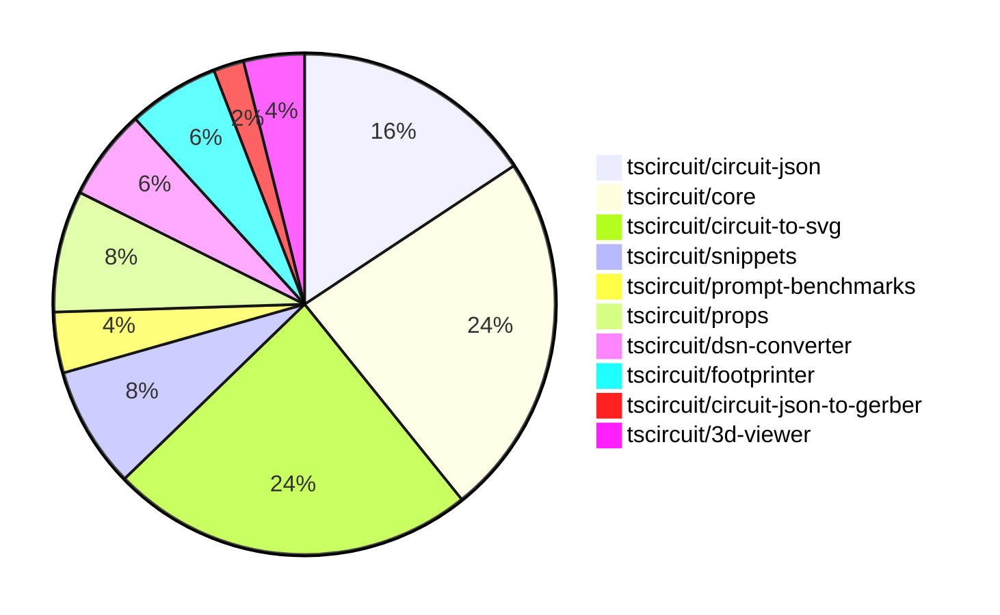

# Contribution Overview 2024-11-06

## PRs by Repository

## Contributor Overview

| Contributor | 🐳 Major | 🐙 Minor | 🐌 Tiny | ⭐ |
|-------------|-------|-------|-------|-------|
| [seveibar](#seveibar) | 10 | 21 | 0 | 👑👑 |
| [imrishabh18](#imrishabh18) | 2 | 5 | 0 | ⭐⭐ |
| [ShiboSoftwareDev](#ShiboSoftwareDev) | 1 | 6 | 0 | ⭐⭐ |
| [andrii-balitskyi](#andrii-balitskyi) | 0 | 2 | 0 | ⭐ |
| [Abse2001](#Abse2001) | 0 | 1 | 0 |  |
| [anas-sarkez](#anas-sarkez) | 0 | 1 | 0 |  |
| [RohittCodes](#RohittCodes) | 0 | 1 | 0 |  |
| [mrudulpatil18](#mrudulpatil18) | 0 | 1 | 0 |  |

## Changes by Repository

### [tscircuit/circuit-json](https://github.com/tscircuit/circuit-json)

| PR # | Impact | Contributor | Description |
|------|--------|-------------|-------------|
| [#76](https://github.com/tscircuit/circuit-json/pull/76) | 🐙 Minor | Abse2001 | Added a new source component called "push button" |
| [#74](https://github.com/tscircuit/circuit-json/pull/74) | 🐙 Minor | seveibar | Add `anchor_position` and `symbol_name` fields to `SchematicNetLabel` type |
| [#63](https://github.com/tscircuit/circuit-json/pull/63) | 🐙 Minor | seveibar | Improve the definition of the `SchematicDebugObject` type by using explicit interfaces instead of Zod inference. |
| [#73](https://github.com/tscircuit/circuit-json/pull/73) | 🐙 Minor | seveibar | Added `junctions` field to the `SchematicTrace` type. |
| [#72](https://github.com/tscircuit/circuit-json/pull/72) | 🐙 Minor | seveibar | Adds the `is_crossing` field to the `SchematicTraceEdge` interface and updates the `schematic_trace` Zod schema to include this field. |
| [#70](https://github.com/tscircuit/circuit-json/pull/70) | 🐙 Minor | seveibar | Fix parsing of unitless resistance values with SI prefix |
| [#69](https://github.com/tscircuit/circuit-json/pull/69) | 🐙 Minor | seveibar | Refactor the schematic component to use a zodless type and add a new `symbol_display_value` field. |
| [#68](https://github.com/tscircuit/circuit-json/pull/68) | 🐙 Minor | seveibar | Add a new optional field `display_pin_label` to the `SchematicPort` interface and the corresponding Zod schema. |

### [tscircuit/core](https://github.com/tscircuit/core)

| PR # | Impact | Contributor | Description |
|------|--------|-------------|-------------|
| [#261](https://github.com/tscircuit/core/pull/261) | 🐳 Major | seveibar | Introduces the ability to add net labels to schematic traces when they are connected to a net on one side. |
| [#260](https://github.com/tscircuit/core/pull/260) | 🐳 Major | seveibar | Adds support for junctions in the trace component, fixing bad trace pushes when connected to the same net. |
| [#257](https://github.com/tscircuit/core/pull/257) | 🐳 Major | seveibar | Implements the `subcircuit_connectivity_map_key` feature for the `Trace` component, which helps to identify traces that belong to the same subcircuit. |
| [#252](https://github.com/tscircuit/core/pull/252) | 🐳 Major | seveibar | Adds the `is_crossing` feature and splits schematic trace segments to enable the "trace hop" functionality. |
| [#264](https://github.com/tscircuit/core/pull/264) | 🐙 Minor | seveibar | Adds support for schematic symbol rotation in the NormalComponent class. |
| [#262](https://github.com/tscircuit/core/pull/262) | 🐙 Minor | seveibar | Fixes an issue where the schematic component's rotation and position properties were not being parsed correctly. |
| [#251](https://github.com/tscircuit/core/pull/251) | 🐙 Minor | seveibar | This pull request fixes a bug where schematic traces can overlap with other traces by pushing the traces away from each other. |
| [#247](https://github.com/tscircuit/core/pull/247) | 🐙 Minor | seveibar | Add the `display_pin_label` property to schematic ports and the `symbol_display_value` property to schematic components. |
| [#245](https://github.com/tscircuit/core/pull/245) | 🐙 Minor | imrishabh18 | Fixes a bug where port dots were appearing in the center of a chip when a port arrangement was present. |
| [#259](https://github.com/tscircuit/core/pull/259) | 🐙 Minor | ShiboSoftwareDev | The schematic box components now expand to fit the label text. |
| [#244](https://github.com/tscircuit/core/pull/244) | 🐙 Minor | andrii-balitskyi | Adds a GitHub Actions workflow to automatically format code changes in pull requests. |
| [#243](https://github.com/tscircuit/core/pull/243) | 🐙 Minor | andrii-balitskyi | Add a useLed hook to create LED components in the circuit. |

### [tscircuit/circuit-to-svg](https://github.com/tscircuit/circuit-to-svg)

| PR # | Impact | Contributor | Description |
|------|--------|-------------|-------------|
| [#117](https://github.com/tscircuit/circuit-to-svg/pull/117) | 🐳 Major | seveibar | Adds nonexistent symbol handling and error message handling for when symbol ports don't align. |
| [#113](https://github.com/tscircuit/circuit-to-svg/pull/113) | 🐳 Major | seveibar | Adds a comprehensive map of Arial text metrics, including width, height, ascent, descent, left, and right values for each character. |
| [#112](https://github.com/tscircuit/circuit-to-svg/pull/112) | 🐳 Major | seveibar | Add junction support and improve drawing of crossings in schematic traces. |
| [#110](https://github.com/tscircuit/circuit-to-svg/pull/110) | 🐳 Major | seveibar | Introduces the initial implementation for handling crossing traces in the SVG object creation process. |
| [#116](https://github.com/tscircuit/circuit-to-svg/pull/116) | 🐙 Minor | seveibar | Reverts the change that used the source port name for the pin text. |
| [#111](https://github.com/tscircuit/circuit-to-svg/pull/111) | 🐙 Minor | seveibar | Fix labelled points not appearing at correct position and make labels use sans-serif font |
| [#109](https://github.com/tscircuit/circuit-to-svg/pull/109) | 🐙 Minor | seveibar | Fix schematic port label name and anchoring of bottom text on components, update core |
| [#108](https://github.com/tscircuit/circuit-to-svg/pull/108) | 🐙 Minor | seveibar | Change the way symbol values are displayed in the SVG objects. |
| [#107](https://github.com/tscircuit/circuit-to-svg/pull/107) | 🐙 Minor | seveibar | Add format check, format code, and add noConsole rule |
| [#115](https://github.com/tscircuit/circuit-to-svg/pull/115) | 🐙 Minor | imrishabh18 | Use the source port name for the pin text instead of the pin number |
| [#106](https://github.com/tscircuit/circuit-to-svg/pull/106) | 🐙 Minor | imrishabh18 | Add support for schematic net labels |
| [#114](https://github.com/tscircuit/circuit-to-svg/pull/114) | 🐙 Minor | ShiboSoftwareDev | Adds an option to draw PCB trace errors in the SVG output. |

### [tscircuit/snippets](https://github.com/tscircuit/snippets)

| PR # | Impact | Contributor | Description |
|------|--------|-------------|-------------|
| [#169](https://github.com/tscircuit/snippets/pull/169) | 🐳 Major | seveibar | Update dependencies (core and circuit-to-svg), swap schematic viewer to circuit-to-svg with mouse controls |
| [#173](https://github.com/tscircuit/snippets/pull/173) | 🐙 Minor | seveibar | Update dependencies for the project |
| [#178](https://github.com/tscircuit/snippets/pull/178) | 🐙 Minor | RohittCodes | Adds a zoom effect to the schematic view by setting the `transformOrigin` style property. |
| [#170](https://github.com/tscircuit/snippets/pull/170) | 🐙 Minor | mrudulpatil18 | Added functionality to change the snippet type |

### [tscircuit/prompt-benchmarks](https://github.com/tscircuit/prompt-benchmarks)

| PR # | Impact | Contributor | Description |
|------|--------|-------------|-------------|
| [#5](https://github.com/tscircuit/prompt-benchmarks/pull/5) | 🐳 Major | seveibar | Integrates tscircuit snippets for prompt generation, including sample and name refactoring, and prompt2 with virtual filesystem and tscircuit snippets integration. |
| [#4](https://github.com/tscircuit/prompt-benchmarks/pull/4) | 🐙 Minor | seveibar | Adds new prompt templates for creating circuit chips and board samples |

### [tscircuit/props](https://github.com/tscircuit/props)

| PR # | Impact | Contributor | Description |
|------|--------|-------------|-------------|
| [#80](https://github.com/tscircuit/props/pull/80) | 🐳 Major | imrishabh18 | Refactor the project to replace the dependency on "@tscircuit/soup" with "circuit-json". |
| [#83](https://github.com/tscircuit/props/pull/83) | 🐙 Minor | seveibar | Add `netAlias` props to the library |
| [#82](https://github.com/tscircuit/props/pull/82) | 🐙 Minor | seveibar | The pull request changes the type of the `pinLabels` property in the `ChipProps` interface to accept readonly arrays instead of mutable arrays. |
| [#79](https://github.com/tscircuit/props/pull/79) | 🐙 Minor | imrishabh18 | Adds support for string pins in the `PinSideDefinition` interface. |

### [tscircuit/dsn-converter](https://github.com/tscircuit/dsn-converter)

| PR # | Impact | Contributor | Description |
|------|--------|-------------|-------------|
| [#13](https://github.com/tscircuit/dsn-converter/pull/13) | 🐳 Major | imrishabh18 | Introduces a feature to convert circuit JSON to DSN JSON and vice versa. |
| [#14](https://github.com/tscircuit/dsn-converter/pull/14) | 🐙 Minor | seveibar | Update README with additional usage examples and type support information |
| [#15](https://github.com/tscircuit/dsn-converter/pull/15) | 🐙 Minor | imrishabh18 | Add support for the polygon shape in the padstack conversion process. |

### [tscircuit/footprinter](https://github.com/tscircuit/footprinter)

| PR # | Impact | Contributor | Description |
|------|--------|-------------|-------------|
| [#78](https://github.com/tscircuit/footprinter/pull/78) | 🐙 Minor | anas-sarkez | Implemented sot235 (sot23-5) footprint with testing |
| [#77](https://github.com/tscircuit/footprinter/pull/77) | 🐙 Minor | ShiboSoftwareDev | The `getFootprintNames` function is now a method of the `footprinter` object. |
| [#76](https://github.com/tscircuit/footprinter/pull/76) | 🐙 Minor | ShiboSoftwareDev | Adds a new method `getFootprintNames()` to the `Footprinter` interface to retrieve an array of footprint names. |

### [tscircuit/circuit-json-to-gerber](https://github.com/tscircuit/circuit-json-to-gerber)

| PR # | Impact | Contributor | Description |
|------|--------|-------------|-------------|
| [#27](https://github.com/tscircuit/circuit-json-to-gerber/pull/27) | 🐳 Major | ShiboSoftwareDev | Added support for silkscreen text in the Gerber conversion process. |

### [tscircuit/3d-viewer](https://github.com/tscircuit/3d-viewer)

| PR # | Impact | Contributor | Description |
|------|--------|-------------|-------------|
| [#33](https://github.com/tscircuit/3d-viewer/pull/33) | 🐙 Minor | ShiboSoftwareDev | Adds a feature to hover over a component in the CAD viewer to highlight and view the reference designator. |
| [#34](https://github.com/tscircuit/3d-viewer/pull/34) | 🐙 Minor | ShiboSoftwareDev | Changed the highlight color of the 3D model from a low-intensity white to a bright blue. |

## Changes by Contributor

### [Abse2001](https://github.com/Abse2001)

| PR # | Impact | Description |
|------|--------|-------------|
| [#76](https://github.com/tscircuit/circuit-json/pull/76) | 🐙 Minor | Added a new source component called "push button" |

### [seveibar](https://github.com/seveibar)

| PR # | Impact | Description |
|------|--------|-------------|
| [#261](https://github.com/tscircuit/core/pull/261) | 🐳 Major | Introduces the ability to add net labels to schematic traces when they are connected to a net on one side. |
| [#260](https://github.com/tscircuit/core/pull/260) | 🐳 Major | Adds support for junctions in the trace component, fixing bad trace pushes when connected to the same net. |
| [#257](https://github.com/tscircuit/core/pull/257) | 🐳 Major | Implements the `subcircuit_connectivity_map_key` feature for the `Trace` component, which helps to identify traces that belong to the same subcircuit. |
| [#252](https://github.com/tscircuit/core/pull/252) | 🐳 Major | Adds the `is_crossing` feature and splits schematic trace segments to enable the "trace hop" functionality. |
| [#117](https://github.com/tscircuit/circuit-to-svg/pull/117) | 🐳 Major | Adds nonexistent symbol handling and error message handling for when symbol ports don't align. |
| [#113](https://github.com/tscircuit/circuit-to-svg/pull/113) | 🐳 Major | Adds a comprehensive map of Arial text metrics, including width, height, ascent, descent, left, and right values for each character. |
| [#112](https://github.com/tscircuit/circuit-to-svg/pull/112) | 🐳 Major | Add junction support and improve drawing of crossings in schematic traces. |
| [#110](https://github.com/tscircuit/circuit-to-svg/pull/110) | 🐳 Major | Introduces the initial implementation for handling crossing traces in the SVG object creation process. |
| [#169](https://github.com/tscircuit/snippets/pull/169) | 🐳 Major | Update dependencies (core and circuit-to-svg), swap schematic viewer to circuit-to-svg with mouse controls |
| [#5](https://github.com/tscircuit/prompt-benchmarks/pull/5) | 🐳 Major | Integrates tscircuit snippets for prompt generation, including sample and name refactoring, and prompt2 with virtual filesystem and tscircuit snippets integration. |
| [#74](https://github.com/tscircuit/circuit-json/pull/74) | 🐙 Minor | Add `anchor_position` and `symbol_name` fields to `SchematicNetLabel` type |
| [#63](https://github.com/tscircuit/circuit-json/pull/63) | 🐙 Minor | Improve the definition of the `SchematicDebugObject` type by using explicit interfaces instead of Zod inference. |
| [#73](https://github.com/tscircuit/circuit-json/pull/73) | 🐙 Minor | Added `junctions` field to the `SchematicTrace` type. |
| [#72](https://github.com/tscircuit/circuit-json/pull/72) | 🐙 Minor | Adds the `is_crossing` field to the `SchematicTraceEdge` interface and updates the `schematic_trace` Zod schema to include this field. |
| [#70](https://github.com/tscircuit/circuit-json/pull/70) | 🐙 Minor | Fix parsing of unitless resistance values with SI prefix |
| [#69](https://github.com/tscircuit/circuit-json/pull/69) | 🐙 Minor | Refactor the schematic component to use a zodless type and add a new `symbol_display_value` field. |
| [#68](https://github.com/tscircuit/circuit-json/pull/68) | 🐙 Minor | Add a new optional field `display_pin_label` to the `SchematicPort` interface and the corresponding Zod schema. |
| [#83](https://github.com/tscircuit/props/pull/83) | 🐙 Minor | Add `netAlias` props to the library |
| [#82](https://github.com/tscircuit/props/pull/82) | 🐙 Minor | The pull request changes the type of the `pinLabels` property in the `ChipProps` interface to accept readonly arrays instead of mutable arrays. |
| [#264](https://github.com/tscircuit/core/pull/264) | 🐙 Minor | Adds support for schematic symbol rotation in the NormalComponent class. |
| [#262](https://github.com/tscircuit/core/pull/262) | 🐙 Minor | Fixes an issue where the schematic component's rotation and position properties were not being parsed correctly. |
| [#251](https://github.com/tscircuit/core/pull/251) | 🐙 Minor | This pull request fixes a bug where schematic traces can overlap with other traces by pushing the traces away from each other. |
| [#247](https://github.com/tscircuit/core/pull/247) | 🐙 Minor | Add the `display_pin_label` property to schematic ports and the `symbol_display_value` property to schematic components. |
| [#116](https://github.com/tscircuit/circuit-to-svg/pull/116) | 🐙 Minor | Reverts the change that used the source port name for the pin text. |
| [#111](https://github.com/tscircuit/circuit-to-svg/pull/111) | 🐙 Minor | Fix labelled points not appearing at correct position and make labels use sans-serif font |
| [#109](https://github.com/tscircuit/circuit-to-svg/pull/109) | 🐙 Minor | Fix schematic port label name and anchoring of bottom text on components, update core |
| [#108](https://github.com/tscircuit/circuit-to-svg/pull/108) | 🐙 Minor | Change the way symbol values are displayed in the SVG objects. |
| [#107](https://github.com/tscircuit/circuit-to-svg/pull/107) | 🐙 Minor | Add format check, format code, and add noConsole rule |
| [#14](https://github.com/tscircuit/dsn-converter/pull/14) | 🐙 Minor | Update README with additional usage examples and type support information |
| [#173](https://github.com/tscircuit/snippets/pull/173) | 🐙 Minor | Update dependencies for the project |
| [#4](https://github.com/tscircuit/prompt-benchmarks/pull/4) | 🐙 Minor | Adds new prompt templates for creating circuit chips and board samples |

### [imrishabh18](https://github.com/imrishabh18)

| PR # | Impact | Description |
|------|--------|-------------|
| [#80](https://github.com/tscircuit/props/pull/80) | 🐳 Major | Refactor the project to replace the dependency on "@tscircuit/soup" with "circuit-json". |
| [#13](https://github.com/tscircuit/dsn-converter/pull/13) | 🐳 Major | Introduces a feature to convert circuit JSON to DSN JSON and vice versa. |
| [#79](https://github.com/tscircuit/props/pull/79) | 🐙 Minor | Adds support for string pins in the `PinSideDefinition` interface. |
| [#245](https://github.com/tscircuit/core/pull/245) | 🐙 Minor | Fixes a bug where port dots were appearing in the center of a chip when a port arrangement was present. |
| [#115](https://github.com/tscircuit/circuit-to-svg/pull/115) | 🐙 Minor | Use the source port name for the pin text instead of the pin number |
| [#106](https://github.com/tscircuit/circuit-to-svg/pull/106) | 🐙 Minor | Add support for schematic net labels |
| [#15](https://github.com/tscircuit/dsn-converter/pull/15) | 🐙 Minor | Add support for the polygon shape in the padstack conversion process. |

### [anas-sarkez](https://github.com/anas-sarkez)

| PR # | Impact | Description |
|------|--------|-------------|
| [#78](https://github.com/tscircuit/footprinter/pull/78) | 🐙 Minor | Implemented sot235 (sot23-5) footprint with testing |

### [ShiboSoftwareDev](https://github.com/ShiboSoftwareDev)

| PR # | Impact | Description |
|------|--------|-------------|
| [#27](https://github.com/tscircuit/circuit-json-to-gerber/pull/27) | 🐳 Major | Added support for silkscreen text in the Gerber conversion process. |
| [#77](https://github.com/tscircuit/footprinter/pull/77) | 🐙 Minor | The `getFootprintNames` function is now a method of the `footprinter` object. |
| [#76](https://github.com/tscircuit/footprinter/pull/76) | 🐙 Minor | Adds a new method `getFootprintNames()` to the `Footprinter` interface to retrieve an array of footprint names. |
| [#33](https://github.com/tscircuit/3d-viewer/pull/33) | 🐙 Minor | Adds a feature to hover over a component in the CAD viewer to highlight and view the reference designator. |
| [#34](https://github.com/tscircuit/3d-viewer/pull/34) | 🐙 Minor | Changed the highlight color of the 3D model from a low-intensity white to a bright blue. |
| [#259](https://github.com/tscircuit/core/pull/259) | 🐙 Minor | The schematic box components now expand to fit the label text. |
| [#114](https://github.com/tscircuit/circuit-to-svg/pull/114) | 🐙 Minor | Adds an option to draw PCB trace errors in the SVG output. |

### [andrii-balitskyi](https://github.com/andrii-balitskyi)

| PR # | Impact | Description |
|------|--------|-------------|
| [#244](https://github.com/tscircuit/core/pull/244) | 🐙 Minor | Adds a GitHub Actions workflow to automatically format code changes in pull requests. |
| [#243](https://github.com/tscircuit/core/pull/243) | 🐙 Minor | Add a useLed hook to create LED components in the circuit. |

### [RohittCodes](https://github.com/RohittCodes)

| PR # | Impact | Description |
|------|--------|-------------|
| [#178](https://github.com/tscircuit/snippets/pull/178) | 🐙 Minor | Adds a zoom effect to the schematic view by setting the `transformOrigin` style property. |

### [mrudulpatil18](https://github.com/mrudulpatil18)

| PR # | Impact | Description |
|------|--------|-------------|
| [#170](https://github.com/tscircuit/snippets/pull/170) | 🐙 Minor | Added functionality to change the snippet type |

