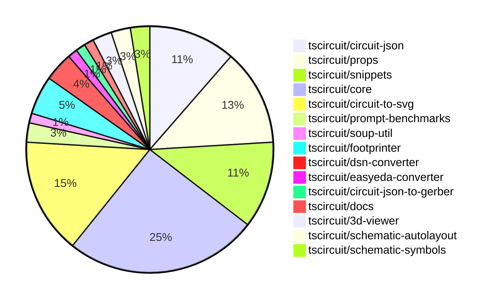

# Contribution Overview 2024-11-06

## PRs by Repository

## Contributor Overview

| Contributor | 🐳 Major | 🐙 Minor | 🐌 Tiny | ⭐ |
|-------------|-------|-------|-------|-------|
| [seveibar](#seveibar) | 12 | 31 | 1 | 👑👑👑 |
| [imrishabh18](#imrishabh18) | 1 | 9 | 1 | ⭐⭐ |
| [ShiboSoftwareDev](#ShiboSoftwareDev) | 1 | 9 | 0 | ⭐⭐ |
| [anas-sarkez](#anas-sarkez) | 3 | 0 | 0 | ⭐⭐ |
| [Abse2001](#Abse2001) | 0 | 3 | 0 | ⭐ |
| [andrii-balitskyi](#andrii-balitskyi) | 1 | 1 | 0 | ⭐ |
| [mrudulpatil18](#mrudulpatil18) | 0 | 2 | 0 | ⭐ |
| [DhairyaMajmudar](#DhairyaMajmudar) | 0 | 1 | 0 |  |
| [tscircuitbot](#tscircuitbot) | 0 | 1 | 0 |  |
| [ahmedhalac](#ahmedhalac) | 0 | 1 | 0 |  |
| [RohittCodes](#RohittCodes) | 0 | 1 | 0 |  |

## Changes by Repository

### [tscircuit/circuit-json](https://github.com/tscircuit/circuit-json)

| PR # | Impact | Contributor | Description |
|------|--------|-------------|-------------|
| [#77](https://github.com/tscircuit/circuit-json/pull/77) | 🐙 Minor | DhairyaMajmudar | Adds a new PCBMissingFootprintError component to the project. |
| [#76](https://github.com/tscircuit/circuit-json/pull/76) | 🐙 Minor | Abse2001 | Added a new simple push button circuit element |
| [#74](https://github.com/tscircuit/circuit-json/pull/74) | 🐙 Minor | seveibar | Adds a new optional property `anchor_position` to the `SchematicNetLabel` type. |
| [#63](https://github.com/tscircuit/circuit-json/pull/63) | 🐙 Minor | seveibar | Improve the definition of the schematic debug object by separating the `SchematicDebugRect` and `SchematicDebugLine` interfaces, and adding a new `SchematicDebugObject` type that represents either of them. |
| [#73](https://github.com/tscircuit/circuit-json/pull/73) | 🐙 Minor | seveibar | Adds junctions to schematic trace data structure. |
| [#72](https://github.com/tscircuit/circuit-json/pull/72) | 🐙 Minor | seveibar | Adds a new field `is_crossing` to the `SchematicTraceEdge` interface, which indicates whether the edge is crossing with another edge. |
| [#70](https://github.com/tscircuit/circuit-json/pull/70) | 🐙 Minor | seveibar | Fixes a bug in the parsing of unitless resistance values. |
| [#69](https://github.com/tscircuit/circuit-json/pull/69) | 🐙 Minor | seveibar | Refactors the schematic component to a zodless type, and adds a new field `symbol_display_value`. |
| [#68](https://github.com/tscircuit/circuit-json/pull/68) | 🐙 Minor | seveibar | Adds a new optional field `display_pin_label` to the `SchematicPort` interface and the corresponding Zod schema. |

### [tscircuit/props](https://github.com/tscircuit/props)

| PR # | Impact | Contributor | Description |
|------|--------|-------------|-------------|
| [#84](https://github.com/tscircuit/props/pull/84) | 🐙 Minor | Abse2001 | Adds a new `push-button` component with common component props. |
| [#90](https://github.com/tscircuit/props/pull/90) | 🐙 Minor | seveibar | Adds the ability to provide a `footprinterString` parameter to the `findPart` function in the `PartsEngine` type. |
| [#89](https://github.com/tscircuit/props/pull/89) | 🐙 Minor | seveibar | Add `minTraceWidth` property to subcircuits |
| [#88](https://github.com/tscircuit/props/pull/88) | 🐙 Minor | seveibar | Fix `schRotation` property for `netalias` component. |
| [#87](https://github.com/tscircuit/props/pull/87) | 🐙 Minor | seveibar | Introduce partsEngine prop, minor refactoring, fix netalias schX definition |
| [#83](https://github.com/tscircuit/props/pull/83) | 🐙 Minor | seveibar | Add `netAlias` props to the library. |
| [#82](https://github.com/tscircuit/props/pull/82) | 🐙 Minor | seveibar | Change the type of `pinLabels` property in the `ChipProps` interface to accept readonly arrays. |
| [#80](https://github.com/tscircuit/props/pull/80) | 🐙 Minor | imrishabh18 | Refactor the codebase to replace the `@tscircuit/soup` dependency with `circuit-json`. |
| [#79](https://github.com/tscircuit/props/pull/79) | 🐙 Minor | imrishabh18 | Adds support for string-based pins in the `PinSideDefinition` interface. |
| [#86](https://github.com/tscircuit/props/pull/86) | 🐙 Minor | tscircuitbot | Add a new optional `polarized` boolean property to the `CapacitorProps` interface and the `capacitorProps` schema. |

### [tscircuit/snippets](https://github.com/tscircuit/snippets)

| PR # | Impact | Contributor | Description |
|------|--------|-------------|-------------|
| [#186](https://github.com/tscircuit/snippets/pull/186) | 🐳 Major | seveibar | Introduces the initial integration of the Parts Engine and refactors the test locations. |
| [#185](https://github.com/tscircuit/snippets/pull/185) | 🐳 Major | seveibar | Adds a new API endpoint for listing trending snippets and implements the corresponding functionality in the client-side code. |
| [#183](https://github.com/tscircuit/snippets/pull/183) | 🐙 Minor | Abse2001 | Updated dependencies in the `package.json` file |
| [#173](https://github.com/tscircuit/snippets/pull/173) | 🐙 Minor | seveibar | Update dependencies to newer versions |
| [#169](https://github.com/tscircuit/snippets/pull/169) | 🐙 Minor | seveibar | Update dependencies (core and circuit-to-svg), swap schematic viewer to circuit-to-svg with mouse controls |
| [#184](https://github.com/tscircuit/snippets/pull/184) | 🐙 Minor | ahmedhalac | Added copy to clipboard functionality to the ViewSnippetSidebar component. |
| [#176](https://github.com/tscircuit/snippets/pull/176) | 🐙 Minor | mrudulpatil18 | Adds keyboard navigation and a footer to the CmdK UI menu. |
| [#170](https://github.com/tscircuit/snippets/pull/170) | 🐙 Minor | mrudulpatil18 | Added functionality to change the snippet type. |
| [#178](https://github.com/tscircuit/snippets/pull/178) | 🐙 Minor | RohittCodes | Add a zoom effect for the schematic view. |

### [tscircuit/core](https://github.com/tscircuit/core)

| PR # | Impact | Contributor | Description |
|------|--------|-------------|-------------|
| [#274](https://github.com/tscircuit/core/pull/274) | 🐳 Major | seveibar | Adds a new `SupplierPartNumbers` property to the `NormalComponent` class, and introduces two new methods (`doInitialPartsEngineRender` and `updatePartsEngineRender`) to handle the initial and subsequent rendering of parts engine data. |
| [#264](https://github.com/tscircuit/core/pull/264) | 🐳 Major | seveibar | Adds support for schematic symbol rotation in the `NormalComponent` and `PrimitiveComponent` classes. |
| [#261](https://github.com/tscircuit/core/pull/261) | 🐳 Major | seveibar | Add anchor_position to schematic_net_label and create net labels when a schematic trace is connected to a net on one side. |
| [#260](https://github.com/tscircuit/core/pull/260) | 🐳 Major | seveibar | Adds junction support to the trace component, including fixes for bad trace pushes and the implementation of junctions. |
| [#252](https://github.com/tscircuit/core/pull/252) | 🐳 Major | seveibar | Adds `is_crossing` and split schematic trace segments to enable the "trace hop" feature. |
| [#243](https://github.com/tscircuit/core/pull/243) | 🐳 Major | andrii-balitskyi | Adds a new `useLed` hook to the project, which creates LED components with the specified properties. |
| [#284](https://github.com/tscircuit/core/pull/284) | 🐙 Minor | seveibar | Fixes a visual bug in the crossing direction calculation of schematic traces. |
| [#283](https://github.com/tscircuit/core/pull/283) | 🐙 Minor | seveibar | The pull request fixes an issue with the reproduction of crossings being drawn incorrectly and increases the spacing between parallel wires. |
| [#277](https://github.com/tscircuit/core/pull/277) | 🐙 Minor | seveibar | Adapt parts engine to use the `footprinterString` field in the `findPart` method. |
| [#262](https://github.com/tscircuit/core/pull/262) | 🐙 Minor | seveibar | Fixes a minor issue where props were not being parsed correctly for the schematic component rotation. |
| [#257](https://github.com/tscircuit/core/pull/257) | 🐙 Minor | seveibar | Implement source_trace.subcircuit_connectivity_map_key |
| [#251](https://github.com/tscircuit/core/pull/251) | 🐙 Minor | seveibar | The pull request fixes a bug where schematic traces were overlapping with each other, and it pushes the traces away from other traces to avoid the overlap. |
| [#247](https://github.com/tscircuit/core/pull/247) | 🐙 Minor | seveibar | Adds `display_pin_label` to schematic ports and `symbol_display_value` to schematic components. |
| [#269](https://github.com/tscircuit/core/pull/269) | 🐙 Minor | ShiboSoftwareDev | The change updates the `schematic_port.facing_direction` property to be more accurate by using the `localPortInfo.side` property to determine the direction. |
| [#268](https://github.com/tscircuit/core/pull/268) | 🐙 Minor | ShiboSoftwareDev | Added capacitor, inductor, diode, and LED schematic symbol rotation support. |
| [#259](https://github.com/tscircuit/core/pull/259) | 🐙 Minor | ShiboSoftwareDev | The pull request makes the schematic box components expand to fit the label text. |
| [#270](https://github.com/tscircuit/core/pull/270) | 🐙 Minor | imrishabh18 | Normalize pin labels function moved from easyeda to core |
| [#245](https://github.com/tscircuit/core/pull/245) | 🐙 Minor | imrishabh18 | Fixes an issue where port dots were appearing in the center of the chip when a port arrangement was present. |
| [#244](https://github.com/tscircuit/core/pull/244) | 🐙 Minor | andrii-balitskyi | Adds a GitHub Actions workflow to automatically format code in pull requests |
| [#275](https://github.com/tscircuit/core/pull/275) | 🐌 Tiny | imrishabh18 | Reduces the size dependency of the `@tscircuit/schematic-autolayout` package from `^0.0.5` to `^0.0.6`. |

### [tscircuit/circuit-to-svg](https://github.com/tscircuit/circuit-to-svg)

| PR # | Impact | Contributor | Description |
|------|--------|-------------|-------------|
| [#117](https://github.com/tscircuit/circuit-to-svg/pull/117) | 🐳 Major | seveibar | Adds handling for nonexistent symbols and improves error messaging when symbol ports don't align. |
| [#113](https://github.com/tscircuit/circuit-to-svg/pull/113) | 🐳 Major | seveibar | Adds comprehensive text metrics for Arial font, including width, height, ascent, descent, left, and right properties for each character. |
| [#112](https://github.com/tscircuit/circuit-to-svg/pull/112) | 🐳 Major | seveibar | The pull request adds support for junctions and improves the drawing of wire crossings in the schematic SVG rendering. |
| [#110](https://github.com/tscircuit/circuit-to-svg/pull/110) | 🐳 Major | seveibar | Initial implementation of crossing trace rendering in the schematic SVG generation. |
| [#116](https://github.com/tscircuit/circuit-to-svg/pull/116) | 🐙 Minor | seveibar | Reverts the change to use the source port name for the pin text |
| [#111](https://github.com/tscircuit/circuit-to-svg/pull/111) | 🐙 Minor | seveibar | Fix labelled points not appearing at correct position and make the font sans-serif |
| [#109](https://github.com/tscircuit/circuit-to-svg/pull/109) | 🐙 Minor | seveibar | Fix schematic port label name, fix anchoring of bottom text on components, and update core dependency. |
| [#108](https://github.com/tscircuit/circuit-to-svg/pull/108) | 🐙 Minor | seveibar | Switch to using `symbol_display_value` instead of `display_value`, `capacitance`, or `resistance` to get the text value for symbols. |
| [#107](https://github.com/tscircuit/circuit-to-svg/pull/107) | 🐙 Minor | seveibar | Adds a format check workflow to the project and updates the biome configuration to include a noConsole rule. |
| [#114](https://github.com/tscircuit/circuit-to-svg/pull/114) | 🐙 Minor | ShiboSoftwareDev | Adds an option to draw PCB trace errors in the SVG |
| [#115](https://github.com/tscircuit/circuit-to-svg/pull/115) | 🐙 Minor | imrishabh18 | Use the source port name for the pin text instead of the pin number |
| [#106](https://github.com/tscircuit/circuit-to-svg/pull/106) | 🐙 Minor | imrishabh18 | Adds support for creating SVG objects for schematic net labels. |

### [tscircuit/prompt-benchmarks](https://github.com/tscircuit/prompt-benchmarks)

| PR # | Impact | Contributor | Description |
|------|--------|-------------|-------------|
| [#4](https://github.com/tscircuit/prompt-benchmarks/pull/4) | 🐳 Major | seveibar | Adds new prompt templates and test cases for creating circuit board and module components. |
| [#5](https://github.com/tscircuit/prompt-benchmarks/pull/5) | 🐙 Minor | seveibar | Introduces tscircuit snippets integration for prompt generation. |

### [tscircuit/soup-util](https://github.com/tscircuit/soup-util)

| PR # | Impact | Contributor | Description |
|------|--------|-------------|-------------|
| [#24](https://github.com/tscircuit/soup-util/pull/24) | 🐙 Minor | seveibar | Fix update method updating the wrong objects |

### [tscircuit/footprinter](https://github.com/tscircuit/footprinter)

| PR # | Impact | Contributor | Description |
|------|--------|-------------|-------------|
| [#78](https://github.com/tscircuit/footprinter/pull/78) | 🐳 Major | anas-sarkez | Implemented the sot235 (sot23-5) footprint with testing. |
| [#80](https://github.com/tscircuit/footprinter/pull/80) | 🐙 Minor | seveibar | Fix the default outer diameter of plated holes to be 1.5mm. |
| [#77](https://github.com/tscircuit/footprinter/pull/77) | 🐙 Minor | ShiboSoftwareDev | `getFootprintNames` is now a method of `footprinter` |
| [#76](https://github.com/tscircuit/footprinter/pull/76) | 🐙 Minor | ShiboSoftwareDev | Adds a new method `getFootprintNames()` to the `Footprinter` object to return an array of all available footprint names. |

### [tscircuit/dsn-converter](https://github.com/tscircuit/dsn-converter)

| PR # | Impact | Contributor | Description |
|------|--------|-------------|-------------|
| [#13](https://github.com/tscircuit/dsn-converter/pull/13) | 🐳 Major | imrishabh18 | Adds a new feature to convert circuit JSON to DSN JSON and vice versa. |
| [#14](https://github.com/tscircuit/dsn-converter/pull/14) | 🐙 Minor | seveibar | Update the README file with more detailed usage examples and type support information. |
| [#15](https://github.com/tscircuit/dsn-converter/pull/15) | 🐙 Minor | imrishabh18 | Add support for the polygon shape in the DSN to Circuit JSON conversion. |

### [tscircuit/easyeda-converter](https://github.com/tscircuit/easyeda-converter)

| PR # | Impact | Contributor | Description |
|------|--------|-------------|-------------|
| [#101](https://github.com/tscircuit/easyeda-converter/pull/101) | 🐌 Tiny | seveibar | Remove the `schPinSpacing` property from the `SoupTypescriptComponentTemplate` component |

### [tscircuit/circuit-json-to-gerber](https://github.com/tscircuit/circuit-json-to-gerber)

| PR # | Impact | Contributor | Description |
|------|--------|-------------|-------------|
| [#27](https://github.com/tscircuit/circuit-json-to-gerber/pull/27) | 🐳 Major | ShiboSoftwareDev | Added support for silkscreen text rendering in the Gerber conversion process. |

### [tscircuit/docs](https://github.com/tscircuit/docs)

| PR # | Impact | Contributor | Description |
|------|--------|-------------|-------------|
| [#36](https://github.com/tscircuit/docs/pull/36) | 🐙 Minor | ShiboSoftwareDev | Added a new tutorial circuit for a pushbutton LED circuit, including 3D, PCB, and schematic images. |

### [tscircuit/3d-viewer](https://github.com/tscircuit/3d-viewer)

| PR # | Impact | Contributor | Description |
|------|--------|-------------|-------------|
| [#33](https://github.com/tscircuit/3d-viewer/pull/33) | 🐙 Minor | ShiboSoftwareDev | Adds the ability to hover over components in the CAD viewer to highlight and view the reference designator. |
| [#34](https://github.com/tscircuit/3d-viewer/pull/34) | 🐙 Minor | ShiboSoftwareDev | Changed the highlight color of the 3D model from a dim red to a blue color. |

### [tscircuit/schematic-autolayout](https://github.com/tscircuit/schematic-autolayout)

| PR # | Impact | Contributor | Description |
|------|--------|-------------|-------------|
| [#4](https://github.com/tscircuit/schematic-autolayout/pull/4) | 🐙 Minor | imrishabh18 | Adds an automatic publish workflow to the GitHub repository, which will publish the package to npm when changes are made to the main branch. |
| [#3](https://github.com/tscircuit/schematic-autolayout/pull/3) | 🐙 Minor | imrishabh18 | Update dependency by migrating to bun, shifting dependency to devDependency, bundling using tsup-node, and removing builder. |

### [tscircuit/schematic-symbols](https://github.com/tscircuit/schematic-symbols)

| PR # | Impact | Contributor | Description |
|------|--------|-------------|-------------|
| [#194](https://github.com/tscircuit/schematic-symbols/pull/194) | 🐳 Major | anas-sarkez | Refactor the `rotateAnchor` function to handle all orientations ("up", "down", "left", "right") for rotating the anchor point of a symbol. |
| [#190](https://github.com/tscircuit/schematic-symbols/pull/190) | 🐳 Major | anas-sarkez | Diode components now have left/right/up/down variants instead of horizontal/vertical variants. |

## Changes by Contributor

### [DhairyaMajmudar](https://github.com/DhairyaMajmudar)

| PR # | Impact | Description |
|------|--------|-------------|
| [#77](https://github.com/tscircuit/circuit-json/pull/77) | 🐙 Minor | Adds a new PCBMissingFootprintError component to the project. |

### [Abse2001](https://github.com/Abse2001)

| PR # | Impact | Description |
|------|--------|-------------|
| [#76](https://github.com/tscircuit/circuit-json/pull/76) | 🐙 Minor | Added a new simple push button circuit element |
| [#84](https://github.com/tscircuit/props/pull/84) | 🐙 Minor | Adds a new `push-button` component with common component props. |
| [#183](https://github.com/tscircuit/snippets/pull/183) | 🐙 Minor | Updated dependencies in the `package.json` file |

### [seveibar](https://github.com/seveibar)

| PR # | Impact | Description |
|------|--------|-------------|
| [#274](https://github.com/tscircuit/core/pull/274) | 🐳 Major | Adds a new `SupplierPartNumbers` property to the `NormalComponent` class, and introduces two new methods (`doInitialPartsEngineRender` and `updatePartsEngineRender`) to handle the initial and subsequent rendering of parts engine data. |
| [#264](https://github.com/tscircuit/core/pull/264) | 🐳 Major | Adds support for schematic symbol rotation in the `NormalComponent` and `PrimitiveComponent` classes. |
| [#261](https://github.com/tscircuit/core/pull/261) | 🐳 Major | Add anchor_position to schematic_net_label and create net labels when a schematic trace is connected to a net on one side. |
| [#260](https://github.com/tscircuit/core/pull/260) | 🐳 Major | Adds junction support to the trace component, including fixes for bad trace pushes and the implementation of junctions. |
| [#252](https://github.com/tscircuit/core/pull/252) | 🐳 Major | Adds `is_crossing` and split schematic trace segments to enable the "trace hop" feature. |
| [#117](https://github.com/tscircuit/circuit-to-svg/pull/117) | 🐳 Major | Adds handling for nonexistent symbols and improves error messaging when symbol ports don't align. |
| [#113](https://github.com/tscircuit/circuit-to-svg/pull/113) | 🐳 Major | Adds comprehensive text metrics for Arial font, including width, height, ascent, descent, left, and right properties for each character. |
| [#112](https://github.com/tscircuit/circuit-to-svg/pull/112) | 🐳 Major | The pull request adds support for junctions and improves the drawing of wire crossings in the schematic SVG rendering. |
| [#110](https://github.com/tscircuit/circuit-to-svg/pull/110) | 🐳 Major | Initial implementation of crossing trace rendering in the schematic SVG generation. |
| [#186](https://github.com/tscircuit/snippets/pull/186) | 🐳 Major | Introduces the initial integration of the Parts Engine and refactors the test locations. |
| [#185](https://github.com/tscircuit/snippets/pull/185) | 🐳 Major | Adds a new API endpoint for listing trending snippets and implements the corresponding functionality in the client-side code. |
| [#4](https://github.com/tscircuit/prompt-benchmarks/pull/4) | 🐳 Major | Adds new prompt templates and test cases for creating circuit board and module components. |
| [#74](https://github.com/tscircuit/circuit-json/pull/74) | 🐙 Minor | Adds a new optional property `anchor_position` to the `SchematicNetLabel` type. |
| [#63](https://github.com/tscircuit/circuit-json/pull/63) | 🐙 Minor | Improve the definition of the schematic debug object by separating the `SchematicDebugRect` and `SchematicDebugLine` interfaces, and adding a new `SchematicDebugObject` type that represents either of them. |
| [#73](https://github.com/tscircuit/circuit-json/pull/73) | 🐙 Minor | Adds junctions to schematic trace data structure. |
| [#72](https://github.com/tscircuit/circuit-json/pull/72) | 🐙 Minor | Adds a new field `is_crossing` to the `SchematicTraceEdge` interface, which indicates whether the edge is crossing with another edge. |
| [#70](https://github.com/tscircuit/circuit-json/pull/70) | 🐙 Minor | Fixes a bug in the parsing of unitless resistance values. |
| [#69](https://github.com/tscircuit/circuit-json/pull/69) | 🐙 Minor | Refactors the schematic component to a zodless type, and adds a new field `symbol_display_value`. |
| [#68](https://github.com/tscircuit/circuit-json/pull/68) | 🐙 Minor | Adds a new optional field `display_pin_label` to the `SchematicPort` interface and the corresponding Zod schema. |
| [#24](https://github.com/tscircuit/soup-util/pull/24) | 🐙 Minor | Fix update method updating the wrong objects |
| [#90](https://github.com/tscircuit/props/pull/90) | 🐙 Minor | Adds the ability to provide a `footprinterString` parameter to the `findPart` function in the `PartsEngine` type. |
| [#89](https://github.com/tscircuit/props/pull/89) | 🐙 Minor | Add `minTraceWidth` property to subcircuits |
| [#88](https://github.com/tscircuit/props/pull/88) | 🐙 Minor | Fix `schRotation` property for `netalias` component. |
| [#87](https://github.com/tscircuit/props/pull/87) | 🐙 Minor | Introduce partsEngine prop, minor refactoring, fix netalias schX definition |
| [#83](https://github.com/tscircuit/props/pull/83) | 🐙 Minor | Add `netAlias` props to the library. |
| [#82](https://github.com/tscircuit/props/pull/82) | 🐙 Minor | Change the type of `pinLabels` property in the `ChipProps` interface to accept readonly arrays. |
| [#80](https://github.com/tscircuit/footprinter/pull/80) | 🐙 Minor | Fix the default outer diameter of plated holes to be 1.5mm. |
| [#284](https://github.com/tscircuit/core/pull/284) | 🐙 Minor | Fixes a visual bug in the crossing direction calculation of schematic traces. |
| [#283](https://github.com/tscircuit/core/pull/283) | 🐙 Minor | The pull request fixes an issue with the reproduction of crossings being drawn incorrectly and increases the spacing between parallel wires. |
| [#277](https://github.com/tscircuit/core/pull/277) | 🐙 Minor | Adapt parts engine to use the `footprinterString` field in the `findPart` method. |
| [#262](https://github.com/tscircuit/core/pull/262) | 🐙 Minor | Fixes a minor issue where props were not being parsed correctly for the schematic component rotation. |
| [#257](https://github.com/tscircuit/core/pull/257) | 🐙 Minor | Implement source_trace.subcircuit_connectivity_map_key |
| [#251](https://github.com/tscircuit/core/pull/251) | 🐙 Minor | The pull request fixes a bug where schematic traces were overlapping with each other, and it pushes the traces away from other traces to avoid the overlap. |
| [#247](https://github.com/tscircuit/core/pull/247) | 🐙 Minor | Adds `display_pin_label` to schematic ports and `symbol_display_value` to schematic components. |
| [#116](https://github.com/tscircuit/circuit-to-svg/pull/116) | 🐙 Minor | Reverts the change to use the source port name for the pin text |
| [#111](https://github.com/tscircuit/circuit-to-svg/pull/111) | 🐙 Minor | Fix labelled points not appearing at correct position and make the font sans-serif |
| [#109](https://github.com/tscircuit/circuit-to-svg/pull/109) | 🐙 Minor | Fix schematic port label name, fix anchoring of bottom text on components, and update core dependency. |
| [#108](https://github.com/tscircuit/circuit-to-svg/pull/108) | 🐙 Minor | Switch to using `symbol_display_value` instead of `display_value`, `capacitance`, or `resistance` to get the text value for symbols. |
| [#107](https://github.com/tscircuit/circuit-to-svg/pull/107) | 🐙 Minor | Adds a format check workflow to the project and updates the biome configuration to include a noConsole rule. |
| [#14](https://github.com/tscircuit/dsn-converter/pull/14) | 🐙 Minor | Update the README file with more detailed usage examples and type support information. |
| [#173](https://github.com/tscircuit/snippets/pull/173) | 🐙 Minor | Update dependencies to newer versions |
| [#169](https://github.com/tscircuit/snippets/pull/169) | 🐙 Minor | Update dependencies (core and circuit-to-svg), swap schematic viewer to circuit-to-svg with mouse controls |
| [#5](https://github.com/tscircuit/prompt-benchmarks/pull/5) | 🐙 Minor | Introduces tscircuit snippets integration for prompt generation. |
| [#101](https://github.com/tscircuit/easyeda-converter/pull/101) | 🐌 Tiny | Remove the `schPinSpacing` property from the `SoupTypescriptComponentTemplate` component |

### [ShiboSoftwareDev](https://github.com/ShiboSoftwareDev)

| PR # | Impact | Description |
|------|--------|-------------|
| [#27](https://github.com/tscircuit/circuit-json-to-gerber/pull/27) | 🐳 Major | Added support for silkscreen text rendering in the Gerber conversion process. |
| [#36](https://github.com/tscircuit/docs/pull/36) | 🐙 Minor | Added a new tutorial circuit for a pushbutton LED circuit, including 3D, PCB, and schematic images. |
| [#77](https://github.com/tscircuit/footprinter/pull/77) | 🐙 Minor | `getFootprintNames` is now a method of `footprinter` |
| [#76](https://github.com/tscircuit/footprinter/pull/76) | 🐙 Minor | Adds a new method `getFootprintNames()` to the `Footprinter` object to return an array of all available footprint names. |
| [#33](https://github.com/tscircuit/3d-viewer/pull/33) | 🐙 Minor | Adds the ability to hover over components in the CAD viewer to highlight and view the reference designator. |
| [#34](https://github.com/tscircuit/3d-viewer/pull/34) | 🐙 Minor | Changed the highlight color of the 3D model from a dim red to a blue color. |
| [#269](https://github.com/tscircuit/core/pull/269) | 🐙 Minor | The change updates the `schematic_port.facing_direction` property to be more accurate by using the `localPortInfo.side` property to determine the direction. |
| [#268](https://github.com/tscircuit/core/pull/268) | 🐙 Minor | Added capacitor, inductor, diode, and LED schematic symbol rotation support. |
| [#259](https://github.com/tscircuit/core/pull/259) | 🐙 Minor | The pull request makes the schematic box components expand to fit the label text. |
| [#114](https://github.com/tscircuit/circuit-to-svg/pull/114) | 🐙 Minor | Adds an option to draw PCB trace errors in the SVG |

### [imrishabh18](https://github.com/imrishabh18)

| PR # | Impact | Description |
|------|--------|-------------|
| [#13](https://github.com/tscircuit/dsn-converter/pull/13) | 🐳 Major | Adds a new feature to convert circuit JSON to DSN JSON and vice versa. |
| [#4](https://github.com/tscircuit/schematic-autolayout/pull/4) | 🐙 Minor | Adds an automatic publish workflow to the GitHub repository, which will publish the package to npm when changes are made to the main branch. |
| [#3](https://github.com/tscircuit/schematic-autolayout/pull/3) | 🐙 Minor | Update dependency by migrating to bun, shifting dependency to devDependency, bundling using tsup-node, and removing builder. |
| [#80](https://github.com/tscircuit/props/pull/80) | 🐙 Minor | Refactor the codebase to replace the `@tscircuit/soup` dependency with `circuit-json`. |
| [#79](https://github.com/tscircuit/props/pull/79) | 🐙 Minor | Adds support for string-based pins in the `PinSideDefinition` interface. |
| [#270](https://github.com/tscircuit/core/pull/270) | 🐙 Minor | Normalize pin labels function moved from easyeda to core |
| [#245](https://github.com/tscircuit/core/pull/245) | 🐙 Minor | Fixes an issue where port dots were appearing in the center of the chip when a port arrangement was present. |
| [#115](https://github.com/tscircuit/circuit-to-svg/pull/115) | 🐙 Minor | Use the source port name for the pin text instead of the pin number |
| [#106](https://github.com/tscircuit/circuit-to-svg/pull/106) | 🐙 Minor | Adds support for creating SVG objects for schematic net labels. |
| [#15](https://github.com/tscircuit/dsn-converter/pull/15) | 🐙 Minor | Add support for the polygon shape in the DSN to Circuit JSON conversion. |
| [#275](https://github.com/tscircuit/core/pull/275) | 🐌 Tiny | Reduces the size dependency of the `@tscircuit/schematic-autolayout` package from `^0.0.5` to `^0.0.6`. |

### [tscircuitbot](https://github.com/tscircuitbot)

| PR # | Impact | Description |
|------|--------|-------------|
| [#86](https://github.com/tscircuit/props/pull/86) | 🐙 Minor | Add a new optional `polarized` boolean property to the `CapacitorProps` interface and the `capacitorProps` schema. |

### [anas-sarkez](https://github.com/anas-sarkez)

| PR # | Impact | Description |
|------|--------|-------------|
| [#78](https://github.com/tscircuit/footprinter/pull/78) | 🐳 Major | Implemented the sot235 (sot23-5) footprint with testing. |
| [#194](https://github.com/tscircuit/schematic-symbols/pull/194) | 🐳 Major | Refactor the `rotateAnchor` function to handle all orientations ("up", "down", "left", "right") for rotating the anchor point of a symbol. |
| [#190](https://github.com/tscircuit/schematic-symbols/pull/190) | 🐳 Major | Diode components now have left/right/up/down variants instead of horizontal/vertical variants. |

### [andrii-balitskyi](https://github.com/andrii-balitskyi)

| PR # | Impact | Description |
|------|--------|-------------|
| [#243](https://github.com/tscircuit/core/pull/243) | 🐳 Major | Adds a new `useLed` hook to the project, which creates LED components with the specified properties. |
| [#244](https://github.com/tscircuit/core/pull/244) | 🐙 Minor | Adds a GitHub Actions workflow to automatically format code in pull requests |

### [ahmedhalac](https://github.com/ahmedhalac)

| PR # | Impact | Description |
|------|--------|-------------|
| [#184](https://github.com/tscircuit/snippets/pull/184) | 🐙 Minor | Added copy to clipboard functionality to the ViewSnippetSidebar component. |

### [mrudulpatil18](https://github.com/mrudulpatil18)

| PR # | Impact | Description |
|------|--------|-------------|
| [#176](https://github.com/tscircuit/snippets/pull/176) | 🐙 Minor | Adds keyboard navigation and a footer to the CmdK UI menu. |
| [#170](https://github.com/tscircuit/snippets/pull/170) | 🐙 Minor | Added functionality to change the snippet type. |

### [RohittCodes](https://github.com/RohittCodes)

| PR # | Impact | Description |
|------|--------|-------------|
| [#178](https://github.com/tscircuit/snippets/pull/178) | 🐙 Minor | Add a zoom effect for the schematic view. |

