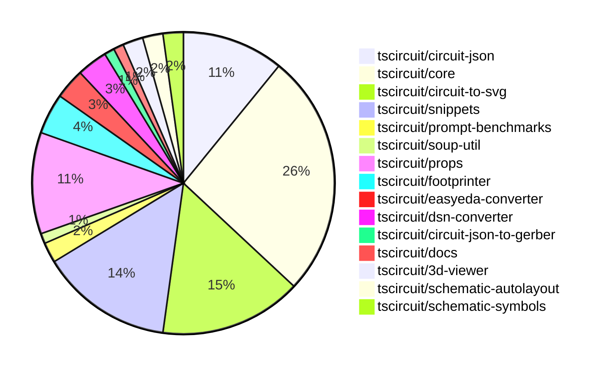

# Contribution Overview 2024-11-06

## PRs by Repository

## Contributor Overview

| Contributor | 🐳 Major | 🐙 Minor | 🐌 Tiny | ⭐ |
|-------------|-------|-------|-------|-------|
| [seveibar](#seveibar) | 17 | 35 | 1 | 👑👑👑 |
| [imrishabh18](#imrishabh18) | 3 | 8 | 1 | ⭐⭐ |
| [ShiboSoftwareDev](#ShiboSoftwareDev) | 1 | 9 | 0 | ⭐⭐ |
| [anas-sarkez](#anas-sarkez) | 2 | 1 | 0 | ⭐ |
| [andrii-balitskyi](#andrii-balitskyi) | 2 | 0 | 1 | ⭐ |
| [mrudulpatil18](#mrudulpatil18) | 1 | 1 | 0 | ⭐ |
| [Abse2001](#Abse2001) | 0 | 2 | 1 | ⭐ |
| [DhairyaMajmudar](#DhairyaMajmudar) | 0 | 2 | 0 | ⭐ |
| [RohittCodes](#RohittCodes) | 0 | 2 | 0 | ⭐ |
| [tscircuitbot](#tscircuitbot) | 0 | 1 | 0 |  |
| [ahmedhalac](#ahmedhalac) | 0 | 1 | 0 |  |

## Changes by Repository

### [tscircuit/circuit-json](https://github.com/tscircuit/circuit-json)

| PR # | Impact | Contributor | Description |
|------|--------|-------------|-------------|
| [#78](https://github.com/tscircuit/circuit-json/pull/78) | 🐳 Major | seveibar | Adds a new documentation file for the "Source Component Overview" and improves the `expectTypesMatch` utility. |
| [#74](https://github.com/tscircuit/circuit-json/pull/74) | 🐙 Minor | seveibar | Add `anchor_position` and `symbol_name` properties to `SchematicNetLabel` type. |
| [#63](https://github.com/tscircuit/circuit-json/pull/63) | 🐙 Minor | seveibar | Improve the definition of the `schematic_debug_object` by using interfaces instead of Zod types and adding a `expectTypesMatch` check. |
| [#73](https://github.com/tscircuit/circuit-json/pull/73) | 🐙 Minor | seveibar | Adds a new field "junctions" to the "SchematicTrace" type, which is an array of objects with "x" and "y" number fields. |
| [#72](https://github.com/tscircuit/circuit-json/pull/72) | 🐙 Minor | seveibar | Adds a new property `is_crossing` to the `SchematicTraceEdge` interface and updates the corresponding Zod schema. |
| [#70](https://github.com/tscircuit/circuit-json/pull/70) | 🐙 Minor | seveibar | Fixes a bug in parsing unitless resistance values in the `convert-si-unit-to-number` utility function. |
| [#69](https://github.com/tscircuit/circuit-json/pull/69) | 🐙 Minor | seveibar | Refactor the `schematic_component` type to a zod-based type, and add a new `symbol_display_value` property. |
| [#68](https://github.com/tscircuit/circuit-json/pull/68) | 🐙 Minor | seveibar | Add a new optional property `display_pin_label` to the `SchematicPort` interface and the corresponding Zod schema. |
| [#77](https://github.com/tscircuit/circuit-json/pull/77) | 🐙 Minor | DhairyaMajmudar | Adds a new `PCBMissingFootprintError` component to the project. |
| [#76](https://github.com/tscircuit/circuit-json/pull/76) | 🐙 Minor | Abse2001 | Added a new circuit element called "push button" |

### [tscircuit/core](https://github.com/tscircuit/core)

| PR # | Impact | Contributor | Description |
|------|--------|-------------|-------------|
| [#274](https://github.com/tscircuit/core/pull/274) | 🐳 Major | seveibar | Adds a `SupplierPartNumbers` property to the `NormalComponent` class, and introduces two new methods `doInitialPartsEngineRender` and `updatePartsEngineRender` to handle the rendering of supplier part numbers using a `partsEngine` object. |
| [#264](https://github.com/tscircuit/core/pull/264) | 🐳 Major | seveibar | Adds support for schematic symbol rotation and improves handling of schematic symbol names. |
| [#261](https://github.com/tscircuit/core/pull/261) | 🐳 Major | seveibar | Add anchor_position to schematic_net_label and create net labels when a schematic trace is connected to a net on one side. |
| [#260](https://github.com/tscircuit/core/pull/260) | 🐳 Major | seveibar | Adds junction support to the Trace component, including fixes to prevent bad trace pushes when connected to the same net. |
| [#257](https://github.com/tscircuit/core/pull/257) | 🐳 Major | seveibar | Implement the `subcircuit_connectivity_map_key` feature for the `Trace` component. |
| [#252](https://github.com/tscircuit/core/pull/252) | 🐳 Major | seveibar | Adds the `is_crossing` property and splits schematic trace segments to enable the "trace hop" feature. |
| [#251](https://github.com/tscircuit/core/pull/251) | 🐳 Major | seveibar | Adds a feature to push schematic traces away from other traces to fix overlap issues. |
| [#244](https://github.com/tscircuit/core/pull/244) | 🐳 Major | andrii-balitskyi | Adds a GitHub Actions workflow to automatically format the code in pull requests. |
| [#243](https://github.com/tscircuit/core/pull/243) | 🐳 Major | andrii-balitskyi | Adds a new `useLed` hook that can be used to create LED components in a circuit. |
| [#287](https://github.com/tscircuit/core/pull/287) | 🐙 Minor | seveibar | Adds snapshot tests for complex schematic crossings in a component. |
| [#285](https://github.com/tscircuit/core/pull/285) | 🐙 Minor | seveibar | Fix the issue of stub edges not appearing for some edges |
| [#284](https://github.com/tscircuit/core/pull/284) | 🐙 Minor | seveibar | Fixes a visual bug in the crossing direction calculation for schematic traces. |
| [#283](https://github.com/tscircuit/core/pull/283) | 🐙 Minor | seveibar | Fixes an issue with crossings being drawn incorrectly and increases the spacing between parallel wires. |
| [#277](https://github.com/tscircuit/core/pull/277) | 🐙 Minor | seveibar | Adapt parts engine to use footprinterString |
| [#262](https://github.com/tscircuit/core/pull/262) | 🐙 Minor | seveibar | Fixes a minor issue where props were not being parsed correctly for the schematic component rotation. |
| [#247](https://github.com/tscircuit/core/pull/247) | 🐙 Minor | seveibar | Adds `display_pin_label` to schematic ports and `symbol_display_value` to schematic components. |
| [#253](https://github.com/tscircuit/core/pull/253) | 🐙 Minor | DhairyaMajmudar | Adds error handling for missing footprint in the `NormalComponent` class. |
| [#269](https://github.com/tscircuit/core/pull/269) | 🐙 Minor | ShiboSoftwareDev | Improves the accuracy of the `schematic_port.facing_direction` property by using the port's side information to determine the facing direction. |
| [#268](https://github.com/tscircuit/core/pull/268) | 🐙 Minor | ShiboSoftwareDev | Added schematic symbol rotation support for capacitor, inductor, diode, and LED components. |
| [#259](https://github.com/tscircuit/core/pull/259) | 🐙 Minor | ShiboSoftwareDev | Schematic box components now expand to fit the label text. |
| [#270](https://github.com/tscircuit/core/pull/270) | 🐙 Minor | imrishabh18 | Normalize function moved from easyeda to core |
| [#245](https://github.com/tscircuit/core/pull/245) | 🐙 Minor | imrishabh18 | The pull request fixes a bug where port dots were being displayed on the center of the chip, even when a port arrangement was present. |
| [#275](https://github.com/tscircuit/core/pull/275) | 🐌 Tiny | imrishabh18 | Reduce the dependency size of the `@tscircuit/schematic-autolayout` package from `^0.0.5` to `^0.0.6`. |
| [#242](https://github.com/tscircuit/core/pull/242) | 🐌 Tiny | andrii-balitskyi | Adds a test for the `useDiode` hook, which creates diode components with correct props and traces. |

### [tscircuit/circuit-to-svg](https://github.com/tscircuit/circuit-to-svg)

| PR # | Impact | Contributor | Description |
|------|--------|-------------|-------------|
| [#117](https://github.com/tscircuit/circuit-to-svg/pull/117) | 🐳 Major | seveibar | Adds nonexistent symbol handling and error message when symbol ports don't align. |
| [#113](https://github.com/tscircuit/circuit-to-svg/pull/113) | 🐳 Major | seveibar | Introduces comprehensive Arial text metrics for a wide range of characters, including size, position, and layout information. |
| [#112](https://github.com/tscircuit/circuit-to-svg/pull/112) | 🐳 Major | seveibar | Adds support for junctions and improves the drawing of wire crossings in the schematic SVG rendering. |
| [#110](https://github.com/tscircuit/circuit-to-svg/pull/110) | 🐳 Major | seveibar | Introduces the initial implementation of crossing trace rendering in the schematic editor. |
| [#106](https://github.com/tscircuit/circuit-to-svg/pull/106) | 🐳 Major | imrishabh18 | Adds support for rendering schematic net labels in the SVG output. |
| [#121](https://github.com/tscircuit/circuit-to-svg/pull/121) | 🐙 Minor | seveibar | Reverts a previous fix to the top and bottom anchor position of net labels. |
| [#116](https://github.com/tscircuit/circuit-to-svg/pull/116) | 🐙 Minor | seveibar | Reverts the change that used the source port name for the pin text |
| [#111](https://github.com/tscircuit/circuit-to-svg/pull/111) | 🐙 Minor | seveibar | Fix labeled points not appearing at correct position and make the font sans-serif |
| [#109](https://github.com/tscircuit/circuit-to-svg/pull/109) | 🐙 Minor | seveibar | Fix schematic port label name using schematic_port.display_pin_label, fix anchoring of bottom text on components, and update core |
| [#108](https://github.com/tscircuit/circuit-to-svg/pull/108) | 🐙 Minor | seveibar | Switch to using `symbol_display_value` for symbol values instead of `display_value`, `capacitance`, or `resistance`. |
| [#107](https://github.com/tscircuit/circuit-to-svg/pull/107) | 🐙 Minor | seveibar | Add a format check to the GitHub workflow and update the biome.json configuration to enable the noConsole rule and format the project. |
| [#114](https://github.com/tscircuit/circuit-to-svg/pull/114) | 🐙 Minor | ShiboSoftwareDev | Introduces an option to draw PCB trace errors in the SVG output. |
| [#120](https://github.com/tscircuit/circuit-to-svg/pull/120) | 🐙 Minor | imrishabh18 | Fixed the top and bottom anchor position for the schematic net label |
| [#115](https://github.com/tscircuit/circuit-to-svg/pull/115) | 🐙 Minor | imrishabh18 | Use the source port name for the pin text instead of the pin number |

### [tscircuit/snippets](https://github.com/tscircuit/snippets)

| PR # | Impact | Contributor | Description |
|------|--------|-------------|-------------|
| [#192](https://github.com/tscircuit/snippets/pull/192) | 🐳 Major | seveibar | Adds source component overview docs, a BOM tab, and a dropdown for new preview views. |
| [#186](https://github.com/tscircuit/snippets/pull/186) | 🐳 Major | seveibar | Integrates the Parts Engine and refactors the test locations. |
| [#169](https://github.com/tscircuit/snippets/pull/169) | 🐳 Major | seveibar | Update dependencies (core and circuit-to-svg), swap schematic viewer to circuit-to-svg with mouse controls |
| [#170](https://github.com/tscircuit/snippets/pull/170) | 🐳 Major | mrudulpatil18 | Adds functionality to change the snippet type. |
| [#196](https://github.com/tscircuit/snippets/pull/196) | 🐙 Minor | seveibar | Adds support for async circuit rendering and opens BOM links in a new tab |
| [#188](https://github.com/tscircuit/snippets/pull/188) | 🐙 Minor | seveibar | Update the core package and add an automatic package update system via Renovate configuration |
| [#185](https://github.com/tscircuit/snippets/pull/185) | 🐙 Minor | seveibar | Add trending snippets API and test |
| [#173](https://github.com/tscircuit/snippets/pull/173) | 🐙 Minor | seveibar | Update dependencies for `@tscircuit/core` and `circuit-to-svg` packages |
| [#183](https://github.com/tscircuit/snippets/pull/183) | 🐙 Minor | Abse2001 | Updated dependencies in the `package.json` file |
| [#182](https://github.com/tscircuit/snippets/pull/182) | 🐙 Minor | RohittCodes | Refactor the search text component to fix a bug in the Playwright tests for smaller devices. |
| [#178](https://github.com/tscircuit/snippets/pull/178) | 🐙 Minor | RohittCodes | Adds a zoom effect to the schematic view by setting the `transformOrigin` CSS property. |
| [#184](https://github.com/tscircuit/snippets/pull/184) | 🐙 Minor | ahmedhalac | Adds copy to clipboard functionality for the snippet embed code, import code, and install command. |
| [#176](https://github.com/tscircuit/snippets/pull/176) | 🐙 Minor | mrudulpatil18 | Improved the user interface of the CMDK (Command Menu) by adding keyboard navigation, selecting menu items using the "Enter" key, and adding aliases for some menu options. Additionally, a footer section was added to the CMDK dialog. |

### [tscircuit/prompt-benchmarks](https://github.com/tscircuit/prompt-benchmarks)

| PR # | Impact | Contributor | Description |
|------|--------|-------------|-------------|
| [#4](https://github.com/tscircuit/prompt-benchmarks/pull/4) | 🐳 Major | seveibar | Adds a new module generation feature and related test cases. |
| [#5](https://github.com/tscircuit/prompt-benchmarks/pull/5) | 🐳 Major | seveibar | Adds tscircuit snippets integration for prompt generation |

### [tscircuit/soup-util](https://github.com/tscircuit/soup-util)

| PR # | Impact | Contributor | Description |
|------|--------|-------------|-------------|
| [#24](https://github.com/tscircuit/soup-util/pull/24) | 🐙 Minor | seveibar | Fix update method updating the wrong objects |

### [tscircuit/props](https://github.com/tscircuit/props)

| PR # | Impact | Contributor | Description |
|------|--------|-------------|-------------|
| [#90](https://github.com/tscircuit/props/pull/90) | 🐙 Minor | seveibar | Adds an optional `footprinterString` parameter to the `findPart` function in the `PartsEngine` type. |
| [#89](https://github.com/tscircuit/props/pull/89) | 🐙 Minor | seveibar | Adds `minTraceWidth` property to subcircuits to allow setting a minimum trace width. |
| [#88](https://github.com/tscircuit/props/pull/88) | 🐙 Minor | seveibar | Fix the schRotation property in the NetAliasProps interface. |
| [#87](https://github.com/tscircuit/props/pull/87) | 🐙 Minor | seveibar | Introduce partsEngine prop, minor refactoring, fix netalias schX definition |
| [#83](https://github.com/tscircuit/props/pull/83) | 🐙 Minor | seveibar | Add `netAlias` props and its corresponding TypeScript types. |
| [#82](https://github.com/tscircuit/props/pull/82) | 🐙 Minor | seveibar | Change the type of `pinLabels` to accept readonly string arrays. |
| [#80](https://github.com/tscircuit/props/pull/80) | 🐙 Minor | imrishabh18 | Refactor the codebase to replace the usage of `@tscircuit/soup` dependency with `circuit-json` dependency. |
| [#79](https://github.com/tscircuit/props/pull/79) | 🐙 Minor | imrishabh18 | Adds support for string values in the `pins` property of the `PinSideDefinition` interface. |
| [#86](https://github.com/tscircuit/props/pull/86) | 🐙 Minor | tscircuitbot | Add a new `polarized` property to the `CapacitorProps` interface and set a default value of `false`. |
| [#84](https://github.com/tscircuit/props/pull/84) | 🐌 Tiny | Abse2001 | Adds a new file `push-button.ts` that exports `pushButtonProps` and `PushButtonProps`. |

### [tscircuit/footprinter](https://github.com/tscircuit/footprinter)

| PR # | Impact | Contributor | Description |
|------|--------|-------------|-------------|
| [#78](https://github.com/tscircuit/footprinter/pull/78) | 🐳 Major | anas-sarkez | Implemented the sot235 (sot23-5) footprint with testing. |
| [#80](https://github.com/tscircuit/footprinter/pull/80) | 🐙 Minor | seveibar | Changes the default outer diameter of plated holes from 1.2mm to 1.5mm. |
| [#77](https://github.com/tscircuit/footprinter/pull/77) | 🐙 Minor | ShiboSoftwareDev | The change makes `getFootprintNames` a method of the `footprinter` object, instead of a standalone function. |
| [#76](https://github.com/tscircuit/footprinter/pull/76) | 🐙 Minor | ShiboSoftwareDev | Add a new method `getFootprintNames()` to the `Footprinter` interface to return an array of footprint names. |

### [tscircuit/easyeda-converter](https://github.com/tscircuit/easyeda-converter)

| PR # | Impact | Contributor | Description |
|------|--------|-------------|-------------|
| [#108](https://github.com/tscircuit/easyeda-converter/pull/108) | 🐙 Minor | seveibar | Add `manufacturerPartNumber` prop to the `soupTypescriptComponentTemplate` function and its usage. |
| [#107](https://github.com/tscircuit/easyeda-converter/pull/107) | 🐙 Minor | seveibar | Change the supplier from LCSC to JLCPCB. |
| [#101](https://github.com/tscircuit/easyeda-converter/pull/101) | 🐌 Tiny | seveibar | Removed the `schPinSpacing` property from the `SoupTypescriptComponentTemplate` component. |

### [tscircuit/dsn-converter](https://github.com/tscircuit/dsn-converter)

| PR # | Impact | Contributor | Description |
|------|--------|-------------|-------------|
| [#15](https://github.com/tscircuit/dsn-converter/pull/15) | 🐳 Major | imrishabh18 | Add support for the polygon shape in the padstacks. |
| [#13](https://github.com/tscircuit/dsn-converter/pull/13) | 🐳 Major | imrishabh18 | Adds a feature to convert circuit JSON to DSN JSON and vice versa. |
| [#14](https://github.com/tscircuit/dsn-converter/pull/14) | 🐙 Minor | seveibar | Update the README file with additional documentation for the DSN-Converter library. |

### [tscircuit/circuit-json-to-gerber](https://github.com/tscircuit/circuit-json-to-gerber)

| PR # | Impact | Contributor | Description |
|------|--------|-------------|-------------|
| [#27](https://github.com/tscircuit/circuit-json-to-gerber/pull/27) | 🐳 Major | ShiboSoftwareDev | Added support for silkscreen text rendering in the Gerber conversion process. |

### [tscircuit/docs](https://github.com/tscircuit/docs)

| PR # | Impact | Contributor | Description |
|------|--------|-------------|-------------|
| [#36](https://github.com/tscircuit/docs/pull/36) | 🐙 Minor | ShiboSoftwareDev | Added a new tutorial circuit for a pushbutton LED |

### [tscircuit/3d-viewer](https://github.com/tscircuit/3d-viewer)

| PR # | Impact | Contributor | Description |
|------|--------|-------------|-------------|
| [#33](https://github.com/tscircuit/3d-viewer/pull/33) | 🐙 Minor | ShiboSoftwareDev | Adds a feature to hover over a component in the CAD viewer to highlight and view the reference designator. |
| [#34](https://github.com/tscircuit/3d-viewer/pull/34) | 🐙 Minor | ShiboSoftwareDev | Changed the highlight color of the model from a dim glow to a brighter blue glow. |

### [tscircuit/schematic-autolayout](https://github.com/tscircuit/schematic-autolayout)

| PR # | Impact | Contributor | Description |
|------|--------|-------------|-------------|
| [#4](https://github.com/tscircuit/schematic-autolayout/pull/4) | 🐙 Minor | imrishabh18 | Adds an automatic publish workflow to the repository that will publish the package to npm when a push to the main branch is detected. |
| [#3](https://github.com/tscircuit/schematic-autolayout/pull/3) | 🐙 Minor | imrishabh18 | Update dependency to Bun, reduce bundle size by moving dependency to devDependency, and remove the `builder` package. |

### [tscircuit/schematic-symbols](https://github.com/tscircuit/schematic-symbols)

| PR # | Impact | Contributor | Description |
|------|--------|-------------|-------------|
| [#194](https://github.com/tscircuit/schematic-symbols/pull/194) | 🐳 Major | anas-sarkez | Refactor the `rotateAnchor` function to handle all anchor rotations based on the given orientation. |
| [#190](https://github.com/tscircuit/schematic-symbols/pull/190) | 🐙 Minor | anas-sarkez | Diode components now have left/right/up/down variants instead of horizontal/vertical. |

## Changes by Contributor

### [seveibar](https://github.com/seveibar)

| PR # | Impact | Description |
|------|--------|-------------|
| [#78](https://github.com/tscircuit/circuit-json/pull/78) | 🐳 Major | Adds a new documentation file for the "Source Component Overview" and improves the `expectTypesMatch` utility. |
| [#274](https://github.com/tscircuit/core/pull/274) | 🐳 Major | Adds a `SupplierPartNumbers` property to the `NormalComponent` class, and introduces two new methods `doInitialPartsEngineRender` and `updatePartsEngineRender` to handle the rendering of supplier part numbers using a `partsEngine` object. |
| [#264](https://github.com/tscircuit/core/pull/264) | 🐳 Major | Adds support for schematic symbol rotation and improves handling of schematic symbol names. |
| [#261](https://github.com/tscircuit/core/pull/261) | 🐳 Major | Add anchor_position to schematic_net_label and create net labels when a schematic trace is connected to a net on one side. |
| [#260](https://github.com/tscircuit/core/pull/260) | 🐳 Major | Adds junction support to the Trace component, including fixes to prevent bad trace pushes when connected to the same net. |
| [#257](https://github.com/tscircuit/core/pull/257) | 🐳 Major | Implement the `subcircuit_connectivity_map_key` feature for the `Trace` component. |
| [#252](https://github.com/tscircuit/core/pull/252) | 🐳 Major | Adds the `is_crossing` property and splits schematic trace segments to enable the "trace hop" feature. |
| [#251](https://github.com/tscircuit/core/pull/251) | 🐳 Major | Adds a feature to push schematic traces away from other traces to fix overlap issues. |
| [#117](https://github.com/tscircuit/circuit-to-svg/pull/117) | 🐳 Major | Adds nonexistent symbol handling and error message when symbol ports don't align. |
| [#113](https://github.com/tscircuit/circuit-to-svg/pull/113) | 🐳 Major | Introduces comprehensive Arial text metrics for a wide range of characters, including size, position, and layout information. |
| [#112](https://github.com/tscircuit/circuit-to-svg/pull/112) | 🐳 Major | Adds support for junctions and improves the drawing of wire crossings in the schematic SVG rendering. |
| [#110](https://github.com/tscircuit/circuit-to-svg/pull/110) | 🐳 Major | Introduces the initial implementation of crossing trace rendering in the schematic editor. |
| [#192](https://github.com/tscircuit/snippets/pull/192) | 🐳 Major | Adds source component overview docs, a BOM tab, and a dropdown for new preview views. |
| [#186](https://github.com/tscircuit/snippets/pull/186) | 🐳 Major | Integrates the Parts Engine and refactors the test locations. |
| [#169](https://github.com/tscircuit/snippets/pull/169) | 🐳 Major | Update dependencies (core and circuit-to-svg), swap schematic viewer to circuit-to-svg with mouse controls |
| [#4](https://github.com/tscircuit/prompt-benchmarks/pull/4) | 🐳 Major | Adds a new module generation feature and related test cases. |
| [#5](https://github.com/tscircuit/prompt-benchmarks/pull/5) | 🐳 Major | Adds tscircuit snippets integration for prompt generation |
| [#74](https://github.com/tscircuit/circuit-json/pull/74) | 🐙 Minor | Add `anchor_position` and `symbol_name` properties to `SchematicNetLabel` type. |
| [#63](https://github.com/tscircuit/circuit-json/pull/63) | 🐙 Minor | Improve the definition of the `schematic_debug_object` by using interfaces instead of Zod types and adding a `expectTypesMatch` check. |
| [#73](https://github.com/tscircuit/circuit-json/pull/73) | 🐙 Minor | Adds a new field "junctions" to the "SchematicTrace" type, which is an array of objects with "x" and "y" number fields. |
| [#72](https://github.com/tscircuit/circuit-json/pull/72) | 🐙 Minor | Adds a new property `is_crossing` to the `SchematicTraceEdge` interface and updates the corresponding Zod schema. |
| [#70](https://github.com/tscircuit/circuit-json/pull/70) | 🐙 Minor | Fixes a bug in parsing unitless resistance values in the `convert-si-unit-to-number` utility function. |
| [#69](https://github.com/tscircuit/circuit-json/pull/69) | 🐙 Minor | Refactor the `schematic_component` type to a zod-based type, and add a new `symbol_display_value` property. |
| [#68](https://github.com/tscircuit/circuit-json/pull/68) | 🐙 Minor | Add a new optional property `display_pin_label` to the `SchematicPort` interface and the corresponding Zod schema. |
| [#24](https://github.com/tscircuit/soup-util/pull/24) | 🐙 Minor | Fix update method updating the wrong objects |
| [#90](https://github.com/tscircuit/props/pull/90) | 🐙 Minor | Adds an optional `footprinterString` parameter to the `findPart` function in the `PartsEngine` type. |
| [#89](https://github.com/tscircuit/props/pull/89) | 🐙 Minor | Adds `minTraceWidth` property to subcircuits to allow setting a minimum trace width. |
| [#88](https://github.com/tscircuit/props/pull/88) | 🐙 Minor | Fix the schRotation property in the NetAliasProps interface. |
| [#87](https://github.com/tscircuit/props/pull/87) | 🐙 Minor | Introduce partsEngine prop, minor refactoring, fix netalias schX definition |
| [#83](https://github.com/tscircuit/props/pull/83) | 🐙 Minor | Add `netAlias` props and its corresponding TypeScript types. |
| [#82](https://github.com/tscircuit/props/pull/82) | 🐙 Minor | Change the type of `pinLabels` to accept readonly string arrays. |
| [#80](https://github.com/tscircuit/footprinter/pull/80) | 🐙 Minor | Changes the default outer diameter of plated holes from 1.2mm to 1.5mm. |
| [#108](https://github.com/tscircuit/easyeda-converter/pull/108) | 🐙 Minor | Add `manufacturerPartNumber` prop to the `soupTypescriptComponentTemplate` function and its usage. |
| [#107](https://github.com/tscircuit/easyeda-converter/pull/107) | 🐙 Minor | Change the supplier from LCSC to JLCPCB. |
| [#287](https://github.com/tscircuit/core/pull/287) | 🐙 Minor | Adds snapshot tests for complex schematic crossings in a component. |
| [#285](https://github.com/tscircuit/core/pull/285) | 🐙 Minor | Fix the issue of stub edges not appearing for some edges |
| [#284](https://github.com/tscircuit/core/pull/284) | 🐙 Minor | Fixes a visual bug in the crossing direction calculation for schematic traces. |
| [#283](https://github.com/tscircuit/core/pull/283) | 🐙 Minor | Fixes an issue with crossings being drawn incorrectly and increases the spacing between parallel wires. |
| [#277](https://github.com/tscircuit/core/pull/277) | 🐙 Minor | Adapt parts engine to use footprinterString |
| [#262](https://github.com/tscircuit/core/pull/262) | 🐙 Minor | Fixes a minor issue where props were not being parsed correctly for the schematic component rotation. |
| [#247](https://github.com/tscircuit/core/pull/247) | 🐙 Minor | Adds `display_pin_label` to schematic ports and `symbol_display_value` to schematic components. |
| [#121](https://github.com/tscircuit/circuit-to-svg/pull/121) | 🐙 Minor | Reverts a previous fix to the top and bottom anchor position of net labels. |
| [#116](https://github.com/tscircuit/circuit-to-svg/pull/116) | 🐙 Minor | Reverts the change that used the source port name for the pin text |
| [#111](https://github.com/tscircuit/circuit-to-svg/pull/111) | 🐙 Minor | Fix labeled points not appearing at correct position and make the font sans-serif |
| [#109](https://github.com/tscircuit/circuit-to-svg/pull/109) | 🐙 Minor | Fix schematic port label name using schematic_port.display_pin_label, fix anchoring of bottom text on components, and update core |
| [#108](https://github.com/tscircuit/circuit-to-svg/pull/108) | 🐙 Minor | Switch to using `symbol_display_value` for symbol values instead of `display_value`, `capacitance`, or `resistance`. |
| [#107](https://github.com/tscircuit/circuit-to-svg/pull/107) | 🐙 Minor | Add a format check to the GitHub workflow and update the biome.json configuration to enable the noConsole rule and format the project. |
| [#14](https://github.com/tscircuit/dsn-converter/pull/14) | 🐙 Minor | Update the README file with additional documentation for the DSN-Converter library. |
| [#196](https://github.com/tscircuit/snippets/pull/196) | 🐙 Minor | Adds support for async circuit rendering and opens BOM links in a new tab |
| [#188](https://github.com/tscircuit/snippets/pull/188) | 🐙 Minor | Update the core package and add an automatic package update system via Renovate configuration |
| [#185](https://github.com/tscircuit/snippets/pull/185) | 🐙 Minor | Add trending snippets API and test |
| [#173](https://github.com/tscircuit/snippets/pull/173) | 🐙 Minor | Update dependencies for `@tscircuit/core` and `circuit-to-svg` packages |
| [#101](https://github.com/tscircuit/easyeda-converter/pull/101) | 🐌 Tiny | Removed the `schPinSpacing` property from the `SoupTypescriptComponentTemplate` component. |

### [DhairyaMajmudar](https://github.com/DhairyaMajmudar)

| PR # | Impact | Description |
|------|--------|-------------|
| [#77](https://github.com/tscircuit/circuit-json/pull/77) | 🐙 Minor | Adds a new `PCBMissingFootprintError` component to the project. |
| [#253](https://github.com/tscircuit/core/pull/253) | 🐙 Minor | Adds error handling for missing footprint in the `NormalComponent` class. |

### [Abse2001](https://github.com/Abse2001)

| PR # | Impact | Description |
|------|--------|-------------|
| [#76](https://github.com/tscircuit/circuit-json/pull/76) | 🐙 Minor | Added a new circuit element called "push button" |
| [#183](https://github.com/tscircuit/snippets/pull/183) | 🐙 Minor | Updated dependencies in the `package.json` file |
| [#84](https://github.com/tscircuit/props/pull/84) | 🐌 Tiny | Adds a new file `push-button.ts` that exports `pushButtonProps` and `PushButtonProps`. |

### [ShiboSoftwareDev](https://github.com/ShiboSoftwareDev)

| PR # | Impact | Description |
|------|--------|-------------|
| [#27](https://github.com/tscircuit/circuit-json-to-gerber/pull/27) | 🐳 Major | Added support for silkscreen text rendering in the Gerber conversion process. |
| [#36](https://github.com/tscircuit/docs/pull/36) | 🐙 Minor | Added a new tutorial circuit for a pushbutton LED |
| [#77](https://github.com/tscircuit/footprinter/pull/77) | 🐙 Minor | The change makes `getFootprintNames` a method of the `footprinter` object, instead of a standalone function. |
| [#76](https://github.com/tscircuit/footprinter/pull/76) | 🐙 Minor | Add a new method `getFootprintNames()` to the `Footprinter` interface to return an array of footprint names. |
| [#33](https://github.com/tscircuit/3d-viewer/pull/33) | 🐙 Minor | Adds a feature to hover over a component in the CAD viewer to highlight and view the reference designator. |
| [#34](https://github.com/tscircuit/3d-viewer/pull/34) | 🐙 Minor | Changed the highlight color of the model from a dim glow to a brighter blue glow. |
| [#269](https://github.com/tscircuit/core/pull/269) | 🐙 Minor | Improves the accuracy of the `schematic_port.facing_direction` property by using the port's side information to determine the facing direction. |
| [#268](https://github.com/tscircuit/core/pull/268) | 🐙 Minor | Added schematic symbol rotation support for capacitor, inductor, diode, and LED components. |
| [#259](https://github.com/tscircuit/core/pull/259) | 🐙 Minor | Schematic box components now expand to fit the label text. |
| [#114](https://github.com/tscircuit/circuit-to-svg/pull/114) | 🐙 Minor | Introduces an option to draw PCB trace errors in the SVG output. |

### [imrishabh18](https://github.com/imrishabh18)

| PR # | Impact | Description |
|------|--------|-------------|
| [#106](https://github.com/tscircuit/circuit-to-svg/pull/106) | 🐳 Major | Adds support for rendering schematic net labels in the SVG output. |
| [#15](https://github.com/tscircuit/dsn-converter/pull/15) | 🐳 Major | Add support for the polygon shape in the padstacks. |
| [#13](https://github.com/tscircuit/dsn-converter/pull/13) | 🐳 Major | Adds a feature to convert circuit JSON to DSN JSON and vice versa. |
| [#4](https://github.com/tscircuit/schematic-autolayout/pull/4) | 🐙 Minor | Adds an automatic publish workflow to the repository that will publish the package to npm when a push to the main branch is detected. |
| [#3](https://github.com/tscircuit/schematic-autolayout/pull/3) | 🐙 Minor | Update dependency to Bun, reduce bundle size by moving dependency to devDependency, and remove the `builder` package. |
| [#80](https://github.com/tscircuit/props/pull/80) | 🐙 Minor | Refactor the codebase to replace the usage of `@tscircuit/soup` dependency with `circuit-json` dependency. |
| [#79](https://github.com/tscircuit/props/pull/79) | 🐙 Minor | Adds support for string values in the `pins` property of the `PinSideDefinition` interface. |
| [#270](https://github.com/tscircuit/core/pull/270) | 🐙 Minor | Normalize function moved from easyeda to core |
| [#245](https://github.com/tscircuit/core/pull/245) | 🐙 Minor | The pull request fixes a bug where port dots were being displayed on the center of the chip, even when a port arrangement was present. |
| [#120](https://github.com/tscircuit/circuit-to-svg/pull/120) | 🐙 Minor | Fixed the top and bottom anchor position for the schematic net label |
| [#115](https://github.com/tscircuit/circuit-to-svg/pull/115) | 🐙 Minor | Use the source port name for the pin text instead of the pin number |
| [#275](https://github.com/tscircuit/core/pull/275) | 🐌 Tiny | Reduce the dependency size of the `@tscircuit/schematic-autolayout` package from `^0.0.5` to `^0.0.6`. |

### [tscircuitbot](https://github.com/tscircuitbot)

| PR # | Impact | Description |
|------|--------|-------------|
| [#86](https://github.com/tscircuit/props/pull/86) | 🐙 Minor | Add a new `polarized` property to the `CapacitorProps` interface and set a default value of `false`. |

### [anas-sarkez](https://github.com/anas-sarkez)

| PR # | Impact | Description |
|------|--------|-------------|
| [#78](https://github.com/tscircuit/footprinter/pull/78) | 🐳 Major | Implemented the sot235 (sot23-5) footprint with testing. |
| [#194](https://github.com/tscircuit/schematic-symbols/pull/194) | 🐳 Major | Refactor the `rotateAnchor` function to handle all anchor rotations based on the given orientation. |
| [#190](https://github.com/tscircuit/schematic-symbols/pull/190) | 🐙 Minor | Diode components now have left/right/up/down variants instead of horizontal/vertical. |

### [andrii-balitskyi](https://github.com/andrii-balitskyi)

| PR # | Impact | Description |
|------|--------|-------------|
| [#244](https://github.com/tscircuit/core/pull/244) | 🐳 Major | Adds a GitHub Actions workflow to automatically format the code in pull requests. |
| [#243](https://github.com/tscircuit/core/pull/243) | 🐳 Major | Adds a new `useLed` hook that can be used to create LED components in a circuit. |
| [#242](https://github.com/tscircuit/core/pull/242) | 🐌 Tiny | Adds a test for the `useDiode` hook, which creates diode components with correct props and traces. |

### [RohittCodes](https://github.com/RohittCodes)

| PR # | Impact | Description |
|------|--------|-------------|
| [#182](https://github.com/tscircuit/snippets/pull/182) | 🐙 Minor | Refactor the search text component to fix a bug in the Playwright tests for smaller devices. |
| [#178](https://github.com/tscircuit/snippets/pull/178) | 🐙 Minor | Adds a zoom effect to the schematic view by setting the `transformOrigin` CSS property. |

### [ahmedhalac](https://github.com/ahmedhalac)

| PR # | Impact | Description |
|------|--------|-------------|
| [#184](https://github.com/tscircuit/snippets/pull/184) | 🐙 Minor | Adds copy to clipboard functionality for the snippet embed code, import code, and install command. |

### [mrudulpatil18](https://github.com/mrudulpatil18)

| PR # | Impact | Description |
|------|--------|-------------|
| [#170](https://github.com/tscircuit/snippets/pull/170) | 🐳 Major | Adds functionality to change the snippet type. |
| [#176](https://github.com/tscircuit/snippets/pull/176) | 🐙 Minor | Improved the user interface of the CMDK (Command Menu) by adding keyboard navigation, selecting menu items using the "Enter" key, and adding aliases for some menu options. Additionally, a footer section was added to the CMDK dialog. |

