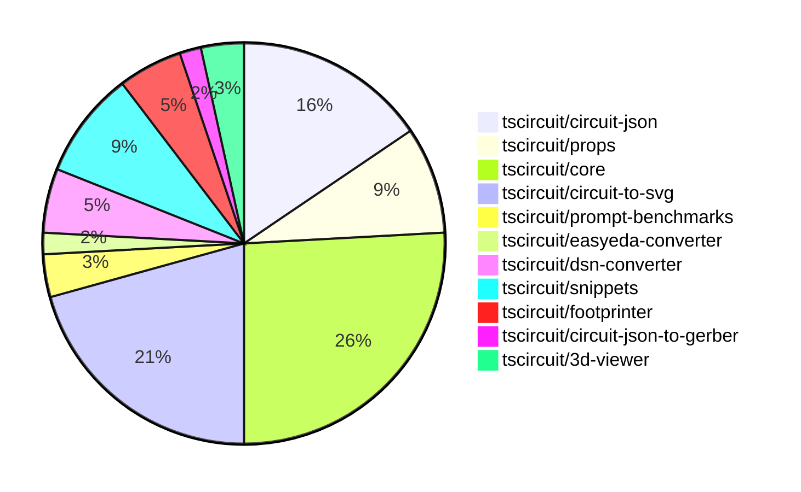

# Contribution Overview 2024-11-06

## PRs by Repository

## Contributor Overview

| Contributor | 🐳 Major | 🐙 Minor | 🐌 Tiny | ⭐ |
|-------------|-------|-------|-------|-------|
| [seveibar](#seveibar) | 10 | 21 | 1 | 👑👑 |
| [ShiboSoftwareDev](#ShiboSoftwareDev) | 2 | 7 | 0 | ⭐⭐ |
| [imrishabh18](#imrishabh18) | 2 | 6 | 0 | ⭐⭐ |
| [DhairyaMajmudar](#DhairyaMajmudar) | 1 | 0 | 0 | ⭐ |
| [Abse2001](#Abse2001) | 0 | 2 | 0 | ⭐ |
| [anas-sarkez](#anas-sarkez) | 1 | 0 | 0 | ⭐ |
| [andrii-balitskyi](#andrii-balitskyi) | 0 | 2 | 0 | ⭐ |
| [mrudulpatil18](#mrudulpatil18) | 0 | 2 | 0 | ⭐ |
| [RohittCodes](#RohittCodes) | 0 | 1 | 0 |  |

## Changes by Repository

### [tscircuit/circuit-json](https://github.com/tscircuit/circuit-json)

| PR # | Impact | Contributor | Description |
|------|--------|-------------|-------------|
| [#77](https://github.com/tscircuit/circuit-json/pull/77) | 🐳 Major | DhairyaMajmudar | Adds a new `PCBMissingFootprintError` component to the application. |
| [#76](https://github.com/tscircuit/circuit-json/pull/76) | 🐙 Minor | Abse2001 | Added a new source component for a simple push button |
| [#74](https://github.com/tscircuit/circuit-json/pull/74) | 🐙 Minor | seveibar | Add `anchor_position` and `symbol_name` properties to the `SchematicNetLabel` type. |
| [#63](https://github.com/tscircuit/circuit-json/pull/63) | 🐙 Minor | seveibar | Improve the definition of the `schematic_debug_object` type in the codebase. |
| [#73](https://github.com/tscircuit/circuit-json/pull/73) | 🐙 Minor | seveibar | Add junctions to the SchematicTrace type. |
| [#72](https://github.com/tscircuit/circuit-json/pull/72) | 🐙 Minor | seveibar | Add a new property `is_crossing` to `SchematicTraceEdge` interface and update the corresponding `schematic_trace` Zod schema. |
| [#70](https://github.com/tscircuit/circuit-json/pull/70) | 🐙 Minor | seveibar | Fixes the parsing of unitless resistance values (e.g. "10k" instead of "10kΩ") in the `convertSiUnitToNumber` function. |
| [#69](https://github.com/tscircuit/circuit-json/pull/69) | 🐙 Minor | seveibar | Refactor the schematic component to use a zodless type, and add a new `symbol_display_value` field. |
| [#68](https://github.com/tscircuit/circuit-json/pull/68) | 🐙 Minor | seveibar | Add a new optional property `display_pin_label` to the `SchematicPort` interface and the corresponding schema. |

### [tscircuit/props](https://github.com/tscircuit/props)

| PR # | Impact | Contributor | Description |
|------|--------|-------------|-------------|
| [#84](https://github.com/tscircuit/props/pull/84) | 🐙 Minor | Abse2001 | Adds a new `pushButtonProps` type to the library. |
| [#83](https://github.com/tscircuit/props/pull/83) | 🐙 Minor | seveibar | Add new `netAlias` props interface and type |
| [#82](https://github.com/tscircuit/props/pull/82) | 🐙 Minor | seveibar | The pull request changes the `pinLabels` type in the `ChipProps` interface to accept readonly arrays instead of mutable arrays. |
| [#80](https://github.com/tscircuit/props/pull/80) | 🐙 Minor | imrishabh18 | The pull request refactors the code to replace the `@tscircuit/soup` dependency with `circuit-json`. |
| [#79](https://github.com/tscircuit/props/pull/79) | 🐙 Minor | imrishabh18 | Adds support for string-based pin definitions in the `PinSideDefinition` interface. |

### [tscircuit/core](https://github.com/tscircuit/core)

| PR # | Impact | Contributor | Description |
|------|--------|-------------|-------------|
| [#264](https://github.com/tscircuit/core/pull/264) | 🐳 Major | seveibar | Adds support for schematic symbol rotation in the NormalComponent class. |
| [#260](https://github.com/tscircuit/core/pull/260) | 🐳 Major | seveibar | Adds junction support for schematic traces, fixing bad trace pushes when connected to the same net. |
| [#257](https://github.com/tscircuit/core/pull/257) | 🐳 Major | seveibar | Implement the `source_trace.subcircuit_connectivity_map_key` feature, which includes updating the `circuit-to-svg` dependency and adding tests for the implementation. |
| [#252](https://github.com/tscircuit/core/pull/252) | 🐳 Major | seveibar | Add support for "trace hop" by splitting schematic trace segments and introducing a new `is_crossing` property. |
| [#251](https://github.com/tscircuit/core/pull/251) | 🐳 Major | seveibar | Fixes a schematic trace overlap issue by pushing traces away from other traces. |
| [#270](https://github.com/tscircuit/core/pull/270) | 🐳 Major | imrishabh18 | The pull request moves the normalize function from easyeda to the core of the project. |
| [#262](https://github.com/tscircuit/core/pull/262) | 🐙 Minor | seveibar | Fix for parsing props correctly when rendering a schematic component with rotation. |
| [#261](https://github.com/tscircuit/core/pull/261) | 🐙 Minor | seveibar | Add anchor_position to schematic_net_label, and create net labels when a schematic trace is connected to a net on one side. |
| [#247](https://github.com/tscircuit/core/pull/247) | 🐙 Minor | seveibar | Add display_pin_label to schematic ports and symbol_display_value to schematic components |
| [#245](https://github.com/tscircuit/core/pull/245) | 🐙 Minor | imrishabh18 | Overrides footprint ports when port arrangement is present in the schematic. |
| [#269](https://github.com/tscircuit/core/pull/269) | 🐙 Minor | ShiboSoftwareDev | The change updates the calculation of the `schematic_port.facing_direction` to be more accurate based on the `localPortInfo.side` property. |
| [#268](https://github.com/tscircuit/core/pull/268) | 🐙 Minor | ShiboSoftwareDev | Added support for schematic rotation of capacitor, inductor, diode, and LED components. |
| [#259](https://github.com/tscircuit/core/pull/259) | 🐙 Minor | ShiboSoftwareDev | The schematic box components now expand to fit the label text. |
| [#244](https://github.com/tscircuit/core/pull/244) | 🐙 Minor | andrii-balitskyi | Adds a GitHub Actions workflow to automatically format the code in pull requests. |
| [#243](https://github.com/tscircuit/core/pull/243) | 🐙 Minor | andrii-balitskyi | Add a new hook called `useLed` to create LED components for the circuit. |

### [tscircuit/circuit-to-svg](https://github.com/tscircuit/circuit-to-svg)

| PR # | Impact | Contributor | Description |
|------|--------|-------------|-------------|
| [#117](https://github.com/tscircuit/circuit-to-svg/pull/117) | 🐳 Major | seveibar | Adds nonexistent symbol handling and error message when symbol ports don't align. |
| [#113](https://github.com/tscircuit/circuit-to-svg/pull/113) | 🐳 Major | seveibar | Introduces comprehensive metrics for Arial text rendering, including width, height, ascent, descent, left, and right properties for each character. |
| [#112](https://github.com/tscircuit/circuit-to-svg/pull/112) | 🐳 Major | seveibar | Add junction support and improve drawing of wire crossings |
| [#110](https://github.com/tscircuit/circuit-to-svg/pull/110) | 🐳 Major | seveibar | Introduces initial implementation for crossing trace rendering in the schematic SVG generation. |
| [#114](https://github.com/tscircuit/circuit-to-svg/pull/114) | 🐳 Major | ShiboSoftwareDev | Adds an option to draw PCB trace errors in the SVG output. |
| [#111](https://github.com/tscircuit/circuit-to-svg/pull/111) | 🐙 Minor | seveibar | Fix the position of labeled points and make the font sans-serif |
| [#109](https://github.com/tscircuit/circuit-to-svg/pull/109) | 🐙 Minor | seveibar | Fixes schematic port label name, anchoring of bottom text on components, and updates core |
| [#108](https://github.com/tscircuit/circuit-to-svg/pull/108) | 🐙 Minor | seveibar | Change the way symbol values are displayed by using the `symbol_display_value` property instead of the deprecated `display_value`, `capacitance`, and `resistance` properties. |
| [#107](https://github.com/tscircuit/circuit-to-svg/pull/107) | 🐙 Minor | seveibar | Adds a GitHub Actions workflow to check the codebase formatting and enforce the `noConsole` rule. |
| [#115](https://github.com/tscircuit/circuit-to-svg/pull/115) | 🐙 Minor | imrishabh18 | Use the source port name for the pin text instead of the pin number. |
| [#106](https://github.com/tscircuit/circuit-to-svg/pull/106) | 🐙 Minor | imrishabh18 | Adds support for schematic net labels, including rendering the label text and label container path. |
| [#116](https://github.com/tscircuit/circuit-to-svg/pull/116) | 🐌 Tiny | seveibar | Reverts the previous change that used the source port name for the pin text. |

### [tscircuit/prompt-benchmarks](https://github.com/tscircuit/prompt-benchmarks)

| PR # | Impact | Contributor | Description |
|------|--------|-------------|-------------|
| [#4](https://github.com/tscircuit/prompt-benchmarks/pull/4) | 🐳 Major | seveibar | Introduces a new set of prompt templates for creating circuit board components and adds sample test cases for them. |
| [#5](https://github.com/tscircuit/prompt-benchmarks/pull/5) | 🐙 Minor | seveibar | Adds support for tscircuit snippets integration and virtual filesystem to generate prompts. |

### [tscircuit/easyeda-converter](https://github.com/tscircuit/easyeda-converter)

| PR # | Impact | Contributor | Description |
|------|--------|-------------|-------------|
| [#101](https://github.com/tscircuit/easyeda-converter/pull/101) | 🐙 Minor | seveibar | Removed the `schPinSpacing` property from the `SoupTypescriptComponentTemplate` component. |

### [tscircuit/dsn-converter](https://github.com/tscircuit/dsn-converter)

| PR # | Impact | Contributor | Description |
|------|--------|-------------|-------------|
| [#13](https://github.com/tscircuit/dsn-converter/pull/13) | 🐳 Major | imrishabh18 | Adds a feature to convert circuit JSON to DSN JSON and vice versa. |
| [#14](https://github.com/tscircuit/dsn-converter/pull/14) | 🐙 Minor | seveibar | Update the README.md file to include more detailed usage examples and documentation. |
| [#15](https://github.com/tscircuit/dsn-converter/pull/15) | 🐙 Minor | imrishabh18 | Add support for the polygon shape in the `convert-padstacks-to-smtpads.ts` file. |

### [tscircuit/snippets](https://github.com/tscircuit/snippets)

| PR # | Impact | Contributor | Description |
|------|--------|-------------|-------------|
| [#173](https://github.com/tscircuit/snippets/pull/173) | 🐙 Minor | seveibar | Update dependencies to the latest versions |
| [#169](https://github.com/tscircuit/snippets/pull/169) | 🐙 Minor | seveibar | Updates dependencies (core and circuit-to-svg), and replaces the schematic viewer with a new component that uses the circuit-to-svg library with mouse controls. |
| [#176](https://github.com/tscircuit/snippets/pull/176) | 🐙 Minor | mrudulpatil18 | Improve the UI of the CMDK dialog by adding keyboard navigation, selecting entries, and creating aliases for certain template types. |
| [#170](https://github.com/tscircuit/snippets/pull/170) | 🐙 Minor | mrudulpatil18 | Adds functionality to change the snippet type in the API and UI. |
| [#178](https://github.com/tscircuit/snippets/pull/178) | 🐙 Minor | RohittCodes | Adds a zoom effect for the schematic view by setting the `transformOrigin` style property. |

### [tscircuit/footprinter](https://github.com/tscircuit/footprinter)

| PR # | Impact | Contributor | Description |
|------|--------|-------------|-------------|
| [#78](https://github.com/tscircuit/footprinter/pull/78) | 🐳 Major | anas-sarkez | Implemented the sot235 (sot23-5) footprint with testing. |
| [#77](https://github.com/tscircuit/footprinter/pull/77) | 🐙 Minor | ShiboSoftwareDev | The `getFootprintNames` function is now a method of the `footprinter` object. |
| [#76](https://github.com/tscircuit/footprinter/pull/76) | 🐙 Minor | ShiboSoftwareDev | Adds a new method `getFootprintNames()` to the `Footprinter` object, which returns an array of footprint names. |

### [tscircuit/circuit-json-to-gerber](https://github.com/tscircuit/circuit-json-to-gerber)

| PR # | Impact | Contributor | Description |
|------|--------|-------------|-------------|
| [#27](https://github.com/tscircuit/circuit-json-to-gerber/pull/27) | 🐳 Major | ShiboSoftwareDev | Adds support for silkscreen text rendering in the Gerber conversion process. |

### [tscircuit/3d-viewer](https://github.com/tscircuit/3d-viewer)

| PR # | Impact | Contributor | Description |
|------|--------|-------------|-------------|
| [#33](https://github.com/tscircuit/3d-viewer/pull/33) | 🐙 Minor | ShiboSoftwareDev | Adds a feature to hover over component to highlight and view reference designator |
| [#34](https://github.com/tscircuit/3d-viewer/pull/34) | 🐙 Minor | ShiboSoftwareDev | Changed the highlight color of the 3D model from a low-intensity white to a blue color. |

## Changes by Contributor

### [DhairyaMajmudar](https://github.com/DhairyaMajmudar)

| PR # | Impact | Description |
|------|--------|-------------|
| [#77](https://github.com/tscircuit/circuit-json/pull/77) | 🐳 Major | Adds a new `PCBMissingFootprintError` component to the application. |

### [Abse2001](https://github.com/Abse2001)

| PR # | Impact | Description |
|------|--------|-------------|
| [#76](https://github.com/tscircuit/circuit-json/pull/76) | 🐙 Minor | Added a new source component for a simple push button |
| [#84](https://github.com/tscircuit/props/pull/84) | 🐙 Minor | Adds a new `pushButtonProps` type to the library. |

### [seveibar](https://github.com/seveibar)

| PR # | Impact | Description |
|------|--------|-------------|
| [#264](https://github.com/tscircuit/core/pull/264) | 🐳 Major | Adds support for schematic symbol rotation in the NormalComponent class. |
| [#260](https://github.com/tscircuit/core/pull/260) | 🐳 Major | Adds junction support for schematic traces, fixing bad trace pushes when connected to the same net. |
| [#257](https://github.com/tscircuit/core/pull/257) | 🐳 Major | Implement the `source_trace.subcircuit_connectivity_map_key` feature, which includes updating the `circuit-to-svg` dependency and adding tests for the implementation. |
| [#252](https://github.com/tscircuit/core/pull/252) | 🐳 Major | Add support for "trace hop" by splitting schematic trace segments and introducing a new `is_crossing` property. |
| [#251](https://github.com/tscircuit/core/pull/251) | 🐳 Major | Fixes a schematic trace overlap issue by pushing traces away from other traces. |
| [#117](https://github.com/tscircuit/circuit-to-svg/pull/117) | 🐳 Major | Adds nonexistent symbol handling and error message when symbol ports don't align. |
| [#113](https://github.com/tscircuit/circuit-to-svg/pull/113) | 🐳 Major | Introduces comprehensive metrics for Arial text rendering, including width, height, ascent, descent, left, and right properties for each character. |
| [#112](https://github.com/tscircuit/circuit-to-svg/pull/112) | 🐳 Major | Add junction support and improve drawing of wire crossings |
| [#110](https://github.com/tscircuit/circuit-to-svg/pull/110) | 🐳 Major | Introduces initial implementation for crossing trace rendering in the schematic SVG generation. |
| [#4](https://github.com/tscircuit/prompt-benchmarks/pull/4) | 🐳 Major | Introduces a new set of prompt templates for creating circuit board components and adds sample test cases for them. |
| [#74](https://github.com/tscircuit/circuit-json/pull/74) | 🐙 Minor | Add `anchor_position` and `symbol_name` properties to the `SchematicNetLabel` type. |
| [#63](https://github.com/tscircuit/circuit-json/pull/63) | 🐙 Minor | Improve the definition of the `schematic_debug_object` type in the codebase. |
| [#73](https://github.com/tscircuit/circuit-json/pull/73) | 🐙 Minor | Add junctions to the SchematicTrace type. |
| [#72](https://github.com/tscircuit/circuit-json/pull/72) | 🐙 Minor | Add a new property `is_crossing` to `SchematicTraceEdge` interface and update the corresponding `schematic_trace` Zod schema. |
| [#70](https://github.com/tscircuit/circuit-json/pull/70) | 🐙 Minor | Fixes the parsing of unitless resistance values (e.g. "10k" instead of "10kΩ") in the `convertSiUnitToNumber` function. |
| [#69](https://github.com/tscircuit/circuit-json/pull/69) | 🐙 Minor | Refactor the schematic component to use a zodless type, and add a new `symbol_display_value` field. |
| [#68](https://github.com/tscircuit/circuit-json/pull/68) | 🐙 Minor | Add a new optional property `display_pin_label` to the `SchematicPort` interface and the corresponding schema. |
| [#83](https://github.com/tscircuit/props/pull/83) | 🐙 Minor | Add new `netAlias` props interface and type |
| [#82](https://github.com/tscircuit/props/pull/82) | 🐙 Minor | The pull request changes the `pinLabels` type in the `ChipProps` interface to accept readonly arrays instead of mutable arrays. |
| [#101](https://github.com/tscircuit/easyeda-converter/pull/101) | 🐙 Minor | Removed the `schPinSpacing` property from the `SoupTypescriptComponentTemplate` component. |
| [#262](https://github.com/tscircuit/core/pull/262) | 🐙 Minor | Fix for parsing props correctly when rendering a schematic component with rotation. |
| [#261](https://github.com/tscircuit/core/pull/261) | 🐙 Minor | Add anchor_position to schematic_net_label, and create net labels when a schematic trace is connected to a net on one side. |
| [#247](https://github.com/tscircuit/core/pull/247) | 🐙 Minor | Add display_pin_label to schematic ports and symbol_display_value to schematic components |
| [#111](https://github.com/tscircuit/circuit-to-svg/pull/111) | 🐙 Minor | Fix the position of labeled points and make the font sans-serif |
| [#109](https://github.com/tscircuit/circuit-to-svg/pull/109) | 🐙 Minor | Fixes schematic port label name, anchoring of bottom text on components, and updates core |
| [#108](https://github.com/tscircuit/circuit-to-svg/pull/108) | 🐙 Minor | Change the way symbol values are displayed by using the `symbol_display_value` property instead of the deprecated `display_value`, `capacitance`, and `resistance` properties. |
| [#107](https://github.com/tscircuit/circuit-to-svg/pull/107) | 🐙 Minor | Adds a GitHub Actions workflow to check the codebase formatting and enforce the `noConsole` rule. |
| [#14](https://github.com/tscircuit/dsn-converter/pull/14) | 🐙 Minor | Update the README.md file to include more detailed usage examples and documentation. |
| [#173](https://github.com/tscircuit/snippets/pull/173) | 🐙 Minor | Update dependencies to the latest versions |
| [#169](https://github.com/tscircuit/snippets/pull/169) | 🐙 Minor | Updates dependencies (core and circuit-to-svg), and replaces the schematic viewer with a new component that uses the circuit-to-svg library with mouse controls. |
| [#5](https://github.com/tscircuit/prompt-benchmarks/pull/5) | 🐙 Minor | Adds support for tscircuit snippets integration and virtual filesystem to generate prompts. |
| [#116](https://github.com/tscircuit/circuit-to-svg/pull/116) | 🐌 Tiny | Reverts the previous change that used the source port name for the pin text. |

### [imrishabh18](https://github.com/imrishabh18)

| PR # | Impact | Description |
|------|--------|-------------|
| [#270](https://github.com/tscircuit/core/pull/270) | 🐳 Major | The pull request moves the normalize function from easyeda to the core of the project. |
| [#13](https://github.com/tscircuit/dsn-converter/pull/13) | 🐳 Major | Adds a feature to convert circuit JSON to DSN JSON and vice versa. |
| [#80](https://github.com/tscircuit/props/pull/80) | 🐙 Minor | The pull request refactors the code to replace the `@tscircuit/soup` dependency with `circuit-json`. |
| [#79](https://github.com/tscircuit/props/pull/79) | 🐙 Minor | Adds support for string-based pin definitions in the `PinSideDefinition` interface. |
| [#245](https://github.com/tscircuit/core/pull/245) | 🐙 Minor | Overrides footprint ports when port arrangement is present in the schematic. |
| [#115](https://github.com/tscircuit/circuit-to-svg/pull/115) | 🐙 Minor | Use the source port name for the pin text instead of the pin number. |
| [#106](https://github.com/tscircuit/circuit-to-svg/pull/106) | 🐙 Minor | Adds support for schematic net labels, including rendering the label text and label container path. |
| [#15](https://github.com/tscircuit/dsn-converter/pull/15) | 🐙 Minor | Add support for the polygon shape in the `convert-padstacks-to-smtpads.ts` file. |

### [anas-sarkez](https://github.com/anas-sarkez)

| PR # | Impact | Description |
|------|--------|-------------|
| [#78](https://github.com/tscircuit/footprinter/pull/78) | 🐳 Major | Implemented the sot235 (sot23-5) footprint with testing. |

### [ShiboSoftwareDev](https://github.com/ShiboSoftwareDev)

| PR # | Impact | Description |
|------|--------|-------------|
| [#114](https://github.com/tscircuit/circuit-to-svg/pull/114) | 🐳 Major | Adds an option to draw PCB trace errors in the SVG output. |
| [#27](https://github.com/tscircuit/circuit-json-to-gerber/pull/27) | 🐳 Major | Adds support for silkscreen text rendering in the Gerber conversion process. |
| [#77](https://github.com/tscircuit/footprinter/pull/77) | 🐙 Minor | The `getFootprintNames` function is now a method of the `footprinter` object. |
| [#76](https://github.com/tscircuit/footprinter/pull/76) | 🐙 Minor | Adds a new method `getFootprintNames()` to the `Footprinter` object, which returns an array of footprint names. |
| [#33](https://github.com/tscircuit/3d-viewer/pull/33) | 🐙 Minor | Adds a feature to hover over component to highlight and view reference designator |
| [#34](https://github.com/tscircuit/3d-viewer/pull/34) | 🐙 Minor | Changed the highlight color of the 3D model from a low-intensity white to a blue color. |
| [#269](https://github.com/tscircuit/core/pull/269) | 🐙 Minor | The change updates the calculation of the `schematic_port.facing_direction` to be more accurate based on the `localPortInfo.side` property. |
| [#268](https://github.com/tscircuit/core/pull/268) | 🐙 Minor | Added support for schematic rotation of capacitor, inductor, diode, and LED components. |
| [#259](https://github.com/tscircuit/core/pull/259) | 🐙 Minor | The schematic box components now expand to fit the label text. |

### [andrii-balitskyi](https://github.com/andrii-balitskyi)

| PR # | Impact | Description |
|------|--------|-------------|
| [#244](https://github.com/tscircuit/core/pull/244) | 🐙 Minor | Adds a GitHub Actions workflow to automatically format the code in pull requests. |
| [#243](https://github.com/tscircuit/core/pull/243) | 🐙 Minor | Add a new hook called `useLed` to create LED components for the circuit. |

### [mrudulpatil18](https://github.com/mrudulpatil18)

| PR # | Impact | Description |
|------|--------|-------------|
| [#176](https://github.com/tscircuit/snippets/pull/176) | 🐙 Minor | Improve the UI of the CMDK dialog by adding keyboard navigation, selecting entries, and creating aliases for certain template types. |
| [#170](https://github.com/tscircuit/snippets/pull/170) | 🐙 Minor | Adds functionality to change the snippet type in the API and UI. |

### [RohittCodes](https://github.com/RohittCodes)

| PR # | Impact | Description |
|------|--------|-------------|
| [#178](https://github.com/tscircuit/snippets/pull/178) | 🐙 Minor | Adds a zoom effect for the schematic view by setting the `transformOrigin` style property. |

