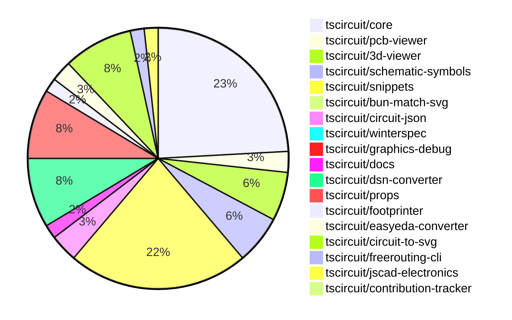

# Contribution Overview 2024-11-13

## PRs by Repository

## Contributor Overview

| Contributor | 🐳 Major | 🐙 Minor | 🐌 Tiny | ⭐ |
|-------------|-------|-------|-------|-------|
| [seveibar](#seveibar) | 9 | 39 | 1 | 👑👑👑 |
| [imrishabh18](#imrishabh18) | 4 | 18 | 0 | 👑 |
| [anas-sarkez](#anas-sarkez) | 5 | 9 | 1 | ⭐⭐⭐ |
| [ShiboSoftwareDev](#ShiboSoftwareDev) | 2 | 9 | 1 | ⭐⭐ |
| [Abse2001](#Abse2001) | 1 | 5 | 1 | ⭐⭐ |
| [RohittCodes](#RohittCodes) | 1 | 4 | 0 | ⭐⭐ |
| [mrudulpatil18](#mrudulpatil18) | 0 | 4 | 0 | ⭐ |
| [DhairyaMajmudar](#DhairyaMajmudar) | 1 | 0 | 0 | ⭐ |
| [kom-senapati](#kom-senapati) | 0 | 2 | 0 | ⭐ |
| [Anshgrover23](#Anshgrover23) | 0 | 1 | 0 |  |
| [andrii-balitskyi](#andrii-balitskyi) | 0 | 0 | 1 |  |

## Review Table

| Contributor | Reviews Received | Approvals | Rejections | Changes Requested | PRs Opened | PRs Closed |
|-------------|------------------|-----------|------------|-------------------|------------|------------|
| [Abse2001](https://github.com/Abse2001) | 12 | 7 | 5 | 1 | 8 | 8 |
| [ShiboSoftwareDev](https://github.com/ShiboSoftwareDev) | 16 | 13 | 5 | 0 | 14 | 12 |
| [seveibar](https://github.com/seveibar) | 1 | 0 | 16 | 0 | 54 | 54 |
| [imrishabh18](https://github.com/imrishabh18) | 22 | 14 | 6 | 3 | 25 | 23 |
| [tscircuitbot](https://github.com/tscircuitbot) | 0 | 0 | 0 | 0 | 1 | 1 |
| [anas-sarkez](https://github.com/anas-sarkez) | 36 | 16 | 13 | 3 | 17 | 16 |
| [DhairyaMajmudar](https://github.com/DhairyaMajmudar) | 17 | 1 | 2 | 9 | 6 | 4 |
| [mrudulpatil18](https://github.com/mrudulpatil18) | 7 | 5 | 0 | 1 | 6 | 4 |
| [vishwamartur](https://github.com/vishwamartur) | 7 | 0 | 1 | 4 | 4 | 4 |
| [developerfred](https://github.com/developerfred) | 0 | 0 | 0 | 0 | 2 | 1 |
| [andrii-balitskyi](https://github.com/andrii-balitskyi) | 1 | 1 | 0 | 0 | 1 | 1 |
| [Anshgrover23](https://github.com/Anshgrover23) | 2 | 1 | 0 | 1 | 3 | 1 |
| [kom-senapati](https://github.com/kom-senapati) | 6 | 2 | 0 | 2 | 2 | 2 |
| [AkashJana18](https://github.com/AkashJana18) | 2 | 0 | 1 | 1 | 1 | 0 |
| [ni9999](https://github.com/ni9999) | 2 | 0 | 3 | 1 | 1 | 0 |
| [hunxjunedo](https://github.com/hunxjunedo) | 1 | 0 | 0 | 0 | 2 | 1 |
| [Niharika0104](https://github.com/Niharika0104) | 1 | 0 | 2 | 0 | 1 | 0 |
| [RohittCodes](https://github.com/RohittCodes) | 46 | 10 | 1 | 7 | 9 | 5 |

## Changes by Repository

### [tscircuit/core](https://github.com/tscircuit/core)

| PR # | Impact | Contributor | Description |
|------|--------|-------------|-------------|
| [#319](https://github.com/tscircuit/core/pull/319) | 🐳 Major | Abse2001 | Introduce a new `<pushbutton />` component |
| [#336](https://github.com/tscircuit/core/pull/336) | 🐳 Major | seveibar | The pull request changes the default format for async autorouting from SimpleRouteJson to CircuitJson, and includes fixes and testing for the async autorouter for production usage. |
| [#316](https://github.com/tscircuit/core/pull/316) | 🐳 Major | seveibar | Fixes the Subcircuit Refdes Selection (Subcircuit Isolation Part 1) |
| [#309](https://github.com/tscircuit/core/pull/309) | 🐳 Major | seveibar | The pull request fixes the type inference for pin numbers in the `createUseComponent` hooks. |
| [#297](https://github.com/tscircuit/core/pull/297) | 🐳 Major | seveibar | Fixes complex trace crossings by creating additional crossing segments and handling intersections more robustly. |
| [#292](https://github.com/tscircuit/core/pull/292) | 🐳 Major | seveibar | The pull request allows the `schPortArrangement` property to accept string values instead of only numbers. |
| [#300](https://github.com/tscircuit/core/pull/300) | 🐳 Major | imrishabh18 | Adds a new component, Potentiometer, to the library. |
| [#339](https://github.com/tscircuit/core/pull/339) | 🐙 Minor | Abse2001 | Implemented `getInheritedProperty` method in `PrimitiveComponent` class to retrieve property values from the component's ancestors. |
| [#315](https://github.com/tscircuit/core/pull/315) | 🐙 Minor | ShiboSoftwareDev | Fixed non-port elements being added as ports for custom footprints. |
| [#314](https://github.com/tscircuit/core/pull/314) | 🐙 Minor | ShiboSoftwareDev | Fixed the rendering of the battery symbol. |
| [#334](https://github.com/tscircuit/core/pull/334) | 🐙 Minor | seveibar | Adds a stalebot workflow to the GitHub repository to automatically close stale issues and pull requests. |
| [#326](https://github.com/tscircuit/core/pull/326) | 🐙 Minor | seveibar | Adds the ability to disable trace rendering inside subcircuits. |
| [#323](https://github.com/tscircuit/core/pull/323) | 🐙 Minor | seveibar | Fixes an issue with bundle size reporting for non-organization members. |
| [#305](https://github.com/tscircuit/core/pull/305) | 🐙 Minor | seveibar | Update the schematic symbols library to version 0.0.98, which likely includes updates to the capacitor symbol directions. |
| [#303](https://github.com/tscircuit/core/pull/303) | 🐙 Minor | seveibar | Adds support for more directional symbol names in the PrimitiveComponent class. |
| [#299](https://github.com/tscircuit/core/pull/299) | 🐙 Minor | seveibar | Fixes a bug related to the simplified overshot check in the `create-schematic-trace-crossing-segments` function. |
| [#296](https://github.com/tscircuit/core/pull/296) | 🐙 Minor | seveibar | Fix the facing direction of the net label |
| [#333](https://github.com/tscircuit/core/pull/333) | 🐙 Minor | imrishabh18 | Caches the PCB trace route to improve re-rendering performance |
| [#295](https://github.com/tscircuit/core/pull/295) | 🐙 Minor | imrishabh18 | Adjusts the padding of the schematic box only when a label is present, fixing the issue where the header width was not properly adjusted. |
| [#294](https://github.com/tscircuit/core/pull/294) | 🐙 Minor | imrishabh18 | Adds the `facingDirection` prop to the `PinHeader` component, allowing control over the positioning of the pins. |
| [#338](https://github.com/tscircuit/core/pull/338) | 🐙 Minor | anas-sarkez | Added support for tracing obstacles around schematic boxes in the Trace component. |
| [#335](https://github.com/tscircuit/core/pull/335) | 🐙 Minor | anas-sarkez | Resolved an issue where pin labels for the PinHeader component were not being drawn in SVG. |
| [#322](https://github.com/tscircuit/core/pull/322) | 🐙 Minor | anas-sarkez | The pull request refactors the trace handling to not pass the trace to the chip manufacturer part number and name. |
| [#330](https://github.com/tscircuit/core/pull/330) | 🐌 Tiny | anas-sarkez | Updated the bun lockfile |
| [#329](https://github.com/tscircuit/core/pull/329) | 🟣 | anas-sarkez | Updates the lockfile. |
| [#253](https://github.com/tscircuit/core/pull/253) | 🐳 Major | DhairyaMajmudar | Adds error handling for missing footprint in the `NormalComponent` class by introducing a `MissingFootprintError` class and updating the `NormalComponent` class to handle missing footprints. |
| [#325](https://github.com/tscircuit/core/pull/325) | 🐙 Minor | anas-sarkez | Modify the position of the manufacturer part number and name label for Chip, Jumper, and PinHeader components. |
| [#242](https://github.com/tscircuit/core/pull/242) | 🐌 Tiny | andrii-balitskyi | Adds a test for the `useDiode` hook to ensure it creates components with the correct props and traces. |

### [tscircuit/pcb-viewer](https://github.com/tscircuit/pcb-viewer)

| PR # | Impact | Contributor | Description |
|------|--------|-------------|-------------|
| [#83](https://github.com/tscircuit/pcb-viewer/pull/83) | 🐙 Minor | Abse2001 | Fixes a type error by enforcing the string type for a parameter. |
| [#82](https://github.com/tscircuit/pcb-viewer/pull/82) | 🐙 Minor | ShiboSoftwareDev | Add a biome format script to the project |
| [#81](https://github.com/tscircuit/pcb-viewer/pull/81) | 🐙 Minor | seveibar | Update the README to include usage details for the `circuitJson` prop and other available props for the `PCBViewer` component. |

### [tscircuit/3d-viewer](https://github.com/tscircuit/3d-viewer)

| PR # | Impact | Contributor | Description |
|------|--------|-------------|-------------|
| [#40](https://github.com/tscircuit/3d-viewer/pull/40) | 🐳 Major | imrishabh18 | Reverts a previous update to the fiber version, as it was breaking the 3D viewer. |
| [#38](https://github.com/tscircuit/3d-viewer/pull/38) | 🐳 Major | anas-sarkez | The change adds support for rendering pill-shaped board cutouts (holes) in the 3D viewer. |
| [#41](https://github.com/tscircuit/3d-viewer/pull/41) | 🐙 Minor | Abse2001 | Updating the 'jscad-electronics' dependency to version 0.0.21 to fix an issue with capacitor footprints not changing the 3D capacitor color in snippets. |
| [#44](https://github.com/tscircuit/3d-viewer/pull/44) | 🐙 Minor | ShiboSoftwareDev | Allows plated holes to be either horizontal or vertical |
| [#39](https://github.com/tscircuit/3d-viewer/pull/39) | 🐙 Minor | anas-sarkez | Updates dependencies in the package.json file |
| [#37](https://github.com/tscircuit/3d-viewer/pull/37) | 🐙 Minor | mrudulpatil18 | Positions the hover label below the pointer and updates its position frame by frame to prevent it from drifting away when the camera view changes. |
| [#42](https://github.com/tscircuit/3d-viewer/pull/42) | 🐌 Tiny | Abse2001 | Updated the project's lockfile. |

### [tscircuit/schematic-symbols](https://github.com/tscircuit/schematic-symbols)

| PR # | Impact | Contributor | Description |
|------|--------|-------------|-------------|
| [#204](https://github.com/tscircuit/schematic-symbols/pull/204) | 🐳 Major | seveibar | Flip the y-coordinates of the exported SVG symbols to make the Y-axis positive upwards. |
| [#198](https://github.com/tscircuit/schematic-symbols/pull/198) | 🐳 Major | anas-sarkez | Implemented flipSymbolOverYAxis and flipSymbolOverXAxis functions to modify LED arrows directions |
| [#195](https://github.com/tscircuit/schematic-symbols/pull/195) | 🐳 Major | anas-sarkez | Changes the LED symbol to have up, right, left, and down orientations instead of just horizontal and vertical. |
| [#212](https://github.com/tscircuit/schematic-symbols/pull/212) | 🐙 Minor | Abse2001 | Create a new function `approximateBezier` to improve 'C' case handling and add a new symbol `capacitor_polarised`. |
| [#206](https://github.com/tscircuit/schematic-symbols/pull/206) | 🐙 Minor | seveibar | Move the `modifySymbol` function from `scripts/lib/modify-symbol` to `drawing/modify-symbol` for export. |
| [#199](https://github.com/tscircuit/schematic-symbols/pull/199) | 🐙 Minor | seveibar | Adds new symbols for capacitors in different orientations (down, left, right, up) |
| [#197](https://github.com/tscircuit/schematic-symbols/pull/197) | 🐙 Minor | imrishabh18 | Fix the position of the potentiometer label in the horizontal and vertical symbols. |

### [tscircuit/snippets](https://github.com/tscircuit/snippets)

| PR # | Impact | Contributor | Description |
|------|--------|-------------|-------------|
| [#246](https://github.com/tscircuit/snippets/pull/246) | 🐳 Major | ShiboSoftwareDev | Introduces a new "insert chip" feature in the footprinter repository. |
| [#252](https://github.com/tscircuit/snippets/pull/252) | 🐳 Major | seveibar | Reverts a previous change that caused a regression in the CodeEditor component. |
| [#208](https://github.com/tscircuit/snippets/pull/208) | 🐳 Major | imrishabh18 | The pull request adds a new feature to download the DSN file format from the circuit JSON data. |
| [#237](https://github.com/tscircuit/snippets/pull/237) | 🐳 Major | RohittCodes |  |
| [#247](https://github.com/tscircuit/snippets/pull/247) | 🐙 Minor | Abse2001 | Updated the version of the `@tscircuit/3d-viewer` package from `0.0.39` to `0.0.40`. |
| [#267](https://github.com/tscircuit/snippets/pull/267) | 🐙 Minor | ShiboSoftwareDev | Adds a spinner to the "Run" button when the code is running |
| [#257](https://github.com/tscircuit/snippets/pull/257) | 🐙 Minor | ShiboSoftwareDev | Add a dropdown menu to the "Insert" button in the code editor header, with an option to insert a footprint. |
| [#264](https://github.com/tscircuit/snippets/pull/264) | 🐙 Minor | seveibar | Improve the keying for the circuit JSON in the `use-run-tsx` hook to use the length of the `circuitJson` property in addition to the random string. |
| [#263](https://github.com/tscircuit/snippets/pull/263) | 🐙 Minor | seveibar | Update the "@tscircuit/core" package from version 0.0.192 to 0.0.193 |
| [#242](https://github.com/tscircuit/snippets/pull/242) | 🐙 Minor | seveibar | Redirect the /playground URL to the editor with a "blank-circuit-board" template. |
| [#254](https://github.com/tscircuit/snippets/pull/254) | 🐙 Minor | seveibar | Add a GitHub link to the landing page |
| [#240](https://github.com/tscircuit/snippets/pull/240) | 🐙 Minor | seveibar | Update renovate settings to include circuit-json package and group all updates together. |
| [#220](https://github.com/tscircuit/snippets/pull/220) | 🐙 Minor | seveibar | Update core and circuit-to-svg packages for capacitor rotation fixes |
| [#213](https://github.com/tscircuit/snippets/pull/213) | 🐙 Minor | seveibar | Improve the reloading of the PCB viewer by using a unique key for the PCB viewer component. |
| [#196](https://github.com/tscircuit/snippets/pull/196) | 🐙 Minor | seveibar | Adds support for async circuit rendering and opens BOM links in a new tab. |
| [#235](https://github.com/tscircuit/snippets/pull/235) | 🐙 Minor | imrishabh18 | Update the version of the `@tscircuit/3d-viewer` dependency to fix a 3D view issue. |
| [#236](https://github.com/tscircuit/snippets/pull/236) | 🐙 Minor | mrudulpatil18 | Update the iframe embedding link to use the /preview endpoint instead of the /embed endpoint. |
| [#179](https://github.com/tscircuit/snippets/pull/179) | 🐙 Minor | mrudulpatil18 | Added a /preview route to view the `<PreviewContent>` component and modified the sidebar to allow copying embed code for this route. |
| [#206](https://github.com/tscircuit/snippets/pull/206) | 🐙 Minor | mrudulpatil18 |  |
| [#218](https://github.com/tscircuit/snippets/pull/218) | 🐙 Minor | kom-senapati | Adds a utility function to get the React TypeScript syntax error message and uses it in the `use-run-tsx` hook. |
| [#268](https://github.com/tscircuit/snippets/pull/268) | 🐙 Minor | RohittCodes | Initialize `manualEditsFileContent` with the `manual_edits_json` from the `snippet` when the page loads. |
| [#248](https://github.com/tscircuit/snippets/pull/248) | 🐙 Minor | RohittCodes | Adds support for manual edits to JSON snippets. |
| [#250](https://github.com/tscircuit/snippets/pull/250) | 🐙 Minor | RohittCodes | Fixes an issue where unnecessary dispatching causes the editor's cursor to go to line 0. |
| [#182](https://github.com/tscircuit/snippets/pull/182) | 🐙 Minor | RohittCodes | Refactor the search text component to handle different viewport sizes and improve the appearance of search results. |
| [#233](https://github.com/tscircuit/snippets/pull/233) | 🐙 Minor | Anshgrover23 | Fixes the issue where hovering over traces does not change the color. |
| [#258](https://github.com/tscircuit/snippets/pull/258) | 🐌 Tiny | seveibar | Skips the parts engine test on CI |

### [tscircuit/bun-match-svg](https://github.com/tscircuit/bun-match-svg)

| PR # | Impact | Contributor | Description |
|------|--------|-------------|-------------|
| [#4](https://github.com/tscircuit/bun-match-svg/pull/4) | 🐳 Major | ShiboSoftwareDev | Implemented a CLI tool that initializes this project in other repositories. |

### [tscircuit/circuit-json](https://github.com/tscircuit/circuit-json)

| PR # | Impact | Contributor | Description |
|------|--------|-------------|-------------|
| [#82](https://github.com/tscircuit/circuit-json/pull/82) | 🐙 Minor | ShiboSoftwareDev | Introduces a new shape type "rotated_rect" for SMT pads on the PCB. |
| [#81](https://github.com/tscircuit/circuit-json/pull/81) | 🐙 Minor | imrishabh18 | Adds a new source component called "crystal" to the project. |
| [#80](https://github.com/tscircuit/circuit-json/pull/80) | 🐙 Minor | imrishabh18 | Adds a new `source_simple_potentiometer` component to the `any_source_component` union type. |
| [#79](https://github.com/tscircuit/circuit-json/pull/79) | 🐙 Minor | imrishabh18 | Adds a new source component for a simple potentiometer. |

### [tscircuit/winterspec](https://github.com/tscircuit/winterspec)

| PR # | Impact | Contributor | Description |
|------|--------|-------------|-------------|
| [#22](https://github.com/tscircuit/winterspec/pull/22) | 🐙 Minor | ShiboSoftwareDev | Exports common middleware with testing |

### [tscircuit/graphics-debug](https://github.com/tscircuit/graphics-debug)

| PR # | Impact | Contributor | Description |
|------|--------|-------------|-------------|
| [#9](https://github.com/tscircuit/graphics-debug/pull/9) | 🐙 Minor | ShiboSoftwareDev | Adds error handling and visual feedback when parsing the input graphics debug output fails. |

### [tscircuit/docs](https://github.com/tscircuit/docs)

| PR # | Impact | Contributor | Description |
|------|--------|-------------|-------------|
| [#37](https://github.com/tscircuit/docs/pull/37) | 🐙 Minor | imrishabh18 | Add documentation for the motor driver circuit |
| [#38](https://github.com/tscircuit/docs/pull/38) | 🐌 Tiny | ShiboSoftwareDev | Fix a typo in the pushbutton-led-circuit.mdx tutorial file. |

### [tscircuit/dsn-converter](https://github.com/tscircuit/dsn-converter)

| PR # | Impact | Contributor | Description |
|------|--------|-------------|-------------|
| [#24](https://github.com/tscircuit/dsn-converter/pull/24) | 🐳 Major | seveibar | This pull request introduces the functionality to convert a Circuit JSON specification to a DSN session, including the conversion of circuit components, traces, and nets. |
| [#20](https://github.com/tscircuit/dsn-converter/pull/20) | 🐳 Major | seveibar | Introduces initial support for parsing DSN session data and converting it to Circuit JSON format. |
| [#19](https://github.com/tscircuit/dsn-converter/pull/19) | 🐳 Major | imrishabh18 | Adds support for plated holes and rotation on SMT pads in the PCB conversion process. |
| [#26](https://github.com/tscircuit/dsn-converter/pull/26) | 🐙 Minor | seveibar | Adjust the scale factor for converting a DSN session to a circuit JSON by changing the scale from 1/1000 to 1/10000. |
| [#25](https://github.com/tscircuit/dsn-converter/pull/25) | 🐙 Minor | seveibar | Fixes session.json related changes |
| [#22](https://github.com/tscircuit/dsn-converter/pull/22) | 🐙 Minor | seveibar | Adds support for stringifying DSN (Design Session) sessions. |
| [#21](https://github.com/tscircuit/dsn-converter/pull/21) | 🐙 Minor | seveibar | Fix Session Parsing |
| [#23](https://github.com/tscircuit/dsn-converter/pull/23) | 🐙 Minor | imrishabh18 | Adds traces parsing back to the circuit-json-to-dsn-json conversion process. |
| [#18](https://github.com/tscircuit/dsn-converter/pull/18) | 🐙 Minor | imrishabh18 | Removes the processing of traces, as the autorouter will handle it. |
| [#16](https://github.com/tscircuit/dsn-converter/pull/16) | 🐙 Minor | imrishabh18 | The pull request fixes the conversion of circuit JSON to DSN file by adding support for processing PCB traces. |

### [tscircuit/props](https://github.com/tscircuit/props)

| PR # | Impact | Contributor | Description |
|------|--------|-------------|-------------|
| [#103](https://github.com/tscircuit/props/pull/103) | 🐙 Minor | seveibar | Adds an `autorouter` prop to the `SubcircuitGroupProps` interface, which allows configuring the autorouter behavior. |
| [#99](https://github.com/tscircuit/props/pull/99) | 🐙 Minor | seveibar | Introduce a new interface `NonSubcircuitGroupProps` to handle non-subcircuit group props and update the `groupProps` type to use a discriminated union to ensure proper parsing. |
| [#98](https://github.com/tscircuit/props/pull/98) | 🐙 Minor | seveibar | The change removes the requirement for the `subcircuit: true` boolean property on subcircuits, making it optional. |
| [#97](https://github.com/tscircuit/props/pull/97) | 🐙 Minor | seveibar | Add a new subcircuit file to the project |
| [#92](https://github.com/tscircuit/props/pull/92) | 🐙 Minor | seveibar | Allow strings and numbers to be defined together for pinLabels and improve `expectTypesMatch` errors |
| [#102](https://github.com/tscircuit/props/pull/102) | 🐙 Minor | imrishabh18 | Adds missing export on `PcbRouteCache` interface in the `group.ts` file. |
| [#101](https://github.com/tscircuit/props/pull/101) | 🐙 Minor | imrishabh18 | Adds a new `pcbRouteCache` field to the `SubcircuitGroupProps` interface. |
| [#100](https://github.com/tscircuit/props/pull/100) | 🐙 Minor | imrishabh18 | Adds a new component "crystal" to the project |
| [#96](https://github.com/tscircuit/props/pull/96) | 🐙 Minor | imrishabh18 | Add a new component for potentiometer |
| [#93](https://github.com/tscircuit/props/pull/93) | 🐙 Minor | imrishabh18 | Adds the ability to specify the facing direction of the pin header (left or right). |

### [tscircuit/footprinter](https://github.com/tscircuit/footprinter)

| PR # | Impact | Contributor | Description |
|------|--------|-------------|-------------|
| [#81](https://github.com/tscircuit/footprinter/pull/81) | 🐙 Minor | seveibar | Adds a new example for a quadruple footprint with a custom thermal pad size. |
| [#83](https://github.com/tscircuit/footprinter/pull/83) | 🐙 Minor | anas-sarkez | Refactor all footprinter functions by updating their scheme, and setting the default value of `num_pins` for all footprints. |

### [tscircuit/easyeda-converter](https://github.com/tscircuit/easyeda-converter)

| PR # | Impact | Contributor | Description |
|------|--------|-------------|-------------|
| [#112](https://github.com/tscircuit/easyeda-converter/pull/112) | 🐙 Minor | seveibar | Ensures that short part numbers are fetched correctly from EasyEDA. |
| [#108](https://github.com/tscircuit/easyeda-converter/pull/108) | 🐙 Minor | seveibar | Add `manufacturerPartNumber` prop to the `soupTypescriptComponentTemplate` function and use it in the generated component. |
| [#107](https://github.com/tscircuit/easyeda-converter/pull/107) | 🐙 Minor | seveibar | Change the supplier part number from LCSC to JLCPCB. |

### [tscircuit/circuit-to-svg](https://github.com/tscircuit/circuit-to-svg)

| PR # | Impact | Contributor | Description |
|------|--------|-------------|-------------|
| [#130](https://github.com/tscircuit/circuit-to-svg/pull/130) | 🐙 Minor | seveibar | Fixes the outline scaling for stroke sizes and improves the hovering over traces |
| [#129](https://github.com/tscircuit/circuit-to-svg/pull/129) | 🐙 Minor | seveibar | Fix pin number text getting offset with large bounds |
| [#127](https://github.com/tscircuit/circuit-to-svg/pull/127) | 🐙 Minor | seveibar | Move `circuit-json` and `schematic-symbols` from `dependencies` to `peerDependencies`. |
| [#126](https://github.com/tscircuit/circuit-to-svg/pull/126) | 🐙 Minor | seveibar | Fix grid not appearing at boundaries and fix traces not being used in bounds calculation. |
| [#124](https://github.com/tscircuit/circuit-to-svg/pull/124) | 🐙 Minor | seveibar | Change the trace color on hover and make the paths rounded |
| [#121](https://github.com/tscircuit/circuit-to-svg/pull/121) | 🐙 Minor | seveibar | Reverts the fix for the top and bottom anchor position of the net label |
| [#120](https://github.com/tscircuit/circuit-to-svg/pull/120) | 🐙 Minor | imrishabh18 | Fix the top and bottom anchor position for the schematic net label |
| [#134](https://github.com/tscircuit/circuit-to-svg/pull/134) | 🐙 Minor | anas-sarkez | Render pin labels for the PinHeader component in SVG |
| [#133](https://github.com/tscircuit/circuit-to-svg/pull/133) | 🐙 Minor | anas-sarkez | Removed the drawing of manufacturer part numbers from the circuit-to-svg component. |
| [#132](https://github.com/tscircuit/circuit-to-svg/pull/132) | 🐙 Minor | anas-sarkez | Implemented function to create SVG objects for schematic text elements |

### [tscircuit/freerouting-cli](https://github.com/tscircuit/freerouting-cli)

| PR # | Impact | Contributor | Description |
|------|--------|-------------|-------------|
| [#3](https://github.com/tscircuit/freerouting-cli/pull/3) | 🐙 Minor | seveibar | Adds a command to start a local Freerouting server |
| [#2](https://github.com/tscircuit/freerouting-cli/pull/2) | 🐙 Minor | seveibar | Adds a biome dependency, fixes config commands, and various other fixes. |

### [tscircuit/jscad-electronics](https://github.com/tscircuit/jscad-electronics)

| PR # | Impact | Contributor | Description |
|------|--------|-------------|-------------|
| [#79](https://github.com/tscircuit/jscad-electronics/pull/79) | 🐳 Major | anas-sarkez | Implemented a 3D StampBoard component with customizable board dimensions, lead placements, and optional inner holes. |
| [#78](https://github.com/tscircuit/jscad-electronics/pull/78) | 🐳 Major | anas-sarkez | This pull request refactors the QFN 3D element and adds a new example for the Footprinter3d component. |

### [tscircuit/contribution-tracker](https://github.com/tscircuit/contribution-tracker)

| PR # | Impact | Contributor | Description |
|------|--------|-------------|-------------|
| [#6](https://github.com/tscircuit/contribution-tracker/pull/6) | 🐙 Minor | kom-senapati |  |

## Changes by Contributor

### [Abse2001](https://github.com/Abse2001)

| PR # | Impact | Description |
|------|--------|-------------|
| [#319](https://github.com/tscircuit/core/pull/319) | 🐳 Major | Introduce a new `<pushbutton />` component |
| [#83](https://github.com/tscircuit/pcb-viewer/pull/83) | 🐙 Minor | Fixes a type error by enforcing the string type for a parameter. |
| [#41](https://github.com/tscircuit/3d-viewer/pull/41) | 🐙 Minor | Updating the 'jscad-electronics' dependency to version 0.0.21 to fix an issue with capacitor footprints not changing the 3D capacitor color in snippets. |
| [#339](https://github.com/tscircuit/core/pull/339) | 🐙 Minor | Implemented `getInheritedProperty` method in `PrimitiveComponent` class to retrieve property values from the component's ancestors. |
| [#212](https://github.com/tscircuit/schematic-symbols/pull/212) | 🐙 Minor | Create a new function `approximateBezier` to improve 'C' case handling and add a new symbol `capacitor_polarised`. |
| [#247](https://github.com/tscircuit/snippets/pull/247) | 🐙 Minor | Updated the version of the `@tscircuit/3d-viewer` package from `0.0.39` to `0.0.40`. |
| [#42](https://github.com/tscircuit/3d-viewer/pull/42) | 🐌 Tiny | Updated the project's lockfile. |

### [ShiboSoftwareDev](https://github.com/ShiboSoftwareDev)

| PR # | Impact | Description |
|------|--------|-------------|
| [#4](https://github.com/tscircuit/bun-match-svg/pull/4) | 🐳 Major | Implemented a CLI tool that initializes this project in other repositories. |
| [#246](https://github.com/tscircuit/snippets/pull/246) | 🐳 Major | Introduces a new "insert chip" feature in the footprinter repository. |
| [#82](https://github.com/tscircuit/pcb-viewer/pull/82) | 🐙 Minor | Add a biome format script to the project |
| [#82](https://github.com/tscircuit/circuit-json/pull/82) | 🐙 Minor | Introduces a new shape type "rotated_rect" for SMT pads on the PCB. |
| [#44](https://github.com/tscircuit/3d-viewer/pull/44) | 🐙 Minor | Allows plated holes to be either horizontal or vertical |
| [#22](https://github.com/tscircuit/winterspec/pull/22) | 🐙 Minor | Exports common middleware with testing |
| [#315](https://github.com/tscircuit/core/pull/315) | 🐙 Minor | Fixed non-port elements being added as ports for custom footprints. |
| [#314](https://github.com/tscircuit/core/pull/314) | 🐙 Minor | Fixed the rendering of the battery symbol. |
| [#267](https://github.com/tscircuit/snippets/pull/267) | 🐙 Minor | Adds a spinner to the "Run" button when the code is running |
| [#257](https://github.com/tscircuit/snippets/pull/257) | 🐙 Minor | Add a dropdown menu to the "Insert" button in the code editor header, with an option to insert a footprint. |
| [#9](https://github.com/tscircuit/graphics-debug/pull/9) | 🐙 Minor | Adds error handling and visual feedback when parsing the input graphics debug output fails. |
| [#38](https://github.com/tscircuit/docs/pull/38) | 🐌 Tiny | Fix a typo in the pushbutton-led-circuit.mdx tutorial file. |

### [seveibar](https://github.com/seveibar)

| PR # | Impact | Description |
|------|--------|-------------|
| [#336](https://github.com/tscircuit/core/pull/336) | 🐳 Major | The pull request changes the default format for async autorouting from SimpleRouteJson to CircuitJson, and includes fixes and testing for the async autorouter for production usage. |
| [#316](https://github.com/tscircuit/core/pull/316) | 🐳 Major | Fixes the Subcircuit Refdes Selection (Subcircuit Isolation Part 1) |
| [#309](https://github.com/tscircuit/core/pull/309) | 🐳 Major | The pull request fixes the type inference for pin numbers in the `createUseComponent` hooks. |
| [#297](https://github.com/tscircuit/core/pull/297) | 🐳 Major | Fixes complex trace crossings by creating additional crossing segments and handling intersections more robustly. |
| [#292](https://github.com/tscircuit/core/pull/292) | 🐳 Major | The pull request allows the `schPortArrangement` property to accept string values instead of only numbers. |
| [#204](https://github.com/tscircuit/schematic-symbols/pull/204) | 🐳 Major | Flip the y-coordinates of the exported SVG symbols to make the Y-axis positive upwards. |
| [#24](https://github.com/tscircuit/dsn-converter/pull/24) | 🐳 Major | This pull request introduces the functionality to convert a Circuit JSON specification to a DSN session, including the conversion of circuit components, traces, and nets. |
| [#20](https://github.com/tscircuit/dsn-converter/pull/20) | 🐳 Major | Introduces initial support for parsing DSN session data and converting it to Circuit JSON format. |
| [#252](https://github.com/tscircuit/snippets/pull/252) | 🐳 Major | Reverts a previous change that caused a regression in the CodeEditor component. |
| [#81](https://github.com/tscircuit/pcb-viewer/pull/81) | 🐙 Minor | Update the README to include usage details for the `circuitJson` prop and other available props for the `PCBViewer` component. |
| [#103](https://github.com/tscircuit/props/pull/103) | 🐙 Minor | Adds an `autorouter` prop to the `SubcircuitGroupProps` interface, which allows configuring the autorouter behavior. |
| [#99](https://github.com/tscircuit/props/pull/99) | 🐙 Minor | Introduce a new interface `NonSubcircuitGroupProps` to handle non-subcircuit group props and update the `groupProps` type to use a discriminated union to ensure proper parsing. |
| [#98](https://github.com/tscircuit/props/pull/98) | 🐙 Minor | The change removes the requirement for the `subcircuit: true` boolean property on subcircuits, making it optional. |
| [#97](https://github.com/tscircuit/props/pull/97) | 🐙 Minor | Add a new subcircuit file to the project |
| [#92](https://github.com/tscircuit/props/pull/92) | 🐙 Minor | Allow strings and numbers to be defined together for pinLabels and improve `expectTypesMatch` errors |
| [#81](https://github.com/tscircuit/footprinter/pull/81) | 🐙 Minor | Adds a new example for a quadruple footprint with a custom thermal pad size. |
| [#112](https://github.com/tscircuit/easyeda-converter/pull/112) | 🐙 Minor | Ensures that short part numbers are fetched correctly from EasyEDA. |
| [#108](https://github.com/tscircuit/easyeda-converter/pull/108) | 🐙 Minor | Add `manufacturerPartNumber` prop to the `soupTypescriptComponentTemplate` function and use it in the generated component. |
| [#107](https://github.com/tscircuit/easyeda-converter/pull/107) | 🐙 Minor | Change the supplier part number from LCSC to JLCPCB. |
| [#334](https://github.com/tscircuit/core/pull/334) | 🐙 Minor | Adds a stalebot workflow to the GitHub repository to automatically close stale issues and pull requests. |
| [#326](https://github.com/tscircuit/core/pull/326) | 🐙 Minor | Adds the ability to disable trace rendering inside subcircuits. |
| [#323](https://github.com/tscircuit/core/pull/323) | 🐙 Minor | Fixes an issue with bundle size reporting for non-organization members. |
| [#305](https://github.com/tscircuit/core/pull/305) | 🐙 Minor | Update the schematic symbols library to version 0.0.98, which likely includes updates to the capacitor symbol directions. |
| [#303](https://github.com/tscircuit/core/pull/303) | 🐙 Minor | Adds support for more directional symbol names in the PrimitiveComponent class. |
| [#299](https://github.com/tscircuit/core/pull/299) | 🐙 Minor | Fixes a bug related to the simplified overshot check in the `create-schematic-trace-crossing-segments` function. |
| [#296](https://github.com/tscircuit/core/pull/296) | 🐙 Minor | Fix the facing direction of the net label |
| [#130](https://github.com/tscircuit/circuit-to-svg/pull/130) | 🐙 Minor | Fixes the outline scaling for stroke sizes and improves the hovering over traces |
| [#129](https://github.com/tscircuit/circuit-to-svg/pull/129) | 🐙 Minor | Fix pin number text getting offset with large bounds |
| [#127](https://github.com/tscircuit/circuit-to-svg/pull/127) | 🐙 Minor | Move `circuit-json` and `schematic-symbols` from `dependencies` to `peerDependencies`. |
| [#126](https://github.com/tscircuit/circuit-to-svg/pull/126) | 🐙 Minor | Fix grid not appearing at boundaries and fix traces not being used in bounds calculation. |
| [#124](https://github.com/tscircuit/circuit-to-svg/pull/124) | 🐙 Minor | Change the trace color on hover and make the paths rounded |
| [#121](https://github.com/tscircuit/circuit-to-svg/pull/121) | 🐙 Minor | Reverts the fix for the top and bottom anchor position of the net label |
| [#206](https://github.com/tscircuit/schematic-symbols/pull/206) | 🐙 Minor | Move the `modifySymbol` function from `scripts/lib/modify-symbol` to `drawing/modify-symbol` for export. |
| [#199](https://github.com/tscircuit/schematic-symbols/pull/199) | 🐙 Minor | Adds new symbols for capacitors in different orientations (down, left, right, up) |
| [#26](https://github.com/tscircuit/dsn-converter/pull/26) | 🐙 Minor | Adjust the scale factor for converting a DSN session to a circuit JSON by changing the scale from 1/1000 to 1/10000. |
| [#25](https://github.com/tscircuit/dsn-converter/pull/25) | 🐙 Minor | Fixes session.json related changes |
| [#22](https://github.com/tscircuit/dsn-converter/pull/22) | 🐙 Minor | Adds support for stringifying DSN (Design Session) sessions. |
| [#21](https://github.com/tscircuit/dsn-converter/pull/21) | 🐙 Minor | Fix Session Parsing |
| [#264](https://github.com/tscircuit/snippets/pull/264) | 🐙 Minor | Improve the keying for the circuit JSON in the `use-run-tsx` hook to use the length of the `circuitJson` property in addition to the random string. |
| [#263](https://github.com/tscircuit/snippets/pull/263) | 🐙 Minor | Update the "@tscircuit/core" package from version 0.0.192 to 0.0.193 |
| [#242](https://github.com/tscircuit/snippets/pull/242) | 🐙 Minor | Redirect the /playground URL to the editor with a "blank-circuit-board" template. |
| [#254](https://github.com/tscircuit/snippets/pull/254) | 🐙 Minor | Add a GitHub link to the landing page |
| [#240](https://github.com/tscircuit/snippets/pull/240) | 🐙 Minor | Update renovate settings to include circuit-json package and group all updates together. |
| [#220](https://github.com/tscircuit/snippets/pull/220) | 🐙 Minor | Update core and circuit-to-svg packages for capacitor rotation fixes |
| [#213](https://github.com/tscircuit/snippets/pull/213) | 🐙 Minor | Improve the reloading of the PCB viewer by using a unique key for the PCB viewer component. |
| [#196](https://github.com/tscircuit/snippets/pull/196) | 🐙 Minor | Adds support for async circuit rendering and opens BOM links in a new tab. |
| [#3](https://github.com/tscircuit/freerouting-cli/pull/3) | 🐙 Minor | Adds a command to start a local Freerouting server |
| [#2](https://github.com/tscircuit/freerouting-cli/pull/2) | 🐙 Minor | Adds a biome dependency, fixes config commands, and various other fixes. |
| [#258](https://github.com/tscircuit/snippets/pull/258) | 🐌 Tiny | Skips the parts engine test on CI |

### [imrishabh18](https://github.com/imrishabh18)

| PR # | Impact | Description |
|------|--------|-------------|
| [#40](https://github.com/tscircuit/3d-viewer/pull/40) | 🐳 Major | Reverts a previous update to the fiber version, as it was breaking the 3D viewer. |
| [#300](https://github.com/tscircuit/core/pull/300) | 🐳 Major | Adds a new component, Potentiometer, to the library. |
| [#19](https://github.com/tscircuit/dsn-converter/pull/19) | 🐳 Major | Adds support for plated holes and rotation on SMT pads in the PCB conversion process. |
| [#208](https://github.com/tscircuit/snippets/pull/208) | 🐳 Major | The pull request adds a new feature to download the DSN file format from the circuit JSON data. |
| [#81](https://github.com/tscircuit/circuit-json/pull/81) | 🐙 Minor | Adds a new source component called "crystal" to the project. |
| [#80](https://github.com/tscircuit/circuit-json/pull/80) | 🐙 Minor | Adds a new `source_simple_potentiometer` component to the `any_source_component` union type. |
| [#79](https://github.com/tscircuit/circuit-json/pull/79) | 🐙 Minor | Adds a new source component for a simple potentiometer. |
| [#37](https://github.com/tscircuit/docs/pull/37) | 🐙 Minor | Add documentation for the motor driver circuit |
| [#102](https://github.com/tscircuit/props/pull/102) | 🐙 Minor | Adds missing export on `PcbRouteCache` interface in the `group.ts` file. |
| [#101](https://github.com/tscircuit/props/pull/101) | 🐙 Minor | Adds a new `pcbRouteCache` field to the `SubcircuitGroupProps` interface. |
| [#100](https://github.com/tscircuit/props/pull/100) | 🐙 Minor | Adds a new component "crystal" to the project |
| [#96](https://github.com/tscircuit/props/pull/96) | 🐙 Minor | Add a new component for potentiometer |
| [#93](https://github.com/tscircuit/props/pull/93) | 🐙 Minor | Adds the ability to specify the facing direction of the pin header (left or right). |
| [#333](https://github.com/tscircuit/core/pull/333) | 🐙 Minor | Caches the PCB trace route to improve re-rendering performance |
| [#295](https://github.com/tscircuit/core/pull/295) | 🐙 Minor | Adjusts the padding of the schematic box only when a label is present, fixing the issue where the header width was not properly adjusted. |
| [#294](https://github.com/tscircuit/core/pull/294) | 🐙 Minor | Adds the `facingDirection` prop to the `PinHeader` component, allowing control over the positioning of the pins. |
| [#120](https://github.com/tscircuit/circuit-to-svg/pull/120) | 🐙 Minor | Fix the top and bottom anchor position for the schematic net label |
| [#197](https://github.com/tscircuit/schematic-symbols/pull/197) | 🐙 Minor | Fix the position of the potentiometer label in the horizontal and vertical symbols. |
| [#23](https://github.com/tscircuit/dsn-converter/pull/23) | 🐙 Minor | Adds traces parsing back to the circuit-json-to-dsn-json conversion process. |
| [#18](https://github.com/tscircuit/dsn-converter/pull/18) | 🐙 Minor | Removes the processing of traces, as the autorouter will handle it. |
| [#16](https://github.com/tscircuit/dsn-converter/pull/16) | 🐙 Minor | The pull request fixes the conversion of circuit JSON to DSN file by adding support for processing PCB traces. |
| [#235](https://github.com/tscircuit/snippets/pull/235) | 🐙 Minor | Update the version of the `@tscircuit/3d-viewer` dependency to fix a 3D view issue. |

### [anas-sarkez](https://github.com/anas-sarkez)

| PR # | Impact | Description |
|------|--------|-------------|
| [#38](https://github.com/tscircuit/3d-viewer/pull/38) | 🐳 Major | The change adds support for rendering pill-shaped board cutouts (holes) in the 3D viewer. |
| [#79](https://github.com/tscircuit/jscad-electronics/pull/79) | 🐳 Major | Implemented a 3D StampBoard component with customizable board dimensions, lead placements, and optional inner holes. |
| [#78](https://github.com/tscircuit/jscad-electronics/pull/78) | 🐳 Major | This pull request refactors the QFN 3D element and adds a new example for the Footprinter3d component. |
| [#198](https://github.com/tscircuit/schematic-symbols/pull/198) | 🐳 Major | Implemented flipSymbolOverYAxis and flipSymbolOverXAxis functions to modify LED arrows directions |
| [#195](https://github.com/tscircuit/schematic-symbols/pull/195) | 🐳 Major | Changes the LED symbol to have up, right, left, and down orientations instead of just horizontal and vertical. |
| [#83](https://github.com/tscircuit/footprinter/pull/83) | 🐙 Minor | Refactor all footprinter functions by updating their scheme, and setting the default value of `num_pins` for all footprints. |
| [#39](https://github.com/tscircuit/3d-viewer/pull/39) | 🐙 Minor | Updates dependencies in the package.json file |
| [#338](https://github.com/tscircuit/core/pull/338) | 🐙 Minor | Added support for tracing obstacles around schematic boxes in the Trace component. |
| [#335](https://github.com/tscircuit/core/pull/335) | 🐙 Minor | Resolved an issue where pin labels for the PinHeader component were not being drawn in SVG. |
| [#322](https://github.com/tscircuit/core/pull/322) | 🐙 Minor | The pull request refactors the trace handling to not pass the trace to the chip manufacturer part number and name. |
| [#134](https://github.com/tscircuit/circuit-to-svg/pull/134) | 🐙 Minor | Render pin labels for the PinHeader component in SVG |
| [#133](https://github.com/tscircuit/circuit-to-svg/pull/133) | 🐙 Minor | Removed the drawing of manufacturer part numbers from the circuit-to-svg component. |
| [#132](https://github.com/tscircuit/circuit-to-svg/pull/132) | 🐙 Minor | Implemented function to create SVG objects for schematic text elements |
| [#330](https://github.com/tscircuit/core/pull/330) | 🐌 Tiny | Updated the bun lockfile |
| [#329](https://github.com/tscircuit/core/pull/329) | 🟣 | Updates the lockfile. |
| [#325](https://github.com/tscircuit/core/pull/325) | 🐙 Minor | Modify the position of the manufacturer part number and name label for Chip, Jumper, and PinHeader components. |

### [mrudulpatil18](https://github.com/mrudulpatil18)

| PR # | Impact | Description |
|------|--------|-------------|
| [#37](https://github.com/tscircuit/3d-viewer/pull/37) | 🐙 Minor | Positions the hover label below the pointer and updates its position frame by frame to prevent it from drifting away when the camera view changes. |
| [#236](https://github.com/tscircuit/snippets/pull/236) | 🐙 Minor | Update the iframe embedding link to use the /preview endpoint instead of the /embed endpoint. |
| [#179](https://github.com/tscircuit/snippets/pull/179) | 🐙 Minor | Added a /preview route to view the `<PreviewContent>` component and modified the sidebar to allow copying embed code for this route. |
| [#206](https://github.com/tscircuit/snippets/pull/206) | 🐙 Minor |  |

### [DhairyaMajmudar](https://github.com/DhairyaMajmudar)

| PR # | Impact | Description |
|------|--------|-------------|
| [#253](https://github.com/tscircuit/core/pull/253) | 🐳 Major | Adds error handling for missing footprint in the `NormalComponent` class by introducing a `MissingFootprintError` class and updating the `NormalComponent` class to handle missing footprints. |

### [andrii-balitskyi](https://github.com/andrii-balitskyi)

| PR # | Impact | Description |
|------|--------|-------------|
| [#242](https://github.com/tscircuit/core/pull/242) | 🐌 Tiny | Adds a test for the `useDiode` hook to ensure it creates components with the correct props and traces. |

### [kom-senapati](https://github.com/kom-senapati)

| PR # | Impact | Description |
|------|--------|-------------|
| [#6](https://github.com/tscircuit/contribution-tracker/pull/6) | 🐙 Minor |  |
| [#218](https://github.com/tscircuit/snippets/pull/218) | 🐙 Minor | Adds a utility function to get the React TypeScript syntax error message and uses it in the `use-run-tsx` hook. |

### [RohittCodes](https://github.com/RohittCodes)

| PR # | Impact | Description |
|------|--------|-------------|
| [#237](https://github.com/tscircuit/snippets/pull/237) | 🐳 Major |  |
| [#268](https://github.com/tscircuit/snippets/pull/268) | 🐙 Minor | Initialize `manualEditsFileContent` with the `manual_edits_json` from the `snippet` when the page loads. |
| [#248](https://github.com/tscircuit/snippets/pull/248) | 🐙 Minor | Adds support for manual edits to JSON snippets. |
| [#250](https://github.com/tscircuit/snippets/pull/250) | 🐙 Minor | Fixes an issue where unnecessary dispatching causes the editor's cursor to go to line 0. |
| [#182](https://github.com/tscircuit/snippets/pull/182) | 🐙 Minor | Refactor the search text component to handle different viewport sizes and improve the appearance of search results. |

### [Anshgrover23](https://github.com/Anshgrover23)

| PR # | Impact | Description |
|------|--------|-------------|
| [#233](https://github.com/tscircuit/snippets/pull/233) | 🐙 Minor | Fixes the issue where hovering over traces does not change the color. |

