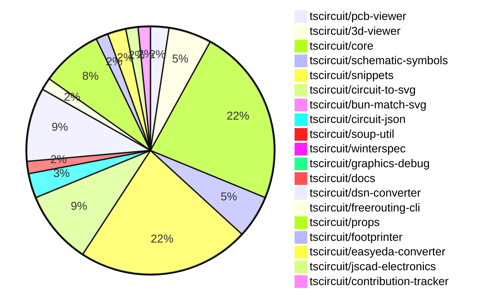

# Contribution Overview 2024-11-13

## PRs by Repository

## Contributor Overview

| Contributor | 🐳 Major | 🐙 Minor | 🐌 Tiny | ⭐ |
|-------------|-------|-------|-------|-------|
| [seveibar](#seveibar) | 12 | 36 | 1 | 👑👑👑 |
| [imrishabh18](#imrishabh18) | 4 | 19 | 1 | 👑 |
| [anas-sarkez](#anas-sarkez) | 4 | 11 | 2 | ⭐⭐⭐ |
| [ShiboSoftwareDev](#ShiboSoftwareDev) | 4 | 10 | 1 | ⭐⭐⭐ |
| [RohittCodes](#RohittCodes) | 1 | 6 | 0 | ⭐⭐ |
| [Abse2001](#Abse2001) | 0 | 6 | 2 | ⭐⭐ |
| [mrudulpatil18](#mrudulpatil18) | 0 | 4 | 0 | ⭐ |
| [DhairyaMajmudar](#DhairyaMajmudar) | 1 | 0 | 0 | ⭐ |
| [kom-senapati](#kom-senapati) | 0 | 2 | 0 | ⭐ |
| [Anshgrover23](#Anshgrover23) | 0 | 1 | 0 |  |
| [andrii-balitskyi](#andrii-balitskyi) | 0 | 0 | 1 |  |

## Review Table

| Contributor | Reviews Received | Approvals | Rejections | Changes Requested | PRs Opened | PRs Closed | Issues Created |
|-------------|------------------|-----------|------------|-------------------|------------|------------|----------------|n| [Abse2001](https://github.com/Abse2001) | 13 | 8 | 6 | 1 | 9 | 9 | undefined |
| [ShiboSoftwareDev](https://github.com/ShiboSoftwareDev) | 21 | 14 | 15 | 2 | 22 | 17 | undefined |
| [seveibar](https://github.com/seveibar) | 1 | 0 | 16 | 0 | 55 | 54 | undefined |
| [imrishabh18](https://github.com/imrishabh18) | 22 | 14 | 7 | 3 | 26 | 25 | undefined |
| [tscircuitbot](https://github.com/tscircuitbot) | 0 | 0 | 0 | 0 | 1 | 1 | undefined |
| [anas-sarkez](https://github.com/anas-sarkez) | 37 | 17 | 12 | 3 | 17 | 17 | undefined |
| [DhairyaMajmudar](https://github.com/DhairyaMajmudar) | 17 | 1 | 2 | 9 | 6 | 4 | undefined |
| [mrudulpatil18](https://github.com/mrudulpatil18) | 7 | 5 | 0 | 1 | 6 | 4 | undefined |
| [developerfred](https://github.com/developerfred) | 0 | 0 | 0 | 0 | 2 | 2 | undefined |
| [vishwamartur](https://github.com/vishwamartur) | 7 | 0 | 1 | 4 | 4 | 4 | undefined |
| [andrii-balitskyi](https://github.com/andrii-balitskyi) | 1 | 1 | 0 | 0 | 1 | 1 | undefined |
| [Anshgrover23](https://github.com/Anshgrover23) | 2 | 1 | 0 | 1 | 3 | 1 | undefined |
| [kom-senapati](https://github.com/kom-senapati) | 6 | 2 | 0 | 2 | 2 | 2 | undefined |
| [AkashJana18](https://github.com/AkashJana18) | 2 | 0 | 1 | 1 | 1 | 0 | undefined |
| [hunxjunedo](https://github.com/hunxjunedo) | 1 | 0 | 2 | 0 | 2 | 1 | undefined |
| [ni9999](https://github.com/ni9999) | 2 | 0 | 3 | 1 | 1 | 0 | undefined |
| [nocodeventure-nl](https://github.com/nocodeventure-nl) | 4 | 0 | 2 | 1 | 2 | 1 | undefined |
| [Niharika0104](https://github.com/Niharika0104) | 1 | 0 | 2 | 0 | 1 | 0 | undefined |
| [RohittCodes](https://github.com/RohittCodes) | 50 | 10 | 1 | 8 | 9 | 7 | undefined |

## Changes by Repository

### [tscircuit/pcb-viewer](https://github.com/tscircuit/pcb-viewer)

| PR # | Impact | Contributor | Description |
|------|--------|-------------|-------------|
| [#83](https://github.com/tscircuit/pcb-viewer/pull/83) | 🐙 Minor | Abse2001 | Fixed a type error by adding a non-null assertion operator (`!`) to handle the case where `primitive._element?.pcb_trace_id` can be `undefined`. |
| [#82](https://github.com/tscircuit/pcb-viewer/pull/82) | 🐙 Minor | ShiboSoftwareDev | Added a biome format script to the project's package.json |
| [#81](https://github.com/tscircuit/pcb-viewer/pull/81) | 🐙 Minor | seveibar | Update the README with additional usage details, including the ability to pass a `circuitJson` prop to the `PCBViewer` component. |

### [tscircuit/3d-viewer](https://github.com/tscircuit/3d-viewer)

| PR # | Impact | Contributor | Description |
|------|--------|-------------|-------------|
| [#44](https://github.com/tscircuit/3d-viewer/pull/44) | 🐳 Major | ShiboSoftwareDev | Allow plated holes to be either horizontal or vertical |
| [#40](https://github.com/tscircuit/3d-viewer/pull/40) | 🐳 Major | imrishabh18 | Reverts a previous update to the fiber version that was breaking the 3D viewer |
| [#38](https://github.com/tscircuit/3d-viewer/pull/38) | 🐳 Major | anas-sarkez | The change adds support for rendering pill-shaped board cutouts (holes) in the 3D viewer. |
| [#41](https://github.com/tscircuit/3d-viewer/pull/41) | 🐙 Minor | Abse2001 | Update the `jscad-electronics` dependency from version `0.0.3` to `0.0.21` to fix an issue with capacitor footprints not changing the 3D capacitor color in snippets. |
| [#39](https://github.com/tscircuit/3d-viewer/pull/39) | 🐙 Minor | anas-sarkez | Dependency updates for "@tscircuit/core", "@tscircuit/react-fiber", "jscad-electronics", and "jscad-fiber" packages. |
| [#37](https://github.com/tscircuit/3d-viewer/pull/37) | 🐙 Minor | mrudulpatil18 | Positions the hover label below the pointer and updates its position frame by frame to prevent it from drifting away when the camera view changes. |
| [#42](https://github.com/tscircuit/3d-viewer/pull/42) | 🐌 Tiny | Abse2001 | Updated the lockfile to resolve a dependency issue. |

### [tscircuit/core](https://github.com/tscircuit/core)

| PR # | Impact | Contributor | Description |
|------|--------|-------------|-------------|
| [#336](https://github.com/tscircuit/core/pull/336) | 🐳 Major | seveibar | The pull request changes the default format for async autorouting from "SimpleRouteJson" to "CircuitJson", implements fixes for the async autorouter, and adds testing for production usage. |
| [#316](https://github.com/tscircuit/core/pull/316) | 🐳 Major | seveibar | Fixes the subcircuit refdes selection by improving the `selectAll` and `selectOne` methods in the `PrimitiveComponent` class. |
| [#309](https://github.com/tscircuit/core/pull/309) | 🐳 Major | seveibar | The change updates the type inference for the `createUseComponent` hooks to handle different pin label formats, including a map of pin numbers to pin labels. |
| [#297](https://github.com/tscircuit/core/pull/297) | 🐳 Major | seveibar | Fixes the logic for handling complex trace crossings in the schematic component. |
| [#292](https://github.com/tscircuit/core/pull/292) | 🐳 Major | seveibar | The pull request allows the `schPortArrangement` property to accept strings, in addition to numbers, for defining the pin arrangement. |
| [#300](https://github.com/tscircuit/core/pull/300) | 🐳 Major | imrishabh18 | Adds a new Potentiometer component to the library. |
| [#253](https://github.com/tscircuit/core/pull/253) | 🐳 Major | DhairyaMajmudar | Adds error handling for missing footprint in the `NormalComponent` class, including a new `MissingFootprintError` class and related updates to the `NormalComponent` class. |
| [#342](https://github.com/tscircuit/core/pull/342) | 🐙 Minor | Abse2001 | Fixed manufacturer Part Number should go below refdes for four-sided pin layouts, handled three pin layouts and added tests for it. |
| [#339](https://github.com/tscircuit/core/pull/339) | 🐙 Minor | Abse2001 | Implemented the `getInheritedProperty` method on the `PrimitiveComponent` class to retrieve the value of a property from the current component or its parent components. |
| [#319](https://github.com/tscircuit/core/pull/319) | 🐙 Minor | Abse2001 | Introduces a new component called `<pushbutton />` to the project. |
| [#315](https://github.com/tscircuit/core/pull/315) | 🐙 Minor | ShiboSoftwareDev | Fixes a bug where non-port elements were being added as ports for custom footprints. |
| [#314](https://github.com/tscircuit/core/pull/314) | 🐙 Minor | ShiboSoftwareDev | Fixes the rendering of the battery symbol by updating the port initialization logic. |
| [#334](https://github.com/tscircuit/core/pull/334) | 🐙 Minor | seveibar | Add a GitHub Actions workflow to automatically close stale issues and pull requests. |
| [#326](https://github.com/tscircuit/core/pull/326) | 🐙 Minor | seveibar | Allow disabling trace rendering inside of subcircuits |
| [#323](https://github.com/tscircuit/core/pull/323) | 🐙 Minor | seveibar | Adds write permissions to the pull-request action for better bundle size reporting for non-org members. |
| [#305](https://github.com/tscircuit/core/pull/305) | 🐙 Minor | seveibar | Updates the schematic symbols package to version 0.0.98, which likely includes changes to the capacitor symbol directions. |
| [#303](https://github.com/tscircuit/core/pull/303) | 🐙 Minor | seveibar | Adds directional symbol names to the PrimitiveComponent class. |
| [#299](https://github.com/tscircuit/core/pull/299) | 🐙 Minor | seveibar | Fix a simplified overshot check in the `create-schematic-trace-crossing-segments.ts` file. |
| [#296](https://github.com/tscircuit/core/pull/296) | 🐙 Minor | seveibar | Fix the facing direction of the net label |
| [#333](https://github.com/tscircuit/core/pull/333) | 🐙 Minor | imrishabh18 | The pull request introduces a feature to cache the PCB trace route and reuse it on subsequent renders, improving performance. |
| [#295](https://github.com/tscircuit/core/pull/295) | 🐙 Minor | imrishabh18 | This pull request fixes the issue with the pin header width by adding padding to the box only when the label is present. |
| [#294](https://github.com/tscircuit/core/pull/294) | 🐙 Minor | imrishabh18 | Adds a new "facingDirection" prop to the PinHeader component, which affects the arrangement of the pins on the schematic. |
| [#338](https://github.com/tscircuit/core/pull/338) | 🐙 Minor | anas-sarkez | Added support for tracing obstacles around schematic_box elements |
| [#335](https://github.com/tscircuit/core/pull/335) | 🐙 Minor | anas-sarkez | Resolved an issue where pin labels for the PinHeader component were not being drawn in SVG. |
| [#325](https://github.com/tscircuit/core/pull/325) | 🐙 Minor | anas-sarkez | Modify the position of manufacturer part number and name label based on the component's port arrangement. |
| [#322](https://github.com/tscircuit/core/pull/322) | 🐙 Minor | anas-sarkez | Refactors the trace to not get passed to the chip manufacturer part number and name, by converting the manufacturer labels to `schematic_text`. |
| [#330](https://github.com/tscircuit/core/pull/330) | 🐌 Tiny | anas-sarkez | Updated the bun lockfile |
| [#329](https://github.com/tscircuit/core/pull/329) | 🐌 Tiny | anas-sarkez | Updates the lockfile to the latest versions of dependencies. |
| [#242](https://github.com/tscircuit/core/pull/242) | 🐌 Tiny | andrii-balitskyi | Adds a test for the `useDiode` hook, which creates diode components with the correct props and traces. |

### [tscircuit/schematic-symbols](https://github.com/tscircuit/schematic-symbols)

| PR # | Impact | Contributor | Description |
|------|--------|-------------|-------------|
| [#204](https://github.com/tscircuit/schematic-symbols/pull/204) | 🐳 Major | seveibar | The change makes the Y-coordinates positive in the exported SVG symbols by flipping the Y-axis. |
| [#199](https://github.com/tscircuit/schematic-symbols/pull/199) | 🐳 Major | seveibar | Adds capacitor symbols in different orientations (down, left, right, up). |
| [#198](https://github.com/tscircuit/schematic-symbols/pull/198) | 🐳 Major | anas-sarkez | Added two new functions `flipSymbolOverXAxis` and `flipSymbolOverYAxis` to modify LED arrow directions. |
| [#195](https://github.com/tscircuit/schematic-symbols/pull/195) | 🐳 Major | anas-sarkez | The pull request changes the LED symbol to have up, right, left, and down variants instead of horizontal and vertical. |
| [#212](https://github.com/tscircuit/schematic-symbols/pull/212) | 🐙 Minor | Abse2001 | Create approximateBezier function to improve 'C' case handling and add new symbol capacitor_polarised |
| [#206](https://github.com/tscircuit/schematic-symbols/pull/206) | 🐙 Minor | seveibar | Move the `modifySymbol` function from the `scripts/lib/modify-symbol` directory to the `drawing` directory for export. |
| [#197](https://github.com/tscircuit/schematic-symbols/pull/197) | 🐙 Minor | imrishabh18 | Fix the position of the potentiometer label for the horizontal and vertical variants. |

### [tscircuit/snippets](https://github.com/tscircuit/snippets)

| PR # | Impact | Contributor | Description |
|------|--------|-------------|-------------|
| [#246](https://github.com/tscircuit/snippets/pull/246) | 🐳 Major | ShiboSoftwareDev | Introduces a new "Insert Chip" feature, including a footprint dialog with functionality to select, preview, and insert footprints into the code. |
| [#252](https://github.com/tscircuit/snippets/pull/252) | 🐳 Major | seveibar | Reverts a previous change that caused a regression where every snippet has red underlines until modified. |
| [#237](https://github.com/tscircuit/snippets/pull/237) | 🐳 Major | RohittCodes | Adds a route for fetching image SVGs (schematic and PCB) for code snippets. |
| [#267](https://github.com/tscircuit/snippets/pull/267) | 🐙 Minor | ShiboSoftwareDev | Add a spinner icon to the run button when the code is running. |
| [#257](https://github.com/tscircuit/snippets/pull/257) | 🐙 Minor | ShiboSoftwareDev | Improves the user experience for inserting footprints in the code editor by adding a dropdown menu and enhancing the footprint parameter editing. |
| [#264](https://github.com/tscircuit/snippets/pull/264) | 🐙 Minor | seveibar | Improved keying for circuit JSON to ensure uniqueness across different circuit JSON values. |
| [#263](https://github.com/tscircuit/snippets/pull/263) | 🐙 Minor | seveibar | Update the @tscircuit/core dependency to version 0.0.193, enabling cloud autorouting. |
| [#242](https://github.com/tscircuit/snippets/pull/242) | 🐙 Minor | seveibar | Adds a redirect from "/playground" to the editor with the "blank-circuit-board" template. |
| [#254](https://github.com/tscircuit/snippets/pull/254) | 🐙 Minor | seveibar | Add a GitHub link to the landing page |
| [#240](https://github.com/tscircuit/snippets/pull/240) | 🐙 Minor | seveibar | Updates the Renovate configuration to include the "circuit-json" package and group all dependency updates together. |
| [#220](https://github.com/tscircuit/snippets/pull/220) | 🐙 Minor | seveibar | Update core and circuit-to-svg packages to fix capacitor rotation issues |
| [#213](https://github.com/tscircuit/snippets/pull/213) | 🐙 Minor | seveibar | Improve the reloading of the PCBView component by using a unique `circuitJsonKey` instead of the `tsxRunTriggerCount` to trigger a re-render when the `circuitJson` changes. |
| [#196](https://github.com/tscircuit/snippets/pull/196) | 🐙 Minor | seveibar | Adds support for async circuit rendering and opens BOM links in a new tab |
| [#235](https://github.com/tscircuit/snippets/pull/235) | 🐙 Minor | imrishabh18 | Updates the version of the `@tscircuit/3d-viewer` package to fix a 3D view issue. |
| [#208](https://github.com/tscircuit/snippets/pull/208) | 🐙 Minor | imrishabh18 | Adds the ability to download the DSN file for the circuit. |
| [#236](https://github.com/tscircuit/snippets/pull/236) | 🐙 Minor | mrudulpatil18 | Updates the link for embedding code snippets to use the `/preview` endpoint. |
| [#179](https://github.com/tscircuit/snippets/pull/179) | 🐙 Minor | mrudulpatil18 | Added a /preview route to view the `<PreviewContent>` component and modified the sidebar to allow copying embed code for this route. |
| [#206](https://github.com/tscircuit/snippets/pull/206) | 🐙 Minor | mrudulpatil18 |  |
| [#218](https://github.com/tscircuit/snippets/pull/218) | 🐙 Minor | kom-senapati | Adds a utility function to get the React TypeScript syntax error message and uses it in the `useRunTsx` hook. |
| [#202](https://github.com/tscircuit/snippets/pull/202) | 🐙 Minor | RohittCodes | Adds the ability to remove the star from a code snippet. |
| [#270](https://github.com/tscircuit/snippets/pull/270) | 🐙 Minor | RohittCodes | Fix the exact cursor position without reflecting the code and its types. |
| [#268](https://github.com/tscircuit/snippets/pull/268) | 🐙 Minor | RohittCodes | Fixes an issue where the `manualEditsFileContent` was not being initialized with the `manual_edit_json` when the page loaded, causing the "Unsaved Changes" message to always display. |
| [#248](https://github.com/tscircuit/snippets/pull/248) | 🐙 Minor | RohittCodes | Adds support for manual edits to `snippets.manual_edits_json` and implements an update function for it. |
| [#250](https://github.com/tscircuit/snippets/pull/250) | 🐙 Minor | RohittCodes | Fixes a bug that caused the cursor position to reset to the beginning of the file when a new file was received. |
| [#182](https://github.com/tscircuit/snippets/pull/182) | 🐙 Minor | RohittCodes | Refactor the search text component to fix issues with smaller screen devices. |
| [#233](https://github.com/tscircuit/snippets/pull/233) | 🐙 Minor | Anshgrover23 | Changes the `pointerEvents` property to `auto` to allow hovering over traces to change their color. |
| [#247](https://github.com/tscircuit/snippets/pull/247) | 🐌 Tiny | Abse2001 | Update the version of the "@tscircuit/3d-viewer" package from 0.0.39 to 0.0.40. |
| [#258](https://github.com/tscircuit/snippets/pull/258) | 🐌 Tiny | seveibar | Skips the parts engine test on the CI environment. |

### [tscircuit/circuit-to-svg](https://github.com/tscircuit/circuit-to-svg)

| PR # | Impact | Contributor | Description |
|------|--------|-------------|-------------|
| [#136](https://github.com/tscircuit/circuit-to-svg/pull/136) | 🐳 Major | ShiboSoftwareDev | Adds support for rendering rotated rectangular SMT pads in the SVG output. |
| [#137](https://github.com/tscircuit/circuit-to-svg/pull/137) | 🐙 Minor | ShiboSoftwareDev | Rotate the SMT pads counter-clockwise instead of clockwise. |
| [#130](https://github.com/tscircuit/circuit-to-svg/pull/130) | 🐙 Minor | seveibar | Fixes outline scaling for stroke sizes and improves hovering over traces. |
| [#129](https://github.com/tscircuit/circuit-to-svg/pull/129) | 🐙 Minor | seveibar | Fix pin number text getting offset with large bounds |
| [#127](https://github.com/tscircuit/circuit-to-svg/pull/127) | 🐙 Minor | seveibar | Move schematic symbols and circuit JSON from dependencies to peer dependencies |
| [#126](https://github.com/tscircuit/circuit-to-svg/pull/126) | 🐙 Minor | seveibar | Fixes a bug where the grid lines were not drawing at the boundaries of the schematic, and also ensures that schematic traces are used to calculate the bounds of the schematic. |
| [#124](https://github.com/tscircuit/circuit-to-svg/pull/124) | 🐙 Minor | seveibar | Change the trace color on hover, and make the paths rounded. |
| [#121](https://github.com/tscircuit/circuit-to-svg/pull/121) | 🐙 Minor | seveibar | Reverts the previous fix for the top and bottom anchor position of the net label. |
| [#120](https://github.com/tscircuit/circuit-to-svg/pull/120) | 🐙 Minor | imrishabh18 | Fixed the top and bottom anchor position for the schematic net label |
| [#134](https://github.com/tscircuit/circuit-to-svg/pull/134) | 🐙 Minor | anas-sarkez | Render pin labels for the PinHeader component in SVG |
| [#133](https://github.com/tscircuit/circuit-to-svg/pull/133) | 🐙 Minor | anas-sarkez | Removes the drawing of manufacturer part numbers in the circuit-to-svg module. |
| [#132](https://github.com/tscircuit/circuit-to-svg/pull/132) | 🐙 Minor | anas-sarkez | Implemented a function to create SVG text objects for schematic text elements. |

### [tscircuit/bun-match-svg](https://github.com/tscircuit/bun-match-svg)

| PR # | Impact | Contributor | Description |
|------|--------|-------------|-------------|
| [#4](https://github.com/tscircuit/bun-match-svg/pull/4) | 🐳 Major | ShiboSoftwareDev | Implemented a CLI tool that initializes the project in other repositories. |

### [tscircuit/circuit-json](https://github.com/tscircuit/circuit-json)

| PR # | Impact | Contributor | Description |
|------|--------|-------------|-------------|
| [#82](https://github.com/tscircuit/circuit-json/pull/82) | 🐙 Minor | ShiboSoftwareDev | Adds a new shape called "rotated_rect" for SMT pads in the PCB module. |
| [#81](https://github.com/tscircuit/circuit-json/pull/81) | 🐙 Minor | imrishabh18 | Adds a new source component for a simple crystal to the application. |
| [#80](https://github.com/tscircuit/circuit-json/pull/80) | 🐙 Minor | imrishabh18 | Add support for the `source_simple_potentiometer` component. |
| [#79](https://github.com/tscircuit/circuit-json/pull/79) | 🐙 Minor | imrishabh18 | Adds a new source component for a simple potentiometer |

### [tscircuit/soup-util](https://github.com/tscircuit/soup-util)

| PR # | Impact | Contributor | Description |
|------|--------|-------------|-------------|
| [#25](https://github.com/tscircuit/soup-util/pull/25) | 🐙 Minor | ShiboSoftwareDev | Updated the `circuit-json` dependency to version `0.0.106` |

### [tscircuit/winterspec](https://github.com/tscircuit/winterspec)

| PR # | Impact | Contributor | Description |
|------|--------|-------------|-------------|
| [#22](https://github.com/tscircuit/winterspec/pull/22) | 🐙 Minor | ShiboSoftwareDev | Exports common middleware functions with testing. |

### [tscircuit/graphics-debug](https://github.com/tscircuit/graphics-debug)

| PR # | Impact | Contributor | Description |
|------|--------|-------------|-------------|
| [#9](https://github.com/tscircuit/graphics-debug/pull/9) | 🐙 Minor | ShiboSoftwareDev | Adds error handling and display for failed parsing of graphics input |

### [tscircuit/docs](https://github.com/tscircuit/docs)

| PR # | Impact | Contributor | Description |
|------|--------|-------------|-------------|
| [#37](https://github.com/tscircuit/docs/pull/37) | 🐙 Minor | imrishabh18 | Adds documentation for the motor driver circuit |
| [#38](https://github.com/tscircuit/docs/pull/38) | 🐌 Tiny | ShiboSoftwareDev | Fixes a typo in a Markdown file |

### [tscircuit/dsn-converter](https://github.com/tscircuit/dsn-converter)

| PR # | Impact | Contributor | Description |
|------|--------|-------------|-------------|
| [#24](https://github.com/tscircuit/dsn-converter/pull/24) | 🐳 Major | seveibar | Converts a circuit JSON representation to a DSN session, which includes converting circuit components to DSN components and traces to DSN wires. |
| [#21](https://github.com/tscircuit/dsn-converter/pull/21) | 🐳 Major | seveibar | Fix Session Parsing |
| [#20](https://github.com/tscircuit/dsn-converter/pull/20) | 🐳 Major | seveibar | Introduces initial support for parsing DSN session data and converting it to circuit-json format. |
| [#19](https://github.com/tscircuit/dsn-converter/pull/19) | 🐳 Major | imrishabh18 | Adds support for plated holes and rotation on SMT pads. |
| [#16](https://github.com/tscircuit/dsn-converter/pull/16) | 🐳 Major | imrishabh18 | The change fixes an issue with converting circuit JSON to DSN file format by adding support for processing PCB traces. |
| [#26](https://github.com/tscircuit/dsn-converter/pull/26) | 🐙 Minor | seveibar | Adjusts the scale factor for converting DSN session to circuit JSON. |
| [#25](https://github.com/tscircuit/dsn-converter/pull/25) | 🐙 Minor | seveibar | The pull request fixes the session JSON handling. |
| [#22](https://github.com/tscircuit/dsn-converter/pull/22) | 🐙 Minor | seveibar | Add support for stringifying DSN sessions |
| [#28](https://github.com/tscircuit/dsn-converter/pull/28) | 🐙 Minor | imrishabh18 | The pull request fixes the plated hole DSN file format and net. |
| [#27](https://github.com/tscircuit/dsn-converter/pull/27) | 🐙 Minor | imrishabh18 | Fix a scaling issue in the session |
| [#23](https://github.com/tscircuit/dsn-converter/pull/23) | 🐙 Minor | imrishabh18 | Adds back the processing of PCB traces in the circuit-json-to-dsn-json conversion process. |
| [#18](https://github.com/tscircuit/dsn-converter/pull/18) | 🐙 Minor | imrishabh18 | Removes the processing of traces in the PCB conversion process. |

### [tscircuit/freerouting-cli](https://github.com/tscircuit/freerouting-cli)

| PR # | Impact | Contributor | Description |
|------|--------|-------------|-------------|
| [#3](https://github.com/tscircuit/freerouting-cli/pull/3) | 🐳 Major | seveibar | Adds a command to start a local FreRouting server using Docker. |
| [#2](https://github.com/tscircuit/freerouting-cli/pull/2) | 🐙 Minor | seveibar | Fixes various issues in the freerouting CLI, including adding a dependency, fixing config commands, and other miscellaneous fixes. |

### [tscircuit/props](https://github.com/tscircuit/props)

| PR # | Impact | Contributor | Description |
|------|--------|-------------|-------------|
| [#103](https://github.com/tscircuit/props/pull/103) | 🐙 Minor | seveibar | Adds an `autorouter` property to the `SubcircuitGroupProps` interface, which allows configuring the autorouter behavior. |
| [#99](https://github.com/tscircuit/props/pull/99) | 🐙 Minor | seveibar | Add new `NonSubcircuitGroupProps` interface to fix parsing issues with the `group` component. |
| [#98](https://github.com/tscircuit/props/pull/98) | 🐙 Minor | seveibar | The pull request removes the requirement for the `subcircuit: true` boolean property on subcircuits. |
| [#97](https://github.com/tscircuit/props/pull/97) | 🐙 Minor | seveibar | Add subcircuit file |
| [#92](https://github.com/tscircuit/props/pull/92) | 🐙 Minor | seveibar | Allow strings and numbers to be defined together for `pinLabels`, and improve `expectTypesMatch` error messages. |
| [#101](https://github.com/tscircuit/props/pull/101) | 🐙 Minor | imrishabh18 | Add `pcbRouteCache` to `SubcircuitGroupProps` interface |
| [#100](https://github.com/tscircuit/props/pull/100) | 🐙 Minor | imrishabh18 | Introduces a new component `crystal` with its corresponding props and pins |
| [#96](https://github.com/tscircuit/props/pull/96) | 🐙 Minor | imrishabh18 | Add a new potentiometer component to the library. |
| [#93](https://github.com/tscircuit/props/pull/93) | 🐙 Minor | imrishabh18 | Adds a new optional property "facingDirection" to the "pin-header" component, allowing the header direction to be specified as either "left" or "right". |
| [#102](https://github.com/tscircuit/props/pull/102) | 🐌 Tiny | imrishabh18 | Adds missing export for the `PcbRouteCache` interface. |

### [tscircuit/footprinter](https://github.com/tscircuit/footprinter)

| PR # | Impact | Contributor | Description |
|------|--------|-------------|-------------|
| [#81](https://github.com/tscircuit/footprinter/pull/81) | 🐙 Minor | seveibar | Adds a new test case for generating a PCB SVG with a custom-sized thermal pad. |
| [#83](https://github.com/tscircuit/footprinter/pull/83) | 🐙 Minor | anas-sarkez | Refactor all footprinter functions by updating their scheme, setting the default value of `num_pins` for all footprints. |

### [tscircuit/easyeda-converter](https://github.com/tscircuit/easyeda-converter)

| PR # | Impact | Contributor | Description |
|------|--------|-------------|-------------|
| [#112](https://github.com/tscircuit/easyeda-converter/pull/112) | 🐙 Minor | seveibar | Ensures that short part numbers like "C2040" fetch the correct component from EasyEDA. |
| [#108](https://github.com/tscircuit/easyeda-converter/pull/108) | 🐙 Minor | seveibar | Add a new `manufacturerPartNumber` prop to the `soupTypescriptComponentTemplate` function and the generated component. |
| [#107](https://github.com/tscircuit/easyeda-converter/pull/107) | 🐙 Minor | seveibar | Change the supplier used in the "convert-to-typescript-component" module from LCSC to JLCPCB. |

### [tscircuit/jscad-electronics](https://github.com/tscircuit/jscad-electronics)

| PR # | Impact | Contributor | Description |
|------|--------|-------------|-------------|
| [#79](https://github.com/tscircuit/jscad-electronics/pull/79) | 🐳 Major | anas-sarkez | Implemented a StampBoard 3D component and added a board example with and without holes. |
| [#78](https://github.com/tscircuit/jscad-electronics/pull/78) | 🐙 Minor | anas-sarkez | Refactor QFN 3D element and added QFN Footprinter3d example |

### [tscircuit/contribution-tracker](https://github.com/tscircuit/contribution-tracker)

| PR # | Impact | Contributor | Description |
|------|--------|-------------|-------------|
| [#8](https://github.com/tscircuit/contribution-tracker/pull/8) | 🐙 Minor | anas-sarkez | Adds a new column 'Issues Created' to the Reviews Table in the generated Markdown report. |
| [#6](https://github.com/tscircuit/contribution-tracker/pull/6) | 🐙 Minor | kom-senapati | Adds a review table to the contribution overview, which displays information about the number of reviews received, approvals, rejections, changes requested, PRs opened, and PRs closed for each contributor. |

## Changes by Contributor

### [Abse2001](https://github.com/Abse2001)

| PR # | Impact | Description |
|------|--------|-------------|
| [#83](https://github.com/tscircuit/pcb-viewer/pull/83) | 🐙 Minor | Fixed a type error by adding a non-null assertion operator (`!`) to handle the case where `primitive._element?.pcb_trace_id` can be `undefined`. |
| [#41](https://github.com/tscircuit/3d-viewer/pull/41) | 🐙 Minor | Update the `jscad-electronics` dependency from version `0.0.3` to `0.0.21` to fix an issue with capacitor footprints not changing the 3D capacitor color in snippets. |
| [#342](https://github.com/tscircuit/core/pull/342) | 🐙 Minor | Fixed manufacturer Part Number should go below refdes for four-sided pin layouts, handled three pin layouts and added tests for it. |
| [#339](https://github.com/tscircuit/core/pull/339) | 🐙 Minor | Implemented the `getInheritedProperty` method on the `PrimitiveComponent` class to retrieve the value of a property from the current component or its parent components. |
| [#319](https://github.com/tscircuit/core/pull/319) | 🐙 Minor | Introduces a new component called `<pushbutton />` to the project. |
| [#212](https://github.com/tscircuit/schematic-symbols/pull/212) | 🐙 Minor | Create approximateBezier function to improve 'C' case handling and add new symbol capacitor_polarised |
| [#42](https://github.com/tscircuit/3d-viewer/pull/42) | 🐌 Tiny | Updated the lockfile to resolve a dependency issue. |
| [#247](https://github.com/tscircuit/snippets/pull/247) | 🐌 Tiny | Update the version of the "@tscircuit/3d-viewer" package from 0.0.39 to 0.0.40. |

### [ShiboSoftwareDev](https://github.com/ShiboSoftwareDev)

| PR # | Impact | Description |
|------|--------|-------------|
| [#44](https://github.com/tscircuit/3d-viewer/pull/44) | 🐳 Major | Allow plated holes to be either horizontal or vertical |
| [#136](https://github.com/tscircuit/circuit-to-svg/pull/136) | 🐳 Major | Adds support for rendering rotated rectangular SMT pads in the SVG output. |
| [#4](https://github.com/tscircuit/bun-match-svg/pull/4) | 🐳 Major | Implemented a CLI tool that initializes the project in other repositories. |
| [#246](https://github.com/tscircuit/snippets/pull/246) | 🐳 Major | Introduces a new "Insert Chip" feature, including a footprint dialog with functionality to select, preview, and insert footprints into the code. |
| [#82](https://github.com/tscircuit/pcb-viewer/pull/82) | 🐙 Minor | Added a biome format script to the project's package.json |
| [#82](https://github.com/tscircuit/circuit-json/pull/82) | 🐙 Minor | Adds a new shape called "rotated_rect" for SMT pads in the PCB module. |
| [#25](https://github.com/tscircuit/soup-util/pull/25) | 🐙 Minor | Updated the `circuit-json` dependency to version `0.0.106` |
| [#22](https://github.com/tscircuit/winterspec/pull/22) | 🐙 Minor | Exports common middleware functions with testing. |
| [#315](https://github.com/tscircuit/core/pull/315) | 🐙 Minor | Fixes a bug where non-port elements were being added as ports for custom footprints. |
| [#314](https://github.com/tscircuit/core/pull/314) | 🐙 Minor | Fixes the rendering of the battery symbol by updating the port initialization logic. |
| [#137](https://github.com/tscircuit/circuit-to-svg/pull/137) | 🐙 Minor | Rotate the SMT pads counter-clockwise instead of clockwise. |
| [#267](https://github.com/tscircuit/snippets/pull/267) | 🐙 Minor | Add a spinner icon to the run button when the code is running. |
| [#257](https://github.com/tscircuit/snippets/pull/257) | 🐙 Minor | Improves the user experience for inserting footprints in the code editor by adding a dropdown menu and enhancing the footprint parameter editing. |
| [#9](https://github.com/tscircuit/graphics-debug/pull/9) | 🐙 Minor | Adds error handling and display for failed parsing of graphics input |
| [#38](https://github.com/tscircuit/docs/pull/38) | 🐌 Tiny | Fixes a typo in a Markdown file |

### [seveibar](https://github.com/seveibar)

| PR # | Impact | Description |
|------|--------|-------------|
| [#336](https://github.com/tscircuit/core/pull/336) | 🐳 Major | The pull request changes the default format for async autorouting from "SimpleRouteJson" to "CircuitJson", implements fixes for the async autorouter, and adds testing for production usage. |
| [#316](https://github.com/tscircuit/core/pull/316) | 🐳 Major | Fixes the subcircuit refdes selection by improving the `selectAll` and `selectOne` methods in the `PrimitiveComponent` class. |
| [#309](https://github.com/tscircuit/core/pull/309) | 🐳 Major | The change updates the type inference for the `createUseComponent` hooks to handle different pin label formats, including a map of pin numbers to pin labels. |
| [#297](https://github.com/tscircuit/core/pull/297) | 🐳 Major | Fixes the logic for handling complex trace crossings in the schematic component. |
| [#292](https://github.com/tscircuit/core/pull/292) | 🐳 Major | The pull request allows the `schPortArrangement` property to accept strings, in addition to numbers, for defining the pin arrangement. |
| [#204](https://github.com/tscircuit/schematic-symbols/pull/204) | 🐳 Major | The change makes the Y-coordinates positive in the exported SVG symbols by flipping the Y-axis. |
| [#199](https://github.com/tscircuit/schematic-symbols/pull/199) | 🐳 Major | Adds capacitor symbols in different orientations (down, left, right, up). |
| [#24](https://github.com/tscircuit/dsn-converter/pull/24) | 🐳 Major | Converts a circuit JSON representation to a DSN session, which includes converting circuit components to DSN components and traces to DSN wires. |
| [#21](https://github.com/tscircuit/dsn-converter/pull/21) | 🐳 Major | Fix Session Parsing |
| [#20](https://github.com/tscircuit/dsn-converter/pull/20) | 🐳 Major | Introduces initial support for parsing DSN session data and converting it to circuit-json format. |
| [#252](https://github.com/tscircuit/snippets/pull/252) | 🐳 Major | Reverts a previous change that caused a regression where every snippet has red underlines until modified. |
| [#3](https://github.com/tscircuit/freerouting-cli/pull/3) | 🐳 Major | Adds a command to start a local FreRouting server using Docker. |
| [#81](https://github.com/tscircuit/pcb-viewer/pull/81) | 🐙 Minor | Update the README with additional usage details, including the ability to pass a `circuitJson` prop to the `PCBViewer` component. |
| [#103](https://github.com/tscircuit/props/pull/103) | 🐙 Minor | Adds an `autorouter` property to the `SubcircuitGroupProps` interface, which allows configuring the autorouter behavior. |
| [#99](https://github.com/tscircuit/props/pull/99) | 🐙 Minor | Add new `NonSubcircuitGroupProps` interface to fix parsing issues with the `group` component. |
| [#98](https://github.com/tscircuit/props/pull/98) | 🐙 Minor | The pull request removes the requirement for the `subcircuit: true` boolean property on subcircuits. |
| [#97](https://github.com/tscircuit/props/pull/97) | 🐙 Minor | Add subcircuit file |
| [#92](https://github.com/tscircuit/props/pull/92) | 🐙 Minor | Allow strings and numbers to be defined together for `pinLabels`, and improve `expectTypesMatch` error messages. |
| [#81](https://github.com/tscircuit/footprinter/pull/81) | 🐙 Minor | Adds a new test case for generating a PCB SVG with a custom-sized thermal pad. |
| [#112](https://github.com/tscircuit/easyeda-converter/pull/112) | 🐙 Minor | Ensures that short part numbers like "C2040" fetch the correct component from EasyEDA. |
| [#108](https://github.com/tscircuit/easyeda-converter/pull/108) | 🐙 Minor | Add a new `manufacturerPartNumber` prop to the `soupTypescriptComponentTemplate` function and the generated component. |
| [#107](https://github.com/tscircuit/easyeda-converter/pull/107) | 🐙 Minor | Change the supplier used in the "convert-to-typescript-component" module from LCSC to JLCPCB. |
| [#334](https://github.com/tscircuit/core/pull/334) | 🐙 Minor | Add a GitHub Actions workflow to automatically close stale issues and pull requests. |
| [#326](https://github.com/tscircuit/core/pull/326) | 🐙 Minor | Allow disabling trace rendering inside of subcircuits |
| [#323](https://github.com/tscircuit/core/pull/323) | 🐙 Minor | Adds write permissions to the pull-request action for better bundle size reporting for non-org members. |
| [#305](https://github.com/tscircuit/core/pull/305) | 🐙 Minor | Updates the schematic symbols package to version 0.0.98, which likely includes changes to the capacitor symbol directions. |
| [#303](https://github.com/tscircuit/core/pull/303) | 🐙 Minor | Adds directional symbol names to the PrimitiveComponent class. |
| [#299](https://github.com/tscircuit/core/pull/299) | 🐙 Minor | Fix a simplified overshot check in the `create-schematic-trace-crossing-segments.ts` file. |
| [#296](https://github.com/tscircuit/core/pull/296) | 🐙 Minor | Fix the facing direction of the net label |
| [#130](https://github.com/tscircuit/circuit-to-svg/pull/130) | 🐙 Minor | Fixes outline scaling for stroke sizes and improves hovering over traces. |
| [#129](https://github.com/tscircuit/circuit-to-svg/pull/129) | 🐙 Minor | Fix pin number text getting offset with large bounds |
| [#127](https://github.com/tscircuit/circuit-to-svg/pull/127) | 🐙 Minor | Move schematic symbols and circuit JSON from dependencies to peer dependencies |
| [#126](https://github.com/tscircuit/circuit-to-svg/pull/126) | 🐙 Minor | Fixes a bug where the grid lines were not drawing at the boundaries of the schematic, and also ensures that schematic traces are used to calculate the bounds of the schematic. |
| [#124](https://github.com/tscircuit/circuit-to-svg/pull/124) | 🐙 Minor | Change the trace color on hover, and make the paths rounded. |
| [#121](https://github.com/tscircuit/circuit-to-svg/pull/121) | 🐙 Minor | Reverts the previous fix for the top and bottom anchor position of the net label. |
| [#206](https://github.com/tscircuit/schematic-symbols/pull/206) | 🐙 Minor | Move the `modifySymbol` function from the `scripts/lib/modify-symbol` directory to the `drawing` directory for export. |
| [#26](https://github.com/tscircuit/dsn-converter/pull/26) | 🐙 Minor | Adjusts the scale factor for converting DSN session to circuit JSON. |
| [#25](https://github.com/tscircuit/dsn-converter/pull/25) | 🐙 Minor | The pull request fixes the session JSON handling. |
| [#22](https://github.com/tscircuit/dsn-converter/pull/22) | 🐙 Minor | Add support for stringifying DSN sessions |
| [#264](https://github.com/tscircuit/snippets/pull/264) | 🐙 Minor | Improved keying for circuit JSON to ensure uniqueness across different circuit JSON values. |
| [#263](https://github.com/tscircuit/snippets/pull/263) | 🐙 Minor | Update the @tscircuit/core dependency to version 0.0.193, enabling cloud autorouting. |
| [#242](https://github.com/tscircuit/snippets/pull/242) | 🐙 Minor | Adds a redirect from "/playground" to the editor with the "blank-circuit-board" template. |
| [#254](https://github.com/tscircuit/snippets/pull/254) | 🐙 Minor | Add a GitHub link to the landing page |
| [#240](https://github.com/tscircuit/snippets/pull/240) | 🐙 Minor | Updates the Renovate configuration to include the "circuit-json" package and group all dependency updates together. |
| [#220](https://github.com/tscircuit/snippets/pull/220) | 🐙 Minor | Update core and circuit-to-svg packages to fix capacitor rotation issues |
| [#213](https://github.com/tscircuit/snippets/pull/213) | 🐙 Minor | Improve the reloading of the PCBView component by using a unique `circuitJsonKey` instead of the `tsxRunTriggerCount` to trigger a re-render when the `circuitJson` changes. |
| [#196](https://github.com/tscircuit/snippets/pull/196) | 🐙 Minor | Adds support for async circuit rendering and opens BOM links in a new tab |
| [#2](https://github.com/tscircuit/freerouting-cli/pull/2) | 🐙 Minor | Fixes various issues in the freerouting CLI, including adding a dependency, fixing config commands, and other miscellaneous fixes. |
| [#258](https://github.com/tscircuit/snippets/pull/258) | 🐌 Tiny | Skips the parts engine test on the CI environment. |

### [imrishabh18](https://github.com/imrishabh18)

| PR # | Impact | Description |
|------|--------|-------------|
| [#40](https://github.com/tscircuit/3d-viewer/pull/40) | 🐳 Major | Reverts a previous update to the fiber version that was breaking the 3D viewer |
| [#300](https://github.com/tscircuit/core/pull/300) | 🐳 Major | Adds a new Potentiometer component to the library. |
| [#19](https://github.com/tscircuit/dsn-converter/pull/19) | 🐳 Major | Adds support for plated holes and rotation on SMT pads. |
| [#16](https://github.com/tscircuit/dsn-converter/pull/16) | 🐳 Major | The change fixes an issue with converting circuit JSON to DSN file format by adding support for processing PCB traces. |
| [#81](https://github.com/tscircuit/circuit-json/pull/81) | 🐙 Minor | Adds a new source component for a simple crystal to the application. |
| [#80](https://github.com/tscircuit/circuit-json/pull/80) | 🐙 Minor | Add support for the `source_simple_potentiometer` component. |
| [#79](https://github.com/tscircuit/circuit-json/pull/79) | 🐙 Minor | Adds a new source component for a simple potentiometer |
| [#37](https://github.com/tscircuit/docs/pull/37) | 🐙 Minor | Adds documentation for the motor driver circuit |
| [#101](https://github.com/tscircuit/props/pull/101) | 🐙 Minor | Add `pcbRouteCache` to `SubcircuitGroupProps` interface |
| [#100](https://github.com/tscircuit/props/pull/100) | 🐙 Minor | Introduces a new component `crystal` with its corresponding props and pins |
| [#96](https://github.com/tscircuit/props/pull/96) | 🐙 Minor | Add a new potentiometer component to the library. |
| [#93](https://github.com/tscircuit/props/pull/93) | 🐙 Minor | Adds a new optional property "facingDirection" to the "pin-header" component, allowing the header direction to be specified as either "left" or "right". |
| [#333](https://github.com/tscircuit/core/pull/333) | 🐙 Minor | The pull request introduces a feature to cache the PCB trace route and reuse it on subsequent renders, improving performance. |
| [#295](https://github.com/tscircuit/core/pull/295) | 🐙 Minor | This pull request fixes the issue with the pin header width by adding padding to the box only when the label is present. |
| [#294](https://github.com/tscircuit/core/pull/294) | 🐙 Minor | Adds a new "facingDirection" prop to the PinHeader component, which affects the arrangement of the pins on the schematic. |
| [#120](https://github.com/tscircuit/circuit-to-svg/pull/120) | 🐙 Minor | Fixed the top and bottom anchor position for the schematic net label |
| [#197](https://github.com/tscircuit/schematic-symbols/pull/197) | 🐙 Minor | Fix the position of the potentiometer label for the horizontal and vertical variants. |
| [#28](https://github.com/tscircuit/dsn-converter/pull/28) | 🐙 Minor | The pull request fixes the plated hole DSN file format and net. |
| [#27](https://github.com/tscircuit/dsn-converter/pull/27) | 🐙 Minor | Fix a scaling issue in the session |
| [#23](https://github.com/tscircuit/dsn-converter/pull/23) | 🐙 Minor | Adds back the processing of PCB traces in the circuit-json-to-dsn-json conversion process. |
| [#18](https://github.com/tscircuit/dsn-converter/pull/18) | 🐙 Minor | Removes the processing of traces in the PCB conversion process. |
| [#235](https://github.com/tscircuit/snippets/pull/235) | 🐙 Minor | Updates the version of the `@tscircuit/3d-viewer` package to fix a 3D view issue. |
| [#208](https://github.com/tscircuit/snippets/pull/208) | 🐙 Minor | Adds the ability to download the DSN file for the circuit. |
| [#102](https://github.com/tscircuit/props/pull/102) | 🐌 Tiny | Adds missing export for the `PcbRouteCache` interface. |

### [anas-sarkez](https://github.com/anas-sarkez)

| PR # | Impact | Description |
|------|--------|-------------|
| [#38](https://github.com/tscircuit/3d-viewer/pull/38) | 🐳 Major | The change adds support for rendering pill-shaped board cutouts (holes) in the 3D viewer. |
| [#79](https://github.com/tscircuit/jscad-electronics/pull/79) | 🐳 Major | Implemented a StampBoard 3D component and added a board example with and without holes. |
| [#198](https://github.com/tscircuit/schematic-symbols/pull/198) | 🐳 Major | Added two new functions `flipSymbolOverXAxis` and `flipSymbolOverYAxis` to modify LED arrow directions. |
| [#195](https://github.com/tscircuit/schematic-symbols/pull/195) | 🐳 Major | The pull request changes the LED symbol to have up, right, left, and down variants instead of horizontal and vertical. |
| [#83](https://github.com/tscircuit/footprinter/pull/83) | 🐙 Minor | Refactor all footprinter functions by updating their scheme, setting the default value of `num_pins` for all footprints. |
| [#39](https://github.com/tscircuit/3d-viewer/pull/39) | 🐙 Minor | Dependency updates for "@tscircuit/core", "@tscircuit/react-fiber", "jscad-electronics", and "jscad-fiber" packages. |
| [#338](https://github.com/tscircuit/core/pull/338) | 🐙 Minor | Added support for tracing obstacles around schematic_box elements |
| [#335](https://github.com/tscircuit/core/pull/335) | 🐙 Minor | Resolved an issue where pin labels for the PinHeader component were not being drawn in SVG. |
| [#325](https://github.com/tscircuit/core/pull/325) | 🐙 Minor | Modify the position of manufacturer part number and name label based on the component's port arrangement. |
| [#322](https://github.com/tscircuit/core/pull/322) | 🐙 Minor | Refactors the trace to not get passed to the chip manufacturer part number and name, by converting the manufacturer labels to `schematic_text`. |
| [#78](https://github.com/tscircuit/jscad-electronics/pull/78) | 🐙 Minor | Refactor QFN 3D element and added QFN Footprinter3d example |
| [#8](https://github.com/tscircuit/contribution-tracker/pull/8) | 🐙 Minor | Adds a new column 'Issues Created' to the Reviews Table in the generated Markdown report. |
| [#134](https://github.com/tscircuit/circuit-to-svg/pull/134) | 🐙 Minor | Render pin labels for the PinHeader component in SVG |
| [#133](https://github.com/tscircuit/circuit-to-svg/pull/133) | 🐙 Minor | Removes the drawing of manufacturer part numbers in the circuit-to-svg module. |
| [#132](https://github.com/tscircuit/circuit-to-svg/pull/132) | 🐙 Minor | Implemented a function to create SVG text objects for schematic text elements. |
| [#330](https://github.com/tscircuit/core/pull/330) | 🐌 Tiny | Updated the bun lockfile |
| [#329](https://github.com/tscircuit/core/pull/329) | 🐌 Tiny | Updates the lockfile to the latest versions of dependencies. |

### [mrudulpatil18](https://github.com/mrudulpatil18)

| PR # | Impact | Description |
|------|--------|-------------|
| [#37](https://github.com/tscircuit/3d-viewer/pull/37) | 🐙 Minor | Positions the hover label below the pointer and updates its position frame by frame to prevent it from drifting away when the camera view changes. |
| [#236](https://github.com/tscircuit/snippets/pull/236) | 🐙 Minor | Updates the link for embedding code snippets to use the `/preview` endpoint. |
| [#179](https://github.com/tscircuit/snippets/pull/179) | 🐙 Minor | Added a /preview route to view the `<PreviewContent>` component and modified the sidebar to allow copying embed code for this route. |
| [#206](https://github.com/tscircuit/snippets/pull/206) | 🐙 Minor |  |

### [DhairyaMajmudar](https://github.com/DhairyaMajmudar)

| PR # | Impact | Description |
|------|--------|-------------|
| [#253](https://github.com/tscircuit/core/pull/253) | 🐳 Major | Adds error handling for missing footprint in the `NormalComponent` class, including a new `MissingFootprintError` class and related updates to the `NormalComponent` class. |

### [andrii-balitskyi](https://github.com/andrii-balitskyi)

| PR # | Impact | Description |
|------|--------|-------------|
| [#242](https://github.com/tscircuit/core/pull/242) | 🐌 Tiny | Adds a test for the `useDiode` hook, which creates diode components with the correct props and traces. |

### [kom-senapati](https://github.com/kom-senapati)

| PR # | Impact | Description |
|------|--------|-------------|
| [#6](https://github.com/tscircuit/contribution-tracker/pull/6) | 🐙 Minor | Adds a review table to the contribution overview, which displays information about the number of reviews received, approvals, rejections, changes requested, PRs opened, and PRs closed for each contributor. |
| [#218](https://github.com/tscircuit/snippets/pull/218) | 🐙 Minor | Adds a utility function to get the React TypeScript syntax error message and uses it in the `useRunTsx` hook. |

### [RohittCodes](https://github.com/RohittCodes)

| PR # | Impact | Description |
|------|--------|-------------|
| [#237](https://github.com/tscircuit/snippets/pull/237) | 🐳 Major | Adds a route for fetching image SVGs (schematic and PCB) for code snippets. |
| [#202](https://github.com/tscircuit/snippets/pull/202) | 🐙 Minor | Adds the ability to remove the star from a code snippet. |
| [#270](https://github.com/tscircuit/snippets/pull/270) | 🐙 Minor | Fix the exact cursor position without reflecting the code and its types. |
| [#268](https://github.com/tscircuit/snippets/pull/268) | 🐙 Minor | Fixes an issue where the `manualEditsFileContent` was not being initialized with the `manual_edit_json` when the page loaded, causing the "Unsaved Changes" message to always display. |
| [#248](https://github.com/tscircuit/snippets/pull/248) | 🐙 Minor | Adds support for manual edits to `snippets.manual_edits_json` and implements an update function for it. |
| [#250](https://github.com/tscircuit/snippets/pull/250) | 🐙 Minor | Fixes a bug that caused the cursor position to reset to the beginning of the file when a new file was received. |
| [#182](https://github.com/tscircuit/snippets/pull/182) | 🐙 Minor | Refactor the search text component to fix issues with smaller screen devices. |

### [Anshgrover23](https://github.com/Anshgrover23)

| PR # | Impact | Description |
|------|--------|-------------|
| [#233](https://github.com/tscircuit/snippets/pull/233) | 🐙 Minor | Changes the `pointerEvents` property to `auto` to allow hovering over traces to change their color. |

