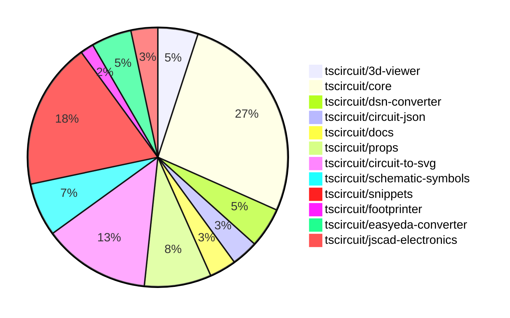

# Contribution Overview 2024-11-13

## PRs by Repository

## Contributor Overview

| Contributor | 🐳 Major | 🐙 Minor | 🐌 Tiny | ⭐ |
|-------------|-------|-------|-------|-------|
| [seveibar](#seveibar) | 4 | 21 | 0 | 👑 |
| [imrishabh18](#imrishabh18) | 3 | 13 | 0 | ⭐⭐⭐ |
| [anas-sarkez](#anas-sarkez) | 3 | 4 | 0 | ⭐⭐ |
| [mrudulpatil18](#mrudulpatil18) | 2 | 0 | 0 | ⭐ |
| [ShiboSoftwareDev](#ShiboSoftwareDev) | 0 | 2 | 1 | ⭐ |
| [Abse2001](#Abse2001) | 0 | 1 | 0 |  |
| [DhairyaMajmudar](#DhairyaMajmudar) | 0 | 1 | 0 |  |
| [Anshgrover23](#Anshgrover23) | 0 | 1 | 0 |  |
| [kom-senapati](#kom-senapati) | 0 | 1 | 0 |  |
| [RohittCodes](#RohittCodes) | 0 | 1 | 0 |  |
| [andrii-balitskyi](#andrii-balitskyi) | 0 | 0 | 1 |  |

## Changes by Repository

### [tscircuit/3d-viewer](https://github.com/tscircuit/3d-viewer)

| PR # | Impact | Contributor | Description |
|------|--------|-------------|-------------|
| [#40](https://github.com/tscircuit/3d-viewer/pull/40) | 🐳 Major | imrishabh18 | Reverts the update of the `fiber` version that was breaking the 3D viewer |
| [#39](https://github.com/tscircuit/3d-viewer/pull/39) | 🐙 Minor | anas-sarkez | Update dependencies to newer versions |
| [#38](https://github.com/tscircuit/3d-viewer/pull/38) | 🐙 Minor | anas-sarkez | The pull request adds support for rendering pill-shaped board cutouts (holes) in the 3D viewer. |

### [tscircuit/core](https://github.com/tscircuit/core)

| PR # | Impact | Contributor | Description |
|------|--------|-------------|-------------|
| [#300](https://github.com/tscircuit/core/pull/300) | 🐳 Major | imrishabh18 | Adds a new Potentiometer component to the library. |
| [#316](https://github.com/tscircuit/core/pull/316) | 🐳 Major | seveibar | Fixes the Subcircuit Refdes Selection by introducing changes to the `selectAll` and `selectOne` methods in the `PrimitiveComponent` class, as well as adding a new `Subcircuit` class and updating the `intrinsic-jsx.ts` file. |
| [#309](https://github.com/tscircuit/core/pull/309) | 🐳 Major | seveibar | The pull request fixes the type inference for pin numbers in the `createUseComponent` hooks. |
| [#297](https://github.com/tscircuit/core/pull/297) | 🐳 Major | seveibar | The pull request fixes the issue of complex crossings in the schematic trace component. |
| [#295](https://github.com/tscircuit/core/pull/295) | 🐙 Minor | imrishabh18 | Fix the width of the pin header when the label is not present. |
| [#294](https://github.com/tscircuit/core/pull/294) | 🐙 Minor | imrishabh18 | Adds the `facingDirection` prop to the `PinHeader` component |
| [#315](https://github.com/tscircuit/core/pull/315) | 🐙 Minor | ShiboSoftwareDev | Fixed an issue where non-port elements were being added as ports for custom footprints. |
| [#314](https://github.com/tscircuit/core/pull/314) | 🐙 Minor | ShiboSoftwareDev | Fixed the rendering of the battery symbol. |
| [#305](https://github.com/tscircuit/core/pull/305) | 🐙 Minor | seveibar | Update the schematic symbols package to version 0.0.98 |
| [#303](https://github.com/tscircuit/core/pull/303) | 🐙 Minor | seveibar | Adds directional symbol names for use in the `PrimitiveComponent` class. |
| [#299](https://github.com/tscircuit/core/pull/299) | 🐙 Minor | seveibar | Fixes a bug where the trace was overshooting the end of the edge. |
| [#296](https://github.com/tscircuit/core/pull/296) | 🐙 Minor | seveibar | Fix the facing direction of the net label in the Port component. |
| [#292](https://github.com/tscircuit/core/pull/292) | 🐙 Minor | seveibar | The pull request allows the `schPortArrangement` property to accept strings, in addition to numbers, for pin numbers. |
| [#319](https://github.com/tscircuit/core/pull/319) | 🐙 Minor | Abse2001 | Introduce a new component, `<pushbutton />`, to the library. |
| [#253](https://github.com/tscircuit/core/pull/253) | 🐙 Minor | DhairyaMajmudar | Adds error handling for missing footprint in the `NormalComponent` class. |
| [#242](https://github.com/tscircuit/core/pull/242) | 🐌 Tiny | andrii-balitskyi | Adds a test for the `useDiode` hook, which was already implemented in a previous pull request. |

### [tscircuit/dsn-converter](https://github.com/tscircuit/dsn-converter)

| PR # | Impact | Contributor | Description |
|------|--------|-------------|-------------|
| [#16](https://github.com/tscircuit/dsn-converter/pull/16) | 🐳 Major | imrishabh18 | Fixes a bug by converting circuit JSON to DSN file. |
| [#19](https://github.com/tscircuit/dsn-converter/pull/19) | 🐙 Minor | imrishabh18 | Adds support for plated holes and rotation on SMT pads in the PCB conversion process. |
| [#18](https://github.com/tscircuit/dsn-converter/pull/18) | 🐙 Minor | imrishabh18 | Removes the processing of traces, as they will be handled by the freerouting's autorouter. |

### [tscircuit/circuit-json](https://github.com/tscircuit/circuit-json)

| PR # | Impact | Contributor | Description |
|------|--------|-------------|-------------|
| [#80](https://github.com/tscircuit/circuit-json/pull/80) | 🐙 Minor | imrishabh18 | Add support for exporting potentiometer as a circuit element |
| [#79](https://github.com/tscircuit/circuit-json/pull/79) | 🐙 Minor | imrishabh18 | Adds a new source component for a simple potentiometer |

### [tscircuit/docs](https://github.com/tscircuit/docs)

| PR # | Impact | Contributor | Description |
|------|--------|-------------|-------------|
| [#37](https://github.com/tscircuit/docs/pull/37) | 🐙 Minor | imrishabh18 | Add documentation for the motor driver circuit |
| [#38](https://github.com/tscircuit/docs/pull/38) | 🐌 Tiny | ShiboSoftwareDev | Fixes a typo in the tutorial for the pushbutton LED circuit. |

### [tscircuit/props](https://github.com/tscircuit/props)

| PR # | Impact | Contributor | Description |
|------|--------|-------------|-------------|
| [#96](https://github.com/tscircuit/props/pull/96) | 🐙 Minor | imrishabh18 | Add a new potentiometer component to the library. |
| [#93](https://github.com/tscircuit/props/pull/93) | 🐙 Minor | imrishabh18 | Adds an optional `facingDirection` property to the `PinHeader` component, allowing the header to be oriented towards the left or right. |
| [#98](https://github.com/tscircuit/props/pull/98) | 🐙 Minor | seveibar | Remove the requirement for the `subcircuit: true` boolean property on subcircuits. |
| [#97](https://github.com/tscircuit/props/pull/97) | 🐙 Minor | seveibar | Add a new file for subcircuit component types and export it from the library index. |
| [#92](https://github.com/tscircuit/props/pull/92) | 🐙 Minor | seveibar | Allows strings and numbers to be defined together for pinLabels and improves `expectTypesMatch` errors. |

### [tscircuit/circuit-to-svg](https://github.com/tscircuit/circuit-to-svg)

| PR # | Impact | Contributor | Description |
|------|--------|-------------|-------------|
| [#120](https://github.com/tscircuit/circuit-to-svg/pull/120) | 🐙 Minor | imrishabh18 | Fixed the top and bottom anchor position for schematic net labels. |
| [#130](https://github.com/tscircuit/circuit-to-svg/pull/130) | 🐙 Minor | seveibar | Fixes outline scaling for stroke sizes and improves hovering over traces. |
| [#129](https://github.com/tscircuit/circuit-to-svg/pull/129) | 🐙 Minor | seveibar | Fix to prevent the pin number text from getting offset with large bounds. |
| [#127](https://github.com/tscircuit/circuit-to-svg/pull/127) | 🐙 Minor | seveibar | Move the "circuit-json" and "schematic-symbols" packages from "dependencies" to "peerDependencies". |
| [#126](https://github.com/tscircuit/circuit-to-svg/pull/126) | 🐙 Minor | seveibar | This pull request fixes issues with the grid not appearing at the boundaries and ensures that traces are properly used in the bounds calculation. |
| [#124](https://github.com/tscircuit/circuit-to-svg/pull/124) | 🐙 Minor | seveibar | Change the trace color on hover and make the paths rounded. |
| [#121](https://github.com/tscircuit/circuit-to-svg/pull/121) | 🐙 Minor | seveibar | Reverts the fix for the top and bottom anchor position of net labels. |
| [#132](https://github.com/tscircuit/circuit-to-svg/pull/132) | 🐙 Minor | anas-sarkez | Implemented create svg schematic text function |

### [tscircuit/schematic-symbols](https://github.com/tscircuit/schematic-symbols)

| PR # | Impact | Contributor | Description |
|------|--------|-------------|-------------|
| [#199](https://github.com/tscircuit/schematic-symbols/pull/199) | 🐳 Major | seveibar | Adds capacitor symbol in four different directions (down, left, right, up) |
| [#198](https://github.com/tscircuit/schematic-symbols/pull/198) | 🐳 Major | anas-sarkez | Implemented flipSymbolOverYAxis and flipSymbolOverXAxis functions to modify LED arrows directions |
| [#197](https://github.com/tscircuit/schematic-symbols/pull/197) | 🐙 Minor | imrishabh18 | Fix the position of the potentiometer label in the horizontal and vertical symbols. |
| [#195](https://github.com/tscircuit/schematic-symbols/pull/195) | 🐙 Minor | anas-sarkez | The pull request changes the orientation of the LED symbol from horizontal and vertical to up, right, left, and down. |

### [tscircuit/snippets](https://github.com/tscircuit/snippets)

| PR # | Impact | Contributor | Description |
|------|--------|-------------|-------------|
| [#179](https://github.com/tscircuit/snippets/pull/179) | 🐳 Major | mrudulpatil18 | Adds a new `/preview` route to allow viewing the `<PreviewContent>` component and modifies the sidebar to enable copying the embed code for this route. |
| [#206](https://github.com/tscircuit/snippets/pull/206) | 🐳 Major | mrudulpatil18 |  |
| [#235](https://github.com/tscircuit/snippets/pull/235) | 🐙 Minor | imrishabh18 | Updates the version of the "@tscircuit/3d-viewer" package to fix a 3D view issue |
| [#208](https://github.com/tscircuit/snippets/pull/208) | 🐙 Minor | imrishabh18 | Adds a new feature to download a DSN file from the circuit JSON data. |
| [#240](https://github.com/tscircuit/snippets/pull/240) | 🐙 Minor | seveibar | Update renovate settings to include 'circuit-json' in the exclude patterns and group all dependency updates together. |
| [#220](https://github.com/tscircuit/snippets/pull/220) | 🐙 Minor | seveibar | Update core and circuit-to-svg packages to fix capacitor rotation issues |
| [#213](https://github.com/tscircuit/snippets/pull/213) | 🐙 Minor | seveibar | Improves the reloading behavior of the PCB viewer component by introducing a unique `circuitJsonKey` to track changes in the circuit JSON data. |
| [#196](https://github.com/tscircuit/snippets/pull/196) | 🟣 | seveibar | The pull request adds support for async circuit rendering and opens BOM links in a new tab. |
| [#233](https://github.com/tscircuit/snippets/pull/233) | 🐙 Minor | Anshgrover23 | Fixes the issue where hovering over traces does not change the color. |
| [#218](https://github.com/tscircuit/snippets/pull/218) | 🐙 Minor | kom-senapati | Adds a utility function to get the React TypeScript syntax error message and uses it in the `useRunTsx` hook. |
| [#182](https://github.com/tscircuit/snippets/pull/182) | 🐙 Minor | RohittCodes | Refactor the search text component to fix issues with Playwright tests on different device sizes. |

### [tscircuit/footprinter](https://github.com/tscircuit/footprinter)

| PR # | Impact | Contributor | Description |
|------|--------|-------------|-------------|
| [#81](https://github.com/tscircuit/footprinter/pull/81) | 🐙 Minor | seveibar | Adds a new example for a quad component with custom thermal pad dimensions |

### [tscircuit/easyeda-converter](https://github.com/tscircuit/easyeda-converter)

| PR # | Impact | Contributor | Description |
|------|--------|-------------|-------------|
| [#112](https://github.com/tscircuit/easyeda-converter/pull/112) | 🐙 Minor | seveibar | Ensures that short part numbers fetch correctly from EasyEDA. |
| [#108](https://github.com/tscircuit/easyeda-converter/pull/108) | 🐙 Minor | seveibar | Add `manufacturerPartNumber` prop to the `soupTypescriptComponentTemplate` function and use it in the component. |
| [#107](https://github.com/tscircuit/easyeda-converter/pull/107) | 🐙 Minor | seveibar | Change the supplier from LCSC to JLCPCB |

### [tscircuit/jscad-electronics](https://github.com/tscircuit/jscad-electronics)

| PR # | Impact | Contributor | Description |
|------|--------|-------------|-------------|
| [#79](https://github.com/tscircuit/jscad-electronics/pull/79) | 🐳 Major | anas-sarkez | Implemented a 3D StampBoard component with customizable parameters, including lead positions, inner holes, and board dimensions. |
| [#78](https://github.com/tscircuit/jscad-electronics/pull/78) | 🐳 Major | anas-sarkez | Refactors the QFN 3D element and adds a new QFN Footprinter3D example. |

## Changes by Contributor

### [imrishabh18](https://github.com/imrishabh18)

| PR # | Impact | Description |
|------|--------|-------------|
| [#40](https://github.com/tscircuit/3d-viewer/pull/40) | 🐳 Major | Reverts the update of the `fiber` version that was breaking the 3D viewer |
| [#300](https://github.com/tscircuit/core/pull/300) | 🐳 Major | Adds a new Potentiometer component to the library. |
| [#16](https://github.com/tscircuit/dsn-converter/pull/16) | 🐳 Major | Fixes a bug by converting circuit JSON to DSN file. |
| [#80](https://github.com/tscircuit/circuit-json/pull/80) | 🐙 Minor | Add support for exporting potentiometer as a circuit element |
| [#79](https://github.com/tscircuit/circuit-json/pull/79) | 🐙 Minor | Adds a new source component for a simple potentiometer |
| [#37](https://github.com/tscircuit/docs/pull/37) | 🐙 Minor | Add documentation for the motor driver circuit |
| [#96](https://github.com/tscircuit/props/pull/96) | 🐙 Minor | Add a new potentiometer component to the library. |
| [#93](https://github.com/tscircuit/props/pull/93) | 🐙 Minor | Adds an optional `facingDirection` property to the `PinHeader` component, allowing the header to be oriented towards the left or right. |
| [#295](https://github.com/tscircuit/core/pull/295) | 🐙 Minor | Fix the width of the pin header when the label is not present. |
| [#294](https://github.com/tscircuit/core/pull/294) | 🐙 Minor | Adds the `facingDirection` prop to the `PinHeader` component |
| [#120](https://github.com/tscircuit/circuit-to-svg/pull/120) | 🐙 Minor | Fixed the top and bottom anchor position for schematic net labels. |
| [#197](https://github.com/tscircuit/schematic-symbols/pull/197) | 🐙 Minor | Fix the position of the potentiometer label in the horizontal and vertical symbols. |
| [#19](https://github.com/tscircuit/dsn-converter/pull/19) | 🐙 Minor | Adds support for plated holes and rotation on SMT pads in the PCB conversion process. |
| [#18](https://github.com/tscircuit/dsn-converter/pull/18) | 🐙 Minor | Removes the processing of traces, as they will be handled by the freerouting's autorouter. |
| [#235](https://github.com/tscircuit/snippets/pull/235) | 🐙 Minor | Updates the version of the "@tscircuit/3d-viewer" package to fix a 3D view issue |
| [#208](https://github.com/tscircuit/snippets/pull/208) | 🐙 Minor | Adds a new feature to download a DSN file from the circuit JSON data. |

### [ShiboSoftwareDev](https://github.com/ShiboSoftwareDev)

| PR # | Impact | Description |
|------|--------|-------------|
| [#315](https://github.com/tscircuit/core/pull/315) | 🐙 Minor | Fixed an issue where non-port elements were being added as ports for custom footprints. |
| [#314](https://github.com/tscircuit/core/pull/314) | 🐙 Minor | Fixed the rendering of the battery symbol. |
| [#38](https://github.com/tscircuit/docs/pull/38) | 🐌 Tiny | Fixes a typo in the tutorial for the pushbutton LED circuit. |

### [seveibar](https://github.com/seveibar)

| PR # | Impact | Description |
|------|--------|-------------|
| [#316](https://github.com/tscircuit/core/pull/316) | 🐳 Major | Fixes the Subcircuit Refdes Selection by introducing changes to the `selectAll` and `selectOne` methods in the `PrimitiveComponent` class, as well as adding a new `Subcircuit` class and updating the `intrinsic-jsx.ts` file. |
| [#309](https://github.com/tscircuit/core/pull/309) | 🐳 Major | The pull request fixes the type inference for pin numbers in the `createUseComponent` hooks. |
| [#297](https://github.com/tscircuit/core/pull/297) | 🐳 Major | The pull request fixes the issue of complex crossings in the schematic trace component. |
| [#199](https://github.com/tscircuit/schematic-symbols/pull/199) | 🐳 Major | Adds capacitor symbol in four different directions (down, left, right, up) |
| [#98](https://github.com/tscircuit/props/pull/98) | 🐙 Minor | Remove the requirement for the `subcircuit: true` boolean property on subcircuits. |
| [#97](https://github.com/tscircuit/props/pull/97) | 🐙 Minor | Add a new file for subcircuit component types and export it from the library index. |
| [#92](https://github.com/tscircuit/props/pull/92) | 🐙 Minor | Allows strings and numbers to be defined together for pinLabels and improves `expectTypesMatch` errors. |
| [#81](https://github.com/tscircuit/footprinter/pull/81) | 🐙 Minor | Adds a new example for a quad component with custom thermal pad dimensions |
| [#112](https://github.com/tscircuit/easyeda-converter/pull/112) | 🐙 Minor | Ensures that short part numbers fetch correctly from EasyEDA. |
| [#108](https://github.com/tscircuit/easyeda-converter/pull/108) | 🐙 Minor | Add `manufacturerPartNumber` prop to the `soupTypescriptComponentTemplate` function and use it in the component. |
| [#107](https://github.com/tscircuit/easyeda-converter/pull/107) | 🐙 Minor | Change the supplier from LCSC to JLCPCB |
| [#305](https://github.com/tscircuit/core/pull/305) | 🐙 Minor | Update the schematic symbols package to version 0.0.98 |
| [#303](https://github.com/tscircuit/core/pull/303) | 🐙 Minor | Adds directional symbol names for use in the `PrimitiveComponent` class. |
| [#299](https://github.com/tscircuit/core/pull/299) | 🐙 Minor | Fixes a bug where the trace was overshooting the end of the edge. |
| [#296](https://github.com/tscircuit/core/pull/296) | 🐙 Minor | Fix the facing direction of the net label in the Port component. |
| [#292](https://github.com/tscircuit/core/pull/292) | 🐙 Minor | The pull request allows the `schPortArrangement` property to accept strings, in addition to numbers, for pin numbers. |
| [#130](https://github.com/tscircuit/circuit-to-svg/pull/130) | 🐙 Minor | Fixes outline scaling for stroke sizes and improves hovering over traces. |
| [#129](https://github.com/tscircuit/circuit-to-svg/pull/129) | 🐙 Minor | Fix to prevent the pin number text from getting offset with large bounds. |
| [#127](https://github.com/tscircuit/circuit-to-svg/pull/127) | 🐙 Minor | Move the "circuit-json" and "schematic-symbols" packages from "dependencies" to "peerDependencies". |
| [#126](https://github.com/tscircuit/circuit-to-svg/pull/126) | 🐙 Minor | This pull request fixes issues with the grid not appearing at the boundaries and ensures that traces are properly used in the bounds calculation. |
| [#124](https://github.com/tscircuit/circuit-to-svg/pull/124) | 🐙 Minor | Change the trace color on hover and make the paths rounded. |
| [#121](https://github.com/tscircuit/circuit-to-svg/pull/121) | 🐙 Minor | Reverts the fix for the top and bottom anchor position of net labels. |
| [#240](https://github.com/tscircuit/snippets/pull/240) | 🐙 Minor | Update renovate settings to include 'circuit-json' in the exclude patterns and group all dependency updates together. |
| [#220](https://github.com/tscircuit/snippets/pull/220) | 🐙 Minor | Update core and circuit-to-svg packages to fix capacitor rotation issues |
| [#213](https://github.com/tscircuit/snippets/pull/213) | 🐙 Minor | Improves the reloading behavior of the PCB viewer component by introducing a unique `circuitJsonKey` to track changes in the circuit JSON data. |
| [#196](https://github.com/tscircuit/snippets/pull/196) | 🟣 | The pull request adds support for async circuit rendering and opens BOM links in a new tab. |

### [anas-sarkez](https://github.com/anas-sarkez)

| PR # | Impact | Description |
|------|--------|-------------|
| [#79](https://github.com/tscircuit/jscad-electronics/pull/79) | 🐳 Major | Implemented a 3D StampBoard component with customizable parameters, including lead positions, inner holes, and board dimensions. |
| [#78](https://github.com/tscircuit/jscad-electronics/pull/78) | 🐳 Major | Refactors the QFN 3D element and adds a new QFN Footprinter3D example. |
| [#198](https://github.com/tscircuit/schematic-symbols/pull/198) | 🐳 Major | Implemented flipSymbolOverYAxis and flipSymbolOverXAxis functions to modify LED arrows directions |
| [#39](https://github.com/tscircuit/3d-viewer/pull/39) | 🐙 Minor | Update dependencies to newer versions |
| [#38](https://github.com/tscircuit/3d-viewer/pull/38) | 🐙 Minor | The pull request adds support for rendering pill-shaped board cutouts (holes) in the 3D viewer. |
| [#132](https://github.com/tscircuit/circuit-to-svg/pull/132) | 🐙 Minor | Implemented create svg schematic text function |
| [#195](https://github.com/tscircuit/schematic-symbols/pull/195) | 🐙 Minor | The pull request changes the orientation of the LED symbol from horizontal and vertical to up, right, left, and down. |

### [Abse2001](https://github.com/Abse2001)

| PR # | Impact | Description |
|------|--------|-------------|
| [#319](https://github.com/tscircuit/core/pull/319) | 🐙 Minor | Introduce a new component, `<pushbutton />`, to the library. |

### [DhairyaMajmudar](https://github.com/DhairyaMajmudar)

| PR # | Impact | Description |
|------|--------|-------------|
| [#253](https://github.com/tscircuit/core/pull/253) | 🐙 Minor | Adds error handling for missing footprint in the `NormalComponent` class. |

### [andrii-balitskyi](https://github.com/andrii-balitskyi)

| PR # | Impact | Description |
|------|--------|-------------|
| [#242](https://github.com/tscircuit/core/pull/242) | 🐌 Tiny | Adds a test for the `useDiode` hook, which was already implemented in a previous pull request. |

### [Anshgrover23](https://github.com/Anshgrover23)

| PR # | Impact | Description |
|------|--------|-------------|
| [#233](https://github.com/tscircuit/snippets/pull/233) | 🐙 Minor | Fixes the issue where hovering over traces does not change the color. |

### [kom-senapati](https://github.com/kom-senapati)

| PR # | Impact | Description |
|------|--------|-------------|
| [#218](https://github.com/tscircuit/snippets/pull/218) | 🐙 Minor | Adds a utility function to get the React TypeScript syntax error message and uses it in the `useRunTsx` hook. |

### [mrudulpatil18](https://github.com/mrudulpatil18)

| PR # | Impact | Description |
|------|--------|-------------|
| [#179](https://github.com/tscircuit/snippets/pull/179) | 🐳 Major | Adds a new `/preview` route to allow viewing the `<PreviewContent>` component and modifies the sidebar to enable copying the embed code for this route. |
| [#206](https://github.com/tscircuit/snippets/pull/206) | 🐳 Major |  |

### [RohittCodes](https://github.com/RohittCodes)

| PR # | Impact | Description |
|------|--------|-------------|
| [#182](https://github.com/tscircuit/snippets/pull/182) | 🐙 Minor | Refactor the search text component to fix issues with Playwright tests on different device sizes. |

