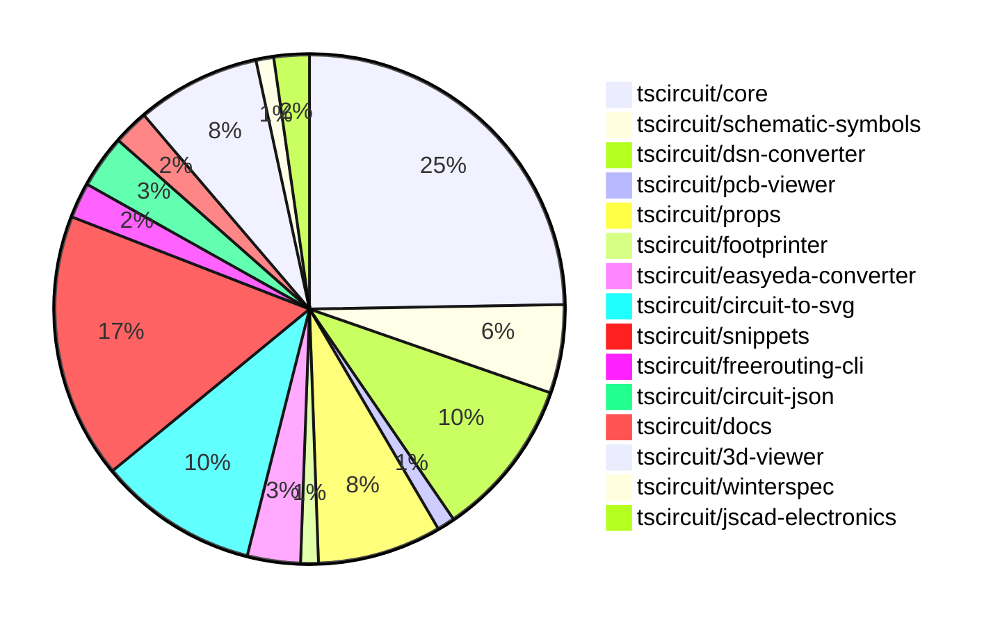

# Contribution Overview 2024-11-13

## PRs by Repository

## Contributor Overview

| Contributor | 🐳 Major | 🐙 Minor | 🐌 Tiny | ⭐ |
|-------------|-------|-------|-------|-------|
| [seveibar](#seveibar) | 6 | 29 | 1 | 👑👑 |
| [imrishabh18](#imrishabh18) | 2 | 17 | 0 | ⭐⭐⭐ |
| [anas-sarkez](#anas-sarkez) | 4 | 6 | 2 | ⭐⭐ |
| [ShiboSoftwareDev](#ShiboSoftwareDev) | 1 | 4 | 1 | ⭐⭐ |
| [Abse2001](#Abse2001) | 1 | 2 | 1 | ⭐ |
| [RohittCodes](#RohittCodes) | 1 | 2 | 0 | ⭐ |
| [mrudulpatil18](#mrudulpatil18) | 0 | 3 | 0 | ⭐ |
| [DhairyaMajmudar](#DhairyaMajmudar) | 1 | 0 | 0 | ⭐ |
| [Anshgrover23](#Anshgrover23) | 0 | 1 | 0 |  |
| [kom-senapati](#kom-senapati) | 0 | 1 | 0 |  |
| [andrii-balitskyi](#andrii-balitskyi) | 0 | 0 | 1 |  |

## Changes by Repository

### [tscircuit/core](https://github.com/tscircuit/core)

| PR # | Impact | Contributor | Description |
|------|--------|-------------|-------------|
| [#297](https://github.com/tscircuit/core/pull/297) | 🐳 Major | seveibar | Fixes an issue with complex crossings in the schematic trace rendering. |
| [#292](https://github.com/tscircuit/core/pull/292) | 🐳 Major | seveibar | Allow `schPortArrangement` to accept strings in addition to numbers. |
| [#319](https://github.com/tscircuit/core/pull/319) | 🐳 Major | Abse2001 | Introduce a new <pushbutton /> component. |
| [#253](https://github.com/tscircuit/core/pull/253) | 🐳 Major | DhairyaMajmudar | Adds error handling for missing footprint in the `NormalComponent` class and introduces a new `MissingFootprintError` class. |
| [#326](https://github.com/tscircuit/core/pull/326) | 🐙 Minor | seveibar | Allow disabling trace rendering inside of subcircuits |
| [#323](https://github.com/tscircuit/core/pull/323) | 🐙 Minor | seveibar | Adds write permissions to the `pull-requests` section of the GitHub Actions workflow for bundle size reporting. |
| [#316](https://github.com/tscircuit/core/pull/316) | 🟣 | seveibar | Fix Subcircuit Refdes Selection (Subcircuit Isolation Part 1) |
| [#309](https://github.com/tscircuit/core/pull/309) | 🐙 Minor | seveibar | The pull request fixes the type inference for pin numbers in the `createUseComponent` hooks, allowing for better type safety. |
| [#305](https://github.com/tscircuit/core/pull/305) | 🐙 Minor | seveibar | Update the schematic symbols library to version 0.0.98 which includes changes to the capacitor directions |
| [#303](https://github.com/tscircuit/core/pull/303) | 🐙 Minor | seveibar | Adds new directional symbol names to the codebase. |
| [#299](https://github.com/tscircuit/core/pull/299) | 🐙 Minor | seveibar | Fix a simplified overshot check in the Trace component. |
| [#296](https://github.com/tscircuit/core/pull/296) | 🐙 Minor | seveibar | Fix the facing direction of the net label. |
| [#300](https://github.com/tscircuit/core/pull/300) | 🐙 Minor | imrishabh18 | Adds a new component 'Potentiometer' to the library |
| [#295](https://github.com/tscircuit/core/pull/295) | 🐙 Minor | imrishabh18 | Fixes the width of the pin header when the label is not present. |
| [#294](https://github.com/tscircuit/core/pull/294) | 🐙 Minor | imrishabh18 | Adds the `facingDirection` prop to the `PinHeader` component, which determines the positioning of the pins. |
| [#315](https://github.com/tscircuit/core/pull/315) | 🐙 Minor | ShiboSoftwareDev | Fixed a bug where non-port elements were being added as ports for custom footprints. |
| [#314](https://github.com/tscircuit/core/pull/314) | 🐙 Minor | ShiboSoftwareDev | Fixed the rendering of the battery symbol. |
| [#325](https://github.com/tscircuit/core/pull/325) | 🐙 Minor | anas-sarkez | Modify the position of manufacturer part number and name label based on the component's port arrangement. |
| [#322](https://github.com/tscircuit/core/pull/322) | 🐙 Minor | anas-sarkez | Refactor the trace so it does not get passed to the chip manufacturer part number and name. |
| [#330](https://github.com/tscircuit/core/pull/330) | 🐌 Tiny | anas-sarkez | Updates the bun lockfile to the latest version. |
| [#329](https://github.com/tscircuit/core/pull/329) | 🐌 Tiny | anas-sarkez | Updated the package lockfile to include the latest versions of dependencies. |
| [#242](https://github.com/tscircuit/core/pull/242) | 🐌 Tiny | andrii-balitskyi | Adds a test for the `useDiode` hook to ensure it creates diode components with the correct props and traces. |

### [tscircuit/schematic-symbols](https://github.com/tscircuit/schematic-symbols)

| PR # | Impact | Contributor | Description |
|------|--------|-------------|-------------|
| [#204](https://github.com/tscircuit/schematic-symbols/pull/204) | 🐳 Major | seveibar | The pull request flips the y-coordinates in the exported SVG symbols to make the y-axis positive in the upward direction. |
| [#198](https://github.com/tscircuit/schematic-symbols/pull/198) | 🐳 Major | anas-sarkez | Implemented flipSymbolOverYAxis and flipSymbolOverXAxis functions to modify LED arrows directions |
| [#195](https://github.com/tscircuit/schematic-symbols/pull/195) | 🐳 Major | anas-sarkez | The change updates the LED symbol by replacing the "horz" and "vert" versions with new "up", "right", "left", and "down" versions. |
| [#199](https://github.com/tscircuit/schematic-symbols/pull/199) | 🐙 Minor | seveibar | Adds capacitor symbols in different directions |
| [#197](https://github.com/tscircuit/schematic-symbols/pull/197) | 🐙 Minor | imrishabh18 | Fix the position of the potentiometer label in the horizontal and vertical symbols. |

### [tscircuit/dsn-converter](https://github.com/tscircuit/dsn-converter)

| PR # | Impact | Contributor | Description |
|------|--------|-------------|-------------|
| [#24](https://github.com/tscircuit/dsn-converter/pull/24) | 🐳 Major | seveibar | The pull request introduces a new module "convertCircuitJsonToDsnSession" that converts a circuit JSON representation to a DSN session format. |
| [#21](https://github.com/tscircuit/dsn-converter/pull/21) | 🐳 Major | seveibar | Fixes the parsing of DSN sessions and introduces a new function to convert DSN session data to circuit JSON. |
| [#20](https://github.com/tscircuit/dsn-converter/pull/20) | 🐳 Major | seveibar | Adds initial support for parsing DSN session files and converting them to circuit JSON format. |
| [#19](https://github.com/tscircuit/dsn-converter/pull/19) | 🐳 Major | imrishabh18 | Adds support for plated holes and rotation on SMT pads. |
| [#16](https://github.com/tscircuit/dsn-converter/pull/16) | 🐳 Major | imrishabh18 | The pull request fixes an issue by converting a circuit JSON file to a DSN file. |
| [#22](https://github.com/tscircuit/dsn-converter/pull/22) | 🐙 Minor | seveibar | Add support for stringifying DSN sessions |
| [#23](https://github.com/tscircuit/dsn-converter/pull/23) | 🐙 Minor | imrishabh18 | Fixes an issue by adding traces parsing back to the PCB conversion process. |
| [#18](https://github.com/tscircuit/dsn-converter/pull/18) | 🐙 Minor | imrishabh18 | Removes the processing of traces, as they will be handled by the freerouting's autorouter. |
| [#25](https://github.com/tscircuit/dsn-converter/pull/25) | 🐌 Tiny | seveibar | Fixes the session JSON file by removing the old file and adding a new one. |

### [tscircuit/pcb-viewer](https://github.com/tscircuit/pcb-viewer)

| PR # | Impact | Contributor | Description |
|------|--------|-------------|-------------|
| [#81](https://github.com/tscircuit/pcb-viewer/pull/81) | 🐙 Minor | seveibar | Update the README file to include usage details for the `circuitJson` prop and other available props for the `PCBViewer` component. |

### [tscircuit/props](https://github.com/tscircuit/props)

| PR # | Impact | Contributor | Description |
|------|--------|-------------|-------------|
| [#99](https://github.com/tscircuit/props/pull/99) | 🐙 Minor | seveibar | Allow group prop discrimination to fix parsing issues |
| [#98](https://github.com/tscircuit/props/pull/98) | 🟣 | seveibar | Don't require the `subcircuit: true` boolean property on subcircuits |
| [#97](https://github.com/tscircuit/props/pull/97) | 🐙 Minor | seveibar | Add a new subcircuit file to the project. |
| [#92](https://github.com/tscircuit/props/pull/92) | 🐙 Minor | seveibar | Allows strings and numbers to be defined together for `pinLabels`, and improves the `expectTypesMatch` errors. |
| [#100](https://github.com/tscircuit/props/pull/100) | 🐙 Minor | imrishabh18 | Adds a new component called "crystal" with associated properties and types. |
| [#96](https://github.com/tscircuit/props/pull/96) | 🐙 Minor | imrishabh18 | Add a new potentiometer component |
| [#93](https://github.com/tscircuit/props/pull/93) | 🐙 Minor | imrishabh18 | Adds the ability to specify the facing direction of the pin header component. |

### [tscircuit/footprinter](https://github.com/tscircuit/footprinter)

| PR # | Impact | Contributor | Description |
|------|--------|-------------|-------------|
| [#81](https://github.com/tscircuit/footprinter/pull/81) | 🐙 Minor | seveibar | Adds a new example for a PCB with a custom-sized thermal pad. |

### [tscircuit/easyeda-converter](https://github.com/tscircuit/easyeda-converter)

| PR # | Impact | Contributor | Description |
|------|--------|-------------|-------------|
| [#112](https://github.com/tscircuit/easyeda-converter/pull/112) | 🐙 Minor | seveibar | Improves the logic for fetching the correct component based on the provided part number. |
| [#108](https://github.com/tscircuit/easyeda-converter/pull/108) | 🐙 Minor | seveibar | Add the `manufacturerPartNumber` prop to the `soupTypescriptComponentTemplate` function and the component. |
| [#107](https://github.com/tscircuit/easyeda-converter/pull/107) | 🐙 Minor | seveibar | Change the supplier part number from LCSC to JLCPCB. |

### [tscircuit/circuit-to-svg](https://github.com/tscircuit/circuit-to-svg)

| PR # | Impact | Contributor | Description |
|------|--------|-------------|-------------|
| [#130](https://github.com/tscircuit/circuit-to-svg/pull/130) | 🐙 Minor | seveibar | Fixes outline scaling for trace stroke sizes and improves hovering over traces. |
| [#129](https://github.com/tscircuit/circuit-to-svg/pull/129) | 🐙 Minor | seveibar | Fix pin number text getting offset with large bounds |
| [#127](https://github.com/tscircuit/circuit-to-svg/pull/127) | 🐙 Minor | seveibar | Move `circuit-json` and `schematic-symbols` packages from `dependencies` to `peerDependencies`. |
| [#126](https://github.com/tscircuit/circuit-to-svg/pull/126) | 🐙 Minor | seveibar | Fixes the grid not appearing at the boundaries and ensures traces are used in the bounds calculation. |
| [#124](https://github.com/tscircuit/circuit-to-svg/pull/124) | 🐙 Minor | seveibar | Change trace color on hover and make paths rounded |
| [#121](https://github.com/tscircuit/circuit-to-svg/pull/121) | 🐙 Minor | seveibar | Reverts a previous fix to the top and bottom anchor position of net labels. |
| [#120](https://github.com/tscircuit/circuit-to-svg/pull/120) | 🐙 Minor | imrishabh18 | Fixed the top and bottom anchor position for net labels. |
| [#133](https://github.com/tscircuit/circuit-to-svg/pull/133) | 🐙 Minor | anas-sarkez | Removed the drawing of manufacturer part numbers in the circuit-to-svg conversion. |
| [#132](https://github.com/tscircuit/circuit-to-svg/pull/132) | 🐙 Minor | anas-sarkez | Implemented a function to create SVG schematic text. |

### [tscircuit/snippets](https://github.com/tscircuit/snippets)

| PR # | Impact | Contributor | Description |
|------|--------|-------------|-------------|
| [#246](https://github.com/tscircuit/snippets/pull/246) | 🐳 Major | ShiboSoftwareDev | Adds a feature to insert chip into the code editor |
| [#237](https://github.com/tscircuit/snippets/pull/237) | 🐳 Major | RohittCodes | Implements a route for rendering SVG images of PCB and schematic for code snippets. |
| [#240](https://github.com/tscircuit/snippets/pull/240) | 🐙 Minor | seveibar | Update renovate settings to include circuit json and group all updates together |
| [#220](https://github.com/tscircuit/snippets/pull/220) | 🐙 Minor | seveibar | Update core and circuit-to-svg libraries for capacitor rotation fixes |
| [#213](https://github.com/tscircuit/snippets/pull/213) | 🐙 Minor | seveibar | Improve the reloading of the PCB viewer by using a unique key based on the circuitJsonKey instead of the tsxRunTriggerCount. |
| [#196](https://github.com/tscircuit/snippets/pull/196) | 🐙 Minor | seveibar | The pull request adds support for async circuit rendering and opens BOM links in a new tab. |
| [#235](https://github.com/tscircuit/snippets/pull/235) | 🐙 Minor | imrishabh18 | Update the version of the `@tscircuit/3d-viewer` dependency to fix a 3D view issue. |
| [#208](https://github.com/tscircuit/snippets/pull/208) | 🐙 Minor | imrishabh18 | Adds a new feature to download the DSN file from the circuit data. |
| [#179](https://github.com/tscircuit/snippets/pull/179) | 🐙 Minor | mrudulpatil18 | Adds a /preview route and a preview page to view the `<PreviewContent>` component, and modifies the sidebar to allow copying embed code according to this route. |
| [#206](https://github.com/tscircuit/snippets/pull/206) | 🐙 Minor | mrudulpatil18 |  |
| [#247](https://github.com/tscircuit/snippets/pull/247) | 🐙 Minor | Abse2001 | Fixes an issue with the 3D capacitor color not changing when using cap footprints |
| [#250](https://github.com/tscircuit/snippets/pull/250) | 🐙 Minor | RohittCodes | Fixes an issue where an unnecessary dispatch caused the editor to update the content, resulting in the cursor going to line 0. |
| [#182](https://github.com/tscircuit/snippets/pull/182) | 🐙 Minor | RohittCodes | Refactor the search functionality in the Playwright tests to handle different viewport sizes. |
| [#233](https://github.com/tscircuit/snippets/pull/233) | 🐙 Minor | Anshgrover23 | Fix: Hovering over traces should change the color |
| [#218](https://github.com/tscircuit/snippets/pull/218) | 🐙 Minor | kom-senapati | The pull request adds a utility function to check for TypeScript syntax errors in React code and returns the error message if present. |

### [tscircuit/freerouting-cli](https://github.com/tscircuit/freerouting-cli)

| PR # | Impact | Contributor | Description |
|------|--------|-------------|-------------|
| [#3](https://github.com/tscircuit/freerouting-cli/pull/3) | 🐙 Minor | seveibar | Adds a command to start a local Freerouting server using Docker |
| [#2](https://github.com/tscircuit/freerouting-cli/pull/2) | 🐙 Minor | seveibar | Adds a biome dependency, fixes config commands, and makes various other fixes. |

### [tscircuit/circuit-json](https://github.com/tscircuit/circuit-json)

| PR # | Impact | Contributor | Description |
|------|--------|-------------|-------------|
| [#81](https://github.com/tscircuit/circuit-json/pull/81) | 🐙 Minor | imrishabh18 | Adds support for a new type of source component, namely a simple crystal, to the project. |
| [#80](https://github.com/tscircuit/circuit-json/pull/80) | 🐙 Minor | imrishabh18 | Add support for potentiometer component |
| [#79](https://github.com/tscircuit/circuit-json/pull/79) | 🐙 Minor | imrishabh18 | Adds a new source component for a simple potentiometer |

### [tscircuit/docs](https://github.com/tscircuit/docs)

| PR # | Impact | Contributor | Description |
|------|--------|-------------|-------------|
| [#37](https://github.com/tscircuit/docs/pull/37) | 🐙 Minor | imrishabh18 | Adds documentation for a motor driver circuit. |
| [#38](https://github.com/tscircuit/docs/pull/38) | 🐌 Tiny | ShiboSoftwareDev | Fix a typo in the tutorial's markdown file |

### [tscircuit/3d-viewer](https://github.com/tscircuit/3d-viewer)

| PR # | Impact | Contributor | Description |
|------|--------|-------------|-------------|
| [#38](https://github.com/tscircuit/3d-viewer/pull/38) | 🐳 Major | anas-sarkez | Adds support for pill-shaped board cutouts (holes) in the 3D viewer. |
| [#40](https://github.com/tscircuit/3d-viewer/pull/40) | 🐙 Minor | imrishabh18 | Reverts the update to the fiber version, as it was breaking the 3D viewer. |
| [#44](https://github.com/tscircuit/3d-viewer/pull/44) | 🐙 Minor | ShiboSoftwareDev | Allows plated holes to be either horizontal or vertical in the biome format. |
| [#37](https://github.com/tscircuit/3d-viewer/pull/37) | 🐙 Minor | mrudulpatil18 | Positions the hover label below the pointer and updates its position frame by frame to prevent it from drifting away when the camera view changes. |
| [#41](https://github.com/tscircuit/3d-viewer/pull/41) | 🐙 Minor | Abse2001 | Updating the jscad-electronics dependency to version 0.0.21 to fix an issue with cap footprints not changing the 3D capacitor color in snippets. |
| [#39](https://github.com/tscircuit/3d-viewer/pull/39) | 🐙 Minor | anas-sarkez | Update dependencies in the project |
| [#42](https://github.com/tscircuit/3d-viewer/pull/42) | 🐌 Tiny | Abse2001 | Updated the project's lockfile to reflect the latest dependency versions. |

### [tscircuit/winterspec](https://github.com/tscircuit/winterspec)

| PR # | Impact | Contributor | Description |
|------|--------|-------------|-------------|
| [#22](https://github.com/tscircuit/winterspec/pull/22) | 🐙 Minor | ShiboSoftwareDev | Exports a CORS middleware function with testing. |

### [tscircuit/jscad-electronics](https://github.com/tscircuit/jscad-electronics)

| PR # | Impact | Contributor | Description |
|------|--------|-------------|-------------|
| [#79](https://github.com/tscircuit/jscad-electronics/pull/79) | 🐳 Major | anas-sarkez | Implemented a new StampBoard 3D component with customizable parameters and the ability to include inner holes. |
| [#78](https://github.com/tscircuit/jscad-electronics/pull/78) | 🐙 Minor | anas-sarkez | Refactor the QFN 3D element and add a new QFN Footprinter3D example. |

## Changes by Contributor

### [seveibar](https://github.com/seveibar)

| PR # | Impact | Description |
|------|--------|-------------|
| [#297](https://github.com/tscircuit/core/pull/297) | 🐳 Major | Fixes an issue with complex crossings in the schematic trace rendering. |
| [#292](https://github.com/tscircuit/core/pull/292) | 🐳 Major | Allow `schPortArrangement` to accept strings in addition to numbers. |
| [#204](https://github.com/tscircuit/schematic-symbols/pull/204) | 🐳 Major | The pull request flips the y-coordinates in the exported SVG symbols to make the y-axis positive in the upward direction. |
| [#24](https://github.com/tscircuit/dsn-converter/pull/24) | 🐳 Major | The pull request introduces a new module "convertCircuitJsonToDsnSession" that converts a circuit JSON representation to a DSN session format. |
| [#21](https://github.com/tscircuit/dsn-converter/pull/21) | 🐳 Major | Fixes the parsing of DSN sessions and introduces a new function to convert DSN session data to circuit JSON. |
| [#20](https://github.com/tscircuit/dsn-converter/pull/20) | 🐳 Major | Adds initial support for parsing DSN session files and converting them to circuit JSON format. |
| [#81](https://github.com/tscircuit/pcb-viewer/pull/81) | 🐙 Minor | Update the README file to include usage details for the `circuitJson` prop and other available props for the `PCBViewer` component. |
| [#99](https://github.com/tscircuit/props/pull/99) | 🐙 Minor | Allow group prop discrimination to fix parsing issues |
| [#98](https://github.com/tscircuit/props/pull/98) | 🟣 | Don't require the `subcircuit: true` boolean property on subcircuits |
| [#97](https://github.com/tscircuit/props/pull/97) | 🐙 Minor | Add a new subcircuit file to the project. |
| [#92](https://github.com/tscircuit/props/pull/92) | 🐙 Minor | Allows strings and numbers to be defined together for `pinLabels`, and improves the `expectTypesMatch` errors. |
| [#81](https://github.com/tscircuit/footprinter/pull/81) | 🐙 Minor | Adds a new example for a PCB with a custom-sized thermal pad. |
| [#112](https://github.com/tscircuit/easyeda-converter/pull/112) | 🐙 Minor | Improves the logic for fetching the correct component based on the provided part number. |
| [#108](https://github.com/tscircuit/easyeda-converter/pull/108) | 🐙 Minor | Add the `manufacturerPartNumber` prop to the `soupTypescriptComponentTemplate` function and the component. |
| [#107](https://github.com/tscircuit/easyeda-converter/pull/107) | 🐙 Minor | Change the supplier part number from LCSC to JLCPCB. |
| [#326](https://github.com/tscircuit/core/pull/326) | 🐙 Minor | Allow disabling trace rendering inside of subcircuits |
| [#323](https://github.com/tscircuit/core/pull/323) | 🐙 Minor | Adds write permissions to the `pull-requests` section of the GitHub Actions workflow for bundle size reporting. |
| [#316](https://github.com/tscircuit/core/pull/316) | 🟣 | Fix Subcircuit Refdes Selection (Subcircuit Isolation Part 1) |
| [#309](https://github.com/tscircuit/core/pull/309) | 🐙 Minor | The pull request fixes the type inference for pin numbers in the `createUseComponent` hooks, allowing for better type safety. |
| [#305](https://github.com/tscircuit/core/pull/305) | 🐙 Minor | Update the schematic symbols library to version 0.0.98 which includes changes to the capacitor directions |
| [#303](https://github.com/tscircuit/core/pull/303) | 🐙 Minor | Adds new directional symbol names to the codebase. |
| [#299](https://github.com/tscircuit/core/pull/299) | 🐙 Minor | Fix a simplified overshot check in the Trace component. |
| [#296](https://github.com/tscircuit/core/pull/296) | 🐙 Minor | Fix the facing direction of the net label. |
| [#130](https://github.com/tscircuit/circuit-to-svg/pull/130) | 🐙 Minor | Fixes outline scaling for trace stroke sizes and improves hovering over traces. |
| [#129](https://github.com/tscircuit/circuit-to-svg/pull/129) | 🐙 Minor | Fix pin number text getting offset with large bounds |
| [#127](https://github.com/tscircuit/circuit-to-svg/pull/127) | 🐙 Minor | Move `circuit-json` and `schematic-symbols` packages from `dependencies` to `peerDependencies`. |
| [#126](https://github.com/tscircuit/circuit-to-svg/pull/126) | 🐙 Minor | Fixes the grid not appearing at the boundaries and ensures traces are used in the bounds calculation. |
| [#124](https://github.com/tscircuit/circuit-to-svg/pull/124) | 🐙 Minor | Change trace color on hover and make paths rounded |
| [#121](https://github.com/tscircuit/circuit-to-svg/pull/121) | 🐙 Minor | Reverts a previous fix to the top and bottom anchor position of net labels. |
| [#199](https://github.com/tscircuit/schematic-symbols/pull/199) | 🐙 Minor | Adds capacitor symbols in different directions |
| [#22](https://github.com/tscircuit/dsn-converter/pull/22) | 🐙 Minor | Add support for stringifying DSN sessions |
| [#240](https://github.com/tscircuit/snippets/pull/240) | 🐙 Minor | Update renovate settings to include circuit json and group all updates together |
| [#220](https://github.com/tscircuit/snippets/pull/220) | 🐙 Minor | Update core and circuit-to-svg libraries for capacitor rotation fixes |
| [#213](https://github.com/tscircuit/snippets/pull/213) | 🐙 Minor | Improve the reloading of the PCB viewer by using a unique key based on the circuitJsonKey instead of the tsxRunTriggerCount. |
| [#196](https://github.com/tscircuit/snippets/pull/196) | 🐙 Minor | The pull request adds support for async circuit rendering and opens BOM links in a new tab. |
| [#3](https://github.com/tscircuit/freerouting-cli/pull/3) | 🐙 Minor | Adds a command to start a local Freerouting server using Docker |
| [#2](https://github.com/tscircuit/freerouting-cli/pull/2) | 🐙 Minor | Adds a biome dependency, fixes config commands, and makes various other fixes. |
| [#25](https://github.com/tscircuit/dsn-converter/pull/25) | 🐌 Tiny | Fixes the session JSON file by removing the old file and adding a new one. |

### [imrishabh18](https://github.com/imrishabh18)

| PR # | Impact | Description |
|------|--------|-------------|
| [#19](https://github.com/tscircuit/dsn-converter/pull/19) | 🐳 Major | Adds support for plated holes and rotation on SMT pads. |
| [#16](https://github.com/tscircuit/dsn-converter/pull/16) | 🐳 Major | The pull request fixes an issue by converting a circuit JSON file to a DSN file. |
| [#81](https://github.com/tscircuit/circuit-json/pull/81) | 🐙 Minor | Adds support for a new type of source component, namely a simple crystal, to the project. |
| [#80](https://github.com/tscircuit/circuit-json/pull/80) | 🐙 Minor | Add support for potentiometer component |
| [#79](https://github.com/tscircuit/circuit-json/pull/79) | 🐙 Minor | Adds a new source component for a simple potentiometer |
| [#37](https://github.com/tscircuit/docs/pull/37) | 🐙 Minor | Adds documentation for a motor driver circuit. |
| [#100](https://github.com/tscircuit/props/pull/100) | 🐙 Minor | Adds a new component called "crystal" with associated properties and types. |
| [#96](https://github.com/tscircuit/props/pull/96) | 🐙 Minor | Add a new potentiometer component |
| [#93](https://github.com/tscircuit/props/pull/93) | 🐙 Minor | Adds the ability to specify the facing direction of the pin header component. |
| [#40](https://github.com/tscircuit/3d-viewer/pull/40) | 🐙 Minor | Reverts the update to the fiber version, as it was breaking the 3D viewer. |
| [#300](https://github.com/tscircuit/core/pull/300) | 🐙 Minor | Adds a new component 'Potentiometer' to the library |
| [#295](https://github.com/tscircuit/core/pull/295) | 🐙 Minor | Fixes the width of the pin header when the label is not present. |
| [#294](https://github.com/tscircuit/core/pull/294) | 🐙 Minor | Adds the `facingDirection` prop to the `PinHeader` component, which determines the positioning of the pins. |
| [#120](https://github.com/tscircuit/circuit-to-svg/pull/120) | 🐙 Minor | Fixed the top and bottom anchor position for net labels. |
| [#197](https://github.com/tscircuit/schematic-symbols/pull/197) | 🐙 Minor | Fix the position of the potentiometer label in the horizontal and vertical symbols. |
| [#23](https://github.com/tscircuit/dsn-converter/pull/23) | 🐙 Minor | Fixes an issue by adding traces parsing back to the PCB conversion process. |
| [#18](https://github.com/tscircuit/dsn-converter/pull/18) | 🐙 Minor | Removes the processing of traces, as they will be handled by the freerouting's autorouter. |
| [#235](https://github.com/tscircuit/snippets/pull/235) | 🐙 Minor | Update the version of the `@tscircuit/3d-viewer` dependency to fix a 3D view issue. |
| [#208](https://github.com/tscircuit/snippets/pull/208) | 🐙 Minor | Adds a new feature to download the DSN file from the circuit data. |

### [ShiboSoftwareDev](https://github.com/ShiboSoftwareDev)

| PR # | Impact | Description |
|------|--------|-------------|
| [#246](https://github.com/tscircuit/snippets/pull/246) | 🐳 Major | Adds a feature to insert chip into the code editor |
| [#44](https://github.com/tscircuit/3d-viewer/pull/44) | 🐙 Minor | Allows plated holes to be either horizontal or vertical in the biome format. |
| [#22](https://github.com/tscircuit/winterspec/pull/22) | 🐙 Minor | Exports a CORS middleware function with testing. |
| [#315](https://github.com/tscircuit/core/pull/315) | 🐙 Minor | Fixed a bug where non-port elements were being added as ports for custom footprints. |
| [#314](https://github.com/tscircuit/core/pull/314) | 🐙 Minor | Fixed the rendering of the battery symbol. |
| [#38](https://github.com/tscircuit/docs/pull/38) | 🐌 Tiny | Fix a typo in the tutorial's markdown file |

### [mrudulpatil18](https://github.com/mrudulpatil18)

| PR # | Impact | Description |
|------|--------|-------------|
| [#37](https://github.com/tscircuit/3d-viewer/pull/37) | 🐙 Minor | Positions the hover label below the pointer and updates its position frame by frame to prevent it from drifting away when the camera view changes. |
| [#179](https://github.com/tscircuit/snippets/pull/179) | 🐙 Minor | Adds a /preview route and a preview page to view the `<PreviewContent>` component, and modifies the sidebar to allow copying embed code according to this route. |
| [#206](https://github.com/tscircuit/snippets/pull/206) | 🐙 Minor |  |

### [Abse2001](https://github.com/Abse2001)

| PR # | Impact | Description |
|------|--------|-------------|
| [#319](https://github.com/tscircuit/core/pull/319) | 🐳 Major | Introduce a new <pushbutton /> component. |
| [#41](https://github.com/tscircuit/3d-viewer/pull/41) | 🐙 Minor | Updating the jscad-electronics dependency to version 0.0.21 to fix an issue with cap footprints not changing the 3D capacitor color in snippets. |
| [#247](https://github.com/tscircuit/snippets/pull/247) | 🐙 Minor | Fixes an issue with the 3D capacitor color not changing when using cap footprints |
| [#42](https://github.com/tscircuit/3d-viewer/pull/42) | 🐌 Tiny | Updated the project's lockfile to reflect the latest dependency versions. |

### [anas-sarkez](https://github.com/anas-sarkez)

| PR # | Impact | Description |
|------|--------|-------------|
| [#38](https://github.com/tscircuit/3d-viewer/pull/38) | 🐳 Major | Adds support for pill-shaped board cutouts (holes) in the 3D viewer. |
| [#79](https://github.com/tscircuit/jscad-electronics/pull/79) | 🐳 Major | Implemented a new StampBoard 3D component with customizable parameters and the ability to include inner holes. |
| [#198](https://github.com/tscircuit/schematic-symbols/pull/198) | 🐳 Major | Implemented flipSymbolOverYAxis and flipSymbolOverXAxis functions to modify LED arrows directions |
| [#195](https://github.com/tscircuit/schematic-symbols/pull/195) | 🐳 Major | The change updates the LED symbol by replacing the "horz" and "vert" versions with new "up", "right", "left", and "down" versions. |
| [#39](https://github.com/tscircuit/3d-viewer/pull/39) | 🐙 Minor | Update dependencies in the project |
| [#325](https://github.com/tscircuit/core/pull/325) | 🐙 Minor | Modify the position of manufacturer part number and name label based on the component's port arrangement. |
| [#322](https://github.com/tscircuit/core/pull/322) | 🐙 Minor | Refactor the trace so it does not get passed to the chip manufacturer part number and name. |
| [#78](https://github.com/tscircuit/jscad-electronics/pull/78) | 🐙 Minor | Refactor the QFN 3D element and add a new QFN Footprinter3D example. |
| [#133](https://github.com/tscircuit/circuit-to-svg/pull/133) | 🐙 Minor | Removed the drawing of manufacturer part numbers in the circuit-to-svg conversion. |
| [#132](https://github.com/tscircuit/circuit-to-svg/pull/132) | 🐙 Minor | Implemented a function to create SVG schematic text. |
| [#330](https://github.com/tscircuit/core/pull/330) | 🐌 Tiny | Updates the bun lockfile to the latest version. |
| [#329](https://github.com/tscircuit/core/pull/329) | 🐌 Tiny | Updated the package lockfile to include the latest versions of dependencies. |

### [DhairyaMajmudar](https://github.com/DhairyaMajmudar)

| PR # | Impact | Description |
|------|--------|-------------|
| [#253](https://github.com/tscircuit/core/pull/253) | 🐳 Major | Adds error handling for missing footprint in the `NormalComponent` class and introduces a new `MissingFootprintError` class. |

### [andrii-balitskyi](https://github.com/andrii-balitskyi)

| PR # | Impact | Description |
|------|--------|-------------|
| [#242](https://github.com/tscircuit/core/pull/242) | 🐌 Tiny | Adds a test for the `useDiode` hook to ensure it creates diode components with the correct props and traces. |

### [RohittCodes](https://github.com/RohittCodes)

| PR # | Impact | Description |
|------|--------|-------------|
| [#237](https://github.com/tscircuit/snippets/pull/237) | 🐳 Major | Implements a route for rendering SVG images of PCB and schematic for code snippets. |
| [#250](https://github.com/tscircuit/snippets/pull/250) | 🐙 Minor | Fixes an issue where an unnecessary dispatch caused the editor to update the content, resulting in the cursor going to line 0. |
| [#182](https://github.com/tscircuit/snippets/pull/182) | 🐙 Minor | Refactor the search functionality in the Playwright tests to handle different viewport sizes. |

### [Anshgrover23](https://github.com/Anshgrover23)

| PR # | Impact | Description |
|------|--------|-------------|
| [#233](https://github.com/tscircuit/snippets/pull/233) | 🐙 Minor | Fix: Hovering over traces should change the color |

### [kom-senapati](https://github.com/kom-senapati)

| PR # | Impact | Description |
|------|--------|-------------|
| [#218](https://github.com/tscircuit/snippets/pull/218) | 🐙 Minor | The pull request adds a utility function to check for TypeScript syntax errors in React code and returns the error message if present. |

