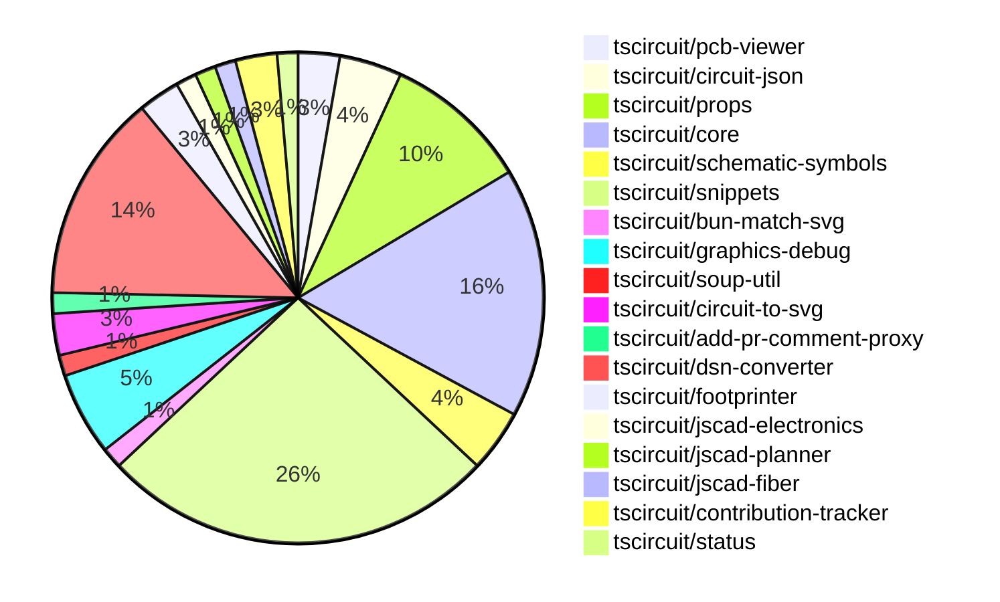

# Contribution Overview 2024-11-20

## PRs by Repository

## Contributor Overview

| Contributor | 🐳 Major | 🐙 Minor | 🐌 Tiny | ⭐ |
|-------------|-------|-------|-------|-------|
| [ShiboSoftwareDev](#ShiboSoftwareDev) | 3 | 11 | 0 | ⭐⭐⭐ |
| [imrishabh18](#imrishabh18) | 3 | 11 | 0 | ⭐⭐⭐ |
| [seveibar](#seveibar) | 4 | 7 | 1 | ⭐⭐⭐ |
| [anas-sarkez](#anas-sarkez) | 2 | 8 | 0 | ⭐⭐ |
| [Abse2001](#Abse2001) | 0 | 10 | 0 | ⭐⭐ |
| [RohittCodes](#RohittCodes) | 0 | 5 | 0 | ⭐ |
| [mrudulpatil18](#mrudulpatil18) | 0 | 3 | 0 | ⭐ |
| [Anshgrover23](#Anshgrover23) | 0 | 2 | 0 | ⭐ |
| [kom-senapati](#kom-senapati) | 1 | 0 | 0 | ⭐ |
| [hunxjunedo](#hunxjunedo) | 0 | 1 | 0 |  |

## Review Table

| Contributor | Reviews Received | Approvals | Rejections | Changes Requested | PRs Opened | PRs Closed | Issues Created |
|-------------|------------------|-----------|------------|-------------------|------------|------------|----------------|n| [Abse2001](https://github.com/Abse2001) | 11 | 9 | 6 | 1 | 11 | 10 | undefined |
| [ShiboSoftwareDev](https://github.com/ShiboSoftwareDev) | 21 | 15 | 13 | 2 | 23 | 21 | undefined |
| [seveibar](https://github.com/seveibar) | 0 | 0 | 0 | 0 | 13 | 12 | undefined |
| [imrishabh18](https://github.com/imrishabh18) | 9 | 4 | 4 | 2 | 17 | 15 | undefined |
| [anas-sarkez](https://github.com/anas-sarkez) | 30 | 11 | 5 | 4 | 11 | 10 | undefined |
| [Anshgrover23](https://github.com/Anshgrover23) | 2 | 1 | 0 | 1 | 3 | 3 | undefined |
| [mrudulpatil18](https://github.com/mrudulpatil18) | 5 | 4 | 0 | 1 | 4 | 3 | undefined |
| [kom-senapati](https://github.com/kom-senapati) | 2 | 1 | 0 | 1 | 1 | 1 | undefined |
| [melmathari](https://github.com/melmathari) | 8 | 1 | 3 | 2 | 5 | 4 | undefined |
| [hunxjunedo](https://github.com/hunxjunedo) | 2 | 1 | 1 | 0 | 1 | 1 | undefined |
| [RohittCodes](https://github.com/RohittCodes) | 45 | 6 | 2 | 7 | 8 | 6 | undefined |
| [vishwamartur](https://github.com/vishwamartur) | 1 | 0 | 1 | 1 | 1 | 1 | undefined |

## Changes by Repository

### [tscircuit/pcb-viewer](https://github.com/tscircuit/pcb-viewer)

| PR # | Impact | Contributor | Description |
|------|--------|-------------|-------------|
| [#83](https://github.com/tscircuit/pcb-viewer/pull/83) | 🐙 Minor | Abse2001 | Fixed a type error by adding non-null assertion operators to handle potential undefined values. |
| [#82](https://github.com/tscircuit/pcb-viewer/pull/82) | 🐙 Minor | ShiboSoftwareDev | Adds a biome format script to the project. |

### [tscircuit/circuit-json](https://github.com/tscircuit/circuit-json)

| PR # | Impact | Contributor | Description |
|------|--------|-------------|-------------|
| [#84](https://github.com/tscircuit/circuit-json/pull/84) | 🐙 Minor | Abse2001 | Added the `optional` modifier to the `gender` field in the `source_simple_pin_header` schema. |
| [#83](https://github.com/tscircuit/circuit-json/pull/83) | 🐙 Minor | Abse2001 | Implemented a new source component type called "source_simple_pin_header" in the project. |
| [#82](https://github.com/tscircuit/circuit-json/pull/82) | 🐙 Minor | ShiboSoftwareDev | Adds a new "rotated_rect" shape to the PCB SMT pad definition. |

### [tscircuit/props](https://github.com/tscircuit/props)

| PR # | Impact | Contributor | Description |
|------|--------|-------------|-------------|
| [#103](https://github.com/tscircuit/props/pull/103) | 🐳 Major | seveibar | Adds an `autorouter` property to the `SubcircuitGroupProps` interface, which can be either an `AutorouterConfig` object or one of the strings "auto", "auto-local", or "auto-cloud". |
| [#108](https://github.com/tscircuit/props/pull/108) | 🐙 Minor | Abse2001 | Sets the default gender for the pin header component to "male". |
| [#104](https://github.com/tscircuit/props/pull/104) | 🐙 Minor | ShiboSoftwareDev | Adds support for rotated rectangular SMT pads in the PCB layout component. |
| [#105](https://github.com/tscircuit/props/pull/105) | 🐙 Minor | seveibar | Add "sequential-trace" and "subcircuit" autorouter presets |
| [#106](https://github.com/tscircuit/props/pull/106) | 🐙 Minor | imrishabh18 | Adds export for the "crystal" component and fixes the npm publish lock file issue. |
| [#102](https://github.com/tscircuit/props/pull/102) | 🐙 Minor | imrishabh18 | Exports the `PcbRouteCache` interface. |
| [#101](https://github.com/tscircuit/props/pull/101) | 🐙 Minor | imrishabh18 | Add `pcbRouteCache` to `SubcircuitGroupProps` interface. |

### [tscircuit/core](https://github.com/tscircuit/core)

| PR # | Impact | Contributor | Description |
|------|--------|-------------|-------------|
| [#336](https://github.com/tscircuit/core/pull/336) | 🐳 Major | seveibar | This pull request changes the default format for async autorouting from SimpleRouteJson to Circuit JSON, and includes fixes and testing for the async autorouter to enable production usage. |
| [#351](https://github.com/tscircuit/core/pull/351) | 🐙 Minor | Abse2001 | Added `pin_count` and `gender` properties to the `<pinheader />` component. |
| [#342](https://github.com/tscircuit/core/pull/342) | 🐙 Minor | Abse2001 | Fixed manufacturer Part Number should go below refdes for four-sided pin layouts, handled three pin layouts, and added tests for it. |
| [#339](https://github.com/tscircuit/core/pull/339) | 🐙 Minor | Abse2001 | Implemented the `getInheritedProperty` method on the `PrimitiveComponent` class to allow retrieving inherited properties. |
| [#357](https://github.com/tscircuit/core/pull/357) | 🐙 Minor | seveibar | Add a function to get the client origin and use it to add a cachebust parameter to the model URLs to avoid CORS issues. |
| [#349](https://github.com/tscircuit/core/pull/349) | 🐙 Minor | imrishabh18 | Adds the "Crystal" component to the library. |
| [#350](https://github.com/tscircuit/core/pull/350) | 🐙 Minor | imrishabh18 | Add "circuit-to-svg" as a dev dependency to reduce bundle size |
| [#333](https://github.com/tscircuit/core/pull/333) | 🟣 | imrishabh18 | Adds caching for the PCB trace routing to improve re-rendering performance. |
| [#358](https://github.com/tscircuit/core/pull/358) | 🐙 Minor | anas-sarkez | Updated the footprinter dependency to the newest version |
| [#352](https://github.com/tscircuit/core/pull/352) | 🐙 Minor | anas-sarkez | Implemented `getCurrentRenderPhase` and `getRenderGraph` methods for debugging |
| [#338](https://github.com/tscircuit/core/pull/338) | 🐙 Minor | anas-sarkez | Added support for tracing obstacles around schematic_box components |
| [#363](https://github.com/tscircuit/core/pull/363) | 🐙 Minor | Anshgrover23 | Updates the GitHub Actions workflow to use `pull_request_target` instead of `pull_request` to fix an issue where the bundle-size.yml file doesn't run on pull requests from forks. |

### [tscircuit/schematic-symbols](https://github.com/tscircuit/schematic-symbols)

| PR # | Impact | Contributor | Description |
|------|--------|-------------|-------------|
| [#215](https://github.com/tscircuit/schematic-symbols/pull/215) | 🐙 Minor | Abse2001 | Improved the normally open and closed push buttons symbols |
| [#212](https://github.com/tscircuit/schematic-symbols/pull/212) | 🐙 Minor | Abse2001 | Creates an `approximateBezier` function to improve 'C' case handling and adds a new symbol `capacitor_polarised`. |
| [#211](https://github.com/tscircuit/schematic-symbols/pull/211) | 🐙 Minor | hunxjunedo | Fixes the symbol positions for SPST switch, constant current diode, and darlington pair transistor. |

### [tscircuit/snippets](https://github.com/tscircuit/snippets)

| PR # | Impact | Contributor | Description |
|------|--------|-------------|-------------|
| [#291](https://github.com/tscircuit/snippets/pull/291) | 🐳 Major | ShiboSoftwareDev | Adds a GitHub Actions workflow to generate a bundle size report for pull requests. |
| [#252](https://github.com/tscircuit/snippets/pull/252) | 🐳 Major | seveibar | Reverts a previous change that caused a regression where every snippet has red underlines until it is modified. |
| [#280](https://github.com/tscircuit/snippets/pull/280) | 🐙 Minor | Abse2001 | Implement Capacitor BOM Search functionality in the jlc-parts-engine. |
| [#282](https://github.com/tscircuit/snippets/pull/282) | 🐙 Minor | ShiboSoftwareDev | Implemented pin header BOM (Bill of Materials) support in the `jlc-parts-engine.ts` file. |
| [#277](https://github.com/tscircuit/snippets/pull/277) | 🐙 Minor | ShiboSoftwareDev | Adds a new ErrorFallback component to display error messages in the 3D viewer. |
| [#267](https://github.com/tscircuit/snippets/pull/267) | 🐙 Minor | ShiboSoftwareDev | Adds a spinner to the run button when the code is running |
| [#257](https://github.com/tscircuit/snippets/pull/257) | 🐙 Minor | ShiboSoftwareDev | Improves the user experience for inserting footprints in the code editor by adding a dropdown menu in the insert button and enhancing the footprint parameter editing functionality. |
| [#264](https://github.com/tscircuit/snippets/pull/264) | 🐙 Minor | seveibar | Improves the keying mechanism for the circuit JSON to ensure better uniqueness |
| [#263](https://github.com/tscircuit/snippets/pull/263) | 🐙 Minor | seveibar | Update the `@tscircuit/core` dependency to version `0.0.193`, enabling cloud autorouting. |
| [#242](https://github.com/tscircuit/snippets/pull/242) | 🐙 Minor | seveibar | Redirect the /playground path to the /editor?template=blank-circuit-board URL. |
| [#254](https://github.com/tscircuit/snippets/pull/254) | 🐙 Minor | seveibar | Add a GitHub link and star badge to the landing page |
| [#287](https://github.com/tscircuit/snippets/pull/287) | 🐙 Minor | anas-sarkez | Fixed responsiveness issue in the EditorNav component |
| [#245](https://github.com/tscircuit/snippets/pull/245) | 🐙 Minor | RohittCodes | Removes the deletion of the "template" search parameter from the URL to make it persist during navigation. |
| [#202](https://github.com/tscircuit/snippets/pull/202) | 🐙 Minor | RohittCodes | Introduces a feature to remove the star from snippets. |
| [#270](https://github.com/tscircuit/snippets/pull/270) | 🐙 Minor | RohittCodes | Fixes the exact cursor position in the code editor without reflecting the code and its types. |
| [#268](https://github.com/tscircuit/snippets/pull/268) | 🐙 Minor | RohittCodes | Initialize `manualEditsFileContent` with the `manual_edits_json` when the page loads. |
| [#248](https://github.com/tscircuit/snippets/pull/248) | 🐙 Minor | RohittCodes | Introduces a new field `manual_edits_json` in the `snippets` schema and updates the `update` and `create` API endpoints to handle this new field. |
| [#236](https://github.com/tscircuit/snippets/pull/236) | 🐙 Minor | mrudulpatil18 | Update the iframe embedding link for code snippets to use the `/preview` endpoint. |
| [#258](https://github.com/tscircuit/snippets/pull/258) | 🐌 Tiny | seveibar | Skips parts engine test on CI |

### [tscircuit/bun-match-svg](https://github.com/tscircuit/bun-match-svg)

| PR # | Impact | Contributor | Description |
|------|--------|-------------|-------------|
| [#4](https://github.com/tscircuit/bun-match-svg/pull/4) | 🐳 Major | ShiboSoftwareDev | Implemented a CLI tool that initializes the project in other repositories. |

### [tscircuit/graphics-debug](https://github.com/tscircuit/graphics-debug)

| PR # | Impact | Contributor | Description |
|------|--------|-------------|-------------|
| [#10](https://github.com/tscircuit/graphics-debug/pull/10) | 🐳 Major | ShiboSoftwareDev | Introduce a table that lists all graphics objects and highlights the corresponding objects in the SVG when hovering over table entries. |
| [#9](https://github.com/tscircuit/graphics-debug/pull/9) | 🐙 Minor | ShiboSoftwareDev | Adds error handling when parsing graphics input fails and displays the error message to the user. |
| [#8](https://github.com/tscircuit/graphics-debug/pull/8) | 🐙 Minor | mrudulpatil18 | Fixes an issue with the handling of CDATA from SVGs when using `dangerouslySetInnerHTML` on the website. |
| [#7](https://github.com/tscircuit/graphics-debug/pull/7) | 🐙 Minor | mrudulpatil18 | Added a "See Example" button to load sample graphics in the input element for visualization |

### [tscircuit/soup-util](https://github.com/tscircuit/soup-util)

| PR # | Impact | Contributor | Description |
|------|--------|-------------|-------------|
| [#25](https://github.com/tscircuit/soup-util/pull/25) | 🐙 Minor | ShiboSoftwareDev | Updated the `circuit-json` dependency to version `0.0.106`. |

### [tscircuit/circuit-to-svg](https://github.com/tscircuit/circuit-to-svg)

| PR # | Impact | Contributor | Description |
|------|--------|-------------|-------------|
| [#137](https://github.com/tscircuit/circuit-to-svg/pull/137) | 🐙 Minor | ShiboSoftwareDev | Rotate rectangles representing SMT pads in the PCB layout counter-clockwise instead of clockwise. |
| [#136](https://github.com/tscircuit/circuit-to-svg/pull/136) | 🐙 Minor | ShiboSoftwareDev | Added support for rendering rotated rectangular SMT pads in the SVG output. |

### [tscircuit/add-pr-comment-proxy](https://github.com/tscircuit/add-pr-comment-proxy)

| PR # | Impact | Contributor | Description |
|------|--------|-------------|-------------|
| [#6](https://github.com/tscircuit/add-pr-comment-proxy/pull/6) | 🐳 Major | seveibar | Ports the project to the Vercel platform. |

### [tscircuit/dsn-converter](https://github.com/tscircuit/dsn-converter)

| PR # | Impact | Contributor | Description |
|------|--------|-------------|-------------|
| [#32](https://github.com/tscircuit/dsn-converter/pull/32) | 🐳 Major | imrishabh18 | Fix conversion of `pcb_trace` and `source_net` to a network of `dsn` |
| [#31](https://github.com/tscircuit/dsn-converter/pull/31) | 🐳 Major | imrishabh18 | Convert simple_chip circuit elements to DSN format |
| [#29](https://github.com/tscircuit/dsn-converter/pull/29) | 🐳 Major | imrishabh18 | Refactors the way components and pads are processed and grouped in the circuit-json-to-dsn-json conversion process. |
| [#26](https://github.com/tscircuit/dsn-converter/pull/26) | 🐙 Minor | seveibar | Adjusts the scale factor for converting DSN session data to Circuit JSON from 1/1000 to 1/10000. |
| [#35](https://github.com/tscircuit/dsn-converter/pull/35) | 🐙 Minor | imrishabh18 | Fixes the trace ID generation to ensure that each trace has a unique and predictable ID. |
| [#34](https://github.com/tscircuit/dsn-converter/pull/34) | 🐙 Minor | imrishabh18 | Add a GitHub Actions workflow to automatically format code using the `@biomejs/biome` library. |
| [#33](https://github.com/tscircuit/dsn-converter/pull/33) | 🐙 Minor | imrishabh18 | Adds a test to check the motor driver DSN format and fixes the parseDsnJson function for conversion. |
| [#30](https://github.com/tscircuit/dsn-converter/pull/30) | 🐙 Minor | imrishabh18 | The pull request groups the plated holes for the components together and adds images only once, similar to the KiCad format. |
| [#28](https://github.com/tscircuit/dsn-converter/pull/28) | 🐙 Minor | imrishabh18 | Fix plated hole DSN file format and net |
| [#27](https://github.com/tscircuit/dsn-converter/pull/27) | 🐙 Minor | imrishabh18 | Fixes a scaling issue in the session by adjusting the conversion factor for traces. |

### [tscircuit/footprinter](https://github.com/tscircuit/footprinter)

| PR # | Impact | Contributor | Description |
|------|--------|-------------|-------------|
| [#86](https://github.com/tscircuit/footprinter/pull/86) | 🐳 Major | anas-sarkez | Refactor Stampboard and Stampreceiver functions to have separate pins for each SMD pad and hole. |
| [#83](https://github.com/tscircuit/footprinter/pull/83) | 🐙 Minor | anas-sarkez | Refactor all footprinter functions by updating their scheme, such that all footprints now have a default value of num_pins. |

### [tscircuit/jscad-electronics](https://github.com/tscircuit/jscad-electronics)

| PR # | Impact | Contributor | Description |
|------|--------|-------------|-------------|
| [#81](https://github.com/tscircuit/jscad-electronics/pull/81) | 🐳 Major | anas-sarkez | Implemented the `SOT235` (SOT-23-5) 3D component and added an example for Footprinter3d. |

### [tscircuit/jscad-planner](https://github.com/tscircuit/jscad-planner)

| PR # | Impact | Contributor | Description |
|------|--------|-------------|-------------|
| [#4](https://github.com/tscircuit/jscad-planner/pull/4) | 🐙 Minor | anas-sarkez | Added hull and hullChain operations with their types and tests |

### [tscircuit/jscad-fiber](https://github.com/tscircuit/jscad-fiber)

| PR # | Impact | Contributor | Description |
|------|--------|-------------|-------------|
| [#91](https://github.com/tscircuit/jscad-fiber/pull/91) | 🐙 Minor | anas-sarkez | Add ExampleWrapper component with code toggle functionality |

### [tscircuit/contribution-tracker](https://github.com/tscircuit/contribution-tracker)

| PR # | Impact | Contributor | Description |
|------|--------|-------------|-------------|
| [#6](https://github.com/tscircuit/contribution-tracker/pull/6) | 🐳 Major | kom-senapati | Adds a review table to the contribution overview, displaying various metrics about contributors, such as reviews received, approvals, rejections, changes requested, PRs opened, and PRs closed. |
| [#8](https://github.com/tscircuit/contribution-tracker/pull/8) | 🐙 Minor | anas-sarkez | Adds a new column "Issues Created" to the Reviews Table in the pull request. |

### [tscircuit/status](https://github.com/tscircuit/status)

| PR # | Impact | Contributor | Description |
|------|--------|-------------|-------------|
| [#3](https://github.com/tscircuit/status/pull/3) | 🐙 Minor | Anshgrover23 | Fix issue where bars were getting cut off in the display |

## Changes by Contributor

### [Abse2001](https://github.com/Abse2001)

| PR # | Impact | Description |
|------|--------|-------------|
| [#83](https://github.com/tscircuit/pcb-viewer/pull/83) | 🐙 Minor | Fixed a type error by adding non-null assertion operators to handle potential undefined values. |
| [#84](https://github.com/tscircuit/circuit-json/pull/84) | 🐙 Minor | Added the `optional` modifier to the `gender` field in the `source_simple_pin_header` schema. |
| [#83](https://github.com/tscircuit/circuit-json/pull/83) | 🐙 Minor | Implemented a new source component type called "source_simple_pin_header" in the project. |
| [#108](https://github.com/tscircuit/props/pull/108) | 🐙 Minor | Sets the default gender for the pin header component to "male". |
| [#351](https://github.com/tscircuit/core/pull/351) | 🐙 Minor | Added `pin_count` and `gender` properties to the `<pinheader />` component. |
| [#342](https://github.com/tscircuit/core/pull/342) | 🐙 Minor | Fixed manufacturer Part Number should go below refdes for four-sided pin layouts, handled three pin layouts, and added tests for it. |
| [#339](https://github.com/tscircuit/core/pull/339) | 🐙 Minor | Implemented the `getInheritedProperty` method on the `PrimitiveComponent` class to allow retrieving inherited properties. |
| [#215](https://github.com/tscircuit/schematic-symbols/pull/215) | 🐙 Minor | Improved the normally open and closed push buttons symbols |
| [#212](https://github.com/tscircuit/schematic-symbols/pull/212) | 🐙 Minor | Creates an `approximateBezier` function to improve 'C' case handling and adds a new symbol `capacitor_polarised`. |
| [#280](https://github.com/tscircuit/snippets/pull/280) | 🐙 Minor | Implement Capacitor BOM Search functionality in the jlc-parts-engine. |

### [ShiboSoftwareDev](https://github.com/ShiboSoftwareDev)

| PR # | Impact | Description |
|------|--------|-------------|
| [#4](https://github.com/tscircuit/bun-match-svg/pull/4) | 🐳 Major | Implemented a CLI tool that initializes the project in other repositories. |
| [#291](https://github.com/tscircuit/snippets/pull/291) | 🐳 Major | Adds a GitHub Actions workflow to generate a bundle size report for pull requests. |
| [#10](https://github.com/tscircuit/graphics-debug/pull/10) | 🐳 Major | Introduce a table that lists all graphics objects and highlights the corresponding objects in the SVG when hovering over table entries. |
| [#82](https://github.com/tscircuit/pcb-viewer/pull/82) | 🐙 Minor | Adds a biome format script to the project. |
| [#82](https://github.com/tscircuit/circuit-json/pull/82) | 🐙 Minor | Adds a new "rotated_rect" shape to the PCB SMT pad definition. |
| [#25](https://github.com/tscircuit/soup-util/pull/25) | 🐙 Minor | Updated the `circuit-json` dependency to version `0.0.106`. |
| [#104](https://github.com/tscircuit/props/pull/104) | 🐙 Minor | Adds support for rotated rectangular SMT pads in the PCB layout component. |
| [#137](https://github.com/tscircuit/circuit-to-svg/pull/137) | 🐙 Minor | Rotate rectangles representing SMT pads in the PCB layout counter-clockwise instead of clockwise. |
| [#136](https://github.com/tscircuit/circuit-to-svg/pull/136) | 🐙 Minor | Added support for rendering rotated rectangular SMT pads in the SVG output. |
| [#282](https://github.com/tscircuit/snippets/pull/282) | 🐙 Minor | Implemented pin header BOM (Bill of Materials) support in the `jlc-parts-engine.ts` file. |
| [#277](https://github.com/tscircuit/snippets/pull/277) | 🐙 Minor | Adds a new ErrorFallback component to display error messages in the 3D viewer. |
| [#267](https://github.com/tscircuit/snippets/pull/267) | 🐙 Minor | Adds a spinner to the run button when the code is running |
| [#257](https://github.com/tscircuit/snippets/pull/257) | 🐙 Minor | Improves the user experience for inserting footprints in the code editor by adding a dropdown menu in the insert button and enhancing the footprint parameter editing functionality. |
| [#9](https://github.com/tscircuit/graphics-debug/pull/9) | 🐙 Minor | Adds error handling when parsing graphics input fails and displays the error message to the user. |

### [seveibar](https://github.com/seveibar)

| PR # | Impact | Description |
|------|--------|-------------|
| [#103](https://github.com/tscircuit/props/pull/103) | 🐳 Major | Adds an `autorouter` property to the `SubcircuitGroupProps` interface, which can be either an `AutorouterConfig` object or one of the strings "auto", "auto-local", or "auto-cloud". |
| [#336](https://github.com/tscircuit/core/pull/336) | 🐳 Major | This pull request changes the default format for async autorouting from SimpleRouteJson to Circuit JSON, and includes fixes and testing for the async autorouter to enable production usage. |
| [#252](https://github.com/tscircuit/snippets/pull/252) | 🐳 Major | Reverts a previous change that caused a regression where every snippet has red underlines until it is modified. |
| [#6](https://github.com/tscircuit/add-pr-comment-proxy/pull/6) | 🐳 Major | Ports the project to the Vercel platform. |
| [#105](https://github.com/tscircuit/props/pull/105) | 🐙 Minor | Add "sequential-trace" and "subcircuit" autorouter presets |
| [#357](https://github.com/tscircuit/core/pull/357) | 🐙 Minor | Add a function to get the client origin and use it to add a cachebust parameter to the model URLs to avoid CORS issues. |
| [#26](https://github.com/tscircuit/dsn-converter/pull/26) | 🐙 Minor | Adjusts the scale factor for converting DSN session data to Circuit JSON from 1/1000 to 1/10000. |
| [#264](https://github.com/tscircuit/snippets/pull/264) | 🐙 Minor | Improves the keying mechanism for the circuit JSON to ensure better uniqueness |
| [#263](https://github.com/tscircuit/snippets/pull/263) | 🐙 Minor | Update the `@tscircuit/core` dependency to version `0.0.193`, enabling cloud autorouting. |
| [#242](https://github.com/tscircuit/snippets/pull/242) | 🐙 Minor | Redirect the /playground path to the /editor?template=blank-circuit-board URL. |
| [#254](https://github.com/tscircuit/snippets/pull/254) | 🐙 Minor | Add a GitHub link and star badge to the landing page |
| [#258](https://github.com/tscircuit/snippets/pull/258) | 🐌 Tiny | Skips parts engine test on CI |

### [imrishabh18](https://github.com/imrishabh18)

| PR # | Impact | Description |
|------|--------|-------------|
| [#32](https://github.com/tscircuit/dsn-converter/pull/32) | 🐳 Major | Fix conversion of `pcb_trace` and `source_net` to a network of `dsn` |
| [#31](https://github.com/tscircuit/dsn-converter/pull/31) | 🐳 Major | Convert simple_chip circuit elements to DSN format |
| [#29](https://github.com/tscircuit/dsn-converter/pull/29) | 🐳 Major | Refactors the way components and pads are processed and grouped in the circuit-json-to-dsn-json conversion process. |
| [#106](https://github.com/tscircuit/props/pull/106) | 🐙 Minor | Adds export for the "crystal" component and fixes the npm publish lock file issue. |
| [#102](https://github.com/tscircuit/props/pull/102) | 🐙 Minor | Exports the `PcbRouteCache` interface. |
| [#101](https://github.com/tscircuit/props/pull/101) | 🐙 Minor | Add `pcbRouteCache` to `SubcircuitGroupProps` interface. |
| [#349](https://github.com/tscircuit/core/pull/349) | 🐙 Minor | Adds the "Crystal" component to the library. |
| [#350](https://github.com/tscircuit/core/pull/350) | 🐙 Minor | Add "circuit-to-svg" as a dev dependency to reduce bundle size |
| [#333](https://github.com/tscircuit/core/pull/333) | 🟣 | Adds caching for the PCB trace routing to improve re-rendering performance. |
| [#35](https://github.com/tscircuit/dsn-converter/pull/35) | 🐙 Minor | Fixes the trace ID generation to ensure that each trace has a unique and predictable ID. |
| [#34](https://github.com/tscircuit/dsn-converter/pull/34) | 🐙 Minor | Add a GitHub Actions workflow to automatically format code using the `@biomejs/biome` library. |
| [#33](https://github.com/tscircuit/dsn-converter/pull/33) | 🐙 Minor | Adds a test to check the motor driver DSN format and fixes the parseDsnJson function for conversion. |
| [#30](https://github.com/tscircuit/dsn-converter/pull/30) | 🐙 Minor | The pull request groups the plated holes for the components together and adds images only once, similar to the KiCad format. |
| [#28](https://github.com/tscircuit/dsn-converter/pull/28) | 🐙 Minor | Fix plated hole DSN file format and net |
| [#27](https://github.com/tscircuit/dsn-converter/pull/27) | 🐙 Minor | Fixes a scaling issue in the session by adjusting the conversion factor for traces. |

### [anas-sarkez](https://github.com/anas-sarkez)

| PR # | Impact | Description |
|------|--------|-------------|
| [#86](https://github.com/tscircuit/footprinter/pull/86) | 🐳 Major | Refactor Stampboard and Stampreceiver functions to have separate pins for each SMD pad and hole. |
| [#81](https://github.com/tscircuit/jscad-electronics/pull/81) | 🐳 Major | Implemented the `SOT235` (SOT-23-5) 3D component and added an example for Footprinter3d. |
| [#83](https://github.com/tscircuit/footprinter/pull/83) | 🐙 Minor | Refactor all footprinter functions by updating their scheme, such that all footprints now have a default value of num_pins. |
| [#4](https://github.com/tscircuit/jscad-planner/pull/4) | 🐙 Minor | Added hull and hullChain operations with their types and tests |
| [#358](https://github.com/tscircuit/core/pull/358) | 🐙 Minor | Updated the footprinter dependency to the newest version |
| [#352](https://github.com/tscircuit/core/pull/352) | 🐙 Minor | Implemented `getCurrentRenderPhase` and `getRenderGraph` methods for debugging |
| [#338](https://github.com/tscircuit/core/pull/338) | 🐙 Minor | Added support for tracing obstacles around schematic_box components |
| [#91](https://github.com/tscircuit/jscad-fiber/pull/91) | 🐙 Minor | Add ExampleWrapper component with code toggle functionality |
| [#8](https://github.com/tscircuit/contribution-tracker/pull/8) | 🐙 Minor | Adds a new column "Issues Created" to the Reviews Table in the pull request. |
| [#287](https://github.com/tscircuit/snippets/pull/287) | 🐙 Minor | Fixed responsiveness issue in the EditorNav component |

### [Anshgrover23](https://github.com/Anshgrover23)

| PR # | Impact | Description |
|------|--------|-------------|
| [#363](https://github.com/tscircuit/core/pull/363) | 🐙 Minor | Updates the GitHub Actions workflow to use `pull_request_target` instead of `pull_request` to fix an issue where the bundle-size.yml file doesn't run on pull requests from forks. |
| [#3](https://github.com/tscircuit/status/pull/3) | 🐙 Minor | Fix issue where bars were getting cut off in the display |

### [kom-senapati](https://github.com/kom-senapati)

| PR # | Impact | Description |
|------|--------|-------------|
| [#6](https://github.com/tscircuit/contribution-tracker/pull/6) | 🐳 Major | Adds a review table to the contribution overview, displaying various metrics about contributors, such as reviews received, approvals, rejections, changes requested, PRs opened, and PRs closed. |

### [hunxjunedo](https://github.com/hunxjunedo)

| PR # | Impact | Description |
|------|--------|-------------|
| [#211](https://github.com/tscircuit/schematic-symbols/pull/211) | 🐙 Minor | Fixes the symbol positions for SPST switch, constant current diode, and darlington pair transistor. |

### [RohittCodes](https://github.com/RohittCodes)

| PR # | Impact | Description |
|------|--------|-------------|
| [#245](https://github.com/tscircuit/snippets/pull/245) | 🐙 Minor | Removes the deletion of the "template" search parameter from the URL to make it persist during navigation. |
| [#202](https://github.com/tscircuit/snippets/pull/202) | 🐙 Minor | Introduces a feature to remove the star from snippets. |
| [#270](https://github.com/tscircuit/snippets/pull/270) | 🐙 Minor | Fixes the exact cursor position in the code editor without reflecting the code and its types. |
| [#268](https://github.com/tscircuit/snippets/pull/268) | 🐙 Minor | Initialize `manualEditsFileContent` with the `manual_edits_json` when the page loads. |
| [#248](https://github.com/tscircuit/snippets/pull/248) | 🐙 Minor | Introduces a new field `manual_edits_json` in the `snippets` schema and updates the `update` and `create` API endpoints to handle this new field. |

### [mrudulpatil18](https://github.com/mrudulpatil18)

| PR # | Impact | Description |
|------|--------|-------------|
| [#236](https://github.com/tscircuit/snippets/pull/236) | 🐙 Minor | Update the iframe embedding link for code snippets to use the `/preview` endpoint. |
| [#8](https://github.com/tscircuit/graphics-debug/pull/8) | 🐙 Minor | Fixes an issue with the handling of CDATA from SVGs when using `dangerouslySetInnerHTML` on the website. |
| [#7](https://github.com/tscircuit/graphics-debug/pull/7) | 🐙 Minor | Added a "See Example" button to load sample graphics in the input element for visualization |

