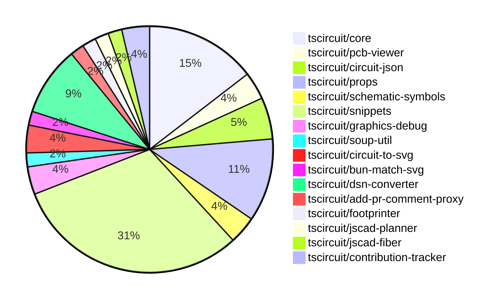

# Contribution Overview 2024-11-20

## PRs by Repository

## Contributor Overview

| Contributor | 🐳 Major | 🐙 Minor | 🐌 Tiny | ⭐ |
|-------------|-------|-------|-------|-------|
| [ShiboSoftwareDev](#ShiboSoftwareDev) | 2 | 11 | 0 | ⭐⭐ |
| [imrishabh18](#imrishabh18) | 2 | 8 | 0 | ⭐⭐ |
| [seveibar](#seveibar) | 2 | 6 | 2 | ⭐⭐ |
| [Abse2001](#Abse2001) | 1 | 8 | 0 | ⭐⭐ |
| [anas-sarkez](#anas-sarkez) | 0 | 5 | 0 | ⭐ |
| [RohittCodes](#RohittCodes) | 0 | 5 | 0 | ⭐ |
| [kom-senapati](#kom-senapati) | 1 | 0 | 0 | ⭐ |
| [hunxjunedo](#hunxjunedo) | 0 | 1 | 0 |  |
| [mrudulpatil18](#mrudulpatil18) | 0 | 1 | 0 |  |

## Review Table

| Contributor | Reviews Received | Approvals | Rejections | Changes Requested | PRs Opened | PRs Closed | Issues Created |
|-------------|------------------|-----------|------------|-------------------|------------|------------|----------------|n| [Abse2001](https://github.com/Abse2001) | 10 | 8 | 4 | 1 | 9 | 9 | undefined |
| [ShiboSoftwareDev](https://github.com/ShiboSoftwareDev) | 18 | 12 | 11 | 2 | 18 | 16 | undefined |
| [imrishabh18](https://github.com/imrishabh18) | 9 | 4 | 2 | 2 | 12 | 10 | undefined |
| [seveibar](https://github.com/seveibar) | 0 | 0 | 0 | 0 | 12 | 10 | undefined |
| [anas-sarkez](https://github.com/anas-sarkez) | 21 | 6 | 3 | 3 | 7 | 5 | undefined |
| [kom-senapati](https://github.com/kom-senapati) | 2 | 1 | 0 | 1 | 1 | 1 | undefined |
| [melmathari](https://github.com/melmathari) | 8 | 1 | 3 | 2 | 5 | 4 | undefined |
| [hunxjunedo](https://github.com/hunxjunedo) | 2 | 1 | 1 | 0 | 1 | 1 | undefined |
| [RohittCodes](https://github.com/RohittCodes) | 45 | 6 | 2 | 7 | 8 | 5 | undefined |
| [mrudulpatil18](https://github.com/mrudulpatil18) | 4 | 4 | 0 | 0 | 3 | 1 | undefined |

## Changes by Repository

### [tscircuit/core](https://github.com/tscircuit/core)

| PR # | Impact | Contributor | Description |
|------|--------|-------------|-------------|
| [#342](https://github.com/tscircuit/core/pull/342) | 🐳 Major | Abse2001 | Fixed manufacturer Part Number display position for four-sided pin layouts, handled three-pin layouts, and added tests. |
| [#336](https://github.com/tscircuit/core/pull/336) | 🐳 Major | seveibar | Changes the default format for async autorouting from SimpleRouteJson to CircuitJson, and includes fixes and testing for using the autorouter in production. |
| [#351](https://github.com/tscircuit/core/pull/351) | 🐙 Minor | Abse2001 | Added `pin_count` and `gender` properties to the `<pinheader />` component. |
| [#339](https://github.com/tscircuit/core/pull/339) | 🐙 Minor | Abse2001 | Implemented the `getInheritedProperty` method on the `PrimitiveComponent` class to retrieve inherited property values from the component hierarchy. |
| [#349](https://github.com/tscircuit/core/pull/349) | 🐙 Minor | imrishabh18 | Add a new component "Crystal" to the library |
| [#350](https://github.com/tscircuit/core/pull/350) | 🐙 Minor | imrishabh18 | Add `circuit-to-svg` as a dev dependency to reduce bundle size |
| [#333](https://github.com/tscircuit/core/pull/333) | 🐙 Minor | imrishabh18 | Adds caching of the PCB trace route to improve rendering performance. |
| [#338](https://github.com/tscircuit/core/pull/338) | 🐙 Minor | anas-sarkez | Added support for tracing obstacles from schematic_box elements |

### [tscircuit/pcb-viewer](https://github.com/tscircuit/pcb-viewer)

| PR # | Impact | Contributor | Description |
|------|--------|-------------|-------------|
| [#83](https://github.com/tscircuit/pcb-viewer/pull/83) | 🐙 Minor | Abse2001 | Fixed a type error by adding a non-null assertion operator to a variable that may be undefined. |
| [#82](https://github.com/tscircuit/pcb-viewer/pull/82) | 🐙 Minor | ShiboSoftwareDev | Added a biome format script to the project. |

### [tscircuit/circuit-json](https://github.com/tscircuit/circuit-json)

| PR # | Impact | Contributor | Description |
|------|--------|-------------|-------------|
| [#84](https://github.com/tscircuit/circuit-json/pull/84) | 🐙 Minor | Abse2001 | Added an optional `gender` field to the `source_simple_pin_header` type. |
| [#83](https://github.com/tscircuit/circuit-json/pull/83) | 🐙 Minor | Abse2001 | Implemented a new source component called "source_simple_pin_header" |
| [#82](https://github.com/tscircuit/circuit-json/pull/82) | 🐙 Minor | ShiboSoftwareDev | Introduces a new shape type "rotated_rect" for SMT pads in the PCB module. |

### [tscircuit/props](https://github.com/tscircuit/props)

| PR # | Impact | Contributor | Description |
|------|--------|-------------|-------------|
| [#104](https://github.com/tscircuit/props/pull/104) | 🐳 Major | ShiboSoftwareDev | Introduces support for rotated rectangular SMT pads in the `smtpad.ts` file. |
| [#108](https://github.com/tscircuit/props/pull/108) | 🐙 Minor | Abse2001 | Sets the default gender of the pin header to "male". |
| [#106](https://github.com/tscircuit/props/pull/106) | 🐙 Minor | imrishabh18 | Adds export for the `crystal` component and fixes a lock file issue for npm publish. |
| [#102](https://github.com/tscircuit/props/pull/102) | 🐙 Minor | imrishabh18 | Exported the `PcbRouteCache` interface to make it available for use. |
| [#101](https://github.com/tscircuit/props/pull/101) | 🐙 Minor | imrishabh18 | Adds a new `pcbRouteCache` property to the `SubcircuitGroupProps` interface. |
| [#103](https://github.com/tscircuit/props/pull/103) | 🐙 Minor | seveibar | Adds an `autorouter` property to the `SubcircuitGroupProps` interface, which can be either an `AutorouterConfig` object or one of the strings "auto", "auto-local", or "auto-cloud". |

### [tscircuit/schematic-symbols](https://github.com/tscircuit/schematic-symbols)

| PR # | Impact | Contributor | Description |
|------|--------|-------------|-------------|
| [#212](https://github.com/tscircuit/schematic-symbols/pull/212) | 🐙 Minor | Abse2001 | Create a new function `approximateBezier` to improve handling of the 'C' case and add a new symbol `capacitor_polarised`. |
| [#211](https://github.com/tscircuit/schematic-symbols/pull/211) | 🐙 Minor | hunxjunedo | Fixes the y-coordinates of various points and text elements in the SPST switch, constant current diode, and Darlington pair transistor symbol definitions. |

### [tscircuit/snippets](https://github.com/tscircuit/snippets)

| PR # | Impact | Contributor | Description |
|------|--------|-------------|-------------|
| [#252](https://github.com/tscircuit/snippets/pull/252) | 🐳 Major | seveibar | Reverts a previous change that caused a regression where every snippet has red underlines until modified. |
| [#280](https://github.com/tscircuit/snippets/pull/280) | 🐙 Minor | Abse2001 | Implement Capacitor BOM Search |
| [#282](https://github.com/tscircuit/snippets/pull/282) | 🐙 Minor | ShiboSoftwareDev | Implemented pin header BOM generation in the JLC Parts Engine. |
| [#277](https://github.com/tscircuit/snippets/pull/277) | 🐙 Minor | ShiboSoftwareDev | Adds 3D error display component and associated Playwright tests. |
| [#267](https://github.com/tscircuit/snippets/pull/267) | 🐙 Minor | ShiboSoftwareDev | Adds a spinner to the run button when the code is running. |
| [#257](https://github.com/tscircuit/snippets/pull/257) | 🐙 Minor | ShiboSoftwareDev | Introduces QoL improvements to the footprint insertion feature, including a dropdown for insert options, improved error handling, and a more intuitive footprint name display. |
| [#263](https://github.com/tscircuit/snippets/pull/263) | 🐙 Minor | seveibar | Update the @tscircuit/core dependency from version 0.0.192 to 0.0.193 |
| [#242](https://github.com/tscircuit/snippets/pull/242) | 🐙 Minor | seveibar | Adds a redirect from `/playground` to `https://tscircuit.com/editor?template=blank-circuit-board` |
| [#254](https://github.com/tscircuit/snippets/pull/254) | 🐙 Minor | seveibar | Add a link to the GitHub repository on the landing page. |
| [#245](https://github.com/tscircuit/snippets/pull/245) | 🐙 Minor | RohittCodes | Removed the deletion of the `template` search parameter from the URL to make it persist during navigation. |
| [#202](https://github.com/tscircuit/snippets/pull/202) | 🐙 Minor | RohittCodes | Adds a route to remove the star from a snippet. |
| [#270](https://github.com/tscircuit/snippets/pull/270) | 🐙 Minor | RohittCodes | Fixes the exact cursor position in the code editor without reflecting the code and its types. |
| [#268](https://github.com/tscircuit/snippets/pull/268) | 🐙 Minor | RohittCodes | Fixes a bug where the `manualEditsFileContent` was not being initialized with the `manual_edit_json` when the page loaded, causing the `hasUnsavedChanges` check to always return true. |
| [#248](https://github.com/tscircuit/snippets/pull/248) | 🐙 Minor | RohittCodes | Adds support for manual edits to the `snippets.manual_edits_json` field in the database schema and the corresponding update function in the API. |
| [#236](https://github.com/tscircuit/snippets/pull/236) | 🐙 Minor | mrudulpatil18 | Update the embed link for snippets to use the `/preview` endpoint instead of the old `embed` endpoint. |
| [#264](https://github.com/tscircuit/snippets/pull/264) | 🐌 Tiny | seveibar | Improved the keying for the circuit JSON by adding a dependency on the length of the circuit JSON. |
| [#258](https://github.com/tscircuit/snippets/pull/258) | 🐌 Tiny | seveibar | Skips the parts engine test on the CI environment. |

### [tscircuit/graphics-debug](https://github.com/tscircuit/graphics-debug)

| PR # | Impact | Contributor | Description |
|------|--------|-------------|-------------|
| [#10](https://github.com/tscircuit/graphics-debug/pull/10) | 🐳 Major | ShiboSoftwareDev | Introduce a table that lists all graphics objects, and highlight the corresponding objects when hovering over table entries. |
| [#9](https://github.com/tscircuit/graphics-debug/pull/9) | 🐙 Minor | ShiboSoftwareDev | Adds error handling to the graphics parsing process and displays the error message if the input cannot be parsed. |

### [tscircuit/soup-util](https://github.com/tscircuit/soup-util)

| PR # | Impact | Contributor | Description |
|------|--------|-------------|-------------|
| [#25](https://github.com/tscircuit/soup-util/pull/25) | 🐙 Minor | ShiboSoftwareDev | Updated the `circuit-json` dependency to version `0.0.106`. |

### [tscircuit/circuit-to-svg](https://github.com/tscircuit/circuit-to-svg)

| PR # | Impact | Contributor | Description |
|------|--------|-------------|-------------|
| [#137](https://github.com/tscircuit/circuit-to-svg/pull/137) | 🐙 Minor | ShiboSoftwareDev | Rotate the SMT pads counter-clockwise instead of clockwise. |
| [#136](https://github.com/tscircuit/circuit-to-svg/pull/136) | 🐙 Minor | ShiboSoftwareDev | Adds support for rendering rotated rectangular SMT pads in the SVG output. |

### [tscircuit/bun-match-svg](https://github.com/tscircuit/bun-match-svg)

| PR # | Impact | Contributor | Description |
|------|--------|-------------|-------------|
| [#4](https://github.com/tscircuit/bun-match-svg/pull/4) | 🐙 Minor | ShiboSoftwareDev | Implemented a CLI tool that initializes this project in other repositories by creating an example test, a preload file, and a Bunfig.toml file. |

### [tscircuit/dsn-converter](https://github.com/tscircuit/dsn-converter)

| PR # | Impact | Contributor | Description |
|------|--------|-------------|-------------|
| [#29](https://github.com/tscircuit/dsn-converter/pull/29) | 🐳 Major | imrishabh18 | The pull request groups the components and images together in the DSN file format. |
| [#28](https://github.com/tscircuit/dsn-converter/pull/28) | 🐳 Major | imrishabh18 | Fixes the DSN file format for plated holes and their associated nets. |
| [#30](https://github.com/tscircuit/dsn-converter/pull/30) | 🐙 Minor | imrishabh18 | This pull request groups plated holes for the components together and adds images only once, similar to the KiCad format. |
| [#27](https://github.com/tscircuit/dsn-converter/pull/27) | 🐙 Minor | imrishabh18 | Fixes a scaling issue in the session. |
| [#26](https://github.com/tscircuit/dsn-converter/pull/26) | 🐙 Minor | seveibar | Adjusts the scale factor for converting DSN session data to Circuit JSON from 1/1000 to 1/10000. |

### [tscircuit/add-pr-comment-proxy](https://github.com/tscircuit/add-pr-comment-proxy)

| PR # | Impact | Contributor | Description |
|------|--------|-------------|-------------|
| [#6](https://github.com/tscircuit/add-pr-comment-proxy/pull/6) | 🐙 Minor | seveibar | This pull request ports the project to Vercel, a popular cloud hosting platform. |

### [tscircuit/footprinter](https://github.com/tscircuit/footprinter)

| PR # | Impact | Contributor | Description |
|------|--------|-------------|-------------|
| [#83](https://github.com/tscircuit/footprinter/pull/83) | 🐙 Minor | anas-sarkez | Refactor all footprinter functions by updating their scheme, setting the default value of `num_pins` for all footprints. |

### [tscircuit/jscad-planner](https://github.com/tscircuit/jscad-planner)

| PR # | Impact | Contributor | Description |
|------|--------|-------------|-------------|
| [#4](https://github.com/tscircuit/jscad-planner/pull/4) | 🐙 Minor | anas-sarkez | Added support for the `hull` and `hullChain` operations in the JSCAD implementation, including their types and tests. |

### [tscircuit/jscad-fiber](https://github.com/tscircuit/jscad-fiber)

| PR # | Impact | Contributor | Description |
|------|--------|-------------|-------------|
| [#91](https://github.com/tscircuit/jscad-fiber/pull/91) | 🐙 Minor | anas-sarkez | Add ExampleWrapper component with code toggle functionality to all example fixtures. |

### [tscircuit/contribution-tracker](https://github.com/tscircuit/contribution-tracker)

| PR # | Impact | Contributor | Description |
|------|--------|-------------|-------------|
| [#6](https://github.com/tscircuit/contribution-tracker/pull/6) | 🐳 Major | kom-senapati |  |
| [#8](https://github.com/tscircuit/contribution-tracker/pull/8) | 🐙 Minor | anas-sarkez | Adds a new column to the Reviews Table in the generated markdown file to show the number of issues created by each contributor. |

## Changes by Contributor

### [Abse2001](https://github.com/Abse2001)

| PR # | Impact | Description |
|------|--------|-------------|
| [#342](https://github.com/tscircuit/core/pull/342) | 🐳 Major | Fixed manufacturer Part Number display position for four-sided pin layouts, handled three-pin layouts, and added tests. |
| [#83](https://github.com/tscircuit/pcb-viewer/pull/83) | 🐙 Minor | Fixed a type error by adding a non-null assertion operator to a variable that may be undefined. |
| [#84](https://github.com/tscircuit/circuit-json/pull/84) | 🐙 Minor | Added an optional `gender` field to the `source_simple_pin_header` type. |
| [#83](https://github.com/tscircuit/circuit-json/pull/83) | 🐙 Minor | Implemented a new source component called "source_simple_pin_header" |
| [#108](https://github.com/tscircuit/props/pull/108) | 🐙 Minor | Sets the default gender of the pin header to "male". |
| [#351](https://github.com/tscircuit/core/pull/351) | 🐙 Minor | Added `pin_count` and `gender` properties to the `<pinheader />` component. |
| [#339](https://github.com/tscircuit/core/pull/339) | 🐙 Minor | Implemented the `getInheritedProperty` method on the `PrimitiveComponent` class to retrieve inherited property values from the component hierarchy. |
| [#212](https://github.com/tscircuit/schematic-symbols/pull/212) | 🐙 Minor | Create a new function `approximateBezier` to improve handling of the 'C' case and add a new symbol `capacitor_polarised`. |
| [#280](https://github.com/tscircuit/snippets/pull/280) | 🐙 Minor | Implement Capacitor BOM Search |

### [ShiboSoftwareDev](https://github.com/ShiboSoftwareDev)

| PR # | Impact | Description |
|------|--------|-------------|
| [#104](https://github.com/tscircuit/props/pull/104) | 🐳 Major | Introduces support for rotated rectangular SMT pads in the `smtpad.ts` file. |
| [#10](https://github.com/tscircuit/graphics-debug/pull/10) | 🐳 Major | Introduce a table that lists all graphics objects, and highlight the corresponding objects when hovering over table entries. |
| [#82](https://github.com/tscircuit/pcb-viewer/pull/82) | 🐙 Minor | Added a biome format script to the project. |
| [#82](https://github.com/tscircuit/circuit-json/pull/82) | 🐙 Minor | Introduces a new shape type "rotated_rect" for SMT pads in the PCB module. |
| [#25](https://github.com/tscircuit/soup-util/pull/25) | 🐙 Minor | Updated the `circuit-json` dependency to version `0.0.106`. |
| [#137](https://github.com/tscircuit/circuit-to-svg/pull/137) | 🐙 Minor | Rotate the SMT pads counter-clockwise instead of clockwise. |
| [#136](https://github.com/tscircuit/circuit-to-svg/pull/136) | 🐙 Minor | Adds support for rendering rotated rectangular SMT pads in the SVG output. |
| [#4](https://github.com/tscircuit/bun-match-svg/pull/4) | 🐙 Minor | Implemented a CLI tool that initializes this project in other repositories by creating an example test, a preload file, and a Bunfig.toml file. |
| [#282](https://github.com/tscircuit/snippets/pull/282) | 🐙 Minor | Implemented pin header BOM generation in the JLC Parts Engine. |
| [#277](https://github.com/tscircuit/snippets/pull/277) | 🐙 Minor | Adds 3D error display component and associated Playwright tests. |
| [#267](https://github.com/tscircuit/snippets/pull/267) | 🐙 Minor | Adds a spinner to the run button when the code is running. |
| [#257](https://github.com/tscircuit/snippets/pull/257) | 🐙 Minor | Introduces QoL improvements to the footprint insertion feature, including a dropdown for insert options, improved error handling, and a more intuitive footprint name display. |
| [#9](https://github.com/tscircuit/graphics-debug/pull/9) | 🐙 Minor | Adds error handling to the graphics parsing process and displays the error message if the input cannot be parsed. |

### [imrishabh18](https://github.com/imrishabh18)

| PR # | Impact | Description |
|------|--------|-------------|
| [#29](https://github.com/tscircuit/dsn-converter/pull/29) | 🐳 Major | The pull request groups the components and images together in the DSN file format. |
| [#28](https://github.com/tscircuit/dsn-converter/pull/28) | 🐳 Major | Fixes the DSN file format for plated holes and their associated nets. |
| [#106](https://github.com/tscircuit/props/pull/106) | 🐙 Minor | Adds export for the `crystal` component and fixes a lock file issue for npm publish. |
| [#102](https://github.com/tscircuit/props/pull/102) | 🐙 Minor | Exported the `PcbRouteCache` interface to make it available for use. |
| [#101](https://github.com/tscircuit/props/pull/101) | 🐙 Minor | Adds a new `pcbRouteCache` property to the `SubcircuitGroupProps` interface. |
| [#349](https://github.com/tscircuit/core/pull/349) | 🐙 Minor | Add a new component "Crystal" to the library |
| [#350](https://github.com/tscircuit/core/pull/350) | 🐙 Minor | Add `circuit-to-svg` as a dev dependency to reduce bundle size |
| [#333](https://github.com/tscircuit/core/pull/333) | 🐙 Minor | Adds caching of the PCB trace route to improve rendering performance. |
| [#30](https://github.com/tscircuit/dsn-converter/pull/30) | 🐙 Minor | This pull request groups plated holes for the components together and adds images only once, similar to the KiCad format. |
| [#27](https://github.com/tscircuit/dsn-converter/pull/27) | 🐙 Minor | Fixes a scaling issue in the session. |

### [seveibar](https://github.com/seveibar)

| PR # | Impact | Description |
|------|--------|-------------|
| [#336](https://github.com/tscircuit/core/pull/336) | 🐳 Major | Changes the default format for async autorouting from SimpleRouteJson to CircuitJson, and includes fixes and testing for using the autorouter in production. |
| [#252](https://github.com/tscircuit/snippets/pull/252) | 🐳 Major | Reverts a previous change that caused a regression where every snippet has red underlines until modified. |
| [#103](https://github.com/tscircuit/props/pull/103) | 🐙 Minor | Adds an `autorouter` property to the `SubcircuitGroupProps` interface, which can be either an `AutorouterConfig` object or one of the strings "auto", "auto-local", or "auto-cloud". |
| [#26](https://github.com/tscircuit/dsn-converter/pull/26) | 🐙 Minor | Adjusts the scale factor for converting DSN session data to Circuit JSON from 1/1000 to 1/10000. |
| [#263](https://github.com/tscircuit/snippets/pull/263) | 🐙 Minor | Update the @tscircuit/core dependency from version 0.0.192 to 0.0.193 |
| [#242](https://github.com/tscircuit/snippets/pull/242) | 🐙 Minor | Adds a redirect from `/playground` to `https://tscircuit.com/editor?template=blank-circuit-board` |
| [#254](https://github.com/tscircuit/snippets/pull/254) | 🐙 Minor | Add a link to the GitHub repository on the landing page. |
| [#6](https://github.com/tscircuit/add-pr-comment-proxy/pull/6) | 🐙 Minor | This pull request ports the project to Vercel, a popular cloud hosting platform. |
| [#264](https://github.com/tscircuit/snippets/pull/264) | 🐌 Tiny | Improved the keying for the circuit JSON by adding a dependency on the length of the circuit JSON. |
| [#258](https://github.com/tscircuit/snippets/pull/258) | 🐌 Tiny | Skips the parts engine test on the CI environment. |

### [anas-sarkez](https://github.com/anas-sarkez)

| PR # | Impact | Description |
|------|--------|-------------|
| [#83](https://github.com/tscircuit/footprinter/pull/83) | 🐙 Minor | Refactor all footprinter functions by updating their scheme, setting the default value of `num_pins` for all footprints. |
| [#4](https://github.com/tscircuit/jscad-planner/pull/4) | 🐙 Minor | Added support for the `hull` and `hullChain` operations in the JSCAD implementation, including their types and tests. |
| [#338](https://github.com/tscircuit/core/pull/338) | 🐙 Minor | Added support for tracing obstacles from schematic_box elements |
| [#91](https://github.com/tscircuit/jscad-fiber/pull/91) | 🐙 Minor | Add ExampleWrapper component with code toggle functionality to all example fixtures. |
| [#8](https://github.com/tscircuit/contribution-tracker/pull/8) | 🐙 Minor | Adds a new column to the Reviews Table in the generated markdown file to show the number of issues created by each contributor. |

### [kom-senapati](https://github.com/kom-senapati)

| PR # | Impact | Description |
|------|--------|-------------|
| [#6](https://github.com/tscircuit/contribution-tracker/pull/6) | 🐳 Major |  |

### [hunxjunedo](https://github.com/hunxjunedo)

| PR # | Impact | Description |
|------|--------|-------------|
| [#211](https://github.com/tscircuit/schematic-symbols/pull/211) | 🐙 Minor | Fixes the y-coordinates of various points and text elements in the SPST switch, constant current diode, and Darlington pair transistor symbol definitions. |

### [RohittCodes](https://github.com/RohittCodes)

| PR # | Impact | Description |
|------|--------|-------------|
| [#245](https://github.com/tscircuit/snippets/pull/245) | 🐙 Minor | Removed the deletion of the `template` search parameter from the URL to make it persist during navigation. |
| [#202](https://github.com/tscircuit/snippets/pull/202) | 🐙 Minor | Adds a route to remove the star from a snippet. |
| [#270](https://github.com/tscircuit/snippets/pull/270) | 🐙 Minor | Fixes the exact cursor position in the code editor without reflecting the code and its types. |
| [#268](https://github.com/tscircuit/snippets/pull/268) | 🐙 Minor | Fixes a bug where the `manualEditsFileContent` was not being initialized with the `manual_edit_json` when the page loaded, causing the `hasUnsavedChanges` check to always return true. |
| [#248](https://github.com/tscircuit/snippets/pull/248) | 🐙 Minor | Adds support for manual edits to the `snippets.manual_edits_json` field in the database schema and the corresponding update function in the API. |

### [mrudulpatil18](https://github.com/mrudulpatil18)

| PR # | Impact | Description |
|------|--------|-------------|
| [#236](https://github.com/tscircuit/snippets/pull/236) | 🐙 Minor | Update the embed link for snippets to use the `/preview` endpoint instead of the old `embed` endpoint. |

