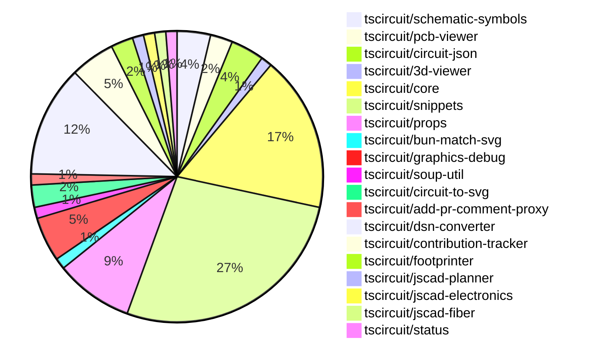

# Contribution Overview 2024-11-20

## PRs by Repository

## Contributor Overview

| Contributor | 🐳 Major | 🐙 Minor | 🐌 Tiny | ⭐ |
|-------------|-------|-------|-------|-------|
| [ShiboSoftwareDev](#ShiboSoftwareDev) | 5 | 11 | 0 | ⭐⭐⭐ |
| [imrishabh18](#imrishabh18) | 3 | 14 | 0 | ⭐⭐⭐ |
| [seveibar](#seveibar) | 3 | 8 | 1 | ⭐⭐ |
| [anas-sarkez](#anas-sarkez) | 2 | 9 | 0 | ⭐⭐ |
| [Abse2001](#Abse2001) | 1 | 9 | 1 | ⭐⭐ |
| [RohittCodes](#RohittCodes) | 1 | 5 | 0 | ⭐⭐ |
| [mrudulpatil18](#mrudulpatil18) | 1 | 2 | 0 | ⭐ |
| [Anshgrover23](#Anshgrover23) | 0 | 3 | 0 | ⭐ |
| [kom-senapati](#kom-senapati) | 0 | 1 | 0 |  |
| [hunxjunedo](#hunxjunedo) | 0 | 1 | 0 |  |

## Review Table

| Contributor | Reviews Received | Approvals | Rejections | Changes Requested | PRs Opened | PRs Closed | Issues Created |
|-------------|------------------|-----------|------------|-------------------|------------|------------|----------------|n| [Abse2001](https://github.com/Abse2001) | 12 | 10 | 5 | 1 | 11 | 11 | undefined |
| [ShiboSoftwareDev](https://github.com/ShiboSoftwareDev) | 22 | 16 | 13 | 2 | 24 | 24 | undefined |
| [seveibar](https://github.com/seveibar) | 0 | 0 | 0 | 0 | 13 | 12 | undefined |
| [imrishabh18](https://github.com/imrishabh18) | 9 | 4 | 5 | 2 | 19 | 17 | undefined |
| [anas-sarkez](https://github.com/anas-sarkez) | 31 | 12 | 5 | 4 | 11 | 11 | undefined |
| [Anshgrover23](https://github.com/Anshgrover23) | 2 | 1 | 5 | 1 | 7 | 5 | undefined |
| [mrudulpatil18](https://github.com/mrudulpatil18) | 5 | 4 | 0 | 1 | 4 | 3 | undefined |
| [kom-senapati](https://github.com/kom-senapati) | 2 | 1 | 0 | 1 | 1 | 1 | undefined |
| [melmathari](https://github.com/melmathari) | 8 | 1 | 3 | 2 | 5 | 4 | undefined |
| [hunxjunedo](https://github.com/hunxjunedo) | 2 | 1 | 1 | 0 | 1 | 1 | undefined |
| [RohittCodes](https://github.com/RohittCodes) | 52 | 7 | 2 | 10 | 9 | 7 | undefined |
| [vishwamartur](https://github.com/vishwamartur) | 1 | 0 | 1 | 1 | 1 | 1 | undefined |

## Changes by Repository

### [tscircuit/schematic-symbols](https://github.com/tscircuit/schematic-symbols)

| PR # | Impact | Contributor | Description |
|------|--------|-------------|-------------|
| [#212](https://github.com/tscircuit/schematic-symbols/pull/212) | 🐳 Major | Abse2001 | Create approximateBezier function to improve 'C' case handling and add a new symbol 'capacitor_polarised' |
| [#215](https://github.com/tscircuit/schematic-symbols/pull/215) | 🐙 Minor | Abse2001 | Improved the normally open and closed push button symbols. |
| [#211](https://github.com/tscircuit/schematic-symbols/pull/211) | 🐙 Minor | hunxjunedo | Fixes symbols in the SPST switch, constant current diode, and darlington pair transistor JSON files. |

### [tscircuit/pcb-viewer](https://github.com/tscircuit/pcb-viewer)

| PR # | Impact | Contributor | Description |
|------|--------|-------------|-------------|
| [#83](https://github.com/tscircuit/pcb-viewer/pull/83) | 🐙 Minor | Abse2001 | Fixed a type error by adding a non-nullable assertion for the `pcb_trace_id` property in the `CanvasElementsRenderer` component. |
| [#82](https://github.com/tscircuit/pcb-viewer/pull/82) | 🐙 Minor | ShiboSoftwareDev | Adds a new script to format the code using the "biome" tool. |

### [tscircuit/circuit-json](https://github.com/tscircuit/circuit-json)

| PR # | Impact | Contributor | Description |
|------|--------|-------------|-------------|
| [#84](https://github.com/tscircuit/circuit-json/pull/84) | 🐙 Minor | Abse2001 | Added an optional `gender` field to the `source_simple_pin_header` type. |
| [#83](https://github.com/tscircuit/circuit-json/pull/83) | 🐙 Minor | Abse2001 | Implemented a new source component for a simple pin header. |
| [#82](https://github.com/tscircuit/circuit-json/pull/82) | 🐙 Minor | ShiboSoftwareDev | Adds a new SMT pad shape called "rotated_rect" to the PCB module. |

### [tscircuit/3d-viewer](https://github.com/tscircuit/3d-viewer)

| PR # | Impact | Contributor | Description |
|------|--------|-------------|-------------|
| [#46](https://github.com/tscircuit/3d-viewer/pull/46) | 🐙 Minor | Abse2001 | Updates the `jscad-electronics` dependency to version `0.0.22` to use the `sot235` in the snippet for the OR gate. |

### [tscircuit/core](https://github.com/tscircuit/core)

| PR # | Impact | Contributor | Description |
|------|--------|-------------|-------------|
| [#364](https://github.com/tscircuit/core/pull/364) | 🐳 Major | ShiboSoftwareDev | Adds support for the "rotated_rect" shape in the SMT pad component. |
| [#336](https://github.com/tscircuit/core/pull/336) | 🐳 Major | seveibar | Change the default format for async autorouting from SimpleRouteJson to CircuitJson, and also add fixes and testing for production usage of the async autorouter. |
| [#351](https://github.com/tscircuit/core/pull/351) | 🐙 Minor | Abse2001 | Added `pin_count` and `gender` properties to the `<pinheader />` component. |
| [#342](https://github.com/tscircuit/core/pull/342) | 🐙 Minor | Abse2001 | Fixed the positioning of the manufacturer part number for four-sided pin layouts, handled three-pin layouts, and added tests for it. |
| [#339](https://github.com/tscircuit/core/pull/339) | 🐙 Minor | Abse2001 | Implemented the `getInheritedProperty` method on the `PrimitiveComponent` class to retrieve the value of a property from the component or its parent hierarchy. |
| [#357](https://github.com/tscircuit/core/pull/357) | 🐙 Minor | seveibar | Adds a function to get the client's origin and appends a cachebust query parameter to the model URLs to avoid CORS issues. |
| [#349](https://github.com/tscircuit/core/pull/349) | 🐙 Minor | imrishabh18 | Adds a new component called "Crystal" to the library. |
| [#350](https://github.com/tscircuit/core/pull/350) | 🐙 Minor | imrishabh18 | Add "circuit-to-svg" as a dev dependency to reduce bundle size |
| [#333](https://github.com/tscircuit/core/pull/333) | 🐙 Minor | imrishabh18 | Adds caching for the PCB trace route to improve performance on re-rendering. |
| [#362](https://github.com/tscircuit/core/pull/362) | 🐙 Minor | anas-sarkez | Implemented a new event `renderable:renderLifecycle:anyEvent` to make it easier to listen to renderable events |
| [#358](https://github.com/tscircuit/core/pull/358) | 🐙 Minor | anas-sarkez | Updated the footprinter dependency to get the newest footprints. |
| [#352](https://github.com/tscircuit/core/pull/352) | 🐙 Minor | anas-sarkez | Implemented `getCurrentRenderPhase` and `getRenderGraph` methods for debugging the rendering process. |
| [#338](https://github.com/tscircuit/core/pull/338) | 🐙 Minor | anas-sarkez | Added support for tracking schematic_box obstacles in the Trace component. |
| [#363](https://github.com/tscircuit/core/pull/363) | 🐙 Minor | Anshgrover23 | Fix the bundle-size.yml workflow to run on pull requests from forks. |

### [tscircuit/snippets](https://github.com/tscircuit/snippets)

| PR # | Impact | Contributor | Description |
|------|--------|-------------|-------------|
| [#294](https://github.com/tscircuit/snippets/pull/294) | 🐳 Major | ShiboSoftwareDev | This pull request adds the ability to compare the bundle size of the PR branch with the main branch and generate a markdown report with the differences. |
| [#291](https://github.com/tscircuit/snippets/pull/291) | 🐳 Major | ShiboSoftwareDev | Updates the GitHub Actions workflow for bundle analysis, adding a new workflow for generating bundle size reports. |
| [#252](https://github.com/tscircuit/snippets/pull/252) | 🐳 Major | seveibar | Reverts a previous change that caused a regression where every snippet had red underlines until modified. |
| [#248](https://github.com/tscircuit/snippets/pull/248) | 🐳 Major | RohittCodes | Introduces a new field `manual_edits_json` in the `snippets` schema and updates the `update` and `create` endpoints to handle this new field. |
| [#280](https://github.com/tscircuit/snippets/pull/280) | 🐙 Minor | Abse2001 | Implement Capacitor BOM Search |
| [#282](https://github.com/tscircuit/snippets/pull/282) | 🐙 Minor | ShiboSoftwareDev | Implemented the logic to generate pin header BOM from the source component information. |
| [#277](https://github.com/tscircuit/snippets/pull/277) | 🐙 Minor | ShiboSoftwareDev | Adds a new ErrorFallback component to display error messages in the 3D viewer |
| [#267](https://github.com/tscircuit/snippets/pull/267) | 🐙 Minor | ShiboSoftwareDev | Add a spinner icon to the run button when the code is running |
| [#257](https://github.com/tscircuit/snippets/pull/257) | 🐙 Minor | ShiboSoftwareDev | Introduces a new "Footprint" option in the dropdown menu of the "Insert" button, and enhances the footprint dialog with QoL improvements such as automatic name formatting and error handling. |
| [#264](https://github.com/tscircuit/snippets/pull/264) | 🐙 Minor | seveibar | Modifies the way circuit JSON is keyed in the `use-run-tsx` hook to include the length of the `circuitJson` property. |
| [#263](https://github.com/tscircuit/snippets/pull/263) | 🐙 Minor | seveibar | Update core library to version 0.0.193, enabling cloud autorouting |
| [#242](https://github.com/tscircuit/snippets/pull/242) | 🐙 Minor | seveibar | Redirect the /playground URL to the editor with the "blank-circuit-board" template |
| [#254](https://github.com/tscircuit/snippets/pull/254) | 🐙 Minor | seveibar | Add a GitHub link and star count badge to the landing page |
| [#298](https://github.com/tscircuit/snippets/pull/298) | 🐙 Minor | imrishabh18 | Fixes the `invalid_code_token` issue when not using `localhost` for the `next` parameter in the GitHub OAuth authorization flow. |
| [#287](https://github.com/tscircuit/snippets/pull/287) | 🐙 Minor | anas-sarkez | Fixed responsiveness issue in EditorNav component |
| [#285](https://github.com/tscircuit/snippets/pull/285) | 🐙 Minor | RohittCodes | Adds a fullscreen toggle button to the preview component. |
| [#245](https://github.com/tscircuit/snippets/pull/245) | 🐙 Minor | RohittCodes | Fixed the issue where the `template` query parameter was being removed during navigation, causing the template-url to not persist. |
| [#202](https://github.com/tscircuit/snippets/pull/202) | 🐙 Minor | RohittCodes | Adds a feature to remove the star from snippets. |
| [#270](https://github.com/tscircuit/snippets/pull/270) | 🐙 Minor | RohittCodes | Fix the exact cursor position without reflecting the code and its types. |
| [#268](https://github.com/tscircuit/snippets/pull/268) | 🐙 Minor | RohittCodes | Fixes a bug where the `manualEditsFileContent` wasn't being initialized with the `manual_edit_json` when the page loaded, causing the "Unsaved Changes" issue to be displayed. |
| [#236](https://github.com/tscircuit/snippets/pull/236) | 🐙 Minor | mrudulpatil18 | Update the link for iframe embedding of code snippets to use the "/preview" endpoint. |
| [#258](https://github.com/tscircuit/snippets/pull/258) | 🐌 Tiny | seveibar | The pull request skips the parts engine test on the CI environment. |

### [tscircuit/props](https://github.com/tscircuit/props)

| PR # | Impact | Contributor | Description |
|------|--------|-------------|-------------|
| [#104](https://github.com/tscircuit/props/pull/104) | 🐙 Minor | ShiboSoftwareDev | Add support for rotated rectangle SMT pads. |
| [#105](https://github.com/tscircuit/props/pull/105) | 🐙 Minor | seveibar | Add "sequential-trace" and "subcircuit" autorouter presets |
| [#103](https://github.com/tscircuit/props/pull/103) | 🐙 Minor | seveibar | Adds an `autorouter` prop to the `SubcircuitGroupProps` interface, which can be set to an `AutorouterConfig` object, or one of the string literals `"auto"`, `"auto-local"`, or `"auto-cloud"`. |
| [#106](https://github.com/tscircuit/props/pull/106) | 🐙 Minor | imrishabh18 | Adds export for "crystal" component and fixes npm publish issue with lock file |
| [#102](https://github.com/tscircuit/props/pull/102) | 🐙 Minor | imrishabh18 | Exports the `PcbRouteCache` interface which was previously not exported. |
| [#101](https://github.com/tscircuit/props/pull/101) | 🐙 Minor | imrishabh18 | Adds a new `pcbRouteCache` property to the `SubcircuitGroupProps` interface, which holds information about PCB traces and a cache key. |
| [#108](https://github.com/tscircuit/props/pull/108) | 🐌 Tiny | Abse2001 | Sets the gender of the pin header to "male" by default. |

### [tscircuit/bun-match-svg](https://github.com/tscircuit/bun-match-svg)

| PR # | Impact | Contributor | Description |
|------|--------|-------------|-------------|
| [#4](https://github.com/tscircuit/bun-match-svg/pull/4) | 🐳 Major | ShiboSoftwareDev | Implemented a CLI tool that initializes the project in other repositories. |

### [tscircuit/graphics-debug](https://github.com/tscircuit/graphics-debug)

| PR # | Impact | Contributor | Description |
|------|--------|-------------|-------------|
| [#10](https://github.com/tscircuit/graphics-debug/pull/10) | 🐳 Major | ShiboSoftwareDev | Introduce a table that lists all graphics objects and highlights the corresponding object when hovering over the table entries. |
| [#8](https://github.com/tscircuit/graphics-debug/pull/8) | 🐳 Major | mrudulpatil18 | The pull request fixes the issue of crosshair visibility on the website by adding a custom SVGRenderer component to handle SVGs generated with script correctly. |
| [#9](https://github.com/tscircuit/graphics-debug/pull/9) | 🐙 Minor | ShiboSoftwareDev | Adds error handling for failed parsing of graphics input and displays the error message to the user. |
| [#7](https://github.com/tscircuit/graphics-debug/pull/7) | 🐙 Minor | mrudulpatil18 | Added a "See Example" button to load sample graphics data in the input element for visualization. |

### [tscircuit/soup-util](https://github.com/tscircuit/soup-util)

| PR # | Impact | Contributor | Description |
|------|--------|-------------|-------------|
| [#25](https://github.com/tscircuit/soup-util/pull/25) | 🐙 Minor | ShiboSoftwareDev | Updated the `circuit-json` dependency to version `0.0.106`. |

### [tscircuit/circuit-to-svg](https://github.com/tscircuit/circuit-to-svg)

| PR # | Impact | Contributor | Description |
|------|--------|-------------|-------------|
| [#137](https://github.com/tscircuit/circuit-to-svg/pull/137) | 🐙 Minor | ShiboSoftwareDev | Rotate the rectangles representing SMT pads counter-clockwise instead of clockwise. |
| [#136](https://github.com/tscircuit/circuit-to-svg/pull/136) | 🐙 Minor | ShiboSoftwareDev | Adds support for rendering rotated rectangular SMT pads in the PCB rendering |

### [tscircuit/add-pr-comment-proxy](https://github.com/tscircuit/add-pr-comment-proxy)

| PR # | Impact | Contributor | Description |
|------|--------|-------------|-------------|
| [#6](https://github.com/tscircuit/add-pr-comment-proxy/pull/6) | 🐳 Major | seveibar | Ports the project to Vercel, a serverless hosting platform. |

### [tscircuit/dsn-converter](https://github.com/tscircuit/dsn-converter)

| PR # | Impact | Contributor | Description |
|------|--------|-------------|-------------|
| [#32](https://github.com/tscircuit/dsn-converter/pull/32) | 🐳 Major | imrishabh18 | Fix the conversion of `pcb_trace` and `source_net` to a network of DSN. |
| [#31](https://github.com/tscircuit/dsn-converter/pull/31) | 🐳 Major | imrishabh18 | Adds support for converting "simple_chip" components in circuit-json format to DSN format. |
| [#29](https://github.com/tscircuit/dsn-converter/pull/29) | 🐳 Major | imrishabh18 | Groups the components and images together like in the KiCad DSN file format. |
| [#26](https://github.com/tscircuit/dsn-converter/pull/26) | 🐙 Minor | seveibar | Adjusts the scale factor for converting a DSN session to a circuit JSON file. |
| [#35](https://github.com/tscircuit/dsn-converter/pull/35) | 🐙 Minor | imrishabh18 | Fixes the trace ID generation to ensure unique and predictable IDs for improved traceability and differentiation. |
| [#34](https://github.com/tscircuit/dsn-converter/pull/34) | 🐙 Minor | imrishabh18 | Adds a GitHub Actions workflow to automatically format code using the `@biomejs/biome` package. |
| [#33](https://github.com/tscircuit/dsn-converter/pull/33) | 🐙 Minor | imrishabh18 | Added a test to check the motor driver DSN format and fixed the parseDsnJson function for conversion. |
| [#30](https://github.com/tscircuit/dsn-converter/pull/30) | 🐙 Minor | imrishabh18 | Plated holes for the components are grouped together and images are added only once (similar to kicad format) |
| [#28](https://github.com/tscircuit/dsn-converter/pull/28) | 🐙 Minor | imrishabh18 | Fixes the plated hole DSN file format and net. |
| [#27](https://github.com/tscircuit/dsn-converter/pull/27) | 🐙 Minor | imrishabh18 | Fixes a scaling issue in the session by adjusting the transformation factor for converting millimeters to session units. |

### [tscircuit/contribution-tracker](https://github.com/tscircuit/contribution-tracker)

| PR # | Impact | Contributor | Description |
|------|--------|-------------|-------------|
| [#12](https://github.com/tscircuit/contribution-tracker/pull/12) | 🐙 Minor | imrishabh18 | Reverts the fix for the review table |
| [#8](https://github.com/tscircuit/contribution-tracker/pull/8) | 🐙 Minor | anas-sarkez | Adds a new column in the "Review Table" to display the number of issues created by each contributor. |
| [#11](https://github.com/tscircuit/contribution-tracker/pull/11) | 🐙 Minor | Anshgrover23 | Fixes issues #7 and #9 in the review table, including updating the table layout and adding a column for "Issues Created". |
| [#6](https://github.com/tscircuit/contribution-tracker/pull/6) | 🐙 Minor | kom-senapati |  |

### [tscircuit/footprinter](https://github.com/tscircuit/footprinter)

| PR # | Impact | Contributor | Description |
|------|--------|-------------|-------------|
| [#86](https://github.com/tscircuit/footprinter/pull/86) | 🐳 Major | anas-sarkez | Refactored the `Stampboard` and `StampReceiver` functions to have separate pins for each SMD pad and hole. |
| [#83](https://github.com/tscircuit/footprinter/pull/83) | 🐙 Minor | anas-sarkez | Refactor all footprinter functions by updating their scheme, all footprints now have a default value of num_pins. |

### [tscircuit/jscad-planner](https://github.com/tscircuit/jscad-planner)

| PR # | Impact | Contributor | Description |
|------|--------|-------------|-------------|
| [#4](https://github.com/tscircuit/jscad-planner/pull/4) | 🐳 Major | anas-sarkez | Added the `hull` and `hullChain` operations along with their types and tests. |

### [tscircuit/jscad-electronics](https://github.com/tscircuit/jscad-electronics)

| PR # | Impact | Contributor | Description |
|------|--------|-------------|-------------|
| [#81](https://github.com/tscircuit/jscad-electronics/pull/81) | 🐙 Minor | anas-sarkez | Implemented the `SOT235` (SOT-23-5) 3D component and added a Footprinter3d example for it. |

### [tscircuit/jscad-fiber](https://github.com/tscircuit/jscad-fiber)

| PR # | Impact | Contributor | Description |
|------|--------|-------------|-------------|
| [#91](https://github.com/tscircuit/jscad-fiber/pull/91) | 🐙 Minor | anas-sarkez | Add ExampleWrapper component with code toggle functionality |

### [tscircuit/status](https://github.com/tscircuit/status)

| PR # | Impact | Contributor | Description |
|------|--------|-------------|-------------|
| [#3](https://github.com/tscircuit/status/pull/3) | 🐙 Minor | Anshgrover23 | Fix issue where bars were getting cut off in the service status display |

## Changes by Contributor

### [Abse2001](https://github.com/Abse2001)

| PR # | Impact | Description |
|------|--------|-------------|
| [#212](https://github.com/tscircuit/schematic-symbols/pull/212) | 🐳 Major | Create approximateBezier function to improve 'C' case handling and add a new symbol 'capacitor_polarised' |
| [#83](https://github.com/tscircuit/pcb-viewer/pull/83) | 🐙 Minor | Fixed a type error by adding a non-nullable assertion for the `pcb_trace_id` property in the `CanvasElementsRenderer` component. |
| [#84](https://github.com/tscircuit/circuit-json/pull/84) | 🐙 Minor | Added an optional `gender` field to the `source_simple_pin_header` type. |
| [#83](https://github.com/tscircuit/circuit-json/pull/83) | 🐙 Minor | Implemented a new source component for a simple pin header. |
| [#46](https://github.com/tscircuit/3d-viewer/pull/46) | 🐙 Minor | Updates the `jscad-electronics` dependency to version `0.0.22` to use the `sot235` in the snippet for the OR gate. |
| [#351](https://github.com/tscircuit/core/pull/351) | 🐙 Minor | Added `pin_count` and `gender` properties to the `<pinheader />` component. |
| [#342](https://github.com/tscircuit/core/pull/342) | 🐙 Minor | Fixed the positioning of the manufacturer part number for four-sided pin layouts, handled three-pin layouts, and added tests for it. |
| [#339](https://github.com/tscircuit/core/pull/339) | 🐙 Minor | Implemented the `getInheritedProperty` method on the `PrimitiveComponent` class to retrieve the value of a property from the component or its parent hierarchy. |
| [#215](https://github.com/tscircuit/schematic-symbols/pull/215) | 🐙 Minor | Improved the normally open and closed push button symbols. |
| [#280](https://github.com/tscircuit/snippets/pull/280) | 🐙 Minor | Implement Capacitor BOM Search |
| [#108](https://github.com/tscircuit/props/pull/108) | 🐌 Tiny | Sets the gender of the pin header to "male" by default. |

### [ShiboSoftwareDev](https://github.com/ShiboSoftwareDev)

| PR # | Impact | Description |
|------|--------|-------------|
| [#364](https://github.com/tscircuit/core/pull/364) | 🐳 Major | Adds support for the "rotated_rect" shape in the SMT pad component. |
| [#4](https://github.com/tscircuit/bun-match-svg/pull/4) | 🐳 Major | Implemented a CLI tool that initializes the project in other repositories. |
| [#294](https://github.com/tscircuit/snippets/pull/294) | 🐳 Major | This pull request adds the ability to compare the bundle size of the PR branch with the main branch and generate a markdown report with the differences. |
| [#291](https://github.com/tscircuit/snippets/pull/291) | 🐳 Major | Updates the GitHub Actions workflow for bundle analysis, adding a new workflow for generating bundle size reports. |
| [#10](https://github.com/tscircuit/graphics-debug/pull/10) | 🐳 Major | Introduce a table that lists all graphics objects and highlights the corresponding object when hovering over the table entries. |
| [#82](https://github.com/tscircuit/pcb-viewer/pull/82) | 🐙 Minor | Adds a new script to format the code using the "biome" tool. |
| [#82](https://github.com/tscircuit/circuit-json/pull/82) | 🐙 Minor | Adds a new SMT pad shape called "rotated_rect" to the PCB module. |
| [#25](https://github.com/tscircuit/soup-util/pull/25) | 🐙 Minor | Updated the `circuit-json` dependency to version `0.0.106`. |
| [#104](https://github.com/tscircuit/props/pull/104) | 🐙 Minor | Add support for rotated rectangle SMT pads. |
| [#137](https://github.com/tscircuit/circuit-to-svg/pull/137) | 🐙 Minor | Rotate the rectangles representing SMT pads counter-clockwise instead of clockwise. |
| [#136](https://github.com/tscircuit/circuit-to-svg/pull/136) | 🐙 Minor | Adds support for rendering rotated rectangular SMT pads in the PCB rendering |
| [#282](https://github.com/tscircuit/snippets/pull/282) | 🐙 Minor | Implemented the logic to generate pin header BOM from the source component information. |
| [#277](https://github.com/tscircuit/snippets/pull/277) | 🐙 Minor | Adds a new ErrorFallback component to display error messages in the 3D viewer |
| [#267](https://github.com/tscircuit/snippets/pull/267) | 🐙 Minor | Add a spinner icon to the run button when the code is running |
| [#257](https://github.com/tscircuit/snippets/pull/257) | 🐙 Minor | Introduces a new "Footprint" option in the dropdown menu of the "Insert" button, and enhances the footprint dialog with QoL improvements such as automatic name formatting and error handling. |
| [#9](https://github.com/tscircuit/graphics-debug/pull/9) | 🐙 Minor | Adds error handling for failed parsing of graphics input and displays the error message to the user. |

### [seveibar](https://github.com/seveibar)

| PR # | Impact | Description |
|------|--------|-------------|
| [#336](https://github.com/tscircuit/core/pull/336) | 🐳 Major | Change the default format for async autorouting from SimpleRouteJson to CircuitJson, and also add fixes and testing for production usage of the async autorouter. |
| [#252](https://github.com/tscircuit/snippets/pull/252) | 🐳 Major | Reverts a previous change that caused a regression where every snippet had red underlines until modified. |
| [#6](https://github.com/tscircuit/add-pr-comment-proxy/pull/6) | 🐳 Major | Ports the project to Vercel, a serverless hosting platform. |
| [#105](https://github.com/tscircuit/props/pull/105) | 🐙 Minor | Add "sequential-trace" and "subcircuit" autorouter presets |
| [#103](https://github.com/tscircuit/props/pull/103) | 🐙 Minor | Adds an `autorouter` prop to the `SubcircuitGroupProps` interface, which can be set to an `AutorouterConfig` object, or one of the string literals `"auto"`, `"auto-local"`, or `"auto-cloud"`. |
| [#357](https://github.com/tscircuit/core/pull/357) | 🐙 Minor | Adds a function to get the client's origin and appends a cachebust query parameter to the model URLs to avoid CORS issues. |
| [#26](https://github.com/tscircuit/dsn-converter/pull/26) | 🐙 Minor | Adjusts the scale factor for converting a DSN session to a circuit JSON file. |
| [#264](https://github.com/tscircuit/snippets/pull/264) | 🐙 Minor | Modifies the way circuit JSON is keyed in the `use-run-tsx` hook to include the length of the `circuitJson` property. |
| [#263](https://github.com/tscircuit/snippets/pull/263) | 🐙 Minor | Update core library to version 0.0.193, enabling cloud autorouting |
| [#242](https://github.com/tscircuit/snippets/pull/242) | 🐙 Minor | Redirect the /playground URL to the editor with the "blank-circuit-board" template |
| [#254](https://github.com/tscircuit/snippets/pull/254) | 🐙 Minor | Add a GitHub link and star count badge to the landing page |
| [#258](https://github.com/tscircuit/snippets/pull/258) | 🐌 Tiny | The pull request skips the parts engine test on the CI environment. |

### [imrishabh18](https://github.com/imrishabh18)

| PR # | Impact | Description |
|------|--------|-------------|
| [#32](https://github.com/tscircuit/dsn-converter/pull/32) | 🐳 Major | Fix the conversion of `pcb_trace` and `source_net` to a network of DSN. |
| [#31](https://github.com/tscircuit/dsn-converter/pull/31) | 🐳 Major | Adds support for converting "simple_chip" components in circuit-json format to DSN format. |
| [#29](https://github.com/tscircuit/dsn-converter/pull/29) | 🐳 Major | Groups the components and images together like in the KiCad DSN file format. |
| [#106](https://github.com/tscircuit/props/pull/106) | 🐙 Minor | Adds export for "crystal" component and fixes npm publish issue with lock file |
| [#102](https://github.com/tscircuit/props/pull/102) | 🐙 Minor | Exports the `PcbRouteCache` interface which was previously not exported. |
| [#101](https://github.com/tscircuit/props/pull/101) | 🐙 Minor | Adds a new `pcbRouteCache` property to the `SubcircuitGroupProps` interface, which holds information about PCB traces and a cache key. |
| [#349](https://github.com/tscircuit/core/pull/349) | 🐙 Minor | Adds a new component called "Crystal" to the library. |
| [#350](https://github.com/tscircuit/core/pull/350) | 🐙 Minor | Add "circuit-to-svg" as a dev dependency to reduce bundle size |
| [#333](https://github.com/tscircuit/core/pull/333) | 🐙 Minor | Adds caching for the PCB trace route to improve performance on re-rendering. |
| [#12](https://github.com/tscircuit/contribution-tracker/pull/12) | 🐙 Minor | Reverts the fix for the review table |
| [#35](https://github.com/tscircuit/dsn-converter/pull/35) | 🐙 Minor | Fixes the trace ID generation to ensure unique and predictable IDs for improved traceability and differentiation. |
| [#34](https://github.com/tscircuit/dsn-converter/pull/34) | 🐙 Minor | Adds a GitHub Actions workflow to automatically format code using the `@biomejs/biome` package. |
| [#33](https://github.com/tscircuit/dsn-converter/pull/33) | 🐙 Minor | Added a test to check the motor driver DSN format and fixed the parseDsnJson function for conversion. |
| [#30](https://github.com/tscircuit/dsn-converter/pull/30) | 🐙 Minor | Plated holes for the components are grouped together and images are added only once (similar to kicad format) |
| [#28](https://github.com/tscircuit/dsn-converter/pull/28) | 🐙 Minor | Fixes the plated hole DSN file format and net. |
| [#27](https://github.com/tscircuit/dsn-converter/pull/27) | 🐙 Minor | Fixes a scaling issue in the session by adjusting the transformation factor for converting millimeters to session units. |
| [#298](https://github.com/tscircuit/snippets/pull/298) | 🐙 Minor | Fixes the `invalid_code_token` issue when not using `localhost` for the `next` parameter in the GitHub OAuth authorization flow. |

### [anas-sarkez](https://github.com/anas-sarkez)

| PR # | Impact | Description |
|------|--------|-------------|
| [#86](https://github.com/tscircuit/footprinter/pull/86) | 🐳 Major | Refactored the `Stampboard` and `StampReceiver` functions to have separate pins for each SMD pad and hole. |
| [#4](https://github.com/tscircuit/jscad-planner/pull/4) | 🐳 Major | Added the `hull` and `hullChain` operations along with their types and tests. |
| [#83](https://github.com/tscircuit/footprinter/pull/83) | 🐙 Minor | Refactor all footprinter functions by updating their scheme, all footprints now have a default value of num_pins. |
| [#362](https://github.com/tscircuit/core/pull/362) | 🐙 Minor | Implemented a new event `renderable:renderLifecycle:anyEvent` to make it easier to listen to renderable events |
| [#358](https://github.com/tscircuit/core/pull/358) | 🐙 Minor | Updated the footprinter dependency to get the newest footprints. |
| [#352](https://github.com/tscircuit/core/pull/352) | 🐙 Minor | Implemented `getCurrentRenderPhase` and `getRenderGraph` methods for debugging the rendering process. |
| [#338](https://github.com/tscircuit/core/pull/338) | 🐙 Minor | Added support for tracking schematic_box obstacles in the Trace component. |
| [#81](https://github.com/tscircuit/jscad-electronics/pull/81) | 🐙 Minor | Implemented the `SOT235` (SOT-23-5) 3D component and added a Footprinter3d example for it. |
| [#91](https://github.com/tscircuit/jscad-fiber/pull/91) | 🐙 Minor | Add ExampleWrapper component with code toggle functionality |
| [#8](https://github.com/tscircuit/contribution-tracker/pull/8) | 🐙 Minor | Adds a new column in the "Review Table" to display the number of issues created by each contributor. |
| [#287](https://github.com/tscircuit/snippets/pull/287) | 🐙 Minor | Fixed responsiveness issue in EditorNav component |

### [Anshgrover23](https://github.com/Anshgrover23)

| PR # | Impact | Description |
|------|--------|-------------|
| [#363](https://github.com/tscircuit/core/pull/363) | 🐙 Minor | Fix the bundle-size.yml workflow to run on pull requests from forks. |
| [#11](https://github.com/tscircuit/contribution-tracker/pull/11) | 🐙 Minor | Fixes issues #7 and #9 in the review table, including updating the table layout and adding a column for "Issues Created". |
| [#3](https://github.com/tscircuit/status/pull/3) | 🐙 Minor | Fix issue where bars were getting cut off in the service status display |

### [kom-senapati](https://github.com/kom-senapati)

| PR # | Impact | Description |
|------|--------|-------------|
| [#6](https://github.com/tscircuit/contribution-tracker/pull/6) | 🐙 Minor |  |

### [hunxjunedo](https://github.com/hunxjunedo)

| PR # | Impact | Description |
|------|--------|-------------|
| [#211](https://github.com/tscircuit/schematic-symbols/pull/211) | 🐙 Minor | Fixes symbols in the SPST switch, constant current diode, and darlington pair transistor JSON files. |

### [RohittCodes](https://github.com/RohittCodes)

| PR # | Impact | Description |
|------|--------|-------------|
| [#248](https://github.com/tscircuit/snippets/pull/248) | 🐳 Major | Introduces a new field `manual_edits_json` in the `snippets` schema and updates the `update` and `create` endpoints to handle this new field. |
| [#285](https://github.com/tscircuit/snippets/pull/285) | 🐙 Minor | Adds a fullscreen toggle button to the preview component. |
| [#245](https://github.com/tscircuit/snippets/pull/245) | 🐙 Minor | Fixed the issue where the `template` query parameter was being removed during navigation, causing the template-url to not persist. |
| [#202](https://github.com/tscircuit/snippets/pull/202) | 🐙 Minor | Adds a feature to remove the star from snippets. |
| [#270](https://github.com/tscircuit/snippets/pull/270) | 🐙 Minor | Fix the exact cursor position without reflecting the code and its types. |
| [#268](https://github.com/tscircuit/snippets/pull/268) | 🐙 Minor | Fixes a bug where the `manualEditsFileContent` wasn't being initialized with the `manual_edit_json` when the page loaded, causing the "Unsaved Changes" issue to be displayed. |

### [mrudulpatil18](https://github.com/mrudulpatil18)

| PR # | Impact | Description |
|------|--------|-------------|
| [#8](https://github.com/tscircuit/graphics-debug/pull/8) | 🐳 Major | The pull request fixes the issue of crosshair visibility on the website by adding a custom SVGRenderer component to handle SVGs generated with script correctly. |
| [#236](https://github.com/tscircuit/snippets/pull/236) | 🐙 Minor | Update the link for iframe embedding of code snippets to use the "/preview" endpoint. |
| [#7](https://github.com/tscircuit/graphics-debug/pull/7) | 🐙 Minor | Added a "See Example" button to load sample graphics data in the input element for visualization. |

