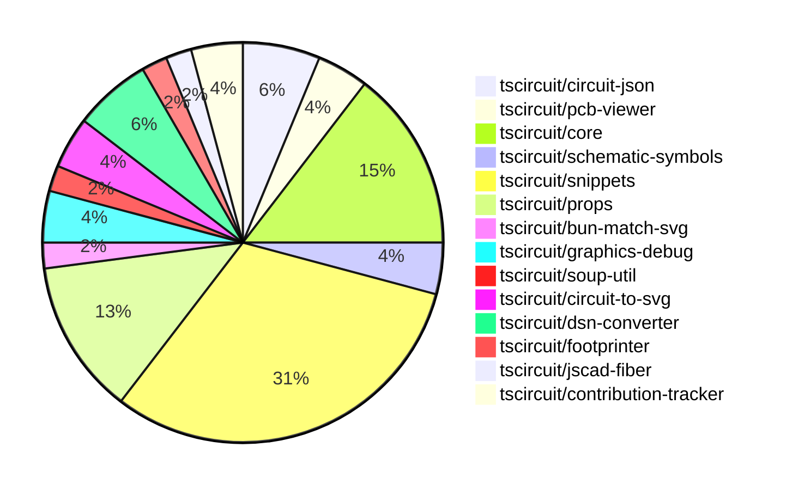

# Contribution Overview 2024-11-20

## PRs by Repository

## Contributor Overview

| Contributor | 🐳 Major | 🐙 Minor | 🐌 Tiny | ⭐ |
|-------------|-------|-------|-------|-------|
| [ShiboSoftwareDev](#ShiboSoftwareDev) | 2 | 10 | 0 | ⭐⭐ |
| [seveibar](#seveibar) | 3 | 5 | 1 | ⭐⭐ |
| [imrishabh18](#imrishabh18) | 2 | 6 | 0 | ⭐⭐ |
| [Abse2001](#Abse2001) | 1 | 6 | 1 | ⭐⭐ |
| [RohittCodes](#RohittCodes) | 1 | 3 | 0 | ⭐ |
| [anas-sarkez](#anas-sarkez) | 0 | 4 | 0 | ⭐ |
| [kom-senapati](#kom-senapati) | 0 | 1 | 0 |  |
| [hunxjunedo](#hunxjunedo) | 0 | 1 | 0 |  |
| [mrudulpatil18](#mrudulpatil18) | 0 | 1 | 0 |  |

## Review Table

| Contributor | Reviews Received | Approvals | Rejections | Changes Requested | PRs Opened | PRs Closed | Issues Created |
|-------------|------------------|-----------|------------|-------------------|------------|------------|----------------|n| [Abse2001](https://github.com/Abse2001) | 9 | 7 | 5 | 1 | 9 | 8 | undefined |
| [ShiboSoftwareDev](https://github.com/ShiboSoftwareDev) | 17 | 11 | 10 | 2 | 16 | 14 | undefined |
| [imrishabh18](https://github.com/imrishabh18) | 9 | 4 | 1 | 2 | 10 | 8 | undefined |
| [seveibar](https://github.com/seveibar) | 0 | 0 | 0 | 0 | 11 | 9 | undefined |
| [anas-sarkez](https://github.com/anas-sarkez) | 19 | 4 | 2 | 3 | 5 | 4 | undefined |
| [kom-senapati](https://github.com/kom-senapati) | 2 | 1 | 0 | 1 | 1 | 1 | undefined |
| [melmathari](https://github.com/melmathari) | 7 | 1 | 4 | 2 | 5 | 3 | undefined |
| [hunxjunedo](https://github.com/hunxjunedo) | 2 | 1 | 1 | 0 | 1 | 1 | undefined |
| [RohittCodes](https://github.com/RohittCodes) | 37 | 5 | 1 | 6 | 6 | 4 | undefined |
| [mrudulpatil18](https://github.com/mrudulpatil18) | 2 | 2 | 0 | 0 | 3 | 1 | undefined |

## Changes by Repository

### [tscircuit/circuit-json](https://github.com/tscircuit/circuit-json)

| PR # | Impact | Contributor | Description |
|------|--------|-------------|-------------|
| [#83](https://github.com/tscircuit/circuit-json/pull/83) | 🐳 Major | Abse2001 | Implemented a new source component called `source_simple_pin_header`. |
| [#84](https://github.com/tscircuit/circuit-json/pull/84) | 🐙 Minor | Abse2001 | Added `.optional()` to the `gender` field in the `source_simple_pin_header` type. |
| [#82](https://github.com/tscircuit/circuit-json/pull/82) | 🐙 Minor | ShiboSoftwareDev | Introduces a new shape type "rotated_rect" for SMT pads in the PCB module. |

### [tscircuit/pcb-viewer](https://github.com/tscircuit/pcb-viewer)

| PR # | Impact | Contributor | Description |
|------|--------|-------------|-------------|
| [#83](https://github.com/tscircuit/pcb-viewer/pull/83) | 🐙 Minor | Abse2001 | Fixed a type error by adding a non-null assertion operator (`!`) to a property access expression. |
| [#82](https://github.com/tscircuit/pcb-viewer/pull/82) | 🐙 Minor | ShiboSoftwareDev | Adds a biome format script to the project |

### [tscircuit/core](https://github.com/tscircuit/core)

| PR # | Impact | Contributor | Description |
|------|--------|-------------|-------------|
| [#333](https://github.com/tscircuit/core/pull/333) | 🐳 Major | imrishabh18 | Adds caching for PCB trace routing to avoid re-rendering. |
| [#336](https://github.com/tscircuit/core/pull/336) | 🐳 Major | seveibar | This pull request changes the default format for async autorouting from SimpleRouteJson to circuit JSON, adds fixes for the async autorouter, and includes testing for production usage. |
| [#342](https://github.com/tscircuit/core/pull/342) | 🐙 Minor | Abse2001 | Fixed manufacturer Part Number should go below refdes for four-sided pin layouts, handled three pin layouts, and added tests for it. |
| [#339](https://github.com/tscircuit/core/pull/339) | 🐙 Minor | Abse2001 | Implemented the `getInheritedProperty` method on the `PrimitiveComponent` class to retrieve inherited properties from the component hierarchy. |
| [#349](https://github.com/tscircuit/core/pull/349) | 🐙 Minor | imrishabh18 | Adds a new component called "Crystal" to the library of electrical components. |
| [#350](https://github.com/tscircuit/core/pull/350) | 🐙 Minor | imrishabh18 | Add "circuit-to-svg" as a dev dependency to reduce bundle size |
| [#338](https://github.com/tscircuit/core/pull/338) | 🐙 Minor | anas-sarkez | Added handling for "schematic_box" type in the Trace component to detect and add it as an obstacle. |

### [tscircuit/schematic-symbols](https://github.com/tscircuit/schematic-symbols)

| PR # | Impact | Contributor | Description |
|------|--------|-------------|-------------|
| [#212](https://github.com/tscircuit/schematic-symbols/pull/212) | 🐙 Minor | Abse2001 | Creates a new function `approximateBezier` to improve the handling of the 'C' case and adds a new symbol `capacitor_polarised`. |
| [#211](https://github.com/tscircuit/schematic-symbols/pull/211) | 🐙 Minor | hunxjunedo | Fixes the Y coordinates of various elements in the SPST switch, constant current diode, and Darlington pair transistor symbols. |

### [tscircuit/snippets](https://github.com/tscircuit/snippets)

| PR # | Impact | Contributor | Description |
|------|--------|-------------|-------------|
| [#252](https://github.com/tscircuit/snippets/pull/252) | 🐳 Major | seveibar | Reverts a previous change that caused a regression where every snippet has red underlines until modified. |
| [#248](https://github.com/tscircuit/snippets/pull/248) | 🐳 Major | RohittCodes | Introduces the ability to manually edit the `snippets.manual_edits_json` field and implements an update function for it. |
| [#280](https://github.com/tscircuit/snippets/pull/280) | 🐙 Minor | Abse2001 | Implement Capacitor BOM Search in the JLC Parts Engine |
| [#277](https://github.com/tscircuit/snippets/pull/277) | 🐙 Minor | ShiboSoftwareDev | Adds a new ErrorFallback component and integrates it into the PreviewContent component to display detailed error messages when the 3D viewer fails to load. |
| [#267](https://github.com/tscircuit/snippets/pull/267) | 🐙 Minor | ShiboSoftwareDev | Adds a spinner to the run button when the code is running |
| [#257](https://github.com/tscircuit/snippets/pull/257) | 🐙 Minor | ShiboSoftwareDev | Adds a dropdown menu to the "Insert" button in the Code Editor header, allowing the user to select "Footprint" as an insertion option. |
| [#264](https://github.com/tscircuit/snippets/pull/264) | 🐙 Minor | seveibar | Improve the keying for the circuit JSON in the `use-run-tsx` hook. |
| [#263](https://github.com/tscircuit/snippets/pull/263) | 🐙 Minor | seveibar | Update the `@tscircuit/core` dependency to version `0.0.193` |
| [#242](https://github.com/tscircuit/snippets/pull/242) | 🐙 Minor | seveibar | Adds a redirect from `/playground` to `https://tscircuit.com/editor?template=blank-circuit-board` |
| [#254](https://github.com/tscircuit/snippets/pull/254) | 🐙 Minor | seveibar | Add a GitHub link with the number of stars to the landing page |
| [#202](https://github.com/tscircuit/snippets/pull/202) | 🐙 Minor | RohittCodes | Adds a feature to remove the star from a snippet. |
| [#270](https://github.com/tscircuit/snippets/pull/270) | 🐙 Minor | RohittCodes | Fixes the exact cursor position in the code editor without affecting the code or its types. |
| [#268](https://github.com/tscircuit/snippets/pull/268) | 🐙 Minor | RohittCodes | Fix to load the manual_json when the page loads. |
| [#236](https://github.com/tscircuit/snippets/pull/236) | 🐙 Minor | mrudulpatil18 | Update the link for iframe embedding of snippets to use the /preview endpoint. |
| [#258](https://github.com/tscircuit/snippets/pull/258) | 🐌 Tiny | seveibar | Skips the parts engine test on the CI environment. |

### [tscircuit/props](https://github.com/tscircuit/props)

| PR # | Impact | Contributor | Description |
|------|--------|-------------|-------------|
| [#103](https://github.com/tscircuit/props/pull/103) | 🐳 Major | seveibar | Adds an "autorouter" property to the `SubcircuitGroupProps` interface, which can be either an `AutorouterConfig` object or one of the strings "auto", "auto-local", or "auto-cloud". |
| [#104](https://github.com/tscircuit/props/pull/104) | 🐙 Minor | ShiboSoftwareDev | Adds support for rotated rectangular SMT pads in the `smtpad.ts` file. |
| [#106](https://github.com/tscircuit/props/pull/106) | 🐙 Minor | imrishabh18 | Adds export for the "crystal" component and fixes the NPM publish lock file. |
| [#102](https://github.com/tscircuit/props/pull/102) | 🐙 Minor | imrishabh18 | Exports the `PcbRouteCache` interface |
| [#101](https://github.com/tscircuit/props/pull/101) | 🐙 Minor | imrishabh18 | Add `pcbRouteCache` property to `SubcircuitGroupProps` interface. |
| [#108](https://github.com/tscircuit/props/pull/108) | 🐌 Tiny | Abse2001 | Change the default gender of the pin header to "male". |

### [tscircuit/bun-match-svg](https://github.com/tscircuit/bun-match-svg)

| PR # | Impact | Contributor | Description |
|------|--------|-------------|-------------|
| [#4](https://github.com/tscircuit/bun-match-svg/pull/4) | 🐳 Major | ShiboSoftwareDev | Implemented a CLI tool that initializes the project in other repositories. |

### [tscircuit/graphics-debug](https://github.com/tscircuit/graphics-debug)

| PR # | Impact | Contributor | Description |
|------|--------|-------------|-------------|
| [#10](https://github.com/tscircuit/graphics-debug/pull/10) | 🐳 Major | ShiboSoftwareDev | Introduces a table that lists all objects in the graphics display, with the ability to highlight objects when hovering over table entries. |
| [#9](https://github.com/tscircuit/graphics-debug/pull/9) | 🐙 Minor | ShiboSoftwareDev | Add error handling for failed parsing of graphics input |

### [tscircuit/soup-util](https://github.com/tscircuit/soup-util)

| PR # | Impact | Contributor | Description |
|------|--------|-------------|-------------|
| [#25](https://github.com/tscircuit/soup-util/pull/25) | 🐙 Minor | ShiboSoftwareDev | Updated the `circuit-json` dependency to version `0.0.106`. |

### [tscircuit/circuit-to-svg](https://github.com/tscircuit/circuit-to-svg)

| PR # | Impact | Contributor | Description |
|------|--------|-------------|-------------|
| [#137](https://github.com/tscircuit/circuit-to-svg/pull/137) | 🐙 Minor | ShiboSoftwareDev | Rotate the rectangles representing SMT pads counter-clockwise |
| [#136](https://github.com/tscircuit/circuit-to-svg/pull/136) | 🐙 Minor | ShiboSoftwareDev | Adds support for rendering rotated rectangular SMT pads in the SVG output. |

### [tscircuit/dsn-converter](https://github.com/tscircuit/dsn-converter)

| PR # | Impact | Contributor | Description |
|------|--------|-------------|-------------|
| [#28](https://github.com/tscircuit/dsn-converter/pull/28) | 🐳 Major | imrishabh18 | Fixes the DSN file format for plated holes and ensures that they are properly added to the net. |
| [#27](https://github.com/tscircuit/dsn-converter/pull/27) | 🐙 Minor | imrishabh18 | Fix a scaling issue in the session |
| [#26](https://github.com/tscircuit/dsn-converter/pull/26) | 🐙 Minor | seveibar | Adjusts the scale factor for converting DSN session to Circuit JSON from 1/1000 to 1/10000. |

### [tscircuit/footprinter](https://github.com/tscircuit/footprinter)

| PR # | Impact | Contributor | Description |
|------|--------|-------------|-------------|
| [#83](https://github.com/tscircuit/footprinter/pull/83) | 🐙 Minor | anas-sarkez | Refactor all footprinter functions by updating their scheme, setting the default value of `num_pins` across all footprints. |

### [tscircuit/jscad-fiber](https://github.com/tscircuit/jscad-fiber)

| PR # | Impact | Contributor | Description |
|------|--------|-------------|-------------|
| [#91](https://github.com/tscircuit/jscad-fiber/pull/91) | 🐙 Minor | anas-sarkez | Adds the ExampleWrapper component with code toggle functionality to the examples. |

### [tscircuit/contribution-tracker](https://github.com/tscircuit/contribution-tracker)

| PR # | Impact | Contributor | Description |
|------|--------|-------------|-------------|
| [#8](https://github.com/tscircuit/contribution-tracker/pull/8) | 🐙 Minor | anas-sarkez | The pull request adds a new column "Issues Created" to the Reviews Table, which displays the number of issues created by each contributor. |
| [#6](https://github.com/tscircuit/contribution-tracker/pull/6) | 🐙 Minor | kom-senapati |  |

## Changes by Contributor

### [Abse2001](https://github.com/Abse2001)

| PR # | Impact | Description |
|------|--------|-------------|
| [#83](https://github.com/tscircuit/circuit-json/pull/83) | 🐳 Major | Implemented a new source component called `source_simple_pin_header`. |
| [#83](https://github.com/tscircuit/pcb-viewer/pull/83) | 🐙 Minor | Fixed a type error by adding a non-null assertion operator (`!`) to a property access expression. |
| [#84](https://github.com/tscircuit/circuit-json/pull/84) | 🐙 Minor | Added `.optional()` to the `gender` field in the `source_simple_pin_header` type. |
| [#342](https://github.com/tscircuit/core/pull/342) | 🐙 Minor | Fixed manufacturer Part Number should go below refdes for four-sided pin layouts, handled three pin layouts, and added tests for it. |
| [#339](https://github.com/tscircuit/core/pull/339) | 🐙 Minor | Implemented the `getInheritedProperty` method on the `PrimitiveComponent` class to retrieve inherited properties from the component hierarchy. |
| [#212](https://github.com/tscircuit/schematic-symbols/pull/212) | 🐙 Minor | Creates a new function `approximateBezier` to improve the handling of the 'C' case and adds a new symbol `capacitor_polarised`. |
| [#280](https://github.com/tscircuit/snippets/pull/280) | 🐙 Minor | Implement Capacitor BOM Search in the JLC Parts Engine |
| [#108](https://github.com/tscircuit/props/pull/108) | 🐌 Tiny | Change the default gender of the pin header to "male". |

### [ShiboSoftwareDev](https://github.com/ShiboSoftwareDev)

| PR # | Impact | Description |
|------|--------|-------------|
| [#4](https://github.com/tscircuit/bun-match-svg/pull/4) | 🐳 Major | Implemented a CLI tool that initializes the project in other repositories. |
| [#10](https://github.com/tscircuit/graphics-debug/pull/10) | 🐳 Major | Introduces a table that lists all objects in the graphics display, with the ability to highlight objects when hovering over table entries. |
| [#82](https://github.com/tscircuit/pcb-viewer/pull/82) | 🐙 Minor | Adds a biome format script to the project |
| [#82](https://github.com/tscircuit/circuit-json/pull/82) | 🐙 Minor | Introduces a new shape type "rotated_rect" for SMT pads in the PCB module. |
| [#25](https://github.com/tscircuit/soup-util/pull/25) | 🐙 Minor | Updated the `circuit-json` dependency to version `0.0.106`. |
| [#104](https://github.com/tscircuit/props/pull/104) | 🐙 Minor | Adds support for rotated rectangular SMT pads in the `smtpad.ts` file. |
| [#137](https://github.com/tscircuit/circuit-to-svg/pull/137) | 🐙 Minor | Rotate the rectangles representing SMT pads counter-clockwise |
| [#136](https://github.com/tscircuit/circuit-to-svg/pull/136) | 🐙 Minor | Adds support for rendering rotated rectangular SMT pads in the SVG output. |
| [#277](https://github.com/tscircuit/snippets/pull/277) | 🐙 Minor | Adds a new ErrorFallback component and integrates it into the PreviewContent component to display detailed error messages when the 3D viewer fails to load. |
| [#267](https://github.com/tscircuit/snippets/pull/267) | 🐙 Minor | Adds a spinner to the run button when the code is running |
| [#257](https://github.com/tscircuit/snippets/pull/257) | 🐙 Minor | Adds a dropdown menu to the "Insert" button in the Code Editor header, allowing the user to select "Footprint" as an insertion option. |
| [#9](https://github.com/tscircuit/graphics-debug/pull/9) | 🐙 Minor | Add error handling for failed parsing of graphics input |

### [imrishabh18](https://github.com/imrishabh18)

| PR # | Impact | Description |
|------|--------|-------------|
| [#333](https://github.com/tscircuit/core/pull/333) | 🐳 Major | Adds caching for PCB trace routing to avoid re-rendering. |
| [#28](https://github.com/tscircuit/dsn-converter/pull/28) | 🐳 Major | Fixes the DSN file format for plated holes and ensures that they are properly added to the net. |
| [#106](https://github.com/tscircuit/props/pull/106) | 🐙 Minor | Adds export for the "crystal" component and fixes the NPM publish lock file. |
| [#102](https://github.com/tscircuit/props/pull/102) | 🐙 Minor | Exports the `PcbRouteCache` interface |
| [#101](https://github.com/tscircuit/props/pull/101) | 🐙 Minor | Add `pcbRouteCache` property to `SubcircuitGroupProps` interface. |
| [#349](https://github.com/tscircuit/core/pull/349) | 🐙 Minor | Adds a new component called "Crystal" to the library of electrical components. |
| [#350](https://github.com/tscircuit/core/pull/350) | 🐙 Minor | Add "circuit-to-svg" as a dev dependency to reduce bundle size |
| [#27](https://github.com/tscircuit/dsn-converter/pull/27) | 🐙 Minor | Fix a scaling issue in the session |

### [seveibar](https://github.com/seveibar)

| PR # | Impact | Description |
|------|--------|-------------|
| [#103](https://github.com/tscircuit/props/pull/103) | 🐳 Major | Adds an "autorouter" property to the `SubcircuitGroupProps` interface, which can be either an `AutorouterConfig` object or one of the strings "auto", "auto-local", or "auto-cloud". |
| [#336](https://github.com/tscircuit/core/pull/336) | 🐳 Major | This pull request changes the default format for async autorouting from SimpleRouteJson to circuit JSON, adds fixes for the async autorouter, and includes testing for production usage. |
| [#252](https://github.com/tscircuit/snippets/pull/252) | 🐳 Major | Reverts a previous change that caused a regression where every snippet has red underlines until modified. |
| [#26](https://github.com/tscircuit/dsn-converter/pull/26) | 🐙 Minor | Adjusts the scale factor for converting DSN session to Circuit JSON from 1/1000 to 1/10000. |
| [#264](https://github.com/tscircuit/snippets/pull/264) | 🐙 Minor | Improve the keying for the circuit JSON in the `use-run-tsx` hook. |
| [#263](https://github.com/tscircuit/snippets/pull/263) | 🐙 Minor | Update the `@tscircuit/core` dependency to version `0.0.193` |
| [#242](https://github.com/tscircuit/snippets/pull/242) | 🐙 Minor | Adds a redirect from `/playground` to `https://tscircuit.com/editor?template=blank-circuit-board` |
| [#254](https://github.com/tscircuit/snippets/pull/254) | 🐙 Minor | Add a GitHub link with the number of stars to the landing page |
| [#258](https://github.com/tscircuit/snippets/pull/258) | 🐌 Tiny | Skips the parts engine test on the CI environment. |

### [anas-sarkez](https://github.com/anas-sarkez)

| PR # | Impact | Description |
|------|--------|-------------|
| [#83](https://github.com/tscircuit/footprinter/pull/83) | 🐙 Minor | Refactor all footprinter functions by updating their scheme, setting the default value of `num_pins` across all footprints. |
| [#338](https://github.com/tscircuit/core/pull/338) | 🐙 Minor | Added handling for "schematic_box" type in the Trace component to detect and add it as an obstacle. |
| [#91](https://github.com/tscircuit/jscad-fiber/pull/91) | 🐙 Minor | Adds the ExampleWrapper component with code toggle functionality to the examples. |
| [#8](https://github.com/tscircuit/contribution-tracker/pull/8) | 🐙 Minor | The pull request adds a new column "Issues Created" to the Reviews Table, which displays the number of issues created by each contributor. |

### [kom-senapati](https://github.com/kom-senapati)

| PR # | Impact | Description |
|------|--------|-------------|
| [#6](https://github.com/tscircuit/contribution-tracker/pull/6) | 🐙 Minor |  |

### [hunxjunedo](https://github.com/hunxjunedo)

| PR # | Impact | Description |
|------|--------|-------------|
| [#211](https://github.com/tscircuit/schematic-symbols/pull/211) | 🐙 Minor | Fixes the Y coordinates of various elements in the SPST switch, constant current diode, and Darlington pair transistor symbols. |

### [RohittCodes](https://github.com/RohittCodes)

| PR # | Impact | Description |
|------|--------|-------------|
| [#248](https://github.com/tscircuit/snippets/pull/248) | 🐳 Major | Introduces the ability to manually edit the `snippets.manual_edits_json` field and implements an update function for it. |
| [#202](https://github.com/tscircuit/snippets/pull/202) | 🐙 Minor | Adds a feature to remove the star from a snippet. |
| [#270](https://github.com/tscircuit/snippets/pull/270) | 🐙 Minor | Fixes the exact cursor position in the code editor without affecting the code or its types. |
| [#268](https://github.com/tscircuit/snippets/pull/268) | 🐙 Minor | Fix to load the manual_json when the page loads. |

### [mrudulpatil18](https://github.com/mrudulpatil18)

| PR # | Impact | Description |
|------|--------|-------------|
| [#236](https://github.com/tscircuit/snippets/pull/236) | 🐙 Minor | Update the link for iframe embedding of snippets to use the /preview endpoint. |

