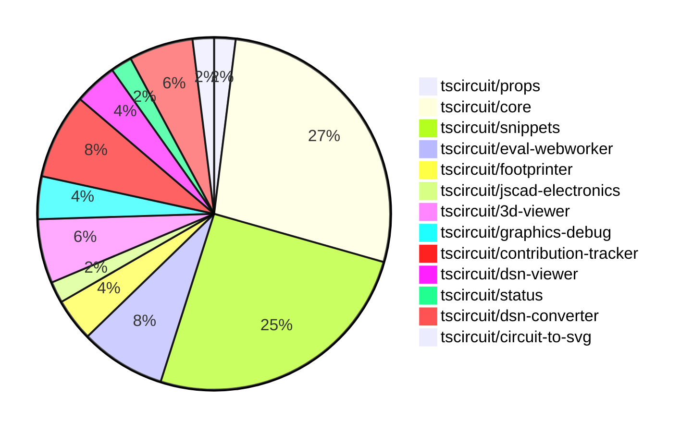

# Contribution Overview 2024-11-27

## PRs by Repository

## Contributor Overview

| Contributor | 🐳 Major | 🐙 Minor | 🐌 Tiny | ⭐ | Issues Created |
|-------------|---------|---------|---------|-----|----------------|
| [anas-sarkez](#anas-sarkez) | 3 | 6 | 0 | ⭐⭐ |
| [ShiboSoftwareDev](#ShiboSoftwareDev) | 3 | 4 | 2 | ⭐⭐ |
| [mrudulpatil18](#mrudulpatil18) | 1 | 6 | 0 | ⭐⭐ |
| [Anshgrover23](#Anshgrover23) | 0 | 7 | 0 | ⭐⭐ |
| [imrishabh18](#imrishabh18) | 0 | 6 | 0 | ⭐⭐ |
| [Abse2001](#Abse2001) | 0 | 4 | 1 | ⭐ |
| [seveibar](#seveibar) | 0 | 3 | 0 | ⭐ |
| [divanshu-go](#divanshu-go) | 1 | 1 | 0 | ⭐ |
| [RohittCodes](#RohittCodes) | 0 | 1 | 0 |  |

## Review Table

| Contributor | Reviews Received | Approvals | Rejections | Changes Requested | PRs Opened | PRs Closed | Issues created |
|-------------|------------------|-----------|------------|-------------------|------------|------------|----------------|
| [Niharika0104](https://github.com/Niharika0104) | 1 | 1 | 0 | 0 | 1 | 0 | 0 |
| [seveibar](https://github.com/seveibar) | 1 | 0 | 1 | 0 | 5 | 5 | 0 |
| [anas-sarkez](https://github.com/anas-sarkez) | 16 | 7 | 5 | 4 | 11 | 10 | 0 |
| [Abse2001](https://github.com/Abse2001) | 8 | 5 | 1 | 1 | 5 | 5 | 0 |
| [Anshgrover23](https://github.com/Anshgrover23) | 22 | 6 | 4 | 7 | 11 | 10 | 0 |
| [mrudulpatil18](https://github.com/mrudulpatil18) | 13 | 8 | 0 | 1 | 9 | 8 | 0 |
| [ShiboSoftwareDev](https://github.com/ShiboSoftwareDev) | 14 | 9 | 5 | 0 | 12 | 10 | 0 |
| [imrishabh18](https://github.com/imrishabh18) | 2 | 2 | 2 | 0 | 6 | 6 | 0 |
| [divanshu-go](https://github.com/divanshu-go) | 4 | 2 | 0 | 1 | 2 | 2 | 0 |
| [RohittCodes](https://github.com/RohittCodes) | 10 | 2 | 4 | 5 | 6 | 3 | 0 |
| [krushnarout](https://github.com/krushnarout) | 4 | 0 | 1 | 2 | 1 | 0 | 0 |

## Changes by Repository

### [tscircuit/props](https://github.com/tscircuit/props)

| PR # | Impact | Contributor | Description |
|------|--------|-------------|-------------|
| [#109](https://github.com/tscircuit/props/pull/109) | 🐙 Minor | seveibar | Adds a new optional property `serverMode` to the `AutorouterConfig` interface and the `autorouterConfig` object. |

### [tscircuit/core](https://github.com/tscircuit/core)

| PR # | Impact | Contributor | Description |
|------|--------|-------------|-------------|
| [#364](https://github.com/tscircuit/core/pull/364) | 🐳 Major | ShiboSoftwareDev | Adds support for the "rotated_rect" shape in the SmtPad component. |
| [#374](https://github.com/tscircuit/core/pull/374) | 🐙 Minor | seveibar | Fix prod issues related to GET/POST request differences for autorouting job creation |
| [#373](https://github.com/tscircuit/core/pull/373) | 🟣 | seveibar | Introduce job autorouting mode |
| [#362](https://github.com/tscircuit/core/pull/362) | 🐳 Major | anas-sarkez | Implemented a new event `renderable:renderLifecycle:anyEvent` to make it easier to listen to renderable events. |
| [#379](https://github.com/tscircuit/core/pull/379) | 🐙 Minor | anas-sarkez | Removed schematic text logic from `Jumper.ts` |
| [#378](https://github.com/tscircuit/core/pull/378) | 🐙 Minor | anas-sarkez | Moved the logic for rendering schematic text for components to a shared `SchematicComponentRenderWithSchematicBoxDimensions` function. |
| [#376](https://github.com/tscircuit/core/pull/376) | 🐙 Minor | anas-sarkez | Adds a new `schematicDisabled` option to the `Circuit` class to skip rendering all schematic components. |
| [#358](https://github.com/tscircuit/core/pull/358) | 🐙 Minor | anas-sarkez | Update the footprinter dependency to the newest version. |
| [#352](https://github.com/tscircuit/core/pull/352) | 🐙 Minor | anas-sarkez | Implemented `getCurrentRenderPhase` and `getRenderGraph` methods for debugging the rendering process. |
| [#355](https://github.com/tscircuit/core/pull/355) | 🐙 Minor | mrudulpatil18 | The pull request ensures that the component name passed directly when using the component takes precedence over the default name from the `useRedLed` hook, and adds a test case to verify this behavior. |
| [#369](https://github.com/tscircuit/core/pull/369) | 🐙 Minor | ShiboSoftwareDev | Added a test for 90-degree rotation of SMT pads, which must draw normal rectangular SMT pad shapes. |
| [#368](https://github.com/tscircuit/core/pull/368) | 🐙 Minor | ShiboSoftwareDev | Fix an issue where SMT pads were not drawn correctly when the component rotation was 90 degrees |
| [#363](https://github.com/tscircuit/core/pull/363) | 🐙 Minor | Anshgrover23 | Fixes the bundle-size.yml workflow to run on pull requests from forks. |
| [#367](https://github.com/tscircuit/core/pull/367) | 🐌 Tiny | Abse2001 | Disables two remote autorouting tests by skipping them. |

### [tscircuit/snippets](https://github.com/tscircuit/snippets)

| PR # | Impact | Contributor | Description |
|------|--------|-------------|-------------|
| [#294](https://github.com/tscircuit/snippets/pull/294) | 🐳 Major | ShiboSoftwareDev | Adds a new workflow to generate and compare bundle size stats between the PR branch and the main branch. |
| [#291](https://github.com/tscircuit/snippets/pull/291) | 🐳 Major | ShiboSoftwareDev | Adds a new GitHub Actions workflow to generate a bundle size report for pull requests. |
| [#325](https://github.com/tscircuit/snippets/pull/325) | 🐙 Minor | seveibar | Update the version of the `@tscircuit/core` dependency and fix the expand button in the `PreviewContent` component. |
| [#309](https://github.com/tscircuit/snippets/pull/309) | 🐙 Minor | Abse2001 | Updating the `@tscircuit/core` dependency to version `0.0.208` to fix an issue where components were not rendering when `pcbRotation="90"`. |
| [#318](https://github.com/tscircuit/snippets/pull/318) | 🐙 Minor | mrudulpatil18 | Adds a Playwright test to verify the underlined and clickable imports feature in the editor. |
| [#311](https://github.com/tscircuit/snippets/pull/311) | 🐙 Minor | ShiboSoftwareDev | Restricts the bundle-size-analysis workflow to only run on changes to the package.json file. |
| [#317](https://github.com/tscircuit/snippets/pull/317) | 🐙 Minor | Anshgrover23 | Fix for Cmd Click functionality for clicking on snippets |
| [#302](https://github.com/tscircuit/snippets/pull/302) | 🐙 Minor | Anshgrover23 | Fixes a bug in the regex used to import names with dashes properly. |
| [#303](https://github.com/tscircuit/snippets/pull/303) | 🐙 Minor | imrishabh18 | Adds a new dev login page to the application. |
| [#298](https://github.com/tscircuit/snippets/pull/298) | 🐙 Minor | imrishabh18 | Fix the "invalid_code_token" issue when not using `localhost` for the GitHub OAuth flow. |
| [#285](https://github.com/tscircuit/snippets/pull/285) | 🐙 Minor | RohittCodes | Adds a full-screen toggle button to the preview component. |
| [#306](https://github.com/tscircuit/snippets/pull/306) | 🐌 Tiny | ShiboSoftwareDev | Updated the version of the `@tscircuit/3d-viewer` dependency from `0.0.43` to `0.0.44`. |
| [#304](https://github.com/tscircuit/snippets/pull/304) | 🐌 Tiny | ShiboSoftwareDev | Removed an unnecessary GitHub workflow file. |

### [tscircuit/eval-webworker](https://github.com/tscircuit/eval-webworker)

| PR # | Impact | Contributor | Description |
|------|--------|-------------|-------------|
| [#5](https://github.com/tscircuit/eval-webworker/pull/5) | 🟣 | seveibar | Add Workflows, Fix Test, Publish v0.0.1 |
| [#6](https://github.com/tscircuit/eval-webworker/pull/6) | 🐳 Major | mrudulpatil18 | Re-emit all events from the web worker to the client |
| [#10](https://github.com/tscircuit/eval-webworker/pull/10) | 🐙 Minor | mrudulpatil18 | Configure the build process to generate declaration files. |
| [#8](https://github.com/tscircuit/eval-webworker/pull/8) | 🐙 Minor | mrudulpatil18 | Adds a build step before the release process. |

### [tscircuit/footprinter](https://github.com/tscircuit/footprinter)

| PR # | Impact | Contributor | Description |
|------|--------|-------------|-------------|
| [#86](https://github.com/tscircuit/footprinter/pull/86) | 🐳 Major | anas-sarkez | Refactor the Stampboard and Stampreceiver functions to separate SMD pads and holes into distinct pins. |
| [#87](https://github.com/tscircuit/footprinter/pull/87) | 🐙 Minor | anas-sarkez | Rearranged the pin positions for the sot23-5 package to match the data sheet layout in an anti-clockwise direction. |

### [tscircuit/jscad-electronics](https://github.com/tscircuit/jscad-electronics)

| PR # | Impact | Contributor | Description |
|------|--------|-------------|-------------|
| [#81](https://github.com/tscircuit/jscad-electronics/pull/81) | 🐳 Major | anas-sarkez | Implemented the `SOT235` (SOT-23-5) 3D component and added an example for the Footprinter3d component. |

### [tscircuit/3d-viewer](https://github.com/tscircuit/3d-viewer)

| PR # | Impact | Contributor | Description |
|------|--------|-------------|-------------|
| [#50](https://github.com/tscircuit/3d-viewer/pull/50) | 🐙 Minor | Abse2001 | Fixed an issue where the bottom trace between vias was not showing and added a test to verify the fix. |
| [#47](https://github.com/tscircuit/3d-viewer/pull/47) | 🐙 Minor | Abse2001 | Fixes misaligned 3D viewer components by updating the tooltip position calculation. |
| [#46](https://github.com/tscircuit/3d-viewer/pull/46) | 🐙 Minor | Abse2001 | Updates the `jscad-electronics` package to version `0.0.22` to use the `sot235` in the snippet for the OR gate. |

### [tscircuit/graphics-debug](https://github.com/tscircuit/graphics-debug)

| PR # | Impact | Contributor | Description |
|------|--------|-------------|-------------|
| [#8](https://github.com/tscircuit/graphics-debug/pull/8) | 🐙 Minor | mrudulpatil18 | Fixes the issue with crosshair visibility on the website by adding a custom `SVGRenderer` component to handle SVGs generated with script correctly. |
| [#7](https://github.com/tscircuit/graphics-debug/pull/7) | 🐙 Minor | mrudulpatil18 | Added a "See Example" button to load sample graphics data in the input element for visualization. |

### [tscircuit/contribution-tracker](https://github.com/tscircuit/contribution-tracker)

| PR # | Impact | Contributor | Description |
|------|--------|-------------|-------------|
| [#14](https://github.com/tscircuit/contribution-tracker/pull/14) | 🐙 Minor | ShiboSoftwareDev | Fixed the review table in the generated markdown |
| [#13](https://github.com/tscircuit/contribution-tracker/pull/13) | 🐙 Minor | Anshgrover23 | Fixes the review table in the generated Markdown by adding a column for "Issues Created" and fixing the alignment of the table. |
| [#11](https://github.com/tscircuit/contribution-tracker/pull/11) | 🐙 Minor | Anshgrover23 | Fixes issues #7 and #9 by updating the review table layout and adding the "Issues Created" column. |
| [#12](https://github.com/tscircuit/contribution-tracker/pull/12) | 🐙 Minor | imrishabh18 | Reverts the "Fix review table" pull request. |

### [tscircuit/dsn-viewer](https://github.com/tscircuit/dsn-viewer)

| PR # | Impact | Contributor | Description |
|------|--------|-------------|-------------|
| [#7](https://github.com/tscircuit/dsn-viewer/pull/7) | 🐳 Major | divanshu-go | Adds support for handling multiple DSN file uploads and improves error handling. |
| [#8](https://github.com/tscircuit/dsn-viewer/pull/8) | 🐙 Minor | Anshgrover23 | Set up a basic Playwright test for the DSN viewer application |

### [tscircuit/status](https://github.com/tscircuit/status)

| PR # | Impact | Contributor | Description |
|------|--------|-------------|-------------|
| [#3](https://github.com/tscircuit/status/pull/3) | 🐙 Minor | Anshgrover23 | Fix an issue where the bars in the service status section were getting cut off. |

### [tscircuit/dsn-converter](https://github.com/tscircuit/dsn-converter)

| PR # | Impact | Contributor | Description |
|------|--------|-------------|-------------|
| [#38](https://github.com/tscircuit/dsn-converter/pull/38) | 🐙 Minor | imrishabh18 | Adds the `from_layer` and `to_layer` properties to the output object for a PCB via. |
| [#37](https://github.com/tscircuit/dsn-converter/pull/37) | 🐙 Minor | imrishabh18 | Add the via's and test to check the via's are present |
| [#36](https://github.com/tscircuit/dsn-converter/pull/36) | 🐙 Minor | imrishabh18 | Adds support for circle shapes in the PCB component conversion process. |

### [tscircuit/circuit-to-svg](https://github.com/tscircuit/circuit-to-svg)

| PR # | Impact | Contributor | Description |
|------|--------|-------------|-------------|
| [#140](https://github.com/tscircuit/circuit-to-svg/pull/140) | 🐙 Minor | divanshu-go | Adds a GitHub Actions workflow to calculate and report the bundle and install size differences between the base and PR branches. |

## Changes by Contributor

### [seveibar](https://github.com/seveibar)

| PR # | Impact | Description |
|------|--------|-------------|
| [#109](https://github.com/tscircuit/props/pull/109) | 🐙 Minor | Adds a new optional property `serverMode` to the `AutorouterConfig` interface and the `autorouterConfig` object. |
| [#374](https://github.com/tscircuit/core/pull/374) | 🐙 Minor | Fix prod issues related to GET/POST request differences for autorouting job creation |
| [#373](https://github.com/tscircuit/core/pull/373) | 🟣 | Introduce job autorouting mode |
| [#325](https://github.com/tscircuit/snippets/pull/325) | 🐙 Minor | Update the version of the `@tscircuit/core` dependency and fix the expand button in the `PreviewContent` component. |
| [#5](https://github.com/tscircuit/eval-webworker/pull/5) | 🟣 | Add Workflows, Fix Test, Publish v0.0.1 |

### [anas-sarkez](https://github.com/anas-sarkez)

| PR # | Impact | Description |
|------|--------|-------------|
| [#86](https://github.com/tscircuit/footprinter/pull/86) | 🐳 Major | Refactor the Stampboard and Stampreceiver functions to separate SMD pads and holes into distinct pins. |
| [#362](https://github.com/tscircuit/core/pull/362) | 🐳 Major | Implemented a new event `renderable:renderLifecycle:anyEvent` to make it easier to listen to renderable events. |
| [#81](https://github.com/tscircuit/jscad-electronics/pull/81) | 🐳 Major | Implemented the `SOT235` (SOT-23-5) 3D component and added an example for the Footprinter3d component. |
| [#87](https://github.com/tscircuit/footprinter/pull/87) | 🐙 Minor | Rearranged the pin positions for the sot23-5 package to match the data sheet layout in an anti-clockwise direction. |
| [#379](https://github.com/tscircuit/core/pull/379) | 🐙 Minor | Removed schematic text logic from `Jumper.ts` |
| [#378](https://github.com/tscircuit/core/pull/378) | 🐙 Minor | Moved the logic for rendering schematic text for components to a shared `SchematicComponentRenderWithSchematicBoxDimensions` function. |
| [#376](https://github.com/tscircuit/core/pull/376) | 🐙 Minor | Adds a new `schematicDisabled` option to the `Circuit` class to skip rendering all schematic components. |
| [#358](https://github.com/tscircuit/core/pull/358) | 🐙 Minor | Update the footprinter dependency to the newest version. |
| [#352](https://github.com/tscircuit/core/pull/352) | 🐙 Minor | Implemented `getCurrentRenderPhase` and `getRenderGraph` methods for debugging the rendering process. |

### [Abse2001](https://github.com/Abse2001)

| PR # | Impact | Description |
|------|--------|-------------|
| [#50](https://github.com/tscircuit/3d-viewer/pull/50) | 🐙 Minor | Fixed an issue where the bottom trace between vias was not showing and added a test to verify the fix. |
| [#47](https://github.com/tscircuit/3d-viewer/pull/47) | 🐙 Minor | Fixes misaligned 3D viewer components by updating the tooltip position calculation. |
| [#46](https://github.com/tscircuit/3d-viewer/pull/46) | 🐙 Minor | Updates the `jscad-electronics` package to version `0.0.22` to use the `sot235` in the snippet for the OR gate. |
| [#309](https://github.com/tscircuit/snippets/pull/309) | 🐙 Minor | Updating the `@tscircuit/core` dependency to version `0.0.208` to fix an issue where components were not rendering when `pcbRotation="90"`. |
| [#367](https://github.com/tscircuit/core/pull/367) | 🐌 Tiny | Disables two remote autorouting tests by skipping them. |

### [mrudulpatil18](https://github.com/mrudulpatil18)

| PR # | Impact | Description |
|------|--------|-------------|
| [#6](https://github.com/tscircuit/eval-webworker/pull/6) | 🐳 Major | Re-emit all events from the web worker to the client |
| [#355](https://github.com/tscircuit/core/pull/355) | 🐙 Minor | The pull request ensures that the component name passed directly when using the component takes precedence over the default name from the `useRedLed` hook, and adds a test case to verify this behavior. |
| [#318](https://github.com/tscircuit/snippets/pull/318) | 🐙 Minor | Adds a Playwright test to verify the underlined and clickable imports feature in the editor. |
| [#8](https://github.com/tscircuit/graphics-debug/pull/8) | 🐙 Minor | Fixes the issue with crosshair visibility on the website by adding a custom `SVGRenderer` component to handle SVGs generated with script correctly. |
| [#7](https://github.com/tscircuit/graphics-debug/pull/7) | 🐙 Minor | Added a "See Example" button to load sample graphics data in the input element for visualization. |
| [#10](https://github.com/tscircuit/eval-webworker/pull/10) | 🐙 Minor | Configure the build process to generate declaration files. |
| [#8](https://github.com/tscircuit/eval-webworker/pull/8) | 🐙 Minor | Adds a build step before the release process. |

### [ShiboSoftwareDev](https://github.com/ShiboSoftwareDev)

| PR # | Impact | Description |
|------|--------|-------------|
| [#364](https://github.com/tscircuit/core/pull/364) | 🐳 Major | Adds support for the "rotated_rect" shape in the SmtPad component. |
| [#294](https://github.com/tscircuit/snippets/pull/294) | 🐳 Major | Adds a new workflow to generate and compare bundle size stats between the PR branch and the main branch. |
| [#291](https://github.com/tscircuit/snippets/pull/291) | 🐳 Major | Adds a new GitHub Actions workflow to generate a bundle size report for pull requests. |
| [#369](https://github.com/tscircuit/core/pull/369) | 🐙 Minor | Added a test for 90-degree rotation of SMT pads, which must draw normal rectangular SMT pad shapes. |
| [#368](https://github.com/tscircuit/core/pull/368) | 🐙 Minor | Fix an issue where SMT pads were not drawn correctly when the component rotation was 90 degrees |
| [#14](https://github.com/tscircuit/contribution-tracker/pull/14) | 🐙 Minor | Fixed the review table in the generated markdown |
| [#311](https://github.com/tscircuit/snippets/pull/311) | 🐙 Minor | Restricts the bundle-size-analysis workflow to only run on changes to the package.json file. |
| [#306](https://github.com/tscircuit/snippets/pull/306) | 🐌 Tiny | Updated the version of the `@tscircuit/3d-viewer` dependency from `0.0.43` to `0.0.44`. |
| [#304](https://github.com/tscircuit/snippets/pull/304) | 🐌 Tiny | Removed an unnecessary GitHub workflow file. |

### [Anshgrover23](https://github.com/Anshgrover23)

| PR # | Impact | Description |
|------|--------|-------------|
| [#363](https://github.com/tscircuit/core/pull/363) | 🐙 Minor | Fixes the bundle-size.yml workflow to run on pull requests from forks. |
| [#13](https://github.com/tscircuit/contribution-tracker/pull/13) | 🐙 Minor | Fixes the review table in the generated Markdown by adding a column for "Issues Created" and fixing the alignment of the table. |
| [#11](https://github.com/tscircuit/contribution-tracker/pull/11) | 🐙 Minor | Fixes issues #7 and #9 by updating the review table layout and adding the "Issues Created" column. |
| [#317](https://github.com/tscircuit/snippets/pull/317) | 🐙 Minor | Fix for Cmd Click functionality for clicking on snippets |
| [#302](https://github.com/tscircuit/snippets/pull/302) | 🐙 Minor | Fixes a bug in the regex used to import names with dashes properly. |
| [#8](https://github.com/tscircuit/dsn-viewer/pull/8) | 🐙 Minor | Set up a basic Playwright test for the DSN viewer application |
| [#3](https://github.com/tscircuit/status/pull/3) | 🐙 Minor | Fix an issue where the bars in the service status section were getting cut off. |

### [imrishabh18](https://github.com/imrishabh18)

| PR # | Impact | Description |
|------|--------|-------------|
| [#12](https://github.com/tscircuit/contribution-tracker/pull/12) | 🐙 Minor | Reverts the "Fix review table" pull request. |
| [#38](https://github.com/tscircuit/dsn-converter/pull/38) | 🐙 Minor | Adds the `from_layer` and `to_layer` properties to the output object for a PCB via. |
| [#37](https://github.com/tscircuit/dsn-converter/pull/37) | 🐙 Minor | Add the via's and test to check the via's are present |
| [#36](https://github.com/tscircuit/dsn-converter/pull/36) | 🐙 Minor | Adds support for circle shapes in the PCB component conversion process. |
| [#303](https://github.com/tscircuit/snippets/pull/303) | 🐙 Minor | Adds a new dev login page to the application. |
| [#298](https://github.com/tscircuit/snippets/pull/298) | 🐙 Minor | Fix the "invalid_code_token" issue when not using `localhost` for the GitHub OAuth flow. |

### [divanshu-go](https://github.com/divanshu-go)

| PR # | Impact | Description |
|------|--------|-------------|
| [#7](https://github.com/tscircuit/dsn-viewer/pull/7) | 🐳 Major | Adds support for handling multiple DSN file uploads and improves error handling. |
| [#140](https://github.com/tscircuit/circuit-to-svg/pull/140) | 🐙 Minor | Adds a GitHub Actions workflow to calculate and report the bundle and install size differences between the base and PR branches. |

### [RohittCodes](https://github.com/RohittCodes)

| PR # | Impact | Description |
|------|--------|-------------|
| [#285](https://github.com/tscircuit/snippets/pull/285) | 🐙 Minor | Adds a full-screen toggle button to the preview component. |

