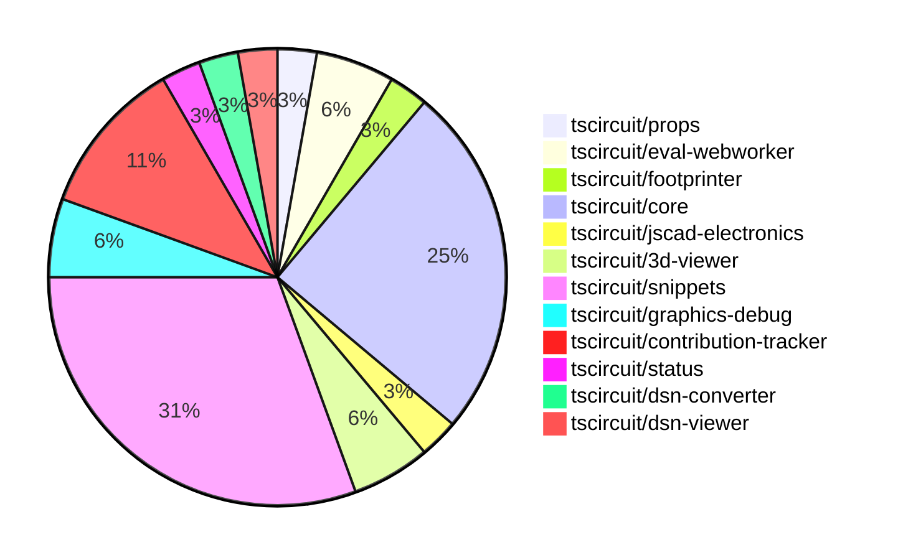

# Contribution Overview 2024-11-27

## PRs by Repository

## Contributor Overview

| Contributor | 🐳 Major | 🐙 Minor | 🐌 Tiny | ⭐ | Issues Created |
|-------------|---------|---------|---------|-----|----------------|
| [ShiboSoftwareDev](#ShiboSoftwareDev) | 2 | 4 | 3 | ⭐⭐ |
| [Anshgrover23](#Anshgrover23) | 0 | 6 | 0 | ⭐⭐ |
| [anas-sarkez](#anas-sarkez) | 1 | 3 | 0 | ⭐ |
| [mrudulpatil18](#mrudulpatil18) | 1 | 3 | 0 | ⭐ |
| [imrishabh18](#imrishabh18) | 0 | 4 | 0 | ⭐ |
| [Abse2001](#Abse2001) | 0 | 2 | 2 | ⭐ |
| [seveibar](#seveibar) | 0 | 2 | 0 | ⭐ |
| [divanshu-go](#divanshu-go) | 1 | 0 | 0 | ⭐ |
| [RohittCodes](#RohittCodes) | 0 | 1 | 0 |  |

## Review Table

| Contributor | Reviews Received | Approvals | Rejections | Changes Requested | PRs Opened | PRs Closed | Issues created |
|-------------|------------------|-----------|------------|-------------------|------------|------------|----------------|
| [Niharika0104](https://github.com/Niharika0104) | 1 | 1 | 0 | 0 | 1 | 0 | 0 |
| [seveibar](https://github.com/seveibar) | 1 | 0 | 1 | 0 | 3 | 2 | 0 |
| [anas-sarkez](https://github.com/anas-sarkez) | 10 | 5 | 3 | 3 | 7 | 6 | 0 |
| [Abse2001](https://github.com/Abse2001) | 6 | 4 | 2 | 1 | 5 | 4 | 0 |
| [mrudulpatil18](https://github.com/mrudulpatil18) | 9 | 4 | 1 | 1 | 6 | 5 | 0 |
| [ShiboSoftwareDev](https://github.com/ShiboSoftwareDev) | 9 | 8 | 5 | 0 | 11 | 10 | 0 |
| [Anshgrover23](https://github.com/Anshgrover23) | 12 | 5 | 4 | 5 | 10 | 9 | 0 |
| [imrishabh18](https://github.com/imrishabh18) | 2 | 2 | 1 | 0 | 4 | 4 | 0 |
| [divanshu-go](https://github.com/divanshu-go) | 4 | 2 | 0 | 1 | 2 | 1 | 0 |
| [RohittCodes](https://github.com/RohittCodes) | 7 | 1 | 4 | 4 | 5 | 2 | 0 |

## Changes by Repository

### [tscircuit/props](https://github.com/tscircuit/props)

| PR # | Impact | Contributor | Description |
|------|--------|-------------|-------------|
| [#109](https://github.com/tscircuit/props/pull/109) | 🐙 Minor | seveibar | Add `serverMode` option to the `AutorouterConfig` interface and its corresponding validation schema. |

### [tscircuit/eval-webworker](https://github.com/tscircuit/eval-webworker)

| PR # | Impact | Contributor | Description |
|------|--------|-------------|-------------|
| [#6](https://github.com/tscircuit/eval-webworker/pull/6) | 🐳 Major | mrudulpatil18 | Re-emits all events from the web worker through a global `WebWorkerEventEmitter` and updates the `on` method in the web worker API. |
| [#5](https://github.com/tscircuit/eval-webworker/pull/5) | 🐙 Minor | seveibar | Adds Workflows for format check, testing, and type checking, fixes a test, and publishes version 0.0.1. |

### [tscircuit/footprinter](https://github.com/tscircuit/footprinter)

| PR # | Impact | Contributor | Description |
|------|--------|-------------|-------------|
| [#86](https://github.com/tscircuit/footprinter/pull/86) | 🐳 Major | anas-sarkez | Refactor Stampboard and Stampreceiver functions to have separate pins for each SMD pad and hole. |

### [tscircuit/core](https://github.com/tscircuit/core)

| PR # | Impact | Contributor | Description |
|------|--------|-------------|-------------|
| [#362](https://github.com/tscircuit/core/pull/362) | 🟣 | anas-sarkez | Implemented a new event `renderable:renderLifecycle:anyEvent` to make it easier to listen to renderable events. |
| [#364](https://github.com/tscircuit/core/pull/364) | 🐳 Major | ShiboSoftwareDev | Adds support for the "rotated_rect" shape in the SmtPad component. |
| [#358](https://github.com/tscircuit/core/pull/358) | 🐙 Minor | anas-sarkez | Updated the `bun-match-svg` and `@tscircuit/footprinter` dependencies to their latest versions. |
| [#352](https://github.com/tscircuit/core/pull/352) | 🐙 Minor | anas-sarkez | Implemented `getCurrentRenderPhase` and `getRenderGraph` methods for debugging |
| [#355](https://github.com/tscircuit/core/pull/355) | 🐙 Minor | mrudulpatil18 | The pull request ensures that the component name passed as a prop takes precedence over the default name from the `useRedLed` hook, and it adds a test to verify this behavior. |
| [#369](https://github.com/tscircuit/core/pull/369) | 🐙 Minor | ShiboSoftwareDev | Adds a test case to ensure that 90-degree rotation of SMT pads on a PCB renders the expected shapes. |
| [#368](https://github.com/tscircuit/core/pull/368) | 🐙 Minor | ShiboSoftwareDev | Fixes a bug where rectangular SMT pads were not drawn correctly when the component was rotated by 90 degrees. |
| [#363](https://github.com/tscircuit/core/pull/363) | 🐙 Minor | Anshgrover23 | Fixes an issue where the bundle-size.yml file doesn't run on pull requests from forks. |
| [#367](https://github.com/tscircuit/core/pull/367) | 🐌 Tiny | Abse2001 | Disables two remote autorouting tests by skipping them. |

### [tscircuit/jscad-electronics](https://github.com/tscircuit/jscad-electronics)

| PR # | Impact | Contributor | Description |
|------|--------|-------------|-------------|
| [#81](https://github.com/tscircuit/jscad-electronics/pull/81) | 🐙 Minor | anas-sarkez | Implemented the `SOT235` (SOT-23-5) 3D component and added an example for the Footprinter3d component. |

### [tscircuit/3d-viewer](https://github.com/tscircuit/3d-viewer)

| PR # | Impact | Contributor | Description |
|------|--------|-------------|-------------|
| [#47](https://github.com/tscircuit/3d-viewer/pull/47) | 🐙 Minor | Abse2001 | Fixes misalignment in the 3D viewer components by updating the tooltip position calculation. |
| [#46](https://github.com/tscircuit/3d-viewer/pull/46) | 🐌 Tiny | Abse2001 | Update the version of the `jscad-electronics` dependency to `0.0.22`. |

### [tscircuit/snippets](https://github.com/tscircuit/snippets)

| PR # | Impact | Contributor | Description |
|------|--------|-------------|-------------|
| [#291](https://github.com/tscircuit/snippets/pull/291) | 🐳 Major | ShiboSoftwareDev | Adds a new GitHub Actions workflow to generate a bundle size report. |
| [#309](https://github.com/tscircuit/snippets/pull/309) | 🐙 Minor | Abse2001 | Updating the `@tscircuit/core` library to version `0.0.208` to fix an issue where components were not rendering when `pcbRotation="90"`. |
| [#311](https://github.com/tscircuit/snippets/pull/311) | 🐙 Minor | ShiboSoftwareDev | Optimize the bundle-size-analysis GitHub workflow to only run on dependency changes. |
| [#294](https://github.com/tscircuit/snippets/pull/294) | 🐙 Minor | ShiboSoftwareDev | The pull request adds a comparison of the bundle size between the current PR branch and the main branch, and generates a markdown report with the differences. |
| [#317](https://github.com/tscircuit/snippets/pull/317) | 🐙 Minor | Anshgrover23 | Fix Cmd Click functionality for clicking on snippets |
| [#302](https://github.com/tscircuit/snippets/pull/302) | 🐙 Minor | Anshgrover23 | Fixes a regex issue to properly import names with dashes in the package name. |
| [#303](https://github.com/tscircuit/snippets/pull/303) | 🐙 Minor | imrishabh18 | Adds a new development login page to the application. |
| [#298](https://github.com/tscircuit/snippets/pull/298) | 🐙 Minor | imrishabh18 | Fix an issue where the auth generate fails when not using `localhost`. |
| [#285](https://github.com/tscircuit/snippets/pull/285) | 🐙 Minor | RohittCodes | Adds a full-screen toggle button to the preview content component. |
| [#306](https://github.com/tscircuit/snippets/pull/306) | 🐌 Tiny | ShiboSoftwareDev | Updated the dependency for the `@tscircuit/3d-viewer` package from version `0.0.43` to `0.0.44`. |
| [#304](https://github.com/tscircuit/snippets/pull/304) | 🐌 Tiny | ShiboSoftwareDev | Removed an extra workflow file. |

### [tscircuit/graphics-debug](https://github.com/tscircuit/graphics-debug)

| PR # | Impact | Contributor | Description |
|------|--------|-------------|-------------|
| [#8](https://github.com/tscircuit/graphics-debug/pull/8) | 🐙 Minor | mrudulpatil18 | Fixes the issue with crosshair visibility on the website by adding a custom `SVGRenderer` component to handle SVGs generated with script correctly. |
| [#7](https://github.com/tscircuit/graphics-debug/pull/7) | 🐙 Minor | mrudulpatil18 | Adds a "See Example" button to the home page that loads sample graphics data into the input element for visualization. |

### [tscircuit/contribution-tracker](https://github.com/tscircuit/contribution-tracker)

| PR # | Impact | Contributor | Description |
|------|--------|-------------|-------------|
| [#13](https://github.com/tscircuit/contribution-tracker/pull/13) | 🐙 Minor | Anshgrover23 | Fixes the review table in the generated Markdown by adding a new column for "Issues Created" and updating the table format. |
| [#11](https://github.com/tscircuit/contribution-tracker/pull/11) | 🐙 Minor | Anshgrover23 | Fixes issues #7 and #9 by updating the review table layout and adding the "Issues Created" column. |
| [#12](https://github.com/tscircuit/contribution-tracker/pull/12) | 🐙 Minor | imrishabh18 | Reverts the "Fix review table" change. |
| [#14](https://github.com/tscircuit/contribution-tracker/pull/14) | 🐌 Tiny | ShiboSoftwareDev | Fixed the review table formatting in the generated Markdown file. |

### [tscircuit/status](https://github.com/tscircuit/status)

| PR # | Impact | Contributor | Description |
|------|--------|-------------|-------------|
| [#3](https://github.com/tscircuit/status/pull/3) | 🐙 Minor | Anshgrover23 | Fix bars getting cut off in the UI |

### [tscircuit/dsn-converter](https://github.com/tscircuit/dsn-converter)

| PR # | Impact | Contributor | Description |
|------|--------|-------------|-------------|
| [#36](https://github.com/tscircuit/dsn-converter/pull/36) | 🐙 Minor | imrishabh18 | Adds support for handling circle shape in padstack conversion and fixes an issue with null/undefined coordinates. |

### [tscircuit/dsn-viewer](https://github.com/tscircuit/dsn-viewer)

| PR # | Impact | Contributor | Description |
|------|--------|-------------|-------------|
| [#7](https://github.com/tscircuit/dsn-viewer/pull/7) | 🐳 Major | divanshu-go | Adds support for handling multiple drag and drop files and pasting of DSN content. |

## Changes by Contributor

### [seveibar](https://github.com/seveibar)

| PR # | Impact | Description |
|------|--------|-------------|
| [#109](https://github.com/tscircuit/props/pull/109) | 🐙 Minor | Add `serverMode` option to the `AutorouterConfig` interface and its corresponding validation schema. |
| [#5](https://github.com/tscircuit/eval-webworker/pull/5) | 🐙 Minor | Adds Workflows for format check, testing, and type checking, fixes a test, and publishes version 0.0.1. |

### [anas-sarkez](https://github.com/anas-sarkez)

| PR # | Impact | Description |
|------|--------|-------------|
| [#86](https://github.com/tscircuit/footprinter/pull/86) | 🐳 Major | Refactor Stampboard and Stampreceiver functions to have separate pins for each SMD pad and hole. |
| [#362](https://github.com/tscircuit/core/pull/362) | 🟣 | Implemented a new event `renderable:renderLifecycle:anyEvent` to make it easier to listen to renderable events. |
| [#358](https://github.com/tscircuit/core/pull/358) | 🐙 Minor | Updated the `bun-match-svg` and `@tscircuit/footprinter` dependencies to their latest versions. |
| [#352](https://github.com/tscircuit/core/pull/352) | 🐙 Minor | Implemented `getCurrentRenderPhase` and `getRenderGraph` methods for debugging |
| [#81](https://github.com/tscircuit/jscad-electronics/pull/81) | 🐙 Minor | Implemented the `SOT235` (SOT-23-5) 3D component and added an example for the Footprinter3d component. |

### [Abse2001](https://github.com/Abse2001)

| PR # | Impact | Description |
|------|--------|-------------|
| [#47](https://github.com/tscircuit/3d-viewer/pull/47) | 🐙 Minor | Fixes misalignment in the 3D viewer components by updating the tooltip position calculation. |
| [#309](https://github.com/tscircuit/snippets/pull/309) | 🐙 Minor | Updating the `@tscircuit/core` library to version `0.0.208` to fix an issue where components were not rendering when `pcbRotation="90"`. |
| [#46](https://github.com/tscircuit/3d-viewer/pull/46) | 🐌 Tiny | Update the version of the `jscad-electronics` dependency to `0.0.22`. |
| [#367](https://github.com/tscircuit/core/pull/367) | 🐌 Tiny | Disables two remote autorouting tests by skipping them. |

### [mrudulpatil18](https://github.com/mrudulpatil18)

| PR # | Impact | Description |
|------|--------|-------------|
| [#6](https://github.com/tscircuit/eval-webworker/pull/6) | 🐳 Major | Re-emits all events from the web worker through a global `WebWorkerEventEmitter` and updates the `on` method in the web worker API. |
| [#355](https://github.com/tscircuit/core/pull/355) | 🐙 Minor | The pull request ensures that the component name passed as a prop takes precedence over the default name from the `useRedLed` hook, and it adds a test to verify this behavior. |
| [#8](https://github.com/tscircuit/graphics-debug/pull/8) | 🐙 Minor | Fixes the issue with crosshair visibility on the website by adding a custom `SVGRenderer` component to handle SVGs generated with script correctly. |
| [#7](https://github.com/tscircuit/graphics-debug/pull/7) | 🐙 Minor | Adds a "See Example" button to the home page that loads sample graphics data into the input element for visualization. |

### [ShiboSoftwareDev](https://github.com/ShiboSoftwareDev)

| PR # | Impact | Description |
|------|--------|-------------|
| [#364](https://github.com/tscircuit/core/pull/364) | 🐳 Major | Adds support for the "rotated_rect" shape in the SmtPad component. |
| [#291](https://github.com/tscircuit/snippets/pull/291) | 🐳 Major | Adds a new GitHub Actions workflow to generate a bundle size report. |
| [#369](https://github.com/tscircuit/core/pull/369) | 🐙 Minor | Adds a test case to ensure that 90-degree rotation of SMT pads on a PCB renders the expected shapes. |
| [#368](https://github.com/tscircuit/core/pull/368) | 🐙 Minor | Fixes a bug where rectangular SMT pads were not drawn correctly when the component was rotated by 90 degrees. |
| [#311](https://github.com/tscircuit/snippets/pull/311) | 🐙 Minor | Optimize the bundle-size-analysis GitHub workflow to only run on dependency changes. |
| [#294](https://github.com/tscircuit/snippets/pull/294) | 🐙 Minor | The pull request adds a comparison of the bundle size between the current PR branch and the main branch, and generates a markdown report with the differences. |
| [#14](https://github.com/tscircuit/contribution-tracker/pull/14) | 🐌 Tiny | Fixed the review table formatting in the generated Markdown file. |
| [#306](https://github.com/tscircuit/snippets/pull/306) | 🐌 Tiny | Updated the dependency for the `@tscircuit/3d-viewer` package from version `0.0.43` to `0.0.44`. |
| [#304](https://github.com/tscircuit/snippets/pull/304) | 🐌 Tiny | Removed an extra workflow file. |

### [Anshgrover23](https://github.com/Anshgrover23)

| PR # | Impact | Description |
|------|--------|-------------|
| [#363](https://github.com/tscircuit/core/pull/363) | 🐙 Minor | Fixes an issue where the bundle-size.yml file doesn't run on pull requests from forks. |
| [#13](https://github.com/tscircuit/contribution-tracker/pull/13) | 🐙 Minor | Fixes the review table in the generated Markdown by adding a new column for "Issues Created" and updating the table format. |
| [#11](https://github.com/tscircuit/contribution-tracker/pull/11) | 🐙 Minor | Fixes issues #7 and #9 by updating the review table layout and adding the "Issues Created" column. |
| [#317](https://github.com/tscircuit/snippets/pull/317) | 🐙 Minor | Fix Cmd Click functionality for clicking on snippets |
| [#302](https://github.com/tscircuit/snippets/pull/302) | 🐙 Minor | Fixes a regex issue to properly import names with dashes in the package name. |
| [#3](https://github.com/tscircuit/status/pull/3) | 🐙 Minor | Fix bars getting cut off in the UI |

### [imrishabh18](https://github.com/imrishabh18)

| PR # | Impact | Description |
|------|--------|-------------|
| [#12](https://github.com/tscircuit/contribution-tracker/pull/12) | 🐙 Minor | Reverts the "Fix review table" change. |
| [#36](https://github.com/tscircuit/dsn-converter/pull/36) | 🐙 Minor | Adds support for handling circle shape in padstack conversion and fixes an issue with null/undefined coordinates. |
| [#303](https://github.com/tscircuit/snippets/pull/303) | 🐙 Minor | Adds a new development login page to the application. |
| [#298](https://github.com/tscircuit/snippets/pull/298) | 🐙 Minor | Fix an issue where the auth generate fails when not using `localhost`. |

### [RohittCodes](https://github.com/RohittCodes)

| PR # | Impact | Description |
|------|--------|-------------|
| [#285](https://github.com/tscircuit/snippets/pull/285) | 🐙 Minor | Adds a full-screen toggle button to the preview content component. |

### [divanshu-go](https://github.com/divanshu-go)

| PR # | Impact | Description |
|------|--------|-------------|
| [#7](https://github.com/tscircuit/dsn-viewer/pull/7) | 🐳 Major | Adds support for handling multiple drag and drop files and pasting of DSN content. |

