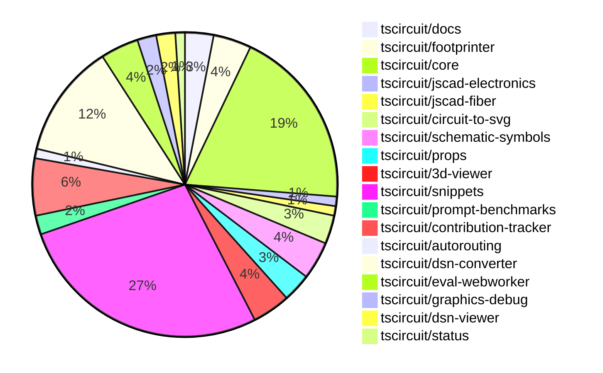

# Contribution Overview 2024-11-27

## PRs by Repository

## Contributor Overview

| Contributor | 🐳 Major | 🐙 Minor | 🐌 Tiny | ⭐ | Issues Created |
|-------------|---------|---------|---------|-----|----------------|
| [ShiboSoftwareDev](#ShiboSoftwareDev) | 3 | 10 | 6 | 👑 | 10 |
| [imrishabh18](#imrishabh18) | 4 | 10 | 0 | ⭐⭐⭐ | 13 |
| [AnasSarkiz](#AnasSarkiz) | 4 | 10 | 0 | ⭐⭐⭐ | 5 |
| [Abse2001](#Abse2001) | 2 | 9 | 2 | ⭐⭐⭐ | 4 |
| [seveibar](#seveibar) | 1 | 6 | 1 | ⭐⭐⭐ | 98 |
| [Anshgrover23](#Anshgrover23) | 0 | 11 | 0 | ⭐⭐ | 4 |
| [mrudulpatil18](#mrudulpatil18) | 1 | 7 | 0 | ⭐⭐ | 3 |
| [RohittCodes](#RohittCodes) | 0 | 5 | 0 | ⭐ | 1 |
| [divanshu-go](#divanshu-go) | 2 | 0 | 0 | ⭐ | 0 |
| [techmannih](#techmannih) | 0 | 2 | 0 | ⭐ | 1 |
| [Niharika0104](#Niharika0104) | 0 | 1 | 0 |  | 0 |

## Review Table

| Contributor | Reviews Received | Approvals | Rejections | Changes Requested | PRs Opened | PRs Closed | Issues Created | Bountied Issues | Bountied Issue $ |
|-------------|------------------|-----------|------------|-------------------|------------|------------|----------------|-----------------|------------------|
| [samyakshah3008](https://github.com/samyakshah3008) | 0 | 0 | 0 | 0 | 1 | 0 | 1 | 1 | 1 |
| [AnasSarkiz](https://github.com/AnasSarkiz) | 33 | 12 | 7 | 6 | 16 | 15 | 5 | 2 | 15 |
| [techmannih](https://github.com/techmannih) | 6 | 2 | 2 | 1 | 5 | 3 | 1 | 0 | 0 |
| [Niharika0104](https://github.com/Niharika0104) | 1 | 1 | 0 | 0 | 1 | 1 | 0 | 0 | 0 |
| [Abse2001](https://github.com/Abse2001) | 21 | 12 | 4 | 2 | 13 | 13 | 4 | 3 | 57 |
| [ShiboSoftwareDev](https://github.com/ShiboSoftwareDev) | 28 | 18 | 5 | 3 | 21 | 21 | 10 | 4 | 80 |
| [seveibar](https://github.com/seveibar) | 1 | 0 | 2 | 0 | 11 | 9 | 98 | 57 | 1,348 |
| [UdaykiranRegimudi](https://github.com/UdaykiranRegimudi) | 2 | 0 | 0 | 2 | 1 | 0 | 0 | 0 | 0 |
| [RohittCodes](https://github.com/RohittCodes) | 15 | 5 | 4 | 5 | 9 | 7 | 1 | 1 | 5 |
| [Anshgrover23](https://github.com/Anshgrover23) | 40 | 13 | 6 | 9 | 17 | 16 | 4 | 0 | 0 |
| [mrudulpatil18](https://github.com/mrudulpatil18) | 13 | 8 | 0 | 1 | 9 | 9 | 3 | 0 | 0 |
| [divanshu-go](https://github.com/divanshu-go) | 5 | 2 | 1 | 2 | 3 | 2 | 0 | 0 | 0 |
| [imrishabh18](https://github.com/imrishabh18) | 4 | 4 | 4 | 0 | 14 | 14 | 13 | 3 | 70 |
| [krushnarout](https://github.com/krushnarout) | 5 | 0 | 0 | 3 | 1 | 0 | 0 | 0 | 0 |

## Changes by Repository

### [tscircuit/docs](https://github.com/tscircuit/docs)

| PR # | Impact | Contributor | Description |
|------|--------|-------------|-------------|
| [#43](https://github.com/tscircuit/docs/pull/43) | 🐳 Major | AnasSarkiz | Added a new tutorial for the ESP32-D0WD development circuit, including a schematic and component details. |
| [#40](https://github.com/tscircuit/docs/pull/40) | 🐙 Minor | Niharika0104 | Added a new tutorial for an AND gate circuit. |
| [#41](https://github.com/tscircuit/docs/pull/41) | 🐙 Minor | Abse2001 | Added a tutorial for an OR gate logic circuit with USB-C power, push buttons, and multiple LEDs. |

### [tscircuit/footprinter](https://github.com/tscircuit/footprinter)

| PR # | Impact | Contributor | Description |
|------|--------|-------------|-------------|
| [#86](https://github.com/tscircuit/footprinter/pull/86) | 🐳 Major | AnasSarkiz | Refactored Stampboard and Stampreceiver functions to have separate pins for each SMD pad and hole. |
| [#92](https://github.com/tscircuit/footprinter/pull/92) | 🐙 Minor | AnasSarkiz | Added default values of 2 for top and bottom properties in stampboard and stampreceiver components. |
| [#87](https://github.com/tscircuit/footprinter/pull/87) | 🐙 Minor | AnasSarkiz | Rearranged the positions of the pins on the sot23-5 component to match the data sheet order in an anti-clockwise direction. |
| [#94](https://github.com/tscircuit/footprinter/pull/94) | 🐙 Minor | ShiboSoftwareDev | Updated dependencies to use "circuit-json" instead of "@tscircuit/soup" |

### [tscircuit/core](https://github.com/tscircuit/core)

| PR # | Impact | Contributor | Description |
|------|--------|-------------|-------------|
| [#376](https://github.com/tscircuit/core/pull/376) | 🐳 Major | AnasSarkiz | Adds support for `root.schematicDisabled` to skip rendering all schematic components. |
| [#362](https://github.com/tscircuit/core/pull/362) | 🐳 Major | AnasSarkiz | Implemented a new event `renderable:renderLifecycle:anyEvent` to make it easier to listen to renderable events. |
| [#381](https://github.com/tscircuit/core/pull/381) | 🐳 Major | Abse2001 | Adds a new feature `schDisplayLabel` prop for the `<trace />` component and includes a test for it. |
| [#373](https://github.com/tscircuit/core/pull/373) | 🐳 Major | seveibar |  |
| [#379](https://github.com/tscircuit/core/pull/379) | 🐙 Minor | AnasSarkiz | Removed schematic text logic from `Jumper.ts` |
| [#378](https://github.com/tscircuit/core/pull/378) | 🐙 Minor | AnasSarkiz | Moved the logic for rendering schematic text to a shared function `SchematicComponentRenderWithSchematicBoxDimensions`. |
| [#358](https://github.com/tscircuit/core/pull/358) | 🐙 Minor | AnasSarkiz | Updated the footprinter dependency to the newest version. |
| [#352](https://github.com/tscircuit/core/pull/352) | 🐙 Minor | AnasSarkiz | Implemented `getCurrentRenderPhase` and `getRenderGraph` methods for debugging |
| [#396](https://github.com/tscircuit/core/pull/396) | 🐙 Minor | Abse2001 | Fixing the JSX type module for React 19 types |
| [#394](https://github.com/tscircuit/core/pull/394) | 🐙 Minor | ShiboSoftwareDev | Updated the @tscircuit/footprinter dependency to version 0.0.92 |
| [#369](https://github.com/tscircuit/core/pull/369) | 🐙 Minor | ShiboSoftwareDev | Added a test to ensure that 90-degree rotation of SMT pads draws normal rectangular shapes. |
| [#368](https://github.com/tscircuit/core/pull/368) | 🐙 Minor | ShiboSoftwareDev | Fixes a bug where SMT pads are not drawn correctly when the component rotation is 90 degrees. |
| [#364](https://github.com/tscircuit/core/pull/364) | 🐙 Minor | ShiboSoftwareDev | Adds support for the "rotated_rect" shape in the SmtPad component. |
| [#374](https://github.com/tscircuit/core/pull/374) | 🐙 Minor | seveibar | Changes the HTTP request method from GET to POST for fetching autorouting job information and output, and updates the request payload to include the job ID in the request body instead of the query parameters. |
| [#355](https://github.com/tscircuit/core/pull/355) | 🐙 Minor | mrudulpatil18 | The pull request ensures that the name passed when using the component takes precedence over the default name from the `useRedLed` hook, and it adds a test to verify this behavior. |
| [#363](https://github.com/tscircuit/core/pull/363) | 🐙 Minor | Anshgrover23 | Fix the `bundle-size.yml` workflow to run on pull requests from forks. |
| [#367](https://github.com/tscircuit/core/pull/367) | 🐌 Tiny | Abse2001 | Skips two tests related to remote autorouting due to an issue with the USB-C GND and VBUS route. |
| [#395](https://github.com/tscircuit/core/pull/395) | 🐌 Tiny | ShiboSoftwareDev | Update dependencies in the package.json file |
| [#393](https://github.com/tscircuit/core/pull/393) | 🐌 Tiny | ShiboSoftwareDev | Update dependencies in the package.json file. |

### [tscircuit/jscad-electronics](https://github.com/tscircuit/jscad-electronics)

| PR # | Impact | Contributor | Description |
|------|--------|-------------|-------------|
| [#81](https://github.com/tscircuit/jscad-electronics/pull/81) | 🐙 Minor | AnasSarkiz | Implemented the `SOT235` (SOT-23-5) 3D component and added an example for the Footprinter3d component. |

### [tscircuit/jscad-fiber](https://github.com/tscircuit/jscad-fiber)

| PR # | Impact | Contributor | Description |
|------|--------|-------------|-------------|
| [#95](https://github.com/tscircuit/jscad-fiber/pull/95) | 🐙 Minor | AnasSarkiz | The pull request improves the usage documentation by adding README examples for each component. |

### [tscircuit/circuit-to-svg](https://github.com/tscircuit/circuit-to-svg)

| PR # | Impact | Contributor | Description |
|------|--------|-------------|-------------|
| [#140](https://github.com/tscircuit/circuit-to-svg/pull/140) | 🐳 Major | divanshu-go | Adds a GitHub Actions workflow to calculate and report the bundle and install size differences between the base branch and the pull request branch. |
| [#142](https://github.com/tscircuit/circuit-to-svg/pull/142) | 🐙 Minor | AnasSarkiz | Added metadata attributes and a `<g>` wrapper for draggable schematic components. |
| [#143](https://github.com/tscircuit/circuit-to-svg/pull/143) | 🐙 Minor | ShiboSoftwareDev | Update dependencies to newer versions |

### [tscircuit/schematic-symbols](https://github.com/tscircuit/schematic-symbols)

| PR # | Impact | Contributor | Description |
|------|--------|-------------|-------------|
| [#221](https://github.com/tscircuit/schematic-symbols/pull/221) | 🐳 Major | Abse2001 | Added support for right, left, top, and bottom orientations of the boxresistor symbol, and fixed the anchor position. |
| [#217](https://github.com/tscircuit/schematic-symbols/pull/217) | 🐙 Minor | AnasSarkiz | Added inductor symbols in four directions (left, down, right, up) instead of just horizontal and vertical. |
| [#222](https://github.com/tscircuit/schematic-symbols/pull/222) | 🐙 Minor | Anshgrover23 | Adds a script to validate the existence of SVG snapshots and a pre-commit hook to run the validation. |
| [#219](https://github.com/tscircuit/schematic-symbols/pull/219) | 🐌 Tiny | Abse2001 | Adjusted the coordinates of the REF and VAL text elements for the capacitor symbol. |

### [tscircuit/props](https://github.com/tscircuit/props)

| PR # | Impact | Contributor | Description |
|------|--------|-------------|-------------|
| [#110](https://github.com/tscircuit/props/pull/110) | 🐙 Minor | Abse2001 | Added a new optional `schDisplayLabel` prop to the `trace` component. |
| [#111](https://github.com/tscircuit/props/pull/111) | 🐙 Minor | ShiboSoftwareDev | Converts the build output to ESM (ECMAScript Modules) format. |
| [#109](https://github.com/tscircuit/props/pull/109) | 🐙 Minor | seveibar | Add `serverMode` option to `AutorouterConfig` interface and schema. |

### [tscircuit/3d-viewer](https://github.com/tscircuit/3d-viewer)

| PR # | Impact | Contributor | Description |
|------|--------|-------------|-------------|
| [#47](https://github.com/tscircuit/3d-viewer/pull/47) | 🐙 Minor | Abse2001 | Fixes misaligned 3D viewer components by updating the tooltip position calculation. |
| [#52](https://github.com/tscircuit/3d-viewer/pull/52) | 🐙 Minor | Abse2001 | Fixed a bug where tooltips were popping up excessively in the 3D viewer. |
| [#50](https://github.com/tscircuit/3d-viewer/pull/50) | 🐙 Minor | Abse2001 | Fixed an issue where the bottom trace between vias was not showing, and added a test to ensure the fix works. |
| [#46](https://github.com/tscircuit/3d-viewer/pull/46) | 🐙 Minor | Abse2001 | Updates the `jscad-electronics` dependency to version `0.0.22` which likely includes a change to the `or gate` snippet. |

### [tscircuit/snippets](https://github.com/tscircuit/snippets)

| PR # | Impact | Contributor | Description |
|------|--------|-------------|-------------|
| [#294](https://github.com/tscircuit/snippets/pull/294) | 🐳 Major | ShiboSoftwareDev | The pull request analyzes the bundle size difference between the current branch and the main branch, and generates a detailed markdown report with the changes. |
| [#291](https://github.com/tscircuit/snippets/pull/291) | 🐳 Major | ShiboSoftwareDev | Adds a new GitHub Actions workflow to generate a bundle size report for pull requests. |
| [#356](https://github.com/tscircuit/snippets/pull/356) | 🐙 Minor | Abse2001 | Updated the version of the `@tscircuit/core` dependency from `0.0.217` to `0.0.219`. |
| [#309](https://github.com/tscircuit/snippets/pull/309) | 🐙 Minor | Abse2001 | Updating the `@tscircuit/core` library from version `0.0.206` to `0.0.208` to fix an issue where components were not rendering when `pcbRotation="90"`. |
| [#339](https://github.com/tscircuit/snippets/pull/339) | 🟣 | ShiboSoftwareDev | Automatically runs the code whenever the editor is entered. |
| [#332](https://github.com/tscircuit/snippets/pull/332) | 🐙 Minor | ShiboSoftwareDev | Fixed test flakyness by using a deterministic port generation instead of random. |
| [#311](https://github.com/tscircuit/snippets/pull/311) | 🐙 Minor | ShiboSoftwareDev | Modifies the bundle-size-analysis workflow to only run on changes to the package.json and bun.lockb files. |
| [#358](https://github.com/tscircuit/snippets/pull/358) | 🐙 Minor | seveibar | Update the `dsn-converter` package version and add it to the autoupdate list in `renovate.json`. |
| [#355](https://github.com/tscircuit/snippets/pull/355) | 🐙 Minor | seveibar | Adds a new dialog component to view the TypeScript files used in the code editor. |
| [#325](https://github.com/tscircuit/snippets/pull/325) | 🐙 Minor | seveibar | Update the core dependency and fix the expand button |
| [#330](https://github.com/tscircuit/snippets/pull/330) | 🐙 Minor | mrudulpatil18 | Added static skeleton page with fixed data |
| [#318](https://github.com/tscircuit/snippets/pull/318) | 🐙 Minor | mrudulpatil18 | Adds a Playwright test to verify that imports are underlined and clickable in the editor. |
| [#351](https://github.com/tscircuit/snippets/pull/351) | 🐙 Minor | Anshgrover23 | Fixes the regular expression to support underscores in the package names. |
| [#317](https://github.com/tscircuit/snippets/pull/317) | 🐙 Minor | Anshgrover23 | Fix Cmd Click functionality for clicking on code snippets |
| [#302](https://github.com/tscircuit/snippets/pull/302) | 🐙 Minor | Anshgrover23 | Fix regular expression to properly import names with dashes |
| [#303](https://github.com/tscircuit/snippets/pull/303) | 🐙 Minor | imrishabh18 | Adds a new development login page to the application. |
| [#298](https://github.com/tscircuit/snippets/pull/298) | 🐙 Minor | imrishabh18 | Fixes an issue where the auth generate fails when not using `localhost` by replacing `127.0.0.1` with `localhost` in the redirect URL. |
| [#350](https://github.com/tscircuit/snippets/pull/350) | 🐙 Minor | techmannih | Add retries for flaky test |
| [#338](https://github.com/tscircuit/snippets/pull/338) | 🐙 Minor | techmannih | Disables multiple cursors when ctrl+click is triggered. |
| [#327](https://github.com/tscircuit/snippets/pull/327) | 🐙 Minor | RohittCodes | Expands the preview content to fill the full available height of the container, with a minimum height of 300px. |
| [#307](https://github.com/tscircuit/snippets/pull/307) | 🐙 Minor | RohittCodes | Refactor the search links functionality to open in a new tab or the same tab based on the current location. |
| [#297](https://github.com/tscircuit/snippets/pull/297) | 🐙 Minor | RohittCodes | Added a timeout and introduced a finally block to the rename snippet dialog. |
| [#341](https://github.com/tscircuit/snippets/pull/341) | 🐙 Minor | RohittCodes | Increased the timeout for the playwright-test workflow from 5 minutes to 10 minutes. |
| [#285](https://github.com/tscircuit/snippets/pull/285) | 🐙 Minor | RohittCodes | Implements a feature to expand the code preview to full screen. |
| [#306](https://github.com/tscircuit/snippets/pull/306) | 🐌 Tiny | ShiboSoftwareDev | Updated the `@tscircuit/3d-viewer` dependency from version `0.0.43` to `0.0.44`. |
| [#304](https://github.com/tscircuit/snippets/pull/304) | 🐌 Tiny | ShiboSoftwareDev | Removed an extra workflow file for bundle size analysis. |
| [#357](https://github.com/tscircuit/snippets/pull/357) | 🐌 Tiny | seveibar | Update Playwright snapshots |

### [tscircuit/prompt-benchmarks](https://github.com/tscircuit/prompt-benchmarks)

| PR # | Impact | Contributor | Description |
|------|--------|-------------|-------------|
| [#9](https://github.com/tscircuit/prompt-benchmarks/pull/9) | 🐳 Major | ShiboSoftwareDev | Adds a new benchmarking tool called "evalite" to the project, which can be used to evaluate the performance of AI-generated code for various electronic circuit design problems. |
| [#8](https://github.com/tscircuit/prompt-benchmarks/pull/8) | 🐙 Minor | ShiboSoftwareDev | The pull request adds new benchmark problems for creating electronic circuits using a 555 timer, LED driver, low-pass filter, and astable multivibrator. |

### [tscircuit/contribution-tracker](https://github.com/tscircuit/contribution-tracker)

| PR # | Impact | Contributor | Description |
|------|--------|-------------|-------------|
| [#20](https://github.com/tscircuit/contribution-tracker/pull/20) | 🐙 Minor | Anshgrover23 | Adds the number of bountied issues created by each contributor as a new star factor. |
| [#17](https://github.com/tscircuit/contribution-tracker/pull/17) | 🐙 Minor | Anshgrover23 | Adds functionality to detect the number of issues created that have a bounty. |
| [#13](https://github.com/tscircuit/contribution-tracker/pull/13) | 🐙 Minor | Anshgrover23 | Fixes the review table in the generated markdown |
| [#11](https://github.com/tscircuit/contribution-tracker/pull/11) | 🐙 Minor | Anshgrover23 | Fixes the layout and formatting of the review table in the pull request. |
| [#12](https://github.com/tscircuit/contribution-tracker/pull/12) | 🐙 Minor | imrishabh18 | Reverts the previous commit "Fix review table" |
| [#14](https://github.com/tscircuit/contribution-tracker/pull/14) | 🐌 Tiny | ShiboSoftwareDev | Fixed the formatting of the review table in the generated Markdown. |

### [tscircuit/autorouting](https://github.com/tscircuit/autorouting)

| PR # | Impact | Contributor | Description |
|------|--------|-------------|-------------|
| [#95](https://github.com/tscircuit/autorouting/pull/95) | 🐌 Tiny | ShiboSoftwareDev | Updated the dependencies in the project. |

### [tscircuit/dsn-converter](https://github.com/tscircuit/dsn-converter)

| PR # | Impact | Contributor | Description |
|------|--------|-------------|-------------|
| [#53](https://github.com/tscircuit/dsn-converter/pull/53) | 🐳 Major | imrishabh18 | Refactor the plated-holes and smtpads handling in the PCB conversion process. |
| [#52](https://github.com/tscircuit/dsn-converter/pull/52) | 🐳 Major | imrishabh18 | Refactor padstack name and padstack shape |
| [#47](https://github.com/tscircuit/dsn-converter/pull/47) | 🐳 Major | imrishabh18 | Adds support for pill-shaped plated holes in the PCB design. |
| [#37](https://github.com/tscircuit/dsn-converter/pull/37) | 🐳 Major | imrishabh18 | Add the ability to process vias and wire segments together in the DSN to circuit-json conversion process. |
| [#39](https://github.com/tscircuit/dsn-converter/pull/39) | 🐙 Minor | seveibar | Correctly size plated holes for homogenous components |
| [#51](https://github.com/tscircuit/dsn-converter/pull/51) | 🐙 Minor | imrishabh18 | Fix rotation and footprint naming for components |
| [#49](https://github.com/tscircuit/dsn-converter/pull/49) | 🐙 Minor | imrishabh18 | Fix the position of pads in the `registry-api` traces. |
| [#46](https://github.com/tscircuit/dsn-converter/pull/46) | 🐙 Minor | imrishabh18 | Fixes handling of plated holes with different sizes by grouping them by dimensions and adding unique padstacks. |
| [#45](https://github.com/tscircuit/dsn-converter/pull/45) | 🐙 Minor | imrishabh18 | Refactor the code to remove the separate processing of chip components. |
| [#43](https://github.com/tscircuit/dsn-converter/pull/43) | 🐙 Minor | imrishabh18 | Fix the hardcoded size of SMTPADS and use the default trace width from the circuit JSON instead. |
| [#38](https://github.com/tscircuit/dsn-converter/pull/38) | 🐙 Minor | imrishabh18 | Adds the `from_layer` and `to_layer` properties to the output object in the `convert-via-to-pcb-via.ts` function. |
| [#36](https://github.com/tscircuit/dsn-converter/pull/36) | 🐙 Minor | imrishabh18 | Fixes an issue where the circle shape was missing, causing the x and y coordinates to be null. |

### [tscircuit/eval-webworker](https://github.com/tscircuit/eval-webworker)

| PR # | Impact | Contributor | Description |
|------|--------|-------------|-------------|
| [#5](https://github.com/tscircuit/eval-webworker/pull/5) | 🟣 | seveibar | Add Workflows, Fix Test, Publish v0.0.1 |
| [#6](https://github.com/tscircuit/eval-webworker/pull/6) | 🐳 Major | mrudulpatil18 | Re-emit all events from the web worker to the main thread. |
| [#10](https://github.com/tscircuit/eval-webworker/pull/10) | 🐙 Minor | mrudulpatil18 | Configure the build process to generate declaration files. |
| [#8](https://github.com/tscircuit/eval-webworker/pull/8) | 🐙 Minor | mrudulpatil18 | Adds a build step to the release workflow to ensure the project builds before publishing. |

### [tscircuit/graphics-debug](https://github.com/tscircuit/graphics-debug)

| PR # | Impact | Contributor | Description |
|------|--------|-------------|-------------|
| [#8](https://github.com/tscircuit/graphics-debug/pull/8) | 🐙 Minor | mrudulpatil18 | Fixes the issue of crosshair visibility on the website by adding a custom `SVGRenderer` component to handle SVGs generated with script (for crosshair) correctly. |
| [#7](https://github.com/tscircuit/graphics-debug/pull/7) | 🐙 Minor | mrudulpatil18 | Added a "See Example" button to load sample graphics data into the input element for visualization. |

### [tscircuit/dsn-viewer](https://github.com/tscircuit/dsn-viewer)

| PR # | Impact | Contributor | Description |
|------|--------|-------------|-------------|
| [#7](https://github.com/tscircuit/dsn-viewer/pull/7) | 🐳 Major | divanshu-go | Adds support for multiple file uploads and handling of both DSN PCB and session files. |
| [#8](https://github.com/tscircuit/dsn-viewer/pull/8) | 🐙 Minor | Anshgrover23 | Set up a basic playwright test to take a screenshot of the DSN viewer website after clicking the "Open Example" button. |

### [tscircuit/status](https://github.com/tscircuit/status)

| PR # | Impact | Contributor | Description |
|------|--------|-------------|-------------|
| [#3](https://github.com/tscircuit/status/pull/3) | 🐙 Minor | Anshgrover23 | Fix a bug where bars were getting cut off in the UI. |

## Changes by Contributor

### [AnasSarkiz](https://github.com/AnasSarkiz)

| PR # | Impact | Description |
|------|--------|-------------|
| [#43](https://github.com/tscircuit/docs/pull/43) | 🐳 Major | Added a new tutorial for the ESP32-D0WD development circuit, including a schematic and component details. |
| [#86](https://github.com/tscircuit/footprinter/pull/86) | 🐳 Major | Refactored Stampboard and Stampreceiver functions to have separate pins for each SMD pad and hole. |
| [#376](https://github.com/tscircuit/core/pull/376) | 🐳 Major | Adds support for `root.schematicDisabled` to skip rendering all schematic components. |
| [#362](https://github.com/tscircuit/core/pull/362) | 🐳 Major | Implemented a new event `renderable:renderLifecycle:anyEvent` to make it easier to listen to renderable events. |
| [#92](https://github.com/tscircuit/footprinter/pull/92) | 🐙 Minor | Added default values of 2 for top and bottom properties in stampboard and stampreceiver components. |
| [#87](https://github.com/tscircuit/footprinter/pull/87) | 🐙 Minor | Rearranged the positions of the pins on the sot23-5 component to match the data sheet order in an anti-clockwise direction. |
| [#379](https://github.com/tscircuit/core/pull/379) | 🐙 Minor | Removed schematic text logic from `Jumper.ts` |
| [#378](https://github.com/tscircuit/core/pull/378) | 🐙 Minor | Moved the logic for rendering schematic text to a shared function `SchematicComponentRenderWithSchematicBoxDimensions`. |
| [#358](https://github.com/tscircuit/core/pull/358) | 🐙 Minor | Updated the footprinter dependency to the newest version. |
| [#352](https://github.com/tscircuit/core/pull/352) | 🐙 Minor | Implemented `getCurrentRenderPhase` and `getRenderGraph` methods for debugging |
| [#81](https://github.com/tscircuit/jscad-electronics/pull/81) | 🐙 Minor | Implemented the `SOT235` (SOT-23-5) 3D component and added an example for the Footprinter3d component. |
| [#95](https://github.com/tscircuit/jscad-fiber/pull/95) | 🐙 Minor | The pull request improves the usage documentation by adding README examples for each component. |
| [#142](https://github.com/tscircuit/circuit-to-svg/pull/142) | 🐙 Minor | Added metadata attributes and a `<g>` wrapper for draggable schematic components. |
| [#217](https://github.com/tscircuit/schematic-symbols/pull/217) | 🐙 Minor | Added inductor symbols in four directions (left, down, right, up) instead of just horizontal and vertical. |

### [Niharika0104](https://github.com/Niharika0104)

| PR # | Impact | Description |
|------|--------|-------------|
| [#40](https://github.com/tscircuit/docs/pull/40) | 🐙 Minor | Added a new tutorial for an AND gate circuit. |

### [Abse2001](https://github.com/Abse2001)

| PR # | Impact | Description |
|------|--------|-------------|
| [#381](https://github.com/tscircuit/core/pull/381) | 🐳 Major | Adds a new feature `schDisplayLabel` prop for the `<trace />` component and includes a test for it. |
| [#221](https://github.com/tscircuit/schematic-symbols/pull/221) | 🐳 Major | Added support for right, left, top, and bottom orientations of the boxresistor symbol, and fixed the anchor position. |
| [#41](https://github.com/tscircuit/docs/pull/41) | 🐙 Minor | Added a tutorial for an OR gate logic circuit with USB-C power, push buttons, and multiple LEDs. |
| [#110](https://github.com/tscircuit/props/pull/110) | 🐙 Minor | Added a new optional `schDisplayLabel` prop to the `trace` component. |
| [#47](https://github.com/tscircuit/3d-viewer/pull/47) | 🐙 Minor | Fixes misaligned 3D viewer components by updating the tooltip position calculation. |
| [#52](https://github.com/tscircuit/3d-viewer/pull/52) | 🐙 Minor | Fixed a bug where tooltips were popping up excessively in the 3D viewer. |
| [#50](https://github.com/tscircuit/3d-viewer/pull/50) | 🐙 Minor | Fixed an issue where the bottom trace between vias was not showing, and added a test to ensure the fix works. |
| [#46](https://github.com/tscircuit/3d-viewer/pull/46) | 🐙 Minor | Updates the `jscad-electronics` dependency to version `0.0.22` which likely includes a change to the `or gate` snippet. |
| [#396](https://github.com/tscircuit/core/pull/396) | 🐙 Minor | Fixing the JSX type module for React 19 types |
| [#356](https://github.com/tscircuit/snippets/pull/356) | 🐙 Minor | Updated the version of the `@tscircuit/core` dependency from `0.0.217` to `0.0.219`. |
| [#309](https://github.com/tscircuit/snippets/pull/309) | 🐙 Minor | Updating the `@tscircuit/core` library from version `0.0.206` to `0.0.208` to fix an issue where components were not rendering when `pcbRotation="90"`. |
| [#367](https://github.com/tscircuit/core/pull/367) | 🐌 Tiny | Skips two tests related to remote autorouting due to an issue with the USB-C GND and VBUS route. |
| [#219](https://github.com/tscircuit/schematic-symbols/pull/219) | 🐌 Tiny | Adjusted the coordinates of the REF and VAL text elements for the capacitor symbol. |

### [ShiboSoftwareDev](https://github.com/ShiboSoftwareDev)

| PR # | Impact | Description |
|------|--------|-------------|
| [#294](https://github.com/tscircuit/snippets/pull/294) | 🐳 Major | The pull request analyzes the bundle size difference between the current branch and the main branch, and generates a detailed markdown report with the changes. |
| [#291](https://github.com/tscircuit/snippets/pull/291) | 🐳 Major | Adds a new GitHub Actions workflow to generate a bundle size report for pull requests. |
| [#9](https://github.com/tscircuit/prompt-benchmarks/pull/9) | 🐳 Major | Adds a new benchmarking tool called "evalite" to the project, which can be used to evaluate the performance of AI-generated code for various electronic circuit design problems. |
| [#111](https://github.com/tscircuit/props/pull/111) | 🐙 Minor | Converts the build output to ESM (ECMAScript Modules) format. |
| [#94](https://github.com/tscircuit/footprinter/pull/94) | 🐙 Minor | Updated dependencies to use "circuit-json" instead of "@tscircuit/soup" |
| [#394](https://github.com/tscircuit/core/pull/394) | 🐙 Minor | Updated the @tscircuit/footprinter dependency to version 0.0.92 |
| [#369](https://github.com/tscircuit/core/pull/369) | 🐙 Minor | Added a test to ensure that 90-degree rotation of SMT pads draws normal rectangular shapes. |
| [#368](https://github.com/tscircuit/core/pull/368) | 🐙 Minor | Fixes a bug where SMT pads are not drawn correctly when the component rotation is 90 degrees. |
| [#364](https://github.com/tscircuit/core/pull/364) | 🐙 Minor | Adds support for the "rotated_rect" shape in the SmtPad component. |
| [#143](https://github.com/tscircuit/circuit-to-svg/pull/143) | 🐙 Minor | Update dependencies to newer versions |
| [#8](https://github.com/tscircuit/prompt-benchmarks/pull/8) | 🐙 Minor | The pull request adds new benchmark problems for creating electronic circuits using a 555 timer, LED driver, low-pass filter, and astable multivibrator. |
| [#395](https://github.com/tscircuit/core/pull/395) | 🐌 Tiny | Update dependencies in the package.json file |
| [#393](https://github.com/tscircuit/core/pull/393) | 🐌 Tiny | Update dependencies in the package.json file. |
| [#14](https://github.com/tscircuit/contribution-tracker/pull/14) | 🐌 Tiny | Fixed the formatting of the review table in the generated Markdown. |
| [#95](https://github.com/tscircuit/autorouting/pull/95) | 🐌 Tiny | Updated the dependencies in the project. |
| [#339](https://github.com/tscircuit/snippets/pull/339) | 🟣 | Automatically runs the code whenever the editor is entered. |
| [#332](https://github.com/tscircuit/snippets/pull/332) | 🐙 Minor | Fixed test flakyness by using a deterministic port generation instead of random. |
| [#311](https://github.com/tscircuit/snippets/pull/311) | 🐙 Minor | Modifies the bundle-size-analysis workflow to only run on changes to the package.json and bun.lockb files. |
| [#306](https://github.com/tscircuit/snippets/pull/306) | 🐌 Tiny | Updated the `@tscircuit/3d-viewer` dependency from version `0.0.43` to `0.0.44`. |
| [#304](https://github.com/tscircuit/snippets/pull/304) | 🐌 Tiny | Removed an extra workflow file for bundle size analysis. |

### [seveibar](https://github.com/seveibar)

| PR # | Impact | Description |
|------|--------|-------------|
| [#373](https://github.com/tscircuit/core/pull/373) | 🐳 Major |  |
| [#109](https://github.com/tscircuit/props/pull/109) | 🐙 Minor | Add `serverMode` option to `AutorouterConfig` interface and schema. |
| [#374](https://github.com/tscircuit/core/pull/374) | 🐙 Minor | Changes the HTTP request method from GET to POST for fetching autorouting job information and output, and updates the request payload to include the job ID in the request body instead of the query parameters. |
| [#39](https://github.com/tscircuit/dsn-converter/pull/39) | 🐙 Minor | Correctly size plated holes for homogenous components |
| [#358](https://github.com/tscircuit/snippets/pull/358) | 🐙 Minor | Update the `dsn-converter` package version and add it to the autoupdate list in `renovate.json`. |
| [#355](https://github.com/tscircuit/snippets/pull/355) | 🐙 Minor | Adds a new dialog component to view the TypeScript files used in the code editor. |
| [#325](https://github.com/tscircuit/snippets/pull/325) | 🐙 Minor | Update the core dependency and fix the expand button |
| [#357](https://github.com/tscircuit/snippets/pull/357) | 🐌 Tiny | Update Playwright snapshots |
| [#5](https://github.com/tscircuit/eval-webworker/pull/5) | 🟣 | Add Workflows, Fix Test, Publish v0.0.1 |

### [mrudulpatil18](https://github.com/mrudulpatil18)

| PR # | Impact | Description |
|------|--------|-------------|
| [#6](https://github.com/tscircuit/eval-webworker/pull/6) | 🐳 Major | Re-emit all events from the web worker to the main thread. |
| [#355](https://github.com/tscircuit/core/pull/355) | 🐙 Minor | The pull request ensures that the name passed when using the component takes precedence over the default name from the `useRedLed` hook, and it adds a test to verify this behavior. |
| [#330](https://github.com/tscircuit/snippets/pull/330) | 🐙 Minor | Added static skeleton page with fixed data |
| [#318](https://github.com/tscircuit/snippets/pull/318) | 🐙 Minor | Adds a Playwright test to verify that imports are underlined and clickable in the editor. |
| [#8](https://github.com/tscircuit/graphics-debug/pull/8) | 🐙 Minor | Fixes the issue of crosshair visibility on the website by adding a custom `SVGRenderer` component to handle SVGs generated with script (for crosshair) correctly. |
| [#7](https://github.com/tscircuit/graphics-debug/pull/7) | 🐙 Minor | Added a "See Example" button to load sample graphics data into the input element for visualization. |
| [#10](https://github.com/tscircuit/eval-webworker/pull/10) | 🐙 Minor | Configure the build process to generate declaration files. |
| [#8](https://github.com/tscircuit/eval-webworker/pull/8) | 🐙 Minor | Adds a build step to the release workflow to ensure the project builds before publishing. |

### [Anshgrover23](https://github.com/Anshgrover23)

| PR # | Impact | Description |
|------|--------|-------------|
| [#363](https://github.com/tscircuit/core/pull/363) | 🐙 Minor | Fix the `bundle-size.yml` workflow to run on pull requests from forks. |
| [#20](https://github.com/tscircuit/contribution-tracker/pull/20) | 🐙 Minor | Adds the number of bountied issues created by each contributor as a new star factor. |
| [#17](https://github.com/tscircuit/contribution-tracker/pull/17) | 🐙 Minor | Adds functionality to detect the number of issues created that have a bounty. |
| [#13](https://github.com/tscircuit/contribution-tracker/pull/13) | 🐙 Minor | Fixes the review table in the generated markdown |
| [#11](https://github.com/tscircuit/contribution-tracker/pull/11) | 🐙 Minor | Fixes the layout and formatting of the review table in the pull request. |
| [#222](https://github.com/tscircuit/schematic-symbols/pull/222) | 🐙 Minor | Adds a script to validate the existence of SVG snapshots and a pre-commit hook to run the validation. |
| [#351](https://github.com/tscircuit/snippets/pull/351) | 🐙 Minor | Fixes the regular expression to support underscores in the package names. |
| [#317](https://github.com/tscircuit/snippets/pull/317) | 🐙 Minor | Fix Cmd Click functionality for clicking on code snippets |
| [#302](https://github.com/tscircuit/snippets/pull/302) | 🐙 Minor | Fix regular expression to properly import names with dashes |
| [#8](https://github.com/tscircuit/dsn-viewer/pull/8) | 🐙 Minor | Set up a basic playwright test to take a screenshot of the DSN viewer website after clicking the "Open Example" button. |
| [#3](https://github.com/tscircuit/status/pull/3) | 🐙 Minor | Fix a bug where bars were getting cut off in the UI. |

### [imrishabh18](https://github.com/imrishabh18)

| PR # | Impact | Description |
|------|--------|-------------|
| [#53](https://github.com/tscircuit/dsn-converter/pull/53) | 🐳 Major | Refactor the plated-holes and smtpads handling in the PCB conversion process. |
| [#52](https://github.com/tscircuit/dsn-converter/pull/52) | 🐳 Major | Refactor padstack name and padstack shape |
| [#47](https://github.com/tscircuit/dsn-converter/pull/47) | 🐳 Major | Adds support for pill-shaped plated holes in the PCB design. |
| [#37](https://github.com/tscircuit/dsn-converter/pull/37) | 🐳 Major | Add the ability to process vias and wire segments together in the DSN to circuit-json conversion process. |
| [#12](https://github.com/tscircuit/contribution-tracker/pull/12) | 🐙 Minor | Reverts the previous commit "Fix review table" |
| [#51](https://github.com/tscircuit/dsn-converter/pull/51) | 🐙 Minor | Fix rotation and footprint naming for components |
| [#49](https://github.com/tscircuit/dsn-converter/pull/49) | 🐙 Minor | Fix the position of pads in the `registry-api` traces. |
| [#46](https://github.com/tscircuit/dsn-converter/pull/46) | 🐙 Minor | Fixes handling of plated holes with different sizes by grouping them by dimensions and adding unique padstacks. |
| [#45](https://github.com/tscircuit/dsn-converter/pull/45) | 🐙 Minor | Refactor the code to remove the separate processing of chip components. |
| [#43](https://github.com/tscircuit/dsn-converter/pull/43) | 🐙 Minor | Fix the hardcoded size of SMTPADS and use the default trace width from the circuit JSON instead. |
| [#38](https://github.com/tscircuit/dsn-converter/pull/38) | 🐙 Minor | Adds the `from_layer` and `to_layer` properties to the output object in the `convert-via-to-pcb-via.ts` function. |
| [#36](https://github.com/tscircuit/dsn-converter/pull/36) | 🐙 Minor | Fixes an issue where the circle shape was missing, causing the x and y coordinates to be null. |
| [#303](https://github.com/tscircuit/snippets/pull/303) | 🐙 Minor | Adds a new development login page to the application. |
| [#298](https://github.com/tscircuit/snippets/pull/298) | 🐙 Minor | Fixes an issue where the auth generate fails when not using `localhost` by replacing `127.0.0.1` with `localhost` in the redirect URL. |

### [divanshu-go](https://github.com/divanshu-go)

| PR # | Impact | Description |
|------|--------|-------------|
| [#140](https://github.com/tscircuit/circuit-to-svg/pull/140) | 🐳 Major | Adds a GitHub Actions workflow to calculate and report the bundle and install size differences between the base branch and the pull request branch. |
| [#7](https://github.com/tscircuit/dsn-viewer/pull/7) | 🐳 Major | Adds support for multiple file uploads and handling of both DSN PCB and session files. |

### [techmannih](https://github.com/techmannih)

| PR # | Impact | Description |
|------|--------|-------------|
| [#350](https://github.com/tscircuit/snippets/pull/350) | 🐙 Minor | Add retries for flaky test |
| [#338](https://github.com/tscircuit/snippets/pull/338) | 🐙 Minor | Disables multiple cursors when ctrl+click is triggered. |

### [RohittCodes](https://github.com/RohittCodes)

| PR # | Impact | Description |
|------|--------|-------------|
| [#327](https://github.com/tscircuit/snippets/pull/327) | 🐙 Minor | Expands the preview content to fill the full available height of the container, with a minimum height of 300px. |
| [#307](https://github.com/tscircuit/snippets/pull/307) | 🐙 Minor | Refactor the search links functionality to open in a new tab or the same tab based on the current location. |
| [#297](https://github.com/tscircuit/snippets/pull/297) | 🐙 Minor | Added a timeout and introduced a finally block to the rename snippet dialog. |
| [#341](https://github.com/tscircuit/snippets/pull/341) | 🐙 Minor | Increased the timeout for the playwright-test workflow from 5 minutes to 10 minutes. |
| [#285](https://github.com/tscircuit/snippets/pull/285) | 🐙 Minor | Implements a feature to expand the code preview to full screen. |

