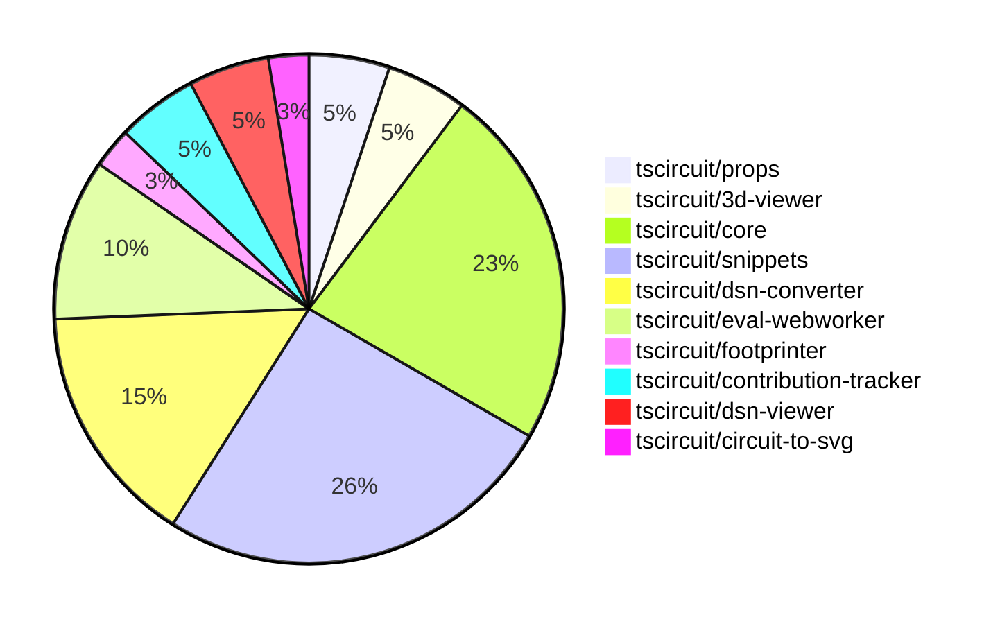

# Contribution Overview 2024-11-29

## PRs by Repository

## Contributor Overview

| Contributor | 🐳 Major | 🐙 Minor | 🐌 Tiny | ⭐ | Issues Created |
|-------------|---------|---------|---------|-----|----------------|
| [seveibar](#seveibar) | 1 | 4 | 0 | ⭐⭐ |
| [imrishabh18](#imrishabh18) | 0 | 6 | 0 | ⭐⭐ |
| [Abse2001](#Abse2001) | 0 | 5 | 0 | ⭐ |
| [mrudulpatil18](#mrudulpatil18) | 0 | 5 | 0 | ⭐ |
| [ShiboSoftwareDev](#ShiboSoftwareDev) | 0 | 3 | 4 | ⭐ |
| [AnasSarkiz](#AnasSarkiz) | 0 | 4 | 0 | ⭐ |
| [Anshgrover23](#Anshgrover23) | 0 | 4 | 0 | ⭐ |
| [divanshu-go](#divanshu-go) | 2 | 0 | 0 | ⭐ |

## Review Table

| Contributor | Reviews Received | Approvals | Rejections | Changes Requested | PRs Opened | PRs Closed | Issues created |
|-------------|------------------|-----------|------------|-------------------|------------|------------|----------------|
| [Abse2001](https://github.com/Abse2001) | 8 | 5 | 2 | 1 | 6 | 5 | 0 |
| [Niharika0104](https://github.com/Niharika0104) | 1 | 1 | 0 | 0 | 1 | 0 | 0 |
| [seveibar](https://github.com/seveibar) | 1 | 0 | 2 | 0 | 6 | 6 | 0 |
| [AnasSarkiz](https://github.com/AnasSarkiz) | 8 | 2 | 3 | 3 | 6 | 5 | 0 |
| [mrudulpatil18](https://github.com/mrudulpatil18) | 11 | 6 | 0 | 1 | 7 | 6 | 0 |
| [ShiboSoftwareDev](https://github.com/ShiboSoftwareDev) | 12 | 7 | 4 | 0 | 8 | 7 | 0 |
| [Anshgrover23](https://github.com/Anshgrover23) | 26 | 5 | 1 | 6 | 6 | 5 | 0 |
| [divanshu-go](https://github.com/divanshu-go) | 4 | 2 | 0 | 1 | 2 | 2 | 0 |
| [imrishabh18](https://github.com/imrishabh18) | 3 | 3 | 1 | 0 | 6 | 6 | 0 |
| [techmannih](https://github.com/techmannih) | 0 | 0 | 1 | 0 | 1 | 0 | 0 |
| [RohittCodes](https://github.com/RohittCodes) | 4 | 1 | 3 | 3 | 4 | 2 | 0 |
| [krushnarout](https://github.com/krushnarout) | 4 | 0 | 1 | 2 | 1 | 0 | 0 |

## Changes by Repository

### [tscircuit/props](https://github.com/tscircuit/props)

| PR # | Impact | Contributor | Description |
|------|--------|-------------|-------------|
| [#110](https://github.com/tscircuit/props/pull/110) | 🐙 Minor | Abse2001 | Added a new `schDisplayLabel` prop to the `trace` component. |
| [#109](https://github.com/tscircuit/props/pull/109) | 🐙 Minor | seveibar | Add a new `serverMode` property to the `AutorouterConfig` interface and the `autorouterConfig` Zod schema. |

### [tscircuit/3d-viewer](https://github.com/tscircuit/3d-viewer)

| PR # | Impact | Contributor | Description |
|------|--------|-------------|-------------|
| [#50](https://github.com/tscircuit/3d-viewer/pull/50) | 🐙 Minor | Abse2001 | Fixed issue with bottom trace between vias not showing and added a test. |
| [#47](https://github.com/tscircuit/3d-viewer/pull/47) | 🐙 Minor | Abse2001 | Fixed misaligned 3D viewer components by updating the tooltip position calculation logic. |

### [tscircuit/core](https://github.com/tscircuit/core)

| PR # | Impact | Contributor | Description |
|------|--------|-------------|-------------|
| [#373](https://github.com/tscircuit/core/pull/373) | 🐳 Major | seveibar |  |
| [#367](https://github.com/tscircuit/core/pull/367) | 🐙 Minor | Abse2001 | Skips two tests related to remote autorouting due to the repro of a USB-C GND and VBUS routing issue. |
| [#374](https://github.com/tscircuit/core/pull/374) | 🐙 Minor | seveibar | Fix prod issues related to differences in GET vs. POST requests for autorouting job creation |
| [#379](https://github.com/tscircuit/core/pull/379) | 🐙 Minor | AnasSarkiz | Removed schematic text logic from `Jumper.ts` |
| [#378](https://github.com/tscircuit/core/pull/378) | 🐙 Minor | AnasSarkiz | Moved the logic for rendering schematic text to a new method `SchematicComponentRenderWithSchematicBoxDimensions`. |
| [#376](https://github.com/tscircuit/core/pull/376) | 🐙 Minor | AnasSarkiz | Adds a new `schematicDisabled` property to the `Circuit` class to skip rendering all schematic components. |
| [#355](https://github.com/tscircuit/core/pull/355) | 🐙 Minor | mrudulpatil18 | The pull request ensures that the name passed to the component takes precedence over the default name from the `useRedLed` hook, and adds a test to verify this behavior. |
| [#369](https://github.com/tscircuit/core/pull/369) | 🐙 Minor | ShiboSoftwareDev | Adds a test to ensure that 90-degree rotated SMT pads are rendered correctly. |
| [#368](https://github.com/tscircuit/core/pull/368) | 🐙 Minor | ShiboSoftwareDev | Fixes an issue where rectangular SMT pads were not drawn correctly when the component was rotated 90 degrees. |

### [tscircuit/snippets](https://github.com/tscircuit/snippets)

| PR # | Impact | Contributor | Description |
|------|--------|-------------|-------------|
| [#309](https://github.com/tscircuit/snippets/pull/309) | 🐙 Minor | Abse2001 | Updating the `@tscircuit/core` package from version `0.0.206` to `0.0.208` to fix an issue with components not rendering when `pcbRotation="90"`. |
| [#325](https://github.com/tscircuit/snippets/pull/325) | 🐙 Minor | seveibar | Update core dependency to version 0.0.211, and fix the expand button UI |
| [#318](https://github.com/tscircuit/snippets/pull/318) | 🐙 Minor | mrudulpatil18 | Adds a Playwright test to verify the behavior of underlined and clickable imports in the editor. |
| [#332](https://github.com/tscircuit/snippets/pull/332) | 🐙 Minor | ShiboSoftwareDev | Fixed the flakiness in the test by using a deterministic port generation instead of a random one. |
| [#317](https://github.com/tscircuit/snippets/pull/317) | 🐙 Minor | Anshgrover23 | Fix the broken Cmd Click functionality for clicking on snippets |
| [#302](https://github.com/tscircuit/snippets/pull/302) | 🐙 Minor | Anshgrover23 | Fixes a regex issue to properly import names with dashes in the `CodeEditor` component. |
| [#303](https://github.com/tscircuit/snippets/pull/303) | 🐙 Minor | imrishabh18 | Adds a new "Dev Login" page to the application, allowing developers to authenticate using their GitHub username. |
| [#311](https://github.com/tscircuit/snippets/pull/311) | 🐌 Tiny | ShiboSoftwareDev | The pull request modifies the `.github/workflows/bundle-size-analysis.yml` file to only run the bundle size analysis workflow when changes are made to the `package.json` file. |
| [#306](https://github.com/tscircuit/snippets/pull/306) | 🐌 Tiny | ShiboSoftwareDev | Updated the `@tscircuit/3d-viewer` dependency to version `0.0.44`. |
| [#304](https://github.com/tscircuit/snippets/pull/304) | 🐌 Tiny | ShiboSoftwareDev | Removed an extra GitHub workflow file. |

### [tscircuit/dsn-converter](https://github.com/tscircuit/dsn-converter)

| PR # | Impact | Contributor | Description |
|------|--------|-------------|-------------|
| [#39](https://github.com/tscircuit/dsn-converter/pull/39) | 🐙 Minor | seveibar | Correctly sizes plated holes for homogenous components by using the actual hole and pad diameter instead of a fixed value. |
| [#45](https://github.com/tscircuit/dsn-converter/pull/45) | 🐙 Minor | imrishabh18 | Removes the processing of chip components from the `convert-circuit-json-to-dsn-json` function. |
| [#43](https://github.com/tscircuit/dsn-converter/pull/43) | 🐙 Minor | imrishabh18 | Removes hardcoded size of smtpads and uses the default trace width of circuit json. |
| [#38](https://github.com/tscircuit/dsn-converter/pull/38) | 🐙 Minor | imrishabh18 | Adds missing properties `from_layer` and `to_layer` to the output object for a PCB via. |
| [#37](https://github.com/tscircuit/dsn-converter/pull/37) | 🐙 Minor | imrishabh18 | Add the via's and test to check the via's are present |
| [#36](https://github.com/tscircuit/dsn-converter/pull/36) | 🐙 Minor | imrishabh18 | Adds handling for circle shape padstacks in the PCB component conversion process. |

### [tscircuit/eval-webworker](https://github.com/tscircuit/eval-webworker)

| PR # | Impact | Contributor | Description |
|------|--------|-------------|-------------|
| [#5](https://github.com/tscircuit/eval-webworker/pull/5) | 🟣 | seveibar | Add Workflows, Fix Test, Publish v0.0.1 |
| [#10](https://github.com/tscircuit/eval-webworker/pull/10) | 🐙 Minor | mrudulpatil18 | Configure the build process to generate declaration files |
| [#8](https://github.com/tscircuit/eval-webworker/pull/8) | 🐙 Minor | mrudulpatil18 | Adds a build step to the release workflow |
| [#6](https://github.com/tscircuit/eval-webworker/pull/6) | 🐙 Minor | mrudulpatil18 | Re-emit all events from the web worker to the client-side API |

### [tscircuit/footprinter](https://github.com/tscircuit/footprinter)

| PR # | Impact | Contributor | Description |
|------|--------|-------------|-------------|
| [#87](https://github.com/tscircuit/footprinter/pull/87) | 🐙 Minor | AnasSarkiz | Rearranged the pin positions of the SOT23-5 component to match the anti-clockwise orientation specified in the datasheet. |

### [tscircuit/contribution-tracker](https://github.com/tscircuit/contribution-tracker)

| PR # | Impact | Contributor | Description |
|------|--------|-------------|-------------|
| [#13](https://github.com/tscircuit/contribution-tracker/pull/13) | 🐙 Minor | Anshgrover23 | Fixes the review table in the generated markdown file by adding a new column for "Issues Created" and updating the table format. |
| [#14](https://github.com/tscircuit/contribution-tracker/pull/14) | 🐌 Tiny | ShiboSoftwareDev | Fixed the formatting of the review table in the markdown file. |

### [tscircuit/dsn-viewer](https://github.com/tscircuit/dsn-viewer)

| PR # | Impact | Contributor | Description |
|------|--------|-------------|-------------|
| [#7](https://github.com/tscircuit/dsn-viewer/pull/7) | 🐳 Major | divanshu-go | Adds support for multiple drag and drop files, allowing users to upload both DSN PCB and session files. |
| [#8](https://github.com/tscircuit/dsn-viewer/pull/8) | 🐙 Minor | Anshgrover23 | Set up a basic Playwright test to take a screenshot of the DSN viewer after clicking the "Open Example" button. |

### [tscircuit/circuit-to-svg](https://github.com/tscircuit/circuit-to-svg)

| PR # | Impact | Contributor | Description |
|------|--------|-------------|-------------|
| [#140](https://github.com/tscircuit/circuit-to-svg/pull/140) | 🐳 Major | divanshu-go | Adds a GitHub Actions workflow to calculate the bundle and install size differences between the base and PR branches, and posts a comment with the results. |

## Changes by Contributor

### [Abse2001](https://github.com/Abse2001)

| PR # | Impact | Description |
|------|--------|-------------|
| [#110](https://github.com/tscircuit/props/pull/110) | 🐙 Minor | Added a new `schDisplayLabel` prop to the `trace` component. |
| [#50](https://github.com/tscircuit/3d-viewer/pull/50) | 🐙 Minor | Fixed issue with bottom trace between vias not showing and added a test. |
| [#47](https://github.com/tscircuit/3d-viewer/pull/47) | 🐙 Minor | Fixed misaligned 3D viewer components by updating the tooltip position calculation logic. |
| [#367](https://github.com/tscircuit/core/pull/367) | 🐙 Minor | Skips two tests related to remote autorouting due to the repro of a USB-C GND and VBUS routing issue. |
| [#309](https://github.com/tscircuit/snippets/pull/309) | 🐙 Minor | Updating the `@tscircuit/core` package from version `0.0.206` to `0.0.208` to fix an issue with components not rendering when `pcbRotation="90"`. |

### [seveibar](https://github.com/seveibar)

| PR # | Impact | Description |
|------|--------|-------------|
| [#373](https://github.com/tscircuit/core/pull/373) | 🐳 Major |  |
| [#109](https://github.com/tscircuit/props/pull/109) | 🐙 Minor | Add a new `serverMode` property to the `AutorouterConfig` interface and the `autorouterConfig` Zod schema. |
| [#374](https://github.com/tscircuit/core/pull/374) | 🐙 Minor | Fix prod issues related to differences in GET vs. POST requests for autorouting job creation |
| [#39](https://github.com/tscircuit/dsn-converter/pull/39) | 🐙 Minor | Correctly sizes plated holes for homogenous components by using the actual hole and pad diameter instead of a fixed value. |
| [#325](https://github.com/tscircuit/snippets/pull/325) | 🐙 Minor | Update core dependency to version 0.0.211, and fix the expand button UI |
| [#5](https://github.com/tscircuit/eval-webworker/pull/5) | 🟣 | Add Workflows, Fix Test, Publish v0.0.1 |

### [AnasSarkiz](https://github.com/AnasSarkiz)

| PR # | Impact | Description |
|------|--------|-------------|
| [#87](https://github.com/tscircuit/footprinter/pull/87) | 🐙 Minor | Rearranged the pin positions of the SOT23-5 component to match the anti-clockwise orientation specified in the datasheet. |
| [#379](https://github.com/tscircuit/core/pull/379) | 🐙 Minor | Removed schematic text logic from `Jumper.ts` |
| [#378](https://github.com/tscircuit/core/pull/378) | 🐙 Minor | Moved the logic for rendering schematic text to a new method `SchematicComponentRenderWithSchematicBoxDimensions`. |
| [#376](https://github.com/tscircuit/core/pull/376) | 🐙 Minor | Adds a new `schematicDisabled` property to the `Circuit` class to skip rendering all schematic components. |

### [mrudulpatil18](https://github.com/mrudulpatil18)

| PR # | Impact | Description |
|------|--------|-------------|
| [#355](https://github.com/tscircuit/core/pull/355) | 🐙 Minor | The pull request ensures that the name passed to the component takes precedence over the default name from the `useRedLed` hook, and adds a test to verify this behavior. |
| [#318](https://github.com/tscircuit/snippets/pull/318) | 🐙 Minor | Adds a Playwright test to verify the behavior of underlined and clickable imports in the editor. |
| [#10](https://github.com/tscircuit/eval-webworker/pull/10) | 🐙 Minor | Configure the build process to generate declaration files |
| [#8](https://github.com/tscircuit/eval-webworker/pull/8) | 🐙 Minor | Adds a build step to the release workflow |
| [#6](https://github.com/tscircuit/eval-webworker/pull/6) | 🐙 Minor | Re-emit all events from the web worker to the client-side API |

### [ShiboSoftwareDev](https://github.com/ShiboSoftwareDev)

| PR # | Impact | Description |
|------|--------|-------------|
| [#369](https://github.com/tscircuit/core/pull/369) | 🐙 Minor | Adds a test to ensure that 90-degree rotated SMT pads are rendered correctly. |
| [#368](https://github.com/tscircuit/core/pull/368) | 🐙 Minor | Fixes an issue where rectangular SMT pads were not drawn correctly when the component was rotated 90 degrees. |
| [#332](https://github.com/tscircuit/snippets/pull/332) | 🐙 Minor | Fixed the flakiness in the test by using a deterministic port generation instead of a random one. |
| [#14](https://github.com/tscircuit/contribution-tracker/pull/14) | 🐌 Tiny | Fixed the formatting of the review table in the markdown file. |
| [#311](https://github.com/tscircuit/snippets/pull/311) | 🐌 Tiny | The pull request modifies the `.github/workflows/bundle-size-analysis.yml` file to only run the bundle size analysis workflow when changes are made to the `package.json` file. |
| [#306](https://github.com/tscircuit/snippets/pull/306) | 🐌 Tiny | Updated the `@tscircuit/3d-viewer` dependency to version `0.0.44`. |
| [#304](https://github.com/tscircuit/snippets/pull/304) | 🐌 Tiny | Removed an extra GitHub workflow file. |

### [Anshgrover23](https://github.com/Anshgrover23)

| PR # | Impact | Description |
|------|--------|-------------|
| [#13](https://github.com/tscircuit/contribution-tracker/pull/13) | 🐙 Minor | Fixes the review table in the generated markdown file by adding a new column for "Issues Created" and updating the table format. |
| [#317](https://github.com/tscircuit/snippets/pull/317) | 🐙 Minor | Fix the broken Cmd Click functionality for clicking on snippets |
| [#302](https://github.com/tscircuit/snippets/pull/302) | 🐙 Minor | Fixes a regex issue to properly import names with dashes in the `CodeEditor` component. |
| [#8](https://github.com/tscircuit/dsn-viewer/pull/8) | 🐙 Minor | Set up a basic Playwright test to take a screenshot of the DSN viewer after clicking the "Open Example" button. |

### [divanshu-go](https://github.com/divanshu-go)

| PR # | Impact | Description |
|------|--------|-------------|
| [#140](https://github.com/tscircuit/circuit-to-svg/pull/140) | 🐳 Major | Adds a GitHub Actions workflow to calculate the bundle and install size differences between the base and PR branches, and posts a comment with the results. |
| [#7](https://github.com/tscircuit/dsn-viewer/pull/7) | 🐳 Major | Adds support for multiple drag and drop files, allowing users to upload both DSN PCB and session files. |

### [imrishabh18](https://github.com/imrishabh18)

| PR # | Impact | Description |
|------|--------|-------------|
| [#45](https://github.com/tscircuit/dsn-converter/pull/45) | 🐙 Minor | Removes the processing of chip components from the `convert-circuit-json-to-dsn-json` function. |
| [#43](https://github.com/tscircuit/dsn-converter/pull/43) | 🐙 Minor | Removes hardcoded size of smtpads and uses the default trace width of circuit json. |
| [#38](https://github.com/tscircuit/dsn-converter/pull/38) | 🐙 Minor | Adds missing properties `from_layer` and `to_layer` to the output object for a PCB via. |
| [#37](https://github.com/tscircuit/dsn-converter/pull/37) | 🐙 Minor | Add the via's and test to check the via's are present |
| [#36](https://github.com/tscircuit/dsn-converter/pull/36) | 🐙 Minor | Adds handling for circle shape padstacks in the PCB component conversion process. |
| [#303](https://github.com/tscircuit/snippets/pull/303) | 🐙 Minor | Adds a new "Dev Login" page to the application, allowing developers to authenticate using their GitHub username. |

