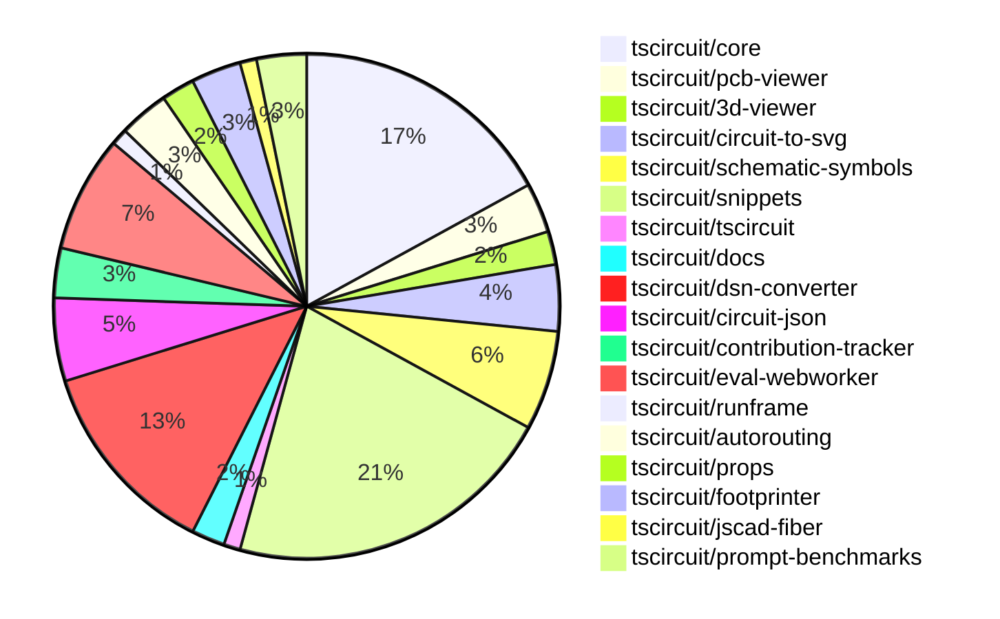

# Contribution Overview 2024-12-04

## PRs by Repository

## Contributor Overview

| Contributor | 🐳 Major | 🐙 Minor | 🐌 Tiny | ⭐ | Issues Created |
|-------------|---------|---------|---------|-----|----------------|
| [seveibar](#seveibar) | 4 | 14 | 3 | 👑 | 89 |
| [imrishabh18](#imrishabh18) | 4 | 14 | 3 | 👑 | 13 |
| [ShiboSoftwareDev](#ShiboSoftwareDev) | 1 | 9 | 3 | ⭐⭐⭐ | 9 |
| [Abse2001](#Abse2001) | 1 | 8 | 1 | ⭐⭐⭐ | 7 |
| [AnasSarkiz](#AnasSarkiz) | 5 | 4 | 0 | ⭐⭐ | 4 |
| [Anshgrover23](#Anshgrover23) | 0 | 6 | 0 | ⭐⭐ | 1 |
| [RohittCodes](#RohittCodes) | 0 | 5 | 0 | ⭐ | 2 |
| [devin-ai-integration[bot]](#devin-ai-integration[bot]) | 0 | 3 | 0 | ⭐ | 0 |
| [techmannih](#techmannih) | 0 | 2 | 0 | ⭐ | 1 |
| [samyakshah3008](#samyakshah3008) | 0 | 1 | 1 |  | 2 |
| [ni9999](#ni9999) | 0 | 1 | 0 |  | 0 |
| [mrudulpatil18](#mrudulpatil18) | 0 | 1 | 0 |  | 0 |

## Review Table

[reviews-received-hover]: ## "Number of reviews received for PRs for this contributor"
[approvals-received-hover]: ## "Number of approvals received for PRs this contributor authored"
[rejections-received-hover]: ## "Number of rejections received for PRs this contributor authored"
[prs-opened-hover]: ## "Number of PRs opened by this contributor"
[issues-created-hover]: ## "Number of issues created by this contributor"
[bountied-issues-hover]: ## "Number of issues this contributor created with a bounty"
[bountied-issue-$-hover]: ## "Total bounty amount placed on issues authored by this contributor"

| Contributor | Reviews Received | Approvals Received | Rejections Received | PRs Opened | PRs Merged | Issues Created | Bountied Issues | Bountied Issue $ |
|---|---|---|---|---|---|---|---|---|
| [Abse2001](#Abse2001) | 17 | 10 | 1 | 10 | 10 | 7 | 4 | 77 |
| [seveibar](#seveibar) | 3 | 0 | 0 | 25 | 21 | 89 | 51 | 1315 |
| [samyakshah3008](#samyakshah3008) | 7 | 2 | 1 | 2 | 2 | 2 | 1 | 1 |
| [imrishabh18](#imrishabh18) | 8 | 3 | 0 | 23 | 21 | 13 | 6 | 85 |
| [devin-ai-integration[bot]](#devin-ai-integration[bot]) | 10 | 4 | 6 | 10 | 3 | 0 | 0 | 0 |
| [AnasSarkiz](#AnasSarkiz) | 28 | 8 | 3 | 9 | 9 | 4 | 0 | 0 |
| [techmannih](#techmannih) | 8 | 3 | 2 | 5 | 2 | 1 | 0 | 0 |
| [ShiboSoftwareDev](#ShiboSoftwareDev) | 16 | 10 | 3 | 14 | 13 | 9 | 4 | 95 |
| [UdaykiranRegimudi](#UdaykiranRegimudi) | 2 | 0 | 2 | 1 | 0 | 0 | 0 | 0 |
| [RohittCodes](#RohittCodes) | 28 | 6 | 9 | 8 | 5 | 2 | 1 | 5 |
| [divanshu-go](#divanshu-go) | 3 | 0 | 1 | 1 | 0 | 0 | 0 | 0 |
| [Anshgrover23](#Anshgrover23) | 20 | 8 | 2 | 7 | 6 | 1 | 0 | 0 |
| [ni9999](#ni9999) | 5 | 1 | 2 | 1 | 1 | 0 | 0 | 0 |
| [mrudulpatil18](#mrudulpatil18) | 1 | 1 | 0 | 1 | 1 | 0 | 0 | 0 |
| [aybanda](#aybanda) | 5 | 0 | 1 | 1 | 0 | 0 | 0 | 0 |

## Changes by Repository

### [tscircuit/core](https://github.com/tscircuit/core)

| PR # | Impact | Contributor | Description |
|------|--------|-------------|-------------|
| [#381](https://github.com/tscircuit/core/pull/381) | 🐳 Major | Abse2001 | Adds a new `schDisplayLabel` prop to the `<trace />` component, which allows displaying a label on the schematic trace. The change includes a test for the new feature. |
| [#409](https://github.com/tscircuit/core/pull/409) | 🐳 Major | AnasSarkiz | Implemented a new `pcbDisabled` option in the `Circuit.ts` class to disable all PCB elements. |
| [#397](https://github.com/tscircuit/core/pull/397) | 🐳 Major | AnasSarkiz | Adds automatic schematic net labeling for passive-chip connections with complex traces. |
| [#396](https://github.com/tscircuit/core/pull/396) | 🐙 Minor | Abse2001 | Fixes the JSX type module for React 19 types |
| [#407](https://github.com/tscircuit/core/pull/407) | 🐙 Minor | imrishabh18 | Calculates the size of a PCB component before rendering the trace. |
| [#406](https://github.com/tscircuit/core/pull/406) | 🐙 Minor | imrishabh18 | Reverts the change made in tscircuit/core#405 which fixed the issue of passing the rendered circuit JSON to the autorouter. |
| [#405](https://github.com/tscircuit/core/pull/405) | 🐙 Minor | imrishabh18 | Fixed an issue where the rendered circuit JSON was not being passed correctly to the autorouter. |
| [#400](https://github.com/tscircuit/core/pull/400) | 🐙 Minor | imrishabh18 | Fix missing oval shape in the PCB render |
| [#419](https://github.com/tscircuit/core/pull/419) | 🐙 Minor | seveibar | Introduces a new error type `PcbManualEditConflictError` and checks for components that have both manual placement and explicit coordinates, emitting an error in that case. |
| [#415](https://github.com/tscircuit/core/pull/415) | 🐙 Minor | seveibar | Update the `circuit-json` dependency to version 0.0.114 |
| [#391](https://github.com/tscircuit/core/pull/391) | 🐙 Minor | seveibar | Improve the error message for missing footprint by including the component's string representation. |
| [#401](https://github.com/tscircuit/core/pull/401) | 🐙 Minor | ShiboSoftwareDev | Updates the "@tscircuit/infgrid-ijump-astar" dependency to version 0.0.26 |
| [#393](https://github.com/tscircuit/core/pull/393) | 🐙 Minor | ShiboSoftwareDev | Update dependencies in package.json |
| [#414](https://github.com/tscircuit/core/pull/414) | 🐌 Tiny | seveibar | Skips size reports if package.json was not changed |
| [#395](https://github.com/tscircuit/core/pull/395) | 🐌 Tiny | ShiboSoftwareDev | Updated dependencies in the package.json file |
| [#394](https://github.com/tscircuit/core/pull/394) | 🐌 Tiny | ShiboSoftwareDev | Updated a dependency to a newer version |

### [tscircuit/pcb-viewer](https://github.com/tscircuit/pcb-viewer)

| PR # | Impact | Contributor | Description |
|------|--------|-------------|-------------|
| [#88](https://github.com/tscircuit/pcb-viewer/pull/88) | 🐙 Minor | Abse2001 | Fixed the text rotation in the `ElementOverlayBox` component. |
| [#86](https://github.com/tscircuit/pcb-viewer/pull/86) | 🐙 Minor | Abse2001 | Fixed the issue of pcbRotations rotating the pads in the opposite direction, and also made the ElementOverlayBox.tsx follow the pcb parent rotation. |
| [#90](https://github.com/tscircuit/pcb-viewer/pull/90) | 🐌 Tiny | Abse2001 | Removed unwanted textShadow from the ElementOverlayBox component |

### [tscircuit/3d-viewer](https://github.com/tscircuit/3d-viewer)

| PR # | Impact | Contributor | Description |
|------|--------|-------------|-------------|
| [#52](https://github.com/tscircuit/3d-viewer/pull/52) | 🐙 Minor | Abse2001 | Fixed a bug where tooltips were popping up excessively in the 3D viewer. |
| [#53](https://github.com/tscircuit/3d-viewer/pull/53) | 🐙 Minor | seveibar | Updates dependencies and adds a Renovate configuration file |

### [tscircuit/circuit-to-svg](https://github.com/tscircuit/circuit-to-svg)

| PR # | Impact | Contributor | Description |
|------|--------|-------------|-------------|
| [#147](https://github.com/tscircuit/circuit-to-svg/pull/147) | 🐳 Major | AnasSarkiz | Introduce a new function `createSvgObjectsFromSchVoltageProbe` to handle the creation of SVG objects for voltage probes in the schematic. |
| [#144](https://github.com/tscircuit/circuit-to-svg/pull/144) | 🐙 Minor | Abse2001 | Added a function to create symbols using `schematic_net_label.symbol_name`. |
| [#142](https://github.com/tscircuit/circuit-to-svg/pull/142) | 🐙 Minor | AnasSarkiz | Adds metadata attributes and a `<g>` wrapper for draggable schematic components in the SVG representation. |
| [#143](https://github.com/tscircuit/circuit-to-svg/pull/143) | 🐙 Minor | ShiboSoftwareDev | Update dependencies to newer versions |

### [tscircuit/schematic-symbols](https://github.com/tscircuit/schematic-symbols)

| PR # | Impact | Contributor | Description |
|------|--------|-------------|-------------|
| [#217](https://github.com/tscircuit/schematic-symbols/pull/217) | 🐳 Major | AnasSarkiz | Added new inductor symbols (left/down/right/up) instead of the existing horizontal and vertical symbols. |
| [#221](https://github.com/tscircuit/schematic-symbols/pull/221) | 🐙 Minor | Abse2001 | Added new symbols for boxresistor in different orientations (down, left, right, up) and fixed the anchor position of the text. |
| [#219](https://github.com/tscircuit/schematic-symbols/pull/219) | 🐙 Minor | Abse2001 | Adjusted the REF and VAL positions for the capacitor symbol. |
| [#223](https://github.com/tscircuit/schematic-symbols/pull/223) | 🐙 Minor | Anshgrover23 | Add a Github workflow for validating snapshots for the Bun project. |
| [#222](https://github.com/tscircuit/schematic-symbols/pull/222) | 🐙 Minor | Anshgrover23 | Adds an SVG snapshot validation script and a pre-commit hook to ensure all symbol SVGs have corresponding snapshot files. |
| [#210](https://github.com/tscircuit/schematic-symbols/pull/210) | 🐙 Minor | ni9999 | Adds a new symbol for a 4-pin crystal |

### [tscircuit/snippets](https://github.com/tscircuit/snippets)

| PR # | Impact | Contributor | Description |
|------|--------|-------------|-------------|
| [#356](https://github.com/tscircuit/snippets/pull/356) | 🐙 Minor | Abse2001 | Updates the dependency `@tscircuit/core` from version `0.0.217` to `0.0.219`. |
| [#373](https://github.com/tscircuit/snippets/pull/373) | 🐙 Minor | imrishabh18 | Revert the update to the "@tscircuit/core" dependency |
| [#363](https://github.com/tscircuit/snippets/pull/363) | 🐙 Minor | seveibar | Improve Playwright Test runtime and fix manual edits test |
| [#358](https://github.com/tscircuit/snippets/pull/358) | 🐙 Minor | seveibar | Update the version of the `dsn-converter` package and add it to the autoupdate list in the `renovate.json` file. |
| [#355](https://github.com/tscircuit/snippets/pull/355) | 🐙 Minor | seveibar | Adds a new dialog to view and download TypeScript files from the debug code editor file system. |
| [#339](https://github.com/tscircuit/snippets/pull/339) | 🐙 Minor | ShiboSoftwareDev | Automatically run code when entering the editor. |
| [#365](https://github.com/tscircuit/snippets/pull/365) | 🐙 Minor | Anshgrover23 | Split the `footprint-dialog.spec.ts` file into multiple files for better organization and readability. |
| [#351](https://github.com/tscircuit/snippets/pull/351) | 🐙 Minor | Anshgrover23 | Fixes the regular expression to support underscores in package names. |
| [#269](https://github.com/tscircuit/snippets/pull/269) | 🐙 Minor | RohittCodes | Refactored `manual_edit_json` template ingestion into the database and added Playwright tests for manual edits. |
| [#327](https://github.com/tscircuit/snippets/pull/327) | 🐙 Minor | RohittCodes | This pull request expands the circuit preview to fill the full screen when in full-screen mode. |
| [#307](https://github.com/tscircuit/snippets/pull/307) | 🐙 Minor | RohittCodes | Refactor the search links functionality to open in a new tab when the user is on the "/editor" or "/ai" routes, and use the `Link` component from the `wouter` library to handle navigation otherwise. |
| [#297](https://github.com/tscircuit/snippets/pull/297) | 🐙 Minor | RohittCodes | Adds a timeout and a finally block to the rename snippet dialog. |
| [#341](https://github.com/tscircuit/snippets/pull/341) | 🐙 Minor | RohittCodes | Increase the timeout for Playwright tests from 5 minutes to 10 minutes. |
| [#350](https://github.com/tscircuit/snippets/pull/350) | 🐙 Minor | techmannih | Add retries for flaky tests |
| [#338](https://github.com/tscircuit/snippets/pull/338) | 🐙 Minor | techmannih | Fix issue with multiple cursors when `ctrl+click` is triggered. |
| [#330](https://github.com/tscircuit/snippets/pull/330) | 🐙 Minor | mrudulpatil18 | Added a static skeleton page with fixed data to mimic the normal components and provide a loading view. |
| [#375](https://github.com/tscircuit/snippets/pull/375) | 🐌 Tiny | imrishabh18 | Update the version of the `@tscircuit/core` dependency from `0.0.223` to `0.0.225`. |
| [#372](https://github.com/tscircuit/snippets/pull/372) | 🐌 Tiny | imrishabh18 | Updates the @tscircuit/core dependency from 0.0.221 to 0.0.223 |
| [#369](https://github.com/tscircuit/snippets/pull/369) | 🐌 Tiny | imrishabh18 | Update the version of the 'dsn-converter' dependency from 0.0.39 to 0.0.41. |
| [#357](https://github.com/tscircuit/snippets/pull/357) | 🐌 Tiny | seveibar | Update Playwright snapshot images for the "star" and "view-snippet" tests |

### [tscircuit/tscircuit](https://github.com/tscircuit/tscircuit)

| PR # | Impact | Contributor | Description |
|------|--------|-------------|-------------|
| [#484](https://github.com/tscircuit/tscircuit/pull/484) | 🐙 Minor | samyakshah3008 | This pull request enhances the README file with more sections and a new CONTRIBUTING guide, improving the overall documentation for the project. |

### [tscircuit/docs](https://github.com/tscircuit/docs)

| PR # | Impact | Contributor | Description |
|------|--------|-------------|-------------|
| [#43](https://github.com/tscircuit/docs/pull/43) | 🐳 Major | AnasSarkiz | Added a new tutorial for creating a development circuit using the ESP32-D0WD microcontroller and supporting components. |
| [#49](https://github.com/tscircuit/docs/pull/49) | 🐌 Tiny | samyakshah3008 | Fix incorrect LinkedIn URL in the footer of the documentation site. |

### [tscircuit/dsn-converter](https://github.com/tscircuit/dsn-converter)

| PR # | Impact | Contributor | Description |
|------|--------|-------------|-------------|
| [#53](https://github.com/tscircuit/dsn-converter/pull/53) | 🐳 Major | imrishabh18 | Refactor the `processPlatedHoles` function and remove the code for handling plated holes in the `processComponentsAndPads` function. |
| [#52](https://github.com/tscircuit/dsn-converter/pull/52) | 🐳 Major | imrishabh18 | Refactor the code to handle padstack name and shape creation for plated holes. |
| [#47](https://github.com/tscircuit/dsn-converter/pull/47) | 🐳 Major | imrishabh18 | Add support for pill shaped plated holes. |
| [#46](https://github.com/tscircuit/dsn-converter/pull/46) | 🐳 Major | imrishabh18 | Fixes handling of plated holes with different sizes and adds support for them. |
| [#60](https://github.com/tscircuit/dsn-converter/pull/60) | 🐙 Minor | imrishabh18 | Fixes the issue where pin numbers for plated holes are not derived from the corresponding source_port's port_hints. |
| [#59](https://github.com/tscircuit/dsn-converter/pull/59) | 🐙 Minor | imrishabh18 | Set default width and height for `<group/>` subcircuit to 100mm to be on the safe side. |
| [#58](https://github.com/tscircuit/dsn-converter/pull/58) | 🐙 Minor | imrishabh18 | Fix for parsing invalid pin format in the DSN to circuit JSON conversion. |
| [#57](https://github.com/tscircuit/dsn-converter/pull/57) | 🐙 Minor | imrishabh18 | Fix to get the unconnected pads as well in the nets list |
| [#56](https://github.com/tscircuit/dsn-converter/pull/56) | 🐙 Minor | imrishabh18 | Refactor the code to use the `soup-util` library, which provides utility functions for working with circuit elements. |
| [#55](https://github.com/tscircuit/dsn-converter/pull/55) | 🐙 Minor | imrishabh18 | Fix the port numbers in the order. |
| [#51](https://github.com/tscircuit/dsn-converter/pull/51) | 🐙 Minor | imrishabh18 | Fix the rotation and footprint naming for components in the PCB design. |
| [#49](https://github.com/tscircuit/dsn-converter/pull/49) | 🐙 Minor | imrishabh18 | Fix the position of pads in the `circuit-json-to-dsn-json` process |

### [tscircuit/circuit-json](https://github.com/tscircuit/circuit-json)

| PR # | Impact | Contributor | Description |
|------|--------|-------------|-------------|
| [#85](https://github.com/tscircuit/circuit-json/pull/85) | 🐳 Major | seveibar | Introduce a new type of schematic element called "schematic_voltage_probe" that can be used to specify a voltage measurement point on a schematic trace. |
| [#94](https://github.com/tscircuit/circuit-json/pull/94) | 🐙 Minor | imrishabh18 | Adds a new `pcb_group` type to the `any_circuit_element` union and a corresponding `pcb_group` type definition. |
| [#89](https://github.com/tscircuit/circuit-json/pull/89) | 🐙 Minor | seveibar | Updates the README.md file to add information about base units and element prefixes used in the project. |
| [#86](https://github.com/tscircuit/circuit-json/pull/86) | 🐙 Minor | seveibar | The pull request adds README generation to the release workflow and refactors the `expectTypesMatch` pattern. |
| [#88](https://github.com/tscircuit/circuit-json/pull/88) | 🐙 Minor | devin-ai-integration[bot] | Adds a new error type to handle conflicts between manual edits and explicit PCB coordinates. |

### [tscircuit/contribution-tracker](https://github.com/tscircuit/contribution-tracker)

| PR # | Impact | Contributor | Description |
|------|--------|-------------|-------------|
| [#22](https://github.com/tscircuit/contribution-tracker/pull/22) | 🐳 Major | seveibar | Refactor types, add support for json generation, fix claude caching, and fix column titles |
| [#20](https://github.com/tscircuit/contribution-tracker/pull/20) | 🐙 Minor | Anshgrover23 | Adds the number of bountied issues created by each contributor as a star factor. |
| [#17](https://github.com/tscircuit/contribution-tracker/pull/17) | 🐙 Minor | Anshgrover23 | Adds functionality to detect the number of issues created that have a bounty. |

### [tscircuit/eval-webworker](https://github.com/tscircuit/eval-webworker)

| PR # | Impact | Contributor | Description |
|------|--------|-------------|-------------|
| [#13](https://github.com/tscircuit/eval-webworker/pull/13) | 🐳 Major | seveibar | The pull request adds a new `executeWithFsMap` method to the `CircuitWebWorker` interface and implementation, allowing the execution of code with a virtual file system. It also adds a new test that exercises this functionality. |
| [#28](https://github.com/tscircuit/eval-webworker/pull/28) | 🐙 Minor | seveibar | Separates the build process for the library and the webworker into two separate commands. |
| [#27](https://github.com/tscircuit/eval-webworker/pull/27) | 🐙 Minor | seveibar | Adds a verbose mode for logging in the circuit web worker |
| [#24](https://github.com/tscircuit/eval-webworker/pull/24) | 🐙 Minor | seveibar | Adds support for building blob URLs with packaged web worker |
| [#20](https://github.com/tscircuit/eval-webworker/pull/20) | 🐙 Minor | seveibar | Add usage of `fsMap` to execute code using a virtual filesystem |
| [#26](https://github.com/tscircuit/eval-webworker/pull/26) | 🐙 Minor | devin-ai-integration[bot] | Add type declarations for the blob-url module |
| [#25](https://github.com/tscircuit/eval-webworker/pull/25) | 🐌 Tiny | seveibar | Add `{ type: "module" }` to worker import |

### [tscircuit/runframe](https://github.com/tscircuit/runframe)

| PR # | Impact | Contributor | Description |
|------|--------|-------------|-------------|
| [#3](https://github.com/tscircuit/runframe/pull/3) | 🐳 Major | seveibar | Adds GitHub Actions workflows for format checking, type checking, and publishing to npm. |

### [tscircuit/autorouting](https://github.com/tscircuit/autorouting)

| PR # | Impact | Contributor | Description |
|------|--------|-------------|-------------|
| [#98](https://github.com/tscircuit/autorouting/pull/98) | 🐙 Minor | seveibar | Adds a GitHub Actions workflow to deploy the application to fly.io instead of Vercel. |
| [#100](https://github.com/tscircuit/autorouting/pull/100) | 🐙 Minor | ShiboSoftwareDev | Adds a function to generate approximating rectangles for a rotated rectangle to be used as obstacles in a circuit. |
| [#95](https://github.com/tscircuit/autorouting/pull/95) | 🐌 Tiny | ShiboSoftwareDev | Updated packages |

### [tscircuit/props](https://github.com/tscircuit/props)

| PR # | Impact | Contributor | Description |
|------|--------|-------------|-------------|
| [#113](https://github.com/tscircuit/props/pull/113) | 🐙 Minor | devin-ai-integration[bot] | Adds a new `pinVariant` prop to the `crystal` component to support 2-pin and 4-pin variants. |
| [#111](https://github.com/tscircuit/props/pull/111) | 🐙 Minor | ShiboSoftwareDev | Adds support for building the project as an ESM module. |

### [tscircuit/footprinter](https://github.com/tscircuit/footprinter)

| PR # | Impact | Contributor | Description |
|------|--------|-------------|-------------|
| [#96](https://github.com/tscircuit/footprinter/pull/96) | 🐙 Minor | AnasSarkiz | Adds support for optional height parameters to the `stampboard` and `stampreceiver` functions. |
| [#92](https://github.com/tscircuit/footprinter/pull/92) | 🐙 Minor | AnasSarkiz | Added default values of 2 for top and bottom properties in stampboard and stampreceiver components. |
| [#94](https://github.com/tscircuit/footprinter/pull/94) | 🐙 Minor | ShiboSoftwareDev | Updated package dependencies to use "circuit-json" instead of "@tscircuit/soup" |

### [tscircuit/jscad-fiber](https://github.com/tscircuit/jscad-fiber)

| PR # | Impact | Contributor | Description |
|------|--------|-------------|-------------|
| [#95](https://github.com/tscircuit/jscad-fiber/pull/95) | 🐙 Minor | AnasSarkiz | This pull request improves the usage documentation by adding examples of each component and updating the README with a table of contents, installation instructions, and a detailed component props reference. |

### [tscircuit/prompt-benchmarks](https://github.com/tscircuit/prompt-benchmarks)

| PR # | Impact | Contributor | Description |
|------|--------|-------------|-------------|
| [#9](https://github.com/tscircuit/prompt-benchmarks/pull/9) | 🐳 Major | ShiboSoftwareDev | Adds a new benchmarking tool called "evalite" to the project. |
| [#10](https://github.com/tscircuit/prompt-benchmarks/pull/10) | 🐙 Minor | ShiboSoftwareDev | Updated the `evalite` code, added a new `format` script, and modified the `problems.toml` file. |
| [#8](https://github.com/tscircuit/prompt-benchmarks/pull/8) | 🐙 Minor | ShiboSoftwareDev | The pull request adds new benchmark problems for creating electronic circuits, including a 555 timer with a blinking LED, an LED driver circuit, an RC low-pass filter, and an astable multivibrator. |

## Changes by Contributor

### [Abse2001](https://github.com/Abse2001)

| PR # | Impact | Description |
|------|--------|-------------|
| [#381](https://github.com/tscircuit/core/pull/381) | 🐳 Major | Adds a new `schDisplayLabel` prop to the `<trace />` component, which allows displaying a label on the schematic trace. The change includes a test for the new feature. |
| [#88](https://github.com/tscircuit/pcb-viewer/pull/88) | 🐙 Minor | Fixed the text rotation in the `ElementOverlayBox` component. |
| [#86](https://github.com/tscircuit/pcb-viewer/pull/86) | 🐙 Minor | Fixed the issue of pcbRotations rotating the pads in the opposite direction, and also made the ElementOverlayBox.tsx follow the pcb parent rotation. |
| [#52](https://github.com/tscircuit/3d-viewer/pull/52) | 🐙 Minor | Fixed a bug where tooltips were popping up excessively in the 3D viewer. |
| [#396](https://github.com/tscircuit/core/pull/396) | 🐙 Minor | Fixes the JSX type module for React 19 types |
| [#144](https://github.com/tscircuit/circuit-to-svg/pull/144) | 🐙 Minor | Added a function to create symbols using `schematic_net_label.symbol_name`. |
| [#221](https://github.com/tscircuit/schematic-symbols/pull/221) | 🐙 Minor | Added new symbols for boxresistor in different orientations (down, left, right, up) and fixed the anchor position of the text. |
| [#219](https://github.com/tscircuit/schematic-symbols/pull/219) | 🐙 Minor | Adjusted the REF and VAL positions for the capacitor symbol. |
| [#356](https://github.com/tscircuit/snippets/pull/356) | 🐙 Minor | Updates the dependency `@tscircuit/core` from version `0.0.217` to `0.0.219`. |
| [#90](https://github.com/tscircuit/pcb-viewer/pull/90) | 🐌 Tiny | Removed unwanted textShadow from the ElementOverlayBox component |

### [samyakshah3008](https://github.com/samyakshah3008)

| PR # | Impact | Description |
|------|--------|-------------|
| [#484](https://github.com/tscircuit/tscircuit/pull/484) | 🐙 Minor | This pull request enhances the README file with more sections and a new CONTRIBUTING guide, improving the overall documentation for the project. |
| [#49](https://github.com/tscircuit/docs/pull/49) | 🐌 Tiny | Fix incorrect LinkedIn URL in the footer of the documentation site. |

### [imrishabh18](https://github.com/imrishabh18)

| PR # | Impact | Description |
|------|--------|-------------|
| [#53](https://github.com/tscircuit/dsn-converter/pull/53) | 🐳 Major | Refactor the `processPlatedHoles` function and remove the code for handling plated holes in the `processComponentsAndPads` function. |
| [#52](https://github.com/tscircuit/dsn-converter/pull/52) | 🐳 Major | Refactor the code to handle padstack name and shape creation for plated holes. |
| [#47](https://github.com/tscircuit/dsn-converter/pull/47) | 🐳 Major | Add support for pill shaped plated holes. |
| [#46](https://github.com/tscircuit/dsn-converter/pull/46) | 🐳 Major | Fixes handling of plated holes with different sizes and adds support for them. |
| [#94](https://github.com/tscircuit/circuit-json/pull/94) | 🐙 Minor | Adds a new `pcb_group` type to the `any_circuit_element` union and a corresponding `pcb_group` type definition. |
| [#407](https://github.com/tscircuit/core/pull/407) | 🐙 Minor | Calculates the size of a PCB component before rendering the trace. |
| [#406](https://github.com/tscircuit/core/pull/406) | 🐙 Minor | Reverts the change made in tscircuit/core#405 which fixed the issue of passing the rendered circuit JSON to the autorouter. |
| [#405](https://github.com/tscircuit/core/pull/405) | 🐙 Minor | Fixed an issue where the rendered circuit JSON was not being passed correctly to the autorouter. |
| [#400](https://github.com/tscircuit/core/pull/400) | 🐙 Minor | Fix missing oval shape in the PCB render |
| [#60](https://github.com/tscircuit/dsn-converter/pull/60) | 🐙 Minor | Fixes the issue where pin numbers for plated holes are not derived from the corresponding source_port's port_hints. |
| [#59](https://github.com/tscircuit/dsn-converter/pull/59) | 🐙 Minor | Set default width and height for `<group/>` subcircuit to 100mm to be on the safe side. |
| [#58](https://github.com/tscircuit/dsn-converter/pull/58) | 🐙 Minor | Fix for parsing invalid pin format in the DSN to circuit JSON conversion. |
| [#57](https://github.com/tscircuit/dsn-converter/pull/57) | 🐙 Minor | Fix to get the unconnected pads as well in the nets list |
| [#56](https://github.com/tscircuit/dsn-converter/pull/56) | 🐙 Minor | Refactor the code to use the `soup-util` library, which provides utility functions for working with circuit elements. |
| [#55](https://github.com/tscircuit/dsn-converter/pull/55) | 🐙 Minor | Fix the port numbers in the order. |
| [#51](https://github.com/tscircuit/dsn-converter/pull/51) | 🐙 Minor | Fix the rotation and footprint naming for components in the PCB design. |
| [#49](https://github.com/tscircuit/dsn-converter/pull/49) | 🐙 Minor | Fix the position of pads in the `circuit-json-to-dsn-json` process |
| [#373](https://github.com/tscircuit/snippets/pull/373) | 🐙 Minor | Revert the update to the "@tscircuit/core" dependency |
| [#375](https://github.com/tscircuit/snippets/pull/375) | 🐌 Tiny | Update the version of the `@tscircuit/core` dependency from `0.0.223` to `0.0.225`. |
| [#372](https://github.com/tscircuit/snippets/pull/372) | 🐌 Tiny | Updates the @tscircuit/core dependency from 0.0.221 to 0.0.223 |
| [#369](https://github.com/tscircuit/snippets/pull/369) | 🐌 Tiny | Update the version of the 'dsn-converter' dependency from 0.0.39 to 0.0.41. |

### [seveibar](https://github.com/seveibar)

| PR # | Impact | Description |
|------|--------|-------------|
| [#85](https://github.com/tscircuit/circuit-json/pull/85) | 🐳 Major | Introduce a new type of schematic element called "schematic_voltage_probe" that can be used to specify a voltage measurement point on a schematic trace. |
| [#22](https://github.com/tscircuit/contribution-tracker/pull/22) | 🐳 Major | Refactor types, add support for json generation, fix claude caching, and fix column titles |
| [#13](https://github.com/tscircuit/eval-webworker/pull/13) | 🐳 Major | The pull request adds a new `executeWithFsMap` method to the `CircuitWebWorker` interface and implementation, allowing the execution of code with a virtual file system. It also adds a new test that exercises this functionality. |
| [#3](https://github.com/tscircuit/runframe/pull/3) | 🐳 Major | Adds GitHub Actions workflows for format checking, type checking, and publishing to npm. |
| [#89](https://github.com/tscircuit/circuit-json/pull/89) | 🐙 Minor | Updates the README.md file to add information about base units and element prefixes used in the project. |
| [#86](https://github.com/tscircuit/circuit-json/pull/86) | 🐙 Minor | The pull request adds README generation to the release workflow and refactors the `expectTypesMatch` pattern. |
| [#53](https://github.com/tscircuit/3d-viewer/pull/53) | 🐙 Minor | Updates dependencies and adds a Renovate configuration file |
| [#419](https://github.com/tscircuit/core/pull/419) | 🐙 Minor | Introduces a new error type `PcbManualEditConflictError` and checks for components that have both manual placement and explicit coordinates, emitting an error in that case. |
| [#415](https://github.com/tscircuit/core/pull/415) | 🐙 Minor | Update the `circuit-json` dependency to version 0.0.114 |
| [#391](https://github.com/tscircuit/core/pull/391) | 🐙 Minor | Improve the error message for missing footprint by including the component's string representation. |
| [#98](https://github.com/tscircuit/autorouting/pull/98) | 🐙 Minor | Adds a GitHub Actions workflow to deploy the application to fly.io instead of Vercel. |
| [#363](https://github.com/tscircuit/snippets/pull/363) | 🐙 Minor | Improve Playwright Test runtime and fix manual edits test |
| [#358](https://github.com/tscircuit/snippets/pull/358) | 🐙 Minor | Update the version of the `dsn-converter` package and add it to the autoupdate list in the `renovate.json` file. |
| [#355](https://github.com/tscircuit/snippets/pull/355) | 🐙 Minor | Adds a new dialog to view and download TypeScript files from the debug code editor file system. |
| [#28](https://github.com/tscircuit/eval-webworker/pull/28) | 🐙 Minor | Separates the build process for the library and the webworker into two separate commands. |
| [#27](https://github.com/tscircuit/eval-webworker/pull/27) | 🐙 Minor | Adds a verbose mode for logging in the circuit web worker |
| [#24](https://github.com/tscircuit/eval-webworker/pull/24) | 🐙 Minor | Adds support for building blob URLs with packaged web worker |
| [#20](https://github.com/tscircuit/eval-webworker/pull/20) | 🐙 Minor | Add usage of `fsMap` to execute code using a virtual filesystem |
| [#414](https://github.com/tscircuit/core/pull/414) | 🐌 Tiny | Skips size reports if package.json was not changed |
| [#357](https://github.com/tscircuit/snippets/pull/357) | 🐌 Tiny | Update Playwright snapshot images for the "star" and "view-snippet" tests |
| [#25](https://github.com/tscircuit/eval-webworker/pull/25) | 🐌 Tiny | Add `{ type: "module" }` to worker import |

### [devin-ai-integration[bot]](https://github.com/devin-ai-integration[bot])

| PR # | Impact | Description |
|------|--------|-------------|
| [#88](https://github.com/tscircuit/circuit-json/pull/88) | 🐙 Minor | Adds a new error type to handle conflicts between manual edits and explicit PCB coordinates. |
| [#113](https://github.com/tscircuit/props/pull/113) | 🐙 Minor | Adds a new `pinVariant` prop to the `crystal` component to support 2-pin and 4-pin variants. |
| [#26](https://github.com/tscircuit/eval-webworker/pull/26) | 🐙 Minor | Add type declarations for the blob-url module |

### [AnasSarkiz](https://github.com/AnasSarkiz)

| PR # | Impact | Description |
|------|--------|-------------|
| [#43](https://github.com/tscircuit/docs/pull/43) | 🐳 Major | Added a new tutorial for creating a development circuit using the ESP32-D0WD microcontroller and supporting components. |
| [#409](https://github.com/tscircuit/core/pull/409) | 🐳 Major | Implemented a new `pcbDisabled` option in the `Circuit.ts` class to disable all PCB elements. |
| [#397](https://github.com/tscircuit/core/pull/397) | 🐳 Major | Adds automatic schematic net labeling for passive-chip connections with complex traces. |
| [#147](https://github.com/tscircuit/circuit-to-svg/pull/147) | 🐳 Major | Introduce a new function `createSvgObjectsFromSchVoltageProbe` to handle the creation of SVG objects for voltage probes in the schematic. |
| [#217](https://github.com/tscircuit/schematic-symbols/pull/217) | 🐳 Major | Added new inductor symbols (left/down/right/up) instead of the existing horizontal and vertical symbols. |
| [#96](https://github.com/tscircuit/footprinter/pull/96) | 🐙 Minor | Adds support for optional height parameters to the `stampboard` and `stampreceiver` functions. |
| [#92](https://github.com/tscircuit/footprinter/pull/92) | 🐙 Minor | Added default values of 2 for top and bottom properties in stampboard and stampreceiver components. |
| [#95](https://github.com/tscircuit/jscad-fiber/pull/95) | 🐙 Minor | This pull request improves the usage documentation by adding examples of each component and updating the README with a table of contents, installation instructions, and a detailed component props reference. |
| [#142](https://github.com/tscircuit/circuit-to-svg/pull/142) | 🐙 Minor | Adds metadata attributes and a `<g>` wrapper for draggable schematic components in the SVG representation. |

### [ShiboSoftwareDev](https://github.com/ShiboSoftwareDev)

| PR # | Impact | Description |
|------|--------|-------------|
| [#9](https://github.com/tscircuit/prompt-benchmarks/pull/9) | 🐳 Major | Adds a new benchmarking tool called "evalite" to the project. |
| [#111](https://github.com/tscircuit/props/pull/111) | 🐙 Minor | Adds support for building the project as an ESM module. |
| [#94](https://github.com/tscircuit/footprinter/pull/94) | 🐙 Minor | Updated package dependencies to use "circuit-json" instead of "@tscircuit/soup" |
| [#401](https://github.com/tscircuit/core/pull/401) | 🐙 Minor | Updates the "@tscircuit/infgrid-ijump-astar" dependency to version 0.0.26 |
| [#393](https://github.com/tscircuit/core/pull/393) | 🐙 Minor | Update dependencies in package.json |
| [#143](https://github.com/tscircuit/circuit-to-svg/pull/143) | 🐙 Minor | Update dependencies to newer versions |
| [#100](https://github.com/tscircuit/autorouting/pull/100) | 🐙 Minor | Adds a function to generate approximating rectangles for a rotated rectangle to be used as obstacles in a circuit. |
| [#339](https://github.com/tscircuit/snippets/pull/339) | 🐙 Minor | Automatically run code when entering the editor. |
| [#10](https://github.com/tscircuit/prompt-benchmarks/pull/10) | 🐙 Minor | Updated the `evalite` code, added a new `format` script, and modified the `problems.toml` file. |
| [#8](https://github.com/tscircuit/prompt-benchmarks/pull/8) | 🐙 Minor | The pull request adds new benchmark problems for creating electronic circuits, including a 555 timer with a blinking LED, an LED driver circuit, an RC low-pass filter, and an astable multivibrator. |
| [#395](https://github.com/tscircuit/core/pull/395) | 🐌 Tiny | Updated dependencies in the package.json file |
| [#394](https://github.com/tscircuit/core/pull/394) | 🐌 Tiny | Updated a dependency to a newer version |
| [#95](https://github.com/tscircuit/autorouting/pull/95) | 🐌 Tiny | Updated packages |

### [Anshgrover23](https://github.com/Anshgrover23)

| PR # | Impact | Description |
|------|--------|-------------|
| [#20](https://github.com/tscircuit/contribution-tracker/pull/20) | 🐙 Minor | Adds the number of bountied issues created by each contributor as a star factor. |
| [#17](https://github.com/tscircuit/contribution-tracker/pull/17) | 🐙 Minor | Adds functionality to detect the number of issues created that have a bounty. |
| [#223](https://github.com/tscircuit/schematic-symbols/pull/223) | 🐙 Minor | Add a Github workflow for validating snapshots for the Bun project. |
| [#222](https://github.com/tscircuit/schematic-symbols/pull/222) | 🐙 Minor | Adds an SVG snapshot validation script and a pre-commit hook to ensure all symbol SVGs have corresponding snapshot files. |
| [#365](https://github.com/tscircuit/snippets/pull/365) | 🐙 Minor | Split the `footprint-dialog.spec.ts` file into multiple files for better organization and readability. |
| [#351](https://github.com/tscircuit/snippets/pull/351) | 🐙 Minor | Fixes the regular expression to support underscores in package names. |

### [ni9999](https://github.com/ni9999)

| PR # | Impact | Description |
|------|--------|-------------|
| [#210](https://github.com/tscircuit/schematic-symbols/pull/210) | 🐙 Minor | Adds a new symbol for a 4-pin crystal |

### [RohittCodes](https://github.com/RohittCodes)

| PR # | Impact | Description |
|------|--------|-------------|
| [#269](https://github.com/tscircuit/snippets/pull/269) | 🐙 Minor | Refactored `manual_edit_json` template ingestion into the database and added Playwright tests for manual edits. |
| [#327](https://github.com/tscircuit/snippets/pull/327) | 🐙 Minor | This pull request expands the circuit preview to fill the full screen when in full-screen mode. |
| [#307](https://github.com/tscircuit/snippets/pull/307) | 🐙 Minor | Refactor the search links functionality to open in a new tab when the user is on the "/editor" or "/ai" routes, and use the `Link` component from the `wouter` library to handle navigation otherwise. |
| [#297](https://github.com/tscircuit/snippets/pull/297) | 🐙 Minor | Adds a timeout and a finally block to the rename snippet dialog. |
| [#341](https://github.com/tscircuit/snippets/pull/341) | 🐙 Minor | Increase the timeout for Playwright tests from 5 minutes to 10 minutes. |

### [techmannih](https://github.com/techmannih)

| PR # | Impact | Description |
|------|--------|-------------|
| [#350](https://github.com/tscircuit/snippets/pull/350) | 🐙 Minor | Add retries for flaky tests |
| [#338](https://github.com/tscircuit/snippets/pull/338) | 🐙 Minor | Fix issue with multiple cursors when `ctrl+click` is triggered. |

### [mrudulpatil18](https://github.com/mrudulpatil18)

| PR # | Impact | Description |
|------|--------|-------------|
| [#330](https://github.com/tscircuit/snippets/pull/330) | 🐙 Minor | Added a static skeleton page with fixed data to mimic the normal components and provide a loading view. |

