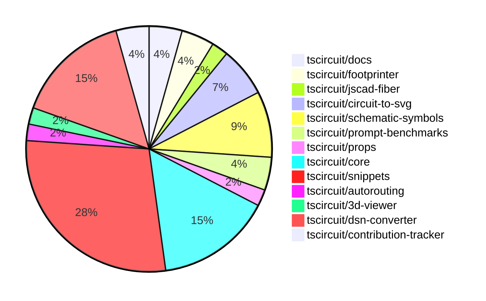

# Contribution Overview 2024-12-04

## PRs by Repository

## Contributor Overview

| Contributor | 🐳 Major | 🐙 Minor | 🐌 Tiny | ⭐ | Issues Created |
|-------------|---------|---------|---------|-----|----------------|
| [imrishabh18](#imrishabh18) | 3 | 5 | 0 | ⭐⭐⭐ | 11 |
| [ShiboSoftwareDev](#ShiboSoftwareDev) | 1 | 6 | 3 | ⭐⭐⭐ | 6 |
| [seveibar](#seveibar) | 0 | 3 | 1 | ⭐⭐ | 40 |
| [Abse2001](#Abse2001) | 1 | 6 | 0 | ⭐⭐ | 2 |
| [AnasSarkiz](#AnasSarkiz) | 1 | 4 | 0 | ⭐⭐ | 2 |
| [Anshgrover23](#Anshgrover23) | 1 | 3 | 0 | ⭐ | 1 |
| [RohittCodes](#RohittCodes) | 1 | 3 | 0 | ⭐ | 1 |
| [techmannih](#techmannih) | 0 | 2 | 0 | ⭐ | 1 |
| [mrudulpatil18](#mrudulpatil18) | 0 | 1 | 0 |  | 0 |
| [samyakshah3008](#samyakshah3008) | 0 | 0 | 1 |  | 1 |

## Review Table

| Contributor | Reviews Received | Approvals | Rejections | Changes Requested | PRs Opened | PRs Closed | Issues Created | Bountied Issues | Bountied Issue $ |
|-------------|------------------|-----------|------------|-------------------|------------|------------|----------------|-----------------|------------------|
| [samyakshah3008](https://github.com/samyakshah3008) | 1 | 1 | 0 | 0 | 1 | 1 | 1 | 1 | 1 |
| [AnasSarkiz](https://github.com/AnasSarkiz) | 22 | 5 | 2 | 3 | 6 | 5 | 2 | 0 | 0 |
| [techmannih](https://github.com/techmannih) | 6 | 2 | 1 | 1 | 4 | 2 | 1 | 0 | 0 |
| [ShiboSoftwareDev](https://github.com/ShiboSoftwareDev) | 14 | 8 | 2 | 3 | 10 | 10 | 6 | 3 | 70 |
| [Abse2001](https://github.com/Abse2001) | 13 | 6 | 4 | 1 | 7 | 7 | 2 | 1 | 15 |
| [imrishabh18](https://github.com/imrishabh18) | 1 | 1 | 2 | 0 | 8 | 8 | 11 | 4 | 65 |
| [seveibar](https://github.com/seveibar) | 0 | 0 | 0 | 0 | 6 | 4 | 40 | 24 | 632 |
| [RohittCodes](https://github.com/RohittCodes) | 12 | 5 | 3 | 4 | 7 | 6 | 1 | 1 | 5 |
| [UdaykiranRegimudi](https://github.com/UdaykiranRegimudi) | 2 | 0 | 0 | 2 | 1 | 0 | 0 | 0 | 0 |
| [divanshu-go](https://github.com/divanshu-go) | 1 | 0 | 1 | 1 | 1 | 0 | 0 | 0 | 0 |
| [Anshgrover23](https://github.com/Anshgrover23) | 18 | 7 | 2 | 2 | 6 | 5 | 1 | 0 | 0 |
| [mrudulpatil18](https://github.com/mrudulpatil18) | 1 | 1 | 0 | 0 | 1 | 1 | 0 | 0 | 0 |

## Changes by Repository

### [tscircuit/docs](https://github.com/tscircuit/docs)

| PR # | Impact | Contributor | Description |
|------|--------|-------------|-------------|
| [#43](https://github.com/tscircuit/docs/pull/43) | 🐳 Major | AnasSarkiz | Added a new tutorial for the ESP32-D0WDQ6 development circuit, including a detailed schematic and component specifications. |
| [#49](https://github.com/tscircuit/docs/pull/49) | 🐌 Tiny | samyakshah3008 | Fix incorrect LinkedIn URL in the footer of the documentation site. |

### [tscircuit/footprinter](https://github.com/tscircuit/footprinter)

| PR # | Impact | Contributor | Description |
|------|--------|-------------|-------------|
| [#92](https://github.com/tscircuit/footprinter/pull/92) | 🐙 Minor | AnasSarkiz | Added default values of 2mm for top and bottom margins of stampboard and stampreceiver components. |
| [#94](https://github.com/tscircuit/footprinter/pull/94) | 🐙 Minor | ShiboSoftwareDev | Updated the package dependencies to use "circuit-json" instead of "@tscircuit/soup". |

### [tscircuit/jscad-fiber](https://github.com/tscircuit/jscad-fiber)

| PR # | Impact | Contributor | Description |
|------|--------|-------------|-------------|
| [#95](https://github.com/tscircuit/jscad-fiber/pull/95) | 🐙 Minor | AnasSarkiz | The pull request improves the usage documentation by adding README examples for each component in the jscad-fiber library. |

### [tscircuit/circuit-to-svg](https://github.com/tscircuit/circuit-to-svg)

| PR # | Impact | Contributor | Description |
|------|--------|-------------|-------------|
| [#142](https://github.com/tscircuit/circuit-to-svg/pull/142) | 🐙 Minor | AnasSarkiz | Added metadata attributes and a `<g>` wrapper for draggable schematic components |
| [#143](https://github.com/tscircuit/circuit-to-svg/pull/143) | 🐙 Minor | ShiboSoftwareDev | Update dependencies to newer versions |
| [#144](https://github.com/tscircuit/circuit-to-svg/pull/144) | 🐙 Minor | Abse2001 | The pull request creates a function to generate SVG objects for schematic net symbols using the `schematic_net_label.symbol_name` property. |

### [tscircuit/schematic-symbols](https://github.com/tscircuit/schematic-symbols)

| PR # | Impact | Contributor | Description |
|------|--------|-------------|-------------|
| [#217](https://github.com/tscircuit/schematic-symbols/pull/217) | 🐙 Minor | AnasSarkiz | Added new inductor symbols (left, down, right, up) instead of horizontal and vertical. |
| [#221](https://github.com/tscircuit/schematic-symbols/pull/221) | 🐙 Minor | Abse2001 | Added new boxresistor symbols (down, left, right, up) and removed the old horizontal and vertical boxresistor symbols. |
| [#219](https://github.com/tscircuit/schematic-symbols/pull/219) | 🐙 Minor | Abse2001 | Adjusted the REF and VAL fields for capacitors in the generated capacitor.json file. |
| [#222](https://github.com/tscircuit/schematic-symbols/pull/222) | 🐙 Minor | Anshgrover23 | Adds a script to validate the presence of SVG snapshots and a pre-commit hook to run the validation. |

### [tscircuit/prompt-benchmarks](https://github.com/tscircuit/prompt-benchmarks)

| PR # | Impact | Contributor | Description |
|------|--------|-------------|-------------|
| [#9](https://github.com/tscircuit/prompt-benchmarks/pull/9) | 🐳 Major | ShiboSoftwareDev | Adds a new benchmarking tool called "evalite" to the project. |
| [#8](https://github.com/tscircuit/prompt-benchmarks/pull/8) | 🐙 Minor | ShiboSoftwareDev | The pull request adds new benchmark problems for testing AI's ability to create electronic circuits and evaluates the AI's responses. |

### [tscircuit/props](https://github.com/tscircuit/props)

| PR # | Impact | Contributor | Description |
|------|--------|-------------|-------------|
| [#111](https://github.com/tscircuit/props/pull/111) | 🐙 Minor | ShiboSoftwareDev | The pull request adds support for building the package with ESM (ECMAScript Modules). |

### [tscircuit/core](https://github.com/tscircuit/core)

| PR # | Impact | Contributor | Description |
|------|--------|-------------|-------------|
| [#381](https://github.com/tscircuit/core/pull/381) | 🐳 Major | Abse2001 | Adds a new `schDisplayLabel` prop to the `<trace />` component, which allows displaying a label for the schematic trace. This includes adding the necessary logic to create and position the net label. |
| [#393](https://github.com/tscircuit/core/pull/393) | 🐙 Minor | ShiboSoftwareDev | Update dependencies in the package.json file |
| [#396](https://github.com/tscircuit/core/pull/396) | 🐙 Minor | Abse2001 | Fixes the JSX type module for React 19 types |
| [#400](https://github.com/tscircuit/core/pull/400) | 🐙 Minor | imrishabh18 | Fix missing oval shape in the PCB render. |
| [#391](https://github.com/tscircuit/core/pull/391) | 🐙 Minor | seveibar | Improve the error message for missing footprint to include the component name instead of just the component ID. |
| [#395](https://github.com/tscircuit/core/pull/395) | 🐌 Tiny | ShiboSoftwareDev | Updates dependencies in the package.json file. |
| [#394](https://github.com/tscircuit/core/pull/394) | 🐌 Tiny | ShiboSoftwareDev | Updated the version of the `@tscircuit/footprinter` dependency from `0.0.91` to `0.0.92`. |

### [tscircuit/snippets](https://github.com/tscircuit/snippets)

| PR # | Impact | Contributor | Description |
|------|--------|-------------|-------------|
| [#327](https://github.com/tscircuit/snippets/pull/327) | 🐳 Major | RohittCodes | The pull request adds support for dynamic container height in the PCB Viewer and Schematic components, ensuring they fill the available space in the parent container. |
| [#339](https://github.com/tscircuit/snippets/pull/339) | 🐙 Minor | ShiboSoftwareDev | Adds an auto-run feature that runs the code whenever the editor is entered. |
| [#356](https://github.com/tscircuit/snippets/pull/356) | 🐙 Minor | Abse2001 | Updated the "@tscircuit/core" dependency to version 0.0.219. |
| [#358](https://github.com/tscircuit/snippets/pull/358) | 🐙 Minor | seveibar | Update the `dsn-converter` dependency version and add it to the list of dependencies to be automatically updated by Renovate. |
| [#355](https://github.com/tscircuit/snippets/pull/355) | 🐙 Minor | seveibar | Adds a new dialog component to view the TypeScript files used in the Code Editor. |
| [#351](https://github.com/tscircuit/snippets/pull/351) | 🐙 Minor | Anshgrover23 | Fixes the regular expression to support underscores in package names. |
| [#350](https://github.com/tscircuit/snippets/pull/350) | 🐙 Minor | techmannih | Add retries for flaky test |
| [#338](https://github.com/tscircuit/snippets/pull/338) | 🐙 Minor | techmannih | Fix multiple cursors when ctrl+click is triggered |
| [#307](https://github.com/tscircuit/snippets/pull/307) | 🐙 Minor | RohittCodes | Refactors the search links functionality to handle different page locations and open links in a new tab or the current page as needed. |
| [#297](https://github.com/tscircuit/snippets/pull/297) | 🐙 Minor | RohittCodes | Rename a snippet and introduce a finally block to handle potential errors. |
| [#341](https://github.com/tscircuit/snippets/pull/341) | 🐙 Minor | RohittCodes | Increase the timeout for Playwright tests from 5 minutes to 10 minutes. |
| [#330](https://github.com/tscircuit/snippets/pull/330) | 🐙 Minor | mrudulpatil18 | Added static skeleton page with fixed data to mimic the normal components and provide a loading view. |
| [#357](https://github.com/tscircuit/snippets/pull/357) | 🐌 Tiny | seveibar | Updates Playwright snapshots for the star and view-snippet tests. |

### [tscircuit/autorouting](https://github.com/tscircuit/autorouting)

| PR # | Impact | Contributor | Description |
|------|--------|-------------|-------------|
| [#95](https://github.com/tscircuit/autorouting/pull/95) | 🐌 Tiny | ShiboSoftwareDev | Updated packages |

### [tscircuit/3d-viewer](https://github.com/tscircuit/3d-viewer)

| PR # | Impact | Contributor | Description |
|------|--------|-------------|-------------|
| [#52](https://github.com/tscircuit/3d-viewer/pull/52) | 🐙 Minor | Abse2001 | This pull request fixes an issue where tooltips were popping up excessively in the 3D viewer. |

### [tscircuit/dsn-converter](https://github.com/tscircuit/dsn-converter)

| PR # | Impact | Contributor | Description |
|------|--------|-------------|-------------|
| [#53](https://github.com/tscircuit/dsn-converter/pull/53) | 🐳 Major | imrishabh18 | Refactor the plated-holes and smtpads processing in the `convert-circuit-json-to-dsn-json` function. |
| [#52](https://github.com/tscircuit/dsn-converter/pull/52) | 🐳 Major | imrishabh18 | Refactor padstack name and padstack shape, add support for circular, oval, and rectangular padstacks. |
| [#47](https://github.com/tscircuit/dsn-converter/pull/47) | 🐳 Major | imrishabh18 | Add support for pill shaped plated holes |
| [#55](https://github.com/tscircuit/dsn-converter/pull/55) | 🐙 Minor | imrishabh18 | Fixes the port numbers in the order of the Arduino Nano component |
| [#51](https://github.com/tscircuit/dsn-converter/pull/51) | 🐙 Minor | imrishabh18 | Fixes the rotation and footprint naming for components. |
| [#49](https://github.com/tscircuit/dsn-converter/pull/49) | 🐙 Minor | imrishabh18 | Fix the position of pads in the `registry-api` traces. |
| [#46](https://github.com/tscircuit/dsn-converter/pull/46) | 🐙 Minor | imrishabh18 | Handles plated holes with different sizes and groups them by dimensions. |

### [tscircuit/contribution-tracker](https://github.com/tscircuit/contribution-tracker)

| PR # | Impact | Contributor | Description |
|------|--------|-------------|-------------|
| [#17](https://github.com/tscircuit/contribution-tracker/pull/17) | 🐳 Major | Anshgrover23 | Adds the ability to detect and track the number of bountied issues created by contributors. |
| [#20](https://github.com/tscircuit/contribution-tracker/pull/20) | 🐙 Minor | Anshgrover23 | Added the count of bountied issues created by each contributor as a star factor. |

## Changes by Contributor

### [samyakshah3008](https://github.com/samyakshah3008)

| PR # | Impact | Description |
|------|--------|-------------|
| [#49](https://github.com/tscircuit/docs/pull/49) | 🐌 Tiny | Fix incorrect LinkedIn URL in the footer of the documentation site. |

### [AnasSarkiz](https://github.com/AnasSarkiz)

| PR # | Impact | Description |
|------|--------|-------------|
| [#43](https://github.com/tscircuit/docs/pull/43) | 🐳 Major | Added a new tutorial for the ESP32-D0WDQ6 development circuit, including a detailed schematic and component specifications. |
| [#92](https://github.com/tscircuit/footprinter/pull/92) | 🐙 Minor | Added default values of 2mm for top and bottom margins of stampboard and stampreceiver components. |
| [#95](https://github.com/tscircuit/jscad-fiber/pull/95) | 🐙 Minor | The pull request improves the usage documentation by adding README examples for each component in the jscad-fiber library. |
| [#142](https://github.com/tscircuit/circuit-to-svg/pull/142) | 🐙 Minor | Added metadata attributes and a `<g>` wrapper for draggable schematic components |
| [#217](https://github.com/tscircuit/schematic-symbols/pull/217) | 🐙 Minor | Added new inductor symbols (left, down, right, up) instead of horizontal and vertical. |

### [ShiboSoftwareDev](https://github.com/ShiboSoftwareDev)

| PR # | Impact | Description |
|------|--------|-------------|
| [#9](https://github.com/tscircuit/prompt-benchmarks/pull/9) | 🐳 Major | Adds a new benchmarking tool called "evalite" to the project. |
| [#111](https://github.com/tscircuit/props/pull/111) | 🐙 Minor | The pull request adds support for building the package with ESM (ECMAScript Modules). |
| [#94](https://github.com/tscircuit/footprinter/pull/94) | 🐙 Minor | Updated the package dependencies to use "circuit-json" instead of "@tscircuit/soup". |
| [#393](https://github.com/tscircuit/core/pull/393) | 🐙 Minor | Update dependencies in the package.json file |
| [#143](https://github.com/tscircuit/circuit-to-svg/pull/143) | 🐙 Minor | Update dependencies to newer versions |
| [#339](https://github.com/tscircuit/snippets/pull/339) | 🐙 Minor | Adds an auto-run feature that runs the code whenever the editor is entered. |
| [#8](https://github.com/tscircuit/prompt-benchmarks/pull/8) | 🐙 Minor | The pull request adds new benchmark problems for testing AI's ability to create electronic circuits and evaluates the AI's responses. |
| [#395](https://github.com/tscircuit/core/pull/395) | 🐌 Tiny | Updates dependencies in the package.json file. |
| [#394](https://github.com/tscircuit/core/pull/394) | 🐌 Tiny | Updated the version of the `@tscircuit/footprinter` dependency from `0.0.91` to `0.0.92`. |
| [#95](https://github.com/tscircuit/autorouting/pull/95) | 🐌 Tiny | Updated packages |

### [Abse2001](https://github.com/Abse2001)

| PR # | Impact | Description |
|------|--------|-------------|
| [#381](https://github.com/tscircuit/core/pull/381) | 🐳 Major | Adds a new `schDisplayLabel` prop to the `<trace />` component, which allows displaying a label for the schematic trace. This includes adding the necessary logic to create and position the net label. |
| [#52](https://github.com/tscircuit/3d-viewer/pull/52) | 🐙 Minor | This pull request fixes an issue where tooltips were popping up excessively in the 3D viewer. |
| [#396](https://github.com/tscircuit/core/pull/396) | 🐙 Minor | Fixes the JSX type module for React 19 types |
| [#144](https://github.com/tscircuit/circuit-to-svg/pull/144) | 🐙 Minor | The pull request creates a function to generate SVG objects for schematic net symbols using the `schematic_net_label.symbol_name` property. |
| [#221](https://github.com/tscircuit/schematic-symbols/pull/221) | 🐙 Minor | Added new boxresistor symbols (down, left, right, up) and removed the old horizontal and vertical boxresistor symbols. |
| [#219](https://github.com/tscircuit/schematic-symbols/pull/219) | 🐙 Minor | Adjusted the REF and VAL fields for capacitors in the generated capacitor.json file. |
| [#356](https://github.com/tscircuit/snippets/pull/356) | 🐙 Minor | Updated the "@tscircuit/core" dependency to version 0.0.219. |

### [imrishabh18](https://github.com/imrishabh18)

| PR # | Impact | Description |
|------|--------|-------------|
| [#53](https://github.com/tscircuit/dsn-converter/pull/53) | 🐳 Major | Refactor the plated-holes and smtpads processing in the `convert-circuit-json-to-dsn-json` function. |
| [#52](https://github.com/tscircuit/dsn-converter/pull/52) | 🐳 Major | Refactor padstack name and padstack shape, add support for circular, oval, and rectangular padstacks. |
| [#47](https://github.com/tscircuit/dsn-converter/pull/47) | 🐳 Major | Add support for pill shaped plated holes |
| [#400](https://github.com/tscircuit/core/pull/400) | 🐙 Minor | Fix missing oval shape in the PCB render. |
| [#55](https://github.com/tscircuit/dsn-converter/pull/55) | 🐙 Minor | Fixes the port numbers in the order of the Arduino Nano component |
| [#51](https://github.com/tscircuit/dsn-converter/pull/51) | 🐙 Minor | Fixes the rotation and footprint naming for components. |
| [#49](https://github.com/tscircuit/dsn-converter/pull/49) | 🐙 Minor | Fix the position of pads in the `registry-api` traces. |
| [#46](https://github.com/tscircuit/dsn-converter/pull/46) | 🐙 Minor | Handles plated holes with different sizes and groups them by dimensions. |

### [seveibar](https://github.com/seveibar)

| PR # | Impact | Description |
|------|--------|-------------|
| [#391](https://github.com/tscircuit/core/pull/391) | 🐙 Minor | Improve the error message for missing footprint to include the component name instead of just the component ID. |
| [#358](https://github.com/tscircuit/snippets/pull/358) | 🐙 Minor | Update the `dsn-converter` dependency version and add it to the list of dependencies to be automatically updated by Renovate. |
| [#355](https://github.com/tscircuit/snippets/pull/355) | 🐙 Minor | Adds a new dialog component to view the TypeScript files used in the Code Editor. |
| [#357](https://github.com/tscircuit/snippets/pull/357) | 🐌 Tiny | Updates Playwright snapshots for the star and view-snippet tests. |

### [Anshgrover23](https://github.com/Anshgrover23)

| PR # | Impact | Description |
|------|--------|-------------|
| [#17](https://github.com/tscircuit/contribution-tracker/pull/17) | 🐳 Major | Adds the ability to detect and track the number of bountied issues created by contributors. |
| [#20](https://github.com/tscircuit/contribution-tracker/pull/20) | 🐙 Minor | Added the count of bountied issues created by each contributor as a star factor. |
| [#222](https://github.com/tscircuit/schematic-symbols/pull/222) | 🐙 Minor | Adds a script to validate the presence of SVG snapshots and a pre-commit hook to run the validation. |
| [#351](https://github.com/tscircuit/snippets/pull/351) | 🐙 Minor | Fixes the regular expression to support underscores in package names. |

### [techmannih](https://github.com/techmannih)

| PR # | Impact | Description |
|------|--------|-------------|
| [#350](https://github.com/tscircuit/snippets/pull/350) | 🐙 Minor | Add retries for flaky test |
| [#338](https://github.com/tscircuit/snippets/pull/338) | 🐙 Minor | Fix multiple cursors when ctrl+click is triggered |

### [RohittCodes](https://github.com/RohittCodes)

| PR # | Impact | Description |
|------|--------|-------------|
| [#327](https://github.com/tscircuit/snippets/pull/327) | 🐳 Major | The pull request adds support for dynamic container height in the PCB Viewer and Schematic components, ensuring they fill the available space in the parent container. |
| [#307](https://github.com/tscircuit/snippets/pull/307) | 🐙 Minor | Refactors the search links functionality to handle different page locations and open links in a new tab or the current page as needed. |
| [#297](https://github.com/tscircuit/snippets/pull/297) | 🐙 Minor | Rename a snippet and introduce a finally block to handle potential errors. |
| [#341](https://github.com/tscircuit/snippets/pull/341) | 🐙 Minor | Increase the timeout for Playwright tests from 5 minutes to 10 minutes. |

### [mrudulpatil18](https://github.com/mrudulpatil18)

| PR # | Impact | Description |
|------|--------|-------------|
| [#330](https://github.com/tscircuit/snippets/pull/330) | 🐙 Minor | Added static skeleton page with fixed data to mimic the normal components and provide a loading view. |

