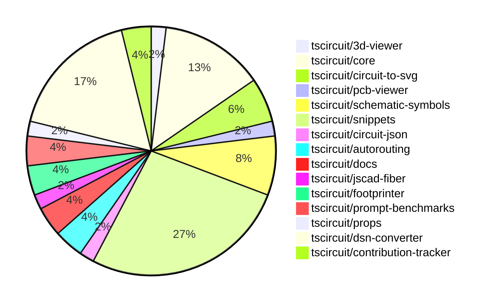

# Contribution Overview 2024-12-04

## PRs by Repository

## Contributor Overview

| Contributor | 🐳 Major | 🐙 Minor | 🐌 Tiny | ⭐ | Issues Created |
|-------------|---------|---------|---------|-----|----------------|
| [ShiboSoftwareDev](#ShiboSoftwareDev) | 3 | 5 | 2 | ⭐⭐⭐ | 6 |
| [imrishabh18](#imrishabh18) | 2 | 8 | 0 | ⭐⭐⭐ | 11 |
| [Abse2001](#Abse2001) | 3 | 4 | 1 | ⭐⭐⭐ | 5 |
| [seveibar](#seveibar) | 0 | 5 | 1 | ⭐⭐⭐ | 51 |
| [AnasSarkiz](#AnasSarkiz) | 3 | 2 | 0 | ⭐⭐ | 2 |
| [RohittCodes](#RohittCodes) | 2 | 3 | 0 | ⭐⭐ | 1 |
| [Anshgrover23](#Anshgrover23) | 0 | 4 | 0 | ⭐ | 1 |
| [techmannih](#techmannih) | 0 | 2 | 0 | ⭐ | 1 |
| [mrudulpatil18](#mrudulpatil18) | 0 | 1 | 0 |  | 0 |
| [samyakshah3008](#samyakshah3008) | 0 | 0 | 1 |  | 2 |

## Review Table

| Contributor | Reviews Received | Approvals | Rejections | Changes Requested | PRs Opened | PRs Closed | Issues Created | Bountied Issues | Bountied Issue $ |
|-------------|------------------|-----------|------------|-------------------|------------|------------|----------------|-----------------|------------------|
| [Abse2001](https://github.com/Abse2001) | 14 | 7 | 4 | 1 | 8 | 8 | 5 | 3 | 57 |
| [seveibar](https://github.com/seveibar) | 0 | 0 | 1 | 0 | 10 | 6 | 51 | 35 | 990 |
| [samyakshah3008](https://github.com/samyakshah3008) | 3 | 1 | 0 | 1 | 2 | 1 | 2 | 1 | 1 |
| [AnasSarkiz](https://github.com/AnasSarkiz) | 22 | 5 | 2 | 3 | 6 | 5 | 2 | 0 | 0 |
| [techmannih](https://github.com/techmannih) | 6 | 2 | 1 | 1 | 4 | 2 | 1 | 0 | 0 |
| [ShiboSoftwareDev](https://github.com/ShiboSoftwareDev) | 14 | 8 | 2 | 3 | 10 | 10 | 6 | 3 | 70 |
| [imrishabh18](https://github.com/imrishabh18) | 1 | 1 | 2 | 0 | 10 | 10 | 11 | 4 | 65 |
| [RohittCodes](https://github.com/RohittCodes) | 28 | 6 | 3 | 9 | 8 | 8 | 1 | 1 | 5 |
| [UdaykiranRegimudi](https://github.com/UdaykiranRegimudi) | 2 | 0 | 0 | 2 | 1 | 0 | 0 | 0 | 0 |
| [divanshu-go](https://github.com/divanshu-go) | 1 | 0 | 1 | 1 | 1 | 0 | 0 | 0 | 0 |
| [Anshgrover23](https://github.com/Anshgrover23) | 19 | 7 | 3 | 2 | 7 | 5 | 1 | 0 | 0 |
| [mrudulpatil18](https://github.com/mrudulpatil18) | 1 | 1 | 0 | 0 | 1 | 1 | 0 | 0 | 0 |

## Changes by Repository

### [tscircuit/3d-viewer](https://github.com/tscircuit/3d-viewer)

| PR # | Impact | Contributor | Description |
|------|--------|-------------|-------------|
| [#52](https://github.com/tscircuit/3d-viewer/pull/52) | 🐳 Major | Abse2001 | Fixed a bug that caused a ton of tooltips to pop up in the 3D viewer. |

### [tscircuit/core](https://github.com/tscircuit/core)

| PR # | Impact | Contributor | Description |
|------|--------|-------------|-------------|
| [#381](https://github.com/tscircuit/core/pull/381) | 🐳 Major | Abse2001 | Introduces a new prop called `schDisplayLabel` for the `<trace />` component, and adds logic to render net labels for the `from` and `to` ports based on this prop. |
| [#396](https://github.com/tscircuit/core/pull/396) | 🐙 Minor | Abse2001 | Fixing the JSX type module for React 19 types |
| [#391](https://github.com/tscircuit/core/pull/391) | 🐙 Minor | seveibar | Improve the error message for missing footprint by using the component's string representation instead of just the name. |
| [#393](https://github.com/tscircuit/core/pull/393) | 🐙 Minor | ShiboSoftwareDev | Update dependencies in the package.json file |
| [#400](https://github.com/tscircuit/core/pull/400) | 🐙 Minor | imrishabh18 | Fix missing oval shape in the PCB render |
| [#395](https://github.com/tscircuit/core/pull/395) | 🐌 Tiny | ShiboSoftwareDev | Updated dependencies in the `package.json` file. |
| [#394](https://github.com/tscircuit/core/pull/394) | 🐌 Tiny | ShiboSoftwareDev | Updated the `@tscircuit/footprinter` dependency from version `0.0.91` to `0.0.92`. |

### [tscircuit/circuit-to-svg](https://github.com/tscircuit/circuit-to-svg)

| PR # | Impact | Contributor | Description |
|------|--------|-------------|-------------|
| [#144](https://github.com/tscircuit/circuit-to-svg/pull/144) | 🐳 Major | Abse2001 | Introduced a new function `createSvgObjectsForSchNetSymbol` to create SVG objects for a schematic net symbol. |
| [#142](https://github.com/tscircuit/circuit-to-svg/pull/142) | 🐳 Major | AnasSarkiz | Added metadata attributes and a `<g>` wrapper for draggable schematic components |
| [#143](https://github.com/tscircuit/circuit-to-svg/pull/143) | 🐙 Minor | ShiboSoftwareDev | Updates dependencies in the package.json file |

### [tscircuit/pcb-viewer](https://github.com/tscircuit/pcb-viewer)

| PR # | Impact | Contributor | Description |
|------|--------|-------------|-------------|
| [#86](https://github.com/tscircuit/pcb-viewer/pull/86) | 🐙 Minor | Abse2001 | Fixed the issue where the pads were being rotated in the opposite direction and made the ElementOverlayBox.tsx follow the PCB parent rotation. |

### [tscircuit/schematic-symbols](https://github.com/tscircuit/schematic-symbols)

| PR # | Impact | Contributor | Description |
|------|--------|-------------|-------------|
| [#221](https://github.com/tscircuit/schematic-symbols/pull/221) | 🐙 Minor | Abse2001 | Added new resistor symbols for down, left, right, and up orientations, and also fixed the anchor position for the value and reference text. |
| [#217](https://github.com/tscircuit/schematic-symbols/pull/217) | 🐙 Minor | AnasSarkiz | Added inductor symbols with left/down/right/up directions instead of horizontal and vertical. |
| [#222](https://github.com/tscircuit/schematic-symbols/pull/222) | 🐙 Minor | Anshgrover23 | Adds an SVG snapshot validation script and a pre-commit hook to ensure all symbol snapshots are present. |
| [#219](https://github.com/tscircuit/schematic-symbols/pull/219) | 🐌 Tiny | Abse2001 | Adjusted the REF and VAL positions for capacitors in the generated JSON and SVG files. |

### [tscircuit/snippets](https://github.com/tscircuit/snippets)

| PR # | Impact | Contributor | Description |
|------|--------|-------------|-------------|
| [#339](https://github.com/tscircuit/snippets/pull/339) | 🐳 Major | ShiboSoftwareDev | Adds auto-run functionality for code snippets in the editor. |
| [#269](https://github.com/tscircuit/snippets/pull/269) | 🐳 Major | RohittCodes | Refactored the manual_edit_json template ingestion into the database and added playwright tests to validate the functionality. |
| [#327](https://github.com/tscircuit/snippets/pull/327) | 🐳 Major | RohittCodes | This pull request expands the height of the circuit preview to the full height of the container or the screen, whichever is smaller. |
| [#356](https://github.com/tscircuit/snippets/pull/356) | 🐙 Minor | Abse2001 | Updated the version of the `@tscircuit/core` dependency from `0.0.217` to `0.0.219`. |
| [#358](https://github.com/tscircuit/snippets/pull/358) | 🐙 Minor | seveibar | Update the version of the `dsn-converter` package and add it to the autoupdate list in the `renovate.json` file. |
| [#355](https://github.com/tscircuit/snippets/pull/355) | 🐙 Minor | seveibar | Adds a new dialog component to view the TypeScript files used in the code editor. |
| [#351](https://github.com/tscircuit/snippets/pull/351) | 🐙 Minor | Anshgrover23 | Fixes the regular expression to support underscores in package names. |
| [#307](https://github.com/tscircuit/snippets/pull/307) | 🐙 Minor | RohittCodes | Refactors the search links to open in a new tab if the current page is /editor or /ai, and in the same tab otherwise. |
| [#297](https://github.com/tscircuit/snippets/pull/297) | 🐙 Minor | RohittCodes | Fixes a bug by adding a timeout and a finally block to the rename snippet dialog. |
| [#341](https://github.com/tscircuit/snippets/pull/341) | 🐙 Minor | RohittCodes | Increased the timeout for the Playwright tests from 5 minutes to 10 minutes. |
| [#350](https://github.com/tscircuit/snippets/pull/350) | 🐙 Minor | techmannih | Add retries for flaky test |
| [#338](https://github.com/tscircuit/snippets/pull/338) | 🐙 Minor | techmannih | Disables multiple cursors when ctrl+click is triggered. |
| [#330](https://github.com/tscircuit/snippets/pull/330) | 🐙 Minor | mrudulpatil18 | Added a static skeleton page with fixed data to mimic the normal components and improve the loading experience. |
| [#357](https://github.com/tscircuit/snippets/pull/357) | 🐌 Tiny | seveibar | Update Playwright test snapshots |

### [tscircuit/circuit-json](https://github.com/tscircuit/circuit-json)

| PR # | Impact | Contributor | Description |
|------|--------|-------------|-------------|
| [#85](https://github.com/tscircuit/circuit-json/pull/85) | 🐙 Minor | seveibar | Introduce a new schematic element called "schematic_voltage_probe" that allows for measuring the voltage on a schematic trace. |

### [tscircuit/autorouting](https://github.com/tscircuit/autorouting)

| PR # | Impact | Contributor | Description |
|------|--------|-------------|-------------|
| [#98](https://github.com/tscircuit/autorouting/pull/98) | 🐙 Minor | seveibar |  |
| [#95](https://github.com/tscircuit/autorouting/pull/95) | 🐙 Minor | ShiboSoftwareDev | Updated dependencies in the project. |

### [tscircuit/docs](https://github.com/tscircuit/docs)

| PR # | Impact | Contributor | Description |
|------|--------|-------------|-------------|
| [#43](https://github.com/tscircuit/docs/pull/43) | 🐳 Major | AnasSarkiz | Added a new tutorial for creating a development circuit based on the ESP32-D0WD microcontroller, including all essential supporting components. |
| [#49](https://github.com/tscircuit/docs/pull/49) | 🐌 Tiny | samyakshah3008 | Fix incorrect LinkedIn URL in the footer |

### [tscircuit/jscad-fiber](https://github.com/tscircuit/jscad-fiber)

| PR # | Impact | Contributor | Description |
|------|--------|-------------|-------------|
| [#95](https://github.com/tscircuit/jscad-fiber/pull/95) | 🐳 Major | AnasSarkiz | This pull request improves the usage documentation for the jscad-fiber library by adding examples of each component and a table of component props. |

### [tscircuit/footprinter](https://github.com/tscircuit/footprinter)

| PR # | Impact | Contributor | Description |
|------|--------|-------------|-------------|
| [#94](https://github.com/tscircuit/footprinter/pull/94) | 🐳 Major | ShiboSoftwareDev | Updated the package dependencies to use "circuit-json" instead of "@tscircuit/soup" |
| [#92](https://github.com/tscircuit/footprinter/pull/92) | 🐙 Minor | AnasSarkiz | Added default values of 2 for `top` and `bottom` properties in `stampboard` and `stampreceiver` components. |

### [tscircuit/prompt-benchmarks](https://github.com/tscircuit/prompt-benchmarks)

| PR # | Impact | Contributor | Description |
|------|--------|-------------|-------------|
| [#9](https://github.com/tscircuit/prompt-benchmarks/pull/9) | 🐳 Major | ShiboSoftwareDev | Adds a new benchmarking tool called "evalite" for evaluating AI model responses to circuit design prompts. |
| [#8](https://github.com/tscircuit/prompt-benchmarks/pull/8) | 🐙 Minor | ShiboSoftwareDev | The pull request adds new benchmark problems for AI-generated circuit designs, including a 555 timer with blinking LED, an LED driver circuit, an RC low-pass filter, and an astable multivibrator. |

### [tscircuit/props](https://github.com/tscircuit/props)

| PR # | Impact | Contributor | Description |
|------|--------|-------------|-------------|
| [#111](https://github.com/tscircuit/props/pull/111) | 🐙 Minor | ShiboSoftwareDev | Changes the build process to support ES modules (ESM) |

### [tscircuit/dsn-converter](https://github.com/tscircuit/dsn-converter)

| PR # | Impact | Contributor | Description |
|------|--------|-------------|-------------|
| [#53](https://github.com/tscircuit/dsn-converter/pull/53) | 🐳 Major | imrishabh18 | Major refactor of plated-holes and smtpads processing in the conversion from circuit-json to dsn-json. |
| [#47](https://github.com/tscircuit/dsn-converter/pull/47) | 🐳 Major | imrishabh18 | Add support for pill-shaped plated holes |
| [#57](https://github.com/tscircuit/dsn-converter/pull/57) | 🐙 Minor | imrishabh18 | Fix the issue of not getting the unconnected pads in the nets list. |
| [#56](https://github.com/tscircuit/dsn-converter/pull/56) | 🐙 Minor | imrishabh18 | Refactor the code to use the `soup-util` library for more concise and readable code. |
| [#55](https://github.com/tscircuit/dsn-converter/pull/55) | 🐙 Minor | imrishabh18 | The pull request fixes the port numbers in the order. |
| [#52](https://github.com/tscircuit/dsn-converter/pull/52) | 🐙 Minor | imrishabh18 | Refactor padstack name and padstack shape handling |
| [#51](https://github.com/tscircuit/dsn-converter/pull/51) | 🐙 Minor | imrishabh18 | Fix the rotation and footprint naming to ensure the footprint name used for component placement is unique. |
| [#49](https://github.com/tscircuit/dsn-converter/pull/49) | 🐙 Minor | imrishabh18 | Fix the position of pads in the `process-components-and-pads.ts` file to correct an issue in the `registry-api` traces. |
| [#46](https://github.com/tscircuit/dsn-converter/pull/46) | 🐙 Minor | imrishabh18 | The pull request fixes an issue where different sized plated holes were not being handled correctly. |

### [tscircuit/contribution-tracker](https://github.com/tscircuit/contribution-tracker)

| PR # | Impact | Contributor | Description |
|------|--------|-------------|-------------|
| [#20](https://github.com/tscircuit/contribution-tracker/pull/20) | 🐙 Minor | Anshgrover23 | Adds the bountied issue amount as a star factor in the contributor ranking. |
| [#17](https://github.com/tscircuit/contribution-tracker/pull/17) | 🐙 Minor | Anshgrover23 | Adds functionality to detect the number of issues created that have a bounty and the total bounty amount for each contributor. |

## Changes by Contributor

### [Abse2001](https://github.com/Abse2001)

| PR # | Impact | Description |
|------|--------|-------------|
| [#52](https://github.com/tscircuit/3d-viewer/pull/52) | 🐳 Major | Fixed a bug that caused a ton of tooltips to pop up in the 3D viewer. |
| [#381](https://github.com/tscircuit/core/pull/381) | 🐳 Major | Introduces a new prop called `schDisplayLabel` for the `<trace />` component, and adds logic to render net labels for the `from` and `to` ports based on this prop. |
| [#144](https://github.com/tscircuit/circuit-to-svg/pull/144) | 🐳 Major | Introduced a new function `createSvgObjectsForSchNetSymbol` to create SVG objects for a schematic net symbol. |
| [#86](https://github.com/tscircuit/pcb-viewer/pull/86) | 🐙 Minor | Fixed the issue where the pads were being rotated in the opposite direction and made the ElementOverlayBox.tsx follow the PCB parent rotation. |
| [#396](https://github.com/tscircuit/core/pull/396) | 🐙 Minor | Fixing the JSX type module for React 19 types |
| [#221](https://github.com/tscircuit/schematic-symbols/pull/221) | 🐙 Minor | Added new resistor symbols for down, left, right, and up orientations, and also fixed the anchor position for the value and reference text. |
| [#356](https://github.com/tscircuit/snippets/pull/356) | 🐙 Minor | Updated the version of the `@tscircuit/core` dependency from `0.0.217` to `0.0.219`. |
| [#219](https://github.com/tscircuit/schematic-symbols/pull/219) | 🐌 Tiny | Adjusted the REF and VAL positions for capacitors in the generated JSON and SVG files. |

### [seveibar](https://github.com/seveibar)

| PR # | Impact | Description |
|------|--------|-------------|
| [#85](https://github.com/tscircuit/circuit-json/pull/85) | 🐙 Minor | Introduce a new schematic element called "schematic_voltage_probe" that allows for measuring the voltage on a schematic trace. |
| [#391](https://github.com/tscircuit/core/pull/391) | 🐙 Minor | Improve the error message for missing footprint by using the component's string representation instead of just the name. |
| [#98](https://github.com/tscircuit/autorouting/pull/98) | 🐙 Minor |  |
| [#358](https://github.com/tscircuit/snippets/pull/358) | 🐙 Minor | Update the version of the `dsn-converter` package and add it to the autoupdate list in the `renovate.json` file. |
| [#355](https://github.com/tscircuit/snippets/pull/355) | 🐙 Minor | Adds a new dialog component to view the TypeScript files used in the code editor. |
| [#357](https://github.com/tscircuit/snippets/pull/357) | 🐌 Tiny | Update Playwright test snapshots |

### [samyakshah3008](https://github.com/samyakshah3008)

| PR # | Impact | Description |
|------|--------|-------------|
| [#49](https://github.com/tscircuit/docs/pull/49) | 🐌 Tiny | Fix incorrect LinkedIn URL in the footer |

### [AnasSarkiz](https://github.com/AnasSarkiz)

| PR # | Impact | Description |
|------|--------|-------------|
| [#43](https://github.com/tscircuit/docs/pull/43) | 🐳 Major | Added a new tutorial for creating a development circuit based on the ESP32-D0WD microcontroller, including all essential supporting components. |
| [#95](https://github.com/tscircuit/jscad-fiber/pull/95) | 🐳 Major | This pull request improves the usage documentation for the jscad-fiber library by adding examples of each component and a table of component props. |
| [#142](https://github.com/tscircuit/circuit-to-svg/pull/142) | 🐳 Major | Added metadata attributes and a `<g>` wrapper for draggable schematic components |
| [#92](https://github.com/tscircuit/footprinter/pull/92) | 🐙 Minor | Added default values of 2 for `top` and `bottom` properties in `stampboard` and `stampreceiver` components. |
| [#217](https://github.com/tscircuit/schematic-symbols/pull/217) | 🐙 Minor | Added inductor symbols with left/down/right/up directions instead of horizontal and vertical. |

### [ShiboSoftwareDev](https://github.com/ShiboSoftwareDev)

| PR # | Impact | Description |
|------|--------|-------------|
| [#94](https://github.com/tscircuit/footprinter/pull/94) | 🐳 Major | Updated the package dependencies to use "circuit-json" instead of "@tscircuit/soup" |
| [#339](https://github.com/tscircuit/snippets/pull/339) | 🐳 Major | Adds auto-run functionality for code snippets in the editor. |
| [#9](https://github.com/tscircuit/prompt-benchmarks/pull/9) | 🐳 Major | Adds a new benchmarking tool called "evalite" for evaluating AI model responses to circuit design prompts. |
| [#111](https://github.com/tscircuit/props/pull/111) | 🐙 Minor | Changes the build process to support ES modules (ESM) |
| [#393](https://github.com/tscircuit/core/pull/393) | 🐙 Minor | Update dependencies in the package.json file |
| [#143](https://github.com/tscircuit/circuit-to-svg/pull/143) | 🐙 Minor | Updates dependencies in the package.json file |
| [#95](https://github.com/tscircuit/autorouting/pull/95) | 🐙 Minor | Updated dependencies in the project. |
| [#8](https://github.com/tscircuit/prompt-benchmarks/pull/8) | 🐙 Minor | The pull request adds new benchmark problems for AI-generated circuit designs, including a 555 timer with blinking LED, an LED driver circuit, an RC low-pass filter, and an astable multivibrator. |
| [#395](https://github.com/tscircuit/core/pull/395) | 🐌 Tiny | Updated dependencies in the `package.json` file. |
| [#394](https://github.com/tscircuit/core/pull/394) | 🐌 Tiny | Updated the `@tscircuit/footprinter` dependency from version `0.0.91` to `0.0.92`. |

### [imrishabh18](https://github.com/imrishabh18)

| PR # | Impact | Description |
|------|--------|-------------|
| [#53](https://github.com/tscircuit/dsn-converter/pull/53) | 🐳 Major | Major refactor of plated-holes and smtpads processing in the conversion from circuit-json to dsn-json. |
| [#47](https://github.com/tscircuit/dsn-converter/pull/47) | 🐳 Major | Add support for pill-shaped plated holes |
| [#400](https://github.com/tscircuit/core/pull/400) | 🐙 Minor | Fix missing oval shape in the PCB render |
| [#57](https://github.com/tscircuit/dsn-converter/pull/57) | 🐙 Minor | Fix the issue of not getting the unconnected pads in the nets list. |
| [#56](https://github.com/tscircuit/dsn-converter/pull/56) | 🐙 Minor | Refactor the code to use the `soup-util` library for more concise and readable code. |
| [#55](https://github.com/tscircuit/dsn-converter/pull/55) | 🐙 Minor | The pull request fixes the port numbers in the order. |
| [#52](https://github.com/tscircuit/dsn-converter/pull/52) | 🐙 Minor | Refactor padstack name and padstack shape handling |
| [#51](https://github.com/tscircuit/dsn-converter/pull/51) | 🐙 Minor | Fix the rotation and footprint naming to ensure the footprint name used for component placement is unique. |
| [#49](https://github.com/tscircuit/dsn-converter/pull/49) | 🐙 Minor | Fix the position of pads in the `process-components-and-pads.ts` file to correct an issue in the `registry-api` traces. |
| [#46](https://github.com/tscircuit/dsn-converter/pull/46) | 🐙 Minor | The pull request fixes an issue where different sized plated holes were not being handled correctly. |

### [Anshgrover23](https://github.com/Anshgrover23)

| PR # | Impact | Description |
|------|--------|-------------|
| [#20](https://github.com/tscircuit/contribution-tracker/pull/20) | 🐙 Minor | Adds the bountied issue amount as a star factor in the contributor ranking. |
| [#17](https://github.com/tscircuit/contribution-tracker/pull/17) | 🐙 Minor | Adds functionality to detect the number of issues created that have a bounty and the total bounty amount for each contributor. |
| [#222](https://github.com/tscircuit/schematic-symbols/pull/222) | 🐙 Minor | Adds an SVG snapshot validation script and a pre-commit hook to ensure all symbol snapshots are present. |
| [#351](https://github.com/tscircuit/snippets/pull/351) | 🐙 Minor | Fixes the regular expression to support underscores in package names. |

### [RohittCodes](https://github.com/RohittCodes)

| PR # | Impact | Description |
|------|--------|-------------|
| [#269](https://github.com/tscircuit/snippets/pull/269) | 🐳 Major | Refactored the manual_edit_json template ingestion into the database and added playwright tests to validate the functionality. |
| [#327](https://github.com/tscircuit/snippets/pull/327) | 🐳 Major | This pull request expands the height of the circuit preview to the full height of the container or the screen, whichever is smaller. |
| [#307](https://github.com/tscircuit/snippets/pull/307) | 🐙 Minor | Refactors the search links to open in a new tab if the current page is /editor or /ai, and in the same tab otherwise. |
| [#297](https://github.com/tscircuit/snippets/pull/297) | 🐙 Minor | Fixes a bug by adding a timeout and a finally block to the rename snippet dialog. |
| [#341](https://github.com/tscircuit/snippets/pull/341) | 🐙 Minor | Increased the timeout for the Playwright tests from 5 minutes to 10 minutes. |

### [techmannih](https://github.com/techmannih)

| PR # | Impact | Description |
|------|--------|-------------|
| [#350](https://github.com/tscircuit/snippets/pull/350) | 🐙 Minor | Add retries for flaky test |
| [#338](https://github.com/tscircuit/snippets/pull/338) | 🐙 Minor | Disables multiple cursors when ctrl+click is triggered. |

### [mrudulpatil18](https://github.com/mrudulpatil18)

| PR # | Impact | Description |
|------|--------|-------------|
| [#330](https://github.com/tscircuit/snippets/pull/330) | 🐙 Minor | Added a static skeleton page with fixed data to mimic the normal components and improve the loading experience. |

