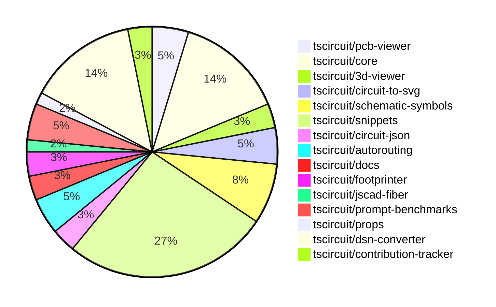

# Contribution Overview 2024-12-04

## PRs by Repository

## Contributor Overview

| Contributor | 🐳 Major | 🐙 Minor | 🐌 Tiny | ⭐ | Issues Created |
|-------------|---------|---------|---------|-----|----------------|
| [imrishabh18](#imrishabh18) | 2 | 10 | 2 | ⭐⭐⭐ | 12 |
| [seveibar](#seveibar) | 2 | 5 | 1 | ⭐⭐⭐ | 63 |
| [ShiboSoftwareDev](#ShiboSoftwareDev) | 1 | 8 | 4 | ⭐⭐⭐ | 6 |
| [Abse2001](#Abse2001) | 2 | 7 | 1 | ⭐⭐⭐ | 5 |
| [RohittCodes](#RohittCodes) | 2 | 3 | 0 | ⭐⭐ | 1 |
| [AnasSarkiz](#AnasSarkiz) | 1 | 4 | 0 | ⭐⭐ | 2 |
| [Anshgrover23](#Anshgrover23) | 1 | 4 | 0 | ⭐⭐ | 1 |
| [techmannih](#techmannih) | 0 | 2 | 0 | ⭐ | 1 |
| [mrudulpatil18](#mrudulpatil18) | 0 | 1 | 0 |  | 0 |
| [samyakshah3008](#samyakshah3008) | 0 | 0 | 1 |  | 2 |

## Review Table

| Contributor | Reviews Received | Approvals | Rejections | Changes Requested | PRs Opened | PRs Closed | Issues Created | Bountied Issues | Bountied Issue $ |
|-------------|------------------|-----------|------------|-------------------|------------|------------|----------------|-----------------|------------------|
| [Abse2001](https://github.com/Abse2001) | 17 | 10 | 5 | 1 | 10 | 10 | 5 | 3 | 57 |
| [seveibar](https://github.com/seveibar) | 0 | 0 | 1 | 0 | 14 | 8 | 63 | 43 | 1,215 |
| [samyakshah3008](https://github.com/samyakshah3008) | 6 | 1 | 0 | 1 | 2 | 1 | 2 | 1 | 1 |
| [AnasSarkiz](https://github.com/AnasSarkiz) | 24 | 5 | 3 | 3 | 6 | 5 | 2 | 0 | 0 |
| [techmannih](https://github.com/techmannih) | 6 | 2 | 1 | 1 | 4 | 2 | 1 | 0 | 0 |
| [ShiboSoftwareDev](https://github.com/ShiboSoftwareDev) | 16 | 10 | 2 | 3 | 13 | 13 | 6 | 3 | 70 |
| [imrishabh18](https://github.com/imrishabh18) | 1 | 1 | 7 | 0 | 15 | 15 | 12 | 5 | 80 |
| [UdaykiranRegimudi](https://github.com/UdaykiranRegimudi) | 2 | 0 | 0 | 2 | 1 | 0 | 0 | 0 | 0 |
| [RohittCodes](https://github.com/RohittCodes) | 28 | 6 | 3 | 9 | 8 | 8 | 1 | 1 | 5 |
| [divanshu-go](https://github.com/divanshu-go) | 3 | 0 | 0 | 1 | 1 | 0 | 0 | 0 | 0 |
| [Anshgrover23](https://github.com/Anshgrover23) | 19 | 7 | 3 | 2 | 7 | 6 | 1 | 0 | 0 |
| [mrudulpatil18](https://github.com/mrudulpatil18) | 1 | 1 | 0 | 0 | 1 | 1 | 0 | 0 | 0 |
| [aybanda](https://github.com/aybanda) | 5 | 0 | 0 | 1 | 1 | 1 | 0 | 0 | 0 |

## Changes by Repository

### [tscircuit/pcb-viewer](https://github.com/tscircuit/pcb-viewer)

| PR # | Impact | Contributor | Description |
|------|--------|-------------|-------------|
| [#86](https://github.com/tscircuit/pcb-viewer/pull/86) | 🐳 Major | Abse2001 | Fixed the issue of PCB rotations rotating the pads in the opposite direction. |
| [#88](https://github.com/tscircuit/pcb-viewer/pull/88) | 🐙 Minor | Abse2001 | Fixed the text rotation in the `ElementOverlayBox` component. |
| [#90](https://github.com/tscircuit/pcb-viewer/pull/90) | 🐌 Tiny | Abse2001 | Removed unwanted `textShadow` property from the `ElementOverlayBox` component. |

### [tscircuit/core](https://github.com/tscircuit/core)

| PR # | Impact | Contributor | Description |
|------|--------|-------------|-------------|
| [#381](https://github.com/tscircuit/core/pull/381) | 🐳 Major | Abse2001 | Adds a new prop `schDisplayLabel` to the `<trace />` component, which allows displaying a label on the schematic trace, and includes a test for this feature. |
| [#396](https://github.com/tscircuit/core/pull/396) | 🐙 Minor | Abse2001 | Fixes the JSX type module for React 19 types |
| [#391](https://github.com/tscircuit/core/pull/391) | 🐙 Minor | seveibar | Improves the error message for missing footprint errors by using the component's string representation instead of just the name. |
| [#393](https://github.com/tscircuit/core/pull/393) | 🐙 Minor | ShiboSoftwareDev | Update dependencies in the package.json file |
| [#405](https://github.com/tscircuit/core/pull/405) | 🐙 Minor | imrishabh18 | Fix the issue where the rendered circuit JSON was not being passed correctly to the autorouter. |
| [#400](https://github.com/tscircuit/core/pull/400) | 🐙 Minor | imrishabh18 | Fix a missing oval shape in the PCB render |
| [#401](https://github.com/tscircuit/core/pull/401) | 🐌 Tiny | ShiboSoftwareDev | Updates the version of the `@tscircuit/infgrid-ijump-astar` dependency from `^0.0.25` to `^0.0.26`. |
| [#395](https://github.com/tscircuit/core/pull/395) | 🐌 Tiny | ShiboSoftwareDev | Updated dependencies in the project |
| [#394](https://github.com/tscircuit/core/pull/394) | 🐌 Tiny | ShiboSoftwareDev | Updated the version of the `@tscircuit/footprinter` dependency from `0.0.91` to `0.0.92`. |

### [tscircuit/3d-viewer](https://github.com/tscircuit/3d-viewer)

| PR # | Impact | Contributor | Description |
|------|--------|-------------|-------------|
| [#52](https://github.com/tscircuit/3d-viewer/pull/52) | 🐙 Minor | Abse2001 | Fixed a bug where tooltips were popping up excessively in the 3D viewer. |
| [#53](https://github.com/tscircuit/3d-viewer/pull/53) | 🐙 Minor | seveibar | Updates dependencies and adds a Renovate configuration file. |

### [tscircuit/circuit-to-svg](https://github.com/tscircuit/circuit-to-svg)

| PR # | Impact | Contributor | Description |
|------|--------|-------------|-------------|
| [#144](https://github.com/tscircuit/circuit-to-svg/pull/144) | 🐙 Minor | Abse2001 |  |
| [#142](https://github.com/tscircuit/circuit-to-svg/pull/142) | 🐙 Minor | AnasSarkiz | Added metadata attributes and a `<g>` wrapper for draggable schematic components |
| [#143](https://github.com/tscircuit/circuit-to-svg/pull/143) | 🐙 Minor | ShiboSoftwareDev | Update dependencies to newer versions |

### [tscircuit/schematic-symbols](https://github.com/tscircuit/schematic-symbols)

| PR # | Impact | Contributor | Description |
|------|--------|-------------|-------------|
| [#221](https://github.com/tscircuit/schematic-symbols/pull/221) | 🐙 Minor | Abse2001 | Added new symbols for boxresistor in different orientations (down, left, right, up) and fixed anchor position of the text. |
| [#219](https://github.com/tscircuit/schematic-symbols/pull/219) | 🐙 Minor | Abse2001 | Adjusted the REF and VAL positions for the capacitor symbol |
| [#217](https://github.com/tscircuit/schematic-symbols/pull/217) | 🐙 Minor | AnasSarkiz | Added new inductor symbols (left, down, right, up) instead of the previous horizontal and vertical ones. |
| [#223](https://github.com/tscircuit/schematic-symbols/pull/223) | 🐙 Minor | Anshgrover23 | Adds a GitHub Actions workflow to validate snapshots for the Bun project. |
| [#222](https://github.com/tscircuit/schematic-symbols/pull/222) | 🐙 Minor | Anshgrover23 | Adds an SVG snapshot validation script and a pre-commit hook to ensure all symbol snapshots are present. |

### [tscircuit/snippets](https://github.com/tscircuit/snippets)

| PR # | Impact | Contributor | Description |
|------|--------|-------------|-------------|
| [#269](https://github.com/tscircuit/snippets/pull/269) | 🐳 Major | RohittCodes | Add manual_json validation and playwright-test |
| [#327](https://github.com/tscircuit/snippets/pull/327) | 🐳 Major | RohittCodes | Adds the ability to expand the preview content to fill the full screen height, and ensures the PCB viewer, schematic, and CAD viewer maintain a minimum height. |
| [#356](https://github.com/tscircuit/snippets/pull/356) | 🐙 Minor | Abse2001 | Updated the version of the `@tscircuit/core` dependency from `0.0.217` to `0.0.219`. |
| [#358](https://github.com/tscircuit/snippets/pull/358) | 🐙 Minor | seveibar | Update the `dsn-converter` dependency to version `0.0.38` and add it to the `autoupdate` list in the `renovate.json` file. |
| [#355](https://github.com/tscircuit/snippets/pull/355) | 🐙 Minor | seveibar | Adds a new dialog component to view TypeScript files in the application. |
| [#339](https://github.com/tscircuit/snippets/pull/339) | 🐙 Minor | ShiboSoftwareDev | Automatically runs the code whenever the user enters the editor. |
| [#373](https://github.com/tscircuit/snippets/pull/373) | 🐙 Minor | imrishabh18 | Reverts the update to the `@tscircuit/core` dependency from version `0.0.223` to `0.0.221`. |
| [#351](https://github.com/tscircuit/snippets/pull/351) | 🐙 Minor | Anshgrover23 | Fixes the regular expression to support underscores in the package names. |
| [#307](https://github.com/tscircuit/snippets/pull/307) | 🐙 Minor | RohittCodes | Refactors the search links functionality to open links in a new tab or in the current window based on the current URL. |
| [#297](https://github.com/tscircuit/snippets/pull/297) | 🐙 Minor | RohittCodes | Adds a timeout and introduces a finally block to the rename snippet dialog. |
| [#341](https://github.com/tscircuit/snippets/pull/341) | 🐙 Minor | RohittCodes | Increased the timeout for the Playwright tests from 5 minutes to 10 minutes. |
| [#350](https://github.com/tscircuit/snippets/pull/350) | 🐙 Minor | techmannih | Add retries for flaky tests |
| [#338](https://github.com/tscircuit/snippets/pull/338) | 🐙 Minor | techmannih | Fix multiple cursors when `ctrl+click` is triggered. |
| [#330](https://github.com/tscircuit/snippets/pull/330) | 🐙 Minor | mrudulpatil18 | Added a static skeleton page with fixed data to mimic the normal components and provide a loading experience. |
| [#357](https://github.com/tscircuit/snippets/pull/357) | 🐌 Tiny | seveibar | Update Playwright snapshots |
| [#372](https://github.com/tscircuit/snippets/pull/372) | 🐌 Tiny | imrishabh18 | Update the core package of the project to a newer version. |
| [#369](https://github.com/tscircuit/snippets/pull/369) | 🐌 Tiny | imrishabh18 | Update the version of the 'dsn-converter' dependency from 0.0.39 to 0.0.41. |

### [tscircuit/circuit-json](https://github.com/tscircuit/circuit-json)

| PR # | Impact | Contributor | Description |
|------|--------|-------------|-------------|
| [#86](https://github.com/tscircuit/circuit-json/pull/86) | 🐳 Major | seveibar | The pull request adds readme generation and a complete refactor to the `expectTypesMatch` pattern. |
| [#85](https://github.com/tscircuit/circuit-json/pull/85) | 🐳 Major | seveibar | Introduce a new schematic element called "schematic_voltage_probe" which can be used to add a voltage probe to a schematic trace. |

### [tscircuit/autorouting](https://github.com/tscircuit/autorouting)

| PR # | Impact | Contributor | Description |
|------|--------|-------------|-------------|
| [#98](https://github.com/tscircuit/autorouting/pull/98) | 🐙 Minor | seveibar |  |
| [#100](https://github.com/tscircuit/autorouting/pull/100) | 🐙 Minor | ShiboSoftwareDev | Add a function to generate approximating rectangles for a rotated rectangle. |
| [#95](https://github.com/tscircuit/autorouting/pull/95) | 🐌 Tiny | ShiboSoftwareDev | Updated packages |

### [tscircuit/docs](https://github.com/tscircuit/docs)

| PR # | Impact | Contributor | Description |
|------|--------|-------------|-------------|
| [#43](https://github.com/tscircuit/docs/pull/43) | 🐳 Major | AnasSarkiz | Added a new tutorial for creating a development circuit based on the ESP32-D0WD microcontroller, including all essential supporting components. |
| [#49](https://github.com/tscircuit/docs/pull/49) | 🐌 Tiny | samyakshah3008 | Fixes the incorrect LinkedIn URL in the footer of the documentation site. |

### [tscircuit/footprinter](https://github.com/tscircuit/footprinter)

| PR # | Impact | Contributor | Description |
|------|--------|-------------|-------------|
| [#92](https://github.com/tscircuit/footprinter/pull/92) | 🐙 Minor | AnasSarkiz | Added default values of 2 for top and bottom properties in the stampboard and stampreceiver components. |
| [#94](https://github.com/tscircuit/footprinter/pull/94) | 🐙 Minor | ShiboSoftwareDev | Updated dependencies to use "circuit-json" instead of "@tscircuit/soup". |

### [tscircuit/jscad-fiber](https://github.com/tscircuit/jscad-fiber)

| PR # | Impact | Contributor | Description |
|------|--------|-------------|-------------|
| [#95](https://github.com/tscircuit/jscad-fiber/pull/95) | 🐙 Minor | AnasSarkiz | The pull request improves the usage documentation by adding examples of each component in the README. |

### [tscircuit/prompt-benchmarks](https://github.com/tscircuit/prompt-benchmarks)

| PR # | Impact | Contributor | Description |
|------|--------|-------------|-------------|
| [#9](https://github.com/tscircuit/prompt-benchmarks/pull/9) | 🐳 Major | ShiboSoftwareDev | Adds a new benchmarking tool called "evalite" to the project. |
| [#10](https://github.com/tscircuit/prompt-benchmarks/pull/10) | 🐙 Minor | ShiboSoftwareDev | Updated the `evalite` benchmark code, added a new `format` script, and reorganized the `problems.toml` file. |
| [#8](https://github.com/tscircuit/prompt-benchmarks/pull/8) | 🐙 Minor | ShiboSoftwareDev | The pull request adds new benchmark problems for creating a 555 timer with a blinking LED, a simple LED driver circuit, a basic RC low-pass filter circuit, and a basic astable multivibrator circuit. |

### [tscircuit/props](https://github.com/tscircuit/props)

| PR # | Impact | Contributor | Description |
|------|--------|-------------|-------------|
| [#111](https://github.com/tscircuit/props/pull/111) | 🐙 Minor | ShiboSoftwareDev | Changes the build configuration to use ECMAScript modules (ESM) instead of CommonJS. |

### [tscircuit/dsn-converter](https://github.com/tscircuit/dsn-converter)

| PR # | Impact | Contributor | Description |
|------|--------|-------------|-------------|
| [#53](https://github.com/tscircuit/dsn-converter/pull/53) | 🐳 Major | imrishabh18 | Refactor the plated-holes and smtpads handling in the PCB conversion process. |
| [#52](https://github.com/tscircuit/dsn-converter/pull/52) | 🐳 Major | imrishabh18 | Refactor and improve the handling of padstacks and plated holes in the PCB conversion process. |
| [#57](https://github.com/tscircuit/dsn-converter/pull/57) | 🐙 Minor | imrishabh18 | Fix to get the unconnected pads as well in the nets list |
| [#56](https://github.com/tscircuit/dsn-converter/pull/56) | 🐙 Minor | imrishabh18 | Refactor code to use soup-util library for finding circuit elements |
| [#55](https://github.com/tscircuit/dsn-converter/pull/55) | 🐙 Minor | imrishabh18 | Fixes the issue with port numbers not being in the correct order in the circuit-json-to-dsn-json conversion process. |
| [#51](https://github.com/tscircuit/dsn-converter/pull/51) | 🐙 Minor | imrishabh18 | Fix the rotation and footprint naming for PCB components. |
| [#49](https://github.com/tscircuit/dsn-converter/pull/49) | 🐙 Minor | imrishabh18 | Fix the position of pads in the `registry-api` traces. |
| [#47](https://github.com/tscircuit/dsn-converter/pull/47) | 🐙 Minor | imrishabh18 | Add support for pill-shaped plated holes |
| [#46](https://github.com/tscircuit/dsn-converter/pull/46) | 🐙 Minor | imrishabh18 | This pull request fixes an issue with processing plated holes of different sizes in the PCB design. |

### [tscircuit/contribution-tracker](https://github.com/tscircuit/contribution-tracker)

| PR # | Impact | Contributor | Description |
|------|--------|-------------|-------------|
| [#20](https://github.com/tscircuit/contribution-tracker/pull/20) | 🐳 Major | Anshgrover23 | The pull request adds the number of issues created by each contributor as a star factor, and also adds points for bountied issues. |
| [#17](https://github.com/tscircuit/contribution-tracker/pull/17) | 🐙 Minor | Anshgrover23 | Adds the ability to detect the number of issues created that have a bounty. |

## Changes by Contributor

### [Abse2001](https://github.com/Abse2001)

| PR # | Impact | Description |
|------|--------|-------------|
| [#86](https://github.com/tscircuit/pcb-viewer/pull/86) | 🐳 Major | Fixed the issue of PCB rotations rotating the pads in the opposite direction. |
| [#381](https://github.com/tscircuit/core/pull/381) | 🐳 Major | Adds a new prop `schDisplayLabel` to the `<trace />` component, which allows displaying a label on the schematic trace, and includes a test for this feature. |
| [#88](https://github.com/tscircuit/pcb-viewer/pull/88) | 🐙 Minor | Fixed the text rotation in the `ElementOverlayBox` component. |
| [#52](https://github.com/tscircuit/3d-viewer/pull/52) | 🐙 Minor | Fixed a bug where tooltips were popping up excessively in the 3D viewer. |
| [#396](https://github.com/tscircuit/core/pull/396) | 🐙 Minor | Fixes the JSX type module for React 19 types |
| [#144](https://github.com/tscircuit/circuit-to-svg/pull/144) | 🐙 Minor |  |
| [#221](https://github.com/tscircuit/schematic-symbols/pull/221) | 🐙 Minor | Added new symbols for boxresistor in different orientations (down, left, right, up) and fixed anchor position of the text. |
| [#219](https://github.com/tscircuit/schematic-symbols/pull/219) | 🐙 Minor | Adjusted the REF and VAL positions for the capacitor symbol |
| [#356](https://github.com/tscircuit/snippets/pull/356) | 🐙 Minor | Updated the version of the `@tscircuit/core` dependency from `0.0.217` to `0.0.219`. |
| [#90](https://github.com/tscircuit/pcb-viewer/pull/90) | 🐌 Tiny | Removed unwanted `textShadow` property from the `ElementOverlayBox` component. |

### [seveibar](https://github.com/seveibar)

| PR # | Impact | Description |
|------|--------|-------------|
| [#86](https://github.com/tscircuit/circuit-json/pull/86) | 🐳 Major | The pull request adds readme generation and a complete refactor to the `expectTypesMatch` pattern. |
| [#85](https://github.com/tscircuit/circuit-json/pull/85) | 🐳 Major | Introduce a new schematic element called "schematic_voltage_probe" which can be used to add a voltage probe to a schematic trace. |
| [#53](https://github.com/tscircuit/3d-viewer/pull/53) | 🐙 Minor | Updates dependencies and adds a Renovate configuration file. |
| [#391](https://github.com/tscircuit/core/pull/391) | 🐙 Minor | Improves the error message for missing footprint errors by using the component's string representation instead of just the name. |
| [#98](https://github.com/tscircuit/autorouting/pull/98) | 🐙 Minor |  |
| [#358](https://github.com/tscircuit/snippets/pull/358) | 🐙 Minor | Update the `dsn-converter` dependency to version `0.0.38` and add it to the `autoupdate` list in the `renovate.json` file. |
| [#355](https://github.com/tscircuit/snippets/pull/355) | 🐙 Minor | Adds a new dialog component to view TypeScript files in the application. |
| [#357](https://github.com/tscircuit/snippets/pull/357) | 🐌 Tiny | Update Playwright snapshots |

### [samyakshah3008](https://github.com/samyakshah3008)

| PR # | Impact | Description |
|------|--------|-------------|
| [#49](https://github.com/tscircuit/docs/pull/49) | 🐌 Tiny | Fixes the incorrect LinkedIn URL in the footer of the documentation site. |

### [AnasSarkiz](https://github.com/AnasSarkiz)

| PR # | Impact | Description |
|------|--------|-------------|
| [#43](https://github.com/tscircuit/docs/pull/43) | 🐳 Major | Added a new tutorial for creating a development circuit based on the ESP32-D0WD microcontroller, including all essential supporting components. |
| [#92](https://github.com/tscircuit/footprinter/pull/92) | 🐙 Minor | Added default values of 2 for top and bottom properties in the stampboard and stampreceiver components. |
| [#95](https://github.com/tscircuit/jscad-fiber/pull/95) | 🐙 Minor | The pull request improves the usage documentation by adding examples of each component in the README. |
| [#142](https://github.com/tscircuit/circuit-to-svg/pull/142) | 🐙 Minor | Added metadata attributes and a `<g>` wrapper for draggable schematic components |
| [#217](https://github.com/tscircuit/schematic-symbols/pull/217) | 🐙 Minor | Added new inductor symbols (left, down, right, up) instead of the previous horizontal and vertical ones. |

### [ShiboSoftwareDev](https://github.com/ShiboSoftwareDev)

| PR # | Impact | Description |
|------|--------|-------------|
| [#9](https://github.com/tscircuit/prompt-benchmarks/pull/9) | 🐳 Major | Adds a new benchmarking tool called "evalite" to the project. |
| [#111](https://github.com/tscircuit/props/pull/111) | 🐙 Minor | Changes the build configuration to use ECMAScript modules (ESM) instead of CommonJS. |
| [#94](https://github.com/tscircuit/footprinter/pull/94) | 🐙 Minor | Updated dependencies to use "circuit-json" instead of "@tscircuit/soup". |
| [#393](https://github.com/tscircuit/core/pull/393) | 🐙 Minor | Update dependencies in the package.json file |
| [#143](https://github.com/tscircuit/circuit-to-svg/pull/143) | 🐙 Minor | Update dependencies to newer versions |
| [#100](https://github.com/tscircuit/autorouting/pull/100) | 🐙 Minor | Add a function to generate approximating rectangles for a rotated rectangle. |
| [#339](https://github.com/tscircuit/snippets/pull/339) | 🐙 Minor | Automatically runs the code whenever the user enters the editor. |
| [#10](https://github.com/tscircuit/prompt-benchmarks/pull/10) | 🐙 Minor | Updated the `evalite` benchmark code, added a new `format` script, and reorganized the `problems.toml` file. |
| [#8](https://github.com/tscircuit/prompt-benchmarks/pull/8) | 🐙 Minor | The pull request adds new benchmark problems for creating a 555 timer with a blinking LED, a simple LED driver circuit, a basic RC low-pass filter circuit, and a basic astable multivibrator circuit. |
| [#401](https://github.com/tscircuit/core/pull/401) | 🐌 Tiny | Updates the version of the `@tscircuit/infgrid-ijump-astar` dependency from `^0.0.25` to `^0.0.26`. |
| [#395](https://github.com/tscircuit/core/pull/395) | 🐌 Tiny | Updated dependencies in the project |
| [#394](https://github.com/tscircuit/core/pull/394) | 🐌 Tiny | Updated the version of the `@tscircuit/footprinter` dependency from `0.0.91` to `0.0.92`. |
| [#95](https://github.com/tscircuit/autorouting/pull/95) | 🐌 Tiny | Updated packages |

### [imrishabh18](https://github.com/imrishabh18)

| PR # | Impact | Description |
|------|--------|-------------|
| [#53](https://github.com/tscircuit/dsn-converter/pull/53) | 🐳 Major | Refactor the plated-holes and smtpads handling in the PCB conversion process. |
| [#52](https://github.com/tscircuit/dsn-converter/pull/52) | 🐳 Major | Refactor and improve the handling of padstacks and plated holes in the PCB conversion process. |
| [#405](https://github.com/tscircuit/core/pull/405) | 🐙 Minor | Fix the issue where the rendered circuit JSON was not being passed correctly to the autorouter. |
| [#400](https://github.com/tscircuit/core/pull/400) | 🐙 Minor | Fix a missing oval shape in the PCB render |
| [#57](https://github.com/tscircuit/dsn-converter/pull/57) | 🐙 Minor | Fix to get the unconnected pads as well in the nets list |
| [#56](https://github.com/tscircuit/dsn-converter/pull/56) | 🐙 Minor | Refactor code to use soup-util library for finding circuit elements |
| [#55](https://github.com/tscircuit/dsn-converter/pull/55) | 🐙 Minor | Fixes the issue with port numbers not being in the correct order in the circuit-json-to-dsn-json conversion process. |
| [#51](https://github.com/tscircuit/dsn-converter/pull/51) | 🐙 Minor | Fix the rotation and footprint naming for PCB components. |
| [#49](https://github.com/tscircuit/dsn-converter/pull/49) | 🐙 Minor | Fix the position of pads in the `registry-api` traces. |
| [#47](https://github.com/tscircuit/dsn-converter/pull/47) | 🐙 Minor | Add support for pill-shaped plated holes |
| [#46](https://github.com/tscircuit/dsn-converter/pull/46) | 🐙 Minor | This pull request fixes an issue with processing plated holes of different sizes in the PCB design. |
| [#373](https://github.com/tscircuit/snippets/pull/373) | 🐙 Minor | Reverts the update to the `@tscircuit/core` dependency from version `0.0.223` to `0.0.221`. |
| [#372](https://github.com/tscircuit/snippets/pull/372) | 🐌 Tiny | Update the core package of the project to a newer version. |
| [#369](https://github.com/tscircuit/snippets/pull/369) | 🐌 Tiny | Update the version of the 'dsn-converter' dependency from 0.0.39 to 0.0.41. |

### [Anshgrover23](https://github.com/Anshgrover23)

| PR # | Impact | Description |
|------|--------|-------------|
| [#20](https://github.com/tscircuit/contribution-tracker/pull/20) | 🐳 Major | The pull request adds the number of issues created by each contributor as a star factor, and also adds points for bountied issues. |
| [#17](https://github.com/tscircuit/contribution-tracker/pull/17) | 🐙 Minor | Adds the ability to detect the number of issues created that have a bounty. |
| [#223](https://github.com/tscircuit/schematic-symbols/pull/223) | 🐙 Minor | Adds a GitHub Actions workflow to validate snapshots for the Bun project. |
| [#222](https://github.com/tscircuit/schematic-symbols/pull/222) | 🐙 Minor | Adds an SVG snapshot validation script and a pre-commit hook to ensure all symbol snapshots are present. |
| [#351](https://github.com/tscircuit/snippets/pull/351) | 🐙 Minor | Fixes the regular expression to support underscores in the package names. |

### [RohittCodes](https://github.com/RohittCodes)

| PR # | Impact | Description |
|------|--------|-------------|
| [#269](https://github.com/tscircuit/snippets/pull/269) | 🐳 Major | Add manual_json validation and playwright-test |
| [#327](https://github.com/tscircuit/snippets/pull/327) | 🐳 Major | Adds the ability to expand the preview content to fill the full screen height, and ensures the PCB viewer, schematic, and CAD viewer maintain a minimum height. |
| [#307](https://github.com/tscircuit/snippets/pull/307) | 🐙 Minor | Refactors the search links functionality to open links in a new tab or in the current window based on the current URL. |
| [#297](https://github.com/tscircuit/snippets/pull/297) | 🐙 Minor | Adds a timeout and introduces a finally block to the rename snippet dialog. |
| [#341](https://github.com/tscircuit/snippets/pull/341) | 🐙 Minor | Increased the timeout for the Playwright tests from 5 minutes to 10 minutes. |

### [techmannih](https://github.com/techmannih)

| PR # | Impact | Description |
|------|--------|-------------|
| [#350](https://github.com/tscircuit/snippets/pull/350) | 🐙 Minor | Add retries for flaky tests |
| [#338](https://github.com/tscircuit/snippets/pull/338) | 🐙 Minor | Fix multiple cursors when `ctrl+click` is triggered. |

### [mrudulpatil18](https://github.com/mrudulpatil18)

| PR # | Impact | Description |
|------|--------|-------------|
| [#330](https://github.com/tscircuit/snippets/pull/330) | 🐙 Minor | Added a static skeleton page with fixed data to mimic the normal components and provide a loading experience. |

