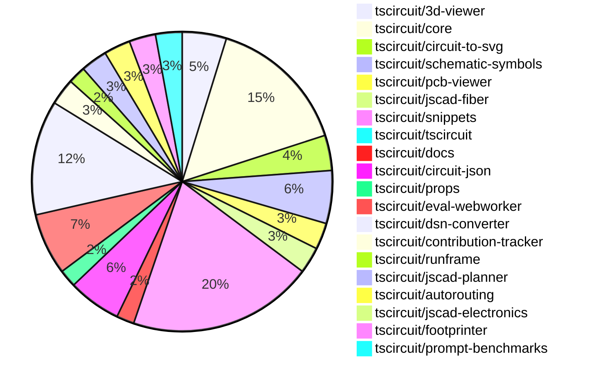

# Contribution Overview 2024-12-04

## PRs by Repository

## Contributor Overview

| Contributor | 🐳 Major | 🐙 Minor | 🐌 Tiny | ⭐ | Issues Created |
|-------------|---------|---------|---------|-----|----------------|
| [seveibar](#seveibar) | 6 | 19 | 4 | 👑👑 | 103 |
| [imrishabh18](#imrishabh18) | 4 | 16 | 2 | 👑 | 15 |
| [Abse2001](#Abse2001) | 4 | 7 | 1 | ⭐⭐⭐ | 7 |
| [ShiboSoftwareDev](#ShiboSoftwareDev) | 1 | 8 | 4 | ⭐⭐⭐ | 10 |
| [AnasSarkiz](#AnasSarkiz) | 2 | 7 | 0 | ⭐⭐ | 4 |
| [RohittCodes](#RohittCodes) | 2 | 2 | 1 | ⭐⭐ | 2 |
| [Anshgrover23](#Anshgrover23) | 0 | 6 | 0 | ⭐⭐ | 1 |
| [devin-ai-integration[bot]](#devin-ai-integration[bot]) | 0 | 4 | 0 | ⭐ | 0 |
| [techmannih](#techmannih) | 0 | 3 | 0 | ⭐ | 1 |
| [samyakshah3008](#samyakshah3008) | 0 | 2 | 0 | ⭐ | 2 |
| [ni9999](#ni9999) | 0 | 1 | 0 |  | 0 |
| [mrudulpatil18](#mrudulpatil18) | 0 | 1 | 0 |  | 0 |

## Review Table

[reviews-received-hover]: ## "Number of reviews received for PRs for this contributor"
[approvals-received-hover]: ## "Number of approvals received for PRs this contributor authored"
[rejections-received-hover]: ## "Number of rejections received for PRs this contributor authored"
[prs-opened-hover]: ## "Number of PRs opened by this contributor"
[issues-created-hover]: ## "Number of issues created by this contributor"
[bountied-issues-hover]: ## "Number of issues this contributor created with a bounty"
[bountied-issue-$-hover]: ## "Total bounty amount placed on issues authored by this contributor"

| Contributor | Reviews Received | Approvals Received | Rejections Received | PRs Opened | PRs Merged | Issues Created | Bountied Issues | Bountied Issue $ |
|---|---|---|---|---|---|---|---|---|
| [Bhavyajain21](#Bhavyajain21) | 0 | 0 | 0 | 1 | 0 | 0 | 0 | 0 |
| [Abse2001](#Abse2001) | 22 | 12 | 1 | 12 | 12 | 7 | 4 | 77 |
| [seveibar](#seveibar) | 3 | 0 | 0 | 33 | 29 | 103 | 53 | 1335 |
| [samyakshah3008](#samyakshah3008) | 7 | 2 | 1 | 2 | 2 | 2 | 1 | 1 |
| [ShiboSoftwareDev](#ShiboSoftwareDev) | 16 | 10 | 3 | 15 | 13 | 10 | 5 | 145 |
| [devin-ai-integration[bot]](#devin-ai-integration[bot]) | 11 | 5 | 6 | 13 | 4 | 0 | 0 | 0 |
| [imrishabh18](#imrishabh18) | 8 | 3 | 0 | 24 | 22 | 15 | 7 | 95 |
| [AnasSarkiz](#AnasSarkiz) | 28 | 8 | 3 | 9 | 9 | 4 | 0 | 0 |
| [techmannih](#techmannih) | 11 | 3 | 2 | 5 | 3 | 1 | 0 | 0 |
| [UdaykiranRegimudi](#UdaykiranRegimudi) | 2 | 0 | 2 | 1 | 0 | 0 | 0 | 0 |
| [RohittCodes](#RohittCodes) | 28 | 6 | 9 | 8 | 5 | 2 | 1 | 5 |
| [divanshu-go](#divanshu-go) | 3 | 0 | 1 | 1 | 0 | 0 | 0 | 0 |
| [Anshgrover23](#Anshgrover23) | 20 | 8 | 2 | 7 | 6 | 1 | 0 | 0 |
| [ni9999](#ni9999) | 5 | 1 | 2 | 1 | 1 | 0 | 0 | 0 |
| [mrudulpatil18](#mrudulpatil18) | 1 | 1 | 0 | 1 | 1 | 0 | 0 | 0 |
| [aybanda](#aybanda) | 5 | 0 | 1 | 1 | 0 | 0 | 0 | 0 |

## Changes by Repository

### [tscircuit/3d-viewer](https://github.com/tscircuit/3d-viewer)

| PR # | Impact | Contributor | Description |
|------|--------|-------------|-------------|
| [#67](https://github.com/tscircuit/3d-viewer/pull/67) | 🐳 Major | Abse2001 | Adds support for rendering silkscreen text on PCB boards |
| [#64](https://github.com/tscircuit/3d-viewer/pull/64) | 🐳 Major | seveibar | Adds error boundaries for components, fixes a bug in the jscad-fiber library |
| [#52](https://github.com/tscircuit/3d-viewer/pull/52) | 🐙 Minor | Abse2001 | Fixed a bug where tooltips were popping up excessively in the 3D viewer. |
| [#53](https://github.com/tscircuit/3d-viewer/pull/53) | 🐙 Minor | seveibar | Updates dependencies and adds a Renovate configuration file. |
| [#62](https://github.com/tscircuit/3d-viewer/pull/62) | 🐙 Minor | techmannih | Add typechecking and formatting workflow |

### [tscircuit/core](https://github.com/tscircuit/core)

| PR # | Impact | Contributor | Description |
|------|--------|-------------|-------------|
| [#381](https://github.com/tscircuit/core/pull/381) | 🐳 Major | Abse2001 | Adds a new prop `schDisplayLabel` to the `<trace />` component and implements the logic to display the label on the schematic. |
| [#406](https://github.com/tscircuit/core/pull/406) | 🐳 Major | imrishabh18 | This pull request reverts the changes made in the previous pull request "fix: rendered circuit json passed to the autorouter". |
| [#409](https://github.com/tscircuit/core/pull/409) | 🐳 Major | AnasSarkiz | Implemented a `pcbDisabled` option in the `Circuit.ts` file to disable all PCB elements. |
| [#396](https://github.com/tscircuit/core/pull/396) | 🐙 Minor | Abse2001 | Updating the React types to version 19 and fixing the JSX type module for compatibility |
| [#407](https://github.com/tscircuit/core/pull/407) | 🐙 Minor | imrishabh18 | Fixes the calculation of component size before rendering the PCB trace. |
| [#405](https://github.com/tscircuit/core/pull/405) | 🐙 Minor | imrishabh18 | The change fixes an issue where the width and height of the circuit were not being passed correctly to the autorouter. |
| [#400](https://github.com/tscircuit/core/pull/400) | 🐙 Minor | imrishabh18 | Fix missing oval shape in the PCB render |
| [#419](https://github.com/tscircuit/core/pull/419) | 🐙 Minor | seveibar | The pull request introduces a new error handling mechanism for components that have both manual placement and explicit coordinates (pcbX/pcbY) defined. |
| [#415](https://github.com/tscircuit/core/pull/415) | 🐙 Minor | seveibar | Update the dependency for the `circuit-json` package from version `0.0.108` to `0.0.114`. |
| [#391](https://github.com/tscircuit/core/pull/391) | 🐙 Minor | seveibar | Improve the error message for missing footprints to include the component's string representation instead of just the component name. |
| [#397](https://github.com/tscircuit/core/pull/397) | 🐙 Minor | AnasSarkiz | Adds automatic schematic net labeling for passive-chip connections with complex traces. |
| [#393](https://github.com/tscircuit/core/pull/393) | 🐙 Minor | ShiboSoftwareDev | Update dependencies in the package.json file |
| [#414](https://github.com/tscircuit/core/pull/414) | 🐌 Tiny | seveibar | Skips size reports if `package.json` was not changed |
| [#401](https://github.com/tscircuit/core/pull/401) | 🐌 Tiny | ShiboSoftwareDev | Upgrades the "@tscircuit/infgrid-ijump-astar" dependency from version 0.0.25 to 0.0.26. |
| [#395](https://github.com/tscircuit/core/pull/395) | 🐌 Tiny | ShiboSoftwareDev | Updated dependencies for the project |
| [#394](https://github.com/tscircuit/core/pull/394) | 🐌 Tiny | ShiboSoftwareDev | Updated the version of the `@tscircuit/footprinter` dependency from `0.0.91` to `0.0.92`. |

### [tscircuit/circuit-to-svg](https://github.com/tscircuit/circuit-to-svg)

| PR # | Impact | Contributor | Description |
|------|--------|-------------|-------------|
| [#144](https://github.com/tscircuit/circuit-to-svg/pull/144) | 🐳 Major | Abse2001 | Adds a function to create schematic net symbols using the `schematic_net_label.symbol_name` property. |
| [#147](https://github.com/tscircuit/circuit-to-svg/pull/147) | 🐙 Minor | AnasSarkiz | Introduce a new function `createSvgObjectsFromSchVoltageProbe` to create SVG objects for schematic voltage probes. |
| [#142](https://github.com/tscircuit/circuit-to-svg/pull/142) | 🐙 Minor | AnasSarkiz | Added metadata attributes and a `<g>` wrapper for draggable schematic components. |
| [#143](https://github.com/tscircuit/circuit-to-svg/pull/143) | 🐙 Minor | ShiboSoftwareDev | Update dependencies to their latest versions |

### [tscircuit/schematic-symbols](https://github.com/tscircuit/schematic-symbols)

| PR # | Impact | Contributor | Description |
|------|--------|-------------|-------------|
| [#221](https://github.com/tscircuit/schematic-symbols/pull/221) | 🐳 Major | Abse2001 | Added right, left, top, and bottom facing box resistor symbols, and fixed the anchor position of the text. |
| [#219](https://github.com/tscircuit/schematic-symbols/pull/219) | 🐙 Minor | Abse2001 | Adjusted the REF and VAL positions for capacitors in the generated capacitor.json file. |
| [#217](https://github.com/tscircuit/schematic-symbols/pull/217) | 🐙 Minor | AnasSarkiz | Added new inductor symbols (left, down, right, up) instead of horizontal and vertical symbols. |
| [#223](https://github.com/tscircuit/schematic-symbols/pull/223) | 🐙 Minor | Anshgrover23 | Add a GitHub workflow to validate Bun snapshots. |
| [#222](https://github.com/tscircuit/schematic-symbols/pull/222) | 🐙 Minor | Anshgrover23 | Add a script to validate SVG snapshots and a pre-commit hook to run the validation. |
| [#210](https://github.com/tscircuit/schematic-symbols/pull/210) | 🐙 Minor | ni9999 | Adds a new 4-pin crystal symbol |

### [tscircuit/pcb-viewer](https://github.com/tscircuit/pcb-viewer)

| PR # | Impact | Contributor | Description |
|------|--------|-------------|-------------|
| [#88](https://github.com/tscircuit/pcb-viewer/pull/88) | 🐙 Minor | Abse2001 | Fixed the text rotation of the `ElementOverlayBox` component. |
| [#86](https://github.com/tscircuit/pcb-viewer/pull/86) | 🐙 Minor | Abse2001 | Fixed an issue where the pads were rotated in the opposite direction and made the ElementOverlayBox.tsx follow the parent PCB rotation. |
| [#90](https://github.com/tscircuit/pcb-viewer/pull/90) | 🐌 Tiny | Abse2001 | Removed unwanted textShadow from the CSS styles of the ElementOverlayBox component. |

### [tscircuit/jscad-fiber](https://github.com/tscircuit/jscad-fiber)

| PR # | Impact | Contributor | Description |
|------|--------|-------------|-------------|
| [#97](https://github.com/tscircuit/jscad-fiber/pull/97) | 🐳 Major | seveibar | Add a new JsCadFixture component that renders 3D shapes from JSCAD geometry and adds grid, lighting, and camera controls. |
| [#99](https://github.com/tscircuit/jscad-fiber/pull/99) | 🐙 Minor | Abse2001 | Update React types to support React 19 |
| [#95](https://github.com/tscircuit/jscad-fiber/pull/95) | 🐙 Minor | AnasSarkiz | Improve usage documentation by adding README examples for each component. |

### [tscircuit/snippets](https://github.com/tscircuit/snippets)

| PR # | Impact | Contributor | Description |
|------|--------|-------------|-------------|
| [#269](https://github.com/tscircuit/snippets/pull/269) | 🐳 Major | RohittCodes | Refactored the manual_edit_json template ingestion into the database and added playwright tests for the manual edits functionality. |
| [#327](https://github.com/tscircuit/snippets/pull/327) | 🐳 Major | RohittCodes | This pull request fixes issue #324 by introducing a new feature that expands the circuit preview to fill the full height of the parent container. |
| [#356](https://github.com/tscircuit/snippets/pull/356) | 🐙 Minor | Abse2001 | Updated the version of the `@tscircuit/core` dependency from `0.0.217` to `0.0.219`. |
| [#375](https://github.com/tscircuit/snippets/pull/375) | 🐙 Minor | imrishabh18 | Update the "@tscircuit/core" dependency from version 0.0.223 to 0.0.225 |
| [#373](https://github.com/tscircuit/snippets/pull/373) | 🐙 Minor | imrishabh18 | Reverts the update to the `@tscircuit/core` dependency from version 0.0.223 to 0.0.221. |
| [#385](https://github.com/tscircuit/snippets/pull/385) | 🐙 Minor | seveibar | Update 3D viewer and jscad-electronics dependencies |
| [#363](https://github.com/tscircuit/snippets/pull/363) | 🐙 Minor | seveibar | Improve Playwright Test runtime by reducing the number of retries on CI and fix a UI issue in the StaticViewSnippetSidebar component. |
| [#358](https://github.com/tscircuit/snippets/pull/358) | 🐙 Minor | seveibar | Update the `dsn-converter` package and add it to the autoupdate list in `renovate.json` |
| [#355](https://github.com/tscircuit/snippets/pull/355) | 🐙 Minor | seveibar | Adds a new dialog component to view and download TypeScript files. |
| [#339](https://github.com/tscircuit/snippets/pull/339) | 🐙 Minor | ShiboSoftwareDev | Automatically run the code when entering the editor. |
| [#350](https://github.com/tscircuit/snippets/pull/350) | 🐙 Minor | techmannih | Add retries for flaky tests |
| [#338](https://github.com/tscircuit/snippets/pull/338) | 🐙 Minor | techmannih | Fix multiple cursors when ctrl+click is triggered |
| [#365](https://github.com/tscircuit/snippets/pull/365) | 🐙 Minor | Anshgrover23 | Split the `footprint-dialog.spec.ts` file into multiple files for better organization and maintainability. |
| [#351](https://github.com/tscircuit/snippets/pull/351) | 🐙 Minor | Anshgrover23 | Fixes the regular expression to support underscores in package names. |
| [#307](https://github.com/tscircuit/snippets/pull/307) | 🐙 Minor | RohittCodes | Refactor the search links functionality to open links in a new tab if the current page is the editor or AI page, and in the current tab otherwise. |
| [#297](https://github.com/tscircuit/snippets/pull/297) | 🐙 Minor | RohittCodes | Added a timeout and introduced a finally block to the rename snippet dialog. |
| [#330](https://github.com/tscircuit/snippets/pull/330) | 🐙 Minor | mrudulpatil18 | Added a static skeleton page with fixed data to mimic the normal components and improve the loading experience. |
| [#372](https://github.com/tscircuit/snippets/pull/372) | 🐌 Tiny | imrishabh18 | Update the dependency `@tscircuit/core` from version `0.0.221` to `0.0.223`. |
| [#369](https://github.com/tscircuit/snippets/pull/369) | 🐌 Tiny | imrishabh18 | Update the version of the `dsn-converter` dependency from `0.0.39` to `0.0.41`. |
| [#357](https://github.com/tscircuit/snippets/pull/357) | 🐌 Tiny | seveibar | Update Playwright snapshots |
| [#341](https://github.com/tscircuit/snippets/pull/341) | 🐌 Tiny | RohittCodes | Increase the timeout for Playwright tests from 5 minutes to 10 minutes. |

### [tscircuit/tscircuit](https://github.com/tscircuit/tscircuit)

| PR # | Impact | Contributor | Description |
|------|--------|-------------|-------------|
| [#484](https://github.com/tscircuit/tscircuit/pull/484) | 🐙 Minor | samyakshah3008 | Enhances the README file with a new table of contents, introduces a new contributing guide, and makes various other improvements. |

### [tscircuit/docs](https://github.com/tscircuit/docs)

| PR # | Impact | Contributor | Description |
|------|--------|-------------|-------------|
| [#43](https://github.com/tscircuit/docs/pull/43) | 🐳 Major | AnasSarkiz | Added a new tutorial for the ESP32-D0WD development circuit, which includes a schematic and details on the main components used. |
| [#49](https://github.com/tscircuit/docs/pull/49) | 🐙 Minor | samyakshah3008 | Fix the incorrect LinkedIn URL in the footer of the documentation site. |

### [tscircuit/circuit-json](https://github.com/tscircuit/circuit-json)

| PR # | Impact | Contributor | Description |
|------|--------|-------------|-------------|
| [#85](https://github.com/tscircuit/circuit-json/pull/85) | 🐳 Major | seveibar | Introduces a new circuit element called "schematic_voltage_probe" that can be used to measure the voltage on a schematic trace. |
| [#96](https://github.com/tscircuit/circuit-json/pull/96) | 🐙 Minor | devin-ai-integration[bot] | Introduce a new type `CircuitJson` to represent an array of `AnyCircuitElement`. |
| [#88](https://github.com/tscircuit/circuit-json/pull/88) | 🐙 Minor | devin-ai-integration[bot] | Adds a new error type for conflicts between manual edits and explicit PCB coordinates. |
| [#94](https://github.com/tscircuit/circuit-json/pull/94) | 🐙 Minor | imrishabh18 | Adds a new `pcb_group` type to the `any_circuit_element` union and defines a new `pcb_group` module in the `pcb` directory. |
| [#89](https://github.com/tscircuit/circuit-json/pull/89) | 🐙 Minor | seveibar | Updates the README.md file to add information about base units and element prefixes used in the project. |
| [#86](https://github.com/tscircuit/circuit-json/pull/86) | 🐙 Minor | seveibar | This pull request adds the ability to generate README documentation and sets up a GitHub Actions workflow to do so. |

### [tscircuit/props](https://github.com/tscircuit/props)

| PR # | Impact | Contributor | Description |
|------|--------|-------------|-------------|
| [#113](https://github.com/tscircuit/props/pull/113) | 🐙 Minor | devin-ai-integration[bot] | Adds a new `pinVariant` prop to the `crystal` component to support 2-pin and 4-pin variants. |
| [#111](https://github.com/tscircuit/props/pull/111) | 🐙 Minor | ShiboSoftwareDev | Adds support for building the package with ESM (ECMAScript Modules) |

### [tscircuit/eval-webworker](https://github.com/tscircuit/eval-webworker)

| PR # | Impact | Contributor | Description |
|------|--------|-------------|-------------|
| [#13](https://github.com/tscircuit/eval-webworker/pull/13) | 🐳 Major | seveibar | The pull request adds a new feature to handle multiple files, including local files, in the CircuitWebWorker. It also includes a new test case for this functionality. |
| [#26](https://github.com/tscircuit/eval-webworker/pull/26) | 🐙 Minor | devin-ai-integration[bot] | Adds type declarations for the `blob-url` module to resolve type errors when importing from `@tscircuit/eval-webworker/blob-url`. |
| [#28](https://github.com/tscircuit/eval-webworker/pull/28) | 🐙 Minor | seveibar | Separates the building of the library and the webworker into two separate scripts. |
| [#27](https://github.com/tscircuit/eval-webworker/pull/27) | 🐙 Minor | seveibar | Adds verbose mode logging to the circuit web worker. |
| [#24](https://github.com/tscircuit/eval-webworker/pull/24) | 🐙 Minor | seveibar | The pull request adds a new script to build blob URLs for the web worker, updates the package.json to include the blob URL as an export, and adds tests for the new functionality. |
| [#20](https://github.com/tscircuit/eval-webworker/pull/20) | 🐙 Minor | seveibar | Adds usage of the `fsMap` feature to execute code using a virtual filesystem, which is useful when you have multiple files or components. |
| [#25](https://github.com/tscircuit/eval-webworker/pull/25) | 🐌 Tiny | seveibar | Add `{ type: "module" }` to worker import |

### [tscircuit/dsn-converter](https://github.com/tscircuit/dsn-converter)

| PR # | Impact | Contributor | Description |
|------|--------|-------------|-------------|
| [#53](https://github.com/tscircuit/dsn-converter/pull/53) | 🐳 Major | imrishabh18 | Refactors the processing of plated holes and SMT pads in the PCB conversion process. |
| [#52](https://github.com/tscircuit/dsn-converter/pull/52) | 🐳 Major | imrishabh18 | Refactor padstack name and padstack shape |
| [#46](https://github.com/tscircuit/dsn-converter/pull/46) | 🐳 Major | imrishabh18 | Fix for handling plated holes with different sizes in the circuit-json-to-dsn-json conversion process. |
| [#62](https://github.com/tscircuit/dsn-converter/pull/62) | 🐙 Minor | imrishabh18 | The pull request fixes an issue with hover traces in the application. |
| [#60](https://github.com/tscircuit/dsn-converter/pull/60) | 🐙 Minor | imrishabh18 | Fix the pin number derivation for plated holes based on the source_port. |
| [#59](https://github.com/tscircuit/dsn-converter/pull/59) | 🐙 Minor | imrishabh18 | Fix: add default width and height for group subcircuit |
| [#58](https://github.com/tscircuit/dsn-converter/pull/58) | 🐙 Minor | imrishabh18 | Fix invalid pin format in the `processPin` function. |
| [#57](https://github.com/tscircuit/dsn-converter/pull/57) | 🐙 Minor | imrishabh18 | Fix to get the unconnected pads as well in the nets list |
| [#56](https://github.com/tscircuit/dsn-converter/pull/56) | 🐙 Minor | imrishabh18 | Refactor code to use the `soup-util` library for finding circuit elements. |
| [#55](https://github.com/tscircuit/dsn-converter/pull/55) | 🐙 Minor | imrishabh18 | Fix port numbers in order |
| [#51](https://github.com/tscircuit/dsn-converter/pull/51) | 🐙 Minor | imrishabh18 | Fix the rotation and footprint naming for components in the circuit-json-to-dsn-json process. |
| [#49](https://github.com/tscircuit/dsn-converter/pull/49) | 🐙 Minor | imrishabh18 | Fix the position of pads in the `registry-api` traces. |
| [#47](https://github.com/tscircuit/dsn-converter/pull/47) | 🐙 Minor | imrishabh18 | This pull request adds support for pill-shaped plated holes in the circuit JSON to DSN JSON conversion process. |

### [tscircuit/contribution-tracker](https://github.com/tscircuit/contribution-tracker)

| PR # | Impact | Contributor | Description |
|------|--------|-------------|-------------|
| [#22](https://github.com/tscircuit/contribution-tracker/pull/22) | 🐳 Major | seveibar | Refactor types, add support for JSON generation, fix Claude caching, and fix column titles |
| [#20](https://github.com/tscircuit/contribution-tracker/pull/20) | 🐙 Minor | Anshgrover23 | Adds the number of bountied issues created by each contributor as a new star factor. |
| [#17](https://github.com/tscircuit/contribution-tracker/pull/17) | 🐙 Minor | Anshgrover23 | Adds the ability to detect the number of issues created that have a bounty. |

### [tscircuit/runframe](https://github.com/tscircuit/runframe)

| PR # | Impact | Contributor | Description |
|------|--------|-------------|-------------|
| [#9](https://github.com/tscircuit/runframe/pull/9) | 🐳 Major | seveibar | Adds a new component `RunFrameWithApi` that integrates the `RunFrame` component with a backend API for managing files. |
| [#3](https://github.com/tscircuit/runframe/pull/3) | 🐙 Minor | seveibar | Add a new GitHub Actions workflow to check the formatting of the project. |

### [tscircuit/jscad-planner](https://github.com/tscircuit/jscad-planner)

| PR # | Impact | Contributor | Description |
|------|--------|-------------|-------------|
| [#7](https://github.com/tscircuit/jscad-planner/pull/7) | 🐙 Minor | seveibar | Adds support for automatically handling single element arrays as operations in `executeJscadOperations`. |
| [#6](https://github.com/tscircuit/jscad-planner/pull/6) | 🐙 Minor | seveibar | Throws a specific error if an array is passed in for the `operation` parameter in `executeJscadOperations` function. |
| [#5](https://github.com/tscircuit/jscad-planner/pull/5) | 🐙 Minor | seveibar | Improve error message when an operation has an undefined type. |

### [tscircuit/autorouting](https://github.com/tscircuit/autorouting)

| PR # | Impact | Contributor | Description |
|------|--------|-------------|-------------|
| [#98](https://github.com/tscircuit/autorouting/pull/98) | 🐙 Minor | seveibar |  |
| [#100](https://github.com/tscircuit/autorouting/pull/100) | 🐙 Minor | ShiboSoftwareDev | Add a function to generate approximating rectangles for a rotated rectangle. |
| [#95](https://github.com/tscircuit/autorouting/pull/95) | 🐌 Tiny | ShiboSoftwareDev | Updated packages |

### [tscircuit/jscad-electronics](https://github.com/tscircuit/jscad-electronics)

| PR # | Impact | Contributor | Description |
|------|--------|-------------|-------------|
| [#82](https://github.com/tscircuit/jscad-electronics/pull/82) | 🐌 Tiny | seveibar | Updates the `jscad-fiber` dependency in the examples |

### [tscircuit/footprinter](https://github.com/tscircuit/footprinter)

| PR # | Impact | Contributor | Description |
|------|--------|-------------|-------------|
| [#96](https://github.com/tscircuit/footprinter/pull/96) | 🐙 Minor | AnasSarkiz | Adds support for height parameters to the `stampboard` and `stampreceiver` functions, allowing for more control over the height of the generated PCB elements. |
| [#92](https://github.com/tscircuit/footprinter/pull/92) | 🐙 Minor | AnasSarkiz | Added default values of 2 for top and bottom properties in stampboard and stampreceiver components. |
| [#94](https://github.com/tscircuit/footprinter/pull/94) | 🐙 Minor | ShiboSoftwareDev | Updated to use the `circuit-json` library instead of `@tscircuit/soup` |

### [tscircuit/prompt-benchmarks](https://github.com/tscircuit/prompt-benchmarks)

| PR # | Impact | Contributor | Description |
|------|--------|-------------|-------------|
| [#9](https://github.com/tscircuit/prompt-benchmarks/pull/9) | 🐳 Major | ShiboSoftwareDev | Introduces a new benchmarking tool called "evalite" for evaluating AI-generated code. |
| [#10](https://github.com/tscircuit/prompt-benchmarks/pull/10) | 🐙 Minor | ShiboSoftwareDev | Updated the `evalite` benchmark and added a `format` script. |
| [#8](https://github.com/tscircuit/prompt-benchmarks/pull/8) | 🐙 Minor | ShiboSoftwareDev | The pull request adds new benchmark problems for the AI to solve, including creating a 555 timer with a blinking LED, a simple LED driver circuit using a transistor and a current-limiting resistor, a basic RC low-pass filter circuit, and a basic astable multivibrator circuit. |

## Changes by Contributor

### [Abse2001](https://github.com/Abse2001)

| PR # | Impact | Description |
|------|--------|-------------|
| [#67](https://github.com/tscircuit/3d-viewer/pull/67) | 🐳 Major | Adds support for rendering silkscreen text on PCB boards |
| [#381](https://github.com/tscircuit/core/pull/381) | 🐳 Major | Adds a new prop `schDisplayLabel` to the `<trace />` component and implements the logic to display the label on the schematic. |
| [#144](https://github.com/tscircuit/circuit-to-svg/pull/144) | 🐳 Major | Adds a function to create schematic net symbols using the `schematic_net_label.symbol_name` property. |
| [#221](https://github.com/tscircuit/schematic-symbols/pull/221) | 🐳 Major | Added right, left, top, and bottom facing box resistor symbols, and fixed the anchor position of the text. |
| [#88](https://github.com/tscircuit/pcb-viewer/pull/88) | 🐙 Minor | Fixed the text rotation of the `ElementOverlayBox` component. |
| [#86](https://github.com/tscircuit/pcb-viewer/pull/86) | 🐙 Minor | Fixed an issue where the pads were rotated in the opposite direction and made the ElementOverlayBox.tsx follow the parent PCB rotation. |
| [#52](https://github.com/tscircuit/3d-viewer/pull/52) | 🐙 Minor | Fixed a bug where tooltips were popping up excessively in the 3D viewer. |
| [#396](https://github.com/tscircuit/core/pull/396) | 🐙 Minor | Updating the React types to version 19 and fixing the JSX type module for compatibility |
| [#99](https://github.com/tscircuit/jscad-fiber/pull/99) | 🐙 Minor | Update React types to support React 19 |
| [#219](https://github.com/tscircuit/schematic-symbols/pull/219) | 🐙 Minor | Adjusted the REF and VAL positions for capacitors in the generated capacitor.json file. |
| [#356](https://github.com/tscircuit/snippets/pull/356) | 🐙 Minor | Updated the version of the `@tscircuit/core` dependency from `0.0.217` to `0.0.219`. |
| [#90](https://github.com/tscircuit/pcb-viewer/pull/90) | 🐌 Tiny | Removed unwanted textShadow from the CSS styles of the ElementOverlayBox component. |

### [samyakshah3008](https://github.com/samyakshah3008)

| PR # | Impact | Description |
|------|--------|-------------|
| [#484](https://github.com/tscircuit/tscircuit/pull/484) | 🐙 Minor | Enhances the README file with a new table of contents, introduces a new contributing guide, and makes various other improvements. |
| [#49](https://github.com/tscircuit/docs/pull/49) | 🐙 Minor | Fix the incorrect LinkedIn URL in the footer of the documentation site. |

### [devin-ai-integration[bot]](https://github.com/devin-ai-integration[bot])

| PR # | Impact | Description |
|------|--------|-------------|
| [#96](https://github.com/tscircuit/circuit-json/pull/96) | 🐙 Minor | Introduce a new type `CircuitJson` to represent an array of `AnyCircuitElement`. |
| [#88](https://github.com/tscircuit/circuit-json/pull/88) | 🐙 Minor | Adds a new error type for conflicts between manual edits and explicit PCB coordinates. |
| [#113](https://github.com/tscircuit/props/pull/113) | 🐙 Minor | Adds a new `pinVariant` prop to the `crystal` component to support 2-pin and 4-pin variants. |
| [#26](https://github.com/tscircuit/eval-webworker/pull/26) | 🐙 Minor | Adds type declarations for the `blob-url` module to resolve type errors when importing from `@tscircuit/eval-webworker/blob-url`. |

### [imrishabh18](https://github.com/imrishabh18)

| PR # | Impact | Description |
|------|--------|-------------|
| [#406](https://github.com/tscircuit/core/pull/406) | 🐳 Major | This pull request reverts the changes made in the previous pull request "fix: rendered circuit json passed to the autorouter". |
| [#53](https://github.com/tscircuit/dsn-converter/pull/53) | 🐳 Major | Refactors the processing of plated holes and SMT pads in the PCB conversion process. |
| [#52](https://github.com/tscircuit/dsn-converter/pull/52) | 🐳 Major | Refactor padstack name and padstack shape |
| [#46](https://github.com/tscircuit/dsn-converter/pull/46) | 🐳 Major | Fix for handling plated holes with different sizes in the circuit-json-to-dsn-json conversion process. |
| [#94](https://github.com/tscircuit/circuit-json/pull/94) | 🐙 Minor | Adds a new `pcb_group` type to the `any_circuit_element` union and defines a new `pcb_group` module in the `pcb` directory. |
| [#407](https://github.com/tscircuit/core/pull/407) | 🐙 Minor | Fixes the calculation of component size before rendering the PCB trace. |
| [#405](https://github.com/tscircuit/core/pull/405) | 🐙 Minor | The change fixes an issue where the width and height of the circuit were not being passed correctly to the autorouter. |
| [#400](https://github.com/tscircuit/core/pull/400) | 🐙 Minor | Fix missing oval shape in the PCB render |
| [#62](https://github.com/tscircuit/dsn-converter/pull/62) | 🐙 Minor | The pull request fixes an issue with hover traces in the application. |
| [#60](https://github.com/tscircuit/dsn-converter/pull/60) | 🐙 Minor | Fix the pin number derivation for plated holes based on the source_port. |
| [#59](https://github.com/tscircuit/dsn-converter/pull/59) | 🐙 Minor | Fix: add default width and height for group subcircuit |
| [#58](https://github.com/tscircuit/dsn-converter/pull/58) | 🐙 Minor | Fix invalid pin format in the `processPin` function. |
| [#57](https://github.com/tscircuit/dsn-converter/pull/57) | 🐙 Minor | Fix to get the unconnected pads as well in the nets list |
| [#56](https://github.com/tscircuit/dsn-converter/pull/56) | 🐙 Minor | Refactor code to use the `soup-util` library for finding circuit elements. |
| [#55](https://github.com/tscircuit/dsn-converter/pull/55) | 🐙 Minor | Fix port numbers in order |
| [#51](https://github.com/tscircuit/dsn-converter/pull/51) | 🐙 Minor | Fix the rotation and footprint naming for components in the circuit-json-to-dsn-json process. |
| [#49](https://github.com/tscircuit/dsn-converter/pull/49) | 🐙 Minor | Fix the position of pads in the `registry-api` traces. |
| [#47](https://github.com/tscircuit/dsn-converter/pull/47) | 🐙 Minor | This pull request adds support for pill-shaped plated holes in the circuit JSON to DSN JSON conversion process. |
| [#375](https://github.com/tscircuit/snippets/pull/375) | 🐙 Minor | Update the "@tscircuit/core" dependency from version 0.0.223 to 0.0.225 |
| [#373](https://github.com/tscircuit/snippets/pull/373) | 🐙 Minor | Reverts the update to the `@tscircuit/core` dependency from version 0.0.223 to 0.0.221. |
| [#372](https://github.com/tscircuit/snippets/pull/372) | 🐌 Tiny | Update the dependency `@tscircuit/core` from version `0.0.221` to `0.0.223`. |
| [#369](https://github.com/tscircuit/snippets/pull/369) | 🐌 Tiny | Update the version of the `dsn-converter` dependency from `0.0.39` to `0.0.41`. |

### [seveibar](https://github.com/seveibar)

| PR # | Impact | Description |
|------|--------|-------------|
| [#85](https://github.com/tscircuit/circuit-json/pull/85) | 🐳 Major | Introduces a new circuit element called "schematic_voltage_probe" that can be used to measure the voltage on a schematic trace. |
| [#64](https://github.com/tscircuit/3d-viewer/pull/64) | 🐳 Major | Adds error boundaries for components, fixes a bug in the jscad-fiber library |
| [#97](https://github.com/tscircuit/jscad-fiber/pull/97) | 🐳 Major | Add a new JsCadFixture component that renders 3D shapes from JSCAD geometry and adds grid, lighting, and camera controls. |
| [#22](https://github.com/tscircuit/contribution-tracker/pull/22) | 🐳 Major | Refactor types, add support for JSON generation, fix Claude caching, and fix column titles |
| [#13](https://github.com/tscircuit/eval-webworker/pull/13) | 🐳 Major | The pull request adds a new feature to handle multiple files, including local files, in the CircuitWebWorker. It also includes a new test case for this functionality. |
| [#9](https://github.com/tscircuit/runframe/pull/9) | 🐳 Major | Adds a new component `RunFrameWithApi` that integrates the `RunFrame` component with a backend API for managing files. |
| [#89](https://github.com/tscircuit/circuit-json/pull/89) | 🐙 Minor | Updates the README.md file to add information about base units and element prefixes used in the project. |
| [#86](https://github.com/tscircuit/circuit-json/pull/86) | 🐙 Minor | This pull request adds the ability to generate README documentation and sets up a GitHub Actions workflow to do so. |
| [#53](https://github.com/tscircuit/3d-viewer/pull/53) | 🐙 Minor | Updates dependencies and adds a Renovate configuration file. |
| [#7](https://github.com/tscircuit/jscad-planner/pull/7) | 🐙 Minor | Adds support for automatically handling single element arrays as operations in `executeJscadOperations`. |
| [#6](https://github.com/tscircuit/jscad-planner/pull/6) | 🐙 Minor | Throws a specific error if an array is passed in for the `operation` parameter in `executeJscadOperations` function. |
| [#5](https://github.com/tscircuit/jscad-planner/pull/5) | 🐙 Minor | Improve error message when an operation has an undefined type. |
| [#419](https://github.com/tscircuit/core/pull/419) | 🐙 Minor | The pull request introduces a new error handling mechanism for components that have both manual placement and explicit coordinates (pcbX/pcbY) defined. |
| [#415](https://github.com/tscircuit/core/pull/415) | 🐙 Minor | Update the dependency for the `circuit-json` package from version `0.0.108` to `0.0.114`. |
| [#391](https://github.com/tscircuit/core/pull/391) | 🐙 Minor | Improve the error message for missing footprints to include the component's string representation instead of just the component name. |
| [#98](https://github.com/tscircuit/autorouting/pull/98) | 🐙 Minor |  |
| [#385](https://github.com/tscircuit/snippets/pull/385) | 🐙 Minor | Update 3D viewer and jscad-electronics dependencies |
| [#363](https://github.com/tscircuit/snippets/pull/363) | 🐙 Minor | Improve Playwright Test runtime by reducing the number of retries on CI and fix a UI issue in the StaticViewSnippetSidebar component. |
| [#358](https://github.com/tscircuit/snippets/pull/358) | 🐙 Minor | Update the `dsn-converter` package and add it to the autoupdate list in `renovate.json` |
| [#355](https://github.com/tscircuit/snippets/pull/355) | 🐙 Minor | Adds a new dialog component to view and download TypeScript files. |
| [#28](https://github.com/tscircuit/eval-webworker/pull/28) | 🐙 Minor | Separates the building of the library and the webworker into two separate scripts. |
| [#27](https://github.com/tscircuit/eval-webworker/pull/27) | 🐙 Minor | Adds verbose mode logging to the circuit web worker. |
| [#24](https://github.com/tscircuit/eval-webworker/pull/24) | 🐙 Minor | The pull request adds a new script to build blob URLs for the web worker, updates the package.json to include the blob URL as an export, and adds tests for the new functionality. |
| [#20](https://github.com/tscircuit/eval-webworker/pull/20) | 🐙 Minor | Adds usage of the `fsMap` feature to execute code using a virtual filesystem, which is useful when you have multiple files or components. |
| [#3](https://github.com/tscircuit/runframe/pull/3) | 🐙 Minor | Add a new GitHub Actions workflow to check the formatting of the project. |
| [#414](https://github.com/tscircuit/core/pull/414) | 🐌 Tiny | Skips size reports if `package.json` was not changed |
| [#82](https://github.com/tscircuit/jscad-electronics/pull/82) | 🐌 Tiny | Updates the `jscad-fiber` dependency in the examples |
| [#357](https://github.com/tscircuit/snippets/pull/357) | 🐌 Tiny | Update Playwright snapshots |
| [#25](https://github.com/tscircuit/eval-webworker/pull/25) | 🐌 Tiny | Add `{ type: "module" }` to worker import |

### [AnasSarkiz](https://github.com/AnasSarkiz)

| PR # | Impact | Description |
|------|--------|-------------|
| [#43](https://github.com/tscircuit/docs/pull/43) | 🐳 Major | Added a new tutorial for the ESP32-D0WD development circuit, which includes a schematic and details on the main components used. |
| [#409](https://github.com/tscircuit/core/pull/409) | 🐳 Major | Implemented a `pcbDisabled` option in the `Circuit.ts` file to disable all PCB elements. |
| [#96](https://github.com/tscircuit/footprinter/pull/96) | 🐙 Minor | Adds support for height parameters to the `stampboard` and `stampreceiver` functions, allowing for more control over the height of the generated PCB elements. |
| [#92](https://github.com/tscircuit/footprinter/pull/92) | 🐙 Minor | Added default values of 2 for top and bottom properties in stampboard and stampreceiver components. |
| [#397](https://github.com/tscircuit/core/pull/397) | 🐙 Minor | Adds automatic schematic net labeling for passive-chip connections with complex traces. |
| [#95](https://github.com/tscircuit/jscad-fiber/pull/95) | 🐙 Minor | Improve usage documentation by adding README examples for each component. |
| [#147](https://github.com/tscircuit/circuit-to-svg/pull/147) | 🐙 Minor | Introduce a new function `createSvgObjectsFromSchVoltageProbe` to create SVG objects for schematic voltage probes. |
| [#142](https://github.com/tscircuit/circuit-to-svg/pull/142) | 🐙 Minor | Added metadata attributes and a `<g>` wrapper for draggable schematic components. |
| [#217](https://github.com/tscircuit/schematic-symbols/pull/217) | 🐙 Minor | Added new inductor symbols (left, down, right, up) instead of horizontal and vertical symbols. |

### [ShiboSoftwareDev](https://github.com/ShiboSoftwareDev)

| PR # | Impact | Description |
|------|--------|-------------|
| [#9](https://github.com/tscircuit/prompt-benchmarks/pull/9) | 🐳 Major | Introduces a new benchmarking tool called "evalite" for evaluating AI-generated code. |
| [#111](https://github.com/tscircuit/props/pull/111) | 🐙 Minor | Adds support for building the package with ESM (ECMAScript Modules) |
| [#94](https://github.com/tscircuit/footprinter/pull/94) | 🐙 Minor | Updated to use the `circuit-json` library instead of `@tscircuit/soup` |
| [#393](https://github.com/tscircuit/core/pull/393) | 🐙 Minor | Update dependencies in the package.json file |
| [#143](https://github.com/tscircuit/circuit-to-svg/pull/143) | 🐙 Minor | Update dependencies to their latest versions |
| [#100](https://github.com/tscircuit/autorouting/pull/100) | 🐙 Minor | Add a function to generate approximating rectangles for a rotated rectangle. |
| [#339](https://github.com/tscircuit/snippets/pull/339) | 🐙 Minor | Automatically run the code when entering the editor. |
| [#10](https://github.com/tscircuit/prompt-benchmarks/pull/10) | 🐙 Minor | Updated the `evalite` benchmark and added a `format` script. |
| [#8](https://github.com/tscircuit/prompt-benchmarks/pull/8) | 🐙 Minor | The pull request adds new benchmark problems for the AI to solve, including creating a 555 timer with a blinking LED, a simple LED driver circuit using a transistor and a current-limiting resistor, a basic RC low-pass filter circuit, and a basic astable multivibrator circuit. |
| [#401](https://github.com/tscircuit/core/pull/401) | 🐌 Tiny | Upgrades the "@tscircuit/infgrid-ijump-astar" dependency from version 0.0.25 to 0.0.26. |
| [#395](https://github.com/tscircuit/core/pull/395) | 🐌 Tiny | Updated dependencies for the project |
| [#394](https://github.com/tscircuit/core/pull/394) | 🐌 Tiny | Updated the version of the `@tscircuit/footprinter` dependency from `0.0.91` to `0.0.92`. |
| [#95](https://github.com/tscircuit/autorouting/pull/95) | 🐌 Tiny | Updated packages |

### [techmannih](https://github.com/techmannih)

| PR # | Impact | Description |
|------|--------|-------------|
| [#62](https://github.com/tscircuit/3d-viewer/pull/62) | 🐙 Minor | Add typechecking and formatting workflow |
| [#350](https://github.com/tscircuit/snippets/pull/350) | 🐙 Minor | Add retries for flaky tests |
| [#338](https://github.com/tscircuit/snippets/pull/338) | 🐙 Minor | Fix multiple cursors when ctrl+click is triggered |

### [Anshgrover23](https://github.com/Anshgrover23)

| PR # | Impact | Description |
|------|--------|-------------|
| [#20](https://github.com/tscircuit/contribution-tracker/pull/20) | 🐙 Minor | Adds the number of bountied issues created by each contributor as a new star factor. |
| [#17](https://github.com/tscircuit/contribution-tracker/pull/17) | 🐙 Minor | Adds the ability to detect the number of issues created that have a bounty. |
| [#223](https://github.com/tscircuit/schematic-symbols/pull/223) | 🐙 Minor | Add a GitHub workflow to validate Bun snapshots. |
| [#222](https://github.com/tscircuit/schematic-symbols/pull/222) | 🐙 Minor | Add a script to validate SVG snapshots and a pre-commit hook to run the validation. |
| [#365](https://github.com/tscircuit/snippets/pull/365) | 🐙 Minor | Split the `footprint-dialog.spec.ts` file into multiple files for better organization and maintainability. |
| [#351](https://github.com/tscircuit/snippets/pull/351) | 🐙 Minor | Fixes the regular expression to support underscores in package names. |

### [ni9999](https://github.com/ni9999)

| PR # | Impact | Description |
|------|--------|-------------|
| [#210](https://github.com/tscircuit/schematic-symbols/pull/210) | 🐙 Minor | Adds a new 4-pin crystal symbol |

### [RohittCodes](https://github.com/RohittCodes)

| PR # | Impact | Description |
|------|--------|-------------|
| [#269](https://github.com/tscircuit/snippets/pull/269) | 🐳 Major | Refactored the manual_edit_json template ingestion into the database and added playwright tests for the manual edits functionality. |
| [#327](https://github.com/tscircuit/snippets/pull/327) | 🐳 Major | This pull request fixes issue #324 by introducing a new feature that expands the circuit preview to fill the full height of the parent container. |
| [#307](https://github.com/tscircuit/snippets/pull/307) | 🐙 Minor | Refactor the search links functionality to open links in a new tab if the current page is the editor or AI page, and in the current tab otherwise. |
| [#297](https://github.com/tscircuit/snippets/pull/297) | 🐙 Minor | Added a timeout and introduced a finally block to the rename snippet dialog. |
| [#341](https://github.com/tscircuit/snippets/pull/341) | 🐌 Tiny | Increase the timeout for Playwright tests from 5 minutes to 10 minutes. |

### [mrudulpatil18](https://github.com/mrudulpatil18)

| PR # | Impact | Description |
|------|--------|-------------|
| [#330](https://github.com/tscircuit/snippets/pull/330) | 🐙 Minor | Added a static skeleton page with fixed data to mimic the normal components and improve the loading experience. |

