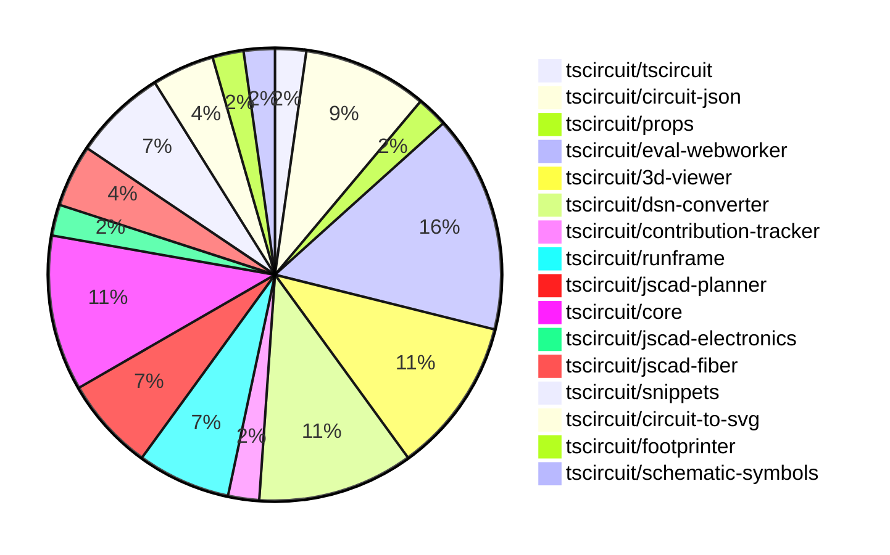

# Contribution Overview 2024-12-11

## PRs by Repository

## Contributor Overview

| Contributor | 🐳 Major | 🐙 Minor | 🐌 Tiny | ⭐ | Issues Created |
|-------------|---------|---------|---------|-----|----------------|
| [seveibar](#seveibar) | 5 | 17 | 1 | 👑 | 47 |
| [imrishabh18](#imrishabh18) | 0 | 6 | 0 | ⭐⭐ | 7 |
| [AnasSarkiz](#AnasSarkiz) | 3 | 2 | 0 | ⭐⭐ | 2 |
| [Abse2001](#Abse2001) | 1 | 1 | 0 | ⭐ | 2 |
| [devin-ai-integration[bot]](#devin-ai-integration[bot]) | 0 | 4 | 1 | ⭐ | 0 |
| [samyakshah3008](#samyakshah3008) | 0 | 1 | 0 |  | 0 |
| [techmannih](#techmannih) | 0 | 1 | 0 |  | 0 |
| [ni9999](#ni9999) | 0 | 1 | 0 |  | 0 |
| [Anshgrover23](#Anshgrover23) | 0 | 1 | 0 |  | 0 |

## Review Table

[reviews-received-hover]: ## "Number of reviews received for PRs for this contributor"
[approvals-received-hover]: ## "Number of approvals received for PRs this contributor authored"
[rejections-received-hover]: ## "Number of rejections received for PRs this contributor authored"
[prs-opened-hover]: ## "Number of PRs opened by this contributor"
[issues-created-hover]: ## "Number of issues created by this contributor"
[bountied-issues-hover]: ## "Number of issues this contributor created with a bounty"
[bountied-issue-$-hover]: ## "Total bounty amount placed on issues authored by this contributor"

| Contributor | Reviews Received | Approvals Received | Rejections Received | PRs Opened | PRs Merged | Issues Created | Bountied Issues | Bountied Issue $ |
|---|---|---|---|---|---|---|---|---|
| [Bhavyajain21](#Bhavyajain21) | 0 | 0 | 0 | 1 | 0 | 0 | 0 | 0 |
| [samyakshah3008](#samyakshah3008) | 6 | 1 | 1 | 1 | 1 | 0 | 0 | 0 |
| [ShiboSoftwareDev](#ShiboSoftwareDev) | 2 | 0 | 0 | 3 | 0 | 4 | 2 | 75 |
| [devin-ai-integration[bot]](#devin-ai-integration[bot]) | 12 | 5 | 7 | 15 | 5 | 0 | 0 | 0 |
| [imrishabh18](#imrishabh18) | 3 | 1 | 0 | 8 | 6 | 7 | 3 | 20 |
| [seveibar](#seveibar) | 3 | 0 | 0 | 23 | 23 | 47 | 20 | 395 |
| [AnasSarkiz](#AnasSarkiz) | 13 | 4 | 1 | 5 | 5 | 2 | 0 | 0 |
| [Abse2001](#Abse2001) | 5 | 2 | 0 | 3 | 2 | 2 | 1 | 20 |
| [techmannih](#techmannih) | 5 | 1 | 1 | 1 | 1 | 0 | 0 | 0 |
| [ni9999](#ni9999) | 5 | 1 | 2 | 1 | 1 | 0 | 0 | 0 |
| [RohittCodes](#RohittCodes) | 0 | 0 | 0 | 1 | 0 | 1 | 1 | 5 |
| [Anshgrover23](#Anshgrover23) | 2 | 1 | 0 | 2 | 1 | 0 | 0 | 0 |

## Changes by Repository

### [tscircuit/tscircuit](https://github.com/tscircuit/tscircuit)

| PR # | Impact | Contributor | Description |
|------|--------|-------------|-------------|
| [#484](https://github.com/tscircuit/tscircuit/pull/484) | 🐙 Minor | samyakshah3008 | This pull request enhances the README file of the tscircuit project by adding a new contributing guide, improving the structure and content of the README, and adding new sections such as a table of contents, an introduction to the project, and example circuits. |

### [tscircuit/circuit-json](https://github.com/tscircuit/circuit-json)

| PR # | Impact | Contributor | Description |
|------|--------|-------------|-------------|
| [#96](https://github.com/tscircuit/circuit-json/pull/96) | 🐙 Minor | devin-ai-integration[bot] | Add CircuitJson type export representing array of circuit elements. |
| [#88](https://github.com/tscircuit/circuit-json/pull/88) | 🐙 Minor | devin-ai-integration[bot] | Adds a new error type for conflicts between manual edits and explicit PCB coordinates. |
| [#94](https://github.com/tscircuit/circuit-json/pull/94) | 🐙 Minor | imrishabh18 | Adds a new data type `pcb_group` to represent a group of components on a PCB. |
| [#89](https://github.com/tscircuit/circuit-json/pull/89) | 🐙 Minor | seveibar | Updates the README.md file to include information about base units and element prefixes used in the project. |

### [tscircuit/props](https://github.com/tscircuit/props)

| PR # | Impact | Contributor | Description |
|------|--------|-------------|-------------|
| [#113](https://github.com/tscircuit/props/pull/113) | 🐙 Minor | devin-ai-integration[bot] | Adds a new `pinVariant` prop to the `crystal` component to support 2-pin and 4-pin variants. |

### [tscircuit/eval-webworker](https://github.com/tscircuit/eval-webworker)

| PR # | Impact | Contributor | Description |
|------|--------|-------------|-------------|
| [#13](https://github.com/tscircuit/eval-webworker/pull/13) | 🐳 Major | seveibar | The pull request adds a new `executeWithFsMap` function to the `CircuitWebWorker` interface and its implementation, which allows executing code with a virtual file system. It also adds a new test that demonstrates the usage of this feature. |
| [#26](https://github.com/tscircuit/eval-webworker/pull/26) | 🐙 Minor | devin-ai-integration[bot] | Add type declarations for the blob-url module. |
| [#28](https://github.com/tscircuit/eval-webworker/pull/28) | 🐙 Minor | seveibar | Separate the build process for the library and the webworker into two distinct steps. |
| [#27](https://github.com/tscircuit/eval-webworker/pull/27) | 🐙 Minor | seveibar | Adds a verbose mode for logging in the circuit web worker. |
| [#24](https://github.com/tscircuit/eval-webworker/pull/24) | 🐙 Minor | seveibar | The pull request adds support for creating blob URLs for the packaged web worker, which allows it to be loaded more efficiently. |
| [#20](https://github.com/tscircuit/eval-webworker/pull/20) | 🐙 Minor | seveibar | Adds documentation for using a virtual filesystem with the `executeWithFsMap` method of the `createCircuitWebWorker` function. |
| [#25](https://github.com/tscircuit/eval-webworker/pull/25) | 🐌 Tiny | seveibar | Add `{ type: "module" }` to the Worker import in the `lib/index.ts` file. |

### [tscircuit/3d-viewer](https://github.com/tscircuit/3d-viewer)

| PR # | Impact | Contributor | Description |
|------|--------|-------------|-------------|
| [#64](https://github.com/tscircuit/3d-viewer/pull/64) | 🐳 Major | seveibar | Introduces error boundaries for components and fixes a bug in the jscad-fiber library. |
| [#67](https://github.com/tscircuit/3d-viewer/pull/67) | 🐳 Major | Abse2001 | Adds support for rendering silkscreen text on PCB boards. |
| [#69](https://github.com/tscircuit/3d-viewer/pull/69) | 🐙 Minor | seveibar | Add support for Vercel building by removing the package-lock.json file and updating dependencies. |
| [#62](https://github.com/tscircuit/3d-viewer/pull/62) | 🐙 Minor | techmannih | Add a type checking and formatting workflow using GitHub Actions |
| [#68](https://github.com/tscircuit/3d-viewer/pull/68) | 🐌 Tiny | devin-ai-integration[bot] | Prevent text selection in tooltips when clicking in the 3D viewer. |

### [tscircuit/dsn-converter](https://github.com/tscircuit/dsn-converter)

| PR # | Impact | Contributor | Description |
|------|--------|-------------|-------------|
| [#63](https://github.com/tscircuit/dsn-converter/pull/63) | 🐙 Minor | imrishabh18 | Fix the trace width used in freerouting to match the component width for proper routing. |
| [#62](https://github.com/tscircuit/dsn-converter/pull/62) | 🐙 Minor | imrishabh18 | Fixes the linkage between source traces and the corresponding net in the circuit JSON conversion process. |
| [#60](https://github.com/tscircuit/dsn-converter/pull/60) | 🐙 Minor | imrishabh18 | Fix pin numbers are derived from source_port for plated_hole's |
| [#59](https://github.com/tscircuit/dsn-converter/pull/59) | 🐙 Minor | imrishabh18 | Add default width and height for group subcircuit |
| [#58](https://github.com/tscircuit/dsn-converter/pull/58) | 🐙 Minor | imrishabh18 | Fixes an issue with parsing the pin number in the DSN-to-circuit-JSON conversion process. |

### [tscircuit/contribution-tracker](https://github.com/tscircuit/contribution-tracker)

| PR # | Impact | Contributor | Description |
|------|--------|-------------|-------------|
| [#22](https://github.com/tscircuit/contribution-tracker/pull/22) | 🐳 Major | seveibar | Refactor types, add support for JSON generation, fix Claude caching, and fix column titles |

### [tscircuit/runframe](https://github.com/tscircuit/runframe)

| PR # | Impact | Contributor | Description |
|------|--------|-------------|-------------|
| [#9](https://github.com/tscircuit/runframe/pull/9) | 🐳 Major | seveibar | Introduces a new component `RunFrameWithApi` that adds support for interacting with a backend API to load and update files used in the `RunFrame` component. |
| [#3](https://github.com/tscircuit/runframe/pull/3) | 🐳 Major | seveibar | Add CI/CD workflows for format check, type check, and npm publishing |
| [#14](https://github.com/tscircuit/runframe/pull/14) | 🐙 Minor | seveibar | Fixes build issues and improves entrypoint guessing logic |

### [tscircuit/jscad-planner](https://github.com/tscircuit/jscad-planner)

| PR # | Impact | Contributor | Description |
|------|--------|-------------|-------------|
| [#7](https://github.com/tscircuit/jscad-planner/pull/7) | 🐙 Minor | seveibar | Adds support for automatically casting single-element arrays to the element itself in the `executeJscadOperations` function. |
| [#6](https://github.com/tscircuit/jscad-planner/pull/6) | 🐙 Minor | seveibar | Throw a specific error if an array is passed as the `operation` parameter to `executeJscadOperations`. |
| [#5](https://github.com/tscircuit/jscad-planner/pull/5) | 🐙 Minor | seveibar | Improve error message when an operation has an undefined type. |

### [tscircuit/core](https://github.com/tscircuit/core)

| PR # | Impact | Contributor | Description |
|------|--------|-------------|-------------|
| [#409](https://github.com/tscircuit/core/pull/409) | 🐳 Major | AnasSarkiz | Implemented a `pcbDisabled` option in the `Circuit.ts` file to disable all PCB elements. |
| [#419](https://github.com/tscircuit/core/pull/419) | 🐙 Minor | seveibar | The change adds an error check to ensure that a component cannot have both manual placement and explicit coordinates (pcbX/pcbY). |
| [#415](https://github.com/tscircuit/core/pull/415) | 🐙 Minor | seveibar | Update the "circuit-json" dependency to version 0.0.114 |
| [#414](https://github.com/tscircuit/core/pull/414) | 🐙 Minor | seveibar | Don't output size reports if package.json wasn't changed. |
| [#397](https://github.com/tscircuit/core/pull/397) | 🐙 Minor | AnasSarkiz | Adds automatic schematic net labeling for complex traces between passive components and chips |

### [tscircuit/jscad-electronics](https://github.com/tscircuit/jscad-electronics)

| PR # | Impact | Contributor | Description |
|------|--------|-------------|-------------|
| [#82](https://github.com/tscircuit/jscad-electronics/pull/82) | 🐙 Minor | seveibar | Update the `JsCadFixture` component to `JsCadView` in various example files. |

### [tscircuit/jscad-fiber](https://github.com/tscircuit/jscad-fiber)

| PR # | Impact | Contributor | Description |
|------|--------|-------------|-------------|
| [#97](https://github.com/tscircuit/jscad-fiber/pull/97) | 🐙 Minor | seveibar | Add a new jscad-planner test and unnest children in the createHostConfig function. |
| [#99](https://github.com/tscircuit/jscad-fiber/pull/99) | 🐙 Minor | Abse2001 | Updates the `@types/react` dependency to version 19.0.1 to support the latest version of React. |

### [tscircuit/snippets](https://github.com/tscircuit/snippets)

| PR # | Impact | Contributor | Description |
|------|--------|-------------|-------------|
| [#385](https://github.com/tscircuit/snippets/pull/385) | 🐙 Minor | seveibar | Updates the version of the "@tscircuit/3d-viewer" and "jscad-electronics" packages |
| [#363](https://github.com/tscircuit/snippets/pull/363) | 🐙 Minor | seveibar | Reduces the number of retries for Playwright tests in CI and disables certain links in the StaticViewSnippetSidebar component. |
| [#365](https://github.com/tscircuit/snippets/pull/365) | 🐙 Minor | Anshgrover23 | Splits the `footprint-dialog.spec.ts` file into multiple files to better organize the tests. |

### [tscircuit/circuit-to-svg](https://github.com/tscircuit/circuit-to-svg)

| PR # | Impact | Contributor | Description |
|------|--------|-------------|-------------|
| [#148](https://github.com/tscircuit/circuit-to-svg/pull/148) | 🐳 Major | AnasSarkiz | Introduce Assembly Diagram `convertCircuitJsonToAssemblySvg` |
| [#147](https://github.com/tscircuit/circuit-to-svg/pull/147) | 🐳 Major | AnasSarkiz | Introduces a new function `createSvgObjectsFromSchVoltageProbe` to handle the creation of SVG objects for voltage probes in the schematic. |

### [tscircuit/footprinter](https://github.com/tscircuit/footprinter)

| PR # | Impact | Contributor | Description |
|------|--------|-------------|-------------|
| [#96](https://github.com/tscircuit/footprinter/pull/96) | 🐙 Minor | AnasSarkiz | The pull request adds support for height parameters to the stampboard and stampreceiver functions, allowing for more flexibility in the size of the generated circuit elements. |

### [tscircuit/schematic-symbols](https://github.com/tscircuit/schematic-symbols)

| PR # | Impact | Contributor | Description |
|------|--------|-------------|-------------|
| [#210](https://github.com/tscircuit/schematic-symbols/pull/210) | 🐙 Minor | ni9999 | Adds a 4-pin crystal symbol |

## Changes by Contributor

### [samyakshah3008](https://github.com/samyakshah3008)

| PR # | Impact | Description |
|------|--------|-------------|
| [#484](https://github.com/tscircuit/tscircuit/pull/484) | 🐙 Minor | This pull request enhances the README file of the tscircuit project by adding a new contributing guide, improving the structure and content of the README, and adding new sections such as a table of contents, an introduction to the project, and example circuits. |

### [devin-ai-integration[bot]](https://github.com/devin-ai-integration[bot])

| PR # | Impact | Description |
|------|--------|-------------|
| [#96](https://github.com/tscircuit/circuit-json/pull/96) | 🐙 Minor | Add CircuitJson type export representing array of circuit elements. |
| [#88](https://github.com/tscircuit/circuit-json/pull/88) | 🐙 Minor | Adds a new error type for conflicts between manual edits and explicit PCB coordinates. |
| [#113](https://github.com/tscircuit/props/pull/113) | 🐙 Minor | Adds a new `pinVariant` prop to the `crystal` component to support 2-pin and 4-pin variants. |
| [#26](https://github.com/tscircuit/eval-webworker/pull/26) | 🐙 Minor | Add type declarations for the blob-url module. |
| [#68](https://github.com/tscircuit/3d-viewer/pull/68) | 🐌 Tiny | Prevent text selection in tooltips when clicking in the 3D viewer. |

### [imrishabh18](https://github.com/imrishabh18)

| PR # | Impact | Description |
|------|--------|-------------|
| [#94](https://github.com/tscircuit/circuit-json/pull/94) | 🐙 Minor | Adds a new data type `pcb_group` to represent a group of components on a PCB. |
| [#63](https://github.com/tscircuit/dsn-converter/pull/63) | 🐙 Minor | Fix the trace width used in freerouting to match the component width for proper routing. |
| [#62](https://github.com/tscircuit/dsn-converter/pull/62) | 🐙 Minor | Fixes the linkage between source traces and the corresponding net in the circuit JSON conversion process. |
| [#60](https://github.com/tscircuit/dsn-converter/pull/60) | 🐙 Minor | Fix pin numbers are derived from source_port for plated_hole's |
| [#59](https://github.com/tscircuit/dsn-converter/pull/59) | 🐙 Minor | Add default width and height for group subcircuit |
| [#58](https://github.com/tscircuit/dsn-converter/pull/58) | 🐙 Minor | Fixes an issue with parsing the pin number in the DSN-to-circuit-JSON conversion process. |

### [seveibar](https://github.com/seveibar)

| PR # | Impact | Description |
|------|--------|-------------|
| [#64](https://github.com/tscircuit/3d-viewer/pull/64) | 🐳 Major | Introduces error boundaries for components and fixes a bug in the jscad-fiber library. |
| [#22](https://github.com/tscircuit/contribution-tracker/pull/22) | 🐳 Major | Refactor types, add support for JSON generation, fix Claude caching, and fix column titles |
| [#13](https://github.com/tscircuit/eval-webworker/pull/13) | 🐳 Major | The pull request adds a new `executeWithFsMap` function to the `CircuitWebWorker` interface and its implementation, which allows executing code with a virtual file system. It also adds a new test that demonstrates the usage of this feature. |
| [#9](https://github.com/tscircuit/runframe/pull/9) | 🐳 Major | Introduces a new component `RunFrameWithApi` that adds support for interacting with a backend API to load and update files used in the `RunFrame` component. |
| [#3](https://github.com/tscircuit/runframe/pull/3) | 🐳 Major | Add CI/CD workflows for format check, type check, and npm publishing |
| [#89](https://github.com/tscircuit/circuit-json/pull/89) | 🐙 Minor | Updates the README.md file to include information about base units and element prefixes used in the project. |
| [#69](https://github.com/tscircuit/3d-viewer/pull/69) | 🐙 Minor | Add support for Vercel building by removing the package-lock.json file and updating dependencies. |
| [#7](https://github.com/tscircuit/jscad-planner/pull/7) | 🐙 Minor | Adds support for automatically casting single-element arrays to the element itself in the `executeJscadOperations` function. |
| [#6](https://github.com/tscircuit/jscad-planner/pull/6) | 🐙 Minor | Throw a specific error if an array is passed as the `operation` parameter to `executeJscadOperations`. |
| [#5](https://github.com/tscircuit/jscad-planner/pull/5) | 🐙 Minor | Improve error message when an operation has an undefined type. |
| [#419](https://github.com/tscircuit/core/pull/419) | 🐙 Minor | The change adds an error check to ensure that a component cannot have both manual placement and explicit coordinates (pcbX/pcbY). |
| [#415](https://github.com/tscircuit/core/pull/415) | 🐙 Minor | Update the "circuit-json" dependency to version 0.0.114 |
| [#414](https://github.com/tscircuit/core/pull/414) | 🐙 Minor | Don't output size reports if package.json wasn't changed. |
| [#82](https://github.com/tscircuit/jscad-electronics/pull/82) | 🐙 Minor | Update the `JsCadFixture` component to `JsCadView` in various example files. |
| [#97](https://github.com/tscircuit/jscad-fiber/pull/97) | 🐙 Minor | Add a new jscad-planner test and unnest children in the createHostConfig function. |
| [#385](https://github.com/tscircuit/snippets/pull/385) | 🐙 Minor | Updates the version of the "@tscircuit/3d-viewer" and "jscad-electronics" packages |
| [#363](https://github.com/tscircuit/snippets/pull/363) | 🐙 Minor | Reduces the number of retries for Playwright tests in CI and disables certain links in the StaticViewSnippetSidebar component. |
| [#28](https://github.com/tscircuit/eval-webworker/pull/28) | 🐙 Minor | Separate the build process for the library and the webworker into two distinct steps. |
| [#27](https://github.com/tscircuit/eval-webworker/pull/27) | 🐙 Minor | Adds a verbose mode for logging in the circuit web worker. |
| [#24](https://github.com/tscircuit/eval-webworker/pull/24) | 🐙 Minor | The pull request adds support for creating blob URLs for the packaged web worker, which allows it to be loaded more efficiently. |
| [#20](https://github.com/tscircuit/eval-webworker/pull/20) | 🐙 Minor | Adds documentation for using a virtual filesystem with the `executeWithFsMap` method of the `createCircuitWebWorker` function. |
| [#14](https://github.com/tscircuit/runframe/pull/14) | 🐙 Minor | Fixes build issues and improves entrypoint guessing logic |
| [#25](https://github.com/tscircuit/eval-webworker/pull/25) | 🐌 Tiny | Add `{ type: "module" }` to the Worker import in the `lib/index.ts` file. |

### [AnasSarkiz](https://github.com/AnasSarkiz)

| PR # | Impact | Description |
|------|--------|-------------|
| [#409](https://github.com/tscircuit/core/pull/409) | 🐳 Major | Implemented a `pcbDisabled` option in the `Circuit.ts` file to disable all PCB elements. |
| [#148](https://github.com/tscircuit/circuit-to-svg/pull/148) | 🐳 Major | Introduce Assembly Diagram `convertCircuitJsonToAssemblySvg` |
| [#147](https://github.com/tscircuit/circuit-to-svg/pull/147) | 🐳 Major | Introduces a new function `createSvgObjectsFromSchVoltageProbe` to handle the creation of SVG objects for voltage probes in the schematic. |
| [#96](https://github.com/tscircuit/footprinter/pull/96) | 🐙 Minor | The pull request adds support for height parameters to the stampboard and stampreceiver functions, allowing for more flexibility in the size of the generated circuit elements. |
| [#397](https://github.com/tscircuit/core/pull/397) | 🐙 Minor | Adds automatic schematic net labeling for complex traces between passive components and chips |

### [Abse2001](https://github.com/Abse2001)

| PR # | Impact | Description |
|------|--------|-------------|
| [#67](https://github.com/tscircuit/3d-viewer/pull/67) | 🐳 Major | Adds support for rendering silkscreen text on PCB boards. |
| [#99](https://github.com/tscircuit/jscad-fiber/pull/99) | 🐙 Minor | Updates the `@types/react` dependency to version 19.0.1 to support the latest version of React. |

### [techmannih](https://github.com/techmannih)

| PR # | Impact | Description |
|------|--------|-------------|
| [#62](https://github.com/tscircuit/3d-viewer/pull/62) | 🐙 Minor | Add a type checking and formatting workflow using GitHub Actions |

### [ni9999](https://github.com/ni9999)

| PR # | Impact | Description |
|------|--------|-------------|
| [#210](https://github.com/tscircuit/schematic-symbols/pull/210) | 🐙 Minor | Adds a 4-pin crystal symbol |

### [Anshgrover23](https://github.com/Anshgrover23)

| PR # | Impact | Description |
|------|--------|-------------|
| [#365](https://github.com/tscircuit/snippets/pull/365) | 🐙 Minor | Splits the `footprint-dialog.spec.ts` file into multiple files to better organize the tests. |

