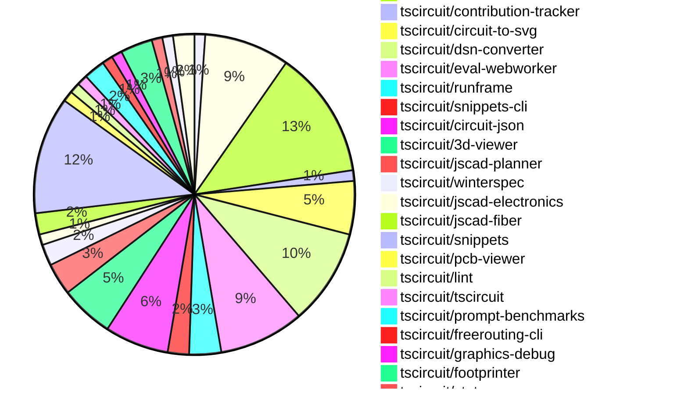

# Contribution Overview 2024-12-11

## PRs by Repository

## Contributor Overview

| Contributor | 🐳 Major | 🐙 Minor | 🐌 Tiny | ⭐ | Issues Created |
|-------------|---------|---------|---------|-----|----------------|
| [seveibar](#seveibar) | 11 | 27 | 2 | 👑👑👑 | 98 |
| [ShiboSoftwareDev](#ShiboSoftwareDev) | 2 | 4 | 0 | ⭐⭐⭐ | 7 |
| [imrishabh18](#imrishabh18) | 1 | 8 | 1 | ⭐⭐⭐ | 18 |
| [Abse2001](#Abse2001) | 1 | 6 | 0 | ⭐⭐ | 5 |
| [devin-ai-integration[bot]](#devin-ai-integration[bot]) | 0 | 12 | 0 | ⭐⭐ | 0 |
| [AnasSarkiz](#AnasSarkiz) | 4 | 2 | 0 | ⭐⭐ | 2 |
| [techmannih](#techmannih) | 0 | 7 | 0 | ⭐⭐ | 0 |
| [RohittCodes](#RohittCodes) | 0 | 2 | 0 | ⭐ | 4 |
| [samyakshah3008](#samyakshah3008) | 0 | 1 | 0 |  | 0 |
| [ni9999](#ni9999) | 0 | 1 | 0 |  | 0 |
| [Anshgrover23](#Anshgrover23) | 0 | 1 | 0 |  | 0 |

## Review Table

[reviews-received-hover]: ## "Number of reviews received for PRs for this contributor"
[approvals-received-hover]: ## "Number of approvals received for PRs this contributor authored"
[rejections-received-hover]: ## "Number of rejections received for PRs this contributor authored"
[prs-opened-hover]: ## "Number of PRs opened by this contributor"
[issues-created-hover]: ## "Number of issues created by this contributor"
[bountied-issues-hover]: ## "Number of issues this contributor created with a bounty"
[bountied-issue-$-hover]: ## "Total bounty amount placed on issues authored by this contributor"

| Contributor | Reviews Received | Approvals Received | Rejections Received | PRs Opened | PRs Merged | Issues Created | Bountied Issues | Bountied Issue $ |
|---|---|---|---|---|---|---|---|---|
| [seveibar](#seveibar) | 5 | 2 | 0 | 41 | 40 | 98 | 39 | 814 |
| [Bhavyajain21](#Bhavyajain21) | 1 | 0 | 1 | 1 | 0 | 0 | 0 | 0 |
| [Abse2001](#Abse2001) | 16 | 7 | 1 | 10 | 7 | 5 | 3 | 40 |
| [samyakshah3008](#samyakshah3008) | 6 | 1 | 1 | 1 | 1 | 0 | 0 | 0 |
| [Anshgrover23](#Anshgrover23) | 9 | 1 | 3 | 4 | 1 | 0 | 0 | 0 |
| [RohittCodes](#RohittCodes) | 5 | 3 | 0 | 5 | 2 | 4 | 3 | 25 |
| [ShiboSoftwareDev](#ShiboSoftwareDev) | 8 | 6 | 0 | 8 | 6 | 7 | 3 | 115 |
| [devin-ai-integration[bot]](#devin-ai-integration[bot]) | 20 | 10 | 9 | 24 | 12 | 0 | 0 | 0 |
| [imrishabh18](#imrishabh18) | 9 | 2 | 0 | 15 | 10 | 18 | 6 | 55 |
| [techmannih](#techmannih) | 22 | 9 | 6 | 11 | 7 | 0 | 0 | 0 |
| [AnasSarkiz](#AnasSarkiz) | 17 | 6 | 1 | 6 | 6 | 2 | 0 | 0 |
| [ni9999](#ni9999) | 5 | 1 | 2 | 1 | 1 | 0 | 0 | 0 |
| [Niharika0104](#Niharika0104) | 1 | 0 | 1 | 1 | 0 | 1 | 0 | 0 |
| [DrSensor](#DrSensor) | 0 | 0 | 0 | 1 | 0 | 0 | 0 | 0 |

## Changes by Repository

### [tscircuit/schematic-viewer](https://github.com/tscircuit/schematic-viewer)

| PR # | Impact | Contributor | Description |
|------|--------|-------------|-------------|
| [#73](https://github.com/tscircuit/schematic-viewer/pull/73) | 🐳 Major | seveibar | Adds support for drag-and-drop editing of components in the circuit editor. |

### [tscircuit/props](https://github.com/tscircuit/props)

| PR # | Impact | Contributor | Description |
|------|--------|-------------|-------------|
| [#117](https://github.com/tscircuit/props/pull/117) | 🐳 Major | seveibar | Adds support for manual schematic placements and schematic placement events |
| [#121](https://github.com/tscircuit/props/pull/121) | 🐙 Minor | seveibar | Fixes exports to include manual edit events and improves the consistency of edit event type property for PCB trace hints. |
| [#118](https://github.com/tscircuit/props/pull/118) | 🐙 Minor | seveibar | Fixes exports to include manual edit events for both PCB and schematic component locations. |
| [#116](https://github.com/tscircuit/props/pull/116) | 🐙 Minor | seveibar | Move Manual Edits Definitions into Props |
| [#124](https://github.com/tscircuit/props/pull/124) | 🐙 Minor | devin-ai-integration[bot] | Rename `manual_edit_file` to `manual_edits_file` for consistency with the interface name `ManualEditsFile`. |
| [#122](https://github.com/tscircuit/props/pull/122) | 🐙 Minor | devin-ai-integration[bot] | Add TypeScript interface definition for `ManualEditsFile` to match existing Zod schema |
| [#113](https://github.com/tscircuit/props/pull/113) | 🐙 Minor | devin-ai-integration[bot] | Adds a new `pinVariant` prop to the `crystal` component to support 2-pin and 4-pin variants. |
| [#119](https://github.com/tscircuit/props/pull/119) | 🐙 Minor | techmannih | Adds a new component called "resonator" with associated properties and validation. |

### [tscircuit/core](https://github.com/tscircuit/core)

| PR # | Impact | Contributor | Description |
|------|--------|-------------|-------------|
| [#439](https://github.com/tscircuit/core/pull/439) | 🐳 Major | seveibar | Adds a new function `applyEditEventsToManualEditsFile` to update schematic component placements in a manual edits file based on edit events. |
| [#409](https://github.com/tscircuit/core/pull/409) | 🐳 Major | AnasSarkiz | Implemented a new `pcbDisabled` option in the `Circuit.ts` class to disable all PCB elements. |
| [#436](https://github.com/tscircuit/core/pull/436) | 🐙 Minor | seveibar | Renames the "eval_error" event to "external:evalError" |
| [#419](https://github.com/tscircuit/core/pull/419) | 🐙 Minor | seveibar | Throws a better error when a component has both manual placement and explicit coordinates (pcbX/pcbY). |
| [#414](https://github.com/tscircuit/core/pull/414) | 🐙 Minor | seveibar | Conditionally output size reports based on changes to package.json. |
| [#422](https://github.com/tscircuit/core/pull/422) | 🐙 Minor | Abse2001 | Adds a schematic_net_label.symbol_name for the GND symbol. |
| [#437](https://github.com/tscircuit/core/pull/437) | 🐙 Minor | imrishabh18 | Updates the lockfile to publish the package. |
| [#430](https://github.com/tscircuit/core/pull/430) | 🐙 Minor | imrishabh18 | Add a new event type for webworker evaluation errors. |
| [#424](https://github.com/tscircuit/core/pull/424) | 🐙 Minor | techmannih | Set up continuous branch release with pkg-pr-new |
| [#428](https://github.com/tscircuit/core/pull/428) | 🐙 Minor | techmannih | Adds a new SilkscreenLine component to the library. |
| [#397](https://github.com/tscircuit/core/pull/397) | 🐙 Minor | AnasSarkiz | Adds automatic schematic net labeling for passive-chip components with complex traces. |
| [#415](https://github.com/tscircuit/core/pull/415) | 🐌 Tiny | seveibar | Update the version of the "circuit-json" dependency in the project. |

### [tscircuit/contribution-tracker](https://github.com/tscircuit/contribution-tracker)

| PR # | Impact | Contributor | Description |
|------|--------|-------------|-------------|
| [#22](https://github.com/tscircuit/contribution-tracker/pull/22) | 🐳 Major | seveibar | Refactor types, add support for JSON generation, fix Claude caching, and fix column titles. |

### [tscircuit/circuit-to-svg](https://github.com/tscircuit/circuit-to-svg)

| PR # | Impact | Contributor | Description |
|------|--------|-------------|-------------|
| [#151](https://github.com/tscircuit/circuit-to-svg/pull/151) | 🐳 Major | seveibar | Adds support for computing the schematic transform and placing it on the SVG as a data attribute. |
| [#148](https://github.com/tscircuit/circuit-to-svg/pull/148) | 🐳 Major | AnasSarkiz | Introduces a new function `convertCircuitJsonToAssemblySvg` that generates an SVG representation of a circuit assembly based on the provided circuit JSON data. |
| [#147](https://github.com/tscircuit/circuit-to-svg/pull/147) | 🐳 Major | AnasSarkiz | Introduces a new function `createSvgObjectsFromSchVoltageProbe` to create SVG objects for schematic voltage probes. |
| [#150](https://github.com/tscircuit/circuit-to-svg/pull/150) | 🐙 Minor | seveibar | Add `data-circuit-json-type` and `data-schematic-trace-id` properties to the SVG object representing a schematic trace. |
| [#149](https://github.com/tscircuit/circuit-to-svg/pull/149) | 🐙 Minor | Abse2001 | Adds symbol name support for the GND (ground) symbol in the schematic net label |

### [tscircuit/dsn-converter](https://github.com/tscircuit/dsn-converter)

| PR # | Impact | Contributor | Description |
|------|--------|-------------|-------------|
| [#69](https://github.com/tscircuit/dsn-converter/pull/69) | 🐳 Major | seveibar | Fix merge dsn session to have SVG parity |
| [#68](https://github.com/tscircuit/dsn-converter/pull/68) | 🐳 Major | seveibar | Remove Y Axis Flip in DSN PCB Conversion, Merge Dsn Session into Dsn PCB, Minor Refactoring, Lots of Debug statements, Include vias in DSN stringification, Improve Circuit Json to DSN PCB conversion for traces/vias |
| [#58](https://github.com/tscircuit/dsn-converter/pull/58) | 🐳 Major | imrishabh18 | Fixes an issue with parsing the pin number and coordinates in the DSN file. |
| [#67](https://github.com/tscircuit/dsn-converter/pull/67) | 🐙 Minor | seveibar | Adds an assertion for checking the layer of SMT pads and fixes an issue where all SMT pads were being placed on the top layer. |
| [#66](https://github.com/tscircuit/dsn-converter/pull/66) | 🐙 Minor | seveibar | Add debug utilities, add a test that shows issues with converting to DSN PCB |
| [#63](https://github.com/tscircuit/dsn-converter/pull/63) | 🐙 Minor | imrishabh18 | Fix the trace width used in freerouting to be smaller than the component width to enable proper routing. |
| [#62](https://github.com/tscircuit/dsn-converter/pull/62) | 🐙 Minor | imrishabh18 | Fixes the hover trace issue by updating the trace IDs to maintain proper linkage. |
| [#60](https://github.com/tscircuit/dsn-converter/pull/60) | 🐙 Minor | imrishabh18 | Fix the pin number derivation for plated holes from the source_port instead of the port_hints. |
| [#59](https://github.com/tscircuit/dsn-converter/pull/59) | 🐙 Minor | imrishabh18 | Adds a default width and height of 100mm for the `<group/>` subcircuit. |

### [tscircuit/eval-webworker](https://github.com/tscircuit/eval-webworker)

| PR # | Impact | Contributor | Description |
|------|--------|-------------|-------------|
| [#13](https://github.com/tscircuit/eval-webworker/pull/13) | 🐳 Major | seveibar | The pull request adds support for executing code with a virtual file system and multiple files (including local files). |
| [#28](https://github.com/tscircuit/eval-webworker/pull/28) | 🐙 Minor | seveibar | Separate the bundling of the webworker from the main library bundle. |
| [#27](https://github.com/tscircuit/eval-webworker/pull/27) | 🐙 Minor | seveibar | Adds a verbose mode logging for the circuit web worker. |
| [#24](https://github.com/tscircuit/eval-webworker/pull/24) | 🐙 Minor | seveibar | The pull request updates the build process to create a blob URL for the webworker, which allows it to be loaded more efficiently. |
| [#20](https://github.com/tscircuit/eval-webworker/pull/20) | 🐙 Minor | seveibar | Add usage of fsmap to execute code with multiple files or components |
| [#26](https://github.com/tscircuit/eval-webworker/pull/26) | 🐙 Minor | devin-ai-integration[bot] | Add type declarations for the blob-url module to resolve type errors. |
| [#33](https://github.com/tscircuit/eval-webworker/pull/33) | 🐙 Minor | imrishabh18 | Adds an `emitError` function to the `CircuitWebWorker` interface and the `webWorkerApi` object to allow emitting errors during code evaluation. |
| [#25](https://github.com/tscircuit/eval-webworker/pull/25) | 🐌 Tiny | seveibar | Add `{ type: "module" }` to worker import |

### [tscircuit/runframe](https://github.com/tscircuit/runframe)

| PR # | Impact | Contributor | Description |
|------|--------|-------------|-------------|
| [#9](https://github.com/tscircuit/runframe/pull/9) | 🐳 Major | seveibar | Introduces a new component `RunFrameWithApi` that integrates the existing `RunFrame` component with a backend API for file management. |
| [#3](https://github.com/tscircuit/runframe/pull/3) | 🐳 Major | seveibar | Add GitHub Actions workflows for format checking, type checking, and publishing to npm |
| [#14](https://github.com/tscircuit/runframe/pull/14) | 🐙 Minor | seveibar | Introduces a smarter entrypoint guessing algorithm and fixes some build issues. |

### [tscircuit/snippets-cli](https://github.com/tscircuit/snippets-cli)

| PR # | Impact | Contributor | Description |
|------|--------|-------------|-------------|
| [#6](https://github.com/tscircuit/snippets-cli/pull/6) | 🐳 Major | seveibar | Fixes package.json for publishing, adds build step, GitHub workflows, and code formatting. |
| [#8](https://github.com/tscircuit/snippets-cli/pull/8) | 🐙 Minor | ShiboSoftwareDev | Automatically install imported snippet types |

### [tscircuit/circuit-json](https://github.com/tscircuit/circuit-json)

| PR # | Impact | Contributor | Description |
|------|--------|-------------|-------------|
| [#89](https://github.com/tscircuit/circuit-json/pull/89) | 🐙 Minor | seveibar | Updates the README.md file to include information about base units and element prefixes used in the circuit JSON format. |
| [#100](https://github.com/tscircuit/circuit-json/pull/100) | 🐙 Minor | RohittCodes | Adds support for parsing the "KΩ" and "KV" SI unit symbols. |
| [#97](https://github.com/tscircuit/circuit-json/pull/97) | 🐙 Minor | ShiboSoftwareDev | The pull request fixes issues with the script used for generating documentation, including fixing the search for interfaces instead of types, the issue with generating source docs on Windows, and the missing closing tag for the table of contents. |
| [#96](https://github.com/tscircuit/circuit-json/pull/96) | 🐙 Minor | devin-ai-integration[bot] | Adds a new `CircuitJson` type export representing an array of circuit elements. |
| [#88](https://github.com/tscircuit/circuit-json/pull/88) | 🐙 Minor | devin-ai-integration[bot] | Adds a new error type, `PcbManualEditConflictError`, to handle conflicts between manual edits and explicit PCB coordinates. |
| [#94](https://github.com/tscircuit/circuit-json/pull/94) | 🐙 Minor | imrishabh18 | Adds a new `pcb_group` type to the `any_circuit_element` union and introduces a new `pcb_group` module. |

### [tscircuit/3d-viewer](https://github.com/tscircuit/3d-viewer)

| PR # | Impact | Contributor | Description |
|------|--------|-------------|-------------|
| [#67](https://github.com/tscircuit/3d-viewer/pull/67) | 🐳 Major | Abse2001 | Adds silkscreen text rendering to the PCB board geometry. |
| [#69](https://github.com/tscircuit/3d-viewer/pull/69) | 🐙 Minor | seveibar | Adds support for Vercel building by removing the package lock and updating dependencies. |
| [#64](https://github.com/tscircuit/3d-viewer/pull/64) | 🐙 Minor | seveibar | Introduces Error Boundaries for components and fixes a jscad-fiber unnesting issue. |
| [#68](https://github.com/tscircuit/3d-viewer/pull/68) | 🐙 Minor | devin-ai-integration[bot] | Prevent accidental text selection in tooltips when clicking in the 3D viewer. |
| [#62](https://github.com/tscircuit/3d-viewer/pull/62) | 🐙 Minor | techmannih | Add typechecking and formatting workflow using GitHub Actions |

### [tscircuit/jscad-planner](https://github.com/tscircuit/jscad-planner)

| PR # | Impact | Contributor | Description |
|------|--------|-------------|-------------|
| [#7](https://github.com/tscircuit/jscad-planner/pull/7) | 🐙 Minor | seveibar | Add support for automatically handling single-element arrays in JSCAD operations. |
| [#6](https://github.com/tscircuit/jscad-planner/pull/6) | 🐙 Minor | seveibar | Throw a specific error if an array is passed in for the `operation` parameter in `executeJscadOperations` function. |
| [#5](https://github.com/tscircuit/jscad-planner/pull/5) | 🐙 Minor | seveibar | Improve error message when operation has an undefined type. |

### [tscircuit/winterspec](https://github.com/tscircuit/winterspec)

| PR # | Impact | Contributor | Description |
|------|--------|-------------|-------------|
| [#25](https://github.com/tscircuit/winterspec/pull/25) | 🐙 Minor | seveibar | Ports the CLI to use the Commander library, adds lots of debug logging, and avoids bundleRequire when running in Bun. |
| [#24](https://github.com/tscircuit/winterspec/pull/24) | 🐙 Minor | seveibar | Adds middleware exports to the `src/middleware/index.ts` file. |

### [tscircuit/jscad-electronics](https://github.com/tscircuit/jscad-electronics)

| PR # | Impact | Contributor | Description |
|------|--------|-------------|-------------|
| [#82](https://github.com/tscircuit/jscad-electronics/pull/82) | 🐙 Minor | seveibar | Update jscad-fiber library from JsCadFixture to JsCadView |

### [tscircuit/jscad-fiber](https://github.com/tscircuit/jscad-fiber)

| PR # | Impact | Contributor | Description |
|------|--------|-------------|-------------|
| [#97](https://github.com/tscircuit/jscad-fiber/pull/97) | 🐙 Minor | seveibar | Adds a new `jscad-planner` test component and modifies the `createHostConfig` function to unnest children when necessary. |
| [#99](https://github.com/tscircuit/jscad-fiber/pull/99) | 🐙 Minor | Abse2001 | Update React types to support React 19.0.1 |

### [tscircuit/snippets](https://github.com/tscircuit/snippets)

| PR # | Impact | Contributor | Description |
|------|--------|-------------|-------------|
| [#390](https://github.com/tscircuit/snippets/pull/390) | 🐙 Minor | seveibar | Delete the "error-fallback.spec.ts" file from the "playwright-tests" directory. |
| [#385](https://github.com/tscircuit/snippets/pull/385) | 🐙 Minor | seveibar | Update the version of the `@tscircuit/3d-viewer` and `jscad-electronics` dependencies. |
| [#363](https://github.com/tscircuit/snippets/pull/363) | 🐙 Minor | seveibar | Improve Playwright Test runtime and fix manual edits test |
| [#387](https://github.com/tscircuit/snippets/pull/387) | 🐙 Minor | Abse2001 | Updated the `@tscircuit/3d-viewer` dependency to version `0.0.58` to improve the rendering of silkscreen text. |
| [#386](https://github.com/tscircuit/snippets/pull/386) | 🐙 Minor | RohittCodes | Introduces an error message and handling for when the "manual-edits.json" file is present but not imported in the "index.tsx" file. |
| [#398](https://github.com/tscircuit/snippets/pull/398) | 🐙 Minor | devin-ai-integration[bot] | Adds a new template for creating a USB-C powered LED flashlight circuit with a push button control. |
| [#389](https://github.com/tscircuit/snippets/pull/389) | 🐙 Minor | devin-ai-integration[bot] | Add a configuration for the Stalebot GitHub Action to automatically manage stale issues and pull requests. |
| [#407](https://github.com/tscircuit/snippets/pull/407) | 🐙 Minor | techmannih | Update the blinking LED circuit template to change the board size and fix a minor typo in the resistance value. |
| [#343](https://github.com/tscircuit/snippets/pull/343) | 🐙 Minor | techmannih | Adds a new template for a blinking LED board |
| [#365](https://github.com/tscircuit/snippets/pull/365) | 🐙 Minor | Anshgrover23 | Splits the `footprint-dialog.spec.ts` file into three separate files: `footprint-dialog.spec.ts`, `footprint-insertion.spec.ts`, and `footprint-preview.spec.ts`. |
| [#393](https://github.com/tscircuit/snippets/pull/393) | 🐌 Tiny | imrishabh18 | Update the `@tscircuit/pcb-viewer` dependency to version `1.10.22` |

### [tscircuit/pcb-viewer](https://github.com/tscircuit/pcb-viewer)

| PR # | Impact | Contributor | Description |
|------|--------|-------------|-------------|
| [#95](https://github.com/tscircuit/pcb-viewer/pull/95) | 🐙 Minor | Abse2001 | Fix a bug related to the display of element overlay boxes when hovering over pads. |

### [tscircuit/lint](https://github.com/tscircuit/lint)

| PR # | Impact | Contributor | Description |
|------|--------|-------------|-------------|
| [#1](https://github.com/tscircuit/lint/pull/1) | 🐙 Minor | Abse2001 | This pull request introduces a custom ESLint plugin for enforcing code quality standards in TSCircuit projects, including rules for banning the use of generic variable names and enforcing a maximum of two parameters in functions. |

### [tscircuit/tscircuit](https://github.com/tscircuit/tscircuit)

| PR # | Impact | Contributor | Description |
|------|--------|-------------|-------------|
| [#484](https://github.com/tscircuit/tscircuit/pull/484) | 🐙 Minor | samyakshah3008 | The pull request enhances the README file with additional sections, improves the structure and layout, and adds a new contributing guide. |

### [tscircuit/prompt-benchmarks](https://github.com/tscircuit/prompt-benchmarks)

| PR # | Impact | Contributor | Description |
|------|--------|-------------|-------------|
| [#12](https://github.com/tscircuit/prompt-benchmarks/pull/12) | 🐳 Major | ShiboSoftwareDev | Refactored the evalite benchmark to use a new architecture suggested by Matt. |
| [#11](https://github.com/tscircuit/prompt-benchmarks/pull/11) | 🐙 Minor | ShiboSoftwareDev | Adds new custom columns to the `benchmark.eval.ts` file and updates the `evalite` dependency to version 0.7.0. |

### [tscircuit/freerouting-cli](https://github.com/tscircuit/freerouting-cli)

| PR # | Impact | Contributor | Description |
|------|--------|-------------|-------------|
| [#5](https://github.com/tscircuit/freerouting-cli/pull/5) | 🐳 Major | ShiboSoftwareDev | Adds tests for the freerouting CLI and routing functionality, including integration with a Docker container. |

### [tscircuit/graphics-debug](https://github.com/tscircuit/graphics-debug)

| PR # | Impact | Contributor | Description |
|------|--------|-------------|-------------|
| [#11](https://github.com/tscircuit/graphics-debug/pull/11) | 🐙 Minor | ShiboSoftwareDev | Adds a tooltip on hover and fixes a highlighting issue in the graphics display component. |

### [tscircuit/footprinter](https://github.com/tscircuit/footprinter)

| PR # | Impact | Contributor | Description |
|------|--------|-------------|-------------|
| [#98](https://github.com/tscircuit/footprinter/pull/98) | 🐳 Major | AnasSarkiz | Introduced a new footprint type called `breakoutheaders` that allows the creation of header-like footprints with configurable dimensions and hole placement. |
| [#100](https://github.com/tscircuit/footprinter/pull/100) | 🐙 Minor | devin-ai-integration[bot] | Fix inner/outer diameter ratio in DIP footprint to match recommended 1.5mm outer diameter. |
| [#96](https://github.com/tscircuit/footprinter/pull/96) | 🐙 Minor | AnasSarkiz | The pull request adds support for height parameters to the `stampboard` and `stampreceiver` functions, allowing for more customization of the PCB design. |

### [tscircuit/status](https://github.com/tscircuit/status)

| PR # | Impact | Contributor | Description |
|------|--------|-------------|-------------|
| [#5](https://github.com/tscircuit/status/pull/5) | 🐙 Minor | devin-ai-integration[bot] | Improve timestamp sorting and add detailed timestamps to tooltips |

### [tscircuit/use-mouse-matrix-transform](https://github.com/tscircuit/use-mouse-matrix-transform)

| PR # | Impact | Contributor | Description |
|------|--------|-------------|-------------|
| [#1](https://github.com/tscircuit/use-mouse-matrix-transform/pull/1) | 🐙 Minor | devin-ai-integration[bot] | The pull request adds an "enabled" prop to control matrix transformations in the `useMouseMatrixTransform` hook. |

### [tscircuit/schematic-symbols](https://github.com/tscircuit/schematic-symbols)

| PR # | Impact | Contributor | Description |
|------|--------|-------------|-------------|
| [#228](https://github.com/tscircuit/schematic-symbols/pull/228) | 🐙 Minor | techmannih | Fix anchors on the resonator. |
| [#210](https://github.com/tscircuit/schematic-symbols/pull/210) | 🐙 Minor | ni9999 | Add a new 4-pin crystal symbol. |

## Changes by Contributor

### [seveibar](https://github.com/seveibar)

| PR # | Impact | Description |
|------|--------|-------------|
| [#73](https://github.com/tscircuit/schematic-viewer/pull/73) | 🐳 Major | Adds support for drag-and-drop editing of components in the circuit editor. |
| [#117](https://github.com/tscircuit/props/pull/117) | 🐳 Major | Adds support for manual schematic placements and schematic placement events |
| [#439](https://github.com/tscircuit/core/pull/439) | 🐳 Major | Adds a new function `applyEditEventsToManualEditsFile` to update schematic component placements in a manual edits file based on edit events. |
| [#22](https://github.com/tscircuit/contribution-tracker/pull/22) | 🐳 Major | Refactor types, add support for JSON generation, fix Claude caching, and fix column titles. |
| [#151](https://github.com/tscircuit/circuit-to-svg/pull/151) | 🐳 Major | Adds support for computing the schematic transform and placing it on the SVG as a data attribute. |
| [#69](https://github.com/tscircuit/dsn-converter/pull/69) | 🐳 Major | Fix merge dsn session to have SVG parity |
| [#68](https://github.com/tscircuit/dsn-converter/pull/68) | 🐳 Major | Remove Y Axis Flip in DSN PCB Conversion, Merge Dsn Session into Dsn PCB, Minor Refactoring, Lots of Debug statements, Include vias in DSN stringification, Improve Circuit Json to DSN PCB conversion for traces/vias |
| [#13](https://github.com/tscircuit/eval-webworker/pull/13) | 🐳 Major | The pull request adds support for executing code with a virtual file system and multiple files (including local files). |
| [#9](https://github.com/tscircuit/runframe/pull/9) | 🐳 Major | Introduces a new component `RunFrameWithApi` that integrates the existing `RunFrame` component with a backend API for file management. |
| [#3](https://github.com/tscircuit/runframe/pull/3) | 🐳 Major | Add GitHub Actions workflows for format checking, type checking, and publishing to npm |
| [#6](https://github.com/tscircuit/snippets-cli/pull/6) | 🐳 Major | Fixes package.json for publishing, adds build step, GitHub workflows, and code formatting. |
| [#89](https://github.com/tscircuit/circuit-json/pull/89) | 🐙 Minor | Updates the README.md file to include information about base units and element prefixes used in the circuit JSON format. |
| [#121](https://github.com/tscircuit/props/pull/121) | 🐙 Minor | Fixes exports to include manual edit events and improves the consistency of edit event type property for PCB trace hints. |
| [#118](https://github.com/tscircuit/props/pull/118) | 🐙 Minor | Fixes exports to include manual edit events for both PCB and schematic component locations. |
| [#116](https://github.com/tscircuit/props/pull/116) | 🐙 Minor | Move Manual Edits Definitions into Props |
| [#69](https://github.com/tscircuit/3d-viewer/pull/69) | 🐙 Minor | Adds support for Vercel building by removing the package lock and updating dependencies. |
| [#64](https://github.com/tscircuit/3d-viewer/pull/64) | 🐙 Minor | Introduces Error Boundaries for components and fixes a jscad-fiber unnesting issue. |
| [#7](https://github.com/tscircuit/jscad-planner/pull/7) | 🐙 Minor | Add support for automatically handling single-element arrays in JSCAD operations. |
| [#6](https://github.com/tscircuit/jscad-planner/pull/6) | 🐙 Minor | Throw a specific error if an array is passed in for the `operation` parameter in `executeJscadOperations` function. |
| [#5](https://github.com/tscircuit/jscad-planner/pull/5) | 🐙 Minor | Improve error message when operation has an undefined type. |
| [#25](https://github.com/tscircuit/winterspec/pull/25) | 🐙 Minor | Ports the CLI to use the Commander library, adds lots of debug logging, and avoids bundleRequire when running in Bun. |
| [#24](https://github.com/tscircuit/winterspec/pull/24) | 🐙 Minor | Adds middleware exports to the `src/middleware/index.ts` file. |
| [#436](https://github.com/tscircuit/core/pull/436) | 🐙 Minor | Renames the "eval_error" event to "external:evalError" |
| [#419](https://github.com/tscircuit/core/pull/419) | 🐙 Minor | Throws a better error when a component has both manual placement and explicit coordinates (pcbX/pcbY). |
| [#414](https://github.com/tscircuit/core/pull/414) | 🐙 Minor | Conditionally output size reports based on changes to package.json. |
| [#82](https://github.com/tscircuit/jscad-electronics/pull/82) | 🐙 Minor | Update jscad-fiber library from JsCadFixture to JsCadView |
| [#97](https://github.com/tscircuit/jscad-fiber/pull/97) | 🐙 Minor | Adds a new `jscad-planner` test component and modifies the `createHostConfig` function to unnest children when necessary. |
| [#150](https://github.com/tscircuit/circuit-to-svg/pull/150) | 🐙 Minor | Add `data-circuit-json-type` and `data-schematic-trace-id` properties to the SVG object representing a schematic trace. |
| [#67](https://github.com/tscircuit/dsn-converter/pull/67) | 🐙 Minor | Adds an assertion for checking the layer of SMT pads and fixes an issue where all SMT pads were being placed on the top layer. |
| [#66](https://github.com/tscircuit/dsn-converter/pull/66) | 🐙 Minor | Add debug utilities, add a test that shows issues with converting to DSN PCB |
| [#390](https://github.com/tscircuit/snippets/pull/390) | 🐙 Minor | Delete the "error-fallback.spec.ts" file from the "playwright-tests" directory. |
| [#385](https://github.com/tscircuit/snippets/pull/385) | 🐙 Minor | Update the version of the `@tscircuit/3d-viewer` and `jscad-electronics` dependencies. |
| [#363](https://github.com/tscircuit/snippets/pull/363) | 🐙 Minor | Improve Playwright Test runtime and fix manual edits test |
| [#28](https://github.com/tscircuit/eval-webworker/pull/28) | 🐙 Minor | Separate the bundling of the webworker from the main library bundle. |
| [#27](https://github.com/tscircuit/eval-webworker/pull/27) | 🐙 Minor | Adds a verbose mode logging for the circuit web worker. |
| [#24](https://github.com/tscircuit/eval-webworker/pull/24) | 🐙 Minor | The pull request updates the build process to create a blob URL for the webworker, which allows it to be loaded more efficiently. |
| [#20](https://github.com/tscircuit/eval-webworker/pull/20) | 🐙 Minor | Add usage of fsmap to execute code with multiple files or components |
| [#14](https://github.com/tscircuit/runframe/pull/14) | 🐙 Minor | Introduces a smarter entrypoint guessing algorithm and fixes some build issues. |
| [#415](https://github.com/tscircuit/core/pull/415) | 🐌 Tiny | Update the version of the "circuit-json" dependency in the project. |
| [#25](https://github.com/tscircuit/eval-webworker/pull/25) | 🐌 Tiny | Add `{ type: "module" }` to worker import |

### [Abse2001](https://github.com/Abse2001)

| PR # | Impact | Description |
|------|--------|-------------|
| [#67](https://github.com/tscircuit/3d-viewer/pull/67) | 🐳 Major | Adds silkscreen text rendering to the PCB board geometry. |
| [#95](https://github.com/tscircuit/pcb-viewer/pull/95) | 🐙 Minor | Fix a bug related to the display of element overlay boxes when hovering over pads. |
| [#422](https://github.com/tscircuit/core/pull/422) | 🐙 Minor | Adds a schematic_net_label.symbol_name for the GND symbol. |
| [#99](https://github.com/tscircuit/jscad-fiber/pull/99) | 🐙 Minor | Update React types to support React 19.0.1 |
| [#149](https://github.com/tscircuit/circuit-to-svg/pull/149) | 🐙 Minor | Adds symbol name support for the GND (ground) symbol in the schematic net label |
| [#387](https://github.com/tscircuit/snippets/pull/387) | 🐙 Minor | Updated the `@tscircuit/3d-viewer` dependency to version `0.0.58` to improve the rendering of silkscreen text. |
| [#1](https://github.com/tscircuit/lint/pull/1) | 🐙 Minor | This pull request introduces a custom ESLint plugin for enforcing code quality standards in TSCircuit projects, including rules for banning the use of generic variable names and enforcing a maximum of two parameters in functions. |

### [samyakshah3008](https://github.com/samyakshah3008)

| PR # | Impact | Description |
|------|--------|-------------|
| [#484](https://github.com/tscircuit/tscircuit/pull/484) | 🐙 Minor | The pull request enhances the README file with additional sections, improves the structure and layout, and adds a new contributing guide. |

### [RohittCodes](https://github.com/RohittCodes)

| PR # | Impact | Description |
|------|--------|-------------|
| [#100](https://github.com/tscircuit/circuit-json/pull/100) | 🐙 Minor | Adds support for parsing the "KΩ" and "KV" SI unit symbols. |
| [#386](https://github.com/tscircuit/snippets/pull/386) | 🐙 Minor | Introduces an error message and handling for when the "manual-edits.json" file is present but not imported in the "index.tsx" file. |

### [ShiboSoftwareDev](https://github.com/ShiboSoftwareDev)

| PR # | Impact | Description |
|------|--------|-------------|
| [#12](https://github.com/tscircuit/prompt-benchmarks/pull/12) | 🐳 Major | Refactored the evalite benchmark to use a new architecture suggested by Matt. |
| [#5](https://github.com/tscircuit/freerouting-cli/pull/5) | 🐳 Major | Adds tests for the freerouting CLI and routing functionality, including integration with a Docker container. |
| [#97](https://github.com/tscircuit/circuit-json/pull/97) | 🐙 Minor | The pull request fixes issues with the script used for generating documentation, including fixing the search for interfaces instead of types, the issue with generating source docs on Windows, and the missing closing tag for the table of contents. |
| [#11](https://github.com/tscircuit/prompt-benchmarks/pull/11) | 🐙 Minor | Adds new custom columns to the `benchmark.eval.ts` file and updates the `evalite` dependency to version 0.7.0. |
| [#11](https://github.com/tscircuit/graphics-debug/pull/11) | 🐙 Minor | Adds a tooltip on hover and fixes a highlighting issue in the graphics display component. |
| [#8](https://github.com/tscircuit/snippets-cli/pull/8) | 🐙 Minor | Automatically install imported snippet types |

### [devin-ai-integration[bot]](https://github.com/devin-ai-integration[bot])

| PR # | Impact | Description |
|------|--------|-------------|
| [#96](https://github.com/tscircuit/circuit-json/pull/96) | 🐙 Minor | Adds a new `CircuitJson` type export representing an array of circuit elements. |
| [#88](https://github.com/tscircuit/circuit-json/pull/88) | 🐙 Minor | Adds a new error type, `PcbManualEditConflictError`, to handle conflicts between manual edits and explicit PCB coordinates. |
| [#124](https://github.com/tscircuit/props/pull/124) | 🐙 Minor | Rename `manual_edit_file` to `manual_edits_file` for consistency with the interface name `ManualEditsFile`. |
| [#122](https://github.com/tscircuit/props/pull/122) | 🐙 Minor | Add TypeScript interface definition for `ManualEditsFile` to match existing Zod schema |
| [#113](https://github.com/tscircuit/props/pull/113) | 🐙 Minor | Adds a new `pinVariant` prop to the `crystal` component to support 2-pin and 4-pin variants. |
| [#100](https://github.com/tscircuit/footprinter/pull/100) | 🐙 Minor | Fix inner/outer diameter ratio in DIP footprint to match recommended 1.5mm outer diameter. |
| [#68](https://github.com/tscircuit/3d-viewer/pull/68) | 🐙 Minor | Prevent accidental text selection in tooltips when clicking in the 3D viewer. |
| [#398](https://github.com/tscircuit/snippets/pull/398) | 🐙 Minor | Adds a new template for creating a USB-C powered LED flashlight circuit with a push button control. |
| [#389](https://github.com/tscircuit/snippets/pull/389) | 🐙 Minor | Add a configuration for the Stalebot GitHub Action to automatically manage stale issues and pull requests. |
| [#5](https://github.com/tscircuit/status/pull/5) | 🐙 Minor | Improve timestamp sorting and add detailed timestamps to tooltips |
| [#26](https://github.com/tscircuit/eval-webworker/pull/26) | 🐙 Minor | Add type declarations for the blob-url module to resolve type errors. |
| [#1](https://github.com/tscircuit/use-mouse-matrix-transform/pull/1) | 🐙 Minor | The pull request adds an "enabled" prop to control matrix transformations in the `useMouseMatrixTransform` hook. |

### [imrishabh18](https://github.com/imrishabh18)

| PR # | Impact | Description |
|------|--------|-------------|
| [#58](https://github.com/tscircuit/dsn-converter/pull/58) | 🐳 Major | Fixes an issue with parsing the pin number and coordinates in the DSN file. |
| [#94](https://github.com/tscircuit/circuit-json/pull/94) | 🐙 Minor | Adds a new `pcb_group` type to the `any_circuit_element` union and introduces a new `pcb_group` module. |
| [#437](https://github.com/tscircuit/core/pull/437) | 🐙 Minor | Updates the lockfile to publish the package. |
| [#430](https://github.com/tscircuit/core/pull/430) | 🐙 Minor | Add a new event type for webworker evaluation errors. |
| [#63](https://github.com/tscircuit/dsn-converter/pull/63) | 🐙 Minor | Fix the trace width used in freerouting to be smaller than the component width to enable proper routing. |
| [#62](https://github.com/tscircuit/dsn-converter/pull/62) | 🐙 Minor | Fixes the hover trace issue by updating the trace IDs to maintain proper linkage. |
| [#60](https://github.com/tscircuit/dsn-converter/pull/60) | 🐙 Minor | Fix the pin number derivation for plated holes from the source_port instead of the port_hints. |
| [#59](https://github.com/tscircuit/dsn-converter/pull/59) | 🐙 Minor | Adds a default width and height of 100mm for the `<group/>` subcircuit. |
| [#33](https://github.com/tscircuit/eval-webworker/pull/33) | 🐙 Minor | Adds an `emitError` function to the `CircuitWebWorker` interface and the `webWorkerApi` object to allow emitting errors during code evaluation. |
| [#393](https://github.com/tscircuit/snippets/pull/393) | 🐌 Tiny | Update the `@tscircuit/pcb-viewer` dependency to version `1.10.22` |

### [techmannih](https://github.com/techmannih)

| PR # | Impact | Description |
|------|--------|-------------|
| [#119](https://github.com/tscircuit/props/pull/119) | 🐙 Minor | Adds a new component called "resonator" with associated properties and validation. |
| [#62](https://github.com/tscircuit/3d-viewer/pull/62) | 🐙 Minor | Add typechecking and formatting workflow using GitHub Actions |
| [#424](https://github.com/tscircuit/core/pull/424) | 🐙 Minor | Set up continuous branch release with pkg-pr-new |
| [#428](https://github.com/tscircuit/core/pull/428) | 🐙 Minor | Adds a new SilkscreenLine component to the library. |
| [#228](https://github.com/tscircuit/schematic-symbols/pull/228) | 🐙 Minor | Fix anchors on the resonator. |
| [#407](https://github.com/tscircuit/snippets/pull/407) | 🐙 Minor | Update the blinking LED circuit template to change the board size and fix a minor typo in the resistance value. |
| [#343](https://github.com/tscircuit/snippets/pull/343) | 🐙 Minor | Adds a new template for a blinking LED board |

### [AnasSarkiz](https://github.com/AnasSarkiz)

| PR # | Impact | Description |
|------|--------|-------------|
| [#98](https://github.com/tscircuit/footprinter/pull/98) | 🐳 Major | Introduced a new footprint type called `breakoutheaders` that allows the creation of header-like footprints with configurable dimensions and hole placement. |
| [#409](https://github.com/tscircuit/core/pull/409) | 🐳 Major | Implemented a new `pcbDisabled` option in the `Circuit.ts` class to disable all PCB elements. |
| [#148](https://github.com/tscircuit/circuit-to-svg/pull/148) | 🐳 Major | Introduces a new function `convertCircuitJsonToAssemblySvg` that generates an SVG representation of a circuit assembly based on the provided circuit JSON data. |
| [#147](https://github.com/tscircuit/circuit-to-svg/pull/147) | 🐳 Major | Introduces a new function `createSvgObjectsFromSchVoltageProbe` to create SVG objects for schematic voltage probes. |
| [#96](https://github.com/tscircuit/footprinter/pull/96) | 🐙 Minor | The pull request adds support for height parameters to the `stampboard` and `stampreceiver` functions, allowing for more customization of the PCB design. |
| [#397](https://github.com/tscircuit/core/pull/397) | 🐙 Minor | Adds automatic schematic net labeling for passive-chip components with complex traces. |

### [ni9999](https://github.com/ni9999)

| PR # | Impact | Description |
|------|--------|-------------|
| [#210](https://github.com/tscircuit/schematic-symbols/pull/210) | 🐙 Minor | Add a new 4-pin crystal symbol. |

### [Anshgrover23](https://github.com/Anshgrover23)

| PR # | Impact | Description |
|------|--------|-------------|
| [#365](https://github.com/tscircuit/snippets/pull/365) | 🐙 Minor | Splits the `footprint-dialog.spec.ts` file into three separate files: `footprint-dialog.spec.ts`, `footprint-insertion.spec.ts`, and `footprint-preview.spec.ts`. |

