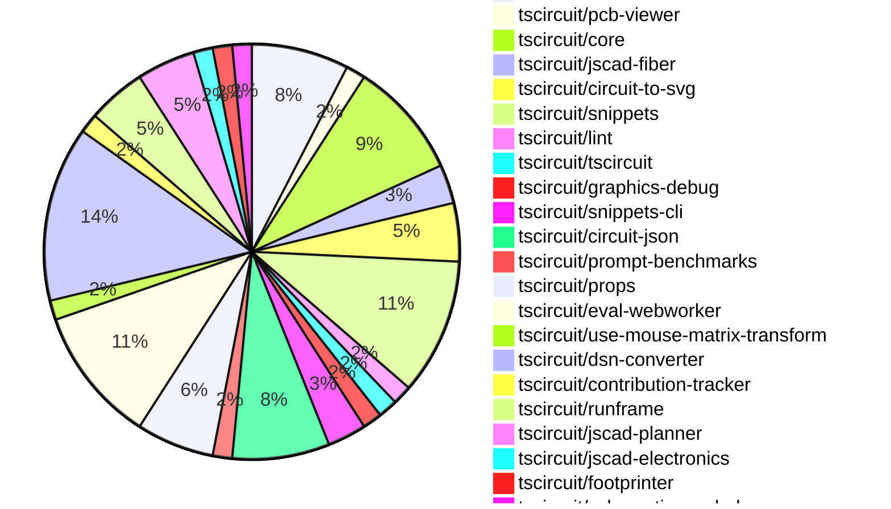

# Contribution Overview 2024-12-11

## PRs by Repository

## Contributor Overview

| Contributor | 🐳 Major | 🐙 Minor | 🐌 Tiny | ⭐ | Issues Created |
|-------------|---------|---------|---------|-----|----------------|
| [seveibar](#seveibar) | 7 | 23 | 2 | 👑👑 | 73 |
| [ShiboSoftwareDev](#ShiboSoftwareDev) | 2 | 2 | 0 | ⭐⭐⭐ | 7 |
| [imrishabh18](#imrishabh18) | 2 | 5 | 0 | ⭐⭐ | 14 |
| [Abse2001](#Abse2001) | 1 | 6 | 0 | ⭐⭐ | 5 |
| [AnasSarkiz](#AnasSarkiz) | 4 | 1 | 0 | ⭐⭐ | 2 |
| [devin-ai-integration[bot]](#devin-ai-integration[bot]) | 0 | 6 | 1 | ⭐⭐ | 0 |
| [samyakshah3008](#samyakshah3008) | 0 | 1 | 0 |  | 0 |
| [techmannih](#techmannih) | 0 | 1 | 0 |  | 0 |
| [ni9999](#ni9999) | 0 | 1 | 0 |  | 0 |
| [Anshgrover23](#Anshgrover23) | 0 | 1 | 0 |  | 0 |

## Review Table

[reviews-received-hover]: ## "Number of reviews received for PRs for this contributor"
[approvals-received-hover]: ## "Number of approvals received for PRs this contributor authored"
[rejections-received-hover]: ## "Number of rejections received for PRs this contributor authored"
[prs-opened-hover]: ## "Number of PRs opened by this contributor"
[issues-created-hover]: ## "Number of issues created by this contributor"
[bountied-issues-hover]: ## "Number of issues this contributor created with a bounty"
[bountied-issue-$-hover]: ## "Total bounty amount placed on issues authored by this contributor"

| Contributor | Reviews Received | Approvals Received | Rejections Received | PRs Opened | PRs Merged | Issues Created | Bountied Issues | Bountied Issue $ |
|---|---|---|---|---|---|---|---|---|
| [Abse2001](#Abse2001) | 15 | 7 | 1 | 7 | 7 | 5 | 3 | 40 |
| [Bhavyajain21](#Bhavyajain21) | 0 | 0 | 0 | 1 | 0 | 0 | 0 | 0 |
| [samyakshah3008](#samyakshah3008) | 6 | 1 | 1 | 1 | 1 | 0 | 0 | 0 |
| [ShiboSoftwareDev](#ShiboSoftwareDev) | 6 | 4 | 0 | 6 | 4 | 7 | 3 | 115 |
| [devin-ai-integration[bot]](#devin-ai-integration[bot]) | 14 | 6 | 8 | 17 | 7 | 0 | 0 | 0 |
| [imrishabh18](#imrishabh18) | 4 | 1 | 0 | 13 | 7 | 14 | 5 | 40 |
| [seveibar](#seveibar) | 5 | 2 | 0 | 32 | 32 | 73 | 30 | 632 |
| [techmannih](#techmannih) | 11 | 3 | 3 | 4 | 1 | 0 | 0 | 0 |
| [RohittCodes](#RohittCodes) | 2 | 0 | 0 | 2 | 0 | 4 | 3 | 25 |
| [AnasSarkiz](#AnasSarkiz) | 13 | 4 | 1 | 5 | 5 | 2 | 0 | 0 |
| [ni9999](#ni9999) | 5 | 1 | 2 | 1 | 1 | 0 | 0 | 0 |
| [DrSensor](#DrSensor) | 0 | 0 | 0 | 1 | 0 | 0 | 0 | 0 |
| [Anshgrover23](#Anshgrover23) | 3 | 1 | 1 | 2 | 1 | 0 | 0 | 0 |

## Changes by Repository

### [tscircuit/3d-viewer](https://github.com/tscircuit/3d-viewer)

| PR # | Impact | Contributor | Description |
|------|--------|-------------|-------------|
| [#67](https://github.com/tscircuit/3d-viewer/pull/67) | 🐳 Major | Abse2001 | Add support for creating 3D silkscreen text on the PCB. |
| [#64](https://github.com/tscircuit/3d-viewer/pull/64) | 🐳 Major | seveibar | Adds error boundaries for components and fixes a bug in the `jscad-fiber` library. |
| [#69](https://github.com/tscircuit/3d-viewer/pull/69) | 🐙 Minor | seveibar | Adds support for Vercel building by removing the package lock and updating dependencies. |
| [#62](https://github.com/tscircuit/3d-viewer/pull/62) | 🐙 Minor | techmannih | Add a workflow to check code formatting and type-checking for the project. |
| [#68](https://github.com/tscircuit/3d-viewer/pull/68) | 🐌 Tiny | devin-ai-integration[bot] | Fix to prevent text selection in tooltips when clicking in the 3D viewer. |

### [tscircuit/pcb-viewer](https://github.com/tscircuit/pcb-viewer)

| PR # | Impact | Contributor | Description |
|------|--------|-------------|-------------|
| [#95](https://github.com/tscircuit/pcb-viewer/pull/95) | 🐙 Minor | Abse2001 | Fixes an issue with the rendering of the element overlay box when hovering over pads. |

### [tscircuit/core](https://github.com/tscircuit/core)

| PR # | Impact | Contributor | Description |
|------|--------|-------------|-------------|
| [#409](https://github.com/tscircuit/core/pull/409) | 🐳 Major | AnasSarkiz | Implemented the `pcbDisabled` option in the `Circuit.ts` file to disable all PCB elements. |
| [#397](https://github.com/tscircuit/core/pull/397) | 🐳 Major | AnasSarkiz | Adds automatic schematic net labeling for complex traces between passive components and chips. |
| [#422](https://github.com/tscircuit/core/pull/422) | 🐙 Minor | Abse2001 | Adds a new function `createDownwardNetLabelGroundSymbol` to create a downward-facing net label symbol for GND connections. |
| [#419](https://github.com/tscircuit/core/pull/419) | 🐙 Minor | seveibar | Throws a better error when a component has both manual placement and explicit coordinates (pcbX/pcbY). |
| [#415](https://github.com/tscircuit/core/pull/415) | 🐙 Minor | seveibar | Update the `circuit-json` library dependency to version 0.0.114 |
| [#414](https://github.com/tscircuit/core/pull/414) | 🐙 Minor | seveibar | Skips size report generation if package.json wasn't changed |

### [tscircuit/jscad-fiber](https://github.com/tscircuit/jscad-fiber)

| PR # | Impact | Contributor | Description |
|------|--------|-------------|-------------|
| [#99](https://github.com/tscircuit/jscad-fiber/pull/99) | 🐙 Minor | Abse2001 | Fixes the types for React 19 in the `intrinsic-jsx.d.ts` file. |
| [#97](https://github.com/tscircuit/jscad-fiber/pull/97) | 🐙 Minor | seveibar | Add the `JsCadFixture` component and the `singleElementUnnest` utility function. |

### [tscircuit/circuit-to-svg](https://github.com/tscircuit/circuit-to-svg)

| PR # | Impact | Contributor | Description |
|------|--------|-------------|-------------|
| [#148](https://github.com/tscircuit/circuit-to-svg/pull/148) | 🐳 Major | AnasSarkiz | Introduces a new function `convertCircuitJsonToAssemblySvg` to convert a circuit JSON representation to an SVG assembly diagram. |
| [#147](https://github.com/tscircuit/circuit-to-svg/pull/147) | 🐳 Major | AnasSarkiz | Introduces a new `schematic_voltage_probe` function to create SVG objects for voltage probes in the schematic. |
| [#149](https://github.com/tscircuit/circuit-to-svg/pull/149) | 🐙 Minor | Abse2001 | Add support for the GND symbol in the `schematic_net_label` component. |

### [tscircuit/snippets](https://github.com/tscircuit/snippets)

| PR # | Impact | Contributor | Description |
|------|--------|-------------|-------------|
| [#387](https://github.com/tscircuit/snippets/pull/387) | 🐙 Minor | Abse2001 | Updated the 3d-viewer dependency to version 0.0.58 for silkscreen text support |
| [#389](https://github.com/tscircuit/snippets/pull/389) | 🐙 Minor | devin-ai-integration[bot] | Add Stalebot configuration to automatically manage stale issues and pull requests. |
| [#393](https://github.com/tscircuit/snippets/pull/393) | 🐙 Minor | imrishabh18 | Update the version of `@tscircuit/pcb-viewer` dependency from `1.10.16` to `1.10.22`. |
| [#385](https://github.com/tscircuit/snippets/pull/385) | 🐙 Minor | seveibar | Update 3D viewer and jscad-electronics dependencies |
| [#363](https://github.com/tscircuit/snippets/pull/363) | 🐙 Minor | seveibar | Improved Playwright test runtime and fixed manual edits test |
| [#365](https://github.com/tscircuit/snippets/pull/365) | 🐙 Minor | Anshgrover23 | Split the `footprint-dialog.spec.ts` file into multiple files for better organization and readability. |
| [#390](https://github.com/tscircuit/snippets/pull/390) | 🐌 Tiny | seveibar | Deletes the `error-fallback.spec.ts` file from the `playwright-tests` directory. |

### [tscircuit/lint](https://github.com/tscircuit/lint)

| PR # | Impact | Contributor | Description |
|------|--------|-------------|-------------|
| [#1](https://github.com/tscircuit/lint/pull/1) | 🐙 Minor | Abse2001 | Adds a new ESLint plugin for TSCircuit projects with two rules: banned-words and two-params. |

### [tscircuit/tscircuit](https://github.com/tscircuit/tscircuit)

| PR # | Impact | Contributor | Description |
|------|--------|-------------|-------------|
| [#484](https://github.com/tscircuit/tscircuit/pull/484) | 🐙 Minor | samyakshah3008 | The pull request enhances the README file by introducing new sections, improving the existing content, and adding a CONTRIBUTING guide. |

### [tscircuit/graphics-debug](https://github.com/tscircuit/graphics-debug)

| PR # | Impact | Contributor | Description |
|------|--------|-------------|-------------|
| [#11](https://github.com/tscircuit/graphics-debug/pull/11) | 🐳 Major | ShiboSoftwareDev | Adds a tooltip on hover and fixes a highlighting issue in the GraphicsDisplay component. |

### [tscircuit/snippets-cli](https://github.com/tscircuit/snippets-cli)

| PR # | Impact | Contributor | Description |
|------|--------|-------------|-------------|
| [#8](https://github.com/tscircuit/snippets-cli/pull/8) | 🐳 Major | ShiboSoftwareDev | Automatically install imported snippet types from the TsCircuit registry API. |
| [#6](https://github.com/tscircuit/snippets-cli/pull/6) | 🐙 Minor | seveibar | Fix package.json for publishing, add build step, workflows, and format |

### [tscircuit/circuit-json](https://github.com/tscircuit/circuit-json)

| PR # | Impact | Contributor | Description |
|------|--------|-------------|-------------|
| [#94](https://github.com/tscircuit/circuit-json/pull/94) | 🐳 Major | imrishabh18 | Introduces a new PCB group feature, which allows grouping components on the PCB. |
| [#97](https://github.com/tscircuit/circuit-json/pull/97) | 🐙 Minor | ShiboSoftwareDev | Fix to documentation generation script to address issues with searching for interfaces, generating source docs on Windows, and updating the table of contents. |
| [#96](https://github.com/tscircuit/circuit-json/pull/96) | 🐙 Minor | devin-ai-integration[bot] | Add CircuitJson type export representing array of circuit elements |
| [#88](https://github.com/tscircuit/circuit-json/pull/88) | 🐙 Minor | devin-ai-integration[bot] | Adds a new error type for conflicts between manual edits and explicit PCB coordinates |
| [#89](https://github.com/tscircuit/circuit-json/pull/89) | 🐙 Minor | seveibar | Adds a section to the README.md file that explains the base units used in the project and introduces the concept of element prefixes. |

### [tscircuit/prompt-benchmarks](https://github.com/tscircuit/prompt-benchmarks)

| PR # | Impact | Contributor | Description |
|------|--------|-------------|-------------|
| [#11](https://github.com/tscircuit/prompt-benchmarks/pull/11) | 🐙 Minor | ShiboSoftwareDev | Adds new custom columns to the benchmark.eval.ts file and updates the evalite dependency to version 0.7.0. |

### [tscircuit/props](https://github.com/tscircuit/props)

| PR # | Impact | Contributor | Description |
|------|--------|-------------|-------------|
| [#117](https://github.com/tscircuit/props/pull/117) | 🐳 Major | seveibar | Adds manual schematic placements and schematic placement events. |
| [#113](https://github.com/tscircuit/props/pull/113) | 🐙 Minor | devin-ai-integration[bot] | Adds a new `pinVariant` prop to the `crystal` component to support 2-pin and 4-pin variants. |
| [#118](https://github.com/tscircuit/props/pull/118) | 🐙 Minor | seveibar | Add exports for manual edit events |
| [#116](https://github.com/tscircuit/props/pull/116) | 🐙 Minor | seveibar | Moves the definitions of manual edits, including component location edits and trace hint edits, into separate props files. |

### [tscircuit/eval-webworker](https://github.com/tscircuit/eval-webworker)

| PR # | Impact | Contributor | Description |
|------|--------|-------------|-------------|
| [#26](https://github.com/tscircuit/eval-webworker/pull/26) | 🐙 Minor | devin-ai-integration[bot] | Add type declarations for blob-url module |
| [#28](https://github.com/tscircuit/eval-webworker/pull/28) | 🐙 Minor | seveibar | Separates the build process for the library and the webworker into different scripts. |
| [#27](https://github.com/tscircuit/eval-webworker/pull/27) | 🐙 Minor | seveibar | Adds verbose mode logging to the circuit web worker. |
| [#24](https://github.com/tscircuit/eval-webworker/pull/24) | 🐙 Minor | seveibar | Builds blob URLs for packaging web workers and updates the build script accordingly. |
| [#20](https://github.com/tscircuit/eval-webworker/pull/20) | 🐙 Minor | seveibar | Adds usage of `fsMap` to execute code using a virtual filesystem, which is useful when there are multiple files or components. |
| [#13](https://github.com/tscircuit/eval-webworker/pull/13) | 🐙 Minor | seveibar | The pull request adds the `executeWithFsMap` function to the `CircuitWebWorker` interface, which allows executing code with a virtual file system. It also adds a new test that demonstrates the usage of this function. |
| [#25](https://github.com/tscircuit/eval-webworker/pull/25) | 🐌 Tiny | seveibar | Add `{ type: "module" }` to worker import |

### [tscircuit/use-mouse-matrix-transform](https://github.com/tscircuit/use-mouse-matrix-transform)

| PR # | Impact | Contributor | Description |
|------|--------|-------------|-------------|
| [#1](https://github.com/tscircuit/use-mouse-matrix-transform/pull/1) | 🐙 Minor | devin-ai-integration[bot] | Add an `enabled` prop to control matrix transformations in the `useMouseMatrixTransform` hook |

### [tscircuit/dsn-converter](https://github.com/tscircuit/dsn-converter)

| PR # | Impact | Contributor | Description |
|------|--------|-------------|-------------|
| [#58](https://github.com/tscircuit/dsn-converter/pull/58) | 🐳 Major | imrishabh18 | Fixes an issue with the parsing of pin numbers in the DSN-to-DSN-JSON conversion process. |
| [#69](https://github.com/tscircuit/dsn-converter/pull/69) | 🐳 Major | seveibar | The pull request fixes a merge issue in the dsn-session conversion by ensuring that the Circuit JSON can be converted back and forth to DsnPcb and DsnSession without changes. |
| [#68](https://github.com/tscircuit/dsn-converter/pull/68) | 🐳 Major | seveibar | Remove Y Axis Flip in DSN PCB Conversion, Merge Dsn Session into Dsn PCB, Minor Refactoring, Lots of Debug statements, Include vias in DSN stringification, Improve Circuit Json to DSN PCB conversion for traces/vias |
| [#63](https://github.com/tscircuit/dsn-converter/pull/63) | 🐙 Minor | imrishabh18 | Fixes the trace width used in freerouting to be smaller than the component width, allowing freerouting to route to the SMT pads. |
| [#62](https://github.com/tscircuit/dsn-converter/pull/62) | 🐙 Minor | imrishabh18 | The changes fix the issue with hover traces by updating the `convertWiringPathToPcbTraces` function to maintain proper linkage between the source traces and the new traces. |
| [#60](https://github.com/tscircuit/dsn-converter/pull/60) | 🐙 Minor | imrishabh18 | Fixes a bug where the pin number for plated holes was not being derived from the source_port as expected. |
| [#59](https://github.com/tscircuit/dsn-converter/pull/59) | 🐙 Minor | imrishabh18 | Set default width and height for group subcircuit to 100mm |
| [#67](https://github.com/tscircuit/dsn-converter/pull/67) | 🐙 Minor | seveibar | Add assertion for smtpad layers check, fix smtpads all being on top layer |
| [#66](https://github.com/tscircuit/dsn-converter/pull/66) | 🐙 Minor | seveibar | Add debug utils and a test that shows issues with converting to DSN PCB |

### [tscircuit/contribution-tracker](https://github.com/tscircuit/contribution-tracker)

| PR # | Impact | Contributor | Description |
|------|--------|-------------|-------------|
| [#22](https://github.com/tscircuit/contribution-tracker/pull/22) | 🐳 Major | seveibar | Refactor types, add support for json generation, fix claude caching, fix column titles |

### [tscircuit/runframe](https://github.com/tscircuit/runframe)

| PR # | Impact | Contributor | Description |
|------|--------|-------------|-------------|
| [#9](https://github.com/tscircuit/runframe/pull/9) | 🐳 Major | seveibar | Adds a new component `RunFrameWithApi` that integrates the `RunFrame` component with a remote API for managing files and events. |
| [#3](https://github.com/tscircuit/runframe/pull/3) | 🐳 Major | seveibar | Adds GitHub Actions workflows for format checking, type checking, and publishing the package to npm |
| [#14](https://github.com/tscircuit/runframe/pull/14) | 🐙 Minor | seveibar | Fixes build issues and improves entrypoint guessing logic. |

### [tscircuit/jscad-planner](https://github.com/tscircuit/jscad-planner)

| PR # | Impact | Contributor | Description |
|------|--------|-------------|-------------|
| [#7](https://github.com/tscircuit/jscad-planner/pull/7) | 🐙 Minor | seveibar | Adds support for automatically handling single-element arrays as JscadOperation inputs. |
| [#6](https://github.com/tscircuit/jscad-planner/pull/6) | 🐙 Minor | seveibar | Throw a specific error if an array is passed in for the `executeJscadOperations` function. |
| [#5](https://github.com/tscircuit/jscad-planner/pull/5) | 🐙 Minor | seveibar | Improve error message when operation object has an undefined type. |

### [tscircuit/jscad-electronics](https://github.com/tscircuit/jscad-electronics)

| PR # | Impact | Contributor | Description |
|------|--------|-------------|-------------|
| [#82](https://github.com/tscircuit/jscad-electronics/pull/82) | 🐙 Minor | seveibar | Update the JsCadFixture component to JsCadView in the codebase. |

### [tscircuit/footprinter](https://github.com/tscircuit/footprinter)

| PR # | Impact | Contributor | Description |
|------|--------|-------------|-------------|
| [#96](https://github.com/tscircuit/footprinter/pull/96) | 🐙 Minor | AnasSarkiz | The pull request adds support for optional height parameters to the `stampboard` and `stampreceiver` functions, allowing users to specify the height of the circuit elements. |

### [tscircuit/schematic-symbols](https://github.com/tscircuit/schematic-symbols)

| PR # | Impact | Contributor | Description |
|------|--------|-------------|-------------|
| [#210](https://github.com/tscircuit/schematic-symbols/pull/210) | 🐙 Minor | ni9999 | Add a 4-pin crystal symbol |

## Changes by Contributor

### [Abse2001](https://github.com/Abse2001)

| PR # | Impact | Description |
|------|--------|-------------|
| [#67](https://github.com/tscircuit/3d-viewer/pull/67) | 🐳 Major | Add support for creating 3D silkscreen text on the PCB. |
| [#95](https://github.com/tscircuit/pcb-viewer/pull/95) | 🐙 Minor | Fixes an issue with the rendering of the element overlay box when hovering over pads. |
| [#422](https://github.com/tscircuit/core/pull/422) | 🐙 Minor | Adds a new function `createDownwardNetLabelGroundSymbol` to create a downward-facing net label symbol for GND connections. |
| [#99](https://github.com/tscircuit/jscad-fiber/pull/99) | 🐙 Minor | Fixes the types for React 19 in the `intrinsic-jsx.d.ts` file. |
| [#149](https://github.com/tscircuit/circuit-to-svg/pull/149) | 🐙 Minor | Add support for the GND symbol in the `schematic_net_label` component. |
| [#387](https://github.com/tscircuit/snippets/pull/387) | 🐙 Minor | Updated the 3d-viewer dependency to version 0.0.58 for silkscreen text support |
| [#1](https://github.com/tscircuit/lint/pull/1) | 🐙 Minor | Adds a new ESLint plugin for TSCircuit projects with two rules: banned-words and two-params. |

### [samyakshah3008](https://github.com/samyakshah3008)

| PR # | Impact | Description |
|------|--------|-------------|
| [#484](https://github.com/tscircuit/tscircuit/pull/484) | 🐙 Minor | The pull request enhances the README file by introducing new sections, improving the existing content, and adding a CONTRIBUTING guide. |

### [ShiboSoftwareDev](https://github.com/ShiboSoftwareDev)

| PR # | Impact | Description |
|------|--------|-------------|
| [#11](https://github.com/tscircuit/graphics-debug/pull/11) | 🐳 Major | Adds a tooltip on hover and fixes a highlighting issue in the GraphicsDisplay component. |
| [#8](https://github.com/tscircuit/snippets-cli/pull/8) | 🐳 Major | Automatically install imported snippet types from the TsCircuit registry API. |
| [#97](https://github.com/tscircuit/circuit-json/pull/97) | 🐙 Minor | Fix to documentation generation script to address issues with searching for interfaces, generating source docs on Windows, and updating the table of contents. |
| [#11](https://github.com/tscircuit/prompt-benchmarks/pull/11) | 🐙 Minor | Adds new custom columns to the benchmark.eval.ts file and updates the evalite dependency to version 0.7.0. |

### [devin-ai-integration[bot]](https://github.com/devin-ai-integration[bot])

| PR # | Impact | Description |
|------|--------|-------------|
| [#96](https://github.com/tscircuit/circuit-json/pull/96) | 🐙 Minor | Add CircuitJson type export representing array of circuit elements |
| [#88](https://github.com/tscircuit/circuit-json/pull/88) | 🐙 Minor | Adds a new error type for conflicts between manual edits and explicit PCB coordinates |
| [#113](https://github.com/tscircuit/props/pull/113) | 🐙 Minor | Adds a new `pinVariant` prop to the `crystal` component to support 2-pin and 4-pin variants. |
| [#389](https://github.com/tscircuit/snippets/pull/389) | 🐙 Minor | Add Stalebot configuration to automatically manage stale issues and pull requests. |
| [#26](https://github.com/tscircuit/eval-webworker/pull/26) | 🐙 Minor | Add type declarations for blob-url module |
| [#1](https://github.com/tscircuit/use-mouse-matrix-transform/pull/1) | 🐙 Minor | Add an `enabled` prop to control matrix transformations in the `useMouseMatrixTransform` hook |
| [#68](https://github.com/tscircuit/3d-viewer/pull/68) | 🐌 Tiny | Fix to prevent text selection in tooltips when clicking in the 3D viewer. |

### [imrishabh18](https://github.com/imrishabh18)

| PR # | Impact | Description |
|------|--------|-------------|
| [#94](https://github.com/tscircuit/circuit-json/pull/94) | 🐳 Major | Introduces a new PCB group feature, which allows grouping components on the PCB. |
| [#58](https://github.com/tscircuit/dsn-converter/pull/58) | 🐳 Major | Fixes an issue with the parsing of pin numbers in the DSN-to-DSN-JSON conversion process. |
| [#63](https://github.com/tscircuit/dsn-converter/pull/63) | 🐙 Minor | Fixes the trace width used in freerouting to be smaller than the component width, allowing freerouting to route to the SMT pads. |
| [#62](https://github.com/tscircuit/dsn-converter/pull/62) | 🐙 Minor | The changes fix the issue with hover traces by updating the `convertWiringPathToPcbTraces` function to maintain proper linkage between the source traces and the new traces. |
| [#60](https://github.com/tscircuit/dsn-converter/pull/60) | 🐙 Minor | Fixes a bug where the pin number for plated holes was not being derived from the source_port as expected. |
| [#59](https://github.com/tscircuit/dsn-converter/pull/59) | 🐙 Minor | Set default width and height for group subcircuit to 100mm |
| [#393](https://github.com/tscircuit/snippets/pull/393) | 🐙 Minor | Update the version of `@tscircuit/pcb-viewer` dependency from `1.10.16` to `1.10.22`. |

### [seveibar](https://github.com/seveibar)

| PR # | Impact | Description |
|------|--------|-------------|
| [#117](https://github.com/tscircuit/props/pull/117) | 🐳 Major | Adds manual schematic placements and schematic placement events. |
| [#64](https://github.com/tscircuit/3d-viewer/pull/64) | 🐳 Major | Adds error boundaries for components and fixes a bug in the `jscad-fiber` library. |
| [#22](https://github.com/tscircuit/contribution-tracker/pull/22) | 🐳 Major | Refactor types, add support for json generation, fix claude caching, fix column titles |
| [#69](https://github.com/tscircuit/dsn-converter/pull/69) | 🐳 Major | The pull request fixes a merge issue in the dsn-session conversion by ensuring that the Circuit JSON can be converted back and forth to DsnPcb and DsnSession without changes. |
| [#68](https://github.com/tscircuit/dsn-converter/pull/68) | 🐳 Major | Remove Y Axis Flip in DSN PCB Conversion, Merge Dsn Session into Dsn PCB, Minor Refactoring, Lots of Debug statements, Include vias in DSN stringification, Improve Circuit Json to DSN PCB conversion for traces/vias |
| [#9](https://github.com/tscircuit/runframe/pull/9) | 🐳 Major | Adds a new component `RunFrameWithApi` that integrates the `RunFrame` component with a remote API for managing files and events. |
| [#3](https://github.com/tscircuit/runframe/pull/3) | 🐳 Major | Adds GitHub Actions workflows for format checking, type checking, and publishing the package to npm |
| [#89](https://github.com/tscircuit/circuit-json/pull/89) | 🐙 Minor | Adds a section to the README.md file that explains the base units used in the project and introduces the concept of element prefixes. |
| [#118](https://github.com/tscircuit/props/pull/118) | 🐙 Minor | Add exports for manual edit events |
| [#116](https://github.com/tscircuit/props/pull/116) | 🐙 Minor | Moves the definitions of manual edits, including component location edits and trace hint edits, into separate props files. |
| [#69](https://github.com/tscircuit/3d-viewer/pull/69) | 🐙 Minor | Adds support for Vercel building by removing the package lock and updating dependencies. |
| [#7](https://github.com/tscircuit/jscad-planner/pull/7) | 🐙 Minor | Adds support for automatically handling single-element arrays as JscadOperation inputs. |
| [#6](https://github.com/tscircuit/jscad-planner/pull/6) | 🐙 Minor | Throw a specific error if an array is passed in for the `executeJscadOperations` function. |
| [#5](https://github.com/tscircuit/jscad-planner/pull/5) | 🐙 Minor | Improve error message when operation object has an undefined type. |
| [#419](https://github.com/tscircuit/core/pull/419) | 🐙 Minor | Throws a better error when a component has both manual placement and explicit coordinates (pcbX/pcbY). |
| [#415](https://github.com/tscircuit/core/pull/415) | 🐙 Minor | Update the `circuit-json` library dependency to version 0.0.114 |
| [#414](https://github.com/tscircuit/core/pull/414) | 🐙 Minor | Skips size report generation if package.json wasn't changed |
| [#82](https://github.com/tscircuit/jscad-electronics/pull/82) | 🐙 Minor | Update the JsCadFixture component to JsCadView in the codebase. |
| [#97](https://github.com/tscircuit/jscad-fiber/pull/97) | 🐙 Minor | Add the `JsCadFixture` component and the `singleElementUnnest` utility function. |
| [#67](https://github.com/tscircuit/dsn-converter/pull/67) | 🐙 Minor | Add assertion for smtpad layers check, fix smtpads all being on top layer |
| [#66](https://github.com/tscircuit/dsn-converter/pull/66) | 🐙 Minor | Add debug utils and a test that shows issues with converting to DSN PCB |
| [#385](https://github.com/tscircuit/snippets/pull/385) | 🐙 Minor | Update 3D viewer and jscad-electronics dependencies |
| [#363](https://github.com/tscircuit/snippets/pull/363) | 🐙 Minor | Improved Playwright test runtime and fixed manual edits test |
| [#28](https://github.com/tscircuit/eval-webworker/pull/28) | 🐙 Minor | Separates the build process for the library and the webworker into different scripts. |
| [#27](https://github.com/tscircuit/eval-webworker/pull/27) | 🐙 Minor | Adds verbose mode logging to the circuit web worker. |
| [#24](https://github.com/tscircuit/eval-webworker/pull/24) | 🐙 Minor | Builds blob URLs for packaging web workers and updates the build script accordingly. |
| [#20](https://github.com/tscircuit/eval-webworker/pull/20) | 🐙 Minor | Adds usage of `fsMap` to execute code using a virtual filesystem, which is useful when there are multiple files or components. |
| [#13](https://github.com/tscircuit/eval-webworker/pull/13) | 🐙 Minor | The pull request adds the `executeWithFsMap` function to the `CircuitWebWorker` interface, which allows executing code with a virtual file system. It also adds a new test that demonstrates the usage of this function. |
| [#14](https://github.com/tscircuit/runframe/pull/14) | 🐙 Minor | Fixes build issues and improves entrypoint guessing logic. |
| [#6](https://github.com/tscircuit/snippets-cli/pull/6) | 🐙 Minor | Fix package.json for publishing, add build step, workflows, and format |
| [#390](https://github.com/tscircuit/snippets/pull/390) | 🐌 Tiny | Deletes the `error-fallback.spec.ts` file from the `playwright-tests` directory. |
| [#25](https://github.com/tscircuit/eval-webworker/pull/25) | 🐌 Tiny | Add `{ type: "module" }` to worker import |

### [AnasSarkiz](https://github.com/AnasSarkiz)

| PR # | Impact | Description |
|------|--------|-------------|
| [#409](https://github.com/tscircuit/core/pull/409) | 🐳 Major | Implemented the `pcbDisabled` option in the `Circuit.ts` file to disable all PCB elements. |
| [#397](https://github.com/tscircuit/core/pull/397) | 🐳 Major | Adds automatic schematic net labeling for complex traces between passive components and chips. |
| [#148](https://github.com/tscircuit/circuit-to-svg/pull/148) | 🐳 Major | Introduces a new function `convertCircuitJsonToAssemblySvg` to convert a circuit JSON representation to an SVG assembly diagram. |
| [#147](https://github.com/tscircuit/circuit-to-svg/pull/147) | 🐳 Major | Introduces a new `schematic_voltage_probe` function to create SVG objects for voltage probes in the schematic. |
| [#96](https://github.com/tscircuit/footprinter/pull/96) | 🐙 Minor | The pull request adds support for optional height parameters to the `stampboard` and `stampreceiver` functions, allowing users to specify the height of the circuit elements. |

### [techmannih](https://github.com/techmannih)

| PR # | Impact | Description |
|------|--------|-------------|
| [#62](https://github.com/tscircuit/3d-viewer/pull/62) | 🐙 Minor | Add a workflow to check code formatting and type-checking for the project. |

### [ni9999](https://github.com/ni9999)

| PR # | Impact | Description |
|------|--------|-------------|
| [#210](https://github.com/tscircuit/schematic-symbols/pull/210) | 🐙 Minor | Add a 4-pin crystal symbol |

### [Anshgrover23](https://github.com/Anshgrover23)

| PR # | Impact | Description |
|------|--------|-------------|
| [#365](https://github.com/tscircuit/snippets/pull/365) | 🐙 Minor | Split the `footprint-dialog.spec.ts` file into multiple files for better organization and readability. |

