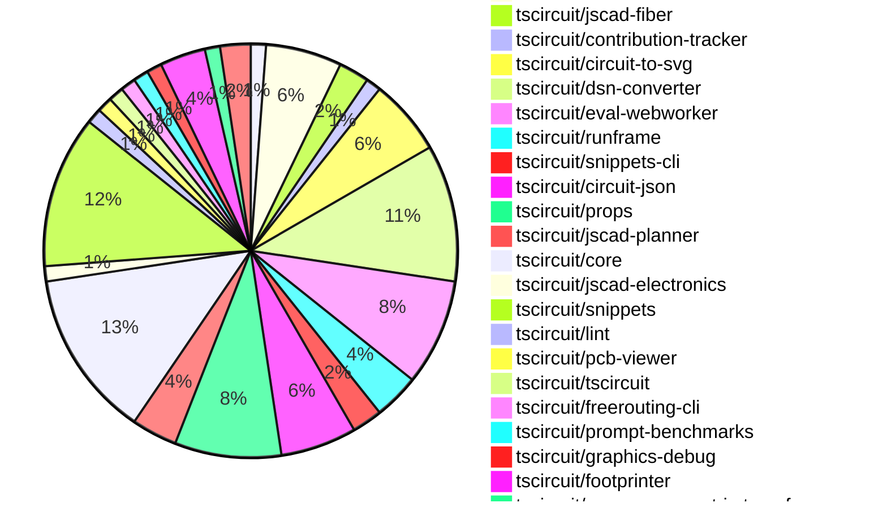

# Contribution Overview 2024-12-11

## PRs by Repository

## Contributor Overview

| Contributor | 🐳 Major | 🐙 Minor | 🐌 Tiny | ⭐ | Issues Created |
|-------------|---------|---------|---------|-----|----------------|
| [seveibar](#seveibar) | 10 | 26 | 1 | 👑👑👑 | 90 |
| [ShiboSoftwareDev](#ShiboSoftwareDev) | 2 | 3 | 0 | ⭐⭐⭐ | 7 |
| [imrishabh18](#imrishabh18) | 2 | 7 | 0 | ⭐⭐⭐ | 15 |
| [Abse2001](#Abse2001) | 2 | 5 | 0 | ⭐⭐ | 5 |
| [AnasSarkiz](#AnasSarkiz) | 5 | 1 | 0 | ⭐⭐ | 2 |
| [devin-ai-integration[bot]](#devin-ai-integration[bot]) | 0 | 9 | 1 | ⭐⭐ | 0 |
| [techmannih](#techmannih) | 1 | 5 | 0 | ⭐⭐ | 0 |
| [RohittCodes](#RohittCodes) | 0 | 1 | 0 | ⭐ | 4 |
| [samyakshah3008](#samyakshah3008) | 0 | 1 | 0 |  | 0 |
| [ni9999](#ni9999) | 0 | 1 | 0 |  | 0 |
| [Anshgrover23](#Anshgrover23) | 0 | 1 | 0 |  | 0 |

## Review Table

[reviews-received-hover]: ## "Number of reviews received for PRs for this contributor"
[approvals-received-hover]: ## "Number of approvals received for PRs this contributor authored"
[rejections-received-hover]: ## "Number of rejections received for PRs this contributor authored"
[prs-opened-hover]: ## "Number of PRs opened by this contributor"
[issues-created-hover]: ## "Number of issues created by this contributor"
[bountied-issues-hover]: ## "Number of issues this contributor created with a bounty"
[bountied-issue-$-hover]: ## "Total bounty amount placed on issues authored by this contributor"

| Contributor | Reviews Received | Approvals Received | Rejections Received | PRs Opened | PRs Merged | Issues Created | Bountied Issues | Bountied Issue $ |
|---|---|---|---|---|---|---|---|---|
| [seveibar](#seveibar) | 5 | 2 | 0 | 37 | 37 | 90 | 36 | 731 |
| [Bhavyajain21](#Bhavyajain21) | 1 | 0 | 1 | 1 | 0 | 0 | 0 | 0 |
| [Abse2001](#Abse2001) | 15 | 7 | 1 | 7 | 7 | 5 | 3 | 40 |
| [samyakshah3008](#samyakshah3008) | 6 | 1 | 1 | 1 | 1 | 0 | 0 | 0 |
| [RohittCodes](#RohittCodes) | 4 | 2 | 0 | 3 | 1 | 4 | 3 | 25 |
| [ShiboSoftwareDev](#ShiboSoftwareDev) | 7 | 5 | 0 | 7 | 5 | 7 | 3 | 115 |
| [devin-ai-integration[bot]](#devin-ai-integration[bot]) | 18 | 8 | 9 | 23 | 10 | 0 | 0 | 0 |
| [imrishabh18](#imrishabh18) | 7 | 2 | 0 | 15 | 9 | 15 | 6 | 55 |
| [techmannih](#techmannih) | 20 | 8 | 6 | 7 | 6 | 0 | 0 | 0 |
| [AnasSarkiz](#AnasSarkiz) | 17 | 6 | 1 | 6 | 6 | 2 | 0 | 0 |
| [ni9999](#ni9999) | 5 | 1 | 2 | 1 | 1 | 0 | 0 | 0 |
| [Niharika0104](#Niharika0104) | 1 | 0 | 1 | 1 | 0 | 1 | 0 | 0 |
| [DrSensor](#DrSensor) | 0 | 0 | 0 | 1 | 0 | 0 | 0 | 0 |
| [Anshgrover23](#Anshgrover23) | 3 | 1 | 1 | 2 | 1 | 0 | 0 | 0 |

## Changes by Repository

### [tscircuit/schematic-viewer](https://github.com/tscircuit/schematic-viewer)

| PR # | Impact | Contributor | Description |
|------|--------|-------------|-------------|
| [#73](https://github.com/tscircuit/schematic-viewer/pull/73) | 🐳 Major | seveibar | Adds drag and drop editing functionality for the circuit board editor. |

### [tscircuit/3d-viewer](https://github.com/tscircuit/3d-viewer)

| PR # | Impact | Contributor | Description |
|------|--------|-------------|-------------|
| [#64](https://github.com/tscircuit/3d-viewer/pull/64) | 🐳 Major | seveibar | Introduces error boundaries for components and fixes an unnesting issue in the jscad-fiber package. |
| [#67](https://github.com/tscircuit/3d-viewer/pull/67) | 🐳 Major | Abse2001 | Adds support for rendering silkscreen text on the PCB |
| [#69](https://github.com/tscircuit/3d-viewer/pull/69) | 🐙 Minor | seveibar | Add support for Vercel building by removing package lock and updating dependencies. |
| [#62](https://github.com/tscircuit/3d-viewer/pull/62) | 🐙 Minor | techmannih | Add typechecking and formatting workflow to the project |
| [#68](https://github.com/tscircuit/3d-viewer/pull/68) | 🐌 Tiny | devin-ai-integration[bot] | Prevent accidental text selection in tooltips when clicking in the 3D viewer. |

### [tscircuit/jscad-fiber](https://github.com/tscircuit/jscad-fiber)

| PR # | Impact | Contributor | Description |
|------|--------|-------------|-------------|
| [#97](https://github.com/tscircuit/jscad-fiber/pull/97) | 🐳 Major | seveibar | Add a new test component `JsCadFixture` that renders 3D shapes using the `jscad` library and the `three.js` library. |
| [#99](https://github.com/tscircuit/jscad-fiber/pull/99) | 🐙 Minor | Abse2001 | Fixes the React type definitions to work with React 19 |

### [tscircuit/contribution-tracker](https://github.com/tscircuit/contribution-tracker)

| PR # | Impact | Contributor | Description |
|------|--------|-------------|-------------|
| [#22](https://github.com/tscircuit/contribution-tracker/pull/22) | 🐳 Major | seveibar | Refactor types, add support for json generation, fix claude caching, fix column titles |

### [tscircuit/circuit-to-svg](https://github.com/tscircuit/circuit-to-svg)

| PR # | Impact | Contributor | Description |
|------|--------|-------------|-------------|
| [#151](https://github.com/tscircuit/circuit-to-svg/pull/151) | 🐳 Major | seveibar | Adds support for computing the schematic transform and placing it on the SVG as a data attribute. |
| [#148](https://github.com/tscircuit/circuit-to-svg/pull/148) | 🐳 Major | AnasSarkiz | The pull request introduces a new function `convertCircuitJsonToAssemblySvg` that takes a circuit JSON object and generates an SVG representation of the circuit assembly. |
| [#147](https://github.com/tscircuit/circuit-to-svg/pull/147) | 🐳 Major | AnasSarkiz | Introduce a new function `createSvgObjectsFromSchVoltageProbe` to create SVG objects for a schematic voltage probe. |
| [#150](https://github.com/tscircuit/circuit-to-svg/pull/150) | 🐙 Minor | seveibar | Add `data-circuit-json-type` and `data-schematic-trace-id` properties to the SVG object representing a schematic trace. |
| [#149](https://github.com/tscircuit/circuit-to-svg/pull/149) | 🐙 Minor | Abse2001 | Add symbol_name property to GND symbol in the schematic net label |

### [tscircuit/dsn-converter](https://github.com/tscircuit/dsn-converter)

| PR # | Impact | Contributor | Description |
|------|--------|-------------|-------------|
| [#69](https://github.com/tscircuit/dsn-converter/pull/69) | 🐳 Major | seveibar | Fixes a bug in the conversion of Circuit JSON to DsnPcb and DsnSession, ensuring that the conversion can be successfully reversed without losing any information. |
| [#68](https://github.com/tscircuit/dsn-converter/pull/68) | 🐳 Major | seveibar | Remove Y Axis Flip in DSN PCB Conversion, Merge Dsn Session into Dsn PCB, Minor Refactoring, Lots of Debug statements, Include vias in DSN stringification, Improve Circuit Json to DSN PCB conversion for traces/vias |
| [#58](https://github.com/tscircuit/dsn-converter/pull/58) | 🐳 Major | imrishabh18 | Fix invalid pin format by handling various cases, including scientific notation, for the pin number and coordinates. |
| [#67](https://github.com/tscircuit/dsn-converter/pull/67) | 🐙 Minor | seveibar | Adds an assertion for checking the layer of SMT pads and fixes an issue where all SMT pads were being placed on the top layer. |
| [#66](https://github.com/tscircuit/dsn-converter/pull/66) | 🐙 Minor | seveibar | Add debug utilities, add a test that shows issues with converting to DSN PCB |
| [#63](https://github.com/tscircuit/dsn-converter/pull/63) | 🐙 Minor | imrishabh18 | Fix the trace width used in freerouting to be smaller than the component width. |
| [#62](https://github.com/tscircuit/dsn-converter/pull/62) | 🐙 Minor | imrishabh18 | The pull request fixes an issue with hover traces in the tscircuit project. |
| [#60](https://github.com/tscircuit/dsn-converter/pull/60) | 🐙 Minor | imrishabh18 | Fix the issue where the pin number for plated holes is derived from the source_port instead of the port_hints. |
| [#59](https://github.com/tscircuit/dsn-converter/pull/59) | 🐙 Minor | imrishabh18 | Adds a default width and height of 100mm for the `<group/>` subcircuit in the PCB conversion process. |

### [tscircuit/eval-webworker](https://github.com/tscircuit/eval-webworker)

| PR # | Impact | Contributor | Description |
|------|--------|-------------|-------------|
| [#13](https://github.com/tscircuit/eval-webworker/pull/13) | 🐳 Major | seveibar | The pull request adds the ability to execute code with a virtual filesystem map, allowing for the inclusion of local files (including JSON files) in the execution context. |
| [#28](https://github.com/tscircuit/eval-webworker/pull/28) | 🐙 Minor | seveibar | Splits the build script into separate steps for the library and the webworker, and adds a new script to build the webworker. |
| [#27](https://github.com/tscircuit/eval-webworker/pull/27) | 🐙 Minor | seveibar | Adds verbose mode logging to the circuit web worker |
| [#24](https://github.com/tscircuit/eval-webworker/pull/24) | 🐙 Minor | seveibar | Adds support for building blob URLs for web workers, allowing them to be loaded directly from the package without the need for a separate web server. |
| [#20](https://github.com/tscircuit/eval-webworker/pull/20) | 🐙 Minor | seveibar | Adds documentation for using a virtual filesystem with the `createCircuitWebWorker` API. |
| [#26](https://github.com/tscircuit/eval-webworker/pull/26) | 🐙 Minor | devin-ai-integration[bot] | Add type declarations for blob-url module |
| [#25](https://github.com/tscircuit/eval-webworker/pull/25) | 🐌 Tiny | seveibar | Add `{ type: "module" }` to the `Worker` constructor to specify that the worker script is a module. |

### [tscircuit/runframe](https://github.com/tscircuit/runframe)

| PR # | Impact | Contributor | Description |
|------|--------|-------------|-------------|
| [#9](https://github.com/tscircuit/runframe/pull/9) | 🐳 Major | seveibar | Adds a new component `RunFrameWithApi` that integrates the `RunFrame` component with a backend API for managing files and events. |
| [#14](https://github.com/tscircuit/runframe/pull/14) | 🐙 Minor | seveibar | Fixes build issues and implements a smarter entrypoint guessing algorithm |
| [#3](https://github.com/tscircuit/runframe/pull/3) | 🐙 Minor | seveibar | Add a CLI build script and a format check/format script to the project. |

### [tscircuit/snippets-cli](https://github.com/tscircuit/snippets-cli)

| PR # | Impact | Contributor | Description |
|------|--------|-------------|-------------|
| [#6](https://github.com/tscircuit/snippets-cli/pull/6) | 🐳 Major | seveibar | Fix Package Json for Publishing, Add Build Step, Workflows, Format |
| [#8](https://github.com/tscircuit/snippets-cli/pull/8) | 🐳 Major | ShiboSoftwareDev | Automatically install imported snippet types |

### [tscircuit/circuit-json](https://github.com/tscircuit/circuit-json)

| PR # | Impact | Contributor | Description |
|------|--------|-------------|-------------|
| [#94](https://github.com/tscircuit/circuit-json/pull/94) | 🐳 Major | imrishabh18 | Introduces a new `pcb_group` feature to define a group of components on the PCB. |
| [#89](https://github.com/tscircuit/circuit-json/pull/89) | 🐙 Minor | seveibar | Updates the README.md file to add information about base units and element prefixes in the Circuit JSON format. |
| [#97](https://github.com/tscircuit/circuit-json/pull/97) | 🐙 Minor | ShiboSoftwareDev | The script was searching for interfaces and not types, and the source docs were not generated on Windows due to a regex issue. Additionally, the TOC was not updating due to a missing closing comment tag. |
| [#96](https://github.com/tscircuit/circuit-json/pull/96) | 🐙 Minor | devin-ai-integration[bot] | Add CircuitJson type export representing array of circuit elements |
| [#88](https://github.com/tscircuit/circuit-json/pull/88) | 🐙 Minor | devin-ai-integration[bot] | Adds a new error type for conflicts between manual edits and explicit PCB coordinates. |

### [tscircuit/props](https://github.com/tscircuit/props)

| PR # | Impact | Contributor | Description |
|------|--------|-------------|-------------|
| [#121](https://github.com/tscircuit/props/pull/121) | 🐙 Minor | seveibar | Fix exports to include manual edit events and improve edit event type property for PCB trace hint. |
| [#118](https://github.com/tscircuit/props/pull/118) | 🐙 Minor | seveibar | Fixes the exports to include manual edit events for both PCB and schematic component locations. |
| [#117](https://github.com/tscircuit/props/pull/117) | 🐙 Minor | seveibar | Adds support for manual schematic placements and schematic placement events. |
| [#116](https://github.com/tscircuit/props/pull/116) | 🐙 Minor | seveibar | Move manual edits definitions into separate modules and export them |
| [#122](https://github.com/tscircuit/props/pull/122) | 🐙 Minor | devin-ai-integration[bot] | Add TypeScript interface definition for ManualEditsFile to match existing Zod schema |
| [#113](https://github.com/tscircuit/props/pull/113) | 🐙 Minor | devin-ai-integration[bot] | Adds a new `pinVariant` prop to the `crystal` component to support 2-pin and 4-pin variants. |
| [#119](https://github.com/tscircuit/props/pull/119) | 🐙 Minor | techmannih | Adds a new resonator component with props for frequency, load capacitance, and pin variant. |

### [tscircuit/jscad-planner](https://github.com/tscircuit/jscad-planner)

| PR # | Impact | Contributor | Description |
|------|--------|-------------|-------------|
| [#7](https://github.com/tscircuit/jscad-planner/pull/7) | 🐙 Minor | seveibar | Adds support for automatically casting single element arrays to the element itself in `executeJscadOperations`. |
| [#6](https://github.com/tscircuit/jscad-planner/pull/6) | 🐙 Minor | seveibar | Throws a specific error when an array is passed in for execution, instead of trying to execute the array. |
| [#5](https://github.com/tscircuit/jscad-planner/pull/5) | 🐙 Minor | seveibar | Improve error message when the operation has an undefined type. |

### [tscircuit/core](https://github.com/tscircuit/core)

| PR # | Impact | Contributor | Description |
|------|--------|-------------|-------------|
| [#428](https://github.com/tscircuit/core/pull/428) | 🐳 Major | techmannih | Adds a new SilkscreenLine component to the library. |
| [#409](https://github.com/tscircuit/core/pull/409) | 🐳 Major | AnasSarkiz | Implemented a new `pcbDisabled` option in the `Circuit.ts` file to disable all PCB elements. |
| [#397](https://github.com/tscircuit/core/pull/397) | 🐳 Major | AnasSarkiz | Adds automatic schematic net labeling for passive-chip for complex traces |
| [#436](https://github.com/tscircuit/core/pull/436) | 🐙 Minor | seveibar | Rename "eval_error" event to "external:evalError" |
| [#419](https://github.com/tscircuit/core/pull/419) | 🐙 Minor | seveibar | The pull request adds a new error type `PcbManualEditConflictError` and checks for conflicts between manual placement and explicit coordinates (pcbX/pcbY) in the `NormalComponent` class. |
| [#415](https://github.com/tscircuit/core/pull/415) | 🐙 Minor | seveibar | Update the `circuit-json` dependency version from `0.0.108` to `0.0.114`. |
| [#414](https://github.com/tscircuit/core/pull/414) | 🐙 Minor | seveibar | Avoid generating bundle size reports if the `package.json` file was not changed. |
| [#422](https://github.com/tscircuit/core/pull/422) | 🐙 Minor | Abse2001 | Adds a schematic net label ground symbol for GND symbols. |
| [#437](https://github.com/tscircuit/core/pull/437) | 🐙 Minor | imrishabh18 | Updates the lockfile to fix the publish process. |
| [#430](https://github.com/tscircuit/core/pull/430) | 🐙 Minor | imrishabh18 | Add a new event type for "eval_error" in the Circuit class. |
| [#424](https://github.com/tscircuit/core/pull/424) | 🐙 Minor | techmannih | Set up continuous branch release with pkg-pr-new |

### [tscircuit/jscad-electronics](https://github.com/tscircuit/jscad-electronics)

| PR # | Impact | Contributor | Description |
|------|--------|-------------|-------------|
| [#82](https://github.com/tscircuit/jscad-electronics/pull/82) | 🐙 Minor | seveibar | Update the references to `JsCadFixture` to `JsCadView` in the examples. |

### [tscircuit/snippets](https://github.com/tscircuit/snippets)

| PR # | Impact | Contributor | Description |
|------|--------|-------------|-------------|
| [#390](https://github.com/tscircuit/snippets/pull/390) | 🐙 Minor | seveibar | Deletes the `playwright-tests/error-fallback.spec.ts` file, which was a test for the error fallback behavior of the 3D viewer. |
| [#385](https://github.com/tscircuit/snippets/pull/385) | 🐙 Minor | seveibar | Update the version of the `@tscircuit/3d-viewer` and `jscad-electronics` packages |
| [#363](https://github.com/tscircuit/snippets/pull/363) | 🐙 Minor | seveibar | Improves Playwright test runtime and fixes a manual edits test |
| [#387](https://github.com/tscircuit/snippets/pull/387) | 🐙 Minor | Abse2001 | Updated the `@tscircuit/3d-viewer` dependency from version `0.0.51` to `0.0.58`. |
| [#398](https://github.com/tscircuit/snippets/pull/398) | 🐙 Minor | devin-ai-integration[bot] | Add a new template for creating a USB-C powered LED flashlight circuit with a push button control. |
| [#389](https://github.com/tscircuit/snippets/pull/389) | 🐙 Minor | devin-ai-integration[bot] | Add Stalebot configuration to automatically manage stale issues and pull requests. |
| [#393](https://github.com/tscircuit/snippets/pull/393) | 🐙 Minor | imrishabh18 | Update the version of the `@tscircuit/pcb-viewer` dependency. |
| [#343](https://github.com/tscircuit/snippets/pull/343) | 🐙 Minor | techmannih | Add a new template for a blinking LED board |
| [#386](https://github.com/tscircuit/snippets/pull/386) | 🐙 Minor | RohittCodes | The pull request adds an error message and a fix button when the "manual-edits.json" file is present but not imported in the "index.tsx" file. |
| [#365](https://github.com/tscircuit/snippets/pull/365) | 🐙 Minor | Anshgrover23 | Split the `footprint-dialog.spec.ts` file into multiple files based on the test categories. |

### [tscircuit/lint](https://github.com/tscircuit/lint)

| PR # | Impact | Contributor | Description |
|------|--------|-------------|-------------|
| [#1](https://github.com/tscircuit/lint/pull/1) | 🐳 Major | Abse2001 | Introduces a custom ESLint plugin for TSCircuit projects, including two rules: "banned-words" to prevent the use of generic variable names, and "two-params" to enforce a maximum of two parameters in functions. |

### [tscircuit/pcb-viewer](https://github.com/tscircuit/pcb-viewer)

| PR # | Impact | Contributor | Description |
|------|--------|-------------|-------------|
| [#95](https://github.com/tscircuit/pcb-viewer/pull/95) | 🐙 Minor | Abse2001 | Fix bad overlay when hovering over pads |

### [tscircuit/tscircuit](https://github.com/tscircuit/tscircuit)

| PR # | Impact | Contributor | Description |
|------|--------|-------------|-------------|
| [#484](https://github.com/tscircuit/tscircuit/pull/484) | 🐙 Minor | samyakshah3008 | Enhancements to the README file, including adding a table of contents, new sections, and a contributing guide. |

### [tscircuit/freerouting-cli](https://github.com/tscircuit/freerouting-cli)

| PR # | Impact | Contributor | Description |
|------|--------|-------------|-------------|
| [#5](https://github.com/tscircuit/freerouting-cli/pull/5) | 🐳 Major | ShiboSoftwareDev | Adds tests for the freerouting CLI, including a test for a basic routing workflow using a Docker container. |

### [tscircuit/prompt-benchmarks](https://github.com/tscircuit/prompt-benchmarks)

| PR # | Impact | Contributor | Description |
|------|--------|-------------|-------------|
| [#11](https://github.com/tscircuit/prompt-benchmarks/pull/11) | 🐙 Minor | ShiboSoftwareDev | Introduce custom columns for the benchmark results in the Evalite UI |

### [tscircuit/graphics-debug](https://github.com/tscircuit/graphics-debug)

| PR # | Impact | Contributor | Description |
|------|--------|-------------|-------------|
| [#11](https://github.com/tscircuit/graphics-debug/pull/11) | 🐙 Minor | ShiboSoftwareDev | Adds a tooltip on hover to display information about the hovered graphics object and fixes a bug where hovering on the table sometimes hovers other similar elements. |

### [tscircuit/footprinter](https://github.com/tscircuit/footprinter)

| PR # | Impact | Contributor | Description |
|------|--------|-------------|-------------|
| [#98](https://github.com/tscircuit/footprinter/pull/98) | 🐳 Major | AnasSarkiz | Introduced a new footprint type called `breakoutheaders`. |
| [#100](https://github.com/tscircuit/footprinter/pull/100) | 🐙 Minor | devin-ai-integration[bot] | Fix inner/outer diameter ratio in DIP footprint to match recommended 1.5mm outer diameter. |
| [#96](https://github.com/tscircuit/footprinter/pull/96) | 🐙 Minor | AnasSarkiz | Adds support for optional height parameter in stampboard and stampreceiver components |

### [tscircuit/use-mouse-matrix-transform](https://github.com/tscircuit/use-mouse-matrix-transform)

| PR # | Impact | Contributor | Description |
|------|--------|-------------|-------------|
| [#1](https://github.com/tscircuit/use-mouse-matrix-transform/pull/1) | 🐙 Minor | devin-ai-integration[bot] | Add an `enabled` prop to the `useMouseMatrixTransform` hook to control whether matrix transformations are active. |

### [tscircuit/schematic-symbols](https://github.com/tscircuit/schematic-symbols)

| PR # | Impact | Contributor | Description |
|------|--------|-------------|-------------|
| [#228](https://github.com/tscircuit/schematic-symbols/pull/228) | 🐙 Minor | techmannih | Fix the anchors on the resonator image |
| [#210](https://github.com/tscircuit/schematic-symbols/pull/210) | 🐙 Minor | ni9999 | Adds a new symbol for a 4-pin crystal |

## Changes by Contributor

### [seveibar](https://github.com/seveibar)

| PR # | Impact | Description |
|------|--------|-------------|
| [#73](https://github.com/tscircuit/schematic-viewer/pull/73) | 🐳 Major | Adds drag and drop editing functionality for the circuit board editor. |
| [#64](https://github.com/tscircuit/3d-viewer/pull/64) | 🐳 Major | Introduces error boundaries for components and fixes an unnesting issue in the jscad-fiber package. |
| [#97](https://github.com/tscircuit/jscad-fiber/pull/97) | 🐳 Major | Add a new test component `JsCadFixture` that renders 3D shapes using the `jscad` library and the `three.js` library. |
| [#22](https://github.com/tscircuit/contribution-tracker/pull/22) | 🐳 Major | Refactor types, add support for json generation, fix claude caching, fix column titles |
| [#151](https://github.com/tscircuit/circuit-to-svg/pull/151) | 🐳 Major | Adds support for computing the schematic transform and placing it on the SVG as a data attribute. |
| [#69](https://github.com/tscircuit/dsn-converter/pull/69) | 🐳 Major | Fixes a bug in the conversion of Circuit JSON to DsnPcb and DsnSession, ensuring that the conversion can be successfully reversed without losing any information. |
| [#68](https://github.com/tscircuit/dsn-converter/pull/68) | 🐳 Major | Remove Y Axis Flip in DSN PCB Conversion, Merge Dsn Session into Dsn PCB, Minor Refactoring, Lots of Debug statements, Include vias in DSN stringification, Improve Circuit Json to DSN PCB conversion for traces/vias |
| [#13](https://github.com/tscircuit/eval-webworker/pull/13) | 🐳 Major | The pull request adds the ability to execute code with a virtual filesystem map, allowing for the inclusion of local files (including JSON files) in the execution context. |
| [#9](https://github.com/tscircuit/runframe/pull/9) | 🐳 Major | Adds a new component `RunFrameWithApi` that integrates the `RunFrame` component with a backend API for managing files and events. |
| [#6](https://github.com/tscircuit/snippets-cli/pull/6) | 🐳 Major | Fix Package Json for Publishing, Add Build Step, Workflows, Format |
| [#89](https://github.com/tscircuit/circuit-json/pull/89) | 🐙 Minor | Updates the README.md file to add information about base units and element prefixes in the Circuit JSON format. |
| [#121](https://github.com/tscircuit/props/pull/121) | 🐙 Minor | Fix exports to include manual edit events and improve edit event type property for PCB trace hint. |
| [#118](https://github.com/tscircuit/props/pull/118) | 🐙 Minor | Fixes the exports to include manual edit events for both PCB and schematic component locations. |
| [#117](https://github.com/tscircuit/props/pull/117) | 🐙 Minor | Adds support for manual schematic placements and schematic placement events. |
| [#116](https://github.com/tscircuit/props/pull/116) | 🐙 Minor | Move manual edits definitions into separate modules and export them |
| [#69](https://github.com/tscircuit/3d-viewer/pull/69) | 🐙 Minor | Add support for Vercel building by removing package lock and updating dependencies. |
| [#7](https://github.com/tscircuit/jscad-planner/pull/7) | 🐙 Minor | Adds support for automatically casting single element arrays to the element itself in `executeJscadOperations`. |
| [#6](https://github.com/tscircuit/jscad-planner/pull/6) | 🐙 Minor | Throws a specific error when an array is passed in for execution, instead of trying to execute the array. |
| [#5](https://github.com/tscircuit/jscad-planner/pull/5) | 🐙 Minor | Improve error message when the operation has an undefined type. |
| [#436](https://github.com/tscircuit/core/pull/436) | 🐙 Minor | Rename "eval_error" event to "external:evalError" |
| [#419](https://github.com/tscircuit/core/pull/419) | 🐙 Minor | The pull request adds a new error type `PcbManualEditConflictError` and checks for conflicts between manual placement and explicit coordinates (pcbX/pcbY) in the `NormalComponent` class. |
| [#415](https://github.com/tscircuit/core/pull/415) | 🐙 Minor | Update the `circuit-json` dependency version from `0.0.108` to `0.0.114`. |
| [#414](https://github.com/tscircuit/core/pull/414) | 🐙 Minor | Avoid generating bundle size reports if the `package.json` file was not changed. |
| [#82](https://github.com/tscircuit/jscad-electronics/pull/82) | 🐙 Minor | Update the references to `JsCadFixture` to `JsCadView` in the examples. |
| [#150](https://github.com/tscircuit/circuit-to-svg/pull/150) | 🐙 Minor | Add `data-circuit-json-type` and `data-schematic-trace-id` properties to the SVG object representing a schematic trace. |
| [#67](https://github.com/tscircuit/dsn-converter/pull/67) | 🐙 Minor | Adds an assertion for checking the layer of SMT pads and fixes an issue where all SMT pads were being placed on the top layer. |
| [#66](https://github.com/tscircuit/dsn-converter/pull/66) | 🐙 Minor | Add debug utilities, add a test that shows issues with converting to DSN PCB |
| [#390](https://github.com/tscircuit/snippets/pull/390) | 🐙 Minor | Deletes the `playwright-tests/error-fallback.spec.ts` file, which was a test for the error fallback behavior of the 3D viewer. |
| [#385](https://github.com/tscircuit/snippets/pull/385) | 🐙 Minor | Update the version of the `@tscircuit/3d-viewer` and `jscad-electronics` packages |
| [#363](https://github.com/tscircuit/snippets/pull/363) | 🐙 Minor | Improves Playwright test runtime and fixes a manual edits test |
| [#28](https://github.com/tscircuit/eval-webworker/pull/28) | 🐙 Minor | Splits the build script into separate steps for the library and the webworker, and adds a new script to build the webworker. |
| [#27](https://github.com/tscircuit/eval-webworker/pull/27) | 🐙 Minor | Adds verbose mode logging to the circuit web worker |
| [#24](https://github.com/tscircuit/eval-webworker/pull/24) | 🐙 Minor | Adds support for building blob URLs for web workers, allowing them to be loaded directly from the package without the need for a separate web server. |
| [#20](https://github.com/tscircuit/eval-webworker/pull/20) | 🐙 Minor | Adds documentation for using a virtual filesystem with the `createCircuitWebWorker` API. |
| [#14](https://github.com/tscircuit/runframe/pull/14) | 🐙 Minor | Fixes build issues and implements a smarter entrypoint guessing algorithm |
| [#3](https://github.com/tscircuit/runframe/pull/3) | 🐙 Minor | Add a CLI build script and a format check/format script to the project. |
| [#25](https://github.com/tscircuit/eval-webworker/pull/25) | 🐌 Tiny | Add `{ type: "module" }` to the `Worker` constructor to specify that the worker script is a module. |

### [Abse2001](https://github.com/Abse2001)

| PR # | Impact | Description |
|------|--------|-------------|
| [#67](https://github.com/tscircuit/3d-viewer/pull/67) | 🐳 Major | Adds support for rendering silkscreen text on the PCB |
| [#1](https://github.com/tscircuit/lint/pull/1) | 🐳 Major | Introduces a custom ESLint plugin for TSCircuit projects, including two rules: "banned-words" to prevent the use of generic variable names, and "two-params" to enforce a maximum of two parameters in functions. |
| [#95](https://github.com/tscircuit/pcb-viewer/pull/95) | 🐙 Minor | Fix bad overlay when hovering over pads |
| [#422](https://github.com/tscircuit/core/pull/422) | 🐙 Minor | Adds a schematic net label ground symbol for GND symbols. |
| [#99](https://github.com/tscircuit/jscad-fiber/pull/99) | 🐙 Minor | Fixes the React type definitions to work with React 19 |
| [#149](https://github.com/tscircuit/circuit-to-svg/pull/149) | 🐙 Minor | Add symbol_name property to GND symbol in the schematic net label |
| [#387](https://github.com/tscircuit/snippets/pull/387) | 🐙 Minor | Updated the `@tscircuit/3d-viewer` dependency from version `0.0.51` to `0.0.58`. |

### [samyakshah3008](https://github.com/samyakshah3008)

| PR # | Impact | Description |
|------|--------|-------------|
| [#484](https://github.com/tscircuit/tscircuit/pull/484) | 🐙 Minor | Enhancements to the README file, including adding a table of contents, new sections, and a contributing guide. |

### [ShiboSoftwareDev](https://github.com/ShiboSoftwareDev)

| PR # | Impact | Description |
|------|--------|-------------|
| [#5](https://github.com/tscircuit/freerouting-cli/pull/5) | 🐳 Major | Adds tests for the freerouting CLI, including a test for a basic routing workflow using a Docker container. |
| [#8](https://github.com/tscircuit/snippets-cli/pull/8) | 🐳 Major | Automatically install imported snippet types |
| [#97](https://github.com/tscircuit/circuit-json/pull/97) | 🐙 Minor | The script was searching for interfaces and not types, and the source docs were not generated on Windows due to a regex issue. Additionally, the TOC was not updating due to a missing closing comment tag. |
| [#11](https://github.com/tscircuit/prompt-benchmarks/pull/11) | 🐙 Minor | Introduce custom columns for the benchmark results in the Evalite UI |
| [#11](https://github.com/tscircuit/graphics-debug/pull/11) | 🐙 Minor | Adds a tooltip on hover to display information about the hovered graphics object and fixes a bug where hovering on the table sometimes hovers other similar elements. |

### [devin-ai-integration[bot]](https://github.com/devin-ai-integration[bot])

| PR # | Impact | Description |
|------|--------|-------------|
| [#96](https://github.com/tscircuit/circuit-json/pull/96) | 🐙 Minor | Add CircuitJson type export representing array of circuit elements |
| [#88](https://github.com/tscircuit/circuit-json/pull/88) | 🐙 Minor | Adds a new error type for conflicts between manual edits and explicit PCB coordinates. |
| [#122](https://github.com/tscircuit/props/pull/122) | 🐙 Minor | Add TypeScript interface definition for ManualEditsFile to match existing Zod schema |
| [#113](https://github.com/tscircuit/props/pull/113) | 🐙 Minor | Adds a new `pinVariant` prop to the `crystal` component to support 2-pin and 4-pin variants. |
| [#100](https://github.com/tscircuit/footprinter/pull/100) | 🐙 Minor | Fix inner/outer diameter ratio in DIP footprint to match recommended 1.5mm outer diameter. |
| [#398](https://github.com/tscircuit/snippets/pull/398) | 🐙 Minor | Add a new template for creating a USB-C powered LED flashlight circuit with a push button control. |
| [#389](https://github.com/tscircuit/snippets/pull/389) | 🐙 Minor | Add Stalebot configuration to automatically manage stale issues and pull requests. |
| [#26](https://github.com/tscircuit/eval-webworker/pull/26) | 🐙 Minor | Add type declarations for blob-url module |
| [#1](https://github.com/tscircuit/use-mouse-matrix-transform/pull/1) | 🐙 Minor | Add an `enabled` prop to the `useMouseMatrixTransform` hook to control whether matrix transformations are active. |
| [#68](https://github.com/tscircuit/3d-viewer/pull/68) | 🐌 Tiny | Prevent accidental text selection in tooltips when clicking in the 3D viewer. |

### [imrishabh18](https://github.com/imrishabh18)

| PR # | Impact | Description |
|------|--------|-------------|
| [#94](https://github.com/tscircuit/circuit-json/pull/94) | 🐳 Major | Introduces a new `pcb_group` feature to define a group of components on the PCB. |
| [#58](https://github.com/tscircuit/dsn-converter/pull/58) | 🐳 Major | Fix invalid pin format by handling various cases, including scientific notation, for the pin number and coordinates. |
| [#437](https://github.com/tscircuit/core/pull/437) | 🐙 Minor | Updates the lockfile to fix the publish process. |
| [#430](https://github.com/tscircuit/core/pull/430) | 🐙 Minor | Add a new event type for "eval_error" in the Circuit class. |
| [#63](https://github.com/tscircuit/dsn-converter/pull/63) | 🐙 Minor | Fix the trace width used in freerouting to be smaller than the component width. |
| [#62](https://github.com/tscircuit/dsn-converter/pull/62) | 🐙 Minor | The pull request fixes an issue with hover traces in the tscircuit project. |
| [#60](https://github.com/tscircuit/dsn-converter/pull/60) | 🐙 Minor | Fix the issue where the pin number for plated holes is derived from the source_port instead of the port_hints. |
| [#59](https://github.com/tscircuit/dsn-converter/pull/59) | 🐙 Minor | Adds a default width and height of 100mm for the `<group/>` subcircuit in the PCB conversion process. |
| [#393](https://github.com/tscircuit/snippets/pull/393) | 🐙 Minor | Update the version of the `@tscircuit/pcb-viewer` dependency. |

### [techmannih](https://github.com/techmannih)

| PR # | Impact | Description |
|------|--------|-------------|
| [#428](https://github.com/tscircuit/core/pull/428) | 🐳 Major | Adds a new SilkscreenLine component to the library. |
| [#119](https://github.com/tscircuit/props/pull/119) | 🐙 Minor | Adds a new resonator component with props for frequency, load capacitance, and pin variant. |
| [#62](https://github.com/tscircuit/3d-viewer/pull/62) | 🐙 Minor | Add typechecking and formatting workflow to the project |
| [#424](https://github.com/tscircuit/core/pull/424) | 🐙 Minor | Set up continuous branch release with pkg-pr-new |
| [#228](https://github.com/tscircuit/schematic-symbols/pull/228) | 🐙 Minor | Fix the anchors on the resonator image |
| [#343](https://github.com/tscircuit/snippets/pull/343) | 🐙 Minor | Add a new template for a blinking LED board |

### [AnasSarkiz](https://github.com/AnasSarkiz)

| PR # | Impact | Description |
|------|--------|-------------|
| [#98](https://github.com/tscircuit/footprinter/pull/98) | 🐳 Major | Introduced a new footprint type called `breakoutheaders`. |
| [#409](https://github.com/tscircuit/core/pull/409) | 🐳 Major | Implemented a new `pcbDisabled` option in the `Circuit.ts` file to disable all PCB elements. |
| [#397](https://github.com/tscircuit/core/pull/397) | 🐳 Major | Adds automatic schematic net labeling for passive-chip for complex traces |
| [#148](https://github.com/tscircuit/circuit-to-svg/pull/148) | 🐳 Major | The pull request introduces a new function `convertCircuitJsonToAssemblySvg` that takes a circuit JSON object and generates an SVG representation of the circuit assembly. |
| [#147](https://github.com/tscircuit/circuit-to-svg/pull/147) | 🐳 Major | Introduce a new function `createSvgObjectsFromSchVoltageProbe` to create SVG objects for a schematic voltage probe. |
| [#96](https://github.com/tscircuit/footprinter/pull/96) | 🐙 Minor | Adds support for optional height parameter in stampboard and stampreceiver components |

### [ni9999](https://github.com/ni9999)

| PR # | Impact | Description |
|------|--------|-------------|
| [#210](https://github.com/tscircuit/schematic-symbols/pull/210) | 🐙 Minor | Adds a new symbol for a 4-pin crystal |

### [RohittCodes](https://github.com/RohittCodes)

| PR # | Impact | Description |
|------|--------|-------------|
| [#386](https://github.com/tscircuit/snippets/pull/386) | 🐙 Minor | The pull request adds an error message and a fix button when the "manual-edits.json" file is present but not imported in the "index.tsx" file. |

### [Anshgrover23](https://github.com/Anshgrover23)

| PR # | Impact | Description |
|------|--------|-------------|
| [#365](https://github.com/tscircuit/snippets/pull/365) | 🐙 Minor | Split the `footprint-dialog.spec.ts` file into multiple files based on the test categories. |

