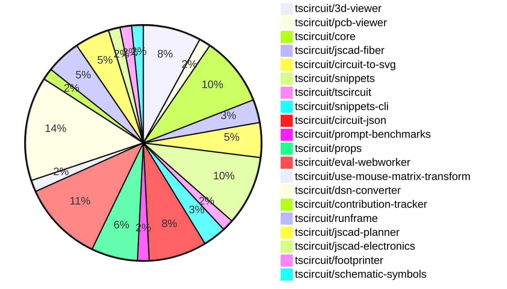

# Contribution Overview 2024-12-11

## PRs by Repository

## Contributor Overview

| Contributor | 🐳 Major | 🐙 Minor | 🐌 Tiny | ⭐ | Issues Created |
|-------------|---------|---------|---------|-----|----------------|
| [seveibar](#seveibar) | 9 | 20 | 3 | 👑👑 | 59 |
| [Abse2001](#Abse2001) | 1 | 5 | 0 | ⭐⭐ | 4 |
| [ShiboSoftwareDev](#ShiboSoftwareDev) | 1 | 2 | 0 | ⭐⭐ | 6 |
| [imrishabh18](#imrishabh18) | 1 | 5 | 0 | ⭐⭐ | 12 |
| [AnasSarkiz](#AnasSarkiz) | 4 | 1 | 0 | ⭐⭐ | 2 |
| [devin-ai-integration[bot]](#devin-ai-integration[bot]) | 0 | 6 | 1 | ⭐⭐ | 0 |
| [samyakshah3008](#samyakshah3008) | 0 | 1 | 0 |  | 0 |
| [techmannih](#techmannih) | 0 | 1 | 0 |  | 0 |
| [ni9999](#ni9999) | 0 | 1 | 0 |  | 0 |
| [Anshgrover23](#Anshgrover23) | 0 | 1 | 0 |  | 0 |

## Review Table

[reviews-received-hover]: ## "Number of reviews received for PRs for this contributor"
[approvals-received-hover]: ## "Number of approvals received for PRs this contributor authored"
[rejections-received-hover]: ## "Number of rejections received for PRs this contributor authored"
[prs-opened-hover]: ## "Number of PRs opened by this contributor"
[issues-created-hover]: ## "Number of issues created by this contributor"
[bountied-issues-hover]: ## "Number of issues this contributor created with a bounty"
[bountied-issue-$-hover]: ## "Total bounty amount placed on issues authored by this contributor"

| Contributor | Reviews Received | Approvals Received | Rejections Received | PRs Opened | PRs Merged | Issues Created | Bountied Issues | Bountied Issue $ |
|---|---|---|---|---|---|---|---|---|
| [Abse2001](#Abse2001) | 12 | 6 | 1 | 6 | 6 | 4 | 3 | 40 |
| [Bhavyajain21](#Bhavyajain21) | 0 | 0 | 0 | 1 | 0 | 0 | 0 | 0 |
| [samyakshah3008](#samyakshah3008) | 6 | 1 | 1 | 1 | 1 | 0 | 0 | 0 |
| [ShiboSoftwareDev](#ShiboSoftwareDev) | 5 | 3 | 0 | 6 | 3 | 6 | 2 | 75 |
| [devin-ai-integration[bot]](#devin-ai-integration[bot]) | 14 | 6 | 8 | 17 | 7 | 0 | 0 | 0 |
| [imrishabh18](#imrishabh18) | 3 | 1 | 0 | 11 | 6 | 12 | 5 | 40 |
| [seveibar](#seveibar) | 5 | 2 | 0 | 32 | 32 | 59 | 26 | 512 |
| [techmannih](#techmannih) | 8 | 1 | 3 | 4 | 1 | 0 | 0 | 0 |
| [RohittCodes](#RohittCodes) | 2 | 0 | 0 | 2 | 0 | 3 | 2 | 15 |
| [AnasSarkiz](#AnasSarkiz) | 13 | 4 | 1 | 5 | 5 | 2 | 0 | 0 |
| [ni9999](#ni9999) | 5 | 1 | 2 | 1 | 1 | 0 | 0 | 0 |
| [Anshgrover23](#Anshgrover23) | 3 | 1 | 1 | 2 | 1 | 0 | 0 | 0 |

## Changes by Repository

### [tscircuit/3d-viewer](https://github.com/tscircuit/3d-viewer)

| PR # | Impact | Contributor | Description |
|------|--------|-------------|-------------|
| [#67](https://github.com/tscircuit/3d-viewer/pull/67) | 🐳 Major | Abse2001 | Adds support for rendering silkscreen text on the PCB |
| [#64](https://github.com/tscircuit/3d-viewer/pull/64) | 🐳 Major | seveibar | Introduces error boundaries for components and fixes a bug in the jscad-fiber package. |
| [#69](https://github.com/tscircuit/3d-viewer/pull/69) | 🐙 Minor | seveibar | Adds support for Vercel building by removing the package lock and updating dependencies. |
| [#62](https://github.com/tscircuit/3d-viewer/pull/62) | 🐙 Minor | techmannih | Add typechecking and formatting workflow |
| [#68](https://github.com/tscircuit/3d-viewer/pull/68) | 🐌 Tiny | devin-ai-integration[bot] | Fix to prevent text selection in tooltips when clicking in the 3D viewer. |

### [tscircuit/pcb-viewer](https://github.com/tscircuit/pcb-viewer)

| PR # | Impact | Contributor | Description |
|------|--------|-------------|-------------|
| [#95](https://github.com/tscircuit/pcb-viewer/pull/95) | 🐙 Minor | Abse2001 | Fix the issue with the bad overlay when hovering over pads. |

### [tscircuit/core](https://github.com/tscircuit/core)

| PR # | Impact | Contributor | Description |
|------|--------|-------------|-------------|
| [#409](https://github.com/tscircuit/core/pull/409) | 🐳 Major | AnasSarkiz | Implemented a new option `pcbDisabled` in the `Circuit.ts` file to disable all PCB elements. |
| [#397](https://github.com/tscircuit/core/pull/397) | 🐳 Major | AnasSarkiz | Adds automatic schematic net labeling for passive-chip for complex traces. |
| [#422](https://github.com/tscircuit/core/pull/422) | 🐙 Minor | Abse2001 | Adds a custom schematic net label symbol for GND (ground) connections. |
| [#419](https://github.com/tscircuit/core/pull/419) | 🐙 Minor | seveibar | Throws a better error when a component has both manual placement and explicit coordinates (pcbX/pcbY). |
| [#415](https://github.com/tscircuit/core/pull/415) | 🐌 Tiny | seveibar | Update the version of the "circuit-json" dependency |
| [#414](https://github.com/tscircuit/core/pull/414) | 🐌 Tiny | seveibar | Fixes the issue of size reports being output when the `package.json` file is not changed. |

### [tscircuit/jscad-fiber](https://github.com/tscircuit/jscad-fiber)

| PR # | Impact | Contributor | Description |
|------|--------|-------------|-------------|
| [#99](https://github.com/tscircuit/jscad-fiber/pull/99) | 🐙 Minor | Abse2001 | Update React types to support React 19 |
| [#97](https://github.com/tscircuit/jscad-fiber/pull/97) | 🐙 Minor | seveibar | Add a new jscad-planner test and unnest children in the `create-host-config.ts` file. |

### [tscircuit/circuit-to-svg](https://github.com/tscircuit/circuit-to-svg)

| PR # | Impact | Contributor | Description |
|------|--------|-------------|-------------|
| [#148](https://github.com/tscircuit/circuit-to-svg/pull/148) | 🐳 Major | AnasSarkiz | Introduces a new function `convertCircuitJsonToAssemblySvg` to generate an SVG representation of an assembly diagram from a circuit JSON input. |
| [#147](https://github.com/tscircuit/circuit-to-svg/pull/147) | 🐳 Major | AnasSarkiz | Introduces a new function `createSvgObjectsFromSchVoltageProbe` to create SVG objects for a schematic voltage probe. |
| [#149](https://github.com/tscircuit/circuit-to-svg/pull/149) | 🐙 Minor | Abse2001 | Adds support for the GND symbol in the schematic net label rendering. |

### [tscircuit/snippets](https://github.com/tscircuit/snippets)

| PR # | Impact | Contributor | Description |
|------|--------|-------------|-------------|
| [#387](https://github.com/tscircuit/snippets/pull/387) | 🐙 Minor | Abse2001 | Updated the version of the `@tscircuit/3d-viewer` package from `0.0.51` to `0.0.58`. |
| [#389](https://github.com/tscircuit/snippets/pull/389) | 🐙 Minor | devin-ai-integration[bot] | Adds a standard stalebot configuration to automatically manage stale issues and pull requests. |
| [#390](https://github.com/tscircuit/snippets/pull/390) | 🐙 Minor | seveibar | Removes the `playwright-tests/error-fallback.spec.ts` file, which was a test that verified the behavior of the error fallback component in the 3D viewer. |
| [#385](https://github.com/tscircuit/snippets/pull/385) | 🐙 Minor | seveibar | Update the version of the `@tscircuit/3d-viewer` and `jscad-electronics` packages |
| [#363](https://github.com/tscircuit/snippets/pull/363) | 🐙 Minor | seveibar | Improves Playwright test runtime by reducing the number of retries in CI and fixes the CSS class for disabled links in the StaticViewSnippetSidebar component. |
| [#365](https://github.com/tscircuit/snippets/pull/365) | 🐙 Minor | Anshgrover23 | Split the `footprint-dialog.spec.ts` file into multiple files to improve code organization and readability. |

### [tscircuit/tscircuit](https://github.com/tscircuit/tscircuit)

| PR # | Impact | Contributor | Description |
|------|--------|-------------|-------------|
| [#484](https://github.com/tscircuit/tscircuit/pull/484) | 🐙 Minor | samyakshah3008 | This pull request enhances the README file of the tscircuit project by adding new sections, improving the existing content, and adding a contributing guide. |

### [tscircuit/snippets-cli](https://github.com/tscircuit/snippets-cli)

| PR # | Impact | Contributor | Description |
|------|--------|-------------|-------------|
| [#8](https://github.com/tscircuit/snippets-cli/pull/8) | 🐳 Major | ShiboSoftwareDev | Automatically install imported snippet types when starting the CLI. |
| [#6](https://github.com/tscircuit/snippets-cli/pull/6) | 🐙 Minor | seveibar | Fixes package.json for publishing, adds build step, workflows, and format checks. |

### [tscircuit/circuit-json](https://github.com/tscircuit/circuit-json)

| PR # | Impact | Contributor | Description |
|------|--------|-------------|-------------|
| [#94](https://github.com/tscircuit/circuit-json/pull/94) | 🐳 Major | imrishabh18 | Adds a new `pcb_group` type to represent a group of components on the PCB. |
| [#97](https://github.com/tscircuit/circuit-json/pull/97) | 🐙 Minor | ShiboSoftwareDev | The script was modified to fix issues with the doc generation, including searching for types instead of interfaces, handling Unix-style slashes on Windows, and updating the table of contents. |
| [#96](https://github.com/tscircuit/circuit-json/pull/96) | 🐙 Minor | devin-ai-integration[bot] | Add CircuitJson type export representing array of circuit elements |
| [#88](https://github.com/tscircuit/circuit-json/pull/88) | 🐙 Minor | devin-ai-integration[bot] | Adds a new error type `PcbManualEditConflictError` for conflicts between manual edits and explicit PCB coordinates. |
| [#89](https://github.com/tscircuit/circuit-json/pull/89) | 🐙 Minor | seveibar | Updates the README.md file to add a new section on Base Units and Element Prefixes. |

### [tscircuit/prompt-benchmarks](https://github.com/tscircuit/prompt-benchmarks)

| PR # | Impact | Contributor | Description |
|------|--------|-------------|-------------|
| [#11](https://github.com/tscircuit/prompt-benchmarks/pull/11) | 🐙 Minor | ShiboSoftwareDev | Update evalite dependency to version 0.7.0 and add experimental columns for the benchmark tool |

### [tscircuit/props](https://github.com/tscircuit/props)

| PR # | Impact | Contributor | Description |
|------|--------|-------------|-------------|
| [#117](https://github.com/tscircuit/props/pull/117) | 🐳 Major | seveibar | Adds support for manual schematic component placements and corresponding events |
| [#113](https://github.com/tscircuit/props/pull/113) | 🐙 Minor | devin-ai-integration[bot] | Adds a new `pinVariant` prop to the `crystal` component to support 2-pin and 4-pin variants. |
| [#118](https://github.com/tscircuit/props/pull/118) | 🐙 Minor | seveibar | Fix exports to include manual edit events |
| [#116](https://github.com/tscircuit/props/pull/116) | 🐙 Minor | seveibar | Move manual edits definitions into their own directory and files. |

### [tscircuit/eval-webworker](https://github.com/tscircuit/eval-webworker)

| PR # | Impact | Contributor | Description |
|------|--------|-------------|-------------|
| [#13](https://github.com/tscircuit/eval-webworker/pull/13) | 🐳 Major | seveibar | The pull request adds a new `executeWithFsMap` method to the `CircuitWebWorker` interface and the `InternalWebWorkerApi`, allowing the execution of code with a virtual file system. It also adds a new test case that demonstrates the usage of this feature. |
| [#26](https://github.com/tscircuit/eval-webworker/pull/26) | 🐙 Minor | devin-ai-integration[bot] | Adds type declarations for the blob-url module to resolve type errors when importing from '@tscircuit/eval-webworker/blob-url'. |
| [#28](https://github.com/tscircuit/eval-webworker/pull/28) | 🐙 Minor | seveibar | Separate the build process for the library and web worker, and add a new build script for the web worker. |
| [#27](https://github.com/tscircuit/eval-webworker/pull/27) | 🐙 Minor | seveibar | Adds verbose mode logging to the circuit web worker. |
| [#24](https://github.com/tscircuit/eval-webworker/pull/24) | 🐙 Minor | seveibar | Adds support for building blob URLs with the packaged WebWorker. |
| [#20](https://github.com/tscircuit/eval-webworker/pull/20) | 🐙 Minor | seveibar | Adds usage of `fsMap` to execute code using a virtual filesystem, which is useful when having multiple files or components. |
| [#25](https://github.com/tscircuit/eval-webworker/pull/25) | 🐌 Tiny | seveibar | Add `{ type: "module" }` to the Worker constructor to specify that the imported script is a module. |

### [tscircuit/use-mouse-matrix-transform](https://github.com/tscircuit/use-mouse-matrix-transform)

| PR # | Impact | Contributor | Description |
|------|--------|-------------|-------------|
| [#1](https://github.com/tscircuit/use-mouse-matrix-transform/pull/1) | 🐙 Minor | devin-ai-integration[bot] | Add an "enabled" prop to control matrix transformations in the `useMouseMatrixTransform` hook. |

### [tscircuit/dsn-converter](https://github.com/tscircuit/dsn-converter)

| PR # | Impact | Contributor | Description |
|------|--------|-------------|-------------|
| [#69](https://github.com/tscircuit/dsn-converter/pull/69) | 🐳 Major | seveibar | The pull request fixes the conversion of Circuit JSON to DsnPcb and DsnSession to ensure that the converted data can be converted back into an identical-looking Circuit JSON. |
| [#68](https://github.com/tscircuit/dsn-converter/pull/68) | 🐳 Major | seveibar | This pull request removes the Y-axis flip in the DSN PCB conversion, merges the DSN Session into the DSN PCB, and includes vias in the DSN stringification. It also improves the Circuit JSON to DSN PCB conversion for traces and vias. |
| [#67](https://github.com/tscircuit/dsn-converter/pull/67) | 🐳 Major | seveibar | Adds an assertion for checking the layer of SMT pads and fixes an issue where all SMT pads were being placed on the top layer. |
| [#63](https://github.com/tscircuit/dsn-converter/pull/63) | 🐙 Minor | imrishabh18 | Fixes the issue where the trace width was bigger than the component width, causing issues with freerouting. |
| [#62](https://github.com/tscircuit/dsn-converter/pull/62) | 🐙 Minor | imrishabh18 | Fixes a bug in hover traces by updating the way trace IDs are handled to maintain proper linkage. |
| [#60](https://github.com/tscircuit/dsn-converter/pull/60) | 🐙 Minor | imrishabh18 | Fix pin number derivation for plated holes from the source_port |
| [#59](https://github.com/tscircuit/dsn-converter/pull/59) | 🐙 Minor | imrishabh18 | Add default width and height for group subcircuit |
| [#58](https://github.com/tscircuit/dsn-converter/pull/58) | 🐙 Minor | imrishabh18 | Fixes an issue with parsing the pin number format in the `processPin` function, allowing for both numeric and string pin numbers. |
| [#66](https://github.com/tscircuit/dsn-converter/pull/66) | 🐙 Minor | seveibar | Add debug utils and a test that shows issues with converting to DSN PCB. |

### [tscircuit/contribution-tracker](https://github.com/tscircuit/contribution-tracker)

| PR # | Impact | Contributor | Description |
|------|--------|-------------|-------------|
| [#22](https://github.com/tscircuit/contribution-tracker/pull/22) | 🐳 Major | seveibar | Refactor types, add support for json generation, fix claude caching, and fix column titles |

### [tscircuit/runframe](https://github.com/tscircuit/runframe)

| PR # | Impact | Contributor | Description |
|------|--------|-------------|-------------|
| [#9](https://github.com/tscircuit/runframe/pull/9) | 🐳 Major | seveibar | Introduces the `RunFrameWithApi` component, which integrates the `RunFrame` component with an API for managing files and events. |
| [#3](https://github.com/tscircuit/runframe/pull/3) | 🐳 Major | seveibar | Add GitHub Actions workflows for format checking, type checking, and publishing the package to npm. |
| [#14](https://github.com/tscircuit/runframe/pull/14) | 🐙 Minor | seveibar | Adds a fallback mechanism to guess the entrypoint file if it's not found, and consolidates build fixes. |

### [tscircuit/jscad-planner](https://github.com/tscircuit/jscad-planner)

| PR # | Impact | Contributor | Description |
|------|--------|-------------|-------------|
| [#7](https://github.com/tscircuit/jscad-planner/pull/7) | 🐙 Minor | seveibar | Adds support for automatically handling single-element arrays as the operation input in the `executeJscadOperations` function. |
| [#6](https://github.com/tscircuit/jscad-planner/pull/6) | 🐙 Minor | seveibar | Throw a specific error if an array is passed in for the `operation` parameter in `executeJscadOperations`. |
| [#5](https://github.com/tscircuit/jscad-planner/pull/5) | 🐙 Minor | seveibar | Improve error message when an operation has an undefined type. |

### [tscircuit/jscad-electronics](https://github.com/tscircuit/jscad-electronics)

| PR # | Impact | Contributor | Description |
|------|--------|-------------|-------------|
| [#82](https://github.com/tscircuit/jscad-electronics/pull/82) | 🐙 Minor | seveibar | Update jscad-fiber library to use JsCadView instead of JsCadFixture |

### [tscircuit/footprinter](https://github.com/tscircuit/footprinter)

| PR # | Impact | Contributor | Description |
|------|--------|-------------|-------------|
| [#96](https://github.com/tscircuit/footprinter/pull/96) | 🐙 Minor | AnasSarkiz | Adds support for optional height parameters to stampboard and stampreceiver components. |

### [tscircuit/schematic-symbols](https://github.com/tscircuit/schematic-symbols)

| PR # | Impact | Contributor | Description |
|------|--------|-------------|-------------|
| [#210](https://github.com/tscircuit/schematic-symbols/pull/210) | 🐙 Minor | ni9999 | Add a 4-pin crystal symbol |

## Changes by Contributor

### [Abse2001](https://github.com/Abse2001)

| PR # | Impact | Description |
|------|--------|-------------|
| [#67](https://github.com/tscircuit/3d-viewer/pull/67) | 🐳 Major | Adds support for rendering silkscreen text on the PCB |
| [#95](https://github.com/tscircuit/pcb-viewer/pull/95) | 🐙 Minor | Fix the issue with the bad overlay when hovering over pads. |
| [#422](https://github.com/tscircuit/core/pull/422) | 🐙 Minor | Adds a custom schematic net label symbol for GND (ground) connections. |
| [#99](https://github.com/tscircuit/jscad-fiber/pull/99) | 🐙 Minor | Update React types to support React 19 |
| [#149](https://github.com/tscircuit/circuit-to-svg/pull/149) | 🐙 Minor | Adds support for the GND symbol in the schematic net label rendering. |
| [#387](https://github.com/tscircuit/snippets/pull/387) | 🐙 Minor | Updated the version of the `@tscircuit/3d-viewer` package from `0.0.51` to `0.0.58`. |

### [samyakshah3008](https://github.com/samyakshah3008)

| PR # | Impact | Description |
|------|--------|-------------|
| [#484](https://github.com/tscircuit/tscircuit/pull/484) | 🐙 Minor | This pull request enhances the README file of the tscircuit project by adding new sections, improving the existing content, and adding a contributing guide. |

### [ShiboSoftwareDev](https://github.com/ShiboSoftwareDev)

| PR # | Impact | Description |
|------|--------|-------------|
| [#8](https://github.com/tscircuit/snippets-cli/pull/8) | 🐳 Major | Automatically install imported snippet types when starting the CLI. |
| [#97](https://github.com/tscircuit/circuit-json/pull/97) | 🐙 Minor | The script was modified to fix issues with the doc generation, including searching for types instead of interfaces, handling Unix-style slashes on Windows, and updating the table of contents. |
| [#11](https://github.com/tscircuit/prompt-benchmarks/pull/11) | 🐙 Minor | Update evalite dependency to version 0.7.0 and add experimental columns for the benchmark tool |

### [devin-ai-integration[bot]](https://github.com/devin-ai-integration[bot])

| PR # | Impact | Description |
|------|--------|-------------|
| [#96](https://github.com/tscircuit/circuit-json/pull/96) | 🐙 Minor | Add CircuitJson type export representing array of circuit elements |
| [#88](https://github.com/tscircuit/circuit-json/pull/88) | 🐙 Minor | Adds a new error type `PcbManualEditConflictError` for conflicts between manual edits and explicit PCB coordinates. |
| [#113](https://github.com/tscircuit/props/pull/113) | 🐙 Minor | Adds a new `pinVariant` prop to the `crystal` component to support 2-pin and 4-pin variants. |
| [#389](https://github.com/tscircuit/snippets/pull/389) | 🐙 Minor | Adds a standard stalebot configuration to automatically manage stale issues and pull requests. |
| [#26](https://github.com/tscircuit/eval-webworker/pull/26) | 🐙 Minor | Adds type declarations for the blob-url module to resolve type errors when importing from '@tscircuit/eval-webworker/blob-url'. |
| [#1](https://github.com/tscircuit/use-mouse-matrix-transform/pull/1) | 🐙 Minor | Add an "enabled" prop to control matrix transformations in the `useMouseMatrixTransform` hook. |
| [#68](https://github.com/tscircuit/3d-viewer/pull/68) | 🐌 Tiny | Fix to prevent text selection in tooltips when clicking in the 3D viewer. |

### [imrishabh18](https://github.com/imrishabh18)

| PR # | Impact | Description |
|------|--------|-------------|
| [#94](https://github.com/tscircuit/circuit-json/pull/94) | 🐳 Major | Adds a new `pcb_group` type to represent a group of components on the PCB. |
| [#63](https://github.com/tscircuit/dsn-converter/pull/63) | 🐙 Minor | Fixes the issue where the trace width was bigger than the component width, causing issues with freerouting. |
| [#62](https://github.com/tscircuit/dsn-converter/pull/62) | 🐙 Minor | Fixes a bug in hover traces by updating the way trace IDs are handled to maintain proper linkage. |
| [#60](https://github.com/tscircuit/dsn-converter/pull/60) | 🐙 Minor | Fix pin number derivation for plated holes from the source_port |
| [#59](https://github.com/tscircuit/dsn-converter/pull/59) | 🐙 Minor | Add default width and height for group subcircuit |
| [#58](https://github.com/tscircuit/dsn-converter/pull/58) | 🐙 Minor | Fixes an issue with parsing the pin number format in the `processPin` function, allowing for both numeric and string pin numbers. |

### [seveibar](https://github.com/seveibar)

| PR # | Impact | Description |
|------|--------|-------------|
| [#117](https://github.com/tscircuit/props/pull/117) | 🐳 Major | Adds support for manual schematic component placements and corresponding events |
| [#64](https://github.com/tscircuit/3d-viewer/pull/64) | 🐳 Major | Introduces error boundaries for components and fixes a bug in the jscad-fiber package. |
| [#22](https://github.com/tscircuit/contribution-tracker/pull/22) | 🐳 Major | Refactor types, add support for json generation, fix claude caching, and fix column titles |
| [#69](https://github.com/tscircuit/dsn-converter/pull/69) | 🐳 Major | The pull request fixes the conversion of Circuit JSON to DsnPcb and DsnSession to ensure that the converted data can be converted back into an identical-looking Circuit JSON. |
| [#68](https://github.com/tscircuit/dsn-converter/pull/68) | 🐳 Major | This pull request removes the Y-axis flip in the DSN PCB conversion, merges the DSN Session into the DSN PCB, and includes vias in the DSN stringification. It also improves the Circuit JSON to DSN PCB conversion for traces and vias. |
| [#67](https://github.com/tscircuit/dsn-converter/pull/67) | 🐳 Major | Adds an assertion for checking the layer of SMT pads and fixes an issue where all SMT pads were being placed on the top layer. |
| [#13](https://github.com/tscircuit/eval-webworker/pull/13) | 🐳 Major | The pull request adds a new `executeWithFsMap` method to the `CircuitWebWorker` interface and the `InternalWebWorkerApi`, allowing the execution of code with a virtual file system. It also adds a new test case that demonstrates the usage of this feature. |
| [#9](https://github.com/tscircuit/runframe/pull/9) | 🐳 Major | Introduces the `RunFrameWithApi` component, which integrates the `RunFrame` component with an API for managing files and events. |
| [#3](https://github.com/tscircuit/runframe/pull/3) | 🐳 Major | Add GitHub Actions workflows for format checking, type checking, and publishing the package to npm. |
| [#89](https://github.com/tscircuit/circuit-json/pull/89) | 🐙 Minor | Updates the README.md file to add a new section on Base Units and Element Prefixes. |
| [#118](https://github.com/tscircuit/props/pull/118) | 🐙 Minor | Fix exports to include manual edit events |
| [#116](https://github.com/tscircuit/props/pull/116) | 🐙 Minor | Move manual edits definitions into their own directory and files. |
| [#69](https://github.com/tscircuit/3d-viewer/pull/69) | 🐙 Minor | Adds support for Vercel building by removing the package lock and updating dependencies. |
| [#7](https://github.com/tscircuit/jscad-planner/pull/7) | 🐙 Minor | Adds support for automatically handling single-element arrays as the operation input in the `executeJscadOperations` function. |
| [#6](https://github.com/tscircuit/jscad-planner/pull/6) | 🐙 Minor | Throw a specific error if an array is passed in for the `operation` parameter in `executeJscadOperations`. |
| [#5](https://github.com/tscircuit/jscad-planner/pull/5) | 🐙 Minor | Improve error message when an operation has an undefined type. |
| [#419](https://github.com/tscircuit/core/pull/419) | 🐙 Minor | Throws a better error when a component has both manual placement and explicit coordinates (pcbX/pcbY). |
| [#82](https://github.com/tscircuit/jscad-electronics/pull/82) | 🐙 Minor | Update jscad-fiber library to use JsCadView instead of JsCadFixture |
| [#97](https://github.com/tscircuit/jscad-fiber/pull/97) | 🐙 Minor | Add a new jscad-planner test and unnest children in the `create-host-config.ts` file. |
| [#66](https://github.com/tscircuit/dsn-converter/pull/66) | 🐙 Minor | Add debug utils and a test that shows issues with converting to DSN PCB. |
| [#390](https://github.com/tscircuit/snippets/pull/390) | 🐙 Minor | Removes the `playwright-tests/error-fallback.spec.ts` file, which was a test that verified the behavior of the error fallback component in the 3D viewer. |
| [#385](https://github.com/tscircuit/snippets/pull/385) | 🐙 Minor | Update the version of the `@tscircuit/3d-viewer` and `jscad-electronics` packages |
| [#363](https://github.com/tscircuit/snippets/pull/363) | 🐙 Minor | Improves Playwright test runtime by reducing the number of retries in CI and fixes the CSS class for disabled links in the StaticViewSnippetSidebar component. |
| [#28](https://github.com/tscircuit/eval-webworker/pull/28) | 🐙 Minor | Separate the build process for the library and web worker, and add a new build script for the web worker. |
| [#27](https://github.com/tscircuit/eval-webworker/pull/27) | 🐙 Minor | Adds verbose mode logging to the circuit web worker. |
| [#24](https://github.com/tscircuit/eval-webworker/pull/24) | 🐙 Minor | Adds support for building blob URLs with the packaged WebWorker. |
| [#20](https://github.com/tscircuit/eval-webworker/pull/20) | 🐙 Minor | Adds usage of `fsMap` to execute code using a virtual filesystem, which is useful when having multiple files or components. |
| [#14](https://github.com/tscircuit/runframe/pull/14) | 🐙 Minor | Adds a fallback mechanism to guess the entrypoint file if it's not found, and consolidates build fixes. |
| [#6](https://github.com/tscircuit/snippets-cli/pull/6) | 🐙 Minor | Fixes package.json for publishing, adds build step, workflows, and format checks. |
| [#415](https://github.com/tscircuit/core/pull/415) | 🐌 Tiny | Update the version of the "circuit-json" dependency |
| [#414](https://github.com/tscircuit/core/pull/414) | 🐌 Tiny | Fixes the issue of size reports being output when the `package.json` file is not changed. |
| [#25](https://github.com/tscircuit/eval-webworker/pull/25) | 🐌 Tiny | Add `{ type: "module" }` to the Worker constructor to specify that the imported script is a module. |

### [AnasSarkiz](https://github.com/AnasSarkiz)

| PR # | Impact | Description |
|------|--------|-------------|
| [#409](https://github.com/tscircuit/core/pull/409) | 🐳 Major | Implemented a new option `pcbDisabled` in the `Circuit.ts` file to disable all PCB elements. |
| [#397](https://github.com/tscircuit/core/pull/397) | 🐳 Major | Adds automatic schematic net labeling for passive-chip for complex traces. |
| [#148](https://github.com/tscircuit/circuit-to-svg/pull/148) | 🐳 Major | Introduces a new function `convertCircuitJsonToAssemblySvg` to generate an SVG representation of an assembly diagram from a circuit JSON input. |
| [#147](https://github.com/tscircuit/circuit-to-svg/pull/147) | 🐳 Major | Introduces a new function `createSvgObjectsFromSchVoltageProbe` to create SVG objects for a schematic voltage probe. |
| [#96](https://github.com/tscircuit/footprinter/pull/96) | 🐙 Minor | Adds support for optional height parameters to stampboard and stampreceiver components. |

### [techmannih](https://github.com/techmannih)

| PR # | Impact | Description |
|------|--------|-------------|
| [#62](https://github.com/tscircuit/3d-viewer/pull/62) | 🐙 Minor | Add typechecking and formatting workflow |

### [ni9999](https://github.com/ni9999)

| PR # | Impact | Description |
|------|--------|-------------|
| [#210](https://github.com/tscircuit/schematic-symbols/pull/210) | 🐙 Minor | Add a 4-pin crystal symbol |

### [Anshgrover23](https://github.com/Anshgrover23)

| PR # | Impact | Description |
|------|--------|-------------|
| [#365](https://github.com/tscircuit/snippets/pull/365) | 🐙 Minor | Split the `footprint-dialog.spec.ts` file into multiple files to improve code organization and readability. |

