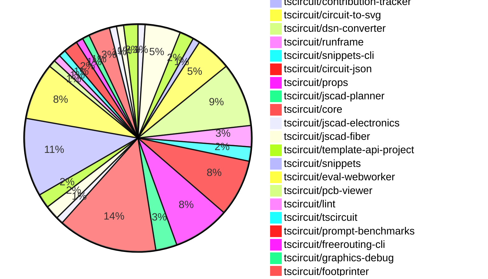

# Contribution Overview 2024-12-11

## PRs by Repository

## Contributor Overview

| Contributor | 🐳 Major | 🐙 Minor | 🐌 Tiny | ⭐ | Issues Created |
|-------------|---------|---------|---------|-----|----------------|
| [seveibar](#seveibar) | 12 | 28 | 2 | 👑👑👑 | 109 |
| [ShiboSoftwareDev](#ShiboSoftwareDev) | 2 | 4 | 0 | ⭐⭐⭐ | 8 |
| [imrishabh18](#imrishabh18) | 2 | 8 | 0 | ⭐⭐⭐ | 19 |
| [Abse2001](#Abse2001) | 1 | 8 | 0 | ⭐⭐ | 5 |
| [devin-ai-integration[bot]](#devin-ai-integration[bot]) | 0 | 12 | 0 | ⭐⭐ | 0 |
| [AnasSarkiz](#AnasSarkiz) | 3 | 4 | 0 | ⭐⭐ | 2 |
| [techmannih](#techmannih) | 0 | 7 | 0 | ⭐⭐ | 0 |
| [RohittCodes](#RohittCodes) | 0 | 2 | 0 | ⭐ | 4 |
| [Anshgrover23](#Anshgrover23) | 0 | 2 | 0 | ⭐ | 0 |
| [samyakshah3008](#samyakshah3008) | 0 | 1 | 0 |  | 0 |
| [ni9999](#ni9999) | 0 | 1 | 0 |  | 0 |

## Review Table

[reviews-received-hover]: ## "Number of reviews received for PRs for this contributor"
[approvals-received-hover]: ## "Number of approvals received for PRs this contributor authored"
[rejections-received-hover]: ## "Number of rejections received for PRs this contributor authored"
[prs-opened-hover]: ## "Number of PRs opened by this contributor"
[issues-created-hover]: ## "Number of issues created by this contributor"
[bountied-issues-hover]: ## "Number of issues this contributor created with a bounty"
[bountied-issue-$-hover]: ## "Total bounty amount placed on issues authored by this contributor"

| Contributor | Reviews Received | Approvals Received | Rejections Received | PRs Opened | PRs Merged | Issues Created | Bountied Issues | Bountied Issue $ |
|---|---|---|---|---|---|---|---|---|
| [seveibar](#seveibar) | 5 | 2 | 0 | 43 | 42 | 109 | 39 | 814 |
| [Bhavyajain21](#Bhavyajain21) | 1 | 0 | 1 | 1 | 0 | 0 | 0 | 0 |
| [Abse2001](#Abse2001) | 20 | 9 | 1 | 11 | 9 | 5 | 3 | 40 |
| [samyakshah3008](#samyakshah3008) | 6 | 1 | 1 | 1 | 1 | 0 | 0 | 0 |
| [Anshgrover23](#Anshgrover23) | 27 | 2 | 7 | 4 | 2 | 0 | 0 | 0 |
| [RohittCodes](#RohittCodes) | 5 | 3 | 0 | 5 | 2 | 4 | 3 | 25 |
| [ShiboSoftwareDev](#ShiboSoftwareDev) | 8 | 6 | 0 | 8 | 6 | 8 | 3 | 115 |
| [devin-ai-integration[bot]](#devin-ai-integration[bot]) | 20 | 10 | 9 | 24 | 12 | 0 | 0 | 0 |
| [imrishabh18](#imrishabh18) | 9 | 2 | 0 | 15 | 10 | 19 | 6 | 55 |
| [techmannih](#techmannih) | 22 | 9 | 6 | 11 | 7 | 0 | 0 | 0 |
| [AnasSarkiz](#AnasSarkiz) | 18 | 7 | 1 | 7 | 7 | 2 | 0 | 0 |
| [ni9999](#ni9999) | 5 | 1 | 2 | 1 | 1 | 0 | 0 | 0 |
| [Niharika0104](#Niharika0104) | 2 | 0 | 1 | 1 | 0 | 1 | 0 | 0 |
| [DrSensor](#DrSensor) | 0 | 0 | 0 | 1 | 0 | 0 | 0 | 0 |

## Changes by Repository

### [tscircuit/schematic-viewer](https://github.com/tscircuit/schematic-viewer)

| PR # | Impact | Contributor | Description |
|------|--------|-------------|-------------|
| [#73](https://github.com/tscircuit/schematic-viewer/pull/73) | 🐳 Major | seveibar | Adds drag-and-drop editing functionality to the codebase, including documentation, updates to props, and a full implementation of the feature. |

### [tscircuit/3d-viewer](https://github.com/tscircuit/3d-viewer)

| PR # | Impact | Contributor | Description |
|------|--------|-------------|-------------|
| [#64](https://github.com/tscircuit/3d-viewer/pull/64) | 🐳 Major | seveibar | Introduces error boundaries for components and a fix for the jscad-fiber unnesting issue. |
| [#67](https://github.com/tscircuit/3d-viewer/pull/67) | 🐳 Major | Abse2001 | Adds support for rendering silkscreen text on PCB |
| [#69](https://github.com/tscircuit/3d-viewer/pull/69) | 🐙 Minor | seveibar | Adds support for Vercel building by removing the package lock and updating dependencies. |
| [#68](https://github.com/tscircuit/3d-viewer/pull/68) | 🐙 Minor | devin-ai-integration[bot] | Prevent accidental text selection in tooltips when clicking in the 3D viewer. |
| [#62](https://github.com/tscircuit/3d-viewer/pull/62) | 🐙 Minor | techmannih | Add typechecking and formatting workflow |

### [tscircuit/winterspec](https://github.com/tscircuit/winterspec)

| PR # | Impact | Contributor | Description |
|------|--------|-------------|-------------|
| [#25](https://github.com/tscircuit/winterspec/pull/25) | 🐳 Major | seveibar | Ports the CLI to use Commander, adds a lot of debug logging, and changes the bundle dependency when running in Bun. |
| [#24](https://github.com/tscircuit/winterspec/pull/24) | 🐙 Minor | seveibar | Add middleware exports to the `src/middleware/index.ts` file. |

### [tscircuit/contribution-tracker](https://github.com/tscircuit/contribution-tracker)

| PR # | Impact | Contributor | Description |
|------|--------|-------------|-------------|
| [#22](https://github.com/tscircuit/contribution-tracker/pull/22) | 🐳 Major | seveibar | Refactor types, add support for JSON generation, fix Claude caching, and fix column titles |

### [tscircuit/circuit-to-svg](https://github.com/tscircuit/circuit-to-svg)

| PR # | Impact | Contributor | Description |
|------|--------|-------------|-------------|
| [#151](https://github.com/tscircuit/circuit-to-svg/pull/151) | 🐳 Major | seveibar | Adds support for computing the schematic transform and placing it on the SVG as a data attribute. |
| [#148](https://github.com/tscircuit/circuit-to-svg/pull/148) | 🐳 Major | AnasSarkiz | Introduces a new function `convertCircuitJsonToAssemblySvg` to convert a circuit JSON representation to an SVG diagram of the assembly. |
| [#150](https://github.com/tscircuit/circuit-to-svg/pull/150) | 🐙 Minor | seveibar | Add `data-circuit-json-type` and `data-schematic-trace-id` properties to SVG objects for schematic traces. |
| [#149](https://github.com/tscircuit/circuit-to-svg/pull/149) | 🐙 Minor | Abse2001 | Add support for rendering the GND symbol in schematic net labels. |
| [#147](https://github.com/tscircuit/circuit-to-svg/pull/147) | 🐙 Minor | AnasSarkiz | Introduce `schematic_voltage_probe` create svg function |

### [tscircuit/dsn-converter](https://github.com/tscircuit/dsn-converter)

| PR # | Impact | Contributor | Description |
|------|--------|-------------|-------------|
| [#69](https://github.com/tscircuit/dsn-converter/pull/69) | 🐳 Major | seveibar | Fix merge dsn session to have SVG parity |
| [#68](https://github.com/tscircuit/dsn-converter/pull/68) | 🐳 Major | seveibar | Removes the Y-axis flip in DSN PCB conversion, merges Dsn Session into Dsn PCB, and performs minor refactoring with lots of debug statements. It also includes vias in DSN stringification and improves Circuit JSON to DSN PCB conversion for traces and vias. |
| [#67](https://github.com/tscircuit/dsn-converter/pull/67) | 🐳 Major | seveibar | Add assertion for smtpad layers check, fix smtpads all being on top layer |
| [#58](https://github.com/tscircuit/dsn-converter/pull/58) | 🐳 Major | imrishabh18 | Fixes an issue with parsing invalid pin format in the DSN file. |
| [#66](https://github.com/tscircuit/dsn-converter/pull/66) | 🐙 Minor | seveibar | Add debug utilities and a test that shows issues with converting a circuit to DSN PCB format. |
| [#63](https://github.com/tscircuit/dsn-converter/pull/63) | 🐙 Minor | imrishabh18 | Fixes the trace width used in freerouting to be smaller than the component width, enabling proper routing to the SMT pads. |
| [#62](https://github.com/tscircuit/dsn-converter/pull/62) | 🐙 Minor | imrishabh18 | Fixes hover traces by maintaining proper linkage between source traces and route segments. |
| [#60](https://github.com/tscircuit/dsn-converter/pull/60) | 🐙 Minor | imrishabh18 | Fix for deriving pin numbers from source_port for plated_hole's. |
| [#59](https://github.com/tscircuit/dsn-converter/pull/59) | 🐙 Minor | imrishabh18 | Adds default width and height of 100mm for `<group/>` subcircuit. |

### [tscircuit/runframe](https://github.com/tscircuit/runframe)

| PR # | Impact | Contributor | Description |
|------|--------|-------------|-------------|
| [#14](https://github.com/tscircuit/runframe/pull/14) | 🐳 Major | seveibar | Introduces a `shim process` for the `global.process` object and consolidates build fixes. |
| [#9](https://github.com/tscircuit/runframe/pull/9) | 🐳 Major | seveibar | Introduces a new component `RunFrameWithApi` that integrates the `RunFrame` component with an API for file management. |
| [#3](https://github.com/tscircuit/runframe/pull/3) | 🐳 Major | seveibar | Adds a set of GitHub Action workflows to the project for formatting, type-checking, and publishing to npm. |

### [tscircuit/snippets-cli](https://github.com/tscircuit/snippets-cli)

| PR # | Impact | Contributor | Description |
|------|--------|-------------|-------------|
| [#6](https://github.com/tscircuit/snippets-cli/pull/6) | 🐳 Major | seveibar | Fix Package Json for Publishing, Add Build Step, Workflows, Format |
| [#8](https://github.com/tscircuit/snippets-cli/pull/8) | 🐙 Minor | ShiboSoftwareDev | Automatically install imported snippet types from the registry API. |

### [tscircuit/circuit-json](https://github.com/tscircuit/circuit-json)

| PR # | Impact | Contributor | Description |
|------|--------|-------------|-------------|
| [#94](https://github.com/tscircuit/circuit-json/pull/94) | 🐳 Major | imrishabh18 | Introduces a new `pcb_group` feature to the project. |
| [#89](https://github.com/tscircuit/circuit-json/pull/89) | 🐙 Minor | seveibar | Updates the README.md file to include information about base units and element prefixes used in the project. |
| [#101](https://github.com/tscircuit/circuit-json/pull/101) | 🐙 Minor | Abse2001 | Added optional `ccw_rotation` property to `pcb_silkscreen_text` component. |
| [#102](https://github.com/tscircuit/circuit-json/pull/102) | 🐙 Minor | Anshgrover23 | Implemented the `source_simple_resonator` feature. |
| [#100](https://github.com/tscircuit/circuit-json/pull/100) | 🐙 Minor | RohittCodes | Adds support for parsing "KΩ" and "KV" SI units, which represent 1 kilo-ohm and 1 kilo-volt, respectively. |
| [#97](https://github.com/tscircuit/circuit-json/pull/97) | 🐙 Minor | ShiboSoftwareDev | The pull request fixes issues with the script that generates the documentation, including fixing the search for interfaces and types, fixing the source docs generation on Windows, and fixing the table of contents generation. |
| [#96](https://github.com/tscircuit/circuit-json/pull/96) | 🐙 Minor | devin-ai-integration[bot] | Add CircuitJson type export representing array of circuit elements. |
| [#88](https://github.com/tscircuit/circuit-json/pull/88) | 🐙 Minor | devin-ai-integration[bot] | Adds a new error type for conflicts between manual edits and explicit PCB coordinates |

### [tscircuit/props](https://github.com/tscircuit/props)

| PR # | Impact | Contributor | Description |
|------|--------|-------------|-------------|
| [#121](https://github.com/tscircuit/props/pull/121) | 🐙 Minor | seveibar | Fix exports to include manual edit events and improve consistency of edit event type property. |
| [#118](https://github.com/tscircuit/props/pull/118) | 🐙 Minor | seveibar | Fixes exports to include manual edit events for schematic component location. |
| [#117](https://github.com/tscircuit/props/pull/117) | 🐙 Minor | seveibar | Add manual schematic placements and schematic placement events |
| [#116](https://github.com/tscircuit/props/pull/116) | 🐙 Minor | seveibar | Move Manual Edits Definitions into Props |
| [#124](https://github.com/tscircuit/props/pull/124) | 🐙 Minor | devin-ai-integration[bot] | Rename `manual_edit_file` to `manual_edits_file` for consistency with the interface name `ManualEditsFile`. |
| [#122](https://github.com/tscircuit/props/pull/122) | 🐙 Minor | devin-ai-integration[bot] | Add TypeScript interface definition for `ManualEditsFile` to match existing Zod schema. |
| [#113](https://github.com/tscircuit/props/pull/113) | 🐙 Minor | devin-ai-integration[bot] | Adds a new `pinVariant` prop to the `crystal` component to support 2-pin and 4-pin variants. |
| [#119](https://github.com/tscircuit/props/pull/119) | 🐙 Minor | techmannih | Adds a new component called "resonator" with associated props and type definitions. |

### [tscircuit/jscad-planner](https://github.com/tscircuit/jscad-planner)

| PR # | Impact | Contributor | Description |
|------|--------|-------------|-------------|
| [#7](https://github.com/tscircuit/jscad-planner/pull/7) | 🐙 Minor | seveibar | Adds support for automatically handling single-element arrays as the operation input to `executeJscadOperations`. |
| [#6](https://github.com/tscircuit/jscad-planner/pull/6) | 🐙 Minor | seveibar | Throw a specific error if an array is passed in for `executeJscadOperations`. |
| [#5](https://github.com/tscircuit/jscad-planner/pull/5) | 🐙 Minor | seveibar | Improve error message when an operation has an undefined type |

### [tscircuit/core](https://github.com/tscircuit/core)

| PR # | Impact | Contributor | Description |
|------|--------|-------------|-------------|
| [#409](https://github.com/tscircuit/core/pull/409) | 🐳 Major | AnasSarkiz | Implemented a new `pcbDisabled` option in the `Circuit.ts` file to disable all PCB elements. |
| [#439](https://github.com/tscircuit/core/pull/439) | 🐙 Minor | seveibar | Adds a function `applyEditEventsToManualEditsFile` to update the manual edits file based on edit events, specifically for schematic component placement changes. |
| [#436](https://github.com/tscircuit/core/pull/436) | 🐙 Minor | seveibar | Rename "eval_error" event to "external:evalError" |
| [#419](https://github.com/tscircuit/core/pull/419) | 🐙 Minor | seveibar | The pull request adds a check to throw an error when a component has both manual placement and explicit coordinates (pcbX/pcbY). |
| [#414](https://github.com/tscircuit/core/pull/414) | 🐙 Minor | seveibar | Skips bundle size report if `package.json` was not changed in the pull request. |
| [#444](https://github.com/tscircuit/core/pull/444) | 🐙 Minor | Abse2001 | Adds a `ccw_rotation` property to the `SilkscreenText` component in the PCB library. |
| [#422](https://github.com/tscircuit/core/pull/422) | 🐙 Minor | Abse2001 | Adds a function `createDownwardNetLabelGroundSymbol` to create a ground symbol for a schematic net label with "GND" or "ground" in the label text. |
| [#437](https://github.com/tscircuit/core/pull/437) | 🐙 Minor | imrishabh18 | Updates the lockfile to fix the publish process. |
| [#430](https://github.com/tscircuit/core/pull/430) | 🐙 Minor | imrishabh18 | Add a new event type "eval_error" for webworker |
| [#424](https://github.com/tscircuit/core/pull/424) | 🐙 Minor | techmannih | Set up continuous branch release with pkg-pr-new |
| [#428](https://github.com/tscircuit/core/pull/428) | 🐙 Minor | techmannih | Adds a new silkscreen line component to the project. |
| [#443](https://github.com/tscircuit/core/pull/443) | 🐙 Minor | AnasSarkiz | Changed the value of `schematic_component_id` of `component_name_text` to fix the issue in https://github.com/tscircuit/circuit-to-svg/issues/152. |
| [#397](https://github.com/tscircuit/core/pull/397) | 🐙 Minor | AnasSarkiz | Adds automatic schematic net labeling for passive-chip for complex traces. |
| [#415](https://github.com/tscircuit/core/pull/415) | 🐌 Tiny | seveibar | Update the version of the "circuit-json" dependency from 0.0.108 to 0.0.114. |

### [tscircuit/jscad-electronics](https://github.com/tscircuit/jscad-electronics)

| PR # | Impact | Contributor | Description |
|------|--------|-------------|-------------|
| [#82](https://github.com/tscircuit/jscad-electronics/pull/82) | 🐙 Minor | seveibar | Update the `jscad-fiber` library by changing the import statements from `JsCadFixture` to `JsCadView`. |

### [tscircuit/jscad-fiber](https://github.com/tscircuit/jscad-fiber)

| PR # | Impact | Contributor | Description |
|------|--------|-------------|-------------|
| [#97](https://github.com/tscircuit/jscad-fiber/pull/97) | 🐙 Minor | seveibar | Adds a new jscad-planner test component and unnests children in the create-host-config file. |
| [#99](https://github.com/tscircuit/jscad-fiber/pull/99) | 🐙 Minor | Abse2001 | Update React types to version 19 |

### [tscircuit/template-api-project](https://github.com/tscircuit/template-api-project)

| PR # | Impact | Contributor | Description |
|------|--------|-------------|-------------|
| [#3](https://github.com/tscircuit/template-api-project/pull/3) | 🐙 Minor | seveibar |  |
| [#2](https://github.com/tscircuit/template-api-project/pull/2) | 🐙 Minor | seveibar | Adds the `@electric-sql/pglite` and `kysely-pglite` dependencies for development and creates a utility function `getTestDatabase` to manage a test database. |

### [tscircuit/snippets](https://github.com/tscircuit/snippets)

| PR # | Impact | Contributor | Description |
|------|--------|-------------|-------------|
| [#390](https://github.com/tscircuit/snippets/pull/390) | 🐙 Minor | seveibar | Removes the `playwright-tests/error-fallback.spec.ts` file, as the 3D viewer no longer completely breaks in the way the test relied on. |
| [#385](https://github.com/tscircuit/snippets/pull/385) | 🐙 Minor | seveibar | Update the versions of the `@tscircuit/3d-viewer` and `jscad-electronics` packages. |
| [#363](https://github.com/tscircuit/snippets/pull/363) | 🐙 Minor | seveibar | Improve Playwright Test runtime and fix manual edits test |
| [#387](https://github.com/tscircuit/snippets/pull/387) | 🐙 Minor | Abse2001 | Updated the version of the `@tscircuit/3d-viewer` package from `0.0.51` to `0.0.58`. |
| [#365](https://github.com/tscircuit/snippets/pull/365) | 🐙 Minor | Anshgrover23 | Splits the `footprint-dialog.spec.ts` file into multiple files to improve code organization and maintainability. |
| [#386](https://github.com/tscircuit/snippets/pull/386) | 🐙 Minor | RohittCodes | Adds an error message and a way to import manual edits if they exist but have not been imported in the code. |
| [#398](https://github.com/tscircuit/snippets/pull/398) | 🐙 Minor | devin-ai-integration[bot] | Adds a new template for creating a USB-C powered LED flashlight circuit with a push button control. |
| [#389](https://github.com/tscircuit/snippets/pull/389) | 🐙 Minor | devin-ai-integration[bot] | Add a standard stalebot configuration to automatically manage stale issues and pull requests. |
| [#393](https://github.com/tscircuit/snippets/pull/393) | 🐙 Minor | imrishabh18 | Update the version of the `@tscircuit/pcb-viewer` dependency from `1.10.16` to `1.10.22`. |
| [#407](https://github.com/tscircuit/snippets/pull/407) | 🐙 Minor | techmannih | Update the blinking LED circuit template with minor changes to the board size and component placements. |
| [#343](https://github.com/tscircuit/snippets/pull/343) | 🐙 Minor | techmannih | Adds a new blinking LED board template to the project. |

### [tscircuit/eval-webworker](https://github.com/tscircuit/eval-webworker)

| PR # | Impact | Contributor | Description |
|------|--------|-------------|-------------|
| [#28](https://github.com/tscircuit/eval-webworker/pull/28) | 🐙 Minor | seveibar | Separate the build process for the library and the webworker into distinct steps. |
| [#27](https://github.com/tscircuit/eval-webworker/pull/27) | 🐙 Minor | seveibar | Add verbose mode logging to the circuit web worker. |
| [#24](https://github.com/tscircuit/eval-webworker/pull/24) | 🐙 Minor | seveibar | The pull request adds the ability to build blob URLs for the packaged web worker, which can be used to load the web worker directly from the URL instead of relying on a separate file. |
| [#20](https://github.com/tscircuit/eval-webworker/pull/20) | 🐙 Minor | seveibar | Add usage of `executeWithFsMap` method in the README to execute code using a virtual filesystem. |
| [#13](https://github.com/tscircuit/eval-webworker/pull/13) | 🐙 Minor | seveibar | The pull request introduces a new function `executeWithFsMap` to the `CircuitWebWorker` interface, which allows executing code with a virtual file system. It also adds a new test case that verifies the functionality of the virtual file system. |
| [#26](https://github.com/tscircuit/eval-webworker/pull/26) | 🐙 Minor | devin-ai-integration[bot] | Adds type declarations for the blob-url module to resolve type errors when importing from '@tscircuit/eval-webworker/blob-url'. |
| [#33](https://github.com/tscircuit/eval-webworker/pull/33) | 🐙 Minor | imrishabh18 | Adds an `emitError` function to the `CircuitWebWorker` interface and the `webWorkerApi` object to emit an error event when an error occurs during code execution. |
| [#25](https://github.com/tscircuit/eval-webworker/pull/25) | 🐌 Tiny | seveibar | Add `{ type: "module" }` to worker import |

### [tscircuit/pcb-viewer](https://github.com/tscircuit/pcb-viewer)

| PR # | Impact | Contributor | Description |
|------|--------|-------------|-------------|
| [#95](https://github.com/tscircuit/pcb-viewer/pull/95) | 🐙 Minor | Abse2001 | Fix a bug with the overlay display when hovering over pads. |

### [tscircuit/lint](https://github.com/tscircuit/lint)

| PR # | Impact | Contributor | Description |
|------|--------|-------------|-------------|
| [#1](https://github.com/tscircuit/lint/pull/1) | 🐙 Minor | Abse2001 | This pull request introduces a new ESLint plugin for TSCircuit projects, with two custom rules: "banned-words" and "two-params". |

### [tscircuit/tscircuit](https://github.com/tscircuit/tscircuit)

| PR # | Impact | Contributor | Description |
|------|--------|-------------|-------------|
| [#484](https://github.com/tscircuit/tscircuit/pull/484) | 🐙 Minor | samyakshah3008 | This pull request enhances the README file with a more comprehensive and visually appealing structure, including a new "Contributing guide" file. |

### [tscircuit/prompt-benchmarks](https://github.com/tscircuit/prompt-benchmarks)

| PR # | Impact | Contributor | Description |
|------|--------|-------------|-------------|
| [#12](https://github.com/tscircuit/prompt-benchmarks/pull/12) | 🐳 Major | ShiboSoftwareDev | Refactored the evalite benchmark to use a custom "CircuitScorer" and a more modular architecture. |
| [#11](https://github.com/tscircuit/prompt-benchmarks/pull/11) | 🐙 Minor | ShiboSoftwareDev | Adds custom columns to the benchmark.eval.ts file and updates the evalite dependency to version 0.7.0. |

### [tscircuit/freerouting-cli](https://github.com/tscircuit/freerouting-cli)

| PR # | Impact | Contributor | Description |
|------|--------|-------------|-------------|
| [#5](https://github.com/tscircuit/freerouting-cli/pull/5) | 🐳 Major | ShiboSoftwareDev | Add Docker-based testing for the freerouting CLI. |

### [tscircuit/graphics-debug](https://github.com/tscircuit/graphics-debug)

| PR # | Impact | Contributor | Description |
|------|--------|-------------|-------------|
| [#11](https://github.com/tscircuit/graphics-debug/pull/11) | 🐙 Minor | ShiboSoftwareDev | Adds tooltip on hover and fixes a highlighting issue in the GraphicsDisplay component. |

### [tscircuit/footprinter](https://github.com/tscircuit/footprinter)

| PR # | Impact | Contributor | Description |
|------|--------|-------------|-------------|
| [#98](https://github.com/tscircuit/footprinter/pull/98) | 🐳 Major | AnasSarkiz | Introduced a new footprint type called `breakoutheaders` which generates PCB footprints for breakout headers. |
| [#100](https://github.com/tscircuit/footprinter/pull/100) | 🐙 Minor | devin-ai-integration[bot] | Fix inner/outer diameter ratio in DIP footprint to match recommended 1.5mm outer diameter. |
| [#96](https://github.com/tscircuit/footprinter/pull/96) | 🐙 Minor | AnasSarkiz | The pull request adds support for the `h` (height) parameter to the `stampboard` and `stampreceiver` functions, allowing for customization of the height of the generated circuit elements. |

### [tscircuit/status](https://github.com/tscircuit/status)

| PR # | Impact | Contributor | Description |
|------|--------|-------------|-------------|
| [#5](https://github.com/tscircuit/status/pull/5) | 🐙 Minor | devin-ai-integration[bot] | Improve timestamp sorting and add detailed timestamps to tooltips |

### [tscircuit/use-mouse-matrix-transform](https://github.com/tscircuit/use-mouse-matrix-transform)

| PR # | Impact | Contributor | Description |
|------|--------|-------------|-------------|
| [#1](https://github.com/tscircuit/use-mouse-matrix-transform/pull/1) | 🐙 Minor | devin-ai-integration[bot] | Adds an `enabled` prop to control whether matrix transformations (drag, zoom) are active. |

### [tscircuit/schematic-symbols](https://github.com/tscircuit/schematic-symbols)

| PR # | Impact | Contributor | Description |
|------|--------|-------------|-------------|
| [#228](https://github.com/tscircuit/schematic-symbols/pull/228) | 🐙 Minor | techmannih | Fix the anchors on the resonator image. |
| [#210](https://github.com/tscircuit/schematic-symbols/pull/210) | 🐙 Minor | ni9999 | Add a new 4-pin crystal symbol |

## Changes by Contributor

### [seveibar](https://github.com/seveibar)

| PR # | Impact | Description |
|------|--------|-------------|
| [#73](https://github.com/tscircuit/schematic-viewer/pull/73) | 🐳 Major | Adds drag-and-drop editing functionality to the codebase, including documentation, updates to props, and a full implementation of the feature. |
| [#64](https://github.com/tscircuit/3d-viewer/pull/64) | 🐳 Major | Introduces error boundaries for components and a fix for the jscad-fiber unnesting issue. |
| [#25](https://github.com/tscircuit/winterspec/pull/25) | 🐳 Major | Ports the CLI to use Commander, adds a lot of debug logging, and changes the bundle dependency when running in Bun. |
| [#22](https://github.com/tscircuit/contribution-tracker/pull/22) | 🐳 Major | Refactor types, add support for JSON generation, fix Claude caching, and fix column titles |
| [#151](https://github.com/tscircuit/circuit-to-svg/pull/151) | 🐳 Major | Adds support for computing the schematic transform and placing it on the SVG as a data attribute. |
| [#69](https://github.com/tscircuit/dsn-converter/pull/69) | 🐳 Major | Fix merge dsn session to have SVG parity |
| [#68](https://github.com/tscircuit/dsn-converter/pull/68) | 🐳 Major | Removes the Y-axis flip in DSN PCB conversion, merges Dsn Session into Dsn PCB, and performs minor refactoring with lots of debug statements. It also includes vias in DSN stringification and improves Circuit JSON to DSN PCB conversion for traces and vias. |
| [#67](https://github.com/tscircuit/dsn-converter/pull/67) | 🐳 Major | Add assertion for smtpad layers check, fix smtpads all being on top layer |
| [#14](https://github.com/tscircuit/runframe/pull/14) | 🐳 Major | Introduces a `shim process` for the `global.process` object and consolidates build fixes. |
| [#9](https://github.com/tscircuit/runframe/pull/9) | 🐳 Major | Introduces a new component `RunFrameWithApi` that integrates the `RunFrame` component with an API for file management. |
| [#3](https://github.com/tscircuit/runframe/pull/3) | 🐳 Major | Adds a set of GitHub Action workflows to the project for formatting, type-checking, and publishing to npm. |
| [#6](https://github.com/tscircuit/snippets-cli/pull/6) | 🐳 Major | Fix Package Json for Publishing, Add Build Step, Workflows, Format |
| [#89](https://github.com/tscircuit/circuit-json/pull/89) | 🐙 Minor | Updates the README.md file to include information about base units and element prefixes used in the project. |
| [#121](https://github.com/tscircuit/props/pull/121) | 🐙 Minor | Fix exports to include manual edit events and improve consistency of edit event type property. |
| [#118](https://github.com/tscircuit/props/pull/118) | 🐙 Minor | Fixes exports to include manual edit events for schematic component location. |
| [#117](https://github.com/tscircuit/props/pull/117) | 🐙 Minor | Add manual schematic placements and schematic placement events |
| [#116](https://github.com/tscircuit/props/pull/116) | 🐙 Minor | Move Manual Edits Definitions into Props |
| [#69](https://github.com/tscircuit/3d-viewer/pull/69) | 🐙 Minor | Adds support for Vercel building by removing the package lock and updating dependencies. |
| [#7](https://github.com/tscircuit/jscad-planner/pull/7) | 🐙 Minor | Adds support for automatically handling single-element arrays as the operation input to `executeJscadOperations`. |
| [#6](https://github.com/tscircuit/jscad-planner/pull/6) | 🐙 Minor | Throw a specific error if an array is passed in for `executeJscadOperations`. |
| [#5](https://github.com/tscircuit/jscad-planner/pull/5) | 🐙 Minor | Improve error message when an operation has an undefined type |
| [#24](https://github.com/tscircuit/winterspec/pull/24) | 🐙 Minor | Add middleware exports to the `src/middleware/index.ts` file. |
| [#439](https://github.com/tscircuit/core/pull/439) | 🐙 Minor | Adds a function `applyEditEventsToManualEditsFile` to update the manual edits file based on edit events, specifically for schematic component placement changes. |
| [#436](https://github.com/tscircuit/core/pull/436) | 🐙 Minor | Rename "eval_error" event to "external:evalError" |
| [#419](https://github.com/tscircuit/core/pull/419) | 🐙 Minor | The pull request adds a check to throw an error when a component has both manual placement and explicit coordinates (pcbX/pcbY). |
| [#414](https://github.com/tscircuit/core/pull/414) | 🐙 Minor | Skips bundle size report if `package.json` was not changed in the pull request. |
| [#82](https://github.com/tscircuit/jscad-electronics/pull/82) | 🐙 Minor | Update the `jscad-fiber` library by changing the import statements from `JsCadFixture` to `JsCadView`. |
| [#97](https://github.com/tscircuit/jscad-fiber/pull/97) | 🐙 Minor | Adds a new jscad-planner test component and unnests children in the create-host-config file. |
| [#150](https://github.com/tscircuit/circuit-to-svg/pull/150) | 🐙 Minor | Add `data-circuit-json-type` and `data-schematic-trace-id` properties to SVG objects for schematic traces. |
| [#3](https://github.com/tscircuit/template-api-project/pull/3) | 🐙 Minor |  |
| [#2](https://github.com/tscircuit/template-api-project/pull/2) | 🐙 Minor | Adds the `@electric-sql/pglite` and `kysely-pglite` dependencies for development and creates a utility function `getTestDatabase` to manage a test database. |
| [#66](https://github.com/tscircuit/dsn-converter/pull/66) | 🐙 Minor | Add debug utilities and a test that shows issues with converting a circuit to DSN PCB format. |
| [#390](https://github.com/tscircuit/snippets/pull/390) | 🐙 Minor | Removes the `playwright-tests/error-fallback.spec.ts` file, as the 3D viewer no longer completely breaks in the way the test relied on. |
| [#385](https://github.com/tscircuit/snippets/pull/385) | 🐙 Minor | Update the versions of the `@tscircuit/3d-viewer` and `jscad-electronics` packages. |
| [#363](https://github.com/tscircuit/snippets/pull/363) | 🐙 Minor | Improve Playwright Test runtime and fix manual edits test |
| [#28](https://github.com/tscircuit/eval-webworker/pull/28) | 🐙 Minor | Separate the build process for the library and the webworker into distinct steps. |
| [#27](https://github.com/tscircuit/eval-webworker/pull/27) | 🐙 Minor | Add verbose mode logging to the circuit web worker. |
| [#24](https://github.com/tscircuit/eval-webworker/pull/24) | 🐙 Minor | The pull request adds the ability to build blob URLs for the packaged web worker, which can be used to load the web worker directly from the URL instead of relying on a separate file. |
| [#20](https://github.com/tscircuit/eval-webworker/pull/20) | 🐙 Minor | Add usage of `executeWithFsMap` method in the README to execute code using a virtual filesystem. |
| [#13](https://github.com/tscircuit/eval-webworker/pull/13) | 🐙 Minor | The pull request introduces a new function `executeWithFsMap` to the `CircuitWebWorker` interface, which allows executing code with a virtual file system. It also adds a new test case that verifies the functionality of the virtual file system. |
| [#415](https://github.com/tscircuit/core/pull/415) | 🐌 Tiny | Update the version of the "circuit-json" dependency from 0.0.108 to 0.0.114. |
| [#25](https://github.com/tscircuit/eval-webworker/pull/25) | 🐌 Tiny | Add `{ type: "module" }` to worker import |

### [Abse2001](https://github.com/Abse2001)

| PR # | Impact | Description |
|------|--------|-------------|
| [#67](https://github.com/tscircuit/3d-viewer/pull/67) | 🐳 Major | Adds support for rendering silkscreen text on PCB |
| [#95](https://github.com/tscircuit/pcb-viewer/pull/95) | 🐙 Minor | Fix a bug with the overlay display when hovering over pads. |
| [#101](https://github.com/tscircuit/circuit-json/pull/101) | 🐙 Minor | Added optional `ccw_rotation` property to `pcb_silkscreen_text` component. |
| [#444](https://github.com/tscircuit/core/pull/444) | 🐙 Minor | Adds a `ccw_rotation` property to the `SilkscreenText` component in the PCB library. |
| [#422](https://github.com/tscircuit/core/pull/422) | 🐙 Minor | Adds a function `createDownwardNetLabelGroundSymbol` to create a ground symbol for a schematic net label with "GND" or "ground" in the label text. |
| [#99](https://github.com/tscircuit/jscad-fiber/pull/99) | 🐙 Minor | Update React types to version 19 |
| [#149](https://github.com/tscircuit/circuit-to-svg/pull/149) | 🐙 Minor | Add support for rendering the GND symbol in schematic net labels. |
| [#387](https://github.com/tscircuit/snippets/pull/387) | 🐙 Minor | Updated the version of the `@tscircuit/3d-viewer` package from `0.0.51` to `0.0.58`. |
| [#1](https://github.com/tscircuit/lint/pull/1) | 🐙 Minor | This pull request introduces a new ESLint plugin for TSCircuit projects, with two custom rules: "banned-words" and "two-params". |

### [samyakshah3008](https://github.com/samyakshah3008)

| PR # | Impact | Description |
|------|--------|-------------|
| [#484](https://github.com/tscircuit/tscircuit/pull/484) | 🐙 Minor | This pull request enhances the README file with a more comprehensive and visually appealing structure, including a new "Contributing guide" file. |

### [Anshgrover23](https://github.com/Anshgrover23)

| PR # | Impact | Description |
|------|--------|-------------|
| [#102](https://github.com/tscircuit/circuit-json/pull/102) | 🐙 Minor | Implemented the `source_simple_resonator` feature. |
| [#365](https://github.com/tscircuit/snippets/pull/365) | 🐙 Minor | Splits the `footprint-dialog.spec.ts` file into multiple files to improve code organization and maintainability. |

### [RohittCodes](https://github.com/RohittCodes)

| PR # | Impact | Description |
|------|--------|-------------|
| [#100](https://github.com/tscircuit/circuit-json/pull/100) | 🐙 Minor | Adds support for parsing "KΩ" and "KV" SI units, which represent 1 kilo-ohm and 1 kilo-volt, respectively. |
| [#386](https://github.com/tscircuit/snippets/pull/386) | 🐙 Minor | Adds an error message and a way to import manual edits if they exist but have not been imported in the code. |

### [ShiboSoftwareDev](https://github.com/ShiboSoftwareDev)

| PR # | Impact | Description |
|------|--------|-------------|
| [#12](https://github.com/tscircuit/prompt-benchmarks/pull/12) | 🐳 Major | Refactored the evalite benchmark to use a custom "CircuitScorer" and a more modular architecture. |
| [#5](https://github.com/tscircuit/freerouting-cli/pull/5) | 🐳 Major | Add Docker-based testing for the freerouting CLI. |
| [#97](https://github.com/tscircuit/circuit-json/pull/97) | 🐙 Minor | The pull request fixes issues with the script that generates the documentation, including fixing the search for interfaces and types, fixing the source docs generation on Windows, and fixing the table of contents generation. |
| [#11](https://github.com/tscircuit/prompt-benchmarks/pull/11) | 🐙 Minor | Adds custom columns to the benchmark.eval.ts file and updates the evalite dependency to version 0.7.0. |
| [#11](https://github.com/tscircuit/graphics-debug/pull/11) | 🐙 Minor | Adds tooltip on hover and fixes a highlighting issue in the GraphicsDisplay component. |
| [#8](https://github.com/tscircuit/snippets-cli/pull/8) | 🐙 Minor | Automatically install imported snippet types from the registry API. |

### [devin-ai-integration[bot]](https://github.com/devin-ai-integration[bot])

| PR # | Impact | Description |
|------|--------|-------------|
| [#96](https://github.com/tscircuit/circuit-json/pull/96) | 🐙 Minor | Add CircuitJson type export representing array of circuit elements. |
| [#88](https://github.com/tscircuit/circuit-json/pull/88) | 🐙 Minor | Adds a new error type for conflicts between manual edits and explicit PCB coordinates |
| [#124](https://github.com/tscircuit/props/pull/124) | 🐙 Minor | Rename `manual_edit_file` to `manual_edits_file` for consistency with the interface name `ManualEditsFile`. |
| [#122](https://github.com/tscircuit/props/pull/122) | 🐙 Minor | Add TypeScript interface definition for `ManualEditsFile` to match existing Zod schema. |
| [#113](https://github.com/tscircuit/props/pull/113) | 🐙 Minor | Adds a new `pinVariant` prop to the `crystal` component to support 2-pin and 4-pin variants. |
| [#100](https://github.com/tscircuit/footprinter/pull/100) | 🐙 Minor | Fix inner/outer diameter ratio in DIP footprint to match recommended 1.5mm outer diameter. |
| [#68](https://github.com/tscircuit/3d-viewer/pull/68) | 🐙 Minor | Prevent accidental text selection in tooltips when clicking in the 3D viewer. |
| [#398](https://github.com/tscircuit/snippets/pull/398) | 🐙 Minor | Adds a new template for creating a USB-C powered LED flashlight circuit with a push button control. |
| [#389](https://github.com/tscircuit/snippets/pull/389) | 🐙 Minor | Add a standard stalebot configuration to automatically manage stale issues and pull requests. |
| [#5](https://github.com/tscircuit/status/pull/5) | 🐙 Minor | Improve timestamp sorting and add detailed timestamps to tooltips |
| [#26](https://github.com/tscircuit/eval-webworker/pull/26) | 🐙 Minor | Adds type declarations for the blob-url module to resolve type errors when importing from '@tscircuit/eval-webworker/blob-url'. |
| [#1](https://github.com/tscircuit/use-mouse-matrix-transform/pull/1) | 🐙 Minor | Adds an `enabled` prop to control whether matrix transformations (drag, zoom) are active. |

### [imrishabh18](https://github.com/imrishabh18)

| PR # | Impact | Description |
|------|--------|-------------|
| [#94](https://github.com/tscircuit/circuit-json/pull/94) | 🐳 Major | Introduces a new `pcb_group` feature to the project. |
| [#58](https://github.com/tscircuit/dsn-converter/pull/58) | 🐳 Major | Fixes an issue with parsing invalid pin format in the DSN file. |
| [#437](https://github.com/tscircuit/core/pull/437) | 🐙 Minor | Updates the lockfile to fix the publish process. |
| [#430](https://github.com/tscircuit/core/pull/430) | 🐙 Minor | Add a new event type "eval_error" for webworker |
| [#63](https://github.com/tscircuit/dsn-converter/pull/63) | 🐙 Minor | Fixes the trace width used in freerouting to be smaller than the component width, enabling proper routing to the SMT pads. |
| [#62](https://github.com/tscircuit/dsn-converter/pull/62) | 🐙 Minor | Fixes hover traces by maintaining proper linkage between source traces and route segments. |
| [#60](https://github.com/tscircuit/dsn-converter/pull/60) | 🐙 Minor | Fix for deriving pin numbers from source_port for plated_hole's. |
| [#59](https://github.com/tscircuit/dsn-converter/pull/59) | 🐙 Minor | Adds default width and height of 100mm for `<group/>` subcircuit. |
| [#393](https://github.com/tscircuit/snippets/pull/393) | 🐙 Minor | Update the version of the `@tscircuit/pcb-viewer` dependency from `1.10.16` to `1.10.22`. |
| [#33](https://github.com/tscircuit/eval-webworker/pull/33) | 🐙 Minor | Adds an `emitError` function to the `CircuitWebWorker` interface and the `webWorkerApi` object to emit an error event when an error occurs during code execution. |

### [techmannih](https://github.com/techmannih)

| PR # | Impact | Description |
|------|--------|-------------|
| [#119](https://github.com/tscircuit/props/pull/119) | 🐙 Minor | Adds a new component called "resonator" with associated props and type definitions. |
| [#62](https://github.com/tscircuit/3d-viewer/pull/62) | 🐙 Minor | Add typechecking and formatting workflow |
| [#424](https://github.com/tscircuit/core/pull/424) | 🐙 Minor | Set up continuous branch release with pkg-pr-new |
| [#428](https://github.com/tscircuit/core/pull/428) | 🐙 Minor | Adds a new silkscreen line component to the project. |
| [#228](https://github.com/tscircuit/schematic-symbols/pull/228) | 🐙 Minor | Fix the anchors on the resonator image. |
| [#407](https://github.com/tscircuit/snippets/pull/407) | 🐙 Minor | Update the blinking LED circuit template with minor changes to the board size and component placements. |
| [#343](https://github.com/tscircuit/snippets/pull/343) | 🐙 Minor | Adds a new blinking LED board template to the project. |

### [AnasSarkiz](https://github.com/AnasSarkiz)

| PR # | Impact | Description |
|------|--------|-------------|
| [#98](https://github.com/tscircuit/footprinter/pull/98) | 🐳 Major | Introduced a new footprint type called `breakoutheaders` which generates PCB footprints for breakout headers. |
| [#409](https://github.com/tscircuit/core/pull/409) | 🐳 Major | Implemented a new `pcbDisabled` option in the `Circuit.ts` file to disable all PCB elements. |
| [#148](https://github.com/tscircuit/circuit-to-svg/pull/148) | 🐳 Major | Introduces a new function `convertCircuitJsonToAssemblySvg` to convert a circuit JSON representation to an SVG diagram of the assembly. |
| [#96](https://github.com/tscircuit/footprinter/pull/96) | 🐙 Minor | The pull request adds support for the `h` (height) parameter to the `stampboard` and `stampreceiver` functions, allowing for customization of the height of the generated circuit elements. |
| [#443](https://github.com/tscircuit/core/pull/443) | 🐙 Minor | Changed the value of `schematic_component_id` of `component_name_text` to fix the issue in https://github.com/tscircuit/circuit-to-svg/issues/152. |
| [#397](https://github.com/tscircuit/core/pull/397) | 🐙 Minor | Adds automatic schematic net labeling for passive-chip for complex traces. |
| [#147](https://github.com/tscircuit/circuit-to-svg/pull/147) | 🐙 Minor | Introduce `schematic_voltage_probe` create svg function |

### [ni9999](https://github.com/ni9999)

| PR # | Impact | Description |
|------|--------|-------------|
| [#210](https://github.com/tscircuit/schematic-symbols/pull/210) | 🐙 Minor | Add a new 4-pin crystal symbol |

