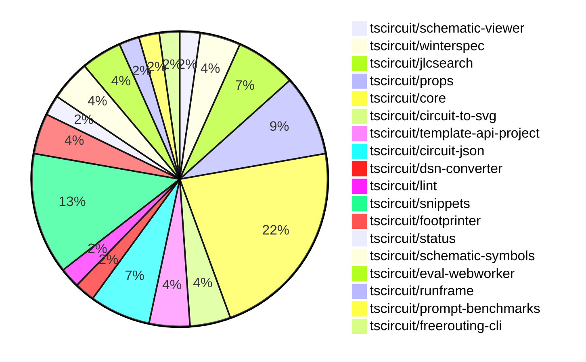

# Contribution Overview 2024-12-18

## PRs by Repository

## Contributor Overview

| Contributor | 🐳 Major | 🐙 Minor | 🐌 Tiny | ⭐ | Issues Created |
|-------------|---------|---------|---------|-----|----------------|
| [seveibar](#seveibar) | 4 | 9 | 0 | 👑 | 55 |
| [imrishabh18](#imrishabh18) | 0 | 7 | 0 | ⭐⭐ | 12 |
| [techmannih](#techmannih) | 1 | 6 | 0 | ⭐⭐ | 0 |
| [devin-ai-integration[bot]](#devin-ai-integration[bot]) | 1 | 5 | 0 | ⭐⭐ | 0 |
| [rohittcodes](#rohittcodes) | 0 | 3 | 0 | ⭐ | 3 |
| [Abse2001](#Abse2001) | 0 | 4 | 0 | ⭐ | 0 |
| [ShiboSoftwareDev](#ShiboSoftwareDev) | 2 | 0 | 0 | ⭐ | 0 |
| [AnasSarkiz](#AnasSarkiz) | 1 | 1 | 0 | ⭐ | 0 |
| [Anshgrover23](#Anshgrover23) | 1 | 0 | 0 | ⭐ | 2 |

## Review Table

[reviews-received-hover]: ## "Number of reviews received for PRs for this contributor"
[approvals-received-hover]: ## "Number of approvals received for PRs this contributor authored"
[rejections-received-hover]: ## "Number of rejections received for PRs this contributor authored"
[prs-opened-hover]: ## "Number of PRs opened by this contributor"
[issues-created-hover]: ## "Number of issues created by this contributor"
[bountied-issues-hover]: ## "Number of issues this contributor created with a bounty"
[bountied-issue-$-hover]: ## "Total bounty amount placed on issues authored by this contributor"

| Contributor | Reviews Received | Approvals Received | Rejections Received | PRs Opened | PRs Merged | Issues Created | Bountied Issues | Bountied Issue $ |
|---|---|---|---|---|---|---|---|---|
| [seveibar](#seveibar) | 1 | 1 | 0 | 15 | 13 | 55 | 17 | 447 |
| [Anshgrover23](#Anshgrover23) | 25 | 1 | 7 | 4 | 1 | 2 | 0 | 0 |
| [Abse2001](#Abse2001) | 14 | 4 | 1 | 6 | 4 | 0 | 0 | 0 |
| [rohittcodes](#rohittcodes) | 6 | 4 | 0 | 4 | 3 | 3 | 2 | 20 |
| [devin-ai-integration[bot]](#devin-ai-integration[bot]) | 7 | 5 | 1 | 10 | 6 | 0 | 0 | 0 |
| [techmannih](#techmannih) | 24 | 11 | 7 | 10 | 7 | 0 | 0 | 0 |
| [AnasSarkiz](#AnasSarkiz) | 7 | 3 | 0 | 3 | 2 | 0 | 0 | 0 |
| [imrishabh18](#imrishabh18) | 8 | 3 | 0 | 8 | 7 | 12 | 3 | 30 |
| [Niharika0104](#Niharika0104) | 2 | 0 | 1 | 1 | 0 | 1 | 0 | 0 |
| [DrSensor](#DrSensor) | 0 | 0 | 0 | 1 | 0 | 0 | 0 | 0 |
| [ShiboSoftwareDev](#ShiboSoftwareDev) | 2 | 2 | 0 | 2 | 2 | 0 | 0 | 0 |

## Changes by Repository

### [tscircuit/schematic-viewer](https://github.com/tscircuit/schematic-viewer)

| PR # | Impact | Contributor | Description |
|------|--------|-------------|-------------|
| [#73](https://github.com/tscircuit/schematic-viewer/pull/73) | 🐳 Major | seveibar | Adds support for drag-and-drop editing of components in the circuit editor. |

### [tscircuit/winterspec](https://github.com/tscircuit/winterspec)

| PR # | Impact | Contributor | Description |
|------|--------|-------------|-------------|
| [#25](https://github.com/tscircuit/winterspec/pull/25) | 🐳 Major | seveibar | Ports the CLI to Commander, adds lots of debug, and when in Bun, avoids bundleRequire. |
| [#24](https://github.com/tscircuit/winterspec/pull/24) | 🐙 Minor | seveibar | Adds exports for new middleware functions `withCtxError` and `withRequestLogging` to the middleware index file. |

### [tscircuit/jlcsearch](https://github.com/tscircuit/jlcsearch)

| PR # | Impact | Contributor | Description |
|------|--------|-------------|-------------|
| [#5](https://github.com/tscircuit/jlcsearch/pull/5) | 🐳 Major | seveibar | Adds LED driver table and API endpoint |
| [#3](https://github.com/tscircuit/jlcsearch/pull/3) | 🐳 Major | seveibar | Added voltage regulators, healthcheck, workflows for testing, and format checking. |
| [#4](https://github.com/tscircuit/jlcsearch/pull/4) | 🐳 Major | devin-ai-integration[bot] | Added JSON support to all remaining endpoints (voltage regulators, microcontrollers, categories, components, and analog multiplexers) with proper tests and formatting. |

### [tscircuit/props](https://github.com/tscircuit/props)

| PR # | Impact | Contributor | Description |
|------|--------|-------------|-------------|
| [#121](https://github.com/tscircuit/props/pull/121) | 🐙 Minor | seveibar | Fix exports to include manual edit events and improve consistency of edit event type property for PCB trace hint. |
| [#124](https://github.com/tscircuit/props/pull/124) | 🐙 Minor | devin-ai-integration[bot] | Rename `manual_edit_file` to `manual_edits_file` for consistency with the interface name `ManualEditsFile`. |
| [#122](https://github.com/tscircuit/props/pull/122) | 🐙 Minor | devin-ai-integration[bot] | Add TypeScript interface definition for ManualEditsFile to match existing Zod schema |
| [#119](https://github.com/tscircuit/props/pull/119) | 🐙 Minor | techmannih | Add resonator component props and validation |

### [tscircuit/core](https://github.com/tscircuit/core)

| PR # | Impact | Contributor | Description |
|------|--------|-------------|-------------|
| [#428](https://github.com/tscircuit/core/pull/428) | 🐳 Major | techmannih | Add a new silkscreen line component to the library. |
| [#447](https://github.com/tscircuit/core/pull/447) | 🐙 Minor | seveibar | Fix the position of schematic components when there are group offsets for symbols. |
| [#439](https://github.com/tscircuit/core/pull/439) | 🐙 Minor | seveibar | Adds the `applyEditEventsToManualEditsFile` function to apply edit events to a manual edits file. |
| [#436](https://github.com/tscircuit/core/pull/436) | 🐙 Minor | seveibar | Rename "eval_error" event to "external:evalError" event. |
| [#444](https://github.com/tscircuit/core/pull/444) | 🐙 Minor | Abse2001 | Add `ccw_rotation` field to `SilkscreenText` component |
| [#424](https://github.com/tscircuit/core/pull/424) | 🐙 Minor | techmannih | Set up continuous branch release with pkg-pr-new |
| [#443](https://github.com/tscircuit/core/pull/443) | 🐙 Minor | AnasSarkiz | Changed the value of `schematic_component_id` of `component_name_text` to fix an issue. |
| [#449](https://github.com/tscircuit/core/pull/449) | 🐙 Minor | imrishabh18 | The pull request adds a new test case to check the transform for a connected resistor and capacitor inside a group. |
| [#437](https://github.com/tscircuit/core/pull/437) | 🐙 Minor | imrishabh18 | Updates the project's lockfile to ensure dependency versions are consistent across different environments. |
| [#430](https://github.com/tscircuit/core/pull/430) | 🐙 Minor | imrishabh18 | Adds a new event type "eval_error" to the Circuit class. |

### [tscircuit/circuit-to-svg](https://github.com/tscircuit/circuit-to-svg)

| PR # | Impact | Contributor | Description |
|------|--------|-------------|-------------|
| [#151](https://github.com/tscircuit/circuit-to-svg/pull/151) | 🐙 Minor | seveibar | Adds support for computing schematic transform and placing it on the SVG as a `data-real-to-screen-transform` attribute. |
| [#150](https://github.com/tscircuit/circuit-to-svg/pull/150) | 🐙 Minor | seveibar | Added "data-circuit-json-type" and "data-schematic-trace-id" attributes to the SVG object representing a schematic trace. |

### [tscircuit/template-api-project](https://github.com/tscircuit/template-api-project)

| PR # | Impact | Contributor | Description |
|------|--------|-------------|-------------|
| [#3](https://github.com/tscircuit/template-api-project/pull/3) | 🐙 Minor | seveibar | Adds GitHub Actions workflows for running format checks, type checks, and tests on the project. |
| [#2](https://github.com/tscircuit/template-api-project/pull/2) | 🐙 Minor | seveibar | Adds pglite for development |

### [tscircuit/circuit-json](https://github.com/tscircuit/circuit-json)

| PR # | Impact | Contributor | Description |
|------|--------|-------------|-------------|
| [#102](https://github.com/tscircuit/circuit-json/pull/102) | 🐳 Major | Anshgrover23 | Implemented the `source_simple_resonator` feature in the project. |
| [#101](https://github.com/tscircuit/circuit-json/pull/101) | 🐙 Minor | Abse2001 | Added an optional `ccw_rotation` field to the `pcb_silkscreen_text` type. |
| [#100](https://github.com/tscircuit/circuit-json/pull/100) | 🐙 Minor | rohittcodes | Adds support for parsing "KΩ" and "KV" units for resistors and voltages. |

### [tscircuit/dsn-converter](https://github.com/tscircuit/dsn-converter)

| PR # | Impact | Contributor | Description |
|------|--------|-------------|-------------|
| [#71](https://github.com/tscircuit/dsn-converter/pull/71) | 🐙 Minor | Abse2001 | The pull request changes the behavior of the `processPin` and `processVis` functions to now throw a warning in the console instead of an error when a node fails to parse correctly. |

### [tscircuit/lint](https://github.com/tscircuit/lint)

| PR # | Impact | Contributor | Description |
|------|--------|-------------|-------------|
| [#1](https://github.com/tscircuit/lint/pull/1) | 🐙 Minor | Abse2001 | This pull request adds a custom ESLint plugin for TSCircuit projects, including two rules: "banned-words" to prevent the use of generic variable names, and "two-params" to enforce a maximum of two parameters in functions. |

### [tscircuit/snippets](https://github.com/tscircuit/snippets)

| PR # | Impact | Contributor | Description |
|------|--------|-------------|-------------|
| [#406](https://github.com/tscircuit/snippets/pull/406) | 🐙 Minor | rohittcodes | Adds a new dialog component to edit the description of a snippet. |
| [#386](https://github.com/tscircuit/snippets/pull/386) | 🐙 Minor | rohittcodes | Adds an error message and a way to manually import the "manual-edits.json" file in the code editor. |
| [#398](https://github.com/tscircuit/snippets/pull/398) | 🐙 Minor | devin-ai-integration[bot] | Add a new USB-C LED Flashlight template |
| [#407](https://github.com/tscircuit/snippets/pull/407) | 🐙 Minor | techmannih | Update the blinking LED circuit template to use a larger board size and fix the resistance value for resistor R3. |
| [#343](https://github.com/tscircuit/snippets/pull/343) | 🐙 Minor | techmannih | Adds a new blinking LED board template to the project. |
| [#393](https://github.com/tscircuit/snippets/pull/393) | 🐙 Minor | imrishabh18 | Update the `@tscircuit/pcb-viewer` dependency to version `1.10.22`. |

### [tscircuit/footprinter](https://github.com/tscircuit/footprinter)

| PR # | Impact | Contributor | Description |
|------|--------|-------------|-------------|
| [#98](https://github.com/tscircuit/footprinter/pull/98) | 🐳 Major | AnasSarkiz | Introduces a new footprint type called `breakoutheaders`. |
| [#100](https://github.com/tscircuit/footprinter/pull/100) | 🐙 Minor | devin-ai-integration[bot] | Fix inner/outer diameter ratio in DIP footprint to match recommended 1.5mm outer diameter. |

### [tscircuit/status](https://github.com/tscircuit/status)

| PR # | Impact | Contributor | Description |
|------|--------|-------------|-------------|
| [#5](https://github.com/tscircuit/status/pull/5) | 🐙 Minor | devin-ai-integration[bot] | Improve timestamp sorting and add detailed timestamps to tooltips in status bars |

### [tscircuit/schematic-symbols](https://github.com/tscircuit/schematic-symbols)

| PR # | Impact | Contributor | Description |
|------|--------|-------------|-------------|
| [#229](https://github.com/tscircuit/schematic-symbols/pull/229) | 🐙 Minor | techmannih | Add a new DPDT (Double Pole Double Throw) switch symbol. |
| [#228](https://github.com/tscircuit/schematic-symbols/pull/228) | 🐙 Minor | techmannih | Fix the coordinates of the anchors on the resonator image. |

### [tscircuit/eval-webworker](https://github.com/tscircuit/eval-webworker)

| PR # | Impact | Contributor | Description |
|------|--------|-------------|-------------|
| [#42](https://github.com/tscircuit/eval-webworker/pull/42) | 🐙 Minor | imrishabh18 | Reverts the changes to the `emitError` function in the `InternalWebWorkerApi` type and the corresponding implementation. |
| [#33](https://github.com/tscircuit/eval-webworker/pull/33) | 🐙 Minor | imrishabh18 | Adds an `emitError` function to the `InternalWebWorkerApi` interface and the `webWorkerApi` object to emit errors during code execution. |

### [tscircuit/runframe](https://github.com/tscircuit/runframe)

| PR # | Impact | Contributor | Description |
|------|--------|-------------|-------------|
| [#19](https://github.com/tscircuit/runframe/pull/19) | 🐙 Minor | imrishabh18 | Adds error handling in the RunFrame component to display the error message in the tab. |

### [tscircuit/prompt-benchmarks](https://github.com/tscircuit/prompt-benchmarks)

| PR # | Impact | Contributor | Description |
|------|--------|-------------|-------------|
| [#12](https://github.com/tscircuit/prompt-benchmarks/pull/12) | 🐳 Major | ShiboSoftwareDev | Refactored the evalite benchmark to use a new architecture suggested by Matt. |

### [tscircuit/freerouting-cli](https://github.com/tscircuit/freerouting-cli)

| PR # | Impact | Contributor | Description |
|------|--------|-------------|-------------|
| [#5](https://github.com/tscircuit/freerouting-cli/pull/5) | 🐳 Major | ShiboSoftwareDev | Adds a test suite to verify the functionality of the freerouting CLI, including the ability to create sessions, jobs, and handle system status and configuration operations. |

## Changes by Contributor

### [seveibar](https://github.com/seveibar)

| PR # | Impact | Description |
|------|--------|-------------|
| [#73](https://github.com/tscircuit/schematic-viewer/pull/73) | 🐳 Major | Adds support for drag-and-drop editing of components in the circuit editor. |
| [#25](https://github.com/tscircuit/winterspec/pull/25) | 🐳 Major | Ports the CLI to Commander, adds lots of debug, and when in Bun, avoids bundleRequire. |
| [#5](https://github.com/tscircuit/jlcsearch/pull/5) | 🐳 Major | Adds LED driver table and API endpoint |
| [#3](https://github.com/tscircuit/jlcsearch/pull/3) | 🐳 Major | Added voltage regulators, healthcheck, workflows for testing, and format checking. |
| [#121](https://github.com/tscircuit/props/pull/121) | 🐙 Minor | Fix exports to include manual edit events and improve consistency of edit event type property for PCB trace hint. |
| [#24](https://github.com/tscircuit/winterspec/pull/24) | 🐙 Minor | Adds exports for new middleware functions `withCtxError` and `withRequestLogging` to the middleware index file. |
| [#447](https://github.com/tscircuit/core/pull/447) | 🐙 Minor | Fix the position of schematic components when there are group offsets for symbols. |
| [#439](https://github.com/tscircuit/core/pull/439) | 🐙 Minor | Adds the `applyEditEventsToManualEditsFile` function to apply edit events to a manual edits file. |
| [#436](https://github.com/tscircuit/core/pull/436) | 🐙 Minor | Rename "eval_error" event to "external:evalError" event. |
| [#151](https://github.com/tscircuit/circuit-to-svg/pull/151) | 🐙 Minor | Adds support for computing schematic transform and placing it on the SVG as a `data-real-to-screen-transform` attribute. |
| [#150](https://github.com/tscircuit/circuit-to-svg/pull/150) | 🐙 Minor | Added "data-circuit-json-type" and "data-schematic-trace-id" attributes to the SVG object representing a schematic trace. |
| [#3](https://github.com/tscircuit/template-api-project/pull/3) | 🐙 Minor | Adds GitHub Actions workflows for running format checks, type checks, and tests on the project. |
| [#2](https://github.com/tscircuit/template-api-project/pull/2) | 🐙 Minor | Adds pglite for development |

### [Anshgrover23](https://github.com/Anshgrover23)

| PR # | Impact | Description |
|------|--------|-------------|
| [#102](https://github.com/tscircuit/circuit-json/pull/102) | 🐳 Major | Implemented the `source_simple_resonator` feature in the project. |

### [Abse2001](https://github.com/Abse2001)

| PR # | Impact | Description |
|------|--------|-------------|
| [#101](https://github.com/tscircuit/circuit-json/pull/101) | 🐙 Minor | Added an optional `ccw_rotation` field to the `pcb_silkscreen_text` type. |
| [#444](https://github.com/tscircuit/core/pull/444) | 🐙 Minor | Add `ccw_rotation` field to `SilkscreenText` component |
| [#71](https://github.com/tscircuit/dsn-converter/pull/71) | 🐙 Minor | The pull request changes the behavior of the `processPin` and `processVis` functions to now throw a warning in the console instead of an error when a node fails to parse correctly. |
| [#1](https://github.com/tscircuit/lint/pull/1) | 🐙 Minor | This pull request adds a custom ESLint plugin for TSCircuit projects, including two rules: "banned-words" to prevent the use of generic variable names, and "two-params" to enforce a maximum of two parameters in functions. |

### [rohittcodes](https://github.com/rohittcodes)

| PR # | Impact | Description |
|------|--------|-------------|
| [#100](https://github.com/tscircuit/circuit-json/pull/100) | 🐙 Minor | Adds support for parsing "KΩ" and "KV" units for resistors and voltages. |
| [#406](https://github.com/tscircuit/snippets/pull/406) | 🐙 Minor | Adds a new dialog component to edit the description of a snippet. |
| [#386](https://github.com/tscircuit/snippets/pull/386) | 🐙 Minor | Adds an error message and a way to manually import the "manual-edits.json" file in the code editor. |

### [devin-ai-integration[bot]](https://github.com/devin-ai-integration[bot])

| PR # | Impact | Description |
|------|--------|-------------|
| [#4](https://github.com/tscircuit/jlcsearch/pull/4) | 🐳 Major | Added JSON support to all remaining endpoints (voltage regulators, microcontrollers, categories, components, and analog multiplexers) with proper tests and formatting. |
| [#124](https://github.com/tscircuit/props/pull/124) | 🐙 Minor | Rename `manual_edit_file` to `manual_edits_file` for consistency with the interface name `ManualEditsFile`. |
| [#122](https://github.com/tscircuit/props/pull/122) | 🐙 Minor | Add TypeScript interface definition for ManualEditsFile to match existing Zod schema |
| [#100](https://github.com/tscircuit/footprinter/pull/100) | 🐙 Minor | Fix inner/outer diameter ratio in DIP footprint to match recommended 1.5mm outer diameter. |
| [#398](https://github.com/tscircuit/snippets/pull/398) | 🐙 Minor | Add a new USB-C LED Flashlight template |
| [#5](https://github.com/tscircuit/status/pull/5) | 🐙 Minor | Improve timestamp sorting and add detailed timestamps to tooltips in status bars |

### [techmannih](https://github.com/techmannih)

| PR # | Impact | Description |
|------|--------|-------------|
| [#428](https://github.com/tscircuit/core/pull/428) | 🐳 Major | Add a new silkscreen line component to the library. |
| [#119](https://github.com/tscircuit/props/pull/119) | 🐙 Minor | Add resonator component props and validation |
| [#424](https://github.com/tscircuit/core/pull/424) | 🐙 Minor | Set up continuous branch release with pkg-pr-new |
| [#229](https://github.com/tscircuit/schematic-symbols/pull/229) | 🐙 Minor | Add a new DPDT (Double Pole Double Throw) switch symbol. |
| [#228](https://github.com/tscircuit/schematic-symbols/pull/228) | 🐙 Minor | Fix the coordinates of the anchors on the resonator image. |
| [#407](https://github.com/tscircuit/snippets/pull/407) | 🐙 Minor | Update the blinking LED circuit template to use a larger board size and fix the resistance value for resistor R3. |
| [#343](https://github.com/tscircuit/snippets/pull/343) | 🐙 Minor | Adds a new blinking LED board template to the project. |

### [AnasSarkiz](https://github.com/AnasSarkiz)

| PR # | Impact | Description |
|------|--------|-------------|
| [#98](https://github.com/tscircuit/footprinter/pull/98) | 🐳 Major | Introduces a new footprint type called `breakoutheaders`. |
| [#443](https://github.com/tscircuit/core/pull/443) | 🐙 Minor | Changed the value of `schematic_component_id` of `component_name_text` to fix an issue. |

### [imrishabh18](https://github.com/imrishabh18)

| PR # | Impact | Description |
|------|--------|-------------|
| [#449](https://github.com/tscircuit/core/pull/449) | 🐙 Minor | The pull request adds a new test case to check the transform for a connected resistor and capacitor inside a group. |
| [#437](https://github.com/tscircuit/core/pull/437) | 🐙 Minor | Updates the project's lockfile to ensure dependency versions are consistent across different environments. |
| [#430](https://github.com/tscircuit/core/pull/430) | 🐙 Minor | Adds a new event type "eval_error" to the Circuit class. |
| [#393](https://github.com/tscircuit/snippets/pull/393) | 🐙 Minor | Update the `@tscircuit/pcb-viewer` dependency to version `1.10.22`. |
| [#42](https://github.com/tscircuit/eval-webworker/pull/42) | 🐙 Minor | Reverts the changes to the `emitError` function in the `InternalWebWorkerApi` type and the corresponding implementation. |
| [#33](https://github.com/tscircuit/eval-webworker/pull/33) | 🐙 Minor | Adds an `emitError` function to the `InternalWebWorkerApi` interface and the `webWorkerApi` object to emit errors during code execution. |
| [#19](https://github.com/tscircuit/runframe/pull/19) | 🐙 Minor | Adds error handling in the RunFrame component to display the error message in the tab. |

### [ShiboSoftwareDev](https://github.com/ShiboSoftwareDev)

| PR # | Impact | Description |
|------|--------|-------------|
| [#12](https://github.com/tscircuit/prompt-benchmarks/pull/12) | 🐳 Major | Refactored the evalite benchmark to use a new architecture suggested by Matt. |
| [#5](https://github.com/tscircuit/freerouting-cli/pull/5) | 🐳 Major | Adds a test suite to verify the functionality of the freerouting CLI, including the ability to create sessions, jobs, and handle system status and configuration operations. |

